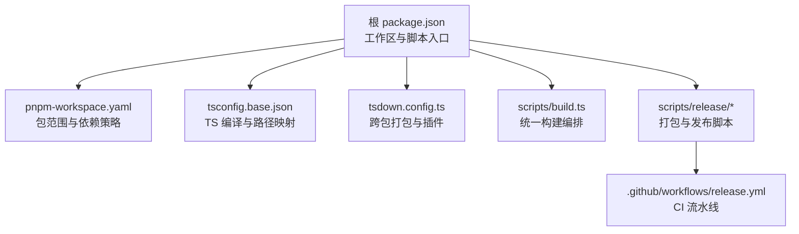
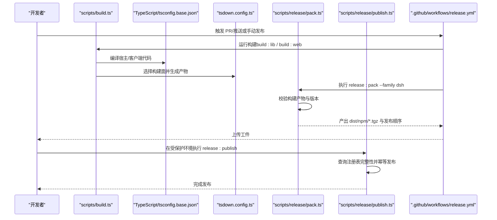
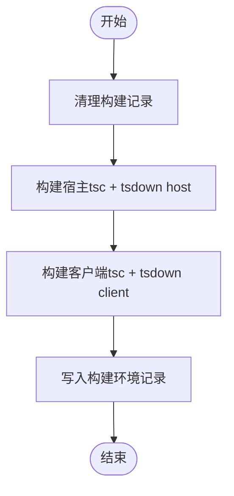
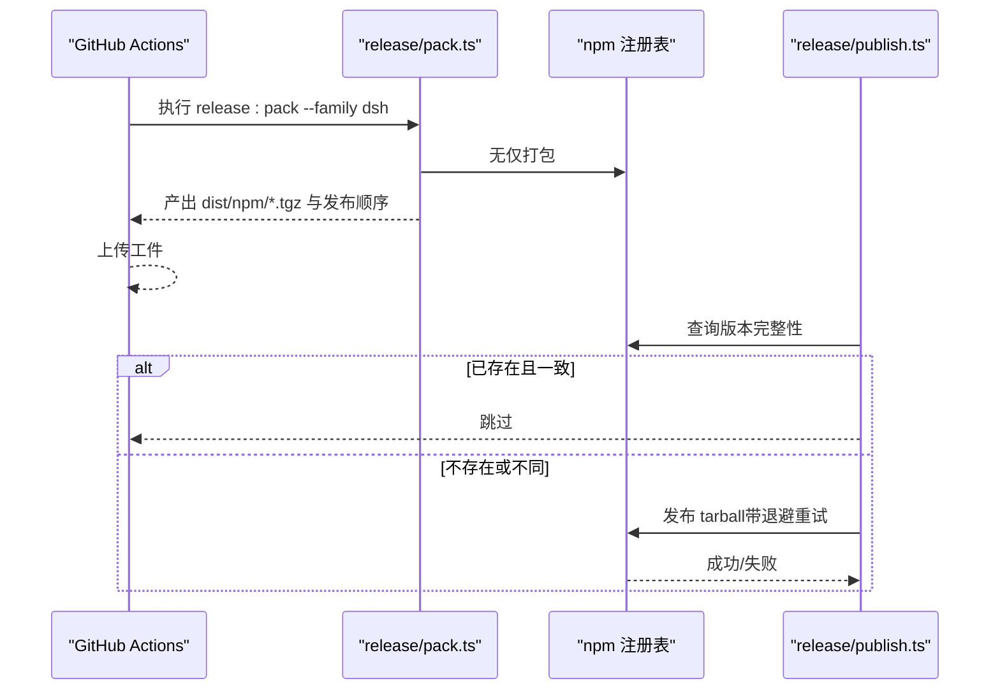
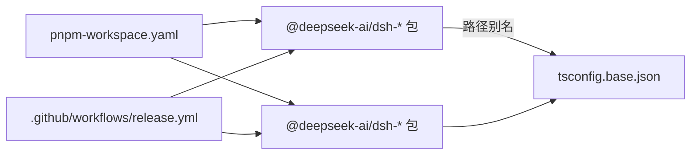

# 包打包与发布

<cite>
**本文引用的文件**
- [package.json](file://package.json)
- [pnpm-workspace.yaml](file://pnpm-workspace.yaml)
- [tsconfig.base.json](file://tsconfig.base.json)
- [tsdown.config.ts](file://tsdown.config.ts)
- [scripts/build.ts](file://scripts/build.ts)
- [scripts/release/pack.ts](file://scripts/release/pack.ts)
- [scripts/release/publish.ts](file://scripts/release/publish.ts)
- [.github/workflows/release.yml](file://.github/workflows/release.yml)
- [scripts/publint-all.ts](file://scripts/publint-all.ts)
- [scripts/verify-package-invariants.ts](file://scripts/verify-package-invariants.ts)
</cite>

## 目录
1. [简介](#简介)
2. [项目结构](#项目结构)
3. [核心组件](#核心组件)
4. [架构总览](#架构总览)
5. [详细组件分析](#详细组件分析)
6. [依赖分析](#依赖分析)
7. [性能考虑](#性能考虑)
8. [故障排查指南](#故障排查指南)
9. [结论](#结论)
10. [附录](#附录)

## 简介
本指南面向 DeepSeek Harness 工作区中的包打包与发布，覆盖以下主题：
- 包的标准化结构与 package.json 必需字段、TypeScript 配置与导出声明
- 构建流程：TypeScript 编译、类型定义生成与文件打包
- npm 发布前验证：依赖检查、代码质量与文档完整性
- 包元数据最佳实践：版本管理、依赖声明与许可证信息
- 自动化发布流程：CI/CD 集成与发布脚本使用

## 项目结构
该仓库采用 pnpm workspace 组织多包工程，顶层 package.json 定义了工作区范围、脚本与工具链；TypeScript 通过共享基础配置与 tsdown 进行跨包构建；发布由 scripts/release 下的脚本驱动，并通过 GitHub Actions 编排。

**图表来源**
- [package.json:1-202](file://package.json#L1-L202)
- [pnpm-workspace.yaml:1-83](file://pnpm-workspace.yaml#L1-L83)
- [tsconfig.base.json:1-458](file://tsconfig.base.json#L1-L458)
- [tsdown.config.ts:1-31](file://tsdown.config.ts#L1-L31)
- [scripts/build.ts:1-53](file://scripts/build.ts#L1-L53)
- [scripts/release/pack.ts:1-89](file://scripts/release/pack.ts#L1-L89)
- [scripts/release/publish.ts:1-184](file://scripts/release/publish.ts#L1-L184)
- [.github/workflows/release.yml:1-141](file://.github/workflows/release.yml#L1-L141)

**章节来源**
- [package.json:1-202](file://package.json#L1-L202)
- [pnpm-workspace.yaml:1-83](file://pnpm-workspace.yaml#L1-L83)

## 核心组件
- 工作区与包范围：通过 pnpm-workspace.yaml 声明 vendor、packages、apps、website 等子目录为工作区成员，并启用 linkWorkspacePackages 保证本地解析一致性。
- TypeScript 编译与类型：tsconfig.base.json 提供全局编译选项（ES2024、模块解析、声明与源映射、严格模式）与大量路径别名，确保跨包引用一致。
- 打包器：tsdown.config.ts 将 host/client 两种构建面统一处理，输出 ESM，并在 host 面启用 Typert 插件生成类型相关产物。
- 构建编排：scripts/build.ts 负责清理记录、调用 build:lib 与 build:web，并写入客户端构建环境记录。
- 发布脚本：scripts/release/pack.ts 按发布顺序并行打包各成员并校验产物；scripts/release/publish.ts 基于 tarball 的完整性与注册表状态安全发布。
- CI 流水线：.github/workflows/release.yml 在 PR 与推送时执行依赖布局验证、构建与打包，产出工件供后续发布。

**章节来源**
- [pnpm-workspace.yaml:1-83](file://pnpm-workspace.yaml#L1-L83)
- [tsconfig.base.json:1-458](file://tsconfig.base.json#L1-L458)
- [tsdown.config.ts:1-31](file://tsdown.config.ts#L1-L31)
- [scripts/build.ts:1-53](file://scripts/build.ts#L1-L53)
- [scripts/release/pack.ts:1-89](file://scripts/release/pack.ts#L1-L89)
- [scripts/release/publish.ts:1-184](file://scripts/release/publish.ts#L1-L184)
- [.github/workflows/release.yml:1-141](file://.github/workflows/release.yml#L1-L141)

## 架构总览
下图展示从源码到可发布 tarball 的关键步骤与职责边界：

**图表来源**
- [scripts/build.ts:1-53](file://scripts/build.ts#L1-L53)
- [tsconfig.base.json:1-458](file://tsconfig.base.json#L1-L458)
- [tsdown.config.ts:1-31](file://tsdown.config.ts#L1-L31)
- [scripts/release/pack.ts:1-89](file://scripts/release/pack.ts#L1-L89)
- [scripts/release/publish.ts:1-184](file://scripts/release/publish.ts#L1-L184)
- [.github/workflows/release.yml:1-141](file://.github/workflows/release.yml#L1-L141)

## 详细组件分析

### 包结构与 package.json 规范
- 工作区成员：所有需要发布的包位于 packages/*/*/ 下，每个包拥有独立的 package.json。
- 必需字段建议：
  - name：唯一包名，遵循 @deepseek-ai/dsh-* 命名约定
  - version：语义化版本，遵循发布家族规则
  - main/module/types：指向宿主/客户端入口与类型声明
  - files：精确声明发布内容，避免多余文件进入包
  - license：明确许可证标识
  - engines：限定 Node 版本范围
  - peerDependencies/dependencies：区分运行时与开发依赖
- 导出声明：
  - 宿主侧：通过 lib/types/{index,invariant,startup}.js 暴露公共 API
  - 客户端侧：由 tsdown 根据包内配置生成浏览器产物
- 路径与别名：tsconfig.base.json 中集中维护路径映射，保证跨包引用稳定

**章节来源**
- [package.json:1-202](file://package.json#L1-L202)
- [tsconfig.base.json:1-458](file://tsconfig.base.json#L1-L458)
- [tsdown.config.ts:1-31](file://tsdown.config.ts#L1-L31)

### TypeScript 配置与导出
- 编译目标与模块：es2024 + esnext，模块解析采用 bundler 模式，便于现代工具链协作
- 类型与调试：开启 declaration、declarationMap、sourceMap，提升类型体验与调试能力
- 严格性与一致性：strict、noUnusedLocals、noUnusedParameters 等保障代码质量
- 路径别名：集中管理内部包与 vendor 包的路径映射，减少硬编码相对路径
- 导出面：host 面通过 tsdown 输出 types 入口；client 面由 tsdown 根据包配置生成浏览器产物

**章节来源**
- [tsconfig.base.json:1-458](file://tsconfig.base.json#L1-L458)
- [tsdown.config.ts:1-31](file://tsdown.config.ts#L1-L31)

### 构建流程
- 统一入口：scripts/build.ts 负责清理构建记录、设置环境变量、依次执行宿主与客户端构建
- 宿主构建：tsc 编译后由 tsdown 处理 host 面，并启用 Typert 插件生成类型相关产物
- 客户端构建：tsc 编译后由 tsdown 处理 client 面，生成浏览器可用产物
- 构建记录：写入客户端构建环境记录，便于后续验证与复现

**图表来源**
- [scripts/build.ts:1-53](file://scripts/build.ts#L1-L53)
- [tsdown.config.ts:1-31](file://tsdown.config.ts#L1-L31)

**章节来源**
- [scripts/build.ts:1-53](file://scripts/build.ts#L1-L53)
- [tsdown.config.ts:1-31](file://tsdown.config.ts#L1-L31)

### 打包与发布流程
- 打包阶段：scripts/release/pack.ts 按发布顺序并发打包各成员，校验产物完整性并记录发布顺序
- 发布阶段：scripts/release/publish.ts 读取已打包的 tarball 列表，查询注册表状态，基于完整性比较实现幂等发布，并对瞬态错误进行退避重试
- CI 集成：.github/workflows/release.yml 在 PR/推送时执行依赖布局验证、构建与打包，产出工件；发布需手动触发并具备受保护环境

**图表来源**
- [scripts/release/pack.ts:1-89](file://scripts/release/pack.ts#L1-L89)
- [scripts/release/publish.ts:1-184](file://scripts/release/publish.ts#L1-L184)
- [.github/workflows/release.yml:1-141](file://.github/workflows/release.yml#L1-L141)

**章节来源**
- [scripts/release/pack.ts:1-89](file://scripts/release/pack.ts#L1-L89)
- [scripts/release/publish.ts:1-184](file://scripts/release/publish.ts#L1-L184)
- [.github/workflows/release.yml:1-141](file://.github/workflows/release.yml#L1-L141)

### 发布前验证
- 依赖布局与安装布局：CI 中执行 verify-package-dependencies 与 verify-npm-install-layout，确保依赖策略与安装结果符合预期
- 包清单与闭包完整性：publint-all.ts 对每个包的实际发布视图进行检查，包括 README/LICENCE/CHANGELOG 等常见文件，以及 JS 模块相对导入的闭包缺失问题
- 包不变量：verify-package-invariants.ts 校验包级不变量与配套文件的归属关系
- 构建产物验证：pack.ts 在打包阶段会验证构建产物是否存在并符合预期

**章节来源**
- [.github/workflows/release.yml:1-141](file://.github/workflows/release.yml#L1-L141)
- [scripts/publint-all.ts:1-261](file://scripts/publint-all.ts#L1-L261)
- [scripts/verify-package-invariants.ts:1-22](file://scripts/verify-package-invariants.ts#L1-L22)
- [scripts/release/pack.ts:1-89](file://scripts/release/pack.ts#L1-L89)

### 包元数据最佳实践
- 版本管理：遵循语义化版本，结合发布家族的版本规则；发布脚本会校验版本一致性
- 依赖声明：区分 dependencies、peerDependencies、devDependencies；避免将宿主/客户端无关依赖带入包
- 许可证信息：在 package.json 中明确 license，并确保 LICENSE 文件存在于发布视图中
- 引擎限制：通过 engines 指定支持的 Node 版本范围，避免不兼容环境
- 发布内容：files 字段精确控制纳入包的文件，减少体积与潜在风险

**章节来源**
- [package.json:1-202](file://package.json#L1-L202)
- [scripts/release/pack.ts:1-89](file://scripts/release/pack.ts#L1-L89)
- [scripts/publint-all.ts:1-261](file://scripts/publint-all.ts#L1-L261)

### 自动化发布流程（CI/CD）
- 触发条件：PR 与 master 推送自动执行依赖验证、构建与打包；发布需手动 workflow_dispatch 并具备受保护环境
- 关键步骤：
  - 安装依赖（冻结锁文件）
  - 验证依赖策略与安装布局
  - 构建官方产物（build:official）
  - 打包发布序列（release:pack）
  - 验证打包后可安装性（release:verify-packed-install）
  - 上传工件供后续发布使用
- 发布阶段：在具备 npm-publish 环境的分支或标签上执行 release:publish，基于 tarball 完整性与注册表状态安全发布

**章节来源**
- [.github/workflows/release.yml:1-141](file://.github/workflows/release.yml#L1-L141)
- [scripts/release/pack.ts:1-89](file://scripts/release/pack.ts#L1-L89)
- [scripts/release/publish.ts:1-184](file://scripts/release/publish.ts#L1-L184)

## 依赖分析
- 工作区依赖：pnpm-workspace.yaml 统一管理 vendor、packages、apps、website 等子目录，linkWorkspacePackages 保证本地解析一致
- 依赖策略：overrides 与 allowBuilds 严格控制第三方包与构建脚本，最小化供应链风险
- 包间耦合：tsconfig.base.json 中的路径别名集中管理内部包引用，降低耦合度并提高可维护性
- 外部集成：CI 通过 GitHub Actions 与 pnpm/action-setup、actions/setup-node 等动作协同完成构建与发布

**图表来源**
- [pnpm-workspace.yaml:1-83](file://pnpm-workspace.yaml#L1-L83)
- [tsconfig.base.json:1-458](file://tsconfig.base.json#L1-L458)
- [.github/workflows/release.yml:1-141](file://.github/workflows/release.yml#L1-L141)

**章节来源**
- [pnpm-workspace.yaml:1-83](file://pnpm-workspace.yaml#L1-L83)
- [tsconfig.base.json:1-458](file://tsconfig.base.json#L1-L458)
- [.github/workflows/release.yml:1-141](file://.github/workflows/release.yml#L1-L141)

## 性能考虑
- 并发打包：release:pack 支持 --concurrency 参数，可在 CI 中适度提升打包速度；发布阶段保持串行以避免注册表竞争
- 增量编译：启用 TypeScript 增量与复合项目，缩短构建时间
- 缓存策略：CI 中缓存 pnpm store，减少依赖安装时间
- 产物优化：通过 tsdown 的 ESM 输出与按需插件，减少不必要代码进入包

[本节为通用指导，无需特定文件来源]

## 故障排查指南
- 依赖布局错误：检查 pnpm-workspace.yaml 与 overrides/allowBuilds 配置，确保新增依赖被正确允许
- 构建失败：确认 tsconfig.base.json 路径别名与包入口一致；检查 tsdown 构建面（host/client）是否正确
- 打包缺失：release:pack 会校验产物是否存在；若缺失，检查包内构建脚本与 files 字段
- 发布失败：release:publish 会查询注册表完整性；若不一致，需调整版本或修复构建可重复性；瞬态错误会自动重试
- 清单问题：publint-all 报告相对导入未发布或格式问题；修正 files 与导出入口

**章节来源**
- [scripts/release/pack.ts:1-89](file://scripts/release/pack.ts#L1-L89)
- [scripts/release/publish.ts:1-184](file://scripts/release/publish.ts#L1-L184)
- [scripts/publint-all.ts:1-261](file://scripts/publint-all.ts#L1-L261)

## 结论
DeepSeek Harness 的包打包与发布体系以 pnpm workspace 为基础，结合 TypeScript 与 tsdown 的统一构建，配合 scripts/release 的严谨打包与幂等发布逻辑，以及 GitHub Actions 的 CI/CD 编排，实现了高可靠、可审计、可复现的发布流程。遵循本文档的结构与最佳实践，可确保包的质量与发布的安全性。

[本节为总结，无需特定文件来源]

## 附录
- 常用命令参考：
  - 构建：pnpm run build / build:lib / build:web
  - 验证：pnpm run publint / verify-package-invariants
  - 打包：pnpm run release:pack --family dsh
  - 发布：pnpm run release:publish --family dsh --from dist/npm
- 注意事项：
  - 发布需在受保护环境执行，避免凭据泄露
  - 版本号与构建产物必须保持一致，否则发布将失败
  - 变更依赖或构建脚本后，务必重新运行验证与打包

[本节为补充信息，无需特定文件来源]