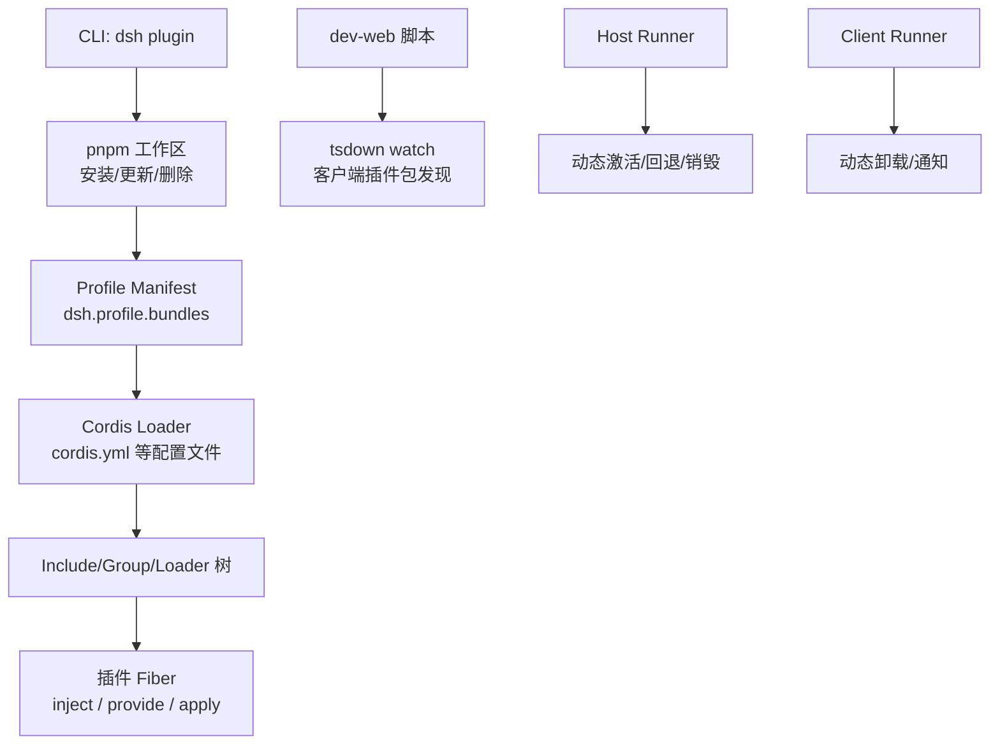
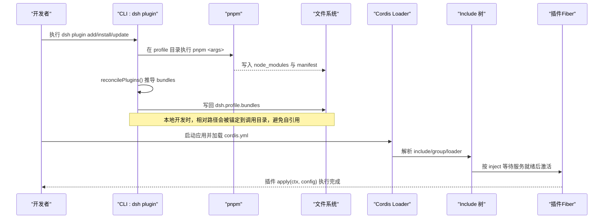
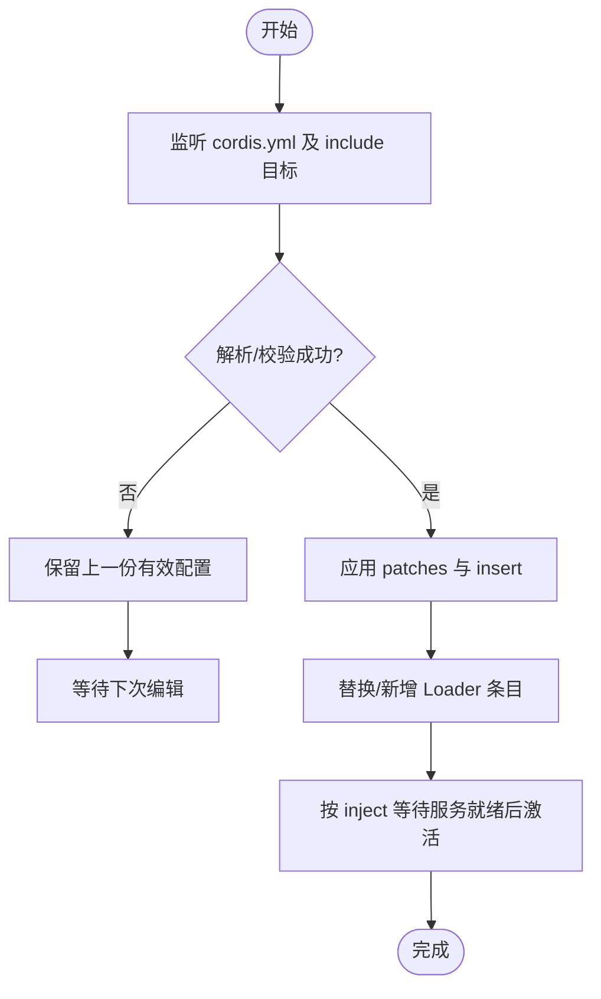
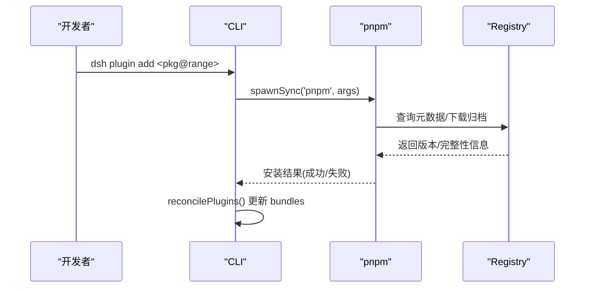
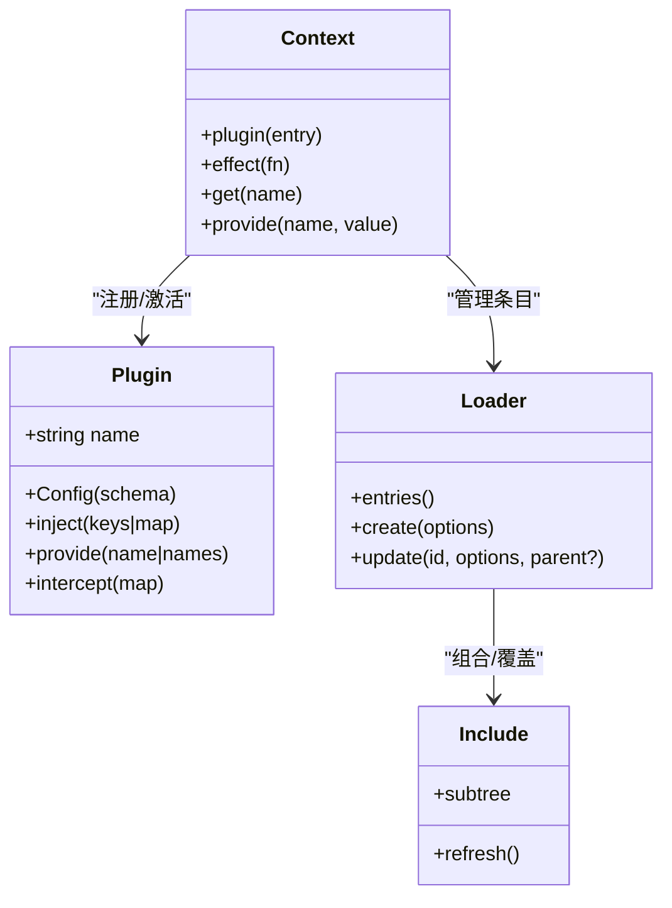
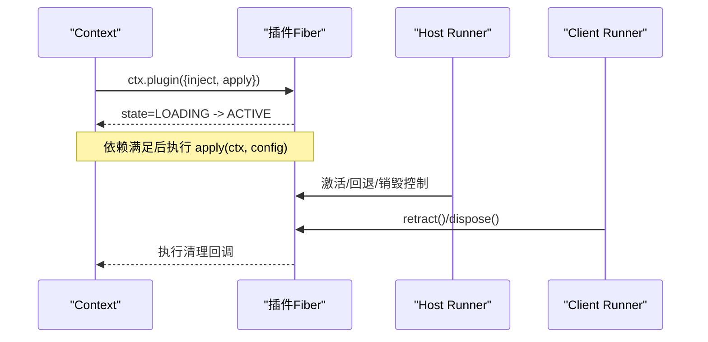
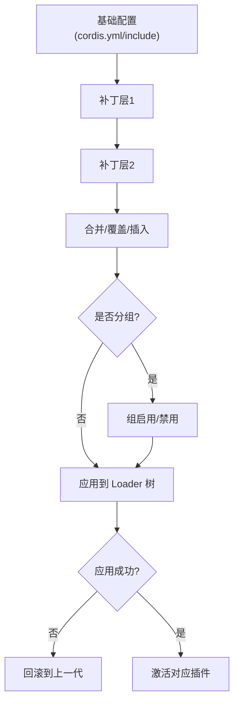
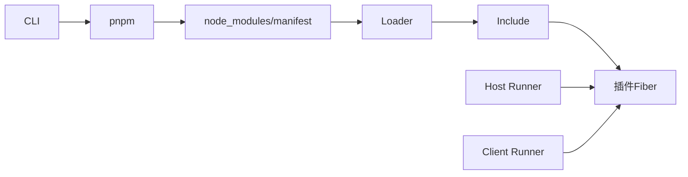

# 安装与注册机制

<cite>
**本文引用的文件**
- [apps/cli/src/plugin.ts](file://apps/cli/src/plugin.ts)
- [scripts/dev-web.ts](file://scripts/dev-web.ts)
- [packages/boot/app-boot/tests/config-reload.spec.ts](file://packages/boot/app-boot/tests/config-reload.spec.ts)
- [packages/boot/app-boot/tests/hmr-config.spec.ts](file://packages/boot/app-boot/tests/hmr-config.spec.ts)
- [scripts/cordis-config-files.ts](file://scripts/cordis-config-files.ts)
- [packages/extensions/tool-cordis/tests/cordis-lifecycle.spec.ts](file://packages/extensions/tool-cordis/tests/cordis-lifecycle.spec.ts)
- [packages/extensions/cordis-host-runner/src/index.ts](file://packages/extensions/cordis-host-runner/src/index.ts)
- [packages/extensions/cordis-client-runner/src/client/runtime.ts](file://packages/extensions/cordis-client-runner/src/client/runtime.ts)
- [docs/cordis-api/registry.zh.md](file://docs/cordis-api/registry.zh.md)
</cite>

## 目录
1. [简介](#简介)
2. [项目结构](#项目结构)
3. [核心组件](#核心组件)
4. [架构总览](#架构总览)
5. [详细组件分析](#详细组件分析)
6. [依赖关系分析](#依赖关系分析)
7. [性能考量](#性能考量)
8. [故障排查指南](#故障排查指南)
9. [结论](#结论)
10. [附录](#附录)

## 简介
本文件面向插件的安装、发现、加载与生命周期管理，覆盖以下主题：
- 本地开发环境下的插件安装方式：pnpm工作区包链接与热重载（HMR）机制。
- 远程插件的安装流程：npm包解析、依赖安装与版本验证。
- 插件的发现与加载过程：命名空间解析、配置文件合并与服务注册。
- 插件生命周期管理：初始化、激活与销毁。
- 插件配置的优先级规则与覆盖机制。

## 项目结构
仓库采用多包工作区组织，插件相关能力分布在CLI入口、构建脚本、引导与运行时、以及Cordis插件框架文档中：
- CLI负责profile内插件的包管理与层清单同步。
- 开发脚本负责客户端插件包的发现与watch构建。
- 引导测试覆盖配置热更新与包含树刷新。
- Cordis文档定义插件接口、注入与服务模型。
- 宿主/客户端运行器实现动态插件的激活与卸载。

图表来源
- [apps/cli/src/plugin.ts:47-91](file://apps/cli/src/plugin.ts#L47-L91)
- [scripts/dev-web.ts:70-86](file://scripts/dev-web.ts#L70-L86)
- [packages/extensions/cordis-host-runner/src/index.ts:795-821](file://packages/extensions/cordis-host-runner/src/index.ts#L795-L821)
- [packages/extensions/cordis-client-runner/src/client/runtime.ts:303-331](file://packages/extensions/cordis-client-runner/src/client/runtime.ts#L303-L331)

章节来源
- [apps/cli/src/plugin.ts:1-164](file://apps/cli/src/plugin.ts#L1-L164)
- [scripts/dev-web.ts:70-154](file://scripts/dev-web.ts#L70-L154)

## 核心组件
- CLI插件命令：在profile目录下执行pnpm，并基于已安装的依赖反向推导哪些包声明了bundle特性，从而维护dsh.profile.bundles层列表。
- 开发脚本：扫描packages下声明dsh.client平台为web的包，作为客户端插件包进行watch构建。
- 配置加载与热更新：通过Include/Loader树支持YAML配置的热刷新、补丁叠加与回滚。
- 插件模型：函数/类/对象三种入口，支持name、Config校验、inject依赖、provide服务名、intercept拦截配置声明。
- 宿主/客户端运行器：管理动态插件的激活、回退、销毁与变更通知。

章节来源
- [docs/cordis-api/registry.zh.md:60-155](file://docs/cordis-api/registry.zh.md#L60-L155)
- [packages/extensions/cordis-host-runner/src/index.ts:795-821](file://packages/extensions/cordis-host-runner/src/index.ts#L795-L821)
- [packages/extensions/cordis-client-runner/src/client/runtime.ts:303-331](file://packages/extensions/cordis-client-runner/src/client/runtime.ts#L303-L331)

## 架构总览
下图展示从“安装”到“加载”再到“生命周期”的端到端流程：

图表来源
- [apps/cli/src/plugin.ts:120-163](file://apps/cli/src/plugin.ts#L120-L163)
- [packages/boot/app-boot/tests/config-reload.spec.ts:30-44](file://packages/boot/app-boot/tests/config-reload.spec.ts#L30-L44)
- [docs/cordis-api/registry.zh.md:94-119](file://docs/cordis-api/registry.zh.md#L94-L119)

## 详细组件分析

### 本地开发：pnpm工作区与热重载
- 包链接与工作区
  - CLI在profile目录执行pnpm，将用户传入的参数转发给pnpm；相对路径会被锚定到调用目录，防止误将profile自身作为依赖链接。
  - 安装完成后，CLI根据实际已安装的依赖名称判断是否导出bundle特性，并维护dsh.profile.bundles列表，确保后续加载顺序与存在性。
- 客户端插件Watch构建
  - dev-web脚本扫描packages下声明dsh.client平台为web的包，使用tsdown以workspace模式watch构建，并在初始构建完成后返回bundles集合，供前端消费。
- 配置热重载（HMR）
  - 通过Include/Loader树对cordis.yml及其include目标进行监听；当YAML解析失败或校验失败时保留上一份有效配置，直到下一次编辑成功。
  - 支持overlay patches：每次重读都会重新应用补丁与插入条目，保证与初次加载一致。
  - 支持组禁用/启用时的子项启停与恢复。

图表来源
- [packages/boot/app-boot/tests/config-reload.spec.ts:67-90](file://packages/boot/app-boot/tests/config-reload.spec.ts#L67-L90)
- [packages/boot/app-boot/tests/config-reload.spec.ts:288-346](file://packages/boot/app-boot/tests/config-reload.spec.ts#L288-L346)
- [packages/boot/app-boot/tests/hmr-config.spec.ts:109-137](file://packages/boot/app-boot/tests/hmr-config.spec.ts#L109-L137)

章节来源
- [apps/cli/src/plugin.ts:93-163](file://apps/cli/src/plugin.ts#L93-L163)
- [scripts/dev-web.ts:70-154](file://scripts/dev-web.ts#L70-L154)
- [packages/boot/app-boot/tests/config-reload.spec.ts:67-346](file://packages/boot/app-boot/tests/config-reload.spec.ts#L67-L346)
- [packages/boot/app-boot/tests/hmr-config.spec.ts:109-137](file://packages/boot/app-boot/tests/hmr-config.spec.ts#L109-L137)

### 远程插件：npm包解析、依赖安装与版本验证
- 安装流程
  - 通过CLI转发至pnpm，由pnpm解析远程包名、版本范围与别名，拉取元数据并安装依赖。
  - 若依赖指向git/tarball/alias，pnpm会先解析真实包名，再写入manifest。
- 版本与完整性校验
  - 发布基线工具会查询远端registry的版本与dist-tag，并校验包完整性哈希，确保发布产物一致性。
- 工作区协议转换
  - 基准测试脚本展示了workspace协议到发布范围的转换逻辑，便于理解不同场景下的版本约束。

图表来源
- [apps/cli/src/plugin.ts:120-163](file://apps/cli/src/plugin.ts#L120-L163)
- [scripts/publish-npm-baseline.ts:656-753](file://scripts/publish-npm-baseline.ts#L656-L753)
- [scripts/benchmark-npm-resolution.spec.ts:55-60](file://scripts/benchmark-npm-resolution.spec.ts#L55-L60)

章节来源
- [apps/cli/src/plugin.ts:120-163](file://apps/cli/src/plugin.ts#L120-L163)
- [scripts/publish-npm-baseline.ts:656-753](file://scripts/publish-npm-baseline.ts#L656-L753)
- [scripts/benchmark-npm-resolution.spec.ts:55-60](file://scripts/benchmark-npm-resolution.spec.ts#L55-L60)

### 插件的发现与加载：命名空间、配置合并与服务注册
- 配置文件发现
  - 脚本扫描仓库根下匹配cordis*.yml/yaml的文件，排除翻译侧车与vendor目录，得到Loader输入集合。
- 命名空间与注入
  - 插件可通过inject声明所需服务；数组形式表示无拦截配置，对象形式可映射可选拦截配置。
  - 插件可提供服务名（provide），供其他插件消费。
- 配置合并与覆盖
  - Include树支持patches与insert，允许上层覆盖下层插入的行；禁用组时会停止其子项，重新启用时恢复。
  - 每次include刷新都会重新应用补丁与插入，保持与首次加载一致的语义。

图表来源
- [docs/cordis-api/registry.zh.md:60-155](file://docs/cordis-api/registry.zh.md#L60-L155)
- [scripts/cordis-config-files.ts:1-19](file://scripts/cordis-config-files.ts#L1-L19)
- [packages/boot/app-boot/tests/config-reload.spec.ts:288-346](file://packages/boot/app-boot/tests/config-reload.spec.ts#L288-L346)

章节来源
- [scripts/cordis-config-files.ts:1-19](file://scripts/cordis-config-files.ts#L1-L19)
- [docs/cordis-api/registry.zh.md:60-155](file://docs/cordis-api/registry.zh.md#L60-L155)
- [packages/boot/app-boot/tests/config-reload.spec.ts:288-346](file://packages/boot/app-boot/tests/config-reload.spec.ts#L288-L346)

### 插件生命周期：初始化、激活与销毁
- 初始化与激活
  - 插件以函数/类/对象形式提供apply；在activate前，框架会按inject等待服务就绪。
  - 内部事件internal/plugin可用于在子fiber激活前调整inject或观察状态。
- 销毁与回滚
  - Host Runner在激活过程中记录starting状态，避免重复启动；失败时清理并返回错误。
  - Client Runner支持retract单个包与dispose全部包，触发teardown并通知变更。
- 效果与清理
  - effect注册会在重启/销毁时正确执行清理；在子fiber处于PENDING/LOADING阶段仍可注册effect，但需遵循生命周期约束。

图表来源
- [packages/extensions/tool-cordis/tests/cordis-lifecycle.spec.ts:117-160](file://packages/extensions/tool-cordis/tests/cordis-lifecycle.spec.ts#L117-L160)
- [packages/extensions/cordis-host-runner/src/index.ts:795-821](file://packages/extensions/cordis-host-runner/src/index.ts#L795-L821)
- [packages/extensions/cordis-client-runner/src/client/runtime.ts:303-331](file://packages/extensions/cordis-client-runner/src/client/runtime.ts#L303-L331)

章节来源
- [packages/extensions/tool-cordis/tests/cordis-lifecycle.spec.ts:117-160](file://packages/extensions/tool-cordis/tests/cordis-lifecycle.spec.ts#L117-L160)
- [packages/extensions/cordis-host-runner/src/index.ts:795-821](file://packages/extensions/cordis-host-runner/src/index.ts#L795-L821)
- [packages/extensions/cordis-client-runner/src/client/runtime.ts:303-331](file://packages/extensions/cordis-client-runner/src/client/runtime.ts#L303-L331)

### 配置优先级与覆盖机制
- 基础层与补丁层
  - Include支持path指向基础配置，并通过patches对基础行进行覆盖或插入新行。
  - 多次include刷新会重新应用所有补丁，保证与首次加载一致。
- 多层叠加
  - 多个补丁层可在同一include级别叠加，后一层可修改前一层插入的行，也可禁用某行。
- 组隔离与启停
  - 将一组条目放入group可实现隔离与统一启停；禁用组会停止其子项，重新启用时恢复。
- 直接更新与回滚
  - 对Loader条目的update若失败，会回滚到之前的配置与fiber，保证系统稳定性。

图表来源
- [packages/boot/app-boot/tests/config-reload.spec.ts:288-346](file://packages/boot/app-boot/tests/config-reload.spec.ts#L288-L346)
- [packages/boot/app-boot/tests/config-reload.spec.ts:349-396](file://packages/boot/app-boot/tests/config-reload.spec.ts#L349-L396)
- [packages/boot/app-boot/tests/config-reload.spec.ts:93-177](file://packages/boot/app-boot/tests/config-reload.spec.ts#L93-L177)

章节来源
- [packages/boot/app-boot/tests/config-reload.spec.ts:93-396](file://packages/boot/app-boot/tests/config-reload.spec.ts#L93-L396)

## 依赖关系分析
- CLI与pnpm：CLI仅做参数转发与结果处理，具体解析与安装由pnpm完成。
- Loader与Include：Loader管理条目，Include负责组合与覆盖；两者共同构成插件树的装配与热更新基础。
- 插件与上下文：插件通过inject声明依赖，框架保证在apply时依赖可用；通过provide暴露能力。
- 宿主/客户端运行器：分别负责服务端与客户端的动态插件生命周期管理。

图表来源
- [apps/cli/src/plugin.ts:120-163](file://apps/cli/src/plugin.ts#L120-L163)
- [packages/boot/app-boot/tests/config-reload.spec.ts:30-44](file://packages/boot/app-boot/tests/config-reload.spec.ts#L30-L44)
- [packages/extensions/cordis-host-runner/src/index.ts:795-821](file://packages/extensions/cordis-host-runner/src/index.ts#L795-L821)
- [packages/extensions/cordis-client-runner/src/client/runtime.ts:303-331](file://packages/extensions/cordis-client-runner/src/client/runtime.ts#L303-L331)

章节来源
- [apps/cli/src/plugin.ts:120-163](file://apps/cli/src/plugin.ts#L120-L163)
- [packages/boot/app-boot/tests/config-reload.spec.ts:30-44](file://packages/boot/app-boot/tests/config-reload.spec.ts#L30-L44)

## 性能考量
- 客户端插件watch构建
  - 通过tsdown workspace模式一次性发现并watch多个插件包，减少重复构建开销。
- 配置热更新
  - Include刷新仅在文件变化时触发，且失败时不破坏现有状态，避免频繁重建带来的性能损耗。
- 动态插件激活
  - Host Runner通过starting状态去重，避免并发重复激活；Client Runner批量teardown并通知变更，降低UI抖动。

[本节为通用指导，不直接分析具体文件]

## 故障排查指南
- pnpm未找到或权限问题
  - CLI会检测PATH中是否存在pnpm，并给出明确提示；Windows下需要shell参数以避免安全限制。
- Git托管插件prepare脚本被阻止
  - 若pnpm在安装阶段阻塞prepare脚本，CLI会提示在pnpm-workspace.yaml中添加allowBuilds白名单。
- 配置解析/校验失败
  - Include.refresh()会抛出错误但保留上一份有效配置；检查YAML语法与校验规则，修正后再次刷新。
- 插件激活失败
  - Host Runner会返回invalid-mode或transition-in-flight等错误；检查是否已有激活进行中或模式不匹配。
- 客户端插件卸载
  - 使用retract指定pluginRunId精确卸载；dispose用于整体卸载并清空缓存与监听。

章节来源
- [apps/cli/src/plugin.ts:139-163](file://apps/cli/src/plugin.ts#L139-L163)
- [packages/boot/app-boot/tests/config-reload.spec.ts:67-90](file://packages/boot/app-boot/tests/config-reload.spec.ts#L67-L90)
- [packages/extensions/cordis-host-runner/src/index.ts:795-821](file://packages/extensions/cordis-host-runner/src/index.ts#L795-L821)
- [packages/extensions/cordis-client-runner/src/client/runtime.ts:303-331](file://packages/extensions/cordis-client-runner/src/client/runtime.ts#L303-L331)

## 结论
该插件体系通过CLI与pnpm协作完成本地与远程插件的安装与层管理；通过Cordis Loader与Include实现配置驱动的插件发现、合并与热更新；通过宿主/客户端运行器保障动态插件的生命周期安全。配合严格的配置校验与回滚机制，系统在开发与生产环境中均具备高可靠性与可维护性。

## 附录
- 插件入口形态与元数据：参见Cordis注册表文档中的Plugin类型定义与Inject规范。
- 配置文件发现：参考脚本对cordis*.yml/yaml的扫描规则。
- 工作区协议与版本范围：参考基准测试中对workspace协议的转换示例。

章节来源
- [docs/cordis-api/registry.zh.md:60-155](file://docs/cordis-api/registry.zh.md#L60-L155)
- [scripts/cordis-config-files.ts:1-19](file://scripts/cordis-config-files.ts#L1-L19)
- [scripts/benchmark-npm-resolution.spec.ts:55-60](file://scripts/benchmark-npm-resolution.spec.ts#L55-L60)