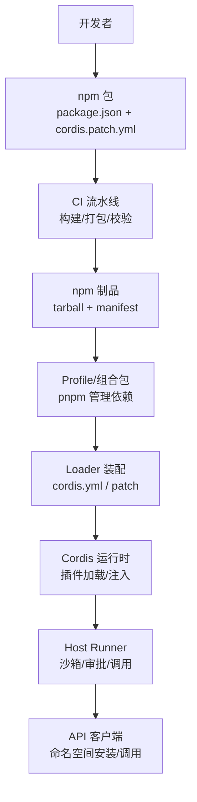
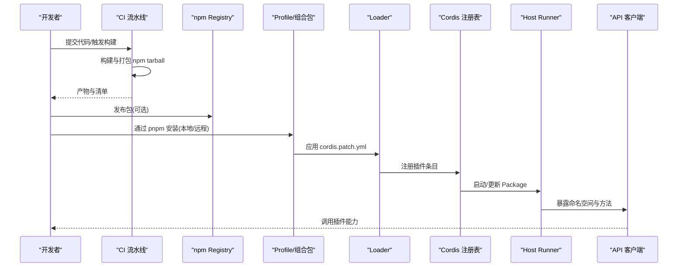
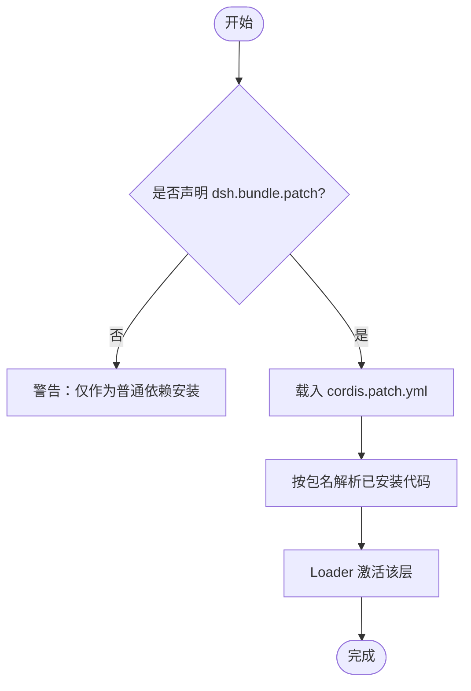
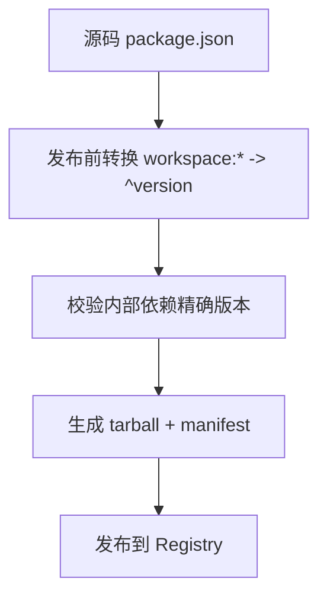
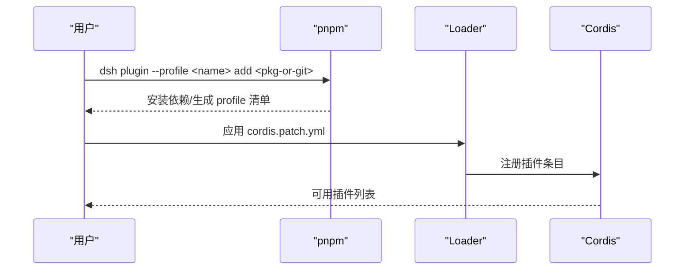
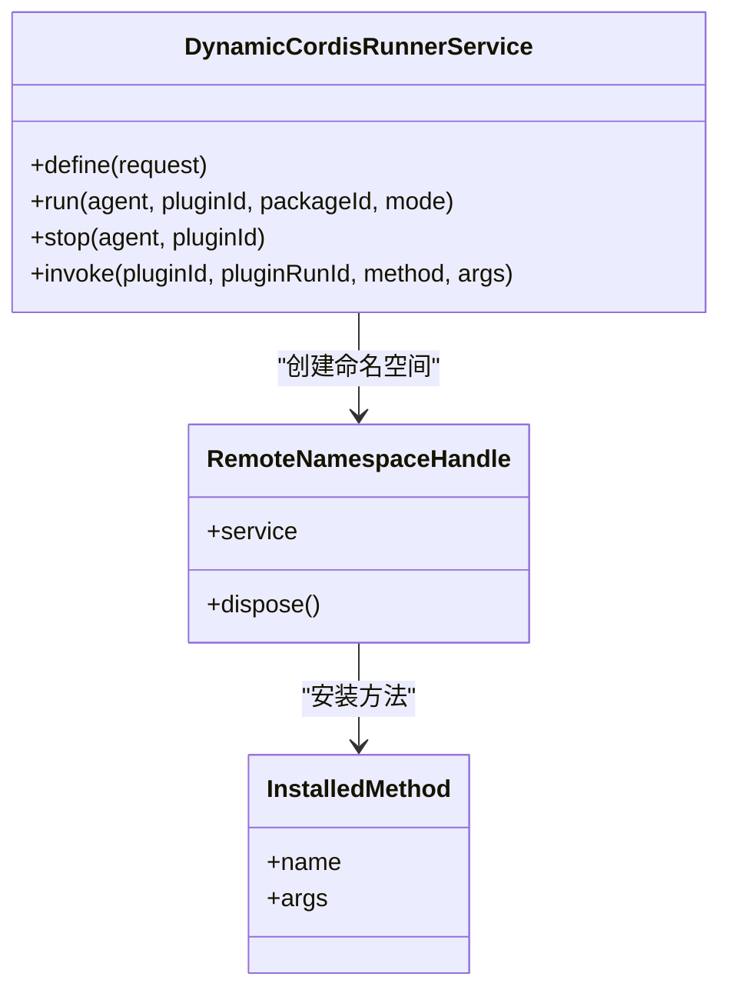
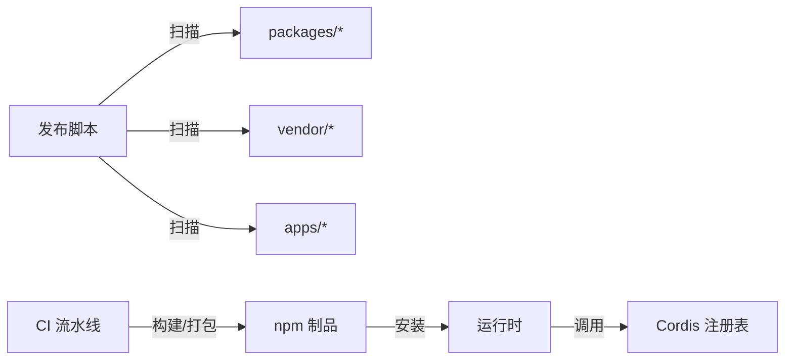

# 插件分发与部署

<cite>
**本文引用的文件**
- [publish-npm-baseline.ts](file://scripts/publish-npm-baseline.ts)
- [benchmark-npm-resolution.ts](file://scripts/benchmark-npm-resolution.ts)
- [release.yml](file://.github/workflows/release.yml)
- [ci.yml](file://.github/workflows/ci.yml)
- [index.ts（Cordis Host Runner）](file://packages/extensions/cordis-host-runner/src/index.ts)
- [registry.ts（动态插件注册表）](file://packages/extensions/cordis-host-runner/src/registry.ts)
- [index.ts（API 客户端挂载贡献）](file://packages/api/gateway/src/client/index.ts)
- [index.ts（UI Cordis 插件入口）](file://packages/extensions/ui-cordis/src/index.ts)
- [registry.md（Cordis 注册表文档）](file://docs/cordis-api/registry.md)
- [publish.md（用户开发基础：发布）](file://docs/user/develop/basic/publish.md)
- [verify-cordis-config.ts](file://scripts/verify-cordis-config.ts)
- [plugin-inventory/index.ts](file://packages/host/plugin-inventory/src/index.ts)
</cite>

## 目录
1. [简介](#简介)
2. [项目结构](#项目结构)
3. [核心组件](#核心组件)
4. [架构总览](#架构总览)
5. [详细组件分析](#详细组件分析)
6. [依赖关系分析](#依赖关系分析)
7. [性能考虑](#性能考虑)
8. [故障排查指南](#故障排查指南)
9. [结论](#结论)
10. [附录](#附录)

## 简介
本指南面向 DeepSeek Harness 的插件作者与平台运维人员，系统性说明插件的打包、发布、安装、注册、发现与加载流程；覆盖 npm 包结构与元数据、版本管理与兼容性策略、本地与远程安装方式、命名空间与组织、以及企业级部署场景下的管理策略。内容基于仓库中的脚本、工作流与运行时实现进行提炼，确保可操作且与代码一致。

## 项目结构
DeepSeek Harness 采用多包 monorepo 组织，插件生态围绕以下关键位置展开：
- 发布与校验脚本：scripts 目录提供 npm baseline 打包、范围转换、工件验证等能力。
- CI/CD：.github/workflows 定义构建、打包、校验与发布流水线。
- 运行时插件系统：packages/extensions/cordis-host-runner 提供动态插件生命周期、沙箱执行、审批流与调用桥接。
- API 层：packages/api/gateway 负责远端贡献的挂载与命名空间安装。
- 文档与示例：docs 包含 Cordis 注册表 API 与用户开发指南。

**图示来源**
- [publish-npm-baseline.ts:1-200](file://scripts/publish-npm-baseline.ts#L1-L200)
- [release.yml:69-141](file://.github/workflows/release.yml#L69-L141)
- [index.ts（Cordis Host Runner）:124-202](file://packages/extensions/cordis-host-runner/src/index.ts#L124-L202)
- [index.ts（API 客户端挂载贡献）:239-378](file://packages/api/gateway/src/client/index.ts#L239-L378)

**章节来源**
- [publish-npm-baseline.ts:1-200](file://scripts/publish-npm-baseline.ts#L1-L200)
- [release.yml:69-141](file://.github/workflows/release.yml#L69-L141)

## 核心组件
- 发布基线工具：负责按提交快照打包所有受管包、生成清单、校验内部依赖精确版本、输出工件并可选择发布到 registry。
- 动态插件宿主运行器：维护插件与包的不可变定义、会话隔离、沙箱执行、审批流、运行状态与调用路由。
- API 客户端贡献挂载：将远端提供的描述符分组并按命名空间安装，创建服务与安装方法，支持错误回滚。
- Loader 与配置校验：读取 cordis.yml/patch 并校验条目、解析包、保证客户端半声明正确性。
- 插件清单服务：暴露当前 Loader 条目与代理预设组合的可见插件列表及阶段信息。

**章节来源**
- [publish-npm-baseline.ts:837-882](file://scripts/publish-npm-baseline.ts#L837-L882)
- [index.ts（Cordis Host Runner）:124-202](file://packages/extensions/cordis-host-runner/src/index.ts#L124-L202)
- [index.ts（API 客户端挂载贡献）:239-378](file://packages/api/gateway/src/client/index.ts#L239-L378)
- [verify-cordis-config.ts:60-88](file://scripts/verify-cordis-config.ts#L60-L88)
- [plugin-inventory/index.ts:53-92](file://packages/host/plugin-inventory/src/index.ts#L53-L92)

## 架构总览
下图展示从“插件包”到“运行时调用”的端到端路径，涵盖打包、CI 校验、安装、注册、加载与调用。

**图示来源**
- [release.yml:69-141](file://.github/workflows/release.yml#L69-L141)
- [publish-npm-baseline.ts:1019-1055](file://scripts/publish-npm-baseline.ts#L1019-L1055)
- [index.ts（Cordis Host Runner）:248-312](file://packages/extensions/cordis-host-runner/src/index.ts#L248-L312)
- [index.ts（API 客户端挂载贡献）:239-378](file://packages/api/gateway/src/client/index.ts#L239-L378)

## 详细组件分析

### 组件A：npm 包结构与元数据
- 包根需包含入口文件与补丁清单，并通过 dsh.bundle.patch 指向补丁文件，使 Loader 能识别为可激活层。
- 补丁清单以数组形式声明插入的插件条目，使用包名作为标识以便 Node 解析已安装包。
- 未声明 dsh.bundle 的包仍可被安装，但仅作为普通依赖，不会激活任何层。

**图示来源**
- [publish.md:33-73](file://docs/user/develop/basic/publish.md#L33-L73)

**章节来源**
- [publish.md:33-73](file://docs/user/develop/basic/publish.md#L33-L73)

### 组件B：版本管理与兼容性策略
- 工作区协议范围在发布时会被转换为 registry 友好的 semver 范围，例如 workspace:* 映射为目标版本，workspace:^ 映射为 ^version。
- 内部依赖在发布前会强制校验为精确版本，避免不一致导致的生产问题。
- 建议遵循语义化版本控制，并在 peerDependencies 中声明框架兼容范围，配合 CI 校验。

**图示来源**
- [benchmark-npm-resolution.ts:171-210](file://scripts/benchmark-npm-resolution.ts#L171-L210)
- [publish-npm-baseline.ts:837-882](file://scripts/publish-npm-baseline.ts#L837-L882)

**章节来源**
- [benchmark-npm-resolution.ts:171-210](file://scripts/benchmark-npm-resolution.ts#L171-L210)
- [publish-npm-baseline.ts:837-882](file://scripts/publish-npm-baseline.ts#L837-L882)

### 组件C：安装与注册机制（本地与远程）
- 本地开发：通过 profile 目录使用 pnpm add 安装本地路径或 git 源，profile 包管理器维护锁文件与依赖顺序。
- 远程安装：可直接从 GitHub 安装源码，但需注意 prepare 脚本的执行权限与锁定 commit，避免安装时执行不受控代码。
- 注册：Loader 根据 cordis.patch.yml 将插件条目注入 Cordis 注册表，随后由 Host Runner 管理生命周期。

**图示来源**
- [publish.md:75-173](file://docs/user/develop/basic/publish.md#L75-L173)
- [verify-cordis-config.ts:60-88](file://scripts/verify-cordis-config.ts#L60-L88)

**章节来源**
- [publish.md:75-173](file://docs/user/develop/basic/publish.md#L75-L173)
- [verify-cordis-config.ts:60-88](file://scripts/verify-cordis-config.ts#L60-L88)

### 组件D：发现与加载过程（命名空间与组织）
- 插件通过 Cordis 注册表加载，支持函数、类或对象形式的入口，并可声明依赖注入与服务提供。
- 动态插件由 Host Runner 管理，每个 Plugin 拥有唯一 ID，Package 为不可变版本；支持 Host/Client 双端代码与审批流。
- API 客户端将远端贡献按命名空间分组并安装，创建服务与安装方法，失败时自动回滚已安装部分。

**图示来源**
- [index.ts（Cordis Host Runner）:124-202](file://packages/extensions/cordis-host-runner/src/index.ts#L124-L202)
- [index.ts（Cordis Host Runner）:248-312](file://packages/extensions/cordis-host-runner/src/index.ts#L248-L312)
- [index.ts（API 客户端挂载贡献）:239-378](file://packages/api/gateway/src/client/index.ts#L239-L378)
- [registry.md:1-153](file://docs/cordis-api/registry.md#L1-L153)

**章节来源**
- [index.ts（Cordis Host Runner）:124-202](file://packages/extensions/cordis-host-runner/src/index.ts#L124-L202)
- [index.ts（Cordis Host Runner）:248-312](file://packages/extensions/cordis-host-runner/src/index.ts#L248-L312)
- [index.ts（API 客户端挂载贡献）:239-378](file://packages/api/gateway/src/client/index.ts#L239-L378)
- [registry.md:1-153](file://docs/cordis-api/registry.md#L1-L153)

### 组件E：UI 插件与客户端发现
- UI 插件可通过 exports["./client"] 与 package.json 的 dshClient 声明，使浏览器端被发现与加载。
- 主机侧 apply 可为空占位，确保在 host cordis.yml/Loader 中出现。

**章节来源**
- [index.ts（UI Cordis 插件入口）:1-9](file://packages/extensions/ui-cordis/src/index.ts#L1-L9)

## 依赖关系分析
- 发布脚本依赖工作区包集合模式，扫描 vendor、packages（排除 experimental）、apps 的 package.json，统一打包与校验。
- CI 流水线在 PR 与 master 推送上执行依赖布局验证、构建、打包与安装验证，产出 npm 制品供后续发布。
- 动态插件运行期依赖 Cordis 注册表与 Typert 远端协议，确保跨进程安全调用与资源回收。

**图示来源**
- [publish-npm-baseline.ts:23-38](file://scripts/publish-npm-baseline.ts#L23-L38)
- [release.yml:69-141](file://.github/workflows/release.yml#L69-L141)
- [index.ts（Cordis Host Runner）:124-144](file://packages/extensions/cordis-host-runner/src/index.ts#L124-L144)

**章节来源**
- [publish-npm-baseline.ts:23-38](file://scripts/publish-npm-baseline.ts#L23-L38)
- [release.yml:69-141](file://.github/workflows/release.yml#L69-L141)

## 性能考虑
- 并发打包：CI 使用并发参数提升打包吞吐，同时保持严格串行发布路径以避免竞态。
- 缓存优化：pnpm store 缓存与 Playwright 缓存减少重复安装与测试开销。
- 沙箱超时：Host Runner 对同步 VM 评估设置超时阈值，防止阻塞主线程。
- 命名空间分组：API 客户端按命名空间分组安装，减少重复初始化成本。

[本节为通用指导，不直接分析具体文件]

## 故障排查指南
- 插件未激活：检查 package.json 是否声明 dsh.bundle.patch，以及 cordis.patch.yml 是否正确引用包名。
- 安装时报错 prepare 执行：确认允许构建白名单并锁定 git 提交，避免安装时执行不受控代码。
- 动态插件无法运行：查看 Host Runner 返回的状态码与消息，确认 pluginId/packageId 匹配且处于有效运行态。
- 命名空间未安装：检查 API 客户端挂载贡献是否成功，失败时会回滚已安装部分并抛出错误。

**章节来源**
- [publish.md:151-173](file://docs/user/develop/basic/publish.md#L151-L173)
- [index.ts（Cordis Host Runner）:456-471](file://packages/extensions/cordis-host-runner/src/index.ts#L456-L471)
- [index.ts（API 客户端挂载贡献）:239-260](file://packages/api/gateway/src/client/index.ts#L239-L260)

## 结论
DeepSeek Harness 的插件体系以“包+补丁”为核心，结合 CI 严格的版本与依赖校验、动态宿主运行器的安全沙箱与审批流，以及 API 层的命名空间安装机制，形成了从开发、发布到部署的全链路闭环。遵循本指南的规范与最佳实践，可在企业环境中稳定地分发与管理插件，保障安全性、可追溯性与可维护性。

## 附录
- 推荐实践
  - 使用语义化版本控制，peerDependencies 明确框架兼容范围。
  - 在 CI 中启用依赖布局与安装验证，确保制品可安装。
  - 对动态插件实施最小权限与审批策略，限制 Client 代码执行。
  - 为 UI 插件提供清晰的 dshClient 声明与文档。
  - 使用 profile 组合包集中管理第三方插件与补丁顺序。

[本节为通用指导，不直接分析具体文件]