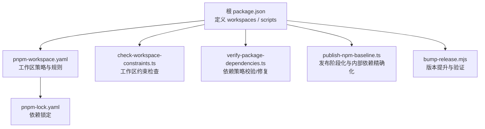
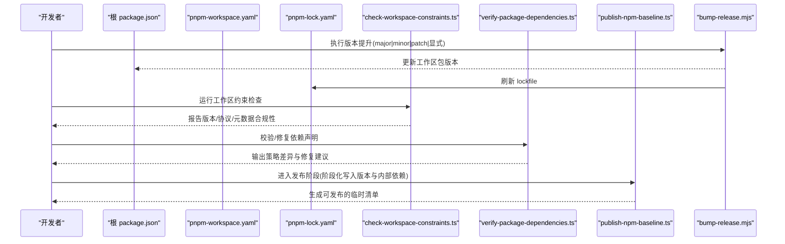
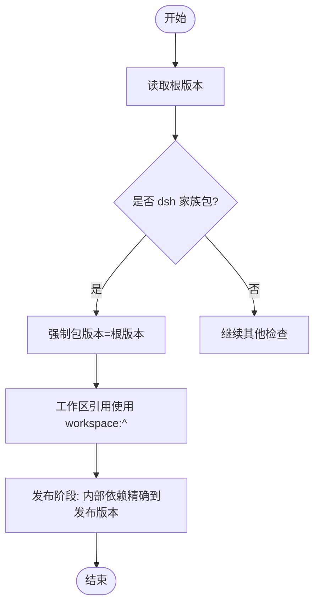
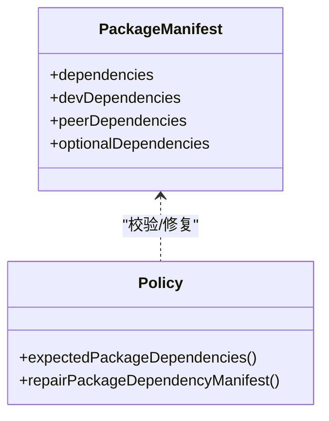
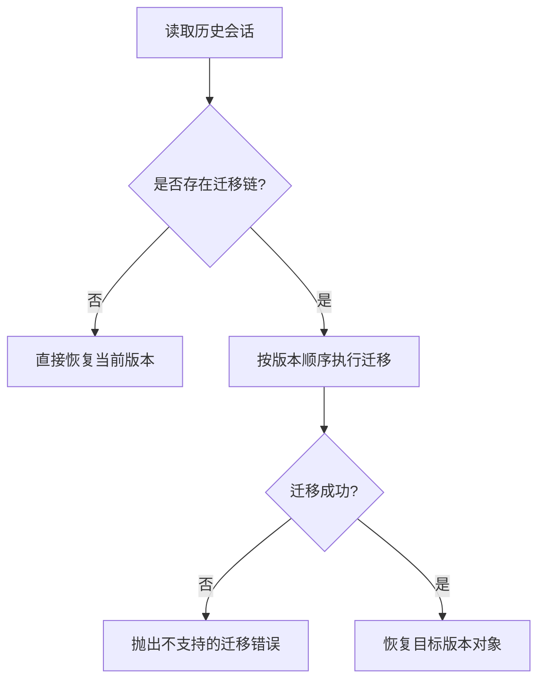
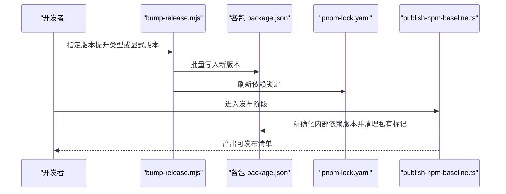
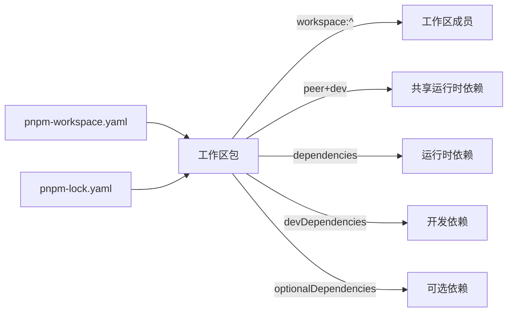

# 版本管理与兼容性

<cite>
**本文引用的文件**
- [package.json](file://package.json)
- [pnpm-workspace.yaml](file://pnpm-workspace.yaml)
- [pnpm-lock.yaml](file://pnpm-lock.yaml)
- [scripts/check-workspace-constraints.ts](file://scripts/check-workspace-constraints.ts)
- [scripts/verify-package-dependencies.ts](file://scripts/verify-package-dependencies.ts)
- [scripts/publish-npm-baseline.ts](file://scripts/publish-npm-baseline.ts)
- [native/landlock-run/scripts/bump-release.mjs](file://native/landlock-run/scripts/bump-release.mjs)
- [.agents/notes/implemented/process/2026-08-10-npm-release-sequences.md](file://.agents/notes/implemented/process/2026-08-10-npm-release-sequences.md)
</cite>

## 目录
1. [简介](#简介)
2. [项目结构](#项目结构)
3. [核心组件](#核心组件)
4. [架构总览](#架构总览)
5. [详细组件分析](#详细组件分析)
6. [依赖分析](#依赖分析)
7. [性能考虑](#性能考虑)
8. [故障排查指南](#故障排查指南)
9. [结论](#结论)
10. [附录](#附录)

## 简介
本指南聚焦 DeepSeek Harness 项目的版本管理与兼容性策略，覆盖语义化版本控制（SemVer）在工作区内的应用、根版本与包间依赖同步机制、向后兼容性与迁移路径、依赖锁定与更新策略（含 peerDependencies 与 devDependencies），以及版本冲突解决与问题诊断方法。内容基于仓库中的工作区配置、发布脚本与约束校验脚本进行系统化梳理，帮助开发者在本地开发、打包与发布全流程中保持一致的版本治理。

## 项目结构
- 根 package.json 定义了 pnpm 工作区成员、Node 引擎要求、统一脚本入口与发布相关命令。
- pnpm-workspace.yaml 声明了工作区范围、linkWorkspacePackages、overrides、peerDependencyRules、allowBuilds、minimumReleaseAgeExclude 与 patchedDependencies 等关键策略。
- pnpm-lock.yaml 锁定了所有依赖的解析结果，确保安装可重现。
- 约束与发布脚本：
  - check-workspace-constraints.ts：强制 dsh 家族包版本与根一致、workspace: 协议引用、发布元数据规范等。
  - verify-package-dependencies.ts：对依赖声明位置与范围进行策略校验与自动修复建议。
  - publish-npm-baseline.ts：发布前“阶段化”修改 manifest，将内部依赖精确到发布版本并清理私有标记。
  - bump-release.mjs：对 landlock 工作区执行主/次/补丁或显式版本号提升，并刷新 lockfile。

**图示来源**
- [package.json:1-20](file://package.json#L1-L20)
- [pnpm-workspace.yaml:1-35](file://pnpm-workspace.yaml#L1-L35)
- [pnpm-lock.yaml:1-14](file://pnpm-lock.yaml#L1-L14)
- [scripts/check-workspace-constraints.ts:265-340](file://scripts/check-workspace-constraints.ts#L265-L340)
- [scripts/verify-package-dependencies.ts:465-681](file://scripts/verify-package-dependencies.ts#L465-L681)
- [scripts/publish-npm-baseline.ts:284-295](file://scripts/publish-npm-baseline.ts#L284-L295)
- [native/landlock-run/scripts/bump-release.mjs:44-91](file://native/landlock-run/scripts/bump-release.mjs#L44-L91)

**章节来源**
- [package.json:1-20](file://package.json#L1-L20)
- [pnpm-workspace.yaml:1-35](file://pnpm-workspace.yaml#L1-L35)
- [pnpm-lock.yaml:1-14](file://pnpm-lock.yaml#L1-L14)

## 核心组件
- 根版本管理
  - 根 package.json 维护仓库级版本号与 Node 引擎范围，作为 dsh 家族包的统一版本源。
  - 约束脚本强制 dsh 家族包版本与根一致，避免漂移。
- 工作区包版本同步
  - 通过 workspace:^ 引用工作区内包，保证开发期与构建期使用同一份源码。
  - 发布阶段将内部依赖精确替换为发布版本，确保产物稳定。
- 依赖策略与锁定
  - pnpm-workspace.yaml 集中声明 overrides、peerDependencyRules、allowBuilds、patchedDependencies 等。
  - pnpm-lock.yaml 固化解析结果，保障跨环境一致性。
- 发布流程
  - 版本提升脚本支持 major/minor/patch 或显式版本；发布脚本在 staging 阶段写入版本并处理内部依赖。

**章节来源**
- [scripts/check-workspace-constraints.ts:265-340](file://scripts/check-workspace-constraints.ts#L265-L340)
- [scripts/publish-npm-baseline.ts:284-295](file://scripts/publish-npm-baseline.ts#L284-L295)
- [native/landlock-run/scripts/bump-release.mjs:44-91](file://native/landlock-run/scripts/bump-release.mjs#L44-L91)
- [pnpm-workspace.yaml:15-35](file://pnpm-workspace.yaml#L15-L35)
- [pnpm-lock.yaml:1-14](file://pnpm-lock.yaml#L1-L14)

## 架构总览
下图展示了版本管理与依赖治理的关键参与方及其交互关系。

**图示来源**
- [native/landlock-run/scripts/bump-release.mjs:44-91](file://native/landlock-run/scripts/bump-release.mjs#L44-L91)
- [scripts/check-workspace-constraints.ts:265-340](file://scripts/check-workspace-constraints.ts#L265-L340)
- [scripts/verify-package-dependencies.ts:465-681](file://scripts/verify-package-dependencies.ts#L465-L681)
- [scripts/publish-npm-baseline.ts:284-295](file://scripts/publish-npm-baseline.ts#L284-L295)

## 详细组件分析

### 语义化版本控制与工作区同步
- 根版本与 dsh 家族包版本必须一致，由约束脚本强制校验。
- 工作区内包之间通过 workspace:^ 引用，避免手写范围导致的不一致。
- 发布阶段将内部依赖精确替换为当前发布版本，确保 tarball 内依赖稳定。

**图示来源**
- [scripts/check-workspace-constraints.ts:265-340](file://scripts/check-workspace-constraints.ts#L265-L340)
- [scripts/publish-npm-baseline.ts:284-295](file://scripts/publish-npm-baseline.ts#L284-L295)

**章节来源**
- [scripts/check-workspace-constraints.ts:265-340](file://scripts/check-workspace-constraints.ts#L265-L340)
- [scripts/publish-npm-baseline.ts:284-295](file://scripts/publish-npm-baseline.ts#L284-L295)

### 依赖版本锁定与更新策略
- pnpm-workspace.yaml 提供全局策略：
  - linkWorkspacePackages: true 使本地构建始终解析到工作区源码。
  - overrides 将特定包名链接到 vendor 下的本地实现。
  - peerDependencyRules 限制 TypeScript 版本范围。
  - allowBuilds 白名单控制允许带 install/build 脚本的包。
  - minimumReleaseAgeExclude 针对供应链安全策略的例外列表。
  - patchedDependencies 对关键依赖打补丁。
- pnpm-lock.yaml 锁定所有依赖解析结果，确保可重现安装。
- 更新策略建议：
  - 优先升级 devDependencies 与测试工具，保持构建链稳定。
  - 对运行时依赖谨慎升级，结合 verify-package-dependencies 校验影响面。
  - 对需要源码共享的运行时依赖，使用 peerDependencies + devDependencies 双声明（见下节）。

**章节来源**
- [pnpm-workspace.yaml:15-83](file://pnpm-workspace.yaml#L15-L83)
- [pnpm-lock.yaml:1-14](file://pnpm-lock.yaml#L1-L14)

### peerDependencies 与 devDependencies 的管理
- 对于需要在宿主进程共享身份的运行时依赖（如 Cordis），采用 peerDependencies + devDependencies 同时声明，且范围需一致。
- verify-package-dependencies 会推导期望的依赖段与范围，并在不合规时给出修复建议。
- 该策略确保：
  - 宿主与应用共享同一实例，避免重复加载导致的类型/状态不一致。
  - 开发环境与生产环境行为一致。

**图示来源**
- [scripts/verify-package-dependencies.ts:465-681](file://scripts/verify-package-dependencies.ts#L465-L681)

**章节来源**
- [scripts/verify-package-dependencies.ts:465-681](file://scripts/verify-package-dependencies.ts#L465-L681)

### 向后兼容性与迁移路径
- 会话格式版本演进遵循严格的迁移策略：
  - 新增编解码器需按顺序声明，禁止重复、缺失与未来版本。
  - 生成目录录时会校验当前版本与迁移链完整性。
- 错误模型包含“不支持的迁移”等异常类型，便于上层处理兼容性问题。
- 实践建议：
  - 新增字段时保持向下兼容，旧客户端忽略未知字段。
  - 破坏性变更通过新版本号与迁移脚本完成，保留旧版本编解码器直至淘汰。
  - 在测试中覆盖多版本恢复与迁移路径。

**图示来源**
- [packages/session/session-format/tests/catalog.spec.ts:117-137](file://packages/session/session-format/tests/catalog.spec.ts#L117-L137)
- [scripts/gen-session-format-catalog.ts:157-183](file://scripts/gen-session-format-catalog.ts#L157-L183)
- [packages/session/session-format/src/error.ts:1-9](file://packages/session/session-format/src/error.ts#L1-L9)

**章节来源**
- [packages/session/session-format/tests/catalog.spec.ts:117-137](file://packages/session/session-format/tests/catalog.spec.ts#L117-L137)
- [scripts/gen-session-format-catalog.ts:157-183](file://scripts/gen-session-format-catalog.ts#L157-L183)
- [packages/session/session-format/src/error.ts:1-9](file://packages/session/session-format/src/error.ts#L1-L9)

### 发布流程与版本提升
- 版本提升：
  - 支持 major/minor/patch 或显式版本（含预发布）。
  - 提升后刷新 lockfile 并执行发布验证。
- 发布阶段化：
  - 将内部依赖精确替换为发布版本，移除 private 标记，生成可发布清单。
- 文档记录：
  - Agent Note 记录了发布序列与标签策略，强调 pack 与 publish 分离、仅消费已验证 tarball。

**图示来源**
- [native/landlock-run/scripts/bump-release.mjs:44-91](file://native/landlock-run/scripts/bump-release.mjs#L44-L91)
- [scripts/publish-npm-baseline.ts:284-295](file://scripts/publish-npm-baseline.ts#L284-L295)
- [.agents/notes/implemented/process/2026-08-10-npm-release-sequences.md:137-147](file://.agents/notes/implemented/process/2026-08-10-npm-release-sequences.md#L137-L147)

**章节来源**
- [native/landlock-run/scripts/bump-release.mjs:44-91](file://native/landlock-run/scripts/bump-release.mjs#L44-L91)
- [scripts/publish-npm-baseline.ts:284-295](file://scripts/publish-npm-baseline.ts#L284-L295)
- [.agents/notes/implemented/process/2026-08-10-npm-release-sequences.md:137-147](file://.agents/notes/implemented/process/2026-08-10-npm-release-sequences.md#L137-L147)

## 依赖分析
- 工作区引用
  - 所有工作区内包引用必须使用 workspace: 协议，防止发布时残留手写范围。
- 依赖段策略
  - 运行时共享身份依赖：peerDependencies + devDependencies 双声明且范围一致。
  - 开发期依赖：devDependencies。
  - 可选依赖：optionalDependencies（谨慎使用）。
- 外部依赖治理
  - 通过 overrides 指向 vendor 本地实现，确保构建一致性。
  - allowBuilds 白名单控制原生构建与生命周期脚本。
  - patchedDependencies 对关键依赖进行补丁。

**图示来源**
- [pnpm-workspace.yaml:15-83](file://pnpm-workspace.yaml#L15-L83)
- [pnpm-lock.yaml:1-14](file://pnpm-lock.yaml#L1-L14)
- [scripts/check-workspace-constraints.ts:480-501](file://scripts/check-workspace-constraints.ts#L480-L501)
- [scripts/verify-package-dependencies.ts:465-681](file://scripts/verify-package-dependencies.ts#L465-L681)

**章节来源**
- [pnpm-workspace.yaml:15-83](file://pnpm-workspace.yaml#L15-L83)
- [pnpm-lock.yaml:1-14](file://pnpm-lock.yaml#L1-L14)
- [scripts/check-workspace-constraints.ts:480-501](file://scripts/check-workspace-constraints.ts#L480-L501)
- [scripts/verify-package-dependencies.ts:465-681](file://scripts/verify-package-dependencies.ts#L465-L681)

## 性能考虑
- 使用 workspace:^ 减少重复安装与解析开销，提升本地开发与构建速度。
- 锁定依赖（pnpm-lock.yaml）避免每次安装重新解析，提高 CI 稳定性。
- 限制 allowBuilds 减少不必要的原生编译，缩短安装时间。
- 合理拆分 peerDependencies 与 devDependencies，避免在生产产物中引入不必要依赖。

[本节提供通用指导，无需特定文件来源]

## 故障排查指南
- 版本不一致
  - 现象：dsh 家族包版本与根不一致。
  - 处理：使用版本提升脚本统一版本，再运行约束检查。
- workspace: 协议缺失
  - 现象：工作区引用未使用 workspace: 协议。
  - 处理：根据约束脚本提示改为 workspace:^ 或 workspace:*。
- 依赖段违规
  - 现象：依赖出现在错误的段或范围不一致。
  - 处理：运行依赖校验脚本获取修复建议，必要时手动对齐 peer/dev 范围。
- 发布阶段失败
  - 现象：内部依赖范围未精确化或私有标记未清理。
  - 处理：重新执行发布阶段化流程，确保清单正确。
- 会话迁移失败
  - 现象：无法恢复历史会话或迁移链不完整。
  - 处理：检查编解码器声明顺序与当前版本，补充缺失迁移。

**章节来源**
- [scripts/check-workspace-constraints.ts:265-340](file://scripts/check-workspace-constraints.ts#L265-L340)
- [scripts/check-workspace-constraints.ts:480-501](file://scripts/check-workspace-constraints.ts#L480-L501)
- [scripts/verify-package-dependencies.ts:465-681](file://scripts/verify-package-dependencies.ts#L465-L681)
- [scripts/publish-npm-baseline.ts:284-295](file://scripts/publish-npm-baseline.ts#L284-L295)
- [packages/session/session-format/tests/catalog.spec.ts:117-137](file://packages/session/session-format/tests/catalog.spec.ts#L117-L137)

## 结论
DeepSeek Harness 通过根版本统一管理、工作区 workspace:^ 引用、严格的约束校验与发布阶段化流程，实现了高一致性的版本治理。配合 pnpm 的锁定与策略配置，项目在本地开发、CI 与发布环节均具备可重现性与稳定性。向后兼容性通过会话格式的迁移链与错误模型得到保障。建议在变更过程中始终运行约束与依赖校验脚本，确保版本与依赖策略合规。

[本节为总结性内容，无需特定文件来源]

## 附录
- 最佳实践
  - 变更 API 时优先保持向后兼容，必要时引入新版本与迁移脚本。
  - 对破坏性变更明确弃用周期，提供迁移指引与示例。
  - 升级依赖前先运行依赖校验脚本，评估影响面。
  - 发布前务必执行版本提升与阶段化流程，确保内部依赖精确化。
- 常用命令
  - 版本提升：参考 bump-release.mjs 的使用方式。
  - 约束检查：运行工作区约束检查脚本。
  - 依赖校验：运行依赖策略校验与修复脚本。
  - 发布阶段化：执行发布阶段化流程以生成可发布清单。

[本节为补充信息，无需特定文件来源]