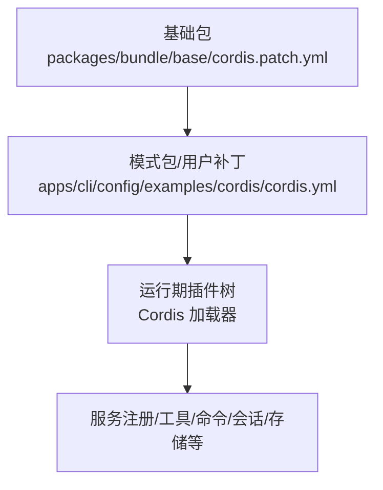
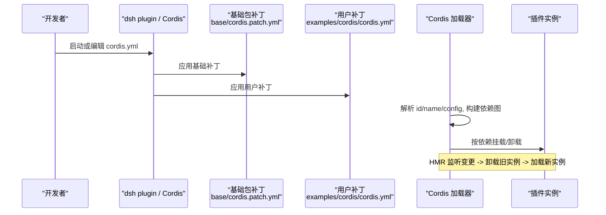
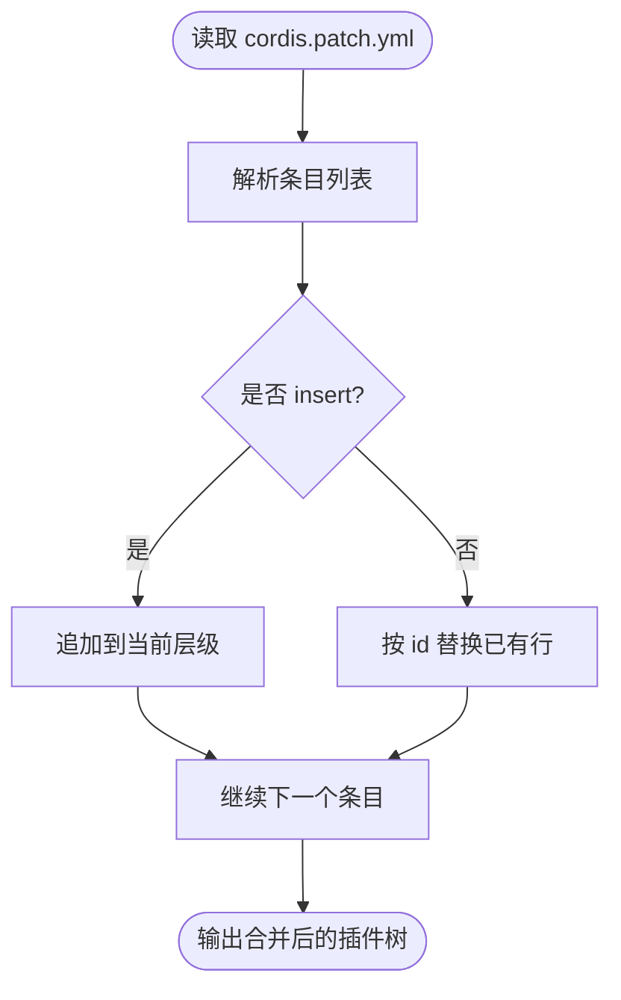
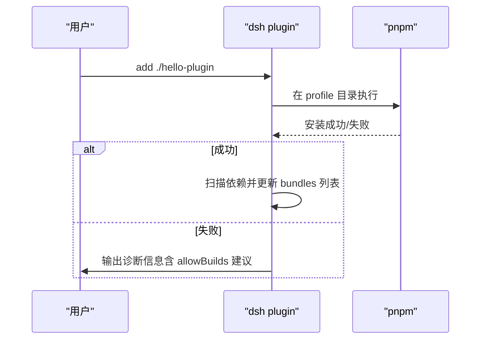
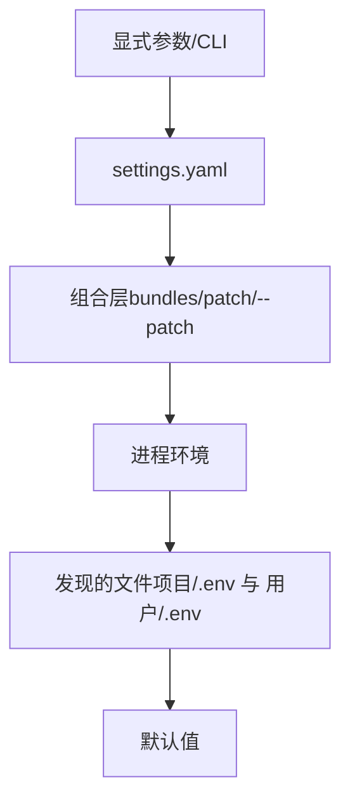
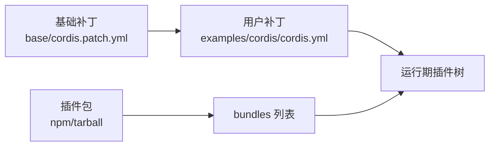

# 插件组合与配置

<cite>
**本文引用的文件**
- [apps/cli/composition.md](file://apps/cli/composition.md)
- [packages/bundle/base/cordis.patch.yml](file://packages/bundle/base/cordis.patch.yml)
- [apps/cli/config/examples/cordis/cordis.yml](file://apps/cli/config/examples/cordis/cordis.yml)
- [apps/cli/src/plugin.ts](file://apps/cli/src/plugin.ts)
- [docs/cordis-tutorial/06-composition-and-hmr.md](file://docs/cordis-tutorial/06-composition-and-hmr.md)
- [docs/user/develop/basic/publish.md](file://docs/user/develop/basic/publish.md)
- [docs/user/develop/basic/config.md](file://docs/user/develop/basic/config.md)
- [docs/config-catalog.md](file://docs/config-catalog.md)
- [scripts/gen-config-catalog.ts](file://scripts/gen-config-catalog.ts)
- [packages/boot/app-boot/src/index.ts](file://packages/boot/app-boot/src/index.ts)
- [packages/credentials/credentials-local/src/index.ts](file://packages/credentials/credentials-local/src/index.ts)
- [.agents/notes/implemented/architecture/2026-08-04-configuration-source-ownership.md](file://.agents/notes/implemented/architecture/2026-08-04-configuration-source-ownership.md)
</cite>

## 目录
1. [简介](#简介)
2. [项目结构](#项目结构)
3. [核心组件](#核心组件)
4. [架构总览](#架构总览)
5. [详细组件分析](#详细组件分析)
6. [依赖关系分析](#依赖关系分析)
7. [性能考量](#性能考量)
8. [故障排查指南](#故障排查指南)
9. [结论](#结论)
10. [附录](#附录)

## 简介
本指南面向需要组织多个插件、管理依赖、进行配置覆盖与版本兼容的开发者。内容涵盖：
- 插件组合方式与层叠机制（基础包、模式包、用户补丁）
- 配置文件结构与语法（YAML、环境变量注入、条件配置）
- 热重载机制（开发时 HMR 与运行时动态加载）
- 从单插件到复杂多插件的完整示例
- 配置验证与错误处理
- 插件分发与部署策略

## 项目结构
DSH 通过 Cordis 将能力以“插件”形式装配，使用 YAML 描述插件树。每个 profile 由多层 patch 叠加而成：
- dsh-base 基础包提供共享的核心插件集合
- 各模式包（web、headless、sdk 等）在其基础上追加行为
- 用户级 cordis.patch.yml 作为最终覆盖层

图表来源
- [packages/bundle/base/cordis.patch.yml:1-516](file://packages/bundle/base/cordis.patch.yml#L1-L516)
- [apps/cli/config/examples/cordis/cordis.yml:1-20](file://apps/cli/config/examples/cordis/cordis.yml#L1-L20)

章节来源
- [apps/cli/composition.md:1-277](file://apps/cli/composition.md#L1-L277)
- [packages/bundle/base/cordis.patch.yml:1-516](file://packages/bundle/base/cordis.patch.yml#L1-L516)
- [apps/cli/config/examples/cordis/cordis.yml:1-20](file://apps/cli/config/examples/cordis/cordis.yml#L1-L20)

## 核心组件
- 插件清单与补丁：cordis.patch.yml 定义插件 id/name/config，支持 insert/replace/条件启用等
- 配置目录与示例：apps/cli/config/examples 下提供不同场景的 cordis.yml 补丁示例
- CLI 插件管理：dsh plugin 命令负责初始化 profile、转发 pnpm、同步 bundles 列表
- 配置目录与文档：docs/config-catalog.md 生成所有插件的可配置字段参考
- 环境与环境层：app-boot 提供分层 .env 加载；credentials-local 提供凭据解析顺序
- 配置源优先级：非机密值按“显式 > settings > composition > 进程环境 > 发现的文件 > 默认值”的顺序解析

章节来源
- [packages/bundle/base/cordis.patch.yml:1-516](file://packages/bundle/base/cordis.patch.yml#L1-L516)
- [apps/cli/config/examples/cordis/cordis.yml:1-20](file://apps/cli/config/examples/cordis/cordis.yml#L1-L20)
- [apps/cli/src/plugin.ts:1-164](file://apps/cli/src/plugin.ts#L1-L164)
- [docs/config-catalog.md:1-800](file://docs/config-catalog.md#L1-L800)
- [packages/boot/app-boot/src/index.ts:187-210](file://packages/boot/app-boot/src/index.ts#L187-L210)
- [packages/credentials/credentials-local/src/index.ts:544-571](file://packages/credentials/credentials-local/src/index.ts#L544-L571)
- [.agents/notes/implemented/architecture/2026-08-04-configuration-source-ownership.md:17-39](file://.agents/notes/implemented/architecture/2026-08-04-configuration-source-ownership.md#L17-L39)

## 架构总览
下图展示了从基础包到用户补丁再到运行时的装配流程，以及 HMR 在开发期的热替换路径。

图表来源
- [packages/bundle/base/cordis.patch.yml:1-516](file://packages/bundle/base/cordis.patch.yml#L1-L516)
- [apps/cli/config/examples/cordis/cordis.yml:1-20](file://apps/cli/config/examples/cordis/cordis.yml#L1-L20)
- [docs/cordis-tutorial/06-composition-and-hmr.md:1-114](file://docs/cordis-tutorial/06-composition-and-hmr.md#L1-L114)

## 详细组件分析

### 插件清单与补丁（cordis.patch.yml）
- 作用：声明插件 id、name、config，支持 disabled、insert、条件表达式等
- 基础包集中了核心能力（LLM、会话、存储、沙箱、工具、命令、Web 等），并通过 id 被上层覆盖
- 典型字段：id（稳定标识）、name（包名或模块路径）、config（键值配置）、disabled（条件禁用）

图表来源
- [packages/bundle/base/cordis.patch.yml:1-516](file://packages/bundle/base/cordis.patch.yml#L1-L516)

章节来源
- [packages/bundle/base/cordis.patch.yml:1-516](file://packages/bundle/base/cordis.patch.yml#L1-L516)

### 用户补丁与覆盖（examples/cordis/cordis.yml）
- 用户补丁以 patch overlay 形式附加到 bundle 层之上，可修改端口、插入额外工具等
- 适合对内置行为做最小化覆盖，避免重复声明整棵树

章节来源
- [apps/cli/config/examples/cordis/cordis.yml:1-20](file://apps/cli/config/examples/cordis/cordis.yml#L1-L20)

### 插件管理与 Profile（dsh plugin）
- 首次使用会初始化 profile，维护 dsh.profile.bundles 列表
- 自动根据已安装依赖中声明 dsh.bundle 的包决定是否加入层栈
- 支持相对路径锚定、Windows shell 兼容、git 依赖 prepare 失败提示

图表来源
- [apps/cli/src/plugin.ts:1-164](file://apps/cli/src/plugin.ts#L1-L164)

章节来源
- [apps/cli/src/plugin.ts:1-164](file://apps/cli/src/plugin.ts#L1-L164)

### 配置源优先级与环境注入
- 非机密值优先级：显式参数 > settings.yaml > 组合层（bundles/patch/--patch）> 进程环境 > 发现的 .env > 默认值
- 凭据优先级：进程环境（只读且最高）> $DSH_HOME/.credentials.yaml > 项目 .env > 用户 .env
- app-boot 提供分层 .env 加载；credentials-local 实现引用解析与回退

图表来源
- [.agents/notes/implemented/architecture/2026-08-04-configuration-source-ownership.md:17-39](file://.agents/notes/implemented/architecture/2026-08-04-configuration-source-ownership.md#L17-L39)
- [packages/boot/app-boot/src/index.ts:187-210](file://packages/boot/app-boot/src/index.ts#L187-L210)
- [packages/credentials/credentials-local/src/index.ts:544-571](file://packages/credentials/credentials-local/src/index.ts#L544-L571)

章节来源
- [.agents/notes/implemented/architecture/2026-08-04-configuration-source-ownership.md:17-39](file://.agents/notes/implemented/architecture/2026-08-04-configuration-source-ownership.md#L17-L39)
- [packages/boot/app-boot/src/index.ts:187-210](file://packages/boot/app-boot/src/index.ts#L187-L210)
- [packages/credentials/credentials-local/src/index.ts:544-571](file://packages/credentials/credentials-local/src/index.ts#L544-L571)

### 热重载（HMR）与动态加载
- 通过 @deepseek-ai/cordis-plugin-hmr 监听文件变化，卸载旧插件并重新加载
- 基于 id 的差异比较，仅重挂载变更部分；未提供 inject 的服务会导致 PENDING 状态
- 开发时可通过 tsx + Cordis 快速体验 HMR

章节来源
- [docs/cordis-tutorial/06-composition-and-hmr.md:1-114](file://docs/cordis-tutorial/06-composition-and-hmr.md#L1-L114)

### 配置验证与错误处理
- 每个插件的配置由 schema 校验，无效配置在加载阶段报错，便于定位
- 配置目录（config-catalog）自动生成并校验，确保声明与运行时一致
- 插件作者应遵循“不硬编码可调项、失败要快且明确”的原则

章节来源
- [docs/user/develop/basic/config.md:74-107](file://docs/user/develop/basic/config.md#L74-L107)
- [docs/config-catalog.md:1-800](file://docs/config-catalog.md#L1-L800)
- [scripts/gen-config-catalog.ts:463-518](file://scripts/gen-config-catalog.ts#L463-L518)

### 插件分发与部署
- 插件以 npm 包形式发布，包含 cordis.patch.yml 与入口代码
- 通过 dsh plugin 安装到 profile，自动维护 bundles 列表
- 也可分发 tarball，无需用户授权 prepare 脚本

章节来源
- [docs/user/develop/basic/publish.md:33-184](file://docs/user/develop/basic/publish.md#L33-L184)

## 依赖关系分析
- 基础包集中声明大量插件及其默认配置，上层通过 id 精准覆盖
- 用户补丁通常只做最小改动（如端口、插入工具）
- CLI 负责将依赖与 bundles 同步，保证层栈与已安装包一致

图表来源
- [packages/bundle/base/cordis.patch.yml:1-516](file://packages/bundle/base/cordis.patch.yml#L1-L516)
- [apps/cli/config/examples/cordis/cordis.yml:1-20](file://apps/cli/config/examples/cordis/cordis.yml#L1-L20)
- [apps/cli/src/plugin.ts:1-164](file://apps/cli/src/plugin.ts#L1-L164)

章节来源
- [apps/cli/composition.md:1-277](file://apps/cli/composition.md#L1-L277)
- [apps/cli/src/plugin.ts:1-164](file://apps/cli/src/plugin.ts#L1-L164)

## 性能考量
- 合理拆分补丁：将通用能力放入基础包，模式特定配置放入模式包，减少冗余
- 控制 HMR 监听范围：仅在开发时使用，生产环境关闭以避免额外开销
- 谨慎使用大体积工具结果：利用压缩/裁剪策略（如 tool-result-pruner）降低内存占用
- 批量化导出与节流：遥测与持久化采用批量与间隔写入，避免频繁 I/O

[本节为通用指导，不直接分析具体文件]

## 故障排查指南
- 插件始终处于 PENDING：检查 inject 的服务是否由其他插件提供；可使用诊断插件枚举 FiberState 查找缺失依赖
- HMR 不生效：确认已启用 hmr 插件并正确设置 root；确保使用支持热替换的加载方式（如 tsx）
- 配置未生效：核对配置源优先级，确认未被更高优先级的 settings 或组合层覆盖
- 安装失败：查看 pnpm 输出，必要时在 workspace 中允许 git 依赖的 prepare 脚本

章节来源
- [docs/cordis-tutorial/06-composition-and-hmr.md:61-114](file://docs/cordis-tutorial/06-composition-and-hmr.md#L61-L114)
- [apps/cli/src/plugin.ts:120-164](file://apps/cli/src/plugin.ts#L120-L164)

## 结论
通过分层补丁与严格的配置源优先级，DSH 实现了高度可组合、可覆盖、可热重载的插件体系。借助 CLI 的自动化管理与生成的配置目录，开发者可以安全地扩展能力、定制行为，并以最小成本完成分发与部署。

[本节为总结性内容，不直接分析具体文件]

## 附录

### 常用配置项速查
- 会话标题：fallbackMaxWords、maxTitleBytes 等
- 存储后端：root、backend 等
- 沙箱与权限：mode、workspaceRoot、approval policy 等
- Web 工具：searchProvider、fetchProvider、超时等
- 遥测：mode、exporter.url、timeoutMillis 等

章节来源
- [packages/bundle/base/cordis.patch.yml:48-220](file://packages/bundle/base/cordis.patch.yml#L48-L220)
- [docs/config-catalog.md:1-800](file://docs/config-catalog.md#L1-L800)