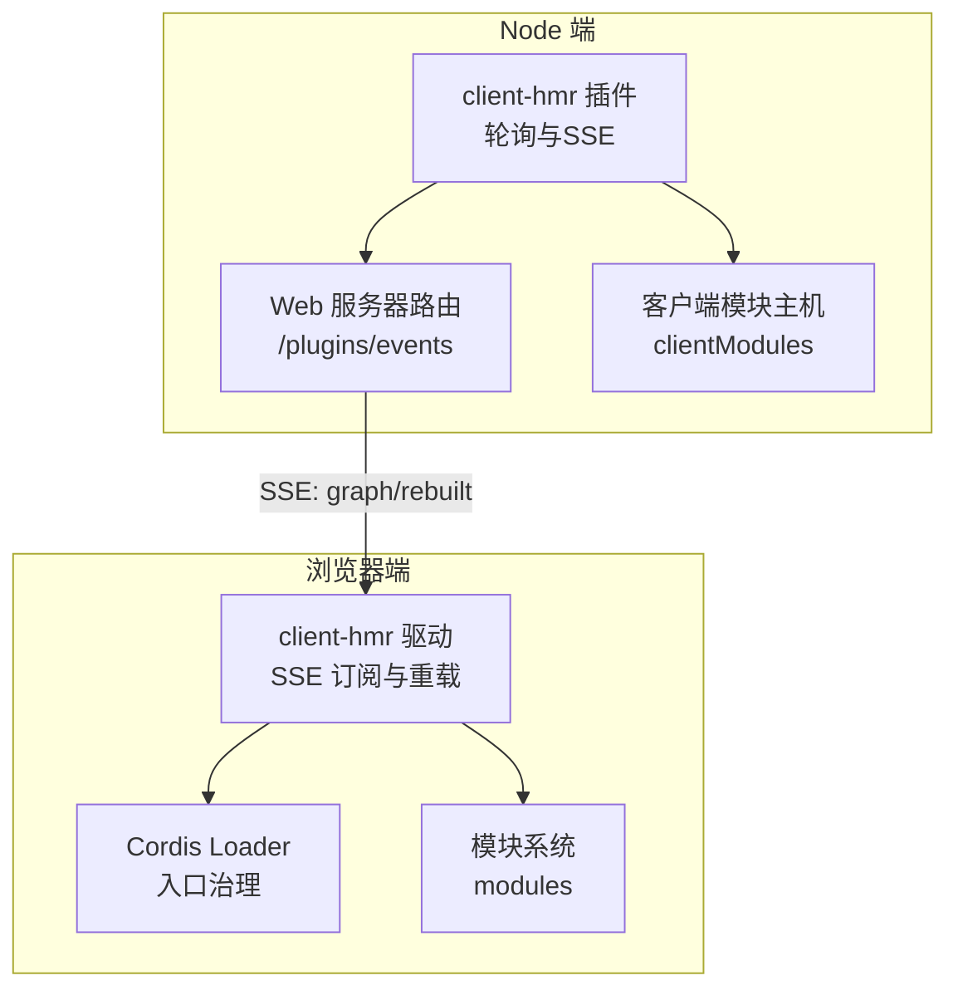
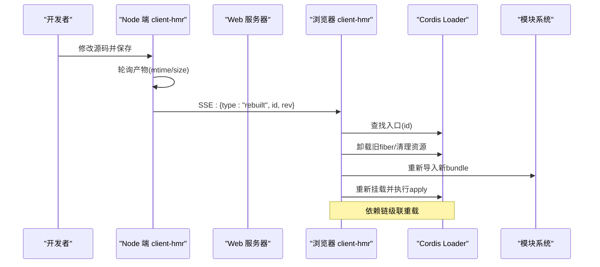
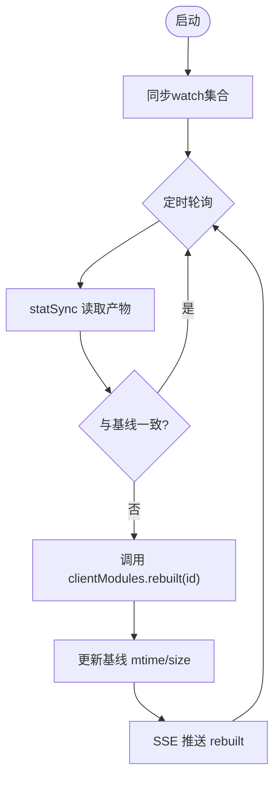
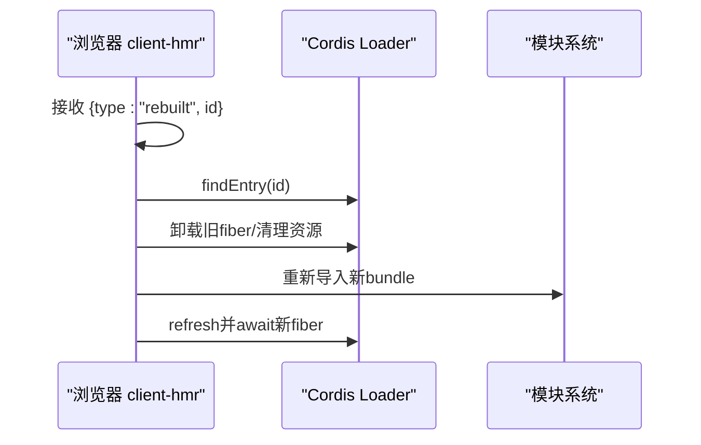
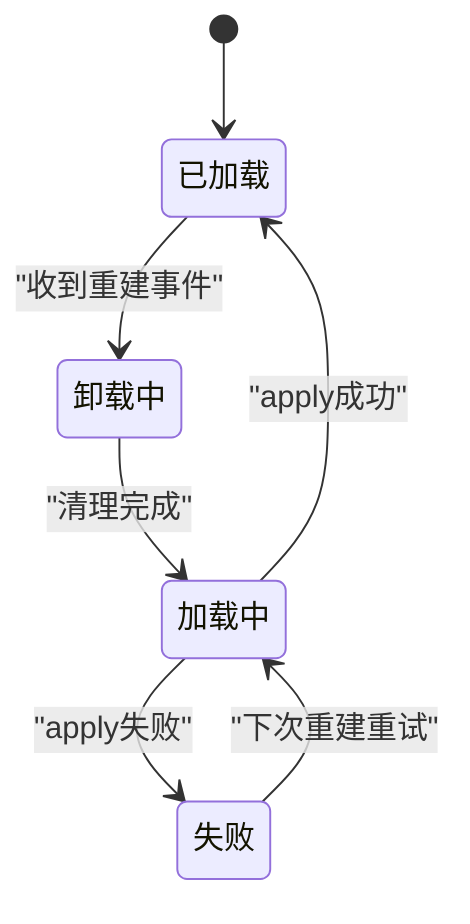
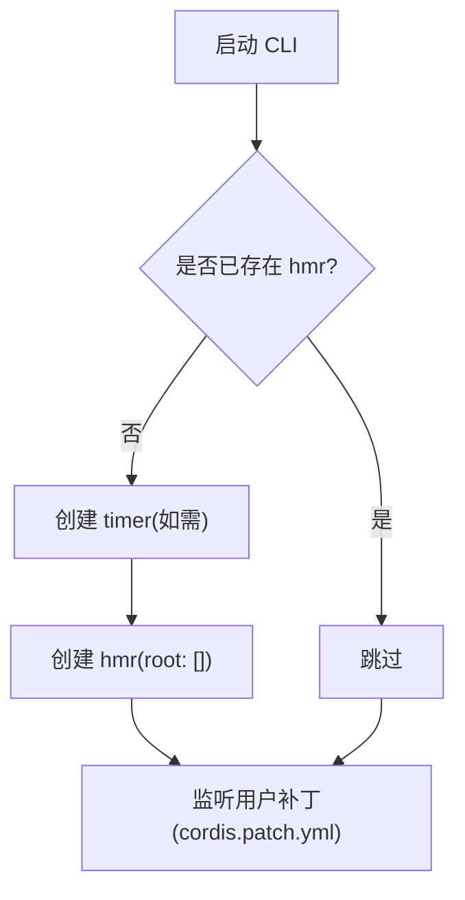
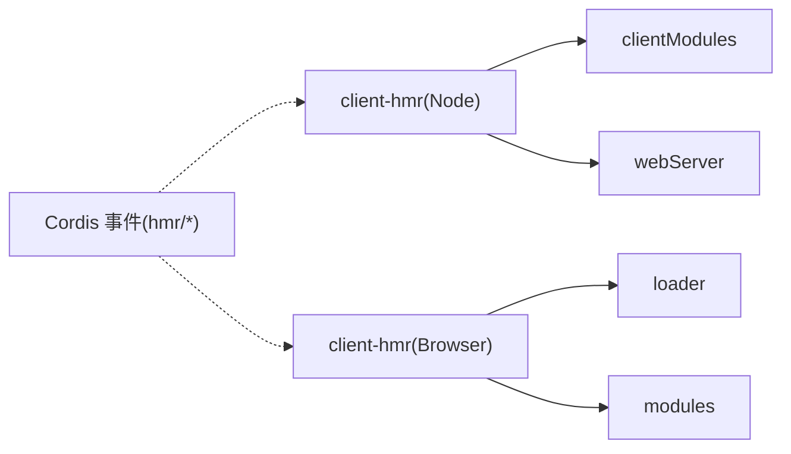

# 热模块替换

<cite>
**本文引用的文件**
- [packages/client/hmr/src/index.ts](file://packages/client/hmr/src/index.ts)
- [packages/client/hmr/src/client/index.ts](file://packages/client/hmr/src/client/index.ts)
- [packages/client/hmr/README.md](file://packages/client/hmr/README.md)
- [apps/cli/src/profile-boot.ts](file://apps/cli/src/profile-boot.ts)
- [scripts/dev-web.ts](file://scripts/dev-web.ts)
- [docs/cordis-tutorial/06-composition-and-hmr.md](file://docs/cordis-tutorial/06-composition-and-hmr.md)
- [docs/cordis-api/inherited.md](file://docs/cordis-api/inherited.md)
- [packages/boot/app-boot/tests/hmr-config.spec.ts](file://packages/boot/app-boot/tests/hmr-config.spec.ts)
- [apps/cli/tests/profile-hmr.spec.ts](file://apps/cli/tests/profile-hmr.spec.ts)
</cite>

## 目录
1. [简介](#简介)
2. [项目结构](#项目结构)
3. [核心组件](#核心组件)
4. [架构总览](#架构总览)
5. [详细组件分析](#详细组件分析)
6. [依赖关系分析](#依赖关系分析)
7. [性能考虑](#性能考虑)
8. [故障排除指南](#故障排除指南)
9. [结论](#结论)
10. [附录](#附录)

## 简介
本文件系统性说明热模块替换（HMR）在本仓库中的工作原理与使用方式，覆盖以下方面：
- 文件监听、差异检测与模块重载机制
- @deepseek-ai/cordis-plugin-hmr 插件的配置与集成
- HMR 与 Cordis 插件生命周期的协作（卸载旧实例、加载新实例、执行 apply）
- 开发环境设置（tsx 运行器与 Node.js 参数）
- 故障排除、性能优化与最佳实践

## 项目结构
HMR 由“Node 端”和“浏览器端”两部分组成，并通过事件通道协同：
- Node 端：负责轮询客户端产物变更、广播重建事件、提供 SSE 事件流
- 浏览器端：订阅事件流，按策略卸载旧 fiber、加载新 bundle、重新挂载并刷新 UI

图表来源
- [packages/client/hmr/src/index.ts:68-200](file://packages/client/hmr/src/index.ts#L68-L200)
- [packages/client/hmr/src/client/index.ts:98-102](file://packages/client/hmr/src/client/index.ts#L98-L102)

章节来源
- [packages/client/hmr/src/index.ts:1-202](file://packages/client/hmr/src/index.ts#L1-L202)
- [packages/client/hmr/src/client/index.ts:69-102](file://packages/client/hmr/src/client/index.ts#L69-L102)

## 核心组件
- Node 端 HMR 插件（client-hmr）
  - 职责：统计轮询客户端产物、调用 clientModules.rebuilt()、暴露 /plugins/events SSE 通道
  - 关键配置：pollIntervalMs（默认 500ms）
- 浏览器端 HMR 驱动（client-hmr）
  - 职责：订阅 SSE，按 id 定位 Loader 入口，卸载旧 fiber、清理样式、重新导入并挂载
- Cordis 生命周期集成
  - 通过 Loader 的 entry 治理实现“卸载—加载—apply”的原子切换
  - 支持级联重载：被依赖项变化时，依赖方自动跟随

章节来源
- [packages/client/hmr/src/index.ts:30-38](file://packages/client/hmr/src/index.ts#L30-L38)
- [packages/client/hmr/src/index.ts:68-200](file://packages/client/hmr/src/index.ts#L68-L200)
- [packages/client/hmr/src/client/index.ts:72-102](file://packages/client/hmr/src/client/index.ts#L72-L102)
- [docs/cordis-tutorial/06-composition-and-hmr.md:23-59](file://docs/cordis-tutorial/06-composition-and-hmr.md#L23-L59)

## 架构总览
HMR 的工作流分为“监听—检测—通知—重载”四个阶段：
1. 监听：Node 端以固定间隔对每个客户端产物进行 stat 检查
2. 检测：对比 mtime/size，或借助 source map 判断是否真正需要重载
3. 通知：通过 SSE 向浏览器推送 graph/rebuilt 帧
4. 重载：浏览器端按 id 定位入口，卸载旧 fiber，加载新 bundle，执行 apply

图表来源
- [packages/client/hmr/src/index.ts:109-156](file://packages/client/hmr/src/index.ts#L109-L156)
- [packages/client/hmr/src/index.ts:158-200](file://packages/client/hmr/src/index.ts#L158-L200)
- [packages/client/hmr/src/client/index.ts:78-102](file://packages/client/hmr/src/client/index.ts#L78-L102)

## 详细组件分析

### Node 端 HMR 插件（client-hmr）
- 功能要点
  - 维护 watched 映射，跟踪每个图节点的产物基线
  - 定时轮询：statSync 获取 mtime/size，若与基线不同则标记 dirty 并触发 rebuilt
  - 同步 watch 集合：根据 clientModules.graph() 动态增删监控项
  - 暴露 /plugins/events 路由：GET/HEAD 返回 SSE，推送 graph 初始帧与 rebuilt 事件
- 错误处理
  - ENOENT 视为脏状态，等待下次重建；其他错误记录日志
  - 非 GET/HEAD 请求返回 405

图表来源
- [packages/client/hmr/src/index.ts:72-156](file://packages/client/hmr/src/index.ts#L72-L156)
- [packages/client/hmr/src/index.ts:158-200](file://packages/client/hmr/src/index.ts#L158-L200)

章节来源
- [packages/client/hmr/src/index.ts:30-38](file://packages/client/hmr/src/index.ts#L30-L38)
- [packages/client/hmr/src/index.ts:68-200](file://packages/client/hmr/src/index.ts#L68-L200)

### 浏览器端 HMR 驱动（client-hmr）
- 功能要点
  - 注入 loader 与 modules，订阅系统 SSE 通道
  - 通过 findEntry 定位目标入口（基于 options.name）
  - 卸载旧实例：删除 owned style 标签、移除 fiber 引用
  - 重新加载：refresh 入口并 await 新 fiber 完成
- 失败策略
  - 无回滚：导入失败会保留 FAILED 状态，等待下一次 rebuilt 重试

图表来源
- [packages/client/hmr/src/client/index.ts:78-102](file://packages/client/hmr/src/client/index.ts#L78-L102)

章节来源
- [packages/client/hmr/src/client/index.ts:69-102](file://packages/client/hmr/src/client/index.ts#L69-L102)
- [packages/client/hmr/README.md:60-84](file://packages/client/hmr/README.md#L60-L84)

### 与 Cordis 插件生命周期的集成
- 卸载旧实例：通过 Loader 的 entry 治理，先释放 effect，再移除 fiber
- 加载新实例：重新解析依赖、挂载服务、执行 apply
- 级联重载：被依赖项变化时，依赖方自动跟随，无需额外编排

图表来源
- [docs/cordis-tutorial/06-composition-and-hmr.md:23-59](file://docs/cordis-tutorial/06-composition-and-hmr.md#L23-L59)

章节来源
- [docs/cordis-tutorial/06-composition-and-hmr.md:23-59](file://docs/cordis-tutorial/06-composition-and-hmr.md#L23-L59)
- [docs/cordis-api/inherited.md:23-39](file://docs/cordis-api/inherited.md#L23-L39)

### 开发环境设置（tsx 与 Node.js 参数）
- 源码启动：通过 node --import tsx/esm 直接运行 CLI，启用 tsconfig paths 与 ESM 钩子
- Web 开发脚本：dev-web 支持 --poll 参数，用于在无法使用 inotify 的环境（如网络挂载）下启用固定间隔轮询
- CLI 自动注入 HMR：当未显式加载 hmr 时，CLI 会在合适时机创建 hmr 实例（仅监听，不引入模块根），确保 cordis.patch.yml 编辑可热生效

图表来源
- [apps/cli/src/profile-boot.ts:290-310](file://apps/cli/src/profile-boot.ts#L290-L310)
- [scripts/dev-web.ts:217-245](file://scripts/dev-web.ts#L217-L245)

章节来源
- [apps/cli/src/profile-boot.ts:290-310](file://apps/cli/src/profile-boot.ts#L290-L310)
- [scripts/dev-web.ts:217-245](file://scripts/dev-web.ts#L217-L245)
- [docs/cordis-tutorial/06-composition-and-hmr.md:44-59](file://docs/cordis-tutorial/06-composition-and-hmr.md#L44-L59)

## 依赖关系分析
- 插件间依赖
  - client-hmr（Node）依赖 clientModules 与 webServer
  - client-hmr（浏览器）依赖 loader 与 modules
- 运行时事件
  - hmr/change、hmr/reload 等事件贯穿监听与重载流程
- 测试与配置验证
  - 单元测试覆盖 HMR 配置路径、轮询行为、忽略规则等

图表来源
- [packages/client/hmr/src/index.ts:24-28](file://packages/client/hmr/src/index.ts#L24-L28)
- [packages/client/hmr/src/client/index.ts:72-76](file://packages/client/hmr/src/client/index.ts#L72-L76)
- [docs/cordis-api/inherited.md:23-39](file://docs/cordis-api/inherited.md#L23-L39)

章节来源
- [packages/client/hmr/src/index.ts:24-28](file://packages/client/hmr/src/index.ts#L24-L28)
- [packages/client/hmr/src/client/index.ts:72-76](file://packages/client/hmr/src/client/index.ts#L72-L76)
- [docs/cordis-api/inherited.md:23-39](file://docs/cordis-api/inherited.md#L23-L39)
- [packages/boot/app-boot/tests/hmr-config.spec.ts:15-27](file://packages/boot/app-boot/tests/hmr-config.spec.ts#L15-L27)
- [apps/cli/tests/profile-hmr.spec.ts:36-45](file://apps/cli/tests/profile-hmr.spec.ts#L36-L45)

## 性能考虑
- 轮询间隔：pollIntervalMs 默认 500ms，可根据环境调整以减少 CPU 占用或提升响应速度
- 产物基线：首次启动即捕获基线，避免不必要的哈希计算；仅在 mtime/size 变化时进入重建路径
- Source Map：仅在需要时读取，map-only 变更不会触发代码重载
- 连接管理：SSE 连接关闭时及时销毁，避免资源泄漏
- 建议
  - 在网络挂载或容器环境中，结合 dev-web 的 --poll 选项稳定监听
  - 大工程可适当增大 pollIntervalMs，平衡实时性与开销

[本节为通用指导，不直接分析具体文件]

## 故障排除指南
- 现象：HMR 无反应
  - 可能原因：未运行构建/监听进程，导致没有 rebuilt 事件
  - 解决：确保 dev:web 或对应 tsdown/watch 进程正在运行
- 现象：浏览器端报错但无回滚
  - 可能原因：导入失败或 apply 失败，当前设计不回滚
  - 解决：修复错误后等待下一次 rebuilt 重试；查看 shell 状态投影确认 FAILED 条目
- 现象：端口/路由冲突
  - 可能原因：自定义路由覆盖了 /plugins/events
  - 解决：确保该路由允许 GET/HEAD，且未被其他中间件拦截
- 现象：定时器未就绪
  - 可能原因：缺少 timer 服务，HMR 处于 PENDING
  - 解决：确保加载 timer 插件或在 CLI 自动注入路径中可用

章节来源
- [packages/client/hmr/README.md:60-84](file://packages/client/hmr/README.md#L60-L84)
- [packages/client/hmr/src/index.ts:158-200](file://packages/client/hmr/src/index.ts#L158-L200)
- [docs/cordis-tutorial/06-composition-and-hmr.md:61-109](file://docs/cordis-tutorial/06-composition-and-hmr.md#L61-L109)

## 结论
本仓库的 HMR 方案将“Node 端产物监听 + 浏览器端 fiber 重载”解耦，通过稳定的事件契约实现安全、可观测的热替换。配合 Cordis 的生命周期与 Loader 的入口治理，既能保证重载的原子性，又能实现依赖链的级联更新。在开发体验上，tsx 源码启动与 dev-web 轮询模式提供了跨平台的一致性；在生产构建中，该链路保持空闲，不影响模型侧行为。

[本节为总结性内容，不直接分析具体文件]

## 附录
- 快速上手
  - 在 cordis.yml 中添加 hmr 条目，并指定 root 为源码根目录
  - 使用 node --import tsx/esm 启动 CLI，或通过 pnpm dsh web 进入 Web 模式
  - 编辑插件源码并保存，观察控制台输出与界面即时更新
- 参考文档
  - 教程章节：组合与 HMR
  - 事件继承：hmr/change、hmr/reload 等
  - 客户端 HMR 包说明：配置字段与限制

章节来源
- [docs/cordis-tutorial/06-composition-and-hmr.md:23-59](file://docs/cordis-tutorial/06-composition-and-hmr.md#L23-L59)
- [docs/cordis-api/inherited.md:23-39](file://docs/cordis-api/inherited.md#L23-L39)
- [packages/client/hmr/README.md:25-49](file://packages/client/hmr/README.md#L25-L49)