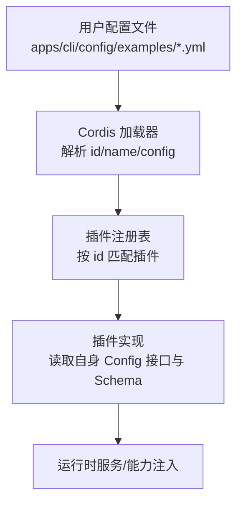
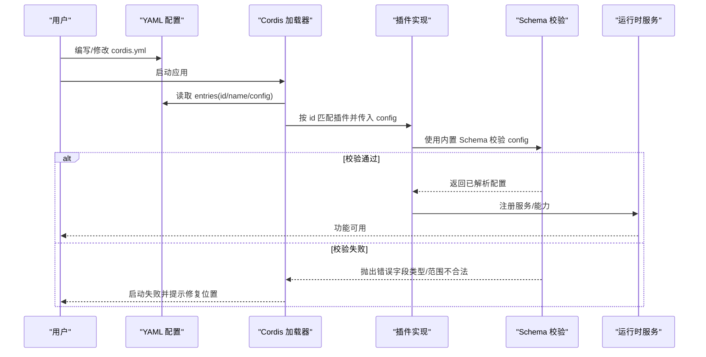
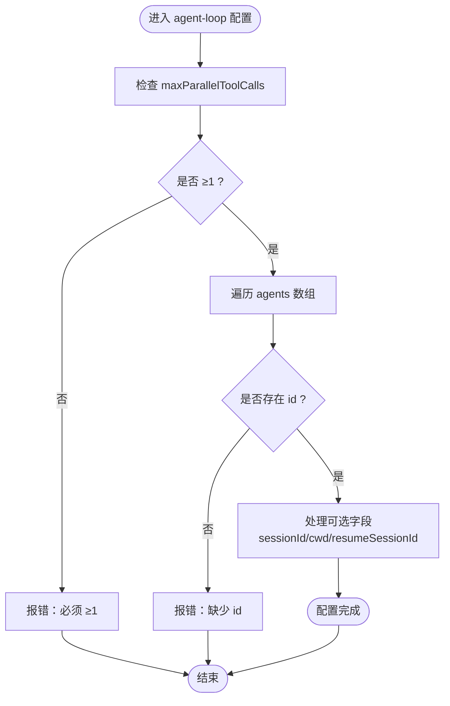
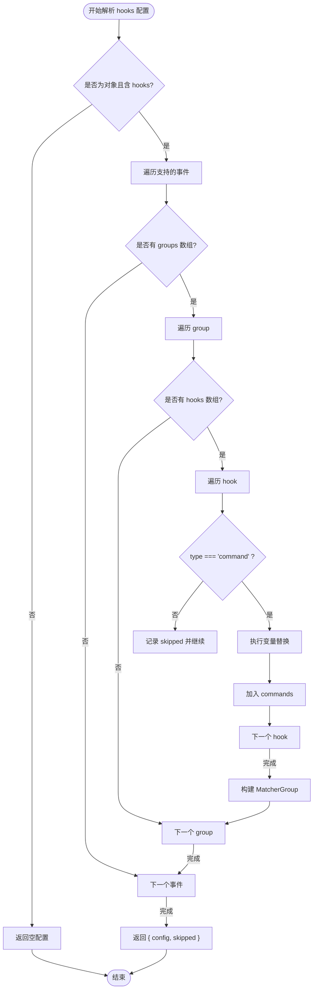
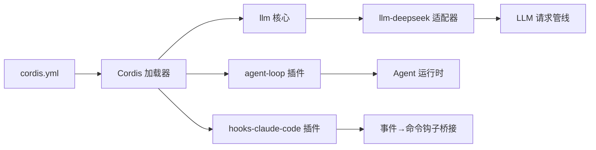

# 插件配置参考

<cite>
**本文引用的文件**
- [packages/core/agent-loop/src/index.ts](file://packages/core/agent-loop/src/index.ts)
- [packages/hooks/hooks-claude-code/src/config.ts](file://packages/hooks/hooks-claude-code/src/config.ts)
- [packages/llm/llm/src/index.ts](file://packages/llm/llm/src/index.ts)
- [docs/config-catalog.md](file://docs/config-catalog.md)
- [docs/config-catalog.zh.md](file://docs/config-catalog.zh.md)
- [apps/cli/config/examples/cordis/cordis.yml](file://apps/cli/config/examples/cordis/cordis.yml)
- [apps/cli/config/examples/mcp-memory/engram.cordis.yml](file://apps/cli/config/examples/mcp-memory/engram.cordis.yml)
</cite>

## 目录
1. [简介](#简介)
2. [项目结构](#项目结构)
3. [核心组件](#核心组件)
4. [架构总览](#架构总览)
5. [详细组件分析](#详细组件分析)
6. [依赖关系分析](#依赖关系分析)
7. [性能注意事项](#性能注意事项)
8. [故障排查指南](#故障排查指南)
9. [结论](#结论)
10. [附录](#附录)

## 简介
本参考文档面向插件作者与使用者，系统化梳理 deepseek-harness 中“插件配置”的完整规范。内容覆盖：
- 各插件的 Config 接口定义、必填/可选字段、数据类型、默认值与取值范围
- 常用插件（如 agent-loop、tools、llm 等）的配置模式与示例
- 配置验证规则与错误信息说明
- 按插件类别组织，便于查找与使用

本参考基于仓库内已声明的插件配置类型与生成型配置目录（config-catalog），并结合 CLI 示例进行说明。

## 项目结构
- 插件配置以 Cordis 插件条目形式存在，每个插件可声明自己的 Config 接口与校验 Schema。
- 配置入口位于 apps/cli/config/examples 下的 YAML 片段，用于演示如何 patch/insert 插件并传入 config。
- 生成的配置目录 docs/config-catalog.* 汇总了所有插件的 Config 类型与 JSDoc 注释，作为权威参考来源。
- 核心插件（如 agent-loop、llm、hooks）在各自包内提供 Config 定义与校验逻辑。

图表来源
- [apps/cli/config/examples/cordis/cordis.yml:1-20](file://apps/cli/config/examples/cordis/cordis.yml#L1-L20)
- [apps/cli/config/examples/mcp-memory/engram.cordis.yml:1-12](file://apps/cli/config/examples/mcp-memory/engram.cordis.yml#L1-L12)

章节来源
- [apps/cli/config/examples/cordis/cordis.yml:1-20](file://apps/cli/config/examples/cordis/cordis.yml#L1-L20)
- [apps/cli/config/examples/mcp-memory/engram.cordis.yml:1-12](file://apps/cli/config/examples/mcp-memory/engram.cordis.yml#L1-L12)

## 核心组件
本节聚焦三类关键插件的配置要点：agent-loop、llm、hooks（以 hooks-claude-code 为例）。

### agent-loop 插件
- 作用：管理 Agent 生命周期、会话恢复、并行工具调用限制等。
- 配置项概览
  - maxParallelToolCalls：每步最大并行工具调用数；类型为 number，最小值为 1，默认由内部常量决定。
  - agents：Agent 列表，每项包含稳定 id、可选 sessionId/cwd/resumeSessionId 等。
- 典型用法：在 cordis.yml 中以 insert 方式引入 agent-loop 插件，并在其 config 中声明 agents 数组与并行度。

章节来源
- [packages/core/agent-loop/src/index.ts:312-338](file://packages/core/agent-loop/src/index.ts#L312-L338)

### llm 插件体系
- 作用：提供 LLM 适配器注册与配置命名空间机制，各适配器（如 deepseek、pi-ai）通过独立命名空间暴露配置。
- 配置项概览（以 deepseek 为例）
  - apiKeyEnv：凭据环境变量名，默认 DEEPSEEK_API_KEY。
  - baseURL：端点基址，支持从可信环境层回退。
  - thinking/reasoningEffort：思考策略与推理强度。
  - maxTokens/defaultContextWindow：输出上限与上下文窗口。
  - models：模型目录，含 id/name/description/contextWindow/maxTokens/inputModalities/imagePixelBudget/imageMaxBytes 等。
  - streamIdleTimeoutMs、maxRequestFilesBytes、maxInlineRequestImageBytes、maxImagesPerRequest 等图片与流式相关限制。
  - filesApiTimeoutMs、fileExpiresAfterSeconds、fileRefreshMarginSeconds、fileQuotaCleanupBatch：文件上传与生命周期管理。
  - retryPolicy：重试策略配置。
- 注意：llm 核心提供 registerConfigurableProviders 能力，允许适配器以命名空间方式注册配置段。

章节来源
- [packages/llm/llm/src/index.ts:470-492](file://packages/llm/llm/src/index.ts#L470-L492)
- [docs/config-catalog.zh.md:1082-1155](file://docs/config-catalog.zh.md#L1082-L1155)
- [docs/config-catalog.md:1080-1153](file://docs/config-catalog.md#L1080-L1153)

### hooks（以 hooks-claude-code 为例）
- 作用：将 Claude Code 事件映射为命令钩子，支持事件到匹配器组（MatcherGroup）的转换。
- 配置项概览
  - 支持的事件集合：SessionStart、UserPromptSubmit、PreToolUse、PostToolUse、Stop、SubagentStart、SubagentStop。
  - 每个事件下可配置多个 MatcherGroup，每组包含 matcher（正则）与 hooks（命令列表）。
  - 非 command 类型的钩子会被跳过并记录，便于诊断。
  - 支持变量替换：${CLAUDE_PLUGIN_ROOT}、${CLAUDE_PROJECT_DIR}。
- 验证规则：matcher 非法会抛出 SyntaxError；不支持的事件或格式错误的条目会被忽略。

章节来源
- [packages/hooks/hooks-claude-code/src/config.ts:1-124](file://packages/hooks/hooks-claude-code/src/config.ts#L1-L124)

## 架构总览
下图展示了插件配置从 YAML 到运行时的整体流程，以及各组件间的依赖关系。

图表来源
- [apps/cli/config/examples/cordis/cordis.yml:1-20](file://apps/cli/config/examples/cordis/cordis.yml#L1-L20)
- [packages/core/agent-loop/src/index.ts:312-338](file://packages/core/agent-loop/src/index.ts#L312-L338)
- [packages/hooks/hooks-claude-code/src/config.ts:1-124](file://packages/hooks/hooks-claude-code/src/config.ts#L1-L124)

## 详细组件分析

### agent-loop 配置详解
- 配置对象：Config
  - maxParallelToolCalls?: number
    - 作用：限制单步内最大并行工具调用数
    - 类型：number
    - 默认值：由内部常量 DEFAULT_MAX_PARALLEL_TOOL_CALLS 决定
    - 取值范围：≥1
  - agents: (AgentOptions & { id: string; sessionId?: SessionId; cwd?: string; resumeSessionId?: SessionId })[]
    - 作用：启动时创建或恢复的 Agent 实例集合
    - 必填字段：id
    - 可选字段：sessionId、cwd、resumeSessionId
- 常见用法：在 cordis.yml 中 insert 插件并设置 agents 数组与并行度。

图表来源
- [packages/core/agent-loop/src/index.ts:312-338](file://packages/core/agent-loop/src/index.ts#L312-L338)

章节来源
- [packages/core/agent-loop/src/index.ts:312-338](file://packages/core/agent-loop/src/index.ts#L312-L338)

### llm 适配器配置详解（deepseek）
- 命名空间：llm-deepseek（适配器通过命名空间暴露配置段）
- 关键字段
  - apiKeyEnv?: string
    - 作用：凭据环境变量名，请求时解析
    - 默认值：DEEPSEEK_API_KEY
  - baseURL?: string
    - 作用：端点基址，支持从可信环境层回退
  - thinking?: 'enabled' | 'disabled'
    - 作用：部署级思考策略
  - reasoningEffort?: 'off' | 'low' | 'high' | 'max'
    - 作用：默认推理强度
  - maxTokens?: number
    - 作用：默认输出上限
  - defaultContextWindow?: number
    - 作用：正上下文容量默认值
  - models?: DeepSeekCatalogModel[]
    - 作用：模型目录，供发现消费者展示
  - 图片与流控相关：streamIdleTimeoutMs、maxRequestFilesBytes、maxInlineRequestImageBytes、maxImagesPerRequest、imageOffloadByteQuantum、inlineImageOffloadByteQuantum、imageOffloadCountQuantum、filesApiTimeoutMs、fileExpiresAfterSeconds、fileRefreshMarginSeconds、fileQuotaCleanupBatch
  - retryPolicy?: RetryPolicyConfig
    - 作用：请求重试策略
- 校验与错误
  - 字段类型与取值范围由 Schema 校验；缺失 API Key 会在请求阶段失败（MISSING_CREDENTIAL），而非插件加载阶段。

章节来源
- [docs/config-catalog.zh.md:1082-1155](file://docs/config-catalog.zh.md#L1082-L1155)
- [docs/config-catalog.md:1080-1153](file://docs/config-catalog.md#L1080-L1153)
- [packages/llm/llm/src/index.ts:470-492](file://packages/llm/llm/src/index.ts#L470-L492)

### hooks-claude-code 配置详解
- 输入形态：settings.hooks 或直接事件映射
- 事件集合：SessionStart、UserPromptSubmit、PreToolUse、PostToolUse、Stop、SubagentStart、SubagentStop
- 结构：事件 → MatcherGroup[] → { matcher?, hooks: [{ command, timeoutSec? }] }
- 变量替换：command 中的 ${CLAUDE_PLUGIN_ROOT}、${CLAUDE_PROJECT_DIR} 会被替换
- 校验与错误
  - 非 command 类型钩子被跳过并记录
  - 不支持的事件或格式错误条目被忽略
  - matcher 非法会抛出 SyntaxError

图表来源
- [packages/hooks/hooks-claude-code/src/config.ts:1-124](file://packages/hooks/hooks-claude-code/src/config.ts#L1-L124)

章节来源
- [packages/hooks/hooks-claude-code/src/config.ts:1-124](file://packages/hooks/hooks-claude-code/src/config.ts#L1-L124)

## 依赖关系分析
- agent-loop 依赖 Cordis 插件系统与 Loader，通过 id/name/config 三要素装配。
- llm 适配器依赖 llm 核心的注册机制，以命名空间暴露配置段。
- hooks-claude-code 依赖共享的 MatcherGroup 协议与诊断工具。

图表来源
- [apps/cli/config/examples/cordis/cordis.yml:1-20](file://apps/cli/config/examples/cordis/cordis.yml#L1-L20)
- [packages/core/agent-loop/src/index.ts:312-338](file://packages/core/agent-loop/src/index.ts#L312-L338)
- [packages/llm/llm/src/index.ts:470-492](file://packages/llm/llm/src/index.ts#L470-L492)
- [packages/hooks/hooks-claude-code/src/config.ts:1-124](file://packages/hooks/hooks-claude-code/src/config.ts#L1-L124)

章节来源
- [apps/cli/config/examples/cordis/cordis.yml:1-20](file://apps/cli/config/examples/cordis/cordis.yml#L1-L20)
- [packages/core/agent-loop/src/index.ts:312-338](file://packages/core/agent-loop/src/index.ts#L312-L338)
- [packages/llm/llm/src/index.ts:470-492](file://packages/llm/llm/src/index.ts#L470-L492)
- [packages/hooks/hooks-claude-code/src/config.ts:1-124](file://packages/hooks/hooks-claude-code/src/config.ts#L1-L124)

## 性能注意事项
- agent-loop 的 maxParallelToolCalls 直接影响并发度与资源占用，建议根据系统负载与下游工具能力调优。
- llm 的图片与流控参数（如 maxRequestFilesBytes、maxInlineRequestImageBytes、maxImagesPerRequest）需结合网络带宽与模型限制合理设置，避免请求过大导致超时或失败。
- hooks 的命令执行应避免过长耗时任务阻塞主循环，必要时拆分异步任务或使用外部进程。

## 故障排查指南
- agent-loop
  - 症状：启动时报错或行为异常
  - 排查：确认 agents 数组中每个元素均包含 id；maxParallelToolCalls ≥1
  - 参考：[packages/core/agent-loop/src/index.ts:312-338](file://packages/core/agent-loop/src/index.ts#L312-L338)
- llm（deepseek）
  - 症状：请求失败或模型不可用
  - 排查：检查 apiKeyEnv 指向的环境变量是否设置；baseURL 是否正确；models 列表中 id 是否与端点一致；图片相关限制是否过小
  - 参考：[docs/config-catalog.zh.md:1082-1155](file://docs/config-catalog.zh.md#L1082-L1155)
- hooks-claude-code
  - 症状：钩子未生效或报错
  - 排查：确认事件名称是否在支持集合内；matcher 正则是否合法；非 command 类型将被跳过；变量替换是否成功
  - 参考：[packages/hooks/hooks-claude-code/src/config.ts:1-124](file://packages/hooks/hooks-claude-code/src/config.ts#L1-L124)

章节来源
- [packages/core/agent-loop/src/index.ts:312-338](file://packages/core/agent-loop/src/index.ts#L312-L338)
- [docs/config-catalog.zh.md:1082-1155](file://docs/config-catalog.zh.md#L1082-L1155)
- [packages/hooks/hooks-claude-code/src/config.ts:1-124](file://packages/hooks/hooks-claude-code/src/config.ts#L1-L124)

## 结论
本参考围绕 agent-loop、llm、hooks 三大类插件，给出了配置接口、字段含义、默认值与取值范围，并结合 CLI 示例说明了如何在 cordis.yml 中插入与配置插件。对于更全面的插件清单与字段说明，请参考生成型配置目录 docs/config-catalog.*。

## 附录

### 常用插件配置示例
- agent-loop
  - 在 cordis.yml 中 insert 插件并配置 agents 与并行度
  - 参考路径：[apps/cli/config/examples/cordis/cordis.yml:1-20](file://apps/cli/config/examples/cordis/cordis.yml#L1-L20)
- tools（MCP 客户端示例）
  - 通过 mcp-client 接入 MCP 服务器，配置 serverName、transport、command、args 等
  - 参考路径：[apps/cli/config/examples/mcp-memory/engram.cordis.yml:1-12](file://apps/cli/config/examples/mcp-memory/engram.cordis.yml#L1-L12)
- llm（deepseek）
  - 在对应命名空间下配置 apiKeyEnv、baseURL、thinking、reasoningEffort、models 等
  - 参考路径：[docs/config-catalog.zh.md:1082-1155](file://docs/config-catalog.zh.md#L1082-L1155)

章节来源
- [apps/cli/config/examples/cordis/cordis.yml:1-20](file://apps/cli/config/examples/cordis/cordis.yml#L1-L20)
- [apps/cli/config/examples/mcp-memory/engram.cordis.yml:1-12](file://apps/cli/config/examples/mcp-memory/engram.cordis.yml#L1-L12)
- [docs/config-catalog.zh.md:1082-1155](file://docs/config-catalog.zh.md#L1082-L1155)