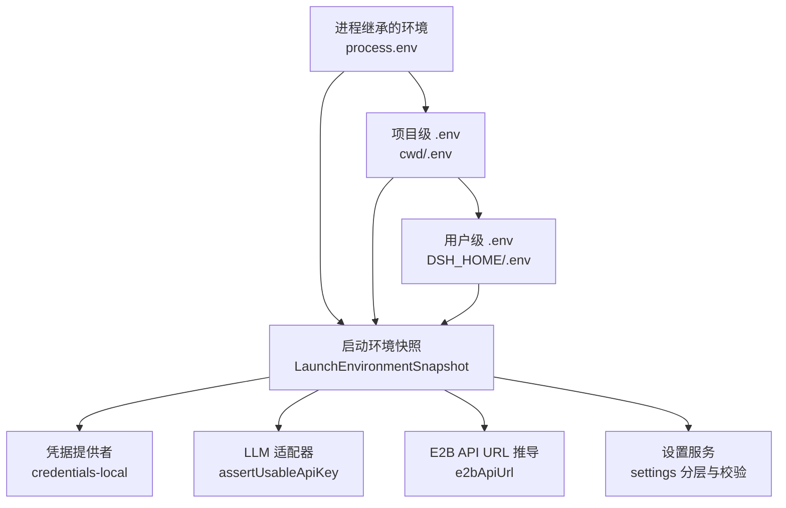
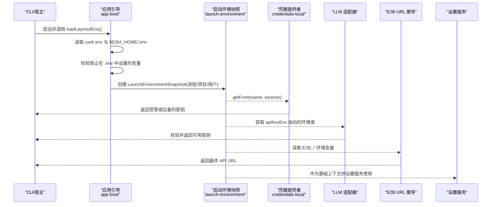
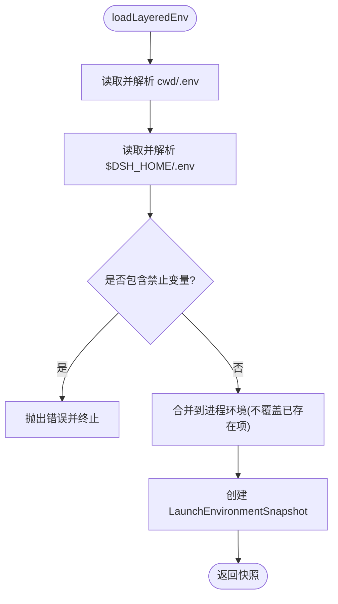
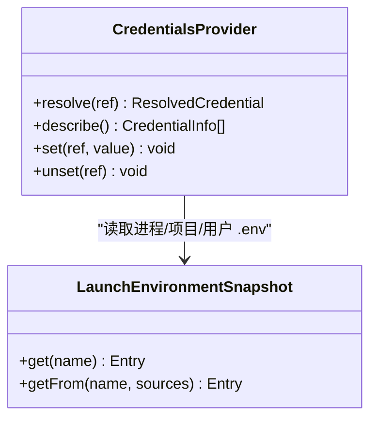
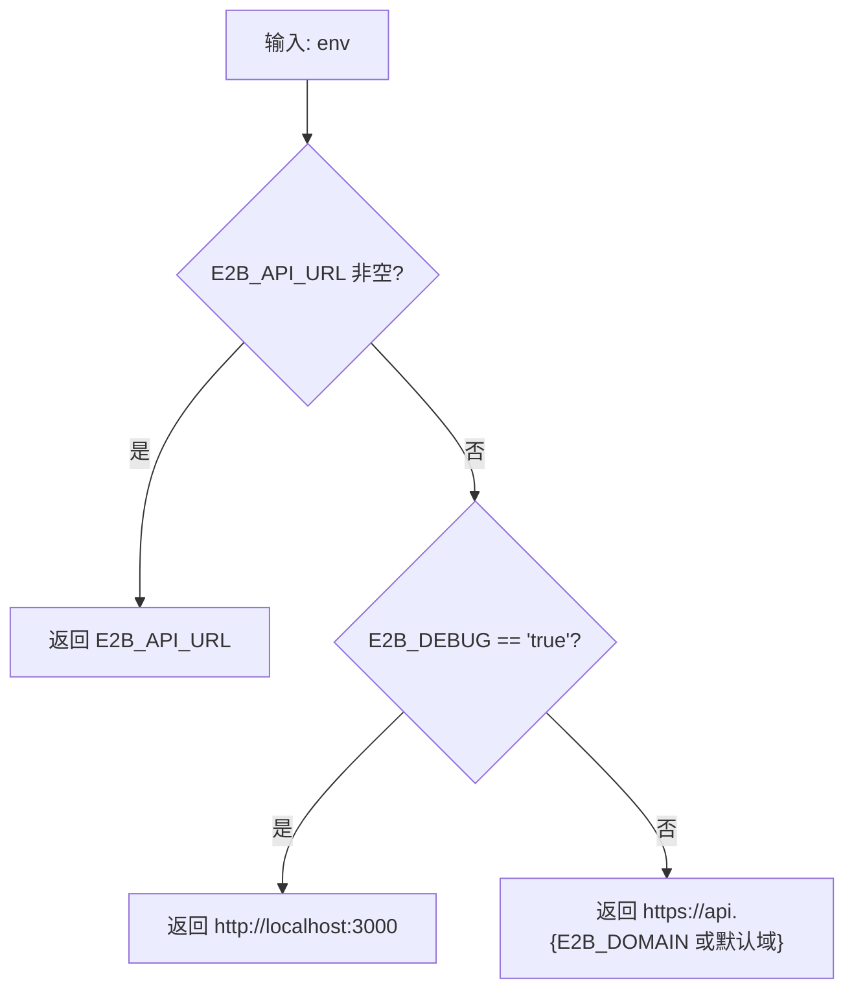
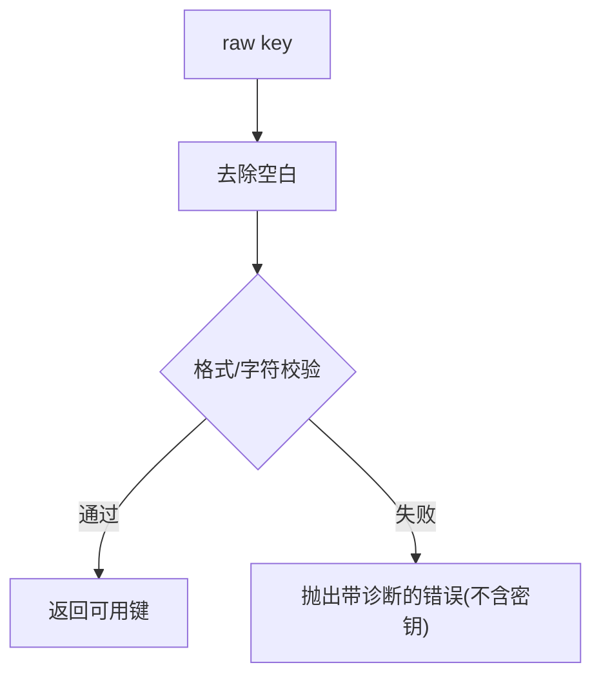
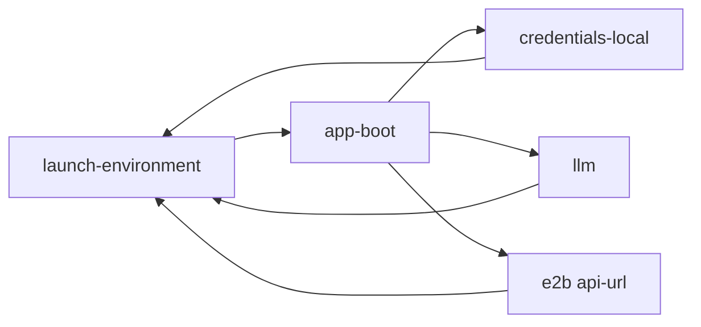

# 环境变量注入

<cite>
**本文引用的文件**
- [packages/util/launch-environment/src/index.ts](file://packages/util/launch-environment/src/index.ts)
- [packages/boot/app-boot/src/index.ts](file://packages/boot/app-boot/src/index.ts)
- [packages/credentials/credentials-local/src/index.ts](file://packages/credentials/credentials-local/src/index.ts)
- [packages/e2b/e2b/src/api-url.ts](file://packages/e2b/e2b/src/api-url.ts)
- [packages/llm/llm/src/index.ts](file://packages/llm/llm/src/index.ts)
- [packages/settings/settings/src/index.ts](file://packages/settings/settings/src/index.ts)
</cite>

## 目录
1. [简介](#简介)
2. [项目结构](#项目结构)
3. [核心组件](#核心组件)
4. [架构总览](#架构总览)
5. [详细组件分析](#详细组件分析)
6. [依赖关系分析](#依赖关系分析)
7. [性能考虑](#性能考虑)
8. [故障排查指南](#故障排查指南)
9. [结论](#结论)
10. [附录](#附录)

## 简介
本指南系统性说明 Harness 中的“设置变量注入机制”，聚焦如何在配置与运行期安全、可追溯地注入环境变量，覆盖内置变量（如 DSH_HOME、E2B_API_KEY 等）的使用方式、解析顺序与默认值处理、敏感信息的安全存储策略、不同环境（开发/测试/生产）的配置模式，以及环境变量验证与错误处理的实践。

## 项目结构
围绕环境变量注入的关键代码分布在以下模块：
- 启动时环境快照与分层来源追踪：@deepseek-ai/dsh-launch-environment
- 应用引导与环境层加载、校验与合并：@deepseek-ai/dsh-app-boot
- 凭据提供者的分层解析（进程环境 > 受管文档 > 项目 .env > 用户 .env）：@deepseek-ai/dsh-credentials-local
- E2B API URL 推导（基于环境变量）：@deepseek-ai/dsh-e2b
- LLM 适配器对 API Key 的规范化与可用性断言：@deepseek-ai/dsh-llm
- 用户设置服务（settings）的分层与校验：@deepseek-ai/dsh-settings



**图表来源**
- [packages/util/launch-environment/src/index.ts:1-125](file://packages/util/launch-environment/src/index.ts#L1-L125)
- [packages/boot/app-boot/src/index.ts:74-219](file://packages/boot/app-boot/src/index.ts#L74-L219)
- [packages/credentials/credentials-local/src/index.ts:1-36](file://packages/credentials/credentials-local/src/index.ts#L1-L36)
- [packages/e2b/e2b/src/api-url.ts:1-26](file://packages/e2b/e2b/src/api-url.ts#L1-L26)
- [packages/llm/llm/src/index.ts:126-150](file://packages/llm/llm/src/index.ts#L126-L150)
- [packages/settings/settings/src/index.ts:1-100](file://packages/settings/settings/src/index.ts#L1-L100)

**章节来源**
- [packages/util/launch-environment/src/index.ts:1-125](file://packages/util/launch-environment/src/index.ts#L1-L125)
- [packages/boot/app-boot/src/index.ts:74-219](file://packages/boot/app-boot/src/index.ts#L74-L219)
- [packages/credentials/credentials-local/src/index.ts:1-36](file://packages/credentials/credentials-local/src/index.ts#L1-L36)
- [packages/e2b/e2b/src/api-url.ts:1-26](file://packages/e2b/e2b/src/api-url.ts#L1-L26)
- [packages/llm/llm/src/index.ts:126-150](file://packages/llm/llm/src/index.ts#L126-L150)
- [packages/settings/settings/src/index.ts:1-100](file://packages/settings/settings/src/index.ts#L1-L100)

## 核心组件
- 启动环境快照（LaunchEnvironmentSnapshot）
  - 记录每个变量来自哪个层（进程/项目 .env/用户 .env），并提供按信任顺序的查询接口。
- 应用引导与环境层加载（loadLayeredEnv）
  - 读取并校验项目与用户 .env，拒绝“仅允许由启动环境设置的变量”（如 DSH_*、XDG_*、网络代理相关等），并将合法值合并到进程环境，同时生成不可变快照供后续消费。
- 凭据提供者（credentials-local）
  - 以“进程环境 > 受管文档 > 项目 .env > 用户 .env”的顺序解析密钥；受管文档为可写且热更新，进程环境始终只读且优先级最高。
- E2B API URL 推导（e2bApiUrl）
  - 按 E2B_API_URL > E2B_DEBUG > E2B_DOMAIN 的优先级推导控制面地址。
- LLM API Key 校验（assertUsableApiKey / normalizeApiKey）
  - 对原始键进行修剪与格式校验，失败时给出明确诊断且不泄露密钥片段。
- 设置服务（settings）
  - 提供命名空间注册、分层解析（schema 默认值 > base > 用户层）、变更监听与跨字段校验。

**章节来源**
- [packages/util/launch-environment/src/index.ts:11-52](file://packages/util/launch-environment/src/index.ts#L11-L52)
- [packages/boot/app-boot/src/index.ts:95-219](file://packages/boot/app-boot/src/index.ts#L95-L219)
- [packages/credentials/credentials-local/src/index.ts:1-36](file://packages/credentials/credentials-local/src/index.ts#L1-L36)
- [packages/e2b/e2b/src/api-url.ts:6-26](file://packages/e2b/e2b/src/api-url.ts#L6-L26)
- [packages/llm/llm/src/index.ts:126-150](file://packages/llm/llm/src/index.ts#L126-L150)
- [packages/settings/settings/src/index.ts:48-100](file://packages/settings/settings/src/index.ts#L48-L100)

## 架构总览
下图展示了从进程启动到各组件消费环境变量的完整链路，包括 .env 加载、校验、快照构建、凭据解析、URL 推导与设置服务。



**图表来源**
- [packages/boot/app-boot/src/index.ts:74-219](file://packages/boot/app-boot/src/index.ts#L74-L219)
- [packages/util/launch-environment/src/index.ts:78-117](file://packages/util/launch-environment/src/index.ts#L78-L117)
- [packages/credentials/credentials-local/src/index.ts:550-571](file://packages/credentials/credentials-local/src/index.ts#L550-L571)
- [packages/e2b/e2b/src/api-url.ts:21-26](file://packages/e2b/e2b/src/api-url.ts#L21-L26)
- [packages/llm/llm/src/index.ts:126-150](file://packages/llm/llm/src/index.ts#L126-L150)

## 详细组件分析

### 启动环境快照与分层来源（launch-environment）
- 设计要点
  - 将进程继承环境、项目 .env、用户 .env 视为三层，按“进程 > 项目 .env > 用户 .env”的固定顺序查询。
  - 提供 get(name) 与 getFrom(name, sources) 两种查询方式，后者可按需限制来源集合。
  - 保留来源路径（除进程层外），便于诊断与审计。
- 复杂度
  - 构建快照时对每层键名做平台大小写折叠（Windows 不区分大小写），查找时间近似 O(1)。
- 优化建议
  - 避免重复构造快照；在插件树启动前一次性创建并在 Context 中共享。
- 错误处理
  - 若未提供 Context 快照，则回退为仅包含进程环境的快照，保证兼容性。

```mermaid
flowchart TD
Start(["构建快照"]) --> CopyLayers["复制各层键值并折叠大小写"]
CopyLayers --> BuildMap["按来源分组 Map"]
BuildMap --> Query{"查询方式"}
Query --> |get(name)| FullOrder["按全序遍历: 进程→项目→用户"]
Query --> |getFrom(name, sources)| Restricted["按指定来源子集遍历"]
FullOrder --> Return["返回 {value, source, path?}"]
Restricted --> Return
```

**图表来源**
- [packages/util/launch-environment/src/index.ts:78-117](file://packages/util/launch-environment/src/index.ts#L78-L117)

**章节来源**
- [packages/util/launch-environment/src/index.ts:11-52](file://packages/util/launch-environment/src/index.ts#L11-L52)
- [packages/util/launch-environment/src/index.ts:78-117](file://packages/util/launch-environment/src/index.ts#L78-L117)

### 应用引导与环境层加载（app-boot）
- 解析顺序与默认值
  - 先解析项目 .env（cwd/.env），再解析用户 .env（$DSH_HOME/.env），两者均不得覆盖进程继承的值。
  - 缺失 .env 视为无该层，不会报错。
- 安全约束
  - 禁止在项目与用户 .env 中设置“仅启动环境可设”的变量（如 PATH、NODE_OPTIONS、SSL_*、HTTP_PROXY 系列、DSH_*、XDG_* 等）。
  - 用户 .env（位于 $DSH_HOME）允许设置 HTTP_PROXY/HTTPS_PROXY/ALL_PROXY/NO_PROXY，用于全局代理配置。
- 错误处理
  - 无法读取 .env 时输出单行警告；遇到被禁止的变量直接抛出错误，阻止启动。
- 最佳实践
  - 将敏感变量通过进程环境传入（CI、容器 -e、shell export），不要放入仓库内的 .env。
  - 使用 loadLayeredEnv 而非直接 process.loadEnvFile，以获得统一快照与校验。



**图表来源**
- [packages/boot/app-boot/src/index.ts:74-219](file://packages/boot/app-boot/src/index.ts#L74-L219)

**章节来源**
- [packages/boot/app-boot/src/index.ts:95-219](file://packages/boot/app-boot/src/index.ts#L95-L219)

### 凭据提供者（credentials-local）
- 分层优先级
  - 进程继承环境（只读，最高优先）
  - 受管文档 $DSH_HOME/.credentials.yaml（可写，热更新）
  - 项目 .env（cwd/.env，只读后备）
  - 用户 .env（$DSH_HOME/.env，只读后备）
- 安全特性
  - 文件权限检查：要求所有者可读，其他用户不可读（POSIX）。
  - 写入采用原子替换与跨进程写锁，确保并发安全与一致性。
  - 对外暴露 describe 时隐藏敏感值，仅显示元数据。
- 与 .env 的关系
  - 不再把受管密钥混入进程环境；仅当没有 mounted 凭据 seam 时才回退到环境层解析。
- 错误处理
  - 解析失败、权限不当、版本不兼容等会抛出明确错误，避免静默失败。



**图表来源**
- [packages/credentials/credentials-local/src/index.ts:1-36](file://packages/credentials/credentials-local/src/index.ts#L1-L36)
- [packages/credentials/credentials-local/src/index.ts:550-571](file://packages/credentials/credentials-local/src/index.ts#L550-L571)

**章节来源**
- [packages/credentials/credentials-local/src/index.ts:1-36](file://packages/credentials/credentials-local/src/index.ts#L1-L36)
- [packages/credentials/credentials-local/src/index.ts:550-571](file://packages/credentials/credentials-local/src/index.ts#L550-L571)

### E2B API URL 推导（e2b-api-url）
- 解析顺序
  - 显式 E2B_API_URL 优先
  - 否则若 E2B_DEBUG=true，则使用本地调试地址
  - 否则拼接 https://api.{E2B_DOMAIN}，默认域为 e2b.app
- 适用场景
  - 多环境切换（开发/测试/生产）可通过环境变量快速调整控制面地址。



**图表来源**
- [packages/e2b/e2b/src/api-url.ts:6-26](file://packages/e2b/e2b/src/api-url.ts#L6-L26)

**章节来源**
- [packages/e2b/e2b/src/api-url.ts:6-26](file://packages/e2b/e2b/src/api-url.ts#L6-L26)

### LLM API Key 校验（assertUsableApiKey / normalizeApiKey）
- 行为
  - 去除首尾空白，校验字符集与长度等规则，返回可用键或失败原因。
  - 失败时诊断明确指出应修改的位置（如 DEEPSEEK_API_KEY），且不打印密钥片段。
- 集成点
  - 适配器在解析 apiKeyEnv 指向的环境值后调用此函数，确保进入网络请求前键有效。



**图表来源**
- [packages/llm/llm/src/index.ts:126-150](file://packages/llm/llm/src/index.ts#L126-L150)

**章节来源**
- [packages/llm/llm/src/index.ts:126-150](file://packages/llm/llm/src/index.ts#L126-L150)

### 设置服务（settings）
- 分层模型
  - schema 默认值 → 组合层 base → 用户层（settings 文档）
- 作用时机
  - applies: live/restart，指示变更生效时机。
- 校验
  - 支持跨字段校验，失败时拒绝写入或保持上次有效值并告警。
- 与环境的协作
  - 通常通过 credentials 与 launch environment 间接消费环境变量，settings 本身不直接绑定特定环境变量名。

**章节来源**
- [packages/settings/settings/src/index.ts:48-100](file://packages/settings/settings/src/index.ts#L48-L100)

## 依赖关系分析
- 低耦合与高内聚
  - launch-environment 提供不可变快照，其他组件仅消费其查询接口，避免直接读写 process.env。
  - app-boot 集中负责 .env 加载与校验，屏蔽具体实现细节。
  - credentials-local 将受管文档与 .env 解耦，遵循明确的优先级。
- 外部依赖
  - Node.js 原生 .env 解析与文件系统 API。
  - YAML 解析与原子写入（凭据文档）。
- 潜在循环依赖
  - 当前模块边界清晰，未见循环引用风险。



**图表来源**
- [packages/util/launch-environment/src/index.ts:78-117](file://packages/util/launch-environment/src/index.ts#L78-L117)
- [packages/boot/app-boot/src/index.ts:74-219](file://packages/boot/app-boot/src/index.ts#L74-L219)
- [packages/credentials/credentials-local/src/index.ts:1-36](file://packages/credentials/credentials-local/src/index.ts#L1-L36)
- [packages/e2b/e2b/src/api-url.ts:6-26](file://packages/e2b/e2b/src/api-url.ts#L6-L26)
- [packages/llm/llm/src/index.ts:126-150](file://packages/llm/llm/src/index.ts#L126-L150)

**章节来源**
- [packages/util/launch-environment/src/index.ts:78-117](file://packages/util/launch-environment/src/index.ts#L78-L117)
- [packages/boot/app-boot/src/index.ts:74-219](file://packages/boot/app-boot/src/index.ts#L74-L219)
- [packages/credentials/credentials-local/src/index.ts:1-36](file://packages/credentials/credentials-local/src/index.ts#L1-L36)
- [packages/e2b/e2b/src/api-url.ts:6-26](file://packages/e2b/e2b/src/api-url.ts#L6-L26)
- [packages/llm/llm/src/index.ts:126-150](file://packages/llm/llm/src/index.ts#L126-L150)

## 性能考虑
- 启动阶段
  - .env 解析与快照构建均为轻量操作，建议在进程启动早期完成一次并复用。
- 运行时
  - 凭据提供者对受管文档启用 watcher 与去抖，避免频繁重读；写入采用原子替换减少竞争。
- 建议
  - 避免在高频路径中重复查询环境快照；通过 Context 缓存。
  - 对大段配置（如 settings）使用懒加载与增量更新。

[本节为通用指导，无需特定文件来源]

## 故障排查指南
- 常见错误与定位
  - 在 .env 中设置了禁止变量（如 DSH_*、PATH、SSL_*、HTTP_PROXY 等）：启动时会抛出错误，提示应从进程环境导出或放入 $DSH_HOME/.env（仅限代理变量）。
  - .env 文件不可读：会输出单行警告，程序继续依赖进程环境。
  - 凭据文档权限不正确：POSIX 下会拒绝读取并提示 chmod 600。
  - API Key 无效：LLM 适配器会抛出诊断错误，指出应修正的环境变量名。
- 诊断技巧
  - 使用 launch-environment 的 get/getFrom 查看变量来源与路径。
  - 使用 settings describe 查看命名空间的用户层与 base 层差异。
  - 检查 E2B_* 环境变量是否正确设置，必要时切换到调试地址验证连通性。

**章节来源**
- [packages/boot/app-boot/src/index.ts:95-219](file://packages/boot/app-boot/src/index.ts#L95-L219)
- [packages/credentials/credentials-local/src/index.ts:114-146](file://packages/credentials/credentials-local/src/index.ts#L114-L146)
- [packages/llm/llm/src/index.ts:126-150](file://packages/llm/llm/src/index.ts#L126-L150)
- [packages/e2b/e2b/src/api-url.ts:6-26](file://packages/e2b/e2b/src/api-url.ts#L6-L26)

## 结论
Harness 的环境变量注入机制通过“不可变快照 + 严格分层 + 安全校验”的方式，实现了：
- 清晰的解析顺序与默认值处理
- 对敏感信息的隔离与安全存储
- 跨环境的一致性与可观测性
- 健壮的错误处理与诊断能力

推荐实践：
- 将敏感变量置于进程环境或受管凭据文档，避免入库
- 使用 loadLayeredEnv 统一加载与校验
- 通过 settings 管理非敏感配置，结合 schema 与 validate 保障正确性
- 针对不同环境通过环境变量切换行为（如 E2B_*、代理、调试开关）

[本节为总结性内容，无需特定文件来源]

## 附录
- 常用内置变量与用途
  - DSH_HOME：Harness 用户根目录，用于定位用户级 .env、凭据文档与设置文件
  - E2B_API_URL：显式指定 E2B 控制面地址
  - E2B_DEBUG：启用本地调试控制面
  - E2B_DOMAIN：E2B 控制面域名（默认 e2b.app）
  - DEEPSEEK_API_KEY 等：通过 apiKeyEnv 指向的环境变量名，由 LLM 适配器校验并使用
- 不同环境的配置模式
  - 开发：可使用 E2B_DEBUG=true 与本地代理；API Key 通过 shell export 注入
  - 测试：通过 CI 注入环境变量；必要时使用独立 DSH_HOME 隔离
  - 生产：仅允许进程环境与受管凭据文档；禁用调试开关；严格权限控制

[本节为补充信息，无需特定文件来源]