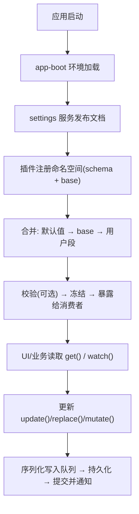
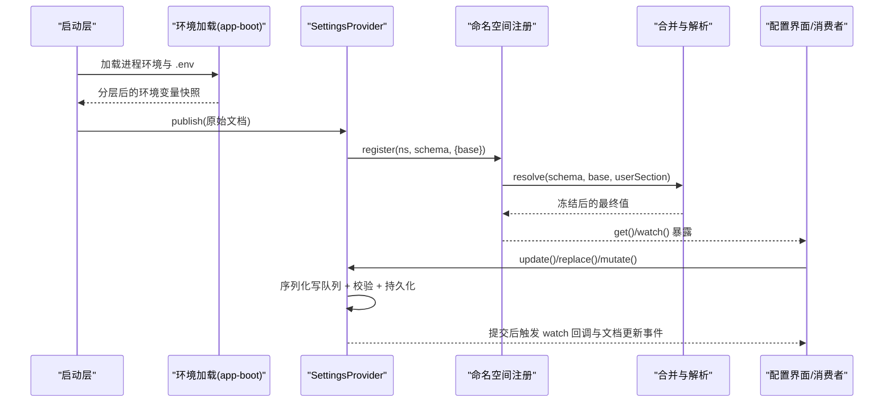
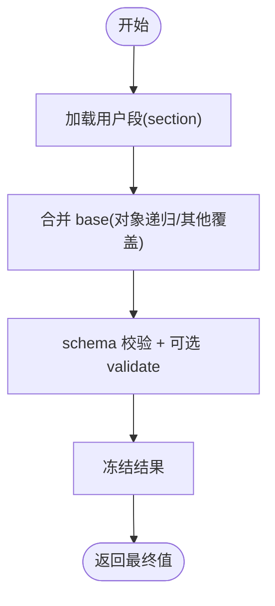
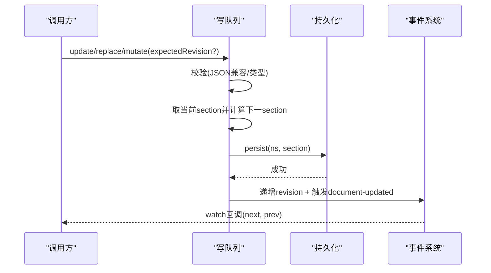
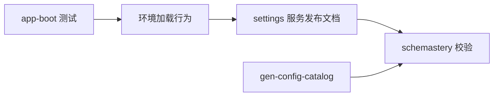

# 配置合并与覆盖

<cite>
**本文引用的文件**
- [packages/settings/settings/src/index.ts](file://packages/settings/settings/src/index.ts)
- [packages/settings/settings/src/redact.ts](file://packages/settings/settings/src/redact.ts)
- [.agents/notes/implemented/architecture/2026-08-04-configuration-source-ownership.zh.md](file://.agents/notes/implemented/architecture/2026-08-04-configuration-source-ownership.zh.md)
- [packages/boot/app-boot/tests/config-reload.spec.ts](file://packages/boot/app-boot/tests/config-reload.spec.ts)
- [packages/boot/app-boot/tests/app-boot.spec.ts](file://packages/boot/app-boot/tests/app-boot.spec.ts)
- [scripts/gen-config-catalog.ts](file://scripts/gen-config-catalog.ts)
</cite>

## 目录
1. [简介](#简介)
2. [项目结构](#项目结构)
3. [核心组件](#核心组件)
4. [架构总览](#架构总览)
5. [详细组件分析](#详细组件分析)
6. [依赖关系分析](#依赖关系分析)
7. [性能考虑](#性能考虑)
8. [故障排查指南](#故障排查指南)
9. [结论](#结论)
10. [附录](#附录)

## 简介
本文件聚焦于“配置合并与覆盖”的完整规则与实践，涵盖多层配置的优先级、继承机制、可覆盖字段与只读字段、冲突解决策略以及调试方法。内容基于代码库中的设置服务实现、环境加载测试与架构决策笔记，确保读者既能理解高层策略，也能定位到具体实现位置。

## 项目结构
- 用户设置（Settings）由 settings 包提供统一的服务抽象与合并、校验、持久化与变更通知能力。
- 非机密值与环境变量遵循统一的解析顺序；凭据采用更窄且独立的顺序。
- 启动期环境加载通过 app-boot 层完成，并在测试中验证了“仅继承进程环境”和“项目 .env 读取一次”的行为。
- 配置目录生成脚本对 schema 组合方式（intersect/union）进行静态检查，辅助维护配置结构的正确性。

**图表来源**
- [packages/settings/settings/src/index.ts:333-468](file://packages/settings/settings/src/index.ts#L333-L468)
- [packages/settings/settings/src/index.ts:700-727](file://packages/settings/settings/src/index.ts#L700-L727)
- [packages/settings/settings/src/index.ts:739-753](file://packages/settings/settings/src/index.ts#L739-L753)

**章节来源**
- [packages/settings/settings/src/index.ts:333-468](file://packages/settings/settings/src/index.ts#L333-L468)
- [packages/settings/settings/src/index.ts:700-727](file://packages/settings/settings/src/index.ts#L700-L727)
- [packages/settings/settings/src/index.ts:739-753](file://packages/settings/settings/src/index.ts#L739-L753)

## 核心组件
- SettingsProvider：定义命名空间注册、文档发布、合并解析、写队列、版本控制与事件通知。
- mergeLayers：对象递归合并，其他类型（含数组）整体覆盖。
- cloneJsonShaped：写前校验与深拷贝，拒绝非 JSON 兼容值与循环引用。
- applyPathOp：路径级 set/unset 操作，用于 mutate 模式。
- redactSecrets：按 schema 标记的 secret 字段进行脱敏输出。

关键行为要点
- 合并顺序：schema 默认值 → 插件 composition base → 用户存储段。
- 写操作三种模式：merge（局部合并）、replace（整段替换）、mutate（路径级编辑）。
- 并发安全：每命名空间串行写队列；提交时比较 revision 防丢失更新。
- 只读/可写：provider.writable 决定能否在进程内更新；read-only provider 仅能读。

**章节来源**
- [packages/settings/settings/src/index.ts:280-295](file://packages/settings/settings/src/index.ts#L280-L295)
- [packages/settings/settings/src/index.ts:231-278](file://packages/settings/settings/src/index.ts#L231-L278)
- [packages/settings/settings/src/index.ts:194-218](file://packages/settings/settings/src/index.ts#L194-L218)
- [packages/settings/settings/src/index.ts:333-468](file://packages/settings/settings/src/index.ts#L333-L468)
- [packages/settings/settings/src/index.ts:562-691](file://packages/settings/settings/src/index.ts#L562-L691)
- [packages/settings/settings/src/redact.ts:50-83](file://packages/settings/settings/src/redact.ts#L50-L83)

## 架构总览
下图展示从启动到最终生效的配置流，包括环境加载、设置文档发布、命名空间注册与合并解析。

**图表来源**
- [packages/boot/app-boot/tests/app-boot.spec.ts:331-359](file://packages/boot/app-boot/tests/app-boot.spec.ts#L331-L359)
- [packages/settings/settings/src/index.ts:359-369](file://packages/settings/settings/src/index.ts#L359-L369)
- [packages/settings/settings/src/index.ts:419-458](file://packages/settings/settings/src/index.ts#L419-L458)
- [packages/settings/settings/src/index.ts:700-727](file://packages/settings/settings/src/index.ts#L700-L727)
- [packages/settings/settings/src/index.ts:739-753](file://packages/settings/settings/src/index.ts#L739-L753)

## 详细组件分析

### 多层配置的合并策略与优先级
- 非机密值的统一顺序（从高到低）：
  - 本次运行显式覆盖（如 CLI 参数/操作级覆盖）
  - 用户设置（settings.yaml）
  - 组合层（profile bundles、用户 patch 层、--patch 叠加）
  - 本次启动的 shell 继承环境
  - 发现的文件（<invocation cwd>/.env，然后 $DSH_HOME/.env）
  - 默认值（schema 默认、提供方公开默认）
- 凭据采用独立且更窄的顺序：
  - 继承进程环境（只读，最高优先）
  - $DSH_HOME/.credentials.yaml（受管文档，可写）
  - <invocation cwd>/.env
  - $DSH_HOME/.env

这些顺序决定了运行时最终取值来源，确保部署方可以稳定地钉住关键配置，同时允许用户在合理范围内覆盖。

**章节来源**
- [.agents/notes/implemented/architecture/2026-08-04-configuration-source-ownership.zh.md:17-40](file://.agents/notes/implemented/architecture/2026-08-04-configuration-source-ownership.zh.md#L17-L40)

### 继承机制与覆盖规则
- 继承来源
  - 插件通过 register 传入 base（composition layer），作为“低于用户层”的基线。
  - 用户层来自已持久化的 raw document 对应 section。
  - 最终值 = schema 默认值 → base → 用户层。
- 覆盖语义
  - 对象属性递归合并；数组与其他类型整体覆盖。
  - 写前会深拷贝并校验 JSON 兼容性，避免非法值进入持久化。
  - 路径级 mutate 支持 set/unset，适合持有部分视图的场景（例如 UI 看到脱敏后的值）。
- 只读与可写
  - provider.writable=false 时，禁止进程内更新，只能读取。
  - 某些值（如凭据的环境变量）为只读来源，无法被后续层覆盖。

**图表来源**
- [packages/settings/settings/src/index.ts:280-295](file://packages/settings/settings/src/index.ts#L280-L295)
- [packages/settings/settings/src/index.ts:739-753](file://packages/settings/settings/src/index.ts#L739-L753)

**章节来源**
- [packages/settings/settings/src/index.ts:280-295](file://packages/settings/settings/src/index.ts#L280-L295)
- [packages/settings/settings/src/index.ts:739-753](file://packages/settings/settings/src/index.ts#L739-L753)

### 写操作模型与冲突处理
- 三种写模式
  - update(patch)：将 patch 合并到当前用户段。
  - replace(section)：用新段完全替换，缺失键回退到 base 与默认值。
  - mutate(ops)：按路径 set/unset，适合增量编辑。
- 并发与一致性
  - 每个命名空间有串行写队列，避免交错。
  - 提交前校验 expectedRevision，若不一致抛出冲突错误。
  - 外部文档变更通过 publish 重算所有命名空间，并递增 revision。

**图表来源**
- [packages/settings/settings/src/index.ts:562-691](file://packages/settings/settings/src/index.ts#L562-L691)
- [packages/settings/settings/src/index.ts:700-727](file://packages/settings/settings/src/index.ts#L700-L727)

**章节来源**
- [packages/settings/settings/src/index.ts:562-691](file://packages/settings/settings/src/index.ts#L562-L691)
- [packages/settings/settings/src/index.ts:700-727](file://packages/settings/settings/src/index.ts#L700-L727)

### 脱敏与可见性
- 通过 schema 标记 role('secret') 的字段会在描述接口中被移除，并在 secrets 列表中记录其路径与是否设置。
- 这保证了跨进程或 UI 展示时不会泄露敏感信息，同时保留“哪些字段是用户覆盖”的能力。

**章节来源**
- [packages/settings/settings/src/redact.ts:50-83](file://packages/settings/settings/src/redact.ts#L50-L83)
- [packages/settings/settings/src/index.ts:505-537](file://packages/settings/settings/src/index.ts#L505-L537)

### 复杂场景示例（概念说明）
- 场景A：部署方希望固定某端点，不被用户 settings 覆盖
  - 策略：将该字段放在 composition base 或更高优先级层；根据架构决策，composition 高于环境，因此陈旧的环境变量不会改写已配置的 endpoint。
- 场景B：多 profile bundle 叠加用户 patch 与 --patch overlay
  - 策略：bundle 与 patch 均属于 composition 层，最终以 entry config 形式到达 settings seam，无法区分来源；如需更强约束，应使用产品 CLI 自带 bin/loader 或禁用 settings provider。
- 场景C：UI 持有脱敏视图，需要只改一个子字段
  - 策略：使用 mutate 的路径操作 set/unset，避免 replace 导致未看到的 secret 字段被误删。

[本节为概念性说明，不直接分析具体文件]

## 依赖关系分析
- settings 包依赖 schemastery 做 schema 校验与默认值填充。
- app-boot 负责环境加载，测试覆盖了“仅继承进程环境”和“项目 .env 仅读取一次”的行为。
- gen-config-catalog 对 schema 的组合方式（intersect/union）进行静态检查，保证配置目录生成的正确性。

**图表来源**
- [packages/boot/app-boot/tests/app-boot.spec.ts:331-359](file://packages/boot/app-boot/tests/app-boot.spec.ts#L331-L359)
- [scripts/gen-config-catalog.ts:463-491](file://scripts/gen-config-catalog.ts#L463-L491)
- [packages/settings/settings/src/index.ts:359-369](file://packages/settings/settings/src/index.ts#L359-L369)

**章节来源**
- [packages/boot/app-boot/tests/app-boot.spec.ts:331-359](file://packages/boot/app-boot/tests/app-boot.spec.ts#L331-L359)
- [scripts/gen-config-catalog.ts:463-491](file://scripts/gen-config-catalog.ts#L463-L491)
- [packages/settings/settings/src/index.ts:359-369](file://packages/settings/settings/src/index.ts#L359-L369)

## 性能考虑
- 合并复杂度：mergeLayers 对对象进行递归合并，时间复杂度与对象深度和键数相关；应避免过深的嵌套结构。
- 写队列串行：同一命名空间的写操作串行执行，避免竞态但可能排队；建议批量合并多次小更新。
- 冻结与深拷贝：resolve 后 deepFreeze 提升稳定性；cloneJsonShaped 在写前做一次深拷贝，注意大对象开销。
- 事件广播：publish 会遍历所有注册命名空间重新解析，频繁外部文档变更时应合并批处理。

[本节提供通用指导，不直接分析具体文件]

## 故障排查指南
- 常见错误
  - 命名空间未注册：调用 write/get 前需先 register。
  - 服务已停止：dispose 后拒绝新写与新监听。
  - 只读 provider：writable=false 时无法更新。
  - 非 JSON 兼容数据：write 前会被拒绝，包含路径信息便于定位。
  - 并发冲突：expectedRevision 不匹配时抛出冲突错误。
- 诊断步骤
  - 使用 describe 获取每个命名空间的 schema、value、base、user 与 secrets，确认实际覆盖来源。
  - 观察 settings/document-updated 事件，追踪外部文档变更导致的重解析。
  - 检查 app-boot 环境加载行为，确认 .env 是否被重复读取或遗漏。
  - 对于凭据问题，确认环境变量是否为只读来源且优先级最高。

**章节来源**
- [packages/settings/settings/src/index.ts:620-691](file://packages/settings/settings/src/index.ts#L620-L691)
- [packages/settings/settings/src/index.ts:700-727](file://packages/settings/settings/src/index.ts#L700-L727)
- [packages/boot/app-boot/tests/config-reload.spec.ts:209-249](file://packages/boot/app-boot/tests/config-reload.spec.ts#L209-L249)
- [packages/boot/app-boot/tests/app-boot.spec.ts:331-359](file://packages/boot/app-boot/tests/app-boot.spec.ts#L331-L359)

## 结论
- 配置合并遵循清晰的多层优先级：默认值 → base → 用户段；非机密值与环境变量有统一顺序，凭据有独立且更窄的顺序。
- 继承与覆盖通过 schema + base + 用户段实现，对象递归合并、其他类型整体覆盖。
- 写操作提供 merge/replace/mutate 三种模式，配合串行写队列与 revision 检查保障一致性与并发安全。
- 脱敏机制确保敏感字段不出网，同时保留“用户覆盖”的可观测性。
- 通过 describe、事件与测试用例，可高效定位配置来源与冲突原因。

[本节总结性内容，不直接分析具体文件]

## 附录
- 实践建议
  - 将不可覆盖的关键配置放入 composition base 或更高优先级层。
  - 使用 mutate 进行细粒度编辑，避免 replace 带来的副作用。
  - 对外部文档变更进行批处理，减少频繁 publish 的开销。
  - 在 UI 中使用 describe 的 secrets 列表提示用户哪些字段不可见但存在。

[本节为补充建议，不直接分析具体文件]