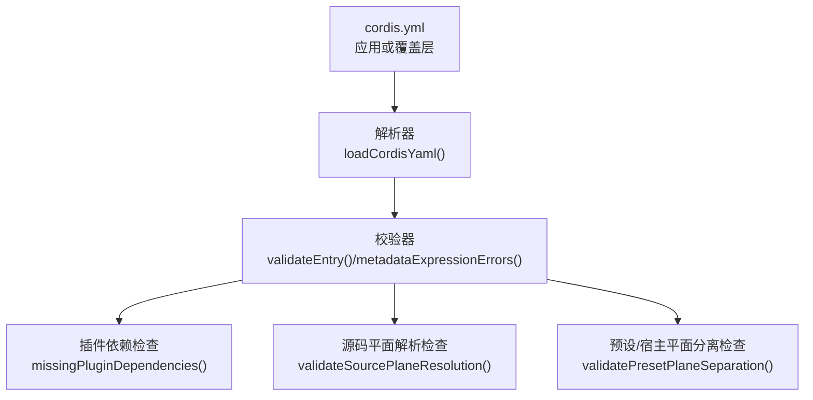
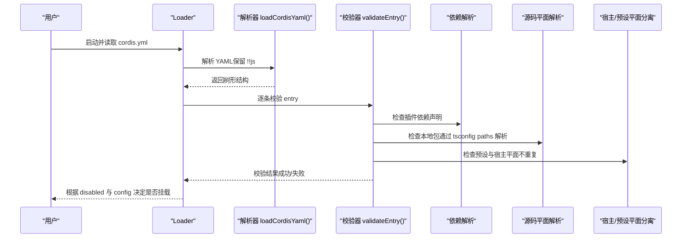
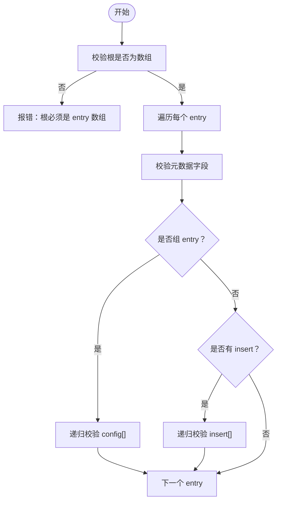
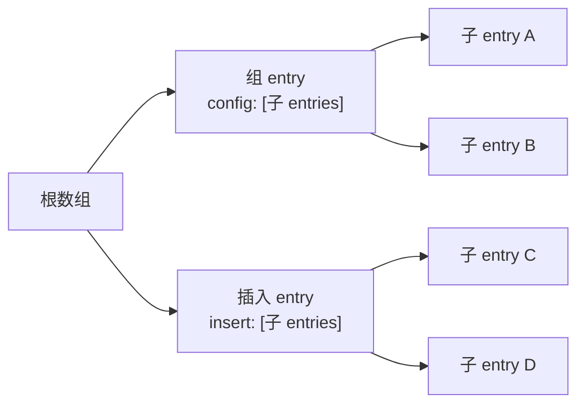
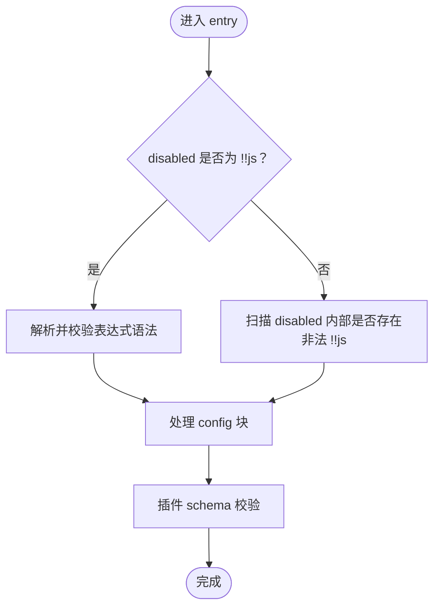
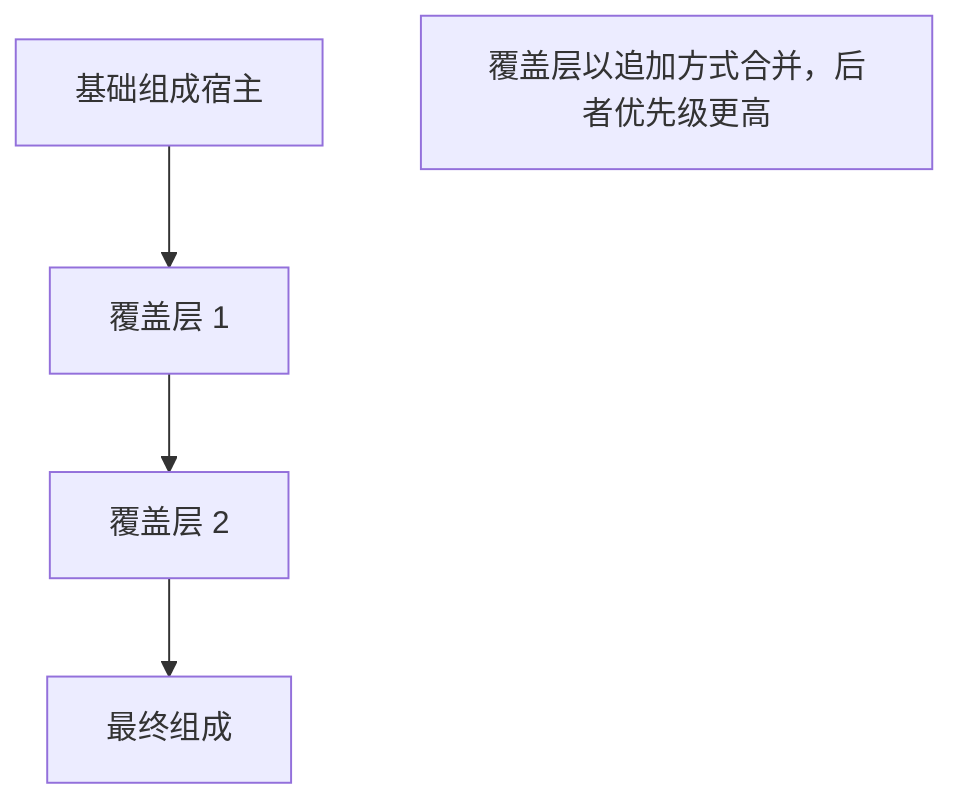
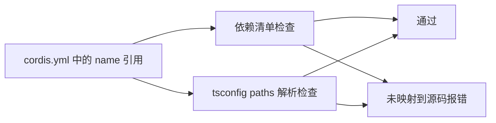

# 配置文件结构

<cite>
**本文引用的文件**
- [scripts/verify-cordis-config.ts](file://scripts/verify-cordis-config.ts)
- [scripts/cordis-yaml.ts](file://scripts/cordis-yaml.ts)
- [apps/cli/config/examples/cordis/cordis.yml](file://apps/cli/config/examples/cordis/cordis.yml)
- [apps/cli/config/examples/github-review/cordis.yml](file://apps/cli/config/examples/github-review/cordis.yml)
- [apps/cli/config/examples/schedule/cordis.yml](file://apps/cli/config/examples/schedule/cordis.yml)
- [docs/cordis-tutorial/05-config.md](file://docs/cordis-tutorial/05-config.md)
- [docs/cordis-primer.md](file://docs/cordis-primer.md)
</cite>

## 目录
1. [简介](#简介)
2. [项目结构](#项目结构)
3. [核心组件](#核心组件)
4. [架构总览](#架构总览)
5. [详细组件分析](#详细组件分析)
6. [依赖关系分析](#依赖关系分析)
7. [性能考虑](#性能考虑)
8. [故障排查指南](#故障排查指南)
9. [结论](#结论)
10. [附录](#附录)

## 简介
本文件面向 Cordis 插件框架的配置文件 cordis.yml，系统化说明其层次结构与语法规范，覆盖顶层数组、entry 对象（id、name、config、disabled、group、inject、intercept、isolate、insert 等）的定义与用途；解释嵌套结构（组 group、插入 insert、补丁 patches）如何组织多个插件配置；梳理继承与优先级规则；提供多场景示例与验证规则、常见错误提示。

## 项目结构
仓库中用于解析与校验 cordis.yml 的核心逻辑集中在 scripts 目录：
- 解析与类型判断：scripts/cordis-yaml.ts
- 元数据与依赖校验：scripts/verify-cordis-config.ts
- 示例与覆盖层：apps/cli/config/examples 下的多个 cordis.yml 片段
- 文档参考：docs/cordis-tutorial/05-config.md、docs/cordis-primer.md

图表来源
- [scripts/cordis-yaml.ts:23-30](file://scripts/cordis-yaml.ts#L23-L30)
- [scripts/verify-cordis-config.ts:60-88](file://scripts/verify-cordis-config.ts#L60-L88)

章节来源
- [scripts/cordis-yaml.ts:1-55](file://scripts/cordis-yaml.ts#L1-L55)
- [scripts/verify-cordis-config.ts:1-120](file://scripts/verify-cordis-config.ts#L1-L120)

## 核心组件
- 顶层结构：每个 cordis.yml 必须是一个 entry 数组。根节点不是数组会直接报错。
- Entry 对象关键字段：
  - id：行标识，便于引用与诊断定位。
  - name：插件名或内置名称（如 cordis:group）。
  - config：插件配置块，支持 !!js 表达式在加载时求值。
  - disabled：布尔或 !!js 表达式，控制挂载开关。
  - group/isolate/inject/intercept：分组、隔离域、注入服务、拦截等元信息。
  - insert：在当前作用域插入一组子 entry。
- 组（group）：当 name 为 cordis:group 或显式 group:true 时，其 config 是子 entry 列表，形成嵌套结构。
- 补丁 include：当 name 为 @deepseek-ai/cordis-plugin-include 时，可通过 config.patches 引入外部 patch 列表，并递归校验其 insert 中的条目。

章节来源
- [scripts/verify-cordis-config.ts:39-80](file://scripts/verify-cordis-config.ts#L39-L80)
- [scripts/verify-cordis-config.ts:190-221](file://scripts/verify-cordis-config.ts#L190-L221)
- [scripts/cordis-yaml.ts:43-54](file://scripts/cordis-yaml.ts#L43-L54)
- [docs/cordis-tutorial/05-config.md:70-81](file://docs/cordis-tutorial/05-config.md#L70-L81)
- [docs/cordis-primer.md:37-40](file://docs/cordis-primer.md#L37-L40)

## 架构总览
下图展示了 cordis.yml 从解析到校验再到运行时生效的整体流程，以及关键校验点。

图表来源
- [scripts/verify-cordis-config.ts:60-88](file://scripts/verify-cordis-config.ts#L60-L88)
- [scripts/cordis-yaml.ts:23-30](file://scripts/cordis-yaml.ts#L23-L30)

## 详细组件分析

### 顶层数组与 entry 对象
- 顶层必须是数组；否则报告“根必须是 Loader entry 数组”。
- 每个 entry 至少包含 id/name，且可携带 config、disabled、group、inject、intercept、isolate、insert 等字段。
- 对 entry 的递归校验会进入其 config（若为组）、insert（若为数组），以及 include 的 patches.insert。

图表来源
- [scripts/verify-cordis-config.ts:60-88](file://scripts/verify-cordis-config.ts#L60-L88)
- [scripts/verify-cordis-config.ts:190-221](file://scripts/verify-cordis-config.ts#L190-L221)

章节来源
- [scripts/verify-cordis-config.ts:60-88](file://scripts/verify-cordis-config.ts#L60-L88)
- [scripts/verify-cordis-config.ts:190-221](file://scripts/verify-cordis-config.ts#L190-L221)

### 嵌套结构：组（group）与插入（insert）
- 组：name 为 cordis:group 或 group:true 的 entry，其 config 是子 entry 列表，形成层级。
- 插入：entry 的 insert 字段允许在当前作用域插入多个子 entry，常用于组合多个插件。
- Include 补丁：name 为 @deepseek-ai/cordis-plugin-include 时，config.patches 可引入外部 patch 列表，并递归校验其 insert。

图表来源
- [scripts/cordis-yaml.ts:43-54](file://scripts/cordis-yaml.ts#L43-L54)
- [scripts/verify-cordis-config.ts:190-221](file://scripts/verify-cordis-config.ts#L190-L221)

章节来源
- [scripts/cordis-yaml.ts:43-54](file://scripts/cordis-yaml.ts#L43-L54)
- [scripts/verify-cordis-config.ts:190-221](file://scripts/verify-cordis-config.ts#L190-L221)

### 配置块 config 与动态表达式 !!js
- config 块由插件自身 schema 校验，错误会在加载时报错，避免半配置运行。
- 仅 config 与 disabled 字段允许使用 !!js 表达式；其他元数据字段保持静态字面量。
- disabled 表达式在每次挂载决策时按 loader 上下文求值；config 中的表达式在注入激活后按插件上下文求值。

图表来源
- [scripts/verify-cordis-config.ts:494-543](file://scripts/verify-cordis-config.ts#L494-L543)
- [docs/cordis-tutorial/05-config.md:70-81](file://docs/cordis-tutorial/05-config.md#L70-L81)
- [docs/cordis-primer.md:37-40](file://docs/cordis-primer.md#L37-L40)

章节来源
- [scripts/verify-cordis-config.ts:494-543](file://scripts/verify-cordis-config.ts#L494-L543)
- [docs/cordis-tutorial/05-config.md:70-81](file://docs/cordis-tutorial/05-config.md#L70-L81)
- [docs/cordis-primer.md:37-40](file://docs/cordis-primer.md#L37-L40)

### 继承关系与优先级
- 覆盖层（patch overlay）以“追加一层”的方式叠加到基础组成之上，后加载的覆盖层可以替换目标行的整个 config。
- 宿主与预设需保持平面分离：同一 row id 不应同时活跃在宿主与预设两个平面，避免重复注册或影子覆盖问题。
- 插件依赖解析范围：
  - 应用覆盖层（apps/cli/config 下）从 CLI 应用的依赖面解析。
  - 包内测试夹具从所属包的 dependencies/devDependencies 解析。
  - Bundle 层的 patch 从其 bundle 包的 dependencies 解析。

图表来源
- [apps/cli/config/examples/cordis/cordis.yml:1-8](file://apps/cli/config/examples/cordis/cordis.yml#L1-L8)
- [scripts/verify-cordis-config.ts:120-161](file://scripts/verify-cordis-config.ts#L120-L161)
- [scripts/verify-cordis-config.ts:227-267](file://scripts/verify-cordis-config.ts#L227-L267)

章节来源
- [apps/cli/config/examples/cordis/cordis.yml:1-8](file://apps/cli/config/examples/cordis/cordis.yml#L1-L8)
- [scripts/verify-cordis-config.ts:120-161](file://scripts/verify-cordis-config.ts#L120-L161)
- [scripts/verify-cordis-config.ts:227-267](file://scripts/verify-cordis-config.ts#L227-L267)

### 完整示例与场景
- Web 调试覆盖层：修改 webserver host/port，并插入 cordis-host-runner 与 tool-cordis。
- GitHub Webhook 覆盖层：在隔离域中启用 webhook 服务器与适配器，端口与环境变量通过 !!js 计算。
- Schedule 覆盖层：插入时间上下文与调度插件，并通过 disabled 控制 UI 行。

章节来源
- [apps/cli/config/examples/cordis/cordis.yml:1-20](file://apps/cli/config/examples/cordis/cordis.yml#L1-L20)
- [apps/cli/config/examples/github-review/cordis.yml:1-36](file://apps/cli/config/examples/github-review/cordis.yml#L1-L36)
- [apps/cli/config/examples/schedule/cordis.yml:1-13](file://apps/cli/config/examples/schedule/cordis.yml#L1-L13)

## 依赖关系分析
- 插件依赖声明：所有被配置的插件必须在对应作用域的依赖清单中声明，否则校验失败。
- 选择器包特殊处理：若配置了特定选择器包，还需确保其后端相关包也被声明。
- 源码平面解析：本地工作区包必须通过 tsconfig.base.json 的 paths 映射解析到 .ts/.tsx 源文件，避免依赖构建产物。

图表来源
- [scripts/verify-cordis-config.ts:227-267](file://scripts/verify-cordis-config.ts#L227-L267)
- [scripts/verify-cordis-config.ts:399-439](file://scripts/verify-cordis-config.ts#L399-L439)
- [scripts/verify-cordis-config.ts:441-463](file://scripts/verify-cordis-config.ts#L441-L463)

章节来源
- [scripts/verify-cordis-config.ts:227-267](file://scripts/verify-cordis-config.ts#L227-L267)
- [scripts/verify-cordis-config.ts:399-439](file://scripts/verify-cordis-config.ts#L399-L439)
- [scripts/verify-cordis-config.ts:441-463](file://scripts/verify-cordis-config.ts#L441-L463)

## 性能考虑
- 配置校验在启动阶段执行，尽早发现错误，避免运行时不可预期的行为。
- 将复杂环境选择逻辑放入 disabled 表达式，可减少多份配置文件的维护成本。
- 合理使用 group 与 isolate，将相关插件聚合到独立作用域，降低全局污染与冲突风险。

## 故障排查指南
- 根节点不是数组：确保 cordis.yml 顶层为 entry 数组。
- 非期望位置出现 !!js：仅在 config 与 disabled 中允许表达式，其他元数据字段必须为字面量。
- disabled 表达式语法错误：表达式需在解析期可编译，否则报语法错误。
- 插件依赖缺失：在对应作用域的依赖清单中添加缺失包。
- 本地包未映射：在 tsconfig.base.json 的 paths 中添加映射，使源码平面能解析到 .ts/.tsx。
- 预设与宿主平面重复：避免同一 row id 同时活跃在宿主与预设平面。

章节来源
- [scripts/verify-cordis-config.ts:60-88](file://scripts/verify-cordis-config.ts#L60-L88)
- [scripts/verify-cordis-config.ts:494-543](file://scripts/verify-cordis-config.ts#L494-L543)
- [scripts/verify-cordis-config.ts:399-439](file://scripts/verify-cordis-config.ts#L399-L439)
- [scripts/verify-cordis-config.ts:120-161](file://scripts/verify-cordis-config.ts#L120-L161)

## 结论
cordis.yml 以“数组 + 条目”为核心，通过 group/insert 实现灵活嵌套，通过 config/disabled 表达插件行为与开关，借助 !!js 在限定范围内进行动态求值。配合严格的解析与校验流程，可在早期发现配置错误与依赖问题，保证组成的稳定性与可维护性。推荐遵循“覆盖层追加、平面分离、最小化表达式”的最佳实践。

## 附录
- 术语
  - 覆盖层（overlay/patch）：以追加方式叠加到基础组成的配置片段。
  - 组（group）：将多个 entry 聚合为一个作用域，便于隔离与管理。
  - 插入（insert）：在当前作用域插入一组子 entry。
  - 表达式（!!js）：在 config 与 disabled 中允许的动态求值标记。
- 参考
  - 教程：配置与表达式用法
  - 入门：Loader 配置与插值时机

章节来源
- [docs/cordis-tutorial/05-config.md:1-85](file://docs/cordis-tutorial/05-config.md#L1-L85)
- [docs/cordis-primer.md:1-46](file://docs/cordis-primer.md#L1-L46)