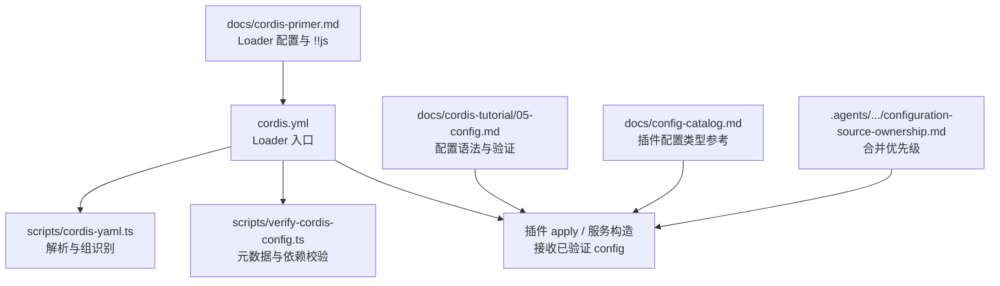
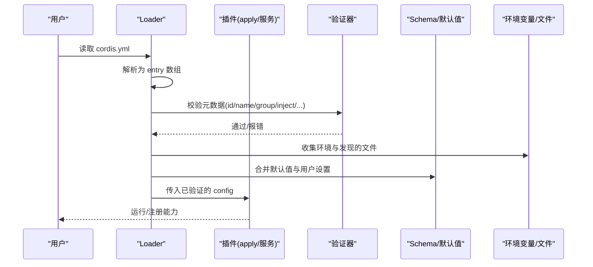
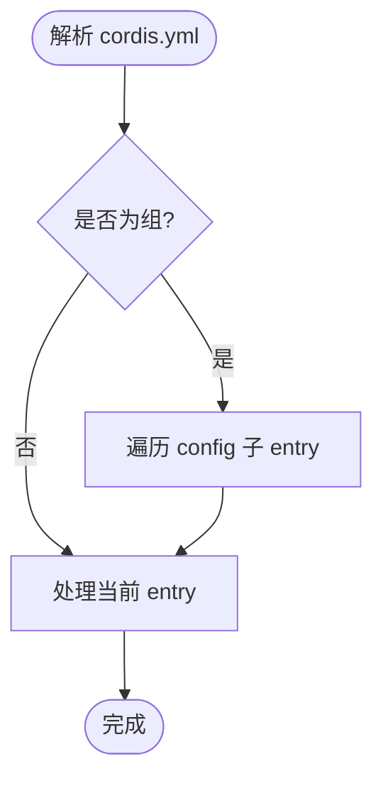
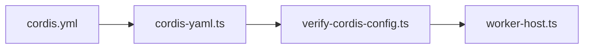

# 配置系统

<cite>
**本文引用的文件**
- [apps/cli/config/examples/cordis/cordis.yml](file://apps/cli/config/examples/cordis/cordis.yml)
- [apps/cli/config/examples/github-review/cordis.yml](file://apps/cli/config/examples/github-review/cordis.yml)
- [apps/cli/config/examples/schedule/cordis.yml](file://apps/cli/config/examples/schedule/cordis.yml)
- [scripts/cordis-yaml.ts](file://scripts/cordis-yaml.ts)
- [scripts/verify-cordis-config.ts](file://scripts/verify-cordis-config.ts)
- [docs/cordis-tutorial/05-config.md](file://docs/cordis-tutorial/05-config.md)
- [docs/cordis-primer.md](file://docs/cordis-primer.md)
- [docs/config-catalog.md](file://docs/config-catalog.md)
- [.agents/notes/implemented/architecture/2026-08-04-configuration-source-ownership.md](file://.agents/notes/implemented/architecture/2026-08-04-configuration-source-ownership.md)
- [packages/experimental/webworker-runtime/src/worker-host.ts](file://packages/experimental/webworker-runtime/src/worker-host.ts)
</cite>

## 目录
1. [简介](#简介)
2. [项目结构](#项目结构)
3. [核心组件](#核心组件)
4. [架构总览](#架构总览)
5. [详细组件分析](#详细组件分析)
6. [依赖关系分析](#依赖关系分析)
7. [性能考虑](#性能考虑)
8. [故障排查指南](#故障排查指南)
9. [结论](#结论)
10. [附录](#附录)

## 简介
本指南面向使用 cordis.yml 进行应用装配与配置的用户与插件作者，系统性说明：
- cordis.yml 的顶层数组、分组（group）、嵌套配置与 insert 插入机制
- entry 的关键属性 id、name、config、disabled、inject、intercept、isolate 等
- 环境变量注入与 !!js 表达式的使用范围与限制
- 配置的合并与覆盖优先级（默认值、用户设置、组合层、环境）
- 配置验证规则与错误提示
- 通过示例展示常见场景的配置模式

## 项目结构
仓库中关于 Cordis 配置的核心实现与文档分布在以下位置：
- 示例配置文件位于 apps/cli/config/examples 下，演示了 patch overlay、insert、group、isolate、!!js 表达式等用法
- 脚本 scripts/cordis-yaml.ts 提供 YAML 解析与“组”识别能力
- 脚本 scripts/verify-cordis-config.ts 负责校验 Loader 元数据、插件依赖解析、表达式合法性等
- 文档 docs/cordis-tutorial/05-config.md 与 docs/cordis-primer.md 解释配置语法、!!js 插值、分组与隔离
- 文档 docs/config-catalog.md 汇总各插件可配置项的类型与约束
- 架构笔记 .agents/.../configuration-source-ownership.md 明确非机密值与凭据值的合并优先级顺序

**图表来源**
- [scripts/cordis-yaml.ts:1-55](file://scripts/cordis-yaml.ts#L1-L55)
- [scripts/verify-cordis-config.ts:1-12](file://scripts/verify-cordis-config.ts#L1-L12)
- [docs/cordis-tutorial/05-config.md:1-85](file://docs/cordis-tutorial/05-config.md#L1-L85)
- [docs/cordis-primer.md:37-40](file://docs/cordis-primer.md#L37-L40)
- [docs/config-catalog.md:1-10](file://docs/config-catalog.md#L1-L10)
- [.agents/notes/implemented/architecture/2026-08-04-configuration-source-ownership.md:17-39](file://.agents/notes/implemented/architecture/2026-08-04-configuration-source-ownership.md#L17-L39)

**章节来源**
- [scripts/cordis-yaml.ts:1-55](file://scripts/cordis-yaml.ts#L1-L55)
- [scripts/verify-cordis-config.ts:1-12](file://scripts/verify-cordis-config.ts#L1-L12)
- [docs/cordis-tutorial/05-config.md:1-85](file://docs/cordis-tutorial/05-config.md#L1-L85)
- [docs/cordis-primer.md:37-40](file://docs/cordis-primer.md#L37-L40)
- [docs/config-catalog.md:1-10](file://docs/config-catalog.md#L1-L10)
- [.agents/notes/implemented/architecture/2026-08-04-configuration-source-ownership.md:17-39](file://.agents/notes/implemented/architecture/2026-08-04-configuration-source-ownership.md#L17-L39)

## 核心组件
- 顶层数组：每个 cordis.yml 根必须是一个 Loader entry 数组，每项代表一个插件或一组插件
- Entry 元数据：id、name、group、inject、intercept、isolate、disabled、insert 等
- 分组 group：将多个 entry 作为一组加载/卸载；支持 isolate 隔离服务实例
- 嵌套配置：group 可通过 config 数组包含子 entry；include 插件支持 patches 进一步嵌套
- 表达式与插值：config 与 disabled 支持 !!js 表达式；其他元数据保持静态
- 验证：Loader 在 apply 前对 config 执行 schema 校验，失败即中止启动

**章节来源**
- [scripts/verify-cordis-config.ts:39-40](file://scripts/verify-cordis-config.ts#L39-L40)
- [scripts/verify-cordis-config.ts:190-221](file://scripts/verify-cordis-config.ts#L190-L221)
- [scripts/cordis-yaml.ts:43-54](file://scripts/cordis-yaml.ts#L43-L54)
- [docs/cordis-tutorial/05-config.md:1-85](file://docs/cordis-tutorial/05-config.md#L1-L85)
- [docs/cordis-primer.md:37-40](file://docs/cordis-primer.md#L37-L40)

## 架构总览
Cordis 配置系统在加载阶段完成三件事：解析 YAML、校验元数据与依赖、按优先级合并配置并注入到插件。

**图表来源**
- [scripts/cordis-yaml.ts:1-55](file://scripts/cordis-yaml.ts#L1-L55)
- [scripts/verify-cordis-config.ts:190-221](file://scripts/verify-cordis-config.ts#L190-L221)
- [docs/cordis-tutorial/05-config.md:1-85](file://docs/cordis-tutorial/05-config.md#L1-L85)
- [docs/cordis-primer.md:37-40](file://docs/cordis-primer.md#L37-L40)
- [.agents/notes/implemented/architecture/2026-08-04-configuration-source-ownership.md:17-39](file://.agents/notes/implemented/architecture/2026-08-04-configuration-source-ownership.md#L17-L39)

## 详细组件分析

### 顶层结构与 entry 属性
- 顶层必须是 entry 数组；每个 entry 至少包含 name（指向插件），可选 id（稳定标识）
- 常用元数据：
  - id：用于 HMR 与差异更新，避免删除再添加导致状态丢失
  - name：插件包名或本地路径
  - config：插件配置对象，会被 schema 校验后传入 apply
  - disabled：布尔或 !!js 表达式，控制是否挂载该 entry
  - inject：声明所需服务键，确保依赖就绪后再加载
  - intercept：拦截事件流（由插件契约定义）
  - isolate：为 group 提供独立的服务实例空间
  - insert：在当前层级插入一组 entry（常用于 patch overlay）

**章节来源**
- [scripts/verify-cordis-config.ts:39-40](file://scripts/verify-cordis-config.ts#L39-L40)
- [docs/cordis-tutorial/06-composition-and-hmr.md:7-21](file://docs/cordis-tutorial/06-composition-and-hmr.md#L7-L21)

### 分组与嵌套配置
- group：将多个 entry 作为一个单元加载/卸载；可通过 config 数组嵌套子 entry
- cordis 组识别：当 entry 的 name 为特定组包或显式 group 标记时，其 config 被视为子 entry 列表
- include 插件：支持 patches 字段，进一步嵌套插入与覆盖

**图表来源**
- [scripts/cordis-yaml.ts:43-54](file://scripts/cordis-yaml.ts#L43-L54)
- [scripts/verify-cordis-config.ts:197-206](file://scripts/verify-cordis-config.ts#L197-L206)
- [scripts/verify-cordis-config.ts:207-221](file://scripts/verify-cordis-config.ts#L207-L221)

**章节来源**
- [scripts/cordis-yaml.ts:43-54](file://scripts/cordis-yaml.ts#L43-L54)
- [scripts/verify-cordis-config.ts:197-221](file://scripts/verify-cordis-config.ts#L197-L221)

### 环境变量注入与 !!js 表达式
- 支持在 config 与 disabled 中使用 !!js 表达式，在加载时求值
- disabled 的 !!js 会在每次 mount 决策时求值（基于 loader 上下文）
- 其他元数据字段保持静态，不允许表达式
- 推荐通过 credentials 与环境快照获取敏感信息，避免在配置文件中硬编码

**章节来源**
- [docs/cordis-tutorial/05-config.md:70-81](file://docs/cordis-tutorial/05-config.md#L70-L81)
- [docs/cordis-primer.md:37-40](file://docs/cordis-primer.md#L37-L40)
- [scripts/verify-cordis-config.ts:494-543](file://scripts/verify-cordis-config.ts#L494-L543)

### 配置的合并与覆盖优先级
- 非机密值统一顺序（从高到低）：
  - 本次运行的显式覆盖（CLI 参数等）
  - 用户设置（settings.yaml）
  - 组合层（profile bundles、用户 patch 层、--patch overlays）
  - 当前 shell 继承的环境变量
  - 发现的文件（<invocation cwd>/.env，然后 $DSH_HOME/.env）
  - 默认值（schema 默认、提供方公开默认）
- 凭据值采用更窄且独立的顺序（继承环境只读优先，其次受管凭据文档，最后项目/用户 .env）

**章节来源**
- [.agents/notes/implemented/architecture/2026-08-04-configuration-source-ownership.md:17-39](file://.agents/notes/implemented/architecture/2026-08-04-configuration-source-ownership.md#L17-L39)

### 配置验证与错误提示
- 每个 entry 的 config 在进入 apply 前会按插件声明的 schema 校验
- 校验失败会抛出明确的验证错误，阻止插件半配置启动
- 元数据校验：
  - 根必须为 entry 数组
  - 每个 entry 必须为对象
  - 仅 disabled 允许 !!js 表达式；其他元数据禁止表达式
  - disabled 表达式的语法在构建期预检查，避免运行时才失败
- 依赖解析校验：
  - 应用级与包级 fixture 的插件引用必须在对应 manifest 中声明
  - 工作区本地包必须通过 tsconfig paths 解析到源码，避免依赖构建产物

**章节来源**
- [docs/cordis-tutorial/05-config.md:53-68](file://docs/cordis-tutorial/05-config.md#L53-L68)
- [scripts/verify-cordis-config.ts:60-88](file://scripts/verify-cordis-config.ts#L60-L88)
- [scripts/verify-cordis-config.ts:190-221](file://scripts/verify-cordis-config.ts#L190-L221)
- [scripts/verify-cordis-config.ts:494-543](file://scripts/verify-cordis-config.ts#L494-L543)
- [scripts/verify-cordis-config.ts:400-439](file://scripts/verify-cordis-config.ts#L400-L439)

### 典型配置示例与模式
- Patch overlay 覆盖端口与插入 host runner：
  - 通过 insert 插入宿主 runner 与工具，同时覆盖 webserver 的 host/port
  - 适用于在不修改基础 profile 的前提下定制部署
- Webhook 网关与隔离：
  - 使用 group + isolate 将 webhook server 放入隔离域，避免暴露 UI API
  - 通过 !!js 从环境变量读取端口与 workspace 路径
- 启用调度能力：
  - 通过 insert 注入时间上下文与调度插件，并显式启用 UI 行

**章节来源**
- [apps/cli/config/examples/cordis/cordis.yml:1-20](file://apps/cli/config/examples/cordis/cordis.yml#L1-L20)
- [apps/cli/config/examples/github-review/cordis.yml:1-36](file://apps/cli/config/examples/github-review/cordis.yml#L1-L36)
- [apps/cli/config/examples/schedule/cordis.yml:1-13](file://apps/cli/config/examples/schedule/cordis.yml#L1-L13)

### 配置类型参考
- 各插件的可配置项、必填/可选字段、默认值与约束，可在配置目录中查阅
- 生成文档会交叉校验 schema 与类型声明，确保配置键与运行时一致

**章节来源**
- [docs/config-catalog.md:1-10](file://docs/config-catalog.md#L1-L10)

## 依赖关系分析
- Loader 与解析：
  - cordis.yml 被解析为 entry 数组；组识别与嵌套遍历由 cordis-yaml.ts 提供
- 校验与诊断：
  - verify-cordis-config.ts 负责元数据、表达式、依赖解析与工作区源码映射校验
- 运行时行为：
  - worker-host.ts 展示了如何在运行时加载 include 插件与 YAML，并在嵌套结构中查找 entry 与提取 config

**图表来源**
- [scripts/cordis-yaml.ts:1-55](file://scripts/cordis-yaml.ts#L1-L55)
- [scripts/verify-cordis-config.ts:1-12](file://scripts/verify-cordis-config.ts#L1-L12)
- [packages/experimental/webworker-runtime/src/worker-host.ts:378-394](file://packages/experimental/webworker-runtime/src/worker-host.ts#L378-L394)

**章节来源**
- [scripts/cordis-yaml.ts:1-55](file://scripts/cordis-yaml.ts#L1-L55)
- [scripts/verify-cordis-config.ts:1-12](file://scripts/verify-cordis-config.ts#L1-L12)
- [packages/experimental/webworker-runtime/src/worker-host.ts:378-394](file://packages/experimental/webworker-runtime/src/worker-host.ts#L378-L394)

## 性能考虑
- 合理拆分 group 并使用 isolate 隔离服务实例，避免不必要的共享状态竞争
- 谨慎使用 !!js 表达式，避免在高频 mount 决策中执行昂贵计算
- 通过 patch overlay 最小化变更面，减少重新加载的影响范围

[本节为通用指导，不直接分析具体文件]

## 故障排查指南
- 启动失败且报验证错误：
  - 检查 entry 的 config 是否符合插件 schema；查看 docs/config-catalog.md 中的字段约束
  - 确认 required 字段已提供，类型正确
- 表达式错误：
  - 仅在 config 与 disabled 允许 !!js；其他元数据禁止表达式
  - disabled 表达式语法会在构建期检查，定位到具体行号修正
- 依赖未声明：
  - 应用级与包级 fixture 引用必须在对应 package.json 中声明
  - 本地工作区包需通过 tsconfig paths 解析到源码，避免依赖构建产物
- 环境变量未生效：
  - 确认值来自正确的优先级层（CLI > settings > composition > 继承环境 > 发现文件 > 默认值）
  - 凭据值遵循独立顺序，优先继承环境，其次受管凭据文档

**章节来源**
- [docs/cordis-tutorial/05-config.md:53-81](file://docs/cordis-tutorial/05-config.md#L53-L81)
- [scripts/verify-cordis-config.ts:494-543](file://scripts/verify-cordis-config.ts#L494-L543)
- [scripts/verify-cordis-config.ts:400-439](file://scripts/verify-cordis-config.ts#L400-L439)
- [.agents/notes/implemented/architecture/2026-08-04-configuration-source-ownership.md:17-39](file://.agents/notes/implemented/architecture/2026-08-04-configuration-source-ownership.md#L17-L39)

## 结论
- cordis.yml 以 entry 数组为核心，结合 group、isolate、insert 与 include patches，形成强大的装配能力
- 通过 schema 校验与严格的元数据规则，保证插件以完整且安全的配置启动
- 环境变量与 !!js 表达式提供了灵活的动态配置手段，但应遵循优先级与安全最佳实践
- 借助示例与配置目录，可以快速定位问题并构建符合需求的部署方案

[本节为总结性内容，不直接分析具体文件]

## 附录

### 常用 entry 属性速查
- id：稳定标识，便于 HMR 与差异更新
- name：插件包名或本地路径
- config：插件配置对象，将被 schema 校验
- disabled：布尔或 !!js 表达式，控制挂载
- inject：声明所需服务键
- intercept：事件拦截（由插件契约定义）
- isolate：为 group 提供隔离的服务实例
- insert：在当前层级插入一组 entry

**章节来源**
- [scripts/verify-cordis-config.ts:39-40](file://scripts/verify-cordis-config.ts#L39-L40)
- [docs/cordis-tutorial/06-composition-and-hmr.md:7-21](file://docs/cordis-tutorial/06-composition-and-hmr.md#L7-L21)

### 示例清单
- 覆盖端口与插入 host runner：参见示例文件
- Webhook 网关与隔离：参见示例文件
- 启用调度能力：参见示例文件

**章节来源**
- [apps/cli/config/examples/cordis/cordis.yml:1-20](file://apps/cli/config/examples/cordis/cordis.yml#L1-L20)
- [apps/cli/config/examples/github-review/cordis.yml:1-36](file://apps/cli/config/examples/github-review/cordis.yml#L1-L36)
- [apps/cli/config/examples/schedule/cordis.yml:1-13](file://apps/cli/config/examples/schedule/cordis.yml#L1-L13)