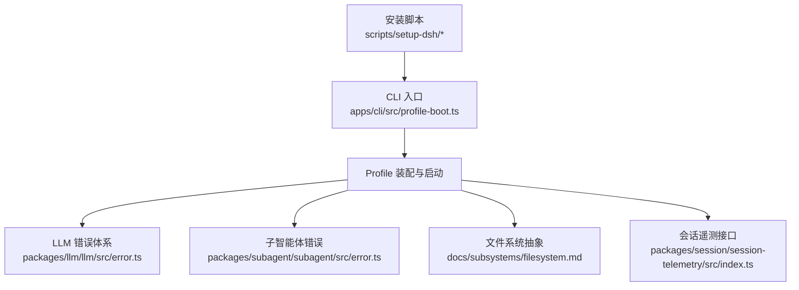
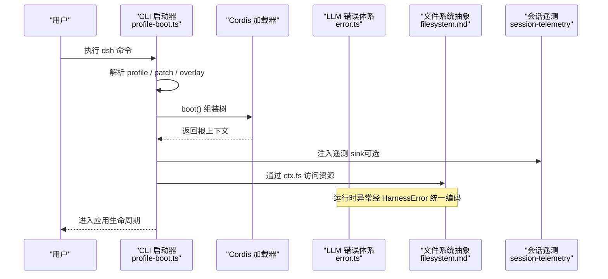
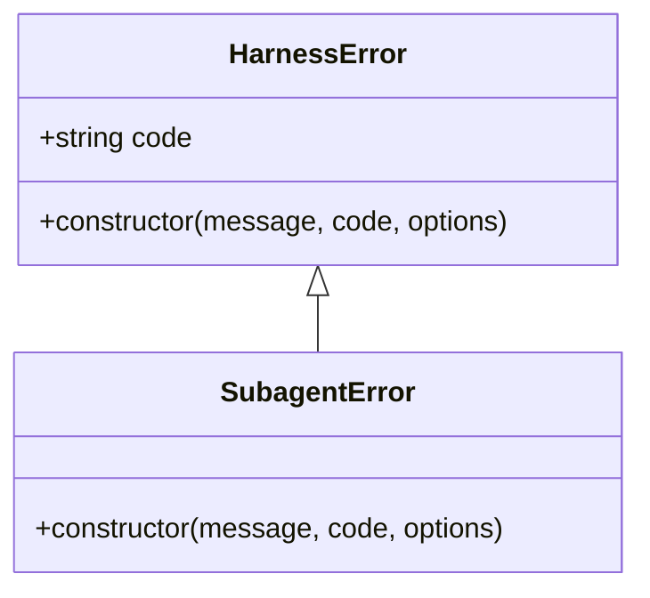
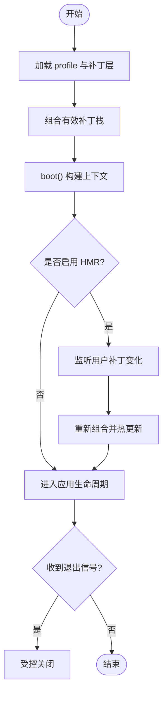
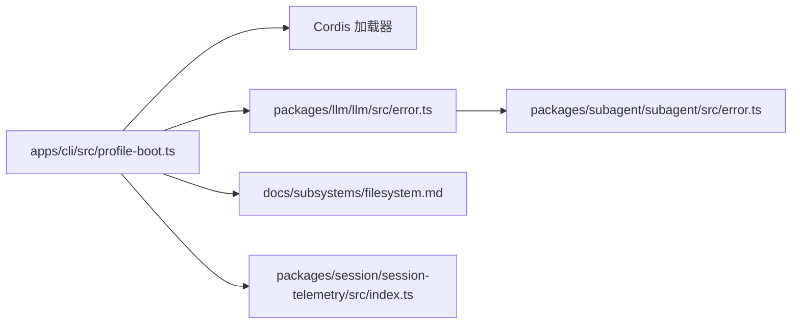

# 故障排除

<cite>
**本文引用的文件**
- [packages/llm/llm/src/error.ts](file://packages/llm/llm/src/error.ts)
- [packages/subagent/subagent/src/error.ts](file://packages/subagent/subagent/src/error.ts)
- [apps/cli/src/profile-boot.ts](file://apps/cli/src/profile-boot.ts)
- [scripts/setup-dsh/setup.env.example](file://scripts/setup-dsh/setup.env.example)
- [scripts/setup-dsh/setup-one.sh](file://scripts/setup-dsh/setup-one.sh)
- [docs/subsystems/filesystem.md](file://docs/subsystems/filesystem.md)
- [website/.generated/en/reference/subsystems/session-telemetry.html](file://website/.generated/en/reference/subsystems/session-telemetry.html)
- [packages/session/session-telemetry/src/index.ts](file://packages/session/session-telemetry/src/index.ts)
- [apps/web/tests/complex-history.perf.ts](file://apps/web/tests/complex-history.perf.ts)
- [packages/llm/token-meter/tests/token-meter.spec.ts](file://packages/llm/token-meter/tests/token-meter.spec.ts)
</cite>

## 目录
1. [简介](#简介)
2. [项目结构](#项目结构)
3. [核心组件](#核心组件)
4. [架构总览](#架构总览)
5. [详细组件分析](#详细组件分析)
6. [依赖关系分析](#依赖关系分析)
7. [性能注意事项](#性能注意事项)
8. [故障排除指南](#故障排除指南)
9. [结论](#结论)
10. [附录](#附录)

## 简介
本指南面向 DeepSeek Harness 的使用者与集成方，聚焦安装、配置与运行时的常见问题定位与解决。内容涵盖：
- 错误分类与日志渲染（结构化错误码、cause 链）
- 启动与配置加载流程（profile、patch、HMR、遥测开关）
- 文件系统抽象与常见 I/O 问题
- 性能问题识别与优化（内存、CPU、流式处理）
- 网络通信、外部服务集成的排错方法
- 调试工具与技巧
- 社区支持与获取帮助途径

## 项目结构
DeepSeek Harness 采用多包与多应用组织：
- apps/cli：命令行入口与 profile 启动编排
- packages/*：领域能力包（LLM、子智能体、会话遥测、存储、沙箱等）
- docs：子系统文档（含文件系统、会话遥测等）
- scripts：安装与初始化脚本（一键引导与环境变量模板）

图表来源
- [apps/cli/src/profile-boot.ts:1-301](file://apps/cli/src/profile-boot.ts#L1-L301)
- [packages/llm/llm/src/error.ts:1-164](file://packages/llm/llm/src/error.ts#L1-L164)
- [packages/subagent/subagent/src/error.ts:1-16](file://packages/subagent/subagent/src/error.ts#L1-L16)
- [docs/subsystems/filesystem.md:290-426](file://docs/subsystems/filesystem.md#L290-L426)
- [packages/session/session-telemetry/src/index.ts:162-178](file://packages/session/session-telemetry/src/index.ts#L162-L178)
- [scripts/setup-dsh/setup.env.example:1-55](file://scripts/setup-dsh/setup.env.example#L1-L55)

章节来源
- [apps/cli/src/profile-boot.ts:1-301](file://apps/cli/src/profile-boot.ts#L1-L301)
- [scripts/setup-dsh/setup.env.example:1-55](file://scripts/setup-dsh/setup.env.example#L1-L55)

## 核心组件
- 结构化错误体系：统一的基类与稳定 code，便于跨 seam 路由与重试策略；提供 cause 链渲染与类型收窄工具。
- Profile 启动器：按顺序装配 bundle patch、用户层、home 层、overlay 与遥测开关，支持 HMR 热重载与信号安全关闭。
- 文件系统抽象：统一 resolve/stat/read/write/listDir 等语义，强调原子性、稳定性与大小限制。
- 会话遥测：定义 emit/flush/shutdown 契约，记录事件并支持告警级别映射。

章节来源
- [packages/llm/llm/src/error.ts:1-164](file://packages/llm/llm/src/error.ts#L1-L164)
- [apps/cli/src/profile-boot.ts:1-301](file://apps/cli/src/profile-boot.ts#L1-L301)
- [docs/subsystems/filesystem.md:290-426](file://docs/subsystems/filesystem.md#L290-L426)
- [packages/session/session-telemetry/src/index.ts:162-178](file://packages/session/session-telemetry/src/index.ts#L162-L178)

## 架构总览
下图展示一次典型 CLI 启动到业务运行的关键路径，包括配置装配、错误体系接入、遥测与文件系统访问。

图表来源
- [apps/cli/src/profile-boot.ts:142-171](file://apps/cli/src/profile-boot.ts#L142-L171)
- [apps/cli/src/profile-boot.ts:207-259](file://apps/cli/src/profile-boot.ts#L207-L259)
- [packages/llm/llm/src/error.ts:13-22](file://packages/llm/llm/src/error.ts#L13-L22)
- [docs/subsystems/filesystem.md:290-426](file://docs/subsystems/filesystem.md#L290-L426)
- [packages/session/session-telemetry/src/index.ts:162-178](file://packages/session/session-telemetry/src/index.ts#L162-L178)

## 详细组件分析

### 错误体系与日志诊断
- 统一基类与稳定 code：所有 harness 错误继承自基类，携带稳定的 machine-routable code，便于下游重试、沙箱与回放逻辑区分错误类型。
- Cause 链渲染：提供将任意抛出值连同 cause 链与 AggregateError 成员渲染为可读字符串的工具，避免底层 transport 包装掩盖真实原因。
- 类型收窄：在边界处进行 instanceof 判断，确保跨 realm 或 duck-typed 场景下的安全识别。
- 子智能体错误：基于统一基类的领域错误，保持 code 一致性与可路由性。

图表来源
- [packages/llm/llm/src/error.ts:13-22](file://packages/llm/llm/src/error.ts#L13-L22)
- [packages/subagent/subagent/src/error.ts:9-15](file://packages/subagent/subagent/src/error.ts#L9-L15)

章节来源
- [packages/llm/llm/src/error.ts:1-164](file://packages/llm/llm/src/error.ts#L1-L164)
- [packages/subagent/subagent/src/error.ts:1-16](file://packages/subagent/subagent/src/error.ts#L1-L16)

### Profile 启动与配置装配
- 装配顺序：bundle patches → profile 用户层 → home 用户层 → --patch overlays → 遥测开关。
- 热重载：对 cordis.patch.yml 与 home 层进行监听，保证长驻进程的配置变更即时生效。
- 遥测开关：当存在遥测行且环境变量开启时，生成禁用 patch，优先隐私保护。
- 信号与关闭：SIGTERM/SIGINT 触发受控关闭，避免中断期间的不一致状态。

图表来源
- [apps/cli/src/profile-boot.ts:142-171](file://apps/cli/src/profile-boot.ts#L142-L171)
- [apps/cli/src/profile-boot.ts:207-259](file://apps/cli/src/profile-boot.ts#L207-L259)
- [apps/cli/src/profile-boot.ts:268-298](file://apps/cli/src/profile-boot.ts#L268-L298)

章节来源
- [apps/cli/src/profile-boot.ts:1-301](file://apps/cli/src/profile-boot.ts#L1-L301)

### 文件系统抽象与 I/O 排错
- 统一抽象：resolve/stat/lstat/readText/streamText/readBytes/listDir/writeText/editText 等方法提供一致的语义与约束（如最大字节限制、原子写入）。
- 常见错误：
  - 目标不存在或权限不足：通过 stat/lstat 提前探测，结合 contains 校验路径归属。
  - 大文件读取：readBytes 带 maxBytes 上限，超过阈值直接失败，避免内存膨胀。
  - 并发编辑：writeText/editText 支持版本守卫，防止陈旧覆盖。
- 诊断建议：
  - 使用 lstat 检查符号链接与路径合法性。
  - 使用 streamText 替代一次性 readText 处理大文本。
  - 在写操作前用 stat 确认版本，必要时使用 expected 字段做乐观锁。

章节来源
- [docs/subsystems/filesystem.md:290-426](file://docs/subsystems/filesystem.md#L290-L426)

### 会话遥测与告警
- 接口契约：emit/flush/shutdown 用于上报、刷新与优雅关闭。
- 严重级别：捕获时预映射 severity，错误事件可直接告警，默认 info，warn 留给策略与后端自定义。
- 排查要点：
  - 若未挂载遥测行，遥测开关不再生效。
  - 通过环境变量硬关闭遥测，避免意外数据外发。

章节来源
- [packages/session/session-telemetry/src/index.ts:162-178](file://packages/session/session-telemetry/src/index.ts#L162-L178)
- [website/.generated/en/reference/subsystems/session-telemetry.html:112-118](file://website/.generated/en/reference/subsystems/session-telemetry.html#L112-L118)

## 依赖关系分析
- CLI 启动器依赖 Cordis 加载器与插件系统，负责装配与生命周期管理。
- LLM 错误体系被多个领域包复用，形成统一的错误路由基础。
- 文件系统抽象作为横切能力，被工具、子智能体、工作流等广泛调用。
- 遥测作为可选横切关注点，通过 composition 的 row 机制按需挂载。

图表来源
- [apps/cli/src/profile-boot.ts:142-171](file://apps/cli/src/profile-boot.ts#L142-L171)
- [packages/llm/llm/src/error.ts:13-22](file://packages/llm/llm/src/error.ts#L13-L22)
- [packages/subagent/subagent/src/error.ts:9-15](file://packages/subagent/subagent/src/error.ts#L9-L15)
- [docs/subsystems/filesystem.md:290-426](file://docs/subsystems/filesystem.md#L290-L426)
- [packages/session/session-telemetry/src/index.ts:162-178](file://packages/session/session-telemetry/src/index.ts#L162-L178)

章节来源
- [apps/cli/src/profile-boot.ts:142-171](file://apps/cli/src/profile-boot.ts#L142-L171)
- [packages/llm/llm/src/error.ts:13-22](file://packages/llm/llm/src/error.ts#L13-L22)

## 性能注意事项
- 流式读取：对大文件优先使用 streamText，避免一次性加载导致内存峰值。
- 令牌计量：token-meter 提供不可变测量结果，便于审计与对比。
- 长会话压力测试：通过连续对话与大量历史消息验证渲染与滚动性能，关注页面错误与警告。
- 遥测开销：在生产环境按需启用遥测，避免高频上报造成额外负载。

章节来源
- [packages/llm/token-meter/tests/token-meter.spec.ts:148-167](file://packages/llm/token-meter/tests/token-meter.spec.ts#L148-L167)
- [apps/web/tests/complex-history.perf.ts:37-56](file://apps/web/tests/complex-history.perf.ts#L37-L56)
- [apps/web/tests/complex-history.perf.ts:1410-1431](file://apps/web/tests/complex-history.perf.ts#L1410-L1431)

## 故障排除指南

### 安装与环境配置问题
- 症状
  - 首次运行提示缺少密钥或网关 API key。
  - 一键引导脚本找不到配置文件。
- 可能原因
  - 未复制或未填写 setup.env.example 中的必填项。
  - DSH_* 环境变量未正确导出或被后续进程覆盖。
- 处理步骤
  - 复制示例配置到 ~/.dsh/setup-dsh.env，并按需填入密钥与 URL。
  - 使用一键引导脚本以非交互模式执行，确保必需键缺失时报错退出。
  - 检查 shell 环境中 DSH_* 变量是否正确传递至子进程。
- 参考
  - 环境变量模板与说明
  - 一键引导脚本用法与参数

章节来源
- [scripts/setup-dsh/setup.env.example:1-55](file://scripts/setup-dsh/setup.env.example#L1-L55)
- [scripts/setup-dsh/setup-one.sh:1-45](file://scripts/setup-dsh/setup-one.sh#L1-L45)

### 启动与配置错误
- 症状
  - 启动时报配置解析错误或无法找到 profile。
  - 热重载后行为不符合预期。
- 可能原因
  - profile 的 cordis.yml 根配置被误改。
  - 用户补丁层与 home 层冲突或顺序不当。
  - 遥测开关导致关键行被禁用。
- 处理步骤
  - 不要修改根配置，仅通过 cordis.patch.yml 与 --patch overlays 进行覆盖。
  - 检查 home 层与 profile 层的优先级，确保必要行未被覆盖。
  - 如需禁用遥测，设置相应环境变量，但注意这会移除遥测行。
  - 观察 HMR 是否生效，必要时重启进程以清理缓存。
- 参考
  - Profile 装配顺序与 HMR 监听
  - 遥测开关生成逻辑

章节来源
- [apps/cli/src/profile-boot.ts:43-83](file://apps/cli/src/profile-boot.ts#L43-L83)
- [apps/cli/src/profile-boot.ts:142-171](file://apps/cli/src/profile-boot.ts#L142-L171)
- [apps/cli/src/profile-boot.ts:268-298](file://apps/cli/src/profile-boot.ts#L268-L298)

### 运行时异常与错误日志分析
- 症状
  - 工具调用失败、模型请求被拒、子智能体任务失败。
  - 日志中出现多层包装的错误信息。
- 可能原因
  - 使用了非 Error 的 throw 值，导致原始 code 丢失。
  - 网络传输层包装了底层错误，掩盖真实原因。
  - 上下文窗口超限或配额耗尽。
- 处理步骤
  - 使用错误链渲染工具输出完整 cause 链，定位最外层与内层原因。
  - 根据稳定 code 进行路由与重试决策，而非解析 message。
  - 对上下文窗口超限与配额耗尽进行专门识别与降级。
- 参考
  - 错误基类与稳定 code
  - Cause 链渲染与类型收窄
  - 上下文窗口与配额错误识别

章节来源
- [packages/llm/llm/src/error.ts:13-22](file://packages/llm/llm/src/error.ts#L13-L22)
- [packages/llm/llm/src/error.ts:102-164](file://packages/llm/llm/src/error.ts#L102-L164)

### 文件系统与 I/O 问题
- 症状
  - 读取大文件导致内存飙升或超时。
  - 写入冲突或覆盖旧版本。
  - 路径包含符号链接导致权限或归属校验失败。
- 可能原因
  - 使用一次性读取而非流式读取。
  - 未使用版本守卫进行并发编辑。
  - 未通过 lstat 检查符号链接与路径合法性。
- 处理步骤
  - 对大文件改用 streamText，控制消费速率。
  - 写操作前使用 stat 获取版本，并在 writeText/editText 中传入 expected 字段。
  - 使用 lstat 与 contains 校验路径与归属，避免越权访问。
- 参考
  - 文件系统抽象方法与约束

章节来源
- [docs/subsystems/filesystem.md:290-426](file://docs/subsystems/filesystem.md#L290-L426)

### 网络通信与外部服务集成
- 症状
  - 模型请求失败，出现 fetch 相关错误。
  - 第三方服务鉴权失败或限流。
- 可能原因
  - 凭证格式错误或过期。
  - 网络不稳定或服务端限流。
  - 上下文窗口超限或配额耗尽。
- 处理步骤
  - 使用错误链渲染工具查看底层 transport 包装的真实错误。
  - 根据稳定 code 区分限流与配额耗尽，分别采取退避或人工干预。
  - 对凭证错误进行本地修复，避免重复尝试。
- 参考
  - 错误链渲染与 provider 无关的错误识别

章节来源
- [packages/llm/llm/src/error.ts:102-164](file://packages/llm/llm/src/error.ts#L102-L164)

### 性能问题排查（内存泄漏、CPU 占用过高）
- 症状
  - 长时间运行后内存持续增长。
  - CPU 占用异常高，界面卡顿。
- 可能原因
  - 大对象未及时释放或循环引用。
  - 长会话渲染与滚动未虚拟化。
  - 遥测上报频率过高。
- 处理步骤
  - 使用性能测试用例复现长会话场景，观察页面错误与警告。
  - 检查 token-meter 的测量结果，评估各节点开销。
  - 降低遥测上报频率或临时禁用遥测，观察性能变化。
- 参考
  - 长会话压力测试与断言
  - Token 计量不可变结果

章节来源
- [apps/web/tests/complex-history.perf.ts:37-56](file://apps/web/tests/complex-history.perf.ts#L37-L56)
- [apps/web/tests/complex-history.perf.ts:1410-1431](file://apps/web/tests/complex-history.perf.ts#L1410-L1431)
- [packages/llm/token-meter/tests/token-meter.spec.ts:148-167](file://packages/llm/token-meter/tests/token-meter.spec.ts#L148-L167)

### 调试工具与技巧
- 启用/禁用遥测：通过环境变量硬关闭遥测，避免干扰或泄露。
- 热重载：编辑 cordis.patch.yml 与 home 层，观察配置变更是否即时生效。
- 信号安全关闭：SIGTERM/SIGINT 触发受控关闭，确保资源释放。
- 错误链输出：在 catch 块中使用错误链渲染工具，保留 cause 链与聚合错误成员。

章节来源
- [apps/cli/src/profile-boot.ts:70-83](file://apps/cli/src/profile-boot.ts#L70-L83)
- [apps/cli/src/profile-boot.ts:216-225](file://apps/cli/src/profile-boot.ts#L216-L225)
- [packages/llm/llm/src/error.ts:102-164](file://packages/llm/llm/src/error.ts#L102-L164)

### 社区支持与获取帮助
- 提交 Issue：附上最小复现、错误链输出、环境与配置摘要。
- 查阅文档：重点关注文件系统、会话遥测与 profile 装配章节。
- 参与讨论：在仓库讨论区分享性能测试结果与优化方案。

[本节为通用指导，不直接分析具体文件]

## 结论
通过统一的结构化错误体系、严格的配置装配流程、健壮的 I/O 抽象与可选遥测机制，DeepSeek Harness 提供了可靠的故障定位与性能调优基础。建议在日常使用中：
- 始终使用错误链输出与稳定 code 进行诊断与重试。
- 通过 profile 与 patch 层进行配置管理，避免直接修改根配置。
- 对大文件与长会话采用流式与虚拟化策略，降低内存与 CPU 压力。
- 按需启用遥测，并结合性能测试持续优化。

[本节为总结，不直接分析具体文件]

## 附录
- 快速检查清单
  - 环境变量是否齐全且正确导出
  - profile 与 patch 层是否冲突
  - 遥测开关是否符合预期
  - 大文件是否使用流式读取
  - 错误链是否已输出并归档

[本节为补充信息，不直接分析具体文件]