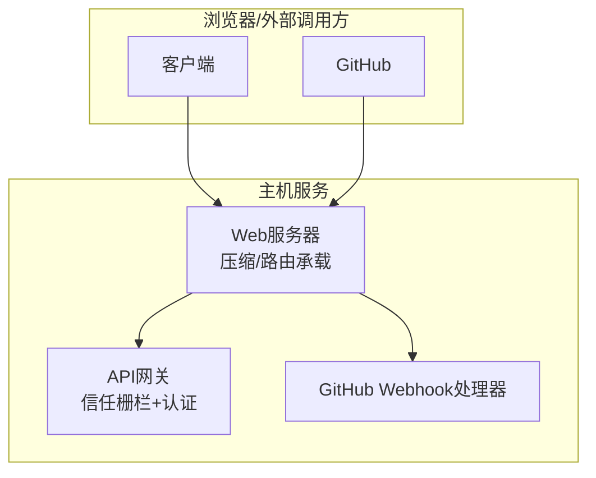
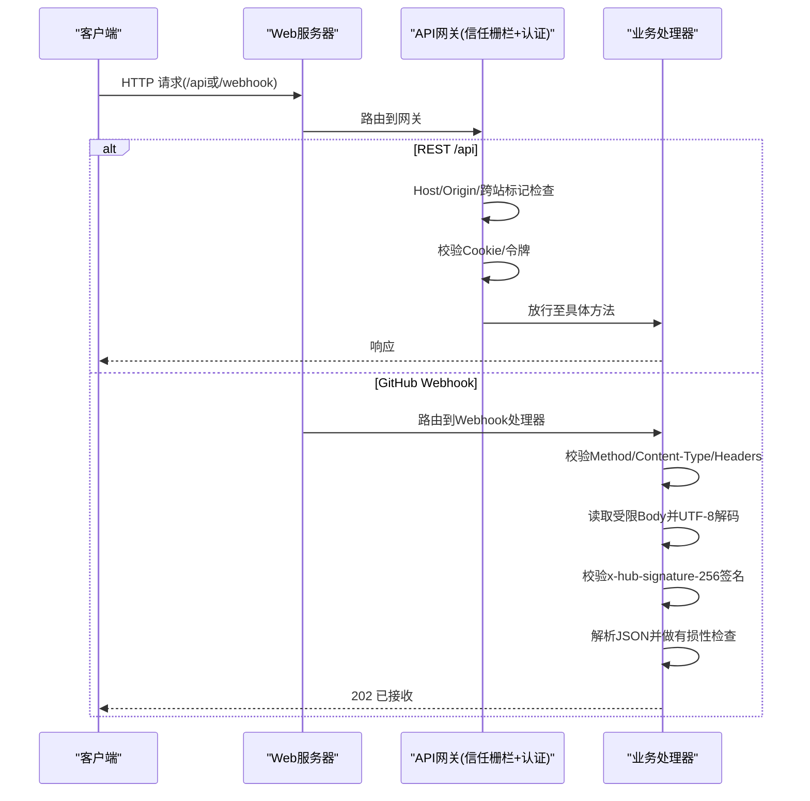
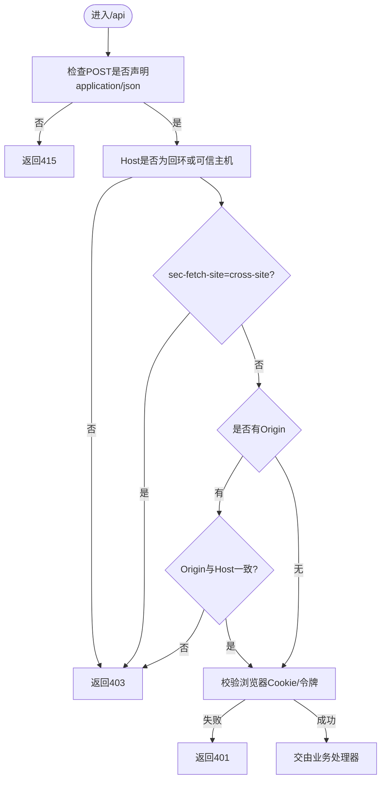
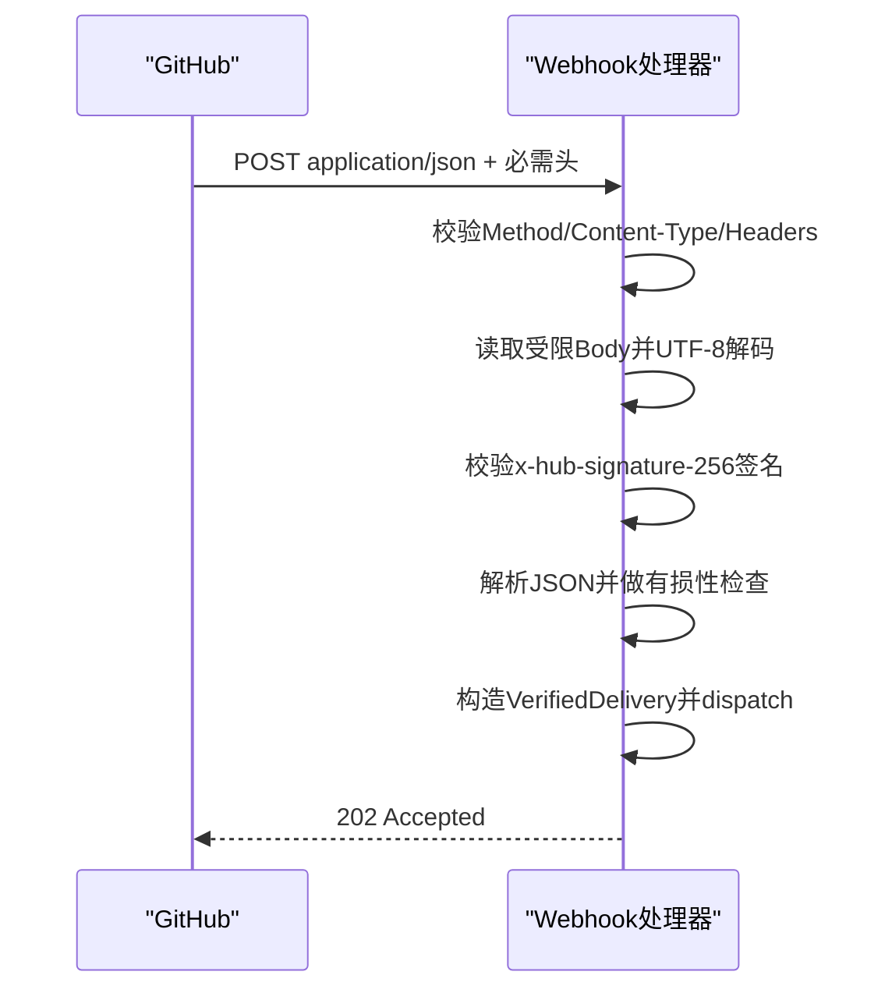
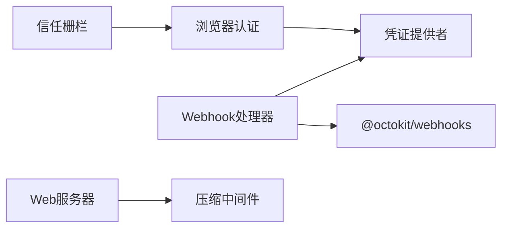

# API安全设计

<cite>
**本文引用的文件**
- [packages/client/connection/src/index.ts](file://packages/client/connection/src/index.ts)
- [packages/client/connection/src/api-request-trust.ts](file://packages/client/connection/src/api-request-trust.ts)
- [packages/client/connection/src/browser-auth.ts](file://packages/client/connection/src/browser-auth.ts)
- [packages/webhook/webhook-github/src/handler.ts](file://packages/webhook/webhook-github/src/handler.ts)
- [packages/webhook/webhook-github/src/body.ts](file://packages/webhook/webhook-github/src/body.ts)
- [packages/host/webserver/src/index.ts](file://packages/host/webserver/src/index.ts)
- [packages/llm/llm/src/error.ts](file://packages/llm/llm/src/error.ts)
- [.agents/notes/implemented/architecture/2026-07-28-api-browser-trust-boundary.md](file://.agents/notes/implemented/architecture/2026-07-28-api-browser-trust-boundary.md)
- [.agents/notes/implemented/architecture/2026-07-28-api-browser-trust-boundary.zh.md](file://.agents/notes/implemented/architecture/2026-07-28-api-browser-trust-boundary.zh.md)
</cite>

## 目录
1. [简介](#简介)
2. [项目结构](#项目结构)
3. [核心组件](#核心组件)
4. [架构总览](#架构总览)
5. [详细组件分析](#详细组件分析)
6. [依赖关系分析](#依赖关系分析)
7. [性能与限流](#性能与限流)
8. [故障排查指南](#故障排查指南)
9. [结论](#结论)
10. [附录](#附录)

## 简介
本指南围绕仓库中已实现的API安全机制，系统化说明RESTful API与WebSocket（通过HTTP载体）的安全边界、请求验证、输入清理、速率限制与防DDoS策略、版本管理与向后兼容、Webhook签名校验、CORS与HTTPS/HSTS建议，以及安全测试与渗透测试的实施要点。内容严格基于代码库中的实现与文档注释进行提炼与归纳。

## 项目结构
本项目将API安全能力分散在多个包中：
- 浏览器到宿主进程的API网关与安全栅栏：位于客户端连接包，负责Host/Origin信任边界、媒体类型栅栏、Cookie会话认证。
- Webhook入口：GitHub Webhook处理器负责严格的请求头、Content-Type、Body大小与UTF-8校验，并使用Octokit Webhooks进行签名验证。
- Web服务器：提供压缩等通用能力，并作为所有路由的承载层。
- 错误分类：对“配额耗尽”类错误的识别用于区分限流与资源耗尽。

图表来源
- [packages/host/webserver/src/index.ts:117-131](file://packages/host/webserver/src/index.ts#L117-L131)
- [packages/client/connection/src/index.ts:93-128](file://packages/client/connection/src/index.ts#L93-L128)
- [packages/webhook/webhook-github/src/handler.ts:72-130](file://packages/webhook/webhook-github/src/handler.ts#L72-L130)

章节来源
- [packages/host/webserver/src/index.ts:117-131](file://packages/host/webserver/src/index.ts#L117-L131)
- [packages/client/connection/src/index.ts:93-128](file://packages/client/connection/src/index.ts#L93-L128)
- [packages/webhook/webhook-github/src/handler.ts:72-130](file://packages/webhook/webhook-github/src/handler.ts#L72-L130)

## 核心组件
- API信任栅栏与浏览器认证：对所有进入/api的请求执行Host/Origin检查与跨站标记拒绝，并通过带签名的HttpOnly SameSite=Strict Cookie完成持久化浏览器会话认证。
- GitHub Webhook处理：强制POST、application/json且仅允许UTF-8参数；严格限制Body大小；校验x-hub-signature-256、x-github-delivery、x-github-event等必需头；使用Octokit Webhooks进行签名验证；解析为有损性保证的JSON对象后异步派发。
- Web服务器：提供gzip压缩与过滤规则（如SSE不压缩），作为统一入口承载各路由。

章节来源
- [packages/client/connection/src/api-request-trust.ts:1-119](file://packages/client/connection/src/api-request-trust.ts#L1-L119)
- [packages/client/connection/src/browser-auth.ts:180-314](file://packages/client/connection/src/browser-auth.ts#L180-L314)
- [packages/webhook/webhook-github/src/handler.ts:72-130](file://packages/webhook/webhook-github/src/handler.ts#L72-L130)
- [packages/webhook/webhook-github/src/body.ts:1-70](file://packages/webhook/webhook-github/src/body.ts#L1-L70)
- [packages/host/webserver/src/index.ts:88-115](file://packages/host/webserver/src/index.ts#L88-L115)

## 架构总览
下图展示了从请求进入到安全校验再到业务处理的完整链路，包括REST与Webhook两条路径。

图表来源
- [packages/client/connection/src/index.ts:93-128](file://packages/client/connection/src/index.ts#L93-L128)
- [packages/client/connection/src/api-request-trust.ts:85-119](file://packages/client/connection/src/api-request-trust.ts#L85-L119)
- [packages/client/connection/src/browser-auth.ts:232-302](file://packages/client/connection/src/browser-auth.ts#L232-L302)
- [packages/webhook/webhook-github/src/handler.ts:72-130](file://packages/webhook/webhook-github/src/handler.ts#L72-L130)
- [packages/webhook/webhook-github/src/body.ts:17-69](file://packages/webhook/webhook-github/src/body.ts#L17-L69)

## 详细组件分析

### REST API信任栅栏与浏览器认证
- 媒体类型栅栏：所有/api POST必须声明application/json，否则在解析前以415拒绝，从而消除跨站“简单请求”。
- 权威栅栏：每个请求的Host必须是回环地址或与trustedHosts条目匹配（支持host或host:port精确匹配，经WHATWG规范化），防止DNS重绑定与跨站伪造。
- 跨站标记：sec-fetch-site为cross-site一律拒绝；若携带Origin则必须与Host权威一致。
- 浏览器认证：通过进程启动令牌交换建立带签名的HttpOnly SameSite=Strict Cookie，按authority隔离，具备有效期与版本控制。

图表来源
- [packages/client/connection/src/index.ts:93-128](file://packages/client/connection/src/index.ts#L93-L128)
- [packages/client/connection/src/api-request-trust.ts:85-119](file://packages/client/connection/src/api-request-trust.ts#L85-L119)
- [packages/client/connection/src/browser-auth.ts:232-302](file://packages/client/connection/src/browser-auth.ts#L232-L302)

章节来源
- [packages/client/connection/src/index.ts:93-128](file://packages/client/connection/src/index.ts#L93-L128)
- [packages/client/connection/src/api-request-trust.ts:1-119](file://packages/client/connection/src/api-request-trust.ts#L1-L119)
- [packages/client/connection/src/browser-auth.ts:180-314](file://packages/client/connection/src/browser-auth.ts#L180-L314)
- [.agents/notes/implemented/architecture/2026-07-28-api-browser-trust-boundary.md:11-16](file://.agents/notes/implemented/architecture/2026-07-28-api-browser-trust-boundary.md#L11-L16)
- [.agents/notes/implemented/architecture/2026-07-28-api-browser-trust-boundary.zh.md:11-16](file://.agents/notes/implemented/architecture/2026-07-28-api-browser-trust-boundary.zh.md#L11-L16)

### GitHub Webhook安全校验与签名
- 方法白名单：仅接受POST，其他方法返回405并提示Allow: POST。
- Content-Type：仅接受application/json，且最多一个charset=utf-8参数。
- Body限制：基于Content-Length与流式累加双重限制，超过阈值立即中止并返回413；非UTF-8直接拒绝。
- 必需头：x-hub-signature-256、x-github-delivery、x-github-event必须存在且唯一。
- 签名验证：使用Octokit Webhooks以配置的密钥进行HMAC-SHA256校验，失败返回401。
- 负载解析：JSON解析后进行对象类型与“无损性”快照检查，避免数值精度丢失等风险。
- 异步派发：校验通过后构造标准化投递对象并调用webhookRuntime.dispatch，返回202表示已接收。

图表来源
- [packages/webhook/webhook-github/src/handler.ts:72-130](file://packages/webhook/webhook-github/src/handler.ts#L72-L130)
- [packages/webhook/webhook-github/src/body.ts:17-69](file://packages/webhook/webhook-github/src/body.ts#L17-L69)

章节来源
- [packages/webhook/webhook-github/src/handler.ts:72-130](file://packages/webhook/webhook-github/src/handler.ts#L72-L130)
- [packages/webhook/webhook-github/src/body.ts:1-70](file://packages/webhook/webhook-github/src/body.ts#L1-L70)

### Web服务器与传输层能力
- 压缩：启用gzip时自动跳过含Range或SSE类型的响应，避免破坏分块传输。
- 路由承载：所有插件注册的路由在此统一监听与转发，确保一致的请求生命周期。

章节来源
- [packages/host/webserver/src/index.ts:88-115](file://packages/host/webserver/src/index.ts#L88-L115)
- [packages/host/webserver/src/index.ts:117-131](file://packages/host/webserver/src/index.ts#L117-L131)

## 依赖关系分析
- 信任栅栏依赖：
  - Host/Origin与跨站标记判断逻辑集中在信任栅栏模块。
  - 浏览器认证依赖凭证提供者存储的签名密钥与Cookie序列化/反序列化。
- Webhook依赖：
  - 依赖Octokit Webhooks进行签名验证。
  - 依赖统一的CredentialProvider获取密钥。
- 服务器依赖：
  - 压缩中间件与Negotiator协商编码。

图表来源
- [packages/client/connection/src/api-request-trust.ts:85-119](file://packages/client/connection/src/api-request-trust.ts#L85-L119)
- [packages/client/connection/src/browser-auth.ts:160-178](file://packages/client/connection/src/browser-auth.ts#L160-L178)
- [packages/webhook/webhook-github/src/handler.ts:95-105](file://packages/webhook/webhook-github/src/handler.ts#L95-L105)
- [packages/host/webserver/src/index.ts:88-115](file://packages/host/webserver/src/index.ts#L88-L115)

章节来源
- [packages/client/connection/src/api-request-trust.ts:85-119](file://packages/client/connection/src/api-request-trust.ts#L85-L119)
- [packages/client/connection/src/browser-auth.ts:160-178](file://packages/client/connection/src/browser-auth.ts#L160-L178)
- [packages/webhook/webhook-github/src/handler.ts:95-105](file://packages/webhook/webhook-github/src/handler.ts#L95-L105)
- [packages/host/webserver/src/index.ts:88-115](file://packages/host/webserver/src/index.ts#L88-L115)

## 性能与限流
- 请求体限制：
  - REST：/api请求默认最大请求体大小可配置，并在桥接层应用，防止超大负载导致内存压力。
  - Webhook：通过Content-Length与流式累加双重限制，超限即中止并返回413。
- 压缩优化：
  - 对非SSE、非Range响应启用gzip，减少带宽占用。
- 速率限制与防DDoS：
  - 当前代码未内置全局速率限制器。建议在网关层（反向代理/边缘节点）实施基于IP/用户/路径的速率限制与突发保护。
  - 结合日志与指标监控异常流量模式，触发动态限流或封禁。
- 配额与资源耗尽区分：
  - 对下游LLM等服务的“配额耗尽”错误进行识别，以便上层区分限流与资源耗尽，采取不同重试/降级策略。

章节来源
- [packages/client/connection/src/index.ts:50-65](file://packages/client/connection/src/index.ts#L50-L65)
- [packages/client/connection/src/index.ts:100-128](file://packages/client/connection/src/index.ts#L100-L128)
- [packages/webhook/webhook-github/src/body.ts:17-69](file://packages/webhook/webhook-github/src/body.ts#L17-L69)
- [packages/host/webserver/src/index.ts:88-115](file://packages/host/webserver/src/index.ts#L88-L115)
- [packages/llm/llm/src/error.ts:88-100](file://packages/llm/llm/src/error.ts#L88-L100)

## 故障排查指南
- 常见HTTP错误码与原因：
  - 401：浏览器认证失败或缺少有效Cookie/令牌。
  - 403：Host不在回环或可信列表，或跨站标记拒绝。
  - 405：Webhook仅接受POST。
  - 413：请求体过大。
  - 415：Content-Type不是application/json。
  - 503：Webhook密钥不可用或运行时不可用。
- 定位步骤：
  - 检查Host/Origin与trustedHosts配置是否正确。
  - 确认Webhook必需头是否存在且唯一。
  - 核对Webhook签名与密钥配置。
  - 查看Web服务器压缩与SSE/RANGE相关行为。
  - 关注日志中的“webhook ingress unavailable”等告警。

章节来源
- [packages/client/connection/src/rpc-host.ts:96-100](file://packages/client/connection/src/rpc-host.ts#L96-L100)
- [packages/webhook/webhook-github/src/handler.ts:82-130](file://packages/webhook/webhook-github/src/handler.ts#L82-L130)
- [packages/webhook/webhook-github/src/body.ts:17-69](file://packages/webhook/webhook-github/src/body.ts#L17-L69)

## 结论
该代码库在API入口处实现了强约束的信任栅栏与浏览器认证，并对Webhook进行了严格的头部、内容与签名校验。这些措施共同构成了抵御DNS重绑定、跨站请求、恶意负载与伪造事件的基础防线。对于生产环境，建议在上层网关补充速率限制、WAF与TLS/HSTS策略，并结合监控告警形成闭环。

## 附录

### 最佳实践清单（基于仓库实现）
- 请求验证与输入清理
  - 强制媒体类型：/api POST必须application/json，否则415。
  - 严格Host/Origin与跨站标记检查，拒绝cross-site。
  - Webhook仅接受POST与application/json，且仅允许UTF-8参数。
  - 对Body进行长度限制与UTF-8解码校验，超限即中止。
  - Webhook负载进行JSON解析与“无损性”检查。
- 速率限制与防DDoS
  - 在网关层实施基于维度（IP/用户/路径）的限流与突发保护。
  - 结合日志与指标检测异常流量，动态调整策略。
- API版本管理与向后兼容
  - 通过路由前缀或版本号字段管理版本演进，旧版路由保留兼容期。
  - 变更需保持契约稳定，必要时提供迁移期与弃用通知。
- Webhook安全
  - 使用HMAC-SHA256签名（x-hub-signature-256）与必需头校验。
  - 密钥通过凭证系统管理，避免硬编码。
- CORS、HTTPS与HSTS
  - 利用媒体类型栅栏与Authority栅栏阻断跨站简单请求。
  - 在生产部署强制HTTPS与HSTS，避免明文HTTP下的信任问题。
- 安全测试与渗透测试
  - 覆盖非法Method、非法Content-Type、缺失/重复头、无效签名、超大Body、非UTF-8、非JSON、数组/空对象等场景。
  - 针对Host/Origin伪造、跨站标记、Cookie篡改等进行对抗测试。
  - 对限流与熔断策略进行压测与故障注入。

章节来源
- [packages/client/connection/src/index.ts:93-128](file://packages/client/connection/src/index.ts#L93-L128)
- [packages/client/connection/src/api-request-trust.ts:85-119](file://packages/client/connection/src/api-request-trust.ts#L85-L119)
- [packages/webhook/webhook-github/src/handler.ts:72-130](file://packages/webhook/webhook-github/src/handler.ts#L72-L130)
- [packages/webhook/webhook-github/src/body.ts:17-69](file://packages/webhook/webhook-github/src/body.ts#L17-L69)