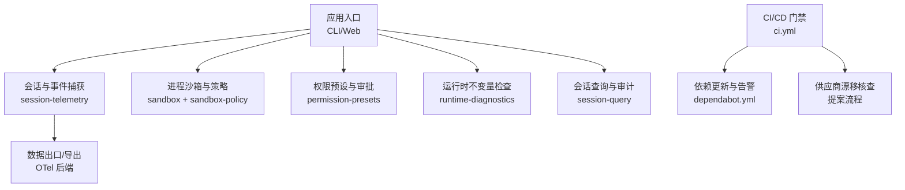
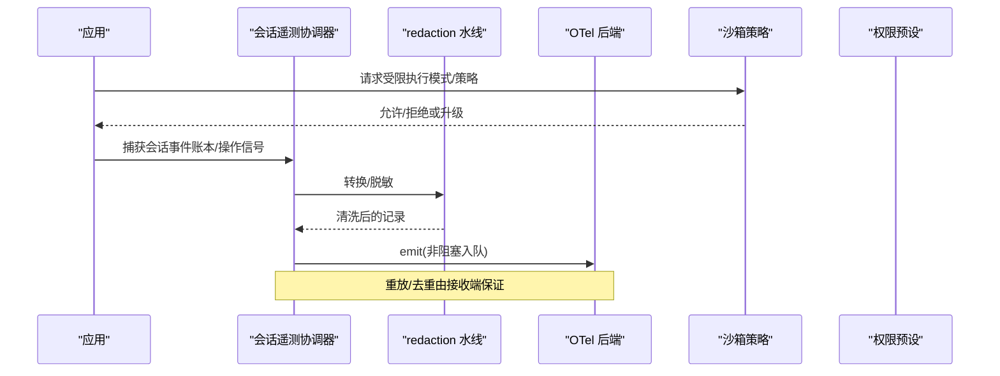
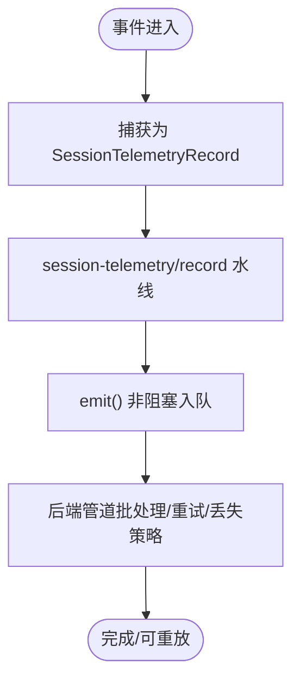
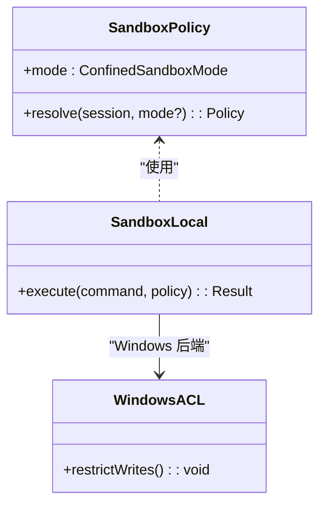
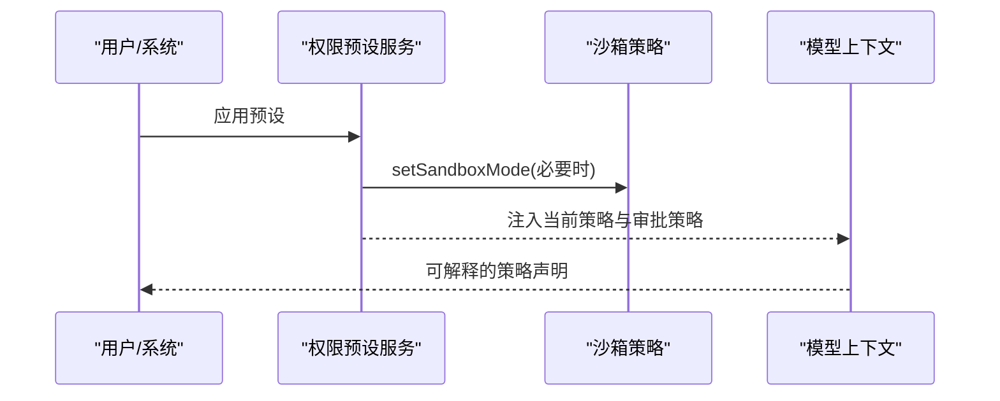
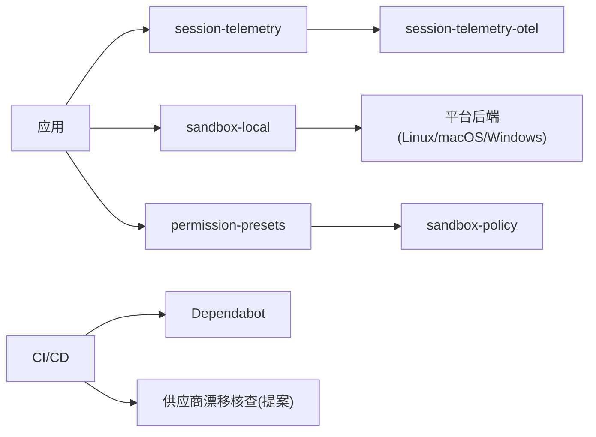

# 安全审计与监控

<cite>
**本文引用的文件**
- [SAFETY.md](file://SAFETY.md)
- [README.md](file://README.md)
- [dependabot.yml](file://.github/dependabot.yml)
- [ci.yml](file://.github/workflows/ci.yml)
- [sandbox README](file://packages/sandbox/README.md)
- [session-telemetry 文档](file://docs/subsystems/session-telemetry.md)
- [session-telemetry OTel 默认挂载说明](file://.agents/notes/implemented/feature/2026-07-31-web-telemetry-default-mount.md)
- [session-telemetry 协调器（错误上报）](file://packages/session/session-telemetry/src/coordinator.ts)
- [session-telemetry 模式解析](file://packages/session/session-telemetry-otel/src/index.ts)
- [权限预设服务](file://packages/interaction/permission-presets/src/index.ts)
- [Web 测试：权限策略上下文](file://apps/web/tests/permission-policy-context.e2e.ts)
- [运行时诊断组说明](file://packages/runtime-diagnostics/README.md)
- [工具会话查询输入定义](file://packages/session-query/tool-session-query/src/input.ts)
- [工具会话查询测试（脱敏）](file://packages/session-query/tool-session-query/tests/tool-session-query.spec.ts)
- [供应链与供应商漂移提案](file://.agents/notes/proposed/process/2026-06-11-supply-chain-and-vendor-drift.md)
</cite>

## 目录
1. [简介](#简介)
2. [项目结构](#项目结构)
3. [核心组件](#核心组件)
4. [架构总览](#架构总览)
5. [详细组件分析](#详细组件分析)
6. [依赖分析](#依赖分析)
7. [性能考虑](#性能考虑)
8. [故障排查指南](#故障排查指南)
9. [结论](#结论)
10. [附录](#附录)

## 简介
本方案面向 DeepSeek Harness 的安全审计与监控，覆盖以下目标：
- 安全事件日志记录与审计追踪机制
- 依赖包漏洞扫描与供应链安全检查流程
- 运行时安全监控与异常行为检测
- 安全合规性检查与自动化审计工具使用
- 安全指标收集与性能影响评估
- 安全告警机制与响应工作流
- 安全事件调查与取证分析最佳实践

项目处于开发者预览阶段，具备执行模型生成代码、加载第三方插件、访问网络与进程等能力，需以最小权限运行并配合沙箱与审批策略降低风险。

**章节来源**
- [SAFETY.md:1-28](file://SAFETY.md#L1-L28)
- [README.md:11-16](file://README.md#L11-L16)

## 项目结构
围绕安全审计与监控的关键位置如下：
- 运行时日志与遥测：session-telemetry（捕获、重放、导出）、OTel 后端配置
- 运行时约束与隔离：sandbox（进程沙箱、策略、平台后端）
- 权限与审批：permission-presets（预设策略、沙箱模式切换）
- 运行时自检查：runtime-diagnostics/invariants（运行时不变量检查）
- 可观测性与查询：session-query（会话事件检索、脱敏）
- 供应链与依赖治理：dependabot、CI 门禁、供应商漂移核查提案

**图表来源**
- [session-telemetry 文档:1-195](file://docs/subsystems/session-telemetry.md#L1-L195)
- [sandbox README:1-55](file://packages/sandbox/README.md#L1-L55)
- [权限预设服务:383-432](file://packages/interaction/permission-presets/src/index.ts#L383-L432)
- [运行时诊断组说明:1-50](file://packages/runtime-diagnostics/README.md#L1-L50)
- [ci.yml:1-678](file://.github/workflows/ci.yml#L1-L678)
- [dependabot.yml:1-42](file://.github/dependabot.yml#L1-L42)
- [供应链与供应商漂移提案:1-36](file://.agents/notes/proposed/process/2026-06-11-supply-chain-and-vendor-drift.md#L1-L36)

**章节来源**
- [session-telemetry 文档:1-195](file://docs/subsystems/session-telemetry.md#L1-L195)
- [sandbox README:1-55](file://packages/sandbox/README.md#L1-L55)
- [权限预设服务:383-432](file://packages/interaction/permission-presets/src/index.ts#L383-L432)
- [运行时诊断组说明:1-50](file://packages/runtime-diagnostics/README.md#L1-L50)
- [ci.yml:1-678](file://.github/workflows/ci.yml#L1-L678)
- [dependabot.yml:1-42](file://.github/dependabot.yml#L1-L42)
- [供应链与供应商漂移提案:1-36](file://.agents/notes/proposed/process/2026-06-11-supply-chain-and-vendor-drift.md#L1-L36)

## 核心组件
- 会话遥测与审计追踪：统一捕获会话事件为“账本”记录，提供操作型信号（如 agent-error、shutdown），支持重放与去重；通过 redaction 水线在导出前进行脱敏。
- 进程沙箱与策略：按调用粒度选择受限模式（只读、工作区写入、危险全权），跨平台后端实现限制；策略可随会话动态调整。
- 权限预设与审批：预设策略可自动设置沙箱模式与审批策略，并在会话初始化时补齐缺失的权限事实。
- 运行时不变量检查：在运行期对持久化事件与数据关系进行校验，失败时归因到具体包。
- 会话查询与脱敏：提供会话事件检索能力，并对敏感信息进行脱敏输出。
- CI/CD 门禁与依赖治理：通过 GitHub Actions 执行静态检查、覆盖率、兼容性、构建产物验证；Dependabot 定期提出依赖更新；提案包含供应商漂移核查与许可证清单。

**章节来源**
- [session-telemetry 文档:1-195](file://docs/subsystems/session-telemetry.md#L1-L195)
- [sandbox README:1-55](file://packages/sandbox/README.md#L1-L55)
- [权限预设服务:383-432](file://packages/interaction/permission-presets/src/index.ts#L383-L432)
- [运行时诊断组说明:1-50](file://packages/runtime-diagnostics/README.md#L1-L50)
- [工具会话查询输入定义:69-86](file://packages/session-query/tool-session-query/src/input.ts#L69-L86)
- [工具会话查询测试（脱敏）:871-907](file://packages/session-query/tool-session-query/tests/tool-session-query.spec.ts#L871-L907)
- [ci.yml:1-678](file://.github/workflows/ci.yml#L1-L678)
- [dependabot.yml:1-42](file://.github/dependabot.yml#L1-L42)
- [供应链与供应商漂移提案:1-36](file://.agents/notes/proposed/process/2026-06-11-supply-chain-and-vendor-drift.md#L1-L36)

## 架构总览
下图展示从事件捕获到导出的关键路径，以及沙箱与权限策略如何作用于执行过程。

**图表来源**
- [session-telemetry 文档:1-195](file://docs/subsystems/session-telemetry.md#L1-L195)
- [session-telemetry 模式解析:50-84](file://packages/session/session-telemetry-otel/src/index.ts#L50-L84)
- [sandbox README:1-55](file://packages/sandbox/README.md#L1-L55)
- [权限预设服务:383-432](file://packages/interaction/permission-presets/src/index.ts#L383-L432)

## 详细组件分析

### 组件A：会话遥测与审计追踪
- 捕获与记录：每个会话事件作为一条“账本”记录，附带时间、严重级别、属性与主体；操作型记录用于告警（如 agent-error、shutdown）。
- 重放与去重：新对象重建可从 seq 0 回放完整日志；接收端基于 (session.id, format_version, event.seq) 去重。
- 导出与脱敏：通过 session-telemetry/record 水线在导出前进行规则化脱敏；默认未挂载任何规则，导出即原始捕获副本。
- 后端契约：emit 必须非阻塞；flush/shutdown 由后端实现管理生命周期。
- 模式控制：默认禁用遥测，可通过环境变量启用并指向采集器。

**图表来源**
- [session-telemetry 文档:1-195](file://docs/subsystems/session-telemetry.md#L1-L195)
- [session-telemetry 模式解析:50-84](file://packages/session/session-telemetry-otel/src/index.ts#L50-L84)

**章节来源**
- [session-telemetry 文档:1-195](file://docs/subsystems/session-telemetry.md#L1-L195)
- [session-telemetry 协调器（错误上报）:209-256](file://packages/session/session-telemetry/src/coordinator.ts#L209-L256)
- [session-telemetry 模式解析:50-84](file://packages/session/session-telemetry-otel/src/index.ts#L50-L84)
- [session-telemetry 默认挂载说明:36-41](file://.agents/notes/implemented/feature/2026-07-31-web-telemetry-default-mount.md#L36-L41)

### 组件B：进程沙箱与策略
- 模式与边界：read-only、workspace-write、danger-full-access；每次调用携带独立策略，避免共享状态污染。
- 平台后端：Linux（bwrap/Landlock）、macOS（Seatbelt）、Windows（受限令牌/ACL）。
- 策略解析：部署默认值与会话级覆盖；当前策略可作为上下文注入给模型，减少“先拒绝后学习”的延迟。

**图表来源**
- [sandbox README:1-55](file://packages/sandbox/README.md#L1-L55)
- [权限预设服务:383-432](file://packages/interaction/permission-presets/src/index.ts#L383-L432)

**章节来源**
- [sandbox README:1-55](file://packages/sandbox/README.md#L1-L55)
- [权限预设服务:383-432](file://packages/interaction/permission-presets/src/index.ts#L383-L432)
- [Web 测试：权限策略上下文:120-139](file://apps/web/tests/permission-policy-context.e2e.ts#L120-L139)

### 组件C：权限预设与审批
- 预设应用：根据名称选择预设，必要时切换沙箱模式与审批策略。
- 初始补齐：会话发布前补齐缺失的权限事实，确保策略一致性。
- 上下文可见性：将当前沙箱策略与审批策略注入模型上下文，提升可解释性。

**图表来源**
- [权限预设服务:383-432](file://packages/interaction/permission-presets/src/index.ts#L383-L432)
- [Web 测试：权限策略上下文:120-139](file://apps/web/tests/permission-policy-context.e2e.ts#L120-L139)

**章节来源**
- [权限预设服务:383-432](file://packages/interaction/permission-presets/src/index.ts#L383-L432)
- [Web 测试：权限策略上下文:120-139](file://apps/web/tests/permission-policy-context.e2e.ts#L120-L139)

### 组件D：运行时不变量检查
- 作用：在运行期对包内持久化事件与数据关系进行校验，失败归因到具体包。
- 开关与过滤：全局开关与包名过滤器控制检查范围。
- 用途：在生产或预生产环境开启，增强对数据一致性的保障。

**章节来源**
- [运行时诊断组说明:1-50](file://packages/runtime-diagnostics/README.md#L1-L50)

### 组件E：会话查询与脱敏
- 查询能力：支持按会话、时间窗口、事件类型、表面（current/shadowed/log-only）等维度检索。
- 脱敏策略：工具返回的诊断信息会进行脱敏，避免泄露敏感内容。

**章节来源**
- [工具会话查询输入定义:69-86](file://packages/session-query/tool-session-query/src/input.ts#L69-L86)
- [工具会话查询测试（脱敏）:871-907](file://packages/session-query/tool-session-query/tests/tool-session-query.spec.ts#L871-L907)

### 组件F：CI/CD 门禁与依赖治理
- 门禁：静态检查、覆盖率、兼容性、构建产物验证、Windows Wine 与原生测试。
- 依赖更新：Dependabot 定时扫描 npm、uv、GitHub Actions，排除 vendor 目录。
- 供应商漂移：提案建议夜间任务重建 vendor 并比对差异，结合许可证清单核查。

**章节来源**
- [ci.yml:1-678](file://.github/workflows/ci.yml#L1-L678)
- [dependabot.yml:1-42](file://.github/dependabot.yml#L1-L42)
- [供应链与供应商漂移提案:1-36](file://.agents/notes/proposed/process/2026-06-11-supply-chain-and-vendor-drift.md#L1-L36)

## 依赖分析
- 直接依赖：
  - 遥测后端：OpenTelemetry JS SDK（通过 session-telemetry-otel）
  - 沙箱后端：平台相关工具（bwrap/Landlock、Seatbelt、Windows ACL）
  - 权限与策略：interaction/permission-presets、sandbox-policy
- 间接依赖：
  - CI 工具链：pnpm、Playwright、Wine、Node/Python 版本矩阵
  - 依赖治理：Dependabot、可选的 osv-scanner/pnpm audit（提案）

**图表来源**
- [session-telemetry 文档:1-195](file://docs/subsystems/session-telemetry.md#L1-L195)
- [sandbox README:1-55](file://packages/sandbox/README.md#L1-L55)
- [权限预设服务:383-432](file://packages/interaction/permission-presets/src/index.ts#L383-L432)
- [ci.yml:1-678](file://.github/workflows/ci.yml#L1-L678)
- [dependabot.yml:1-42](file://.github/dependabot.yml#L1-L42)
- [供应链与供应商漂移提案:1-36](file://.agents/notes/proposed/process/2026-06-11-supply-chain-and-vendor-drift.md#L1-L36)

**章节来源**
- [session-telemetry 文档:1-195](file://docs/subsystems/session-telemetry.md#L1-L195)
- [sandbox README:1-55](file://packages/sandbox/README.md#L1-L55)
- [权限预设服务:383-432](file://packages/interaction/permission-presets/src/index.ts#L383-L432)
- [ci.yml:1-678](file://.github/workflows/ci.yml#L1-L678)
- [dependabot.yml:1-42](file://.github/dependabot.yml#L1-L42)
- [供应链与供应商漂移提案:1-36](file://.agents/notes/proposed/process/2026-06-11-supply-chain-and-vendor-drift.md#L1-L36)

## 性能考虑
- 遥测导出：emit 为非阻塞入队，避免阻塞代理循环；flush/shutdown 由后端管理，避免频繁同步开销。
- 快照与缓存：CI 中复用 pnpm store、Playwright 缓存，缩短冷启动时间。
- 并发控制：CI 使用 DSH_GATE_CONCURRENCY、DSH_COVERAGE_* 等变量控制并行度，平衡速度与资源占用。
- 沙箱执行：每调用独立策略，避免全局状态竞争；平台后端按需选择，减少不必要开销。

[本节为通用指导，不直接分析具体文件]

## 故障排查指南
- 遥测问题：
  - 确认模式是否启用（默认禁用），检查环境变量与采集器地址。
  - 若出现捕获步骤抛错，协调器会记录警告并继续运行（fail-closed）。
- 沙箱与权限：
  - 检查当前沙箱模式与审批策略是否正确注入模型上下文。
  - 若被拒绝，查看预设是否已正确应用，必要时进行一次性升级。
- 查询与脱敏：
  - 使用会话查询接口检索事件，注意结果已脱敏；如需定位敏感信息，请在服务端侧日志中查看。
- CI 失败：
  - 关注 gate 聚合结果与 fail-fast 行为；必要时切换到自托管池或回退镜像。

**章节来源**
- [session-telemetry 协调器（错误上报）:209-256](file://packages/session/session-telemetry/src/coordinator.ts#L209-L256)
- [Web 测试：权限策略上下文:120-139](file://apps/web/tests/permission-policy-context.e2e.ts#L120-L139)
- [工具会话查询测试（脱敏）:871-907](file://packages/session-query/tool-session-query/tests/tool-session-query.spec.ts#L871-L907)
- [ci.yml:1-678](file://.github/workflows/ci.yml#L1-L678)

## 结论
本方案以“会话遥测 + 进程沙箱 + 权限预设 + 运行时不变量 + 会话查询 + CI/CD 门禁”为核心，构建了覆盖开发、测试、发布与运行的安全审计与监控闭环。建议在部署时：
- 明确遥测模式与采集器，并挂载合适的脱敏规则
- 配置沙箱默认策略与审批策略，确保模型上下文可见
- 在 CI 中启用依赖更新与供应商漂移核查
- 在生产环境开启运行时不变量检查，持续收敛数据不一致风险

[本节为总结，不直接分析具体文件]

## 附录
- 安全提示：项目为实验性软件，不具备生产就绪的安全审计，需谨慎使用并遵循最小权限原则。
- 参考：
  - 安全声明与注意事项
  - 子系统文档（会话遥测、沙箱、权限、运行时诊断）
  - CI/CD 与依赖治理配置
  - 供应链与供应商漂移提案

**章节来源**
- [SAFETY.md:1-28](file://SAFETY.md#L1-L28)
- [session-telemetry 文档:1-195](file://docs/subsystems/session-telemetry.md#L1-L195)
- [sandbox README:1-55](file://packages/sandbox/README.md#L1-L55)
- [ci.yml:1-678](file://.github/workflows/ci.yml#L1-L678)
- [dependabot.yml:1-42](file://.github/dependabot.yml#L1-L42)
- [供应链与供应商漂移提案:1-36](file://.agents/notes/proposed/process/2026-06-11-supply-chain-and-vendor-drift.md#L1-L36)