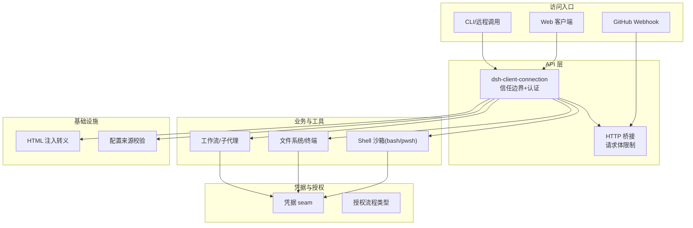
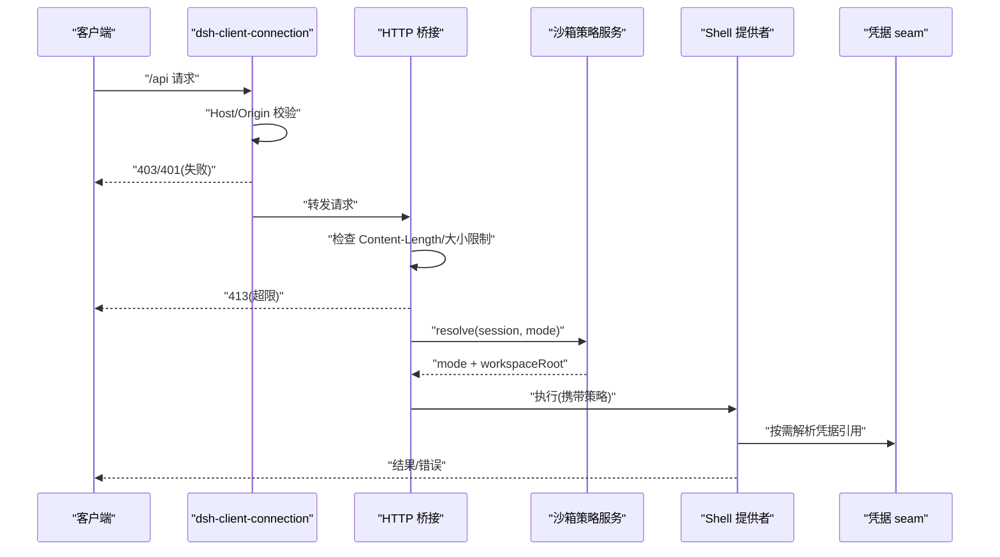
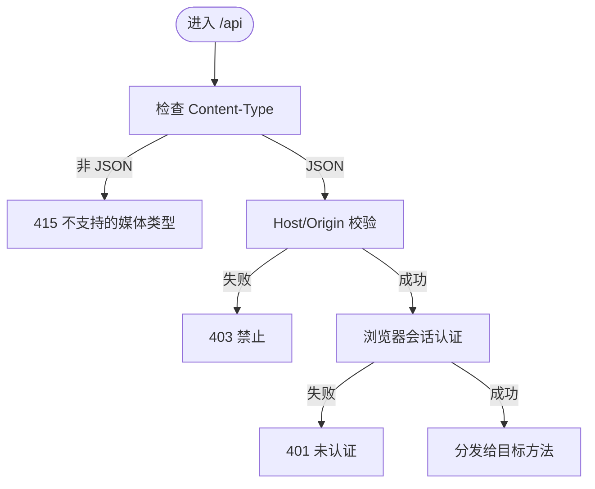
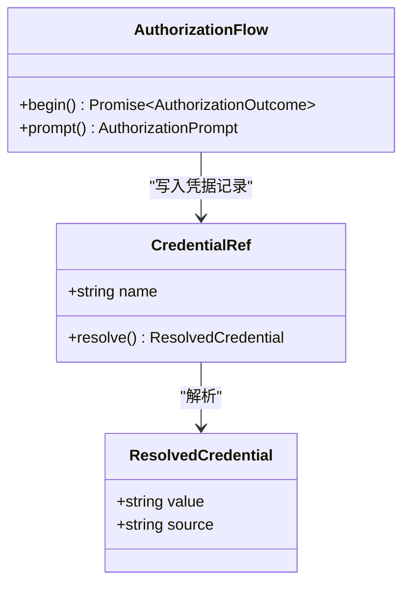
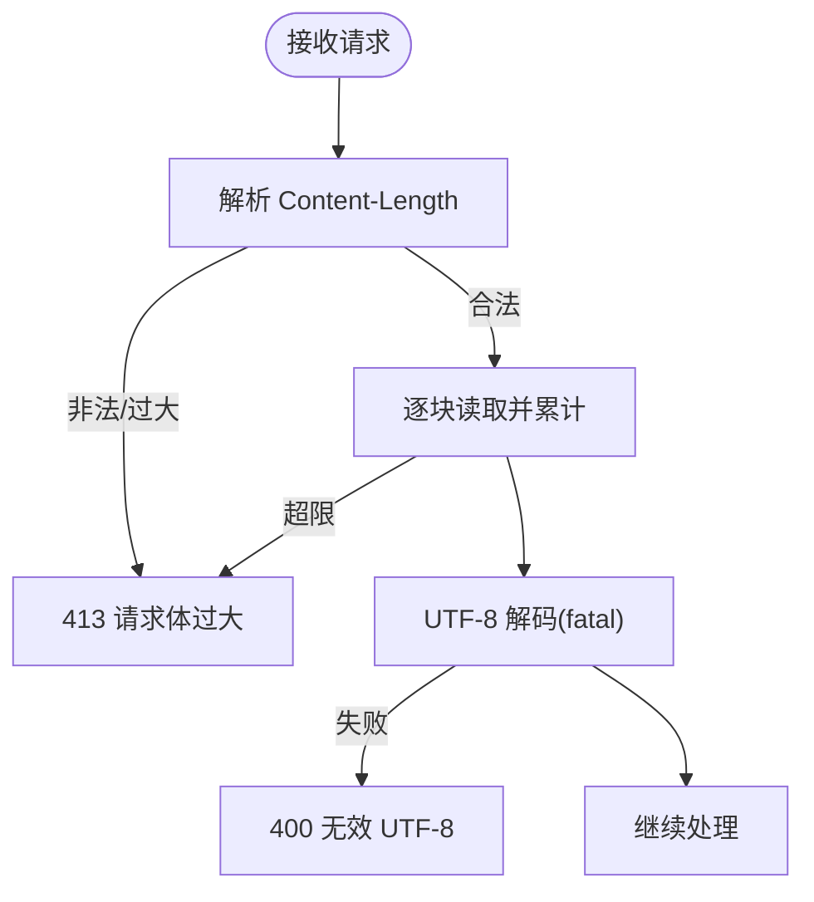
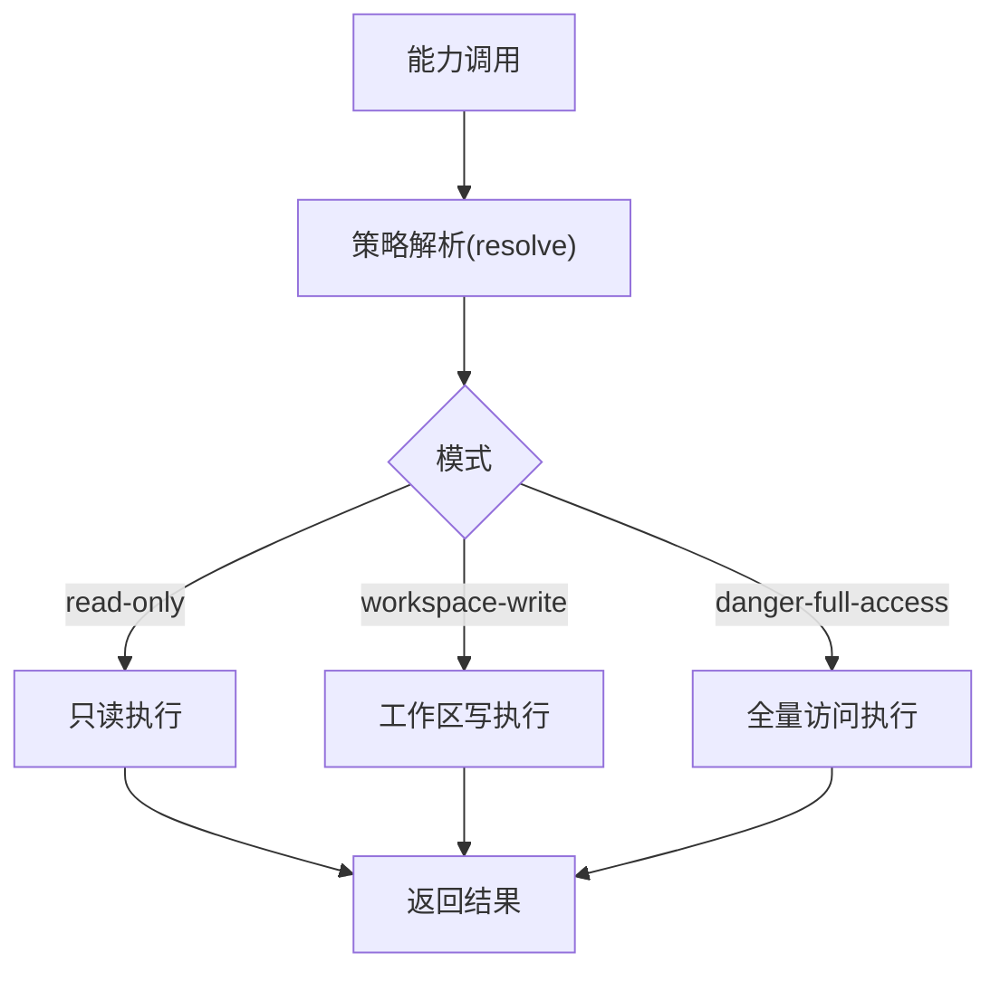
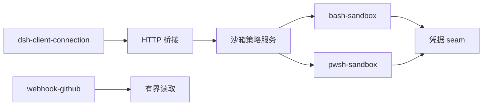

# 安全最佳实践

<cite>
**本文引用的文件**
- [SAFETY.md](file://SAFETY.md)
- [packages/credentials/authorization/src/types.ts](file://packages/credentials/authorization/src/types.ts)
- [packages/sandbox/sandbox-policy/src/index.ts](file://packages/sandbox/sandbox-policy/src/index.ts)
- [packages/shell/bash-sandbox/src/index.ts](file://packages/shell/bash-sandbox/src/index.ts)
- [packages/shell/pwsh-sandbox/src/index.ts](file://packages/shell/pwsh-sandbox/src/index.ts)
- [packages/client/connection/src/index.ts](file://packages/client/connection/src/index.ts)
- [packages/client/connection/src/http-bridge.ts](file://packages/client/connection/src/http-bridge.ts)
- [packages/webhook/webhook-github/src/body.ts](file://packages/webhook/webhook-github/src/body.ts)
- [packages/host/webserver/src/injections.ts](file://packages/host/webserver/src/injections.ts)
- [scripts/verify-config-source-ownership.ts](file://scripts/verify-config-source-ownership.ts)
- [.agents/notes/implemented/architecture/2026-07-28-api-browser-trust-boundary.zh.md](file://.agents/notes/implemented/architecture/2026-07-28-api-browser-trust-boundary.zh.md)
- [.agents/notes/implemented/architecture/2026-08-24-browser-token-authentication.zh.md](file://.agents/notes/implemented/architecture/2026-08-24-browser-token-authentication.zh.md)
- [docs/subsystems/credentials.zh.md](file://docs/subsystems/credentials.zh.md)
- [docs/subsystems/sandbox.md](file://docs/subsystems/sandbox.md)
</cite>

## 目录
1. [简介](#简介)
2. [项目结构](#项目结构)
3. [核心组件](#核心组件)
4. [架构总览](#架构总览)
5. [详细组件分析](#详细组件分析)
6. [依赖关系分析](#依赖关系分析)
7. [性能与安全权衡](#性能与安全权衡)
8. [故障排查指南](#故障排查指南)
9. [结论](#结论)
10. [附录](#附录)

## 简介
本指南面向在 DeepSeek Harness 中实现“安全编码最佳实践”的工程师与运维人员，聚焦以下主题：身份认证与授权、敏感数据保护与加密存储、API 安全设计（请求验证、速率限制与防攻击）、沙箱环境的安全配置与执行隔离、安全审计与漏洞扫描、威胁分析与风险评估。文档基于仓库中的实际实现与决策记录，提供可操作的策略、流程图与参考路径，帮助你在不引入额外风险的前提下提升系统安全性。

## 项目结构
围绕安全能力，代码库采用按子系统划分的模块化组织方式：
- 凭据与授权：通过凭据 seam 将机密与配置解耦，并提供交互式授权流程类型定义。
- API 网关与连接：对 /api 前缀实施载体级信任边界与浏览器会话认证，统一请求体大小限制与传输安全。
- Webhook 处理：对 GitHub Webhook 等外部回调进行有界输入读取与签名校验前置防护。
- 沙箱与执行隔离：以策略服务为中心，为 shell、文件系统、终端等后端提供一致的每调用策略解析与执行约束。
- 注入与渲染：对 HTML 注入点进行严格转义，避免 XSS。
- 配置治理：通过脚本校验禁止在 shipped 配置中内联密钥或端点。

图表来源
- [packages/client/connection/src/index.ts:70-91](file://packages/client/connection/src/index.ts#L70-L91)
- [packages/client/connection/src/http-bridge.ts:42-84](file://packages/client/connection/src/http-bridge.ts#L42-L84)
- [packages/shell/bash-sandbox/src/index.ts:51-86](file://packages/shell/bash-sandbox/src/index.ts#L51-L86)
- [packages/shell/pwsh-sandbox/src/index.ts:59-94](file://packages/shell/pwsh-sandbox/src/index.ts#L59-L94)
- [packages/webhook/webhook-github/src/body.ts:1-70](file://packages/webhook/webhook-github/src/body.ts#L1-L70)
- [packages/host/webserver/src/injections.ts:42-76](file://packages/host/webserver/src/injections.ts#L42-L76)
- [scripts/verify-config-source-ownership.ts:1-22](file://scripts/verify-config-source-ownership.ts#L1-L22)

章节来源
- [packages/client/connection/src/index.ts:70-91](file://packages/client/connection/src/index.ts#L70-L91)
- [packages/client/connection/src/http-bridge.ts:42-84](file://packages/client/connection/src/http-bridge.ts#L42-L84)
- [packages/shell/bash-sandbox/src/index.ts:51-86](file://packages/shell/bash-sandbox/src/index.ts#L51-L86)
- [packages/shell/pwsh-sandbox/src/index.ts:59-94](file://packages/shell/pwsh-sandbox/src/index.ts#L59-L94)
- [packages/webhook/webhook-github/src/body.ts:1-70](file://packages/webhook/webhook-github/src/body.ts#L1-L70)
- [packages/host/webserver/src/injections.ts:42-76](file://packages/host/webserver/src/injections.ts#L42-L76)
- [scripts/verify-config-source-ownership.ts:1-22](file://scripts/verify-config-source-ownership.ts#L1-L22)

## 核心组件
- 身份认证与授权
  - 载体级浏览器信任边界：对所有 /api 请求强制 Host/Origin 校验，拒绝跨站简单请求与重绑定攻击。
  - 浏览器启动令牌认证：在分发前完成完整 Host API 的浏览器会话认证，未认证返回 401，非法来源返回 403。
  - 授权流程类型：提供用户交互型授权方法、提示与状态，确保敏感操作需人类参与。
- 敏感数据保护
  - 凭据 seam：配置仅保存引用，值由提供方按需解析；空值视为不存在，支持热更新与轮换。
  - 配置来源校验：禁止在 shipped 配置中内联密钥或端点，降低误配泄露风险。
- API 安全设计
  - 请求体大小限制：统一限制 JSON 缓冲体大小，超限立即关闭连接并返回 413。
  - Webhook 输入有界读取：严格解析 Content-Length，限制 UTF-8 解码范围，异常即拒。
  - HTML 注入转义：对注入内容做属性/文本转义，防止 XSS。
- 沙箱与执行隔离
  - 策略服务：集中管理默认模式与工作区根，按调用解析最终策略，供各后端一致消费。
  - Shell 提供者：为 bash/pwsh 注入每调用策略，保留进程级事实用于诊断与失败规则。
- 安全审计与合规
  - 事件化策略变更：sandbox/mode 事件进入会话投影，便于回放与审计。
  - 测试覆盖：针对拒绝行为、错误码与边界条件进行断言。

章节来源
- [.agents/notes/implemented/architecture/2026-07-28-api-browser-trust-boundary.zh.md:11-32](file://.agents/notes/implemented/architecture/2026-07-28-api-browser-trust-boundary.zh.md#L11-L32)
- [.agents/notes/implemented/architecture/2026-08-24-browser-token-authentication.zh.md:1-13](file://.agents/notes/implemented/architecture/2026-08-24-browser-token-authentication.zh.md#L1-L13)
- [packages/credentials/authorization/src/types.ts:1-92](file://packages/credentials/authorization/src/types.ts#L1-L92)
- [docs/subsystems/credentials.zh.md:1-30](file://docs/subsystems/credentials.zh.md#L1-L30)
- [scripts/verify-config-source-ownership.ts:1-22](file://scripts/verify-config-source-ownership.ts#L1-L22)
- [packages/client/connection/src/http-bridge.ts:42-84](file://packages/client/connection/src/http-bridge.ts#L42-L84)
- [packages/webhook/webhook-github/src/body.ts:1-70](file://packages/webhook/webhook-github/src/body.ts#L1-L70)
- [packages/host/webserver/src/injections.ts:42-76](file://packages/host/webserver/src/injections.ts#L42-L76)
- [packages/sandbox/sandbox-policy/src/index.ts:1-183](file://packages/sandbox/sandbox-policy/src/index.ts#L1-L183)
- [packages/shell/bash-sandbox/src/index.ts:51-86](file://packages/shell/bash-sandbox/src/index.ts#L51-L86)
- [packages/shell/pwsh-sandbox/src/index.ts:59-94](file://packages/shell/pwsh-sandbox/src/index.ts#L59-L94)

## 架构总览
下图展示从外部请求到执行隔离的关键安全路径：载体级信任边界 → 浏览器会话认证 → 请求体限制 → 策略解析 → 沙箱执行。

图表来源
- [packages/client/connection/src/index.ts:70-91](file://packages/client/connection/src/index.ts#L70-L91)
- [packages/client/connection/src/http-bridge.ts:42-84](file://packages/client/connection/src/http-bridge.ts#L42-L84)
- [packages/sandbox/sandbox-policy/src/index.ts:154-182](file://packages/sandbox/sandbox-policy/src/index.ts#L154-L182)
- [packages/shell/bash-sandbox/src/index.ts:79-86](file://packages/shell/bash-sandbox/src/index.ts#L79-L86)
- [packages/shell/pwsh-sandbox/src/index.ts:87-94](file://packages/shell/pwsh-sandbox/src/index.ts#L87-L94)

## 详细组件分析

### 身份认证与授权
- 载体级浏览器信任边界
  - 所有 /api POST 必须声明 application/json，阻断跨站简单请求。
  - Host/Origin 校验防御 DNS rebinding 与跨站读取；非 loopback 部署需显式声明 trustedHosts。
- 浏览器启动令牌认证
  - 在分发前对完整 Host API 进行浏览器会话认证；无有效会话返回 401，非法来源返回 403。
- 授权流程
  - 提供 text/secret/select 三类提示，支持信号取消与状态上报，确保需要人类确认的操作不可绕过。

图表来源
- [.agents/notes/implemented/architecture/2026-07-28-api-browser-trust-boundary.zh.md:11-32](file://.agents/notes/implemented/architecture/2026-07-28-api-browser-trust-boundary.zh.md#L11-L32)
- [.agents/notes/implemented/architecture/2026-08-24-browser-token-authentication.zh.md:1-13](file://.agents/notes/implemented/architecture/2026-08-24-browser-token-authentication.zh.md#L1-L13)
- [packages/client/connection/src/index.ts:70-91](file://packages/client/connection/src/index.ts#L70-L91)

章节来源
- [.agents/notes/implemented/architecture/2026-07-28-api-browser-trust-boundary.zh.md:11-32](file://.agents/notes/implemented/architecture/2026-07-28-api-browser-trust-boundary.zh.md#L11-L32)
- [.agents/notes/implemented/architecture/2026-08-24-browser-token-authentication.zh.md:1-13](file://.agents/notes/implemented/architecture/2026-08-24-browser-token-authentication.zh.md#L1-L13)
- [packages/credentials/authorization/src/types.ts:1-92](file://packages/credentials/authorization/src/types.ts#L1-L92)

### 敏感数据保护与加密存储
- 凭据 seam
  - 配置仅保存引用（如环境变量名），值由提供方按需解析；空值在任何地方视为不存在，避免静默降级。
  - 每次操作重新解析，支持热更新与轮换，无需重启。
- 配置来源治理
  - 通过脚本校验禁止在 shipped 配置中内联 apiKey/baseURL/authToken 等敏感字段，减少误配泄露面。

图表来源
- [docs/subsystems/credentials.zh.md:1-30](file://docs/subsystems/credentials.zh.md#L1-L30)
- [packages/credentials/authorization/src/types.ts:1-92](file://packages/credentials/authorization/src/types.ts#L1-L92)
- [scripts/verify-config-source-ownership.ts:1-22](file://scripts/verify-config-source-ownership.ts#L1-L22)

章节来源
- [docs/subsystems/credentials.zh.md:1-30](file://docs/subsystems/credentials.zh.md#L1-L30)
- [scripts/verify-config-source-ownership.ts:1-22](file://scripts/verify-config-source-ownership.ts#L1-L22)

### API 安全设计（请求验证、速率限制与防攻击）
- 请求体大小限制
  - HTTP 桥接层对 buffered 请求体进行累计计数，超过阈值立即关闭连接并返回 413。
  - 默认容量预留足够空间以承载大图片批处理，同时保证上限可控。
- Webhook 输入有界读取
  - 严格解析 Content-Length，拒绝非法或过大值；流式读取时累计字节数，超出即中止。
  - 使用致命 UTF-8 解码，非法字符直接拒绝。
- 防攻击措施
  - 载体级信任边界阻断跨站简单请求与重绑定。
  - HTML 注入转义防止 XSS。

图表来源
- [packages/client/connection/src/http-bridge.ts:42-84](file://packages/client/connection/src/http-bridge.ts#L42-L84)
- [packages/webhook/webhook-github/src/body.ts:1-70](file://packages/webhook/webhook-github/src/body.ts#L1-L70)
- [packages/host/webserver/src/injections.ts:42-76](file://packages/host/webserver/src/injections.ts#L42-L76)

章节来源
- [packages/client/connection/src/http-bridge.ts:42-84](file://packages/client/connection/src/http-bridge.ts#L42-L84)
- [packages/webhook/webhook-github/src/body.ts:1-70](file://packages/webhook/webhook-github/src/body.ts#L1-L70)
- [packages/host/webserver/src/injections.ts:42-76](file://packages/host/webserver/src/injections.ts#L42-L76)

### 沙箱环境的安全配置与执行隔离
- 策略服务
  - 维护部署默认模式与工作区根；按调用解析最终策略，优先级：显式批准 > 会话最近模式 > 部署默认。
  - 将策略注入系统提示与缓存快照，便于审计与回放。
- Shell 提供者
  - 为 bash/pwsh 注入每调用策略，保留进程级事实（模式、执行完整性、拒绝特征等）。
- 模式说明
  - read-only：只读；workspace-write：允许在工作区内写；danger-full-access：无文件限制（谨慎使用）。

图表来源
- [packages/sandbox/sandbox-policy/src/index.ts:154-182](file://packages/sandbox/sandbox-policy/src/index.ts#L154-L182)
- [docs/subsystems/sandbox.md:23-96](file://docs/subsystems/sandbox.md#L23-L96)
- [packages/shell/bash-sandbox/src/index.ts:79-86](file://packages/shell/bash-sandbox/src/index.ts#L79-L86)
- [packages/shell/pwsh-sandbox/src/index.ts:87-94](file://packages/shell/pwsh-sandbox/src/index.ts#L87-L94)

章节来源
- [packages/sandbox/sandbox-policy/src/index.ts:1-183](file://packages/sandbox/sandbox-policy/src/index.ts#L1-L183)
- [docs/subsystems/sandbox.md:23-96](file://docs/subsystems/sandbox.md#L23-L96)
- [packages/shell/bash-sandbox/src/index.ts:51-86](file://packages/shell/bash-sandbox/src/index.ts#L51-L86)
- [packages/shell/pwsh-sandbox/src/index.ts:59-94](file://packages/shell/pwsh-sandbox/src/index.ts#L59-L94)

### 安全审计与漏洞扫描
- 审计要点
  - 策略变更事件（sandbox/mode）进入会话投影，可用于回放与审计。
  - 凭据 seam 的每次解析来源可追踪，便于定位热点与轮换效果。
- 扫描建议
  - 在 CI 中集成静态扫描与依赖漏洞扫描，结合仓库现有脚本（如配置来源校验）形成门禁。
  - 对 Webhook 与 /api 的输入边界用例进行回归测试，确保新增功能不破坏既有防护。

章节来源
- [packages/sandbox/sandbox-policy/src/index.ts:132-151](file://packages/sandbox/sandbox-policy/src/index.ts#L132-L151)
- [docs/subsystems/credentials.zh.md:1-30](file://docs/subsystems/credentials.zh.md#L1-L30)
- [scripts/verify-config-source-ownership.ts:1-22](file://scripts/verify-config-source-ownership.ts#L1-L22)

### 安全威胁分析与风险评估
- 威胁建模要点
  - 载体级信任边界缺失会导致混淆代理人攻击；已通过 Host/Origin 与媒体类型栅栏缓解。
  - 凭据硬编码与配置污染：通过 seam 与配置来源校验降低风险。
  - 资源耗尽（DoS）：通过请求体大小限制与 Webhook 有界读取缓解。
  - 执行逃逸：依赖沙箱模式与后端实现完整性；注意 partial/full 差异。
- 评估方法
  - 以调用为单位审查策略解析与执行路径，关注危险模式（danger-full-access）的使用场景与审批流程。
  - 对第三方插件与命令执行进行最小权限原则审查，优先使用受限模式。

章节来源
- [SAFETY.md:5-28](file://SAFETY.md#L5-L28)
- [docs/subsystems/sandbox.md:23-96](file://docs/subsystems/sandbox.md#L23-L96)

## 依赖关系分析
- 松耦合与高内聚
  - 凭据 seam 与授权类型独立于具体服务，便于浏览器端消费。
  - 沙箱策略服务作为唯一权威，被多个执行提供者复用，降低重复逻辑与不一致性。
- 关键依赖链
  - dsh-client-connection → HTTP 桥接 → 策略服务 → Shell 提供者 → 凭据 seam。
  - Webhook → 有界读取 → 后续处理（签名校验等）。

图表来源
- [packages/client/connection/src/index.ts:70-91](file://packages/client/connection/src/index.ts#L70-L91)
- [packages/client/connection/src/http-bridge.ts:42-84](file://packages/client/connection/src/http-bridge.ts#L42-L84)
- [packages/sandbox/sandbox-policy/src/index.ts:154-182](file://packages/sandbox/sandbox-policy/src/index.ts#L154-L182)
- [packages/shell/bash-sandbox/src/index.ts:79-86](file://packages/shell/bash-sandbox/src/index.ts#L79-L86)
- [packages/shell/pwsh-sandbox/src/index.ts:87-94](file://packages/shell/pwsh-sandbox/src/index.ts#L87-L94)
- [packages/webhook/webhook-github/src/body.ts:1-70](file://packages/webhook/webhook-github/src/body.ts#L1-L70)

章节来源
- [packages/client/connection/src/index.ts:70-91](file://packages/client/connection/src/index.ts#L70-L91)
- [packages/client/connection/src/http-bridge.ts:42-84](file://packages/client/connection/src/http-bridge.ts#L42-L84)
- [packages/sandbox/sandbox-policy/src/index.ts:154-182](file://packages/sandbox/sandbox-policy/src/index.ts#L154-L182)
- [packages/shell/bash-sandbox/src/index.ts:79-86](file://packages/shell/bash-sandbox/src/index.ts#L79-L86)
- [packages/shell/pwsh-sandbox/src/index.ts:87-94](file://packages/shell/pwsh-sandbox/src/index.ts#L87-L94)
- [packages/webhook/webhook-github/src/body.ts:1-70](file://packages/webhook/webhook-github/src/body.ts#L1-L70)

## 性能与安全权衡
- 请求体大小限制
  - 默认容量兼顾大图批量上传与内存占用；过小会误伤正常业务，过大增加 DoS 风险。
- 策略解析开销
  - 每次调用解析策略，但仅读取一次会话投影，避免重复计算；对高频调用影响有限。
- 认证成本
  - 载体级信任边界与浏览器会话认证在入口处一次性完成，后续分发不再重复校验，整体开销可控。

[本节为通用指导，不直接分析具体文件]

## 故障排查指南
- 常见错误与定位
  - 413 请求体过大：检查 maxRequestBodyBytes 与附件限制是否匹配；确认上游是否发送了超大负载。
  - 401/403 认证失败：核对 trustedHosts 配置与 Host/Origin 头；确认浏览器会话是否有效。
  - Webhook 400/413：检查 Content-Length 合法性与 UTF-8 解码；确认最大体长配置。
  - 沙箱拒绝写入：确认当前模式与工作区根；必要时走审批流程提升模式。
- 日志与审计
  - 查看 sandbox/mode 事件与系统提示上下文，确认策略生效范围。
  - 凭据解析来源可用于定位配置层问题。

章节来源
- [packages/client/connection/src/http-bridge.ts:42-84](file://packages/client/connection/src/http-bridge.ts#L42-L84)
- [packages/webhook/webhook-github/src/body.ts:1-70](file://packages/webhook/webhook-github/src/body.ts#L1-L70)
- [packages/sandbox/sandbox-policy/src/index.ts:132-151](file://packages/sandbox/sandbox-policy/src/index.ts#L132-L151)
- [docs/subsystems/credentials.zh.md:1-30](file://docs/subsystems/credentials.zh.md#L1-L30)

## 结论
本指南基于仓库的实际实现，总结了身份认证与授权、敏感数据保护、API 安全设计、沙箱隔离、审计与风险评估的最佳实践。建议在开发过程中坚持最小权限、输入有界、明确信任边界与可审计的策略解析，持续通过自动化脚本与测试保障安全基线不被破坏。

[本节为总结性内容，不直接分析具体文件]

## 附录
- 实验性与免责声明
  - 本项目处于实验阶段，未经过安全审计，不应被视为生产就绪；沙箱与权限控制不能保证完全隔离或阻止损害。
- 负责任使用建议
  - 以最小权限运行；优先使用可销毁环境；备份重要文件；谨慎暴露敏感凭据；审阅插件与命令后再允许执行。

章节来源
- [SAFETY.md:5-28](file://SAFETY.md#L5-L28)