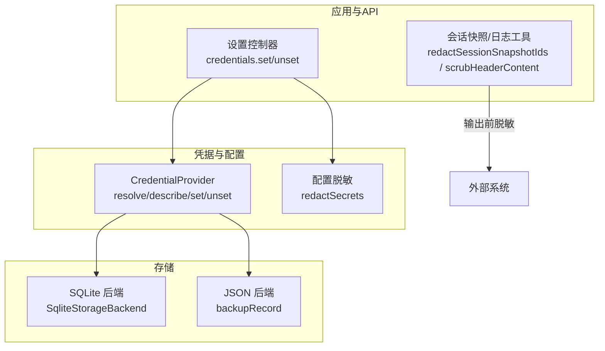
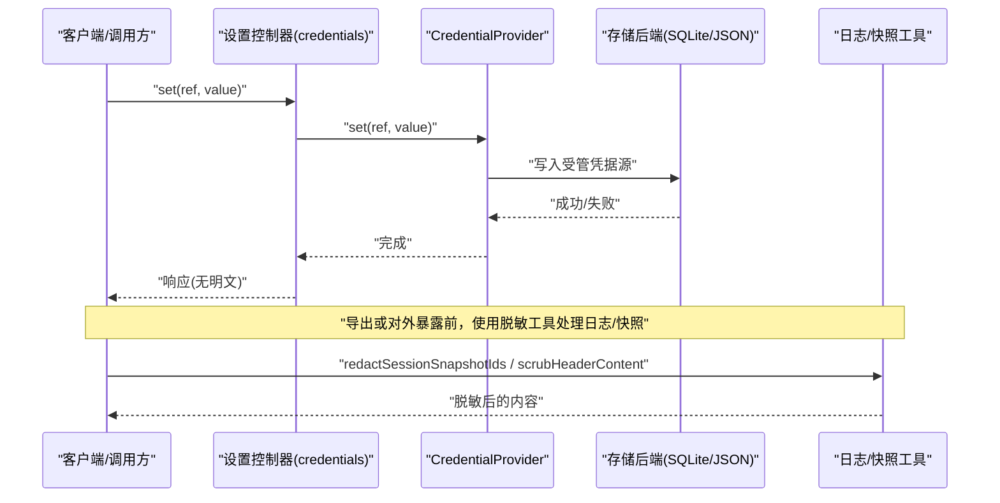
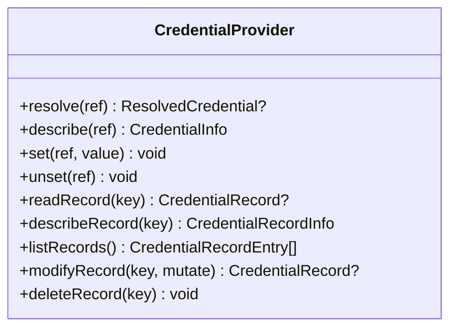
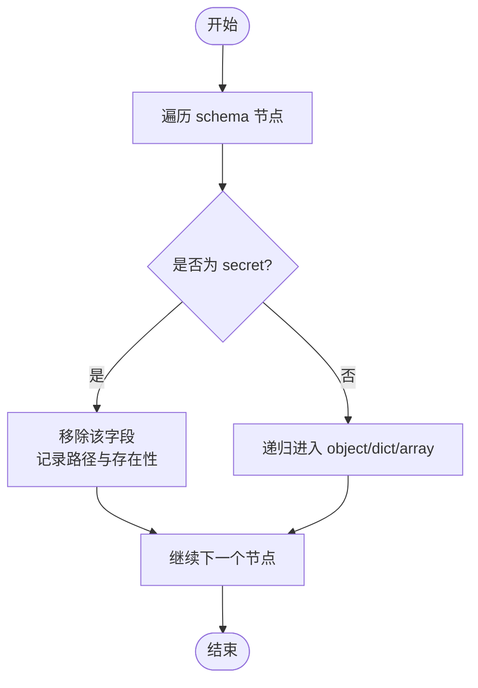
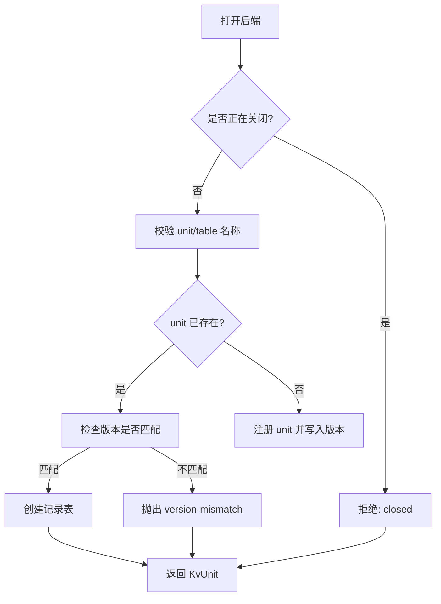
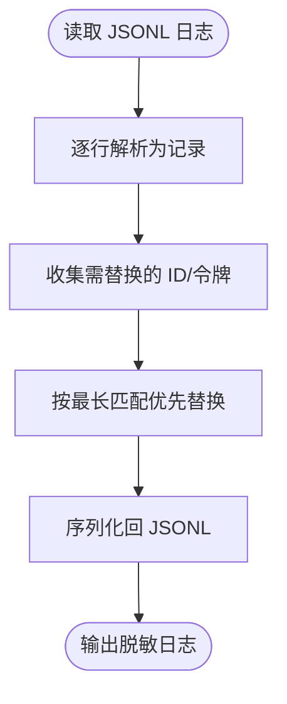
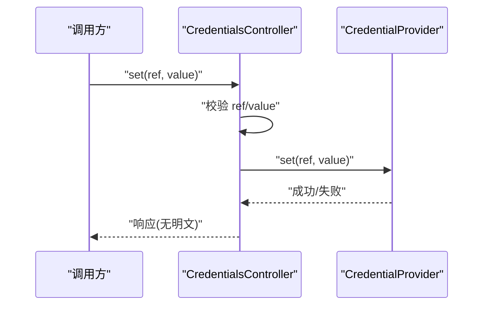
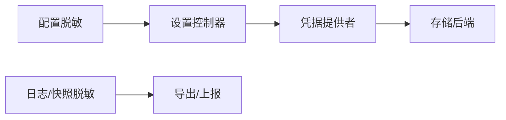

# 数据保护与加密

<cite>
**本文引用的文件**
- [packages/credentials/credentials/src/index.ts](file://packages/credentials/credentials/src/index.ts)
- [packages/api/settings-controller/src/credentials.ts](file://packages/api/settings-controller/src/credentials.ts)
- [packages/settings/settings/src/redact.ts](file://packages/settings/settings/src/redact.ts)
- [packages/storage/storage-sqlite/src/index.ts](file://packages/storage/storage-sqlite/src/index.ts)
- [packages/test-support/session-snapshot/src/identity.ts](file://packages/test-support/session-snapshot/src/identity.ts)
- [packages/test-support/session-snapshot/src/normalize.ts](file://packages/test-support/session-snapshot/src/normalize.ts)
- [packages/storage/storage-json/tests/json-backend.spec.ts](file://packages/storage/storage-json/tests/json-backend.spec.ts)
- [docs/subsystems/credentials.md](file://docs/subsystems/credentials.md)
</cite>

## 目录
1. [简介](#简介)
2. [项目结构](#项目结构)
3. [核心组件](#核心组件)
4. [架构总览](#架构总览)
5. [详细组件分析](#详细组件分析)
6. [依赖关系分析](#依赖关系分析)
7. [性能考虑](#性能考虑)
8. [故障排查指南](#故障排查指南)
9. [结论](#结论)
10. [附录](#附录)

## 简介
本指南围绕敏感数据的生命周期，结合仓库中已有的凭据、配置脱敏、存储后端与日志快照处理等实现，给出数据保护与加密存储的全面实践。内容涵盖：
- 敏感数据的加密算法选择与密钥管理策略（以凭据抽象为核心）
- 数据库字段级加密、传输层加密与静态数据加密的实现建议
- 环境变量管理与配置文件的安全存储方法
- API 请求与响应的数据脱敏方案
- 备份与恢复过程中的安全措施
- 日志系统中的敏感信息过滤与掩码处理
- 数据生命周期的安全管理最佳实践

## 项目结构
本项目将“凭据”与“配置”解耦：配置携带引用（如环境变量名），实际值由凭据提供者管理；设置值在跨边界前按 schema 标记进行脱敏；持久化通过可插拔存储后端完成，并支持备份能力；测试与导出工具提供日志与快照的脱敏能力。

图表来源
- [packages/api/settings-controller/src/credentials.ts:92-118](file://packages/api/settings-controller/src/credentials.ts#L92-L118)
- [packages/credentials/credentials/src/index.ts:170-256](file://packages/credentials/credentials/src/index.ts#L170-L256)
- [packages/settings/settings/src/redact.ts:50-109](file://packages/settings/settings/src/redact.ts#L50-L109)
- [packages/storage/storage-sqlite/src/index.ts:55-123](file://packages/storage/storage-sqlite/src/index.ts#L55-L123)
- [packages/storage/storage-json/tests/json-backend.spec.ts:384-402](file://packages/storage/storage-json/tests/json-backend.spec.ts#L384-L402)

章节来源
- [docs/subsystems/credentials.md:1-330](file://docs/subsystems/credentials.md#L1-L330)

## 核心组件
- 凭据抽象服务：提供 resolve/describe/set/unset 以及记录读写、枚举、原子修改等能力，确保空值不视为已配置，且每次操作重新解析以实现热更新。
- 配置脱敏：基于 schema 标注的 secret 字段，在跨边界前移除机密值，同时返回被移除位置及是否存在的元信息，供 UI 渲染只写输入。
- 存储后端：SQLite 作为默认键值后端，提供版本校验、表创建、关闭流程；JSON 后端提供 backupRecord 用于备份迁移。
- 日志与快照脱敏：对会话快照中的 ID、令牌片段等进行规范化替换；对请求头载荷进行系统/工具字段掩码。

章节来源
- [packages/credentials/credentials/src/index.ts:170-256](file://packages/credentials/credentials/src/index.ts#L170-L256)
- [packages/settings/settings/src/redact.ts:50-109](file://packages/settings/settings/src/redact.ts#L50-L109)
- [packages/storage/storage-sqlite/src/index.ts:55-123](file://packages/storage/storage-sqlite/src/index.ts#L55-L123)
- [packages/test-support/session-snapshot/src/identity.ts:1-129](file://packages/test-support/session-snapshot/src/identity.ts#L1-L129)
- [packages/test-support/session-snapshot/src/normalize.ts:585-610](file://packages/test-support/session-snapshot/src/normalize.ts#L585-L610)

## 架构总览
下图展示了从 API 到凭据、配置脱敏再到存储后端的调用链，以及日志/快照在导出前的脱敏路径。

图表来源
- [packages/api/settings-controller/src/credentials.ts:92-118](file://packages/api/settings-controller/src/credentials.ts#L92-L118)
- [packages/credentials/credentials/src/index.ts:170-256](file://packages/credentials/credentials/src/index.ts#L170-L256)
- [packages/storage/storage-sqlite/src/index.ts:55-123](file://packages/storage/storage-sqlite/src/index.ts#L55-L123)
- [packages/test-support/session-snapshot/src/identity.ts:46-128](file://packages/test-support/session-snapshot/src/identity.ts#L46-L128)
- [packages/test-support/session-snapshot/src/normalize.ts:592-610](file://packages/test-support/session-snapshot/src/normalize.ts#L592-L610)

## 详细组件分析

### 凭据抽象与服务契约
- 设计要点
  - 引用与记录双空间：引用面向环境变量式名称，记录面向插件自有命名空间。
  - 空值语义：空值即未配置，避免误判。
  - 每操作重解析：变更无需重启即可生效。
  - 事件通知：参考与记录的变更后发出事件，便于界面刷新。
- 关键接口
  - resolve/describe：获取值与描述，不暴露值。
  - set/unset：写入/删除引用。
  - readRecord/describeRecord/listRecords：记录读、描述、枚举。
  - modifyRecord：原子化的读改写，保证并发安全。
  - deleteRecord：删除记录。

图表来源
- [packages/credentials/credentials/src/index.ts:170-256](file://packages/credentials/credentials/src/index.ts#L170-L256)

章节来源
- [packages/credentials/credentials/src/index.ts:170-256](file://packages/credentials/credentials/src/index.ts#L170-L256)
- [docs/subsystems/credentials.md:125-217](file://docs/subsystems/credentials.md#L125-L217)

### 配置脱敏（settings redaction）
- 工作原理
  - 遍历 schema 定义的 object/dict/array 容器，遇到 role('secret') 的字段即移除，并记录其路径与是否存在。
  - 仅移除声明为 secret 的字段，其他字段保留。
- 适用场景
  - 配置页面展示时，显示“已配置/未配置”但不泄露值。
  - 跨进程/网络边界前统一脱敏。

图表来源
- [packages/settings/settings/src/redact.ts:50-109](file://packages/settings/settings/src/redact.ts#L50-L109)

章节来源
- [packages/settings/settings/src/redact.ts:50-109](file://packages/settings/settings/src/redact.ts#L50-L109)

### SQLite 存储后端
- 特性
  - 单库多单元：每个 unit 维护版本戳，版本不匹配直接拒绝。
  - 权限与隔离：缺失目录/文件以 owner-only 创建；不保证父目录不可信时的机密性与完整性。
  - 关闭流程：先关闭所有单元再释放数据库连接。
- 配置项
  - path：数据库文件或内存模式。
  - journalMode：WAL 或回滚日志模式。

图表来源
- [packages/storage/storage-sqlite/src/index.ts:75-123](file://packages/storage/storage-sqlite/src/index.ts#L75-L123)

章节来源
- [packages/storage/storage-sqlite/src/index.ts:23-48](file://packages/storage/storage-sqlite/src/index.ts#L23-L48)
- [packages/storage/storage-sqlite/src/index.ts:55-123](file://packages/storage/storage-sqlite/src/index.ts#L55-L123)

### 日志与快照脱敏
- 会话快照 ID 脱敏
  - 识别 UUID 片段、规范令牌、消息/审批/命令/RPC/工作流等 ID，并以稳定 token 替换，保持父子关系一致性。
- 请求头载荷脱敏
  - 针对 request/header 类型记录，对 system/tools 等敏感字段进行掩码替换。

图表来源
- [packages/test-support/session-snapshot/src/identity.ts:46-128](file://packages/test-support/session-snapshot/src/identity.ts#L46-L128)
- [packages/test-support/session-snapshot/src/normalize.ts:592-610](file://packages/test-support/session-snapshot/src/normalize.ts#L592-L610)

章节来源
- [packages/test-support/session-snapshot/src/identity.ts:1-129](file://packages/test-support/session-snapshot/src/identity.ts#L1-L129)
- [packages/test-support/session-snapshot/src/normalize.ts:585-610](file://packages/test-support/session-snapshot/src/normalize.ts#L585-L610)

### API 凭据写入流程
- 入口：设置控制器的 credentials.set/unset
- 行为：参数校验、引用语法校验、委托凭据提供者执行写入，禁止读路径返回明文。

图表来源
- [packages/api/settings-controller/src/credentials.ts:92-118](file://packages/api/settings-controller/src/credentials.ts#L92-L118)
- [packages/credentials/credentials/src/index.ts:193-209](file://packages/credentials/credentials/src/index.ts#L193-L209)

章节来源
- [packages/api/settings-controller/src/credentials.ts:92-118](file://packages/api/settings-controller/src/credentials.ts#L92-L118)

## 依赖关系分析
- 组件耦合
  - 设置控制器依赖凭据提供者，不直接持有明文。
  - 凭据提供者依赖存储后端，但通过抽象屏蔽具体实现。
  - 脱敏逻辑独立于凭据与存储，作用于配置与日志的边界处。
- 外部依赖
  - node:sqlite 用于 SQLite 后端。
  - schemastery 用于 schema 驱动的脱敏。

图表来源
- [packages/api/settings-controller/src/credentials.ts:92-118](file://packages/api/settings-controller/src/credentials.ts#L92-L118)
- [packages/credentials/credentials/src/index.ts:170-256](file://packages/credentials/credentials/src/index.ts#L170-L256)
- [packages/storage/storage-sqlite/src/index.ts:55-123](file://packages/storage/storage-sqlite/src/index.ts#L55-L123)
- [packages/settings/settings/src/redact.ts:50-109](file://packages/settings/settings/src/redact.ts#L50-L109)
- [packages/test-support/session-snapshot/src/identity.ts:46-128](file://packages/test-support/session-snapshot/src/identity.ts#L46-L128)

章节来源
- [packages/credentials/credentials/src/index.ts:170-256](file://packages/credentials/credentials/src/index.ts#L170-L256)
- [packages/storage/storage-sqlite/src/index.ts:55-123](file://packages/storage/storage-sqlite/src/index.ts#L55-L123)

## 性能考虑
- 凭据解析
  - 每次操作重新解析，避免缓存导致的热更新失效；在高并发场景下应尽量减少重复解析次数。
- 存储后端
  - SQLite WAL 模式适合本地磁盘；在网络挂载等不支持共享内存文件的文件系统上，切换为回滚日志模式。
  - 版本不匹配会直接拒绝，避免错误数据被服务。
- 脱敏开销
  - 配置脱敏按 schema 遍历，复杂度与结构大小线性相关；建议在边界点批量处理以减少多次往返。
  - 日志快照脱敏采用最长匹配优先替换，注意大日志的处理耗时。

[本节为通用指导，不直接分析具体文件]

## 故障排查指南
- 凭据写入被拒绝
  - 可能原因：引用语法非法、当前环境覆盖为只读、值为空。
  - 排查：检查 ref 是否符合 POSIX 标识符；确认 describe 返回 writable 状态；避免传入空值。
- 存储版本不匹配
  - 现象：version-mismatch 错误。
  - 处理：升级或降级至兼容版本，或重建单元。
- 日志/快照仍含敏感信息
  - 检查是否对所有出口都调用了脱敏函数；确认 schema 中标注了 secret；确认日志格式与正则匹配一致。

章节来源
- [packages/credentials/credentials/src/index.ts:170-256](file://packages/credentials/credentials/src/index.ts#L170-L256)
- [packages/storage/storage-sqlite/src/index.ts:100-110](file://packages/storage/storage-sqlite/src/index.ts#L100-L110)
- [packages/settings/settings/src/redact.ts:50-109](file://packages/settings/settings/src/redact.ts#L50-L109)
- [packages/test-support/session-snapshot/src/identity.ts:46-128](file://packages/test-support/session-snapshot/src/identity.ts#L46-L128)

## 结论
本项目通过“凭据抽象 + 配置脱敏 + 可插拔存储 + 日志脱敏”的组合，构建了贯穿数据生命周期的安全基线。建议在生产环境中进一步结合以下措施：
- 使用硬件或云厂商 KMS 管理密钥，并在凭据提供者层集成加密存储。
- 强制传输层 TLS，并对敏感字段做端到端加密。
- 对数据库启用透明加密或列级加密，配合最小权限访问控制。
- 定期备份并验证恢复流程，备份介质同样需要加密与访问审计。
- 在日志与监控中持续校验脱敏规则的有效性。

[本节为总结性内容，不直接分析具体文件]

## 附录

### 数据生命周期安全管理最佳实践清单
- 采集阶段
  - 最小化采集范围；对输入进行严格校验与白名单过滤。
  - 对敏感字段立即脱敏或加密后再进入后续链路。
- 传输阶段
  - 全链路启用 TLS；对关键报文进行签名或附加完整性校验。
- 存储阶段
  - 静态数据加密（磁盘/数据库/对象存储）；密钥轮换与最小权限。
  - 数据库字段级加密用于高敏感字段；备份文件同步加密。
- 使用阶段
  - 凭据按引用注入，运行时按需解析；UI 与日志侧统一脱敏。
  - 访问控制与审计：谁在何时访问了什么。
- 归档与销毁
  - 归档数据加密保存；到期自动销毁或匿名化。
  - 备份与恢复演练：验证可用性与安全性。

[本节为通用指导，不直接分析具体文件]