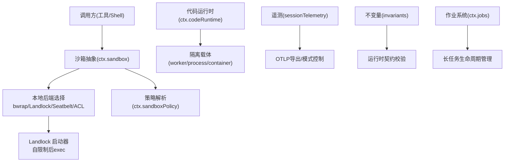
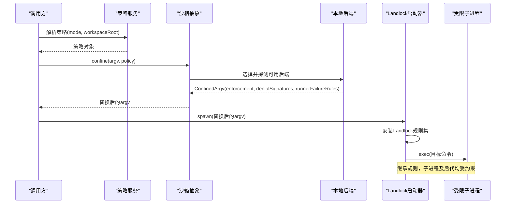
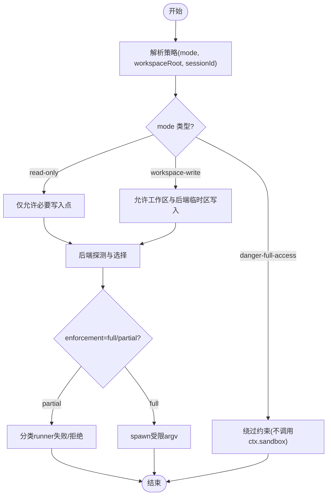
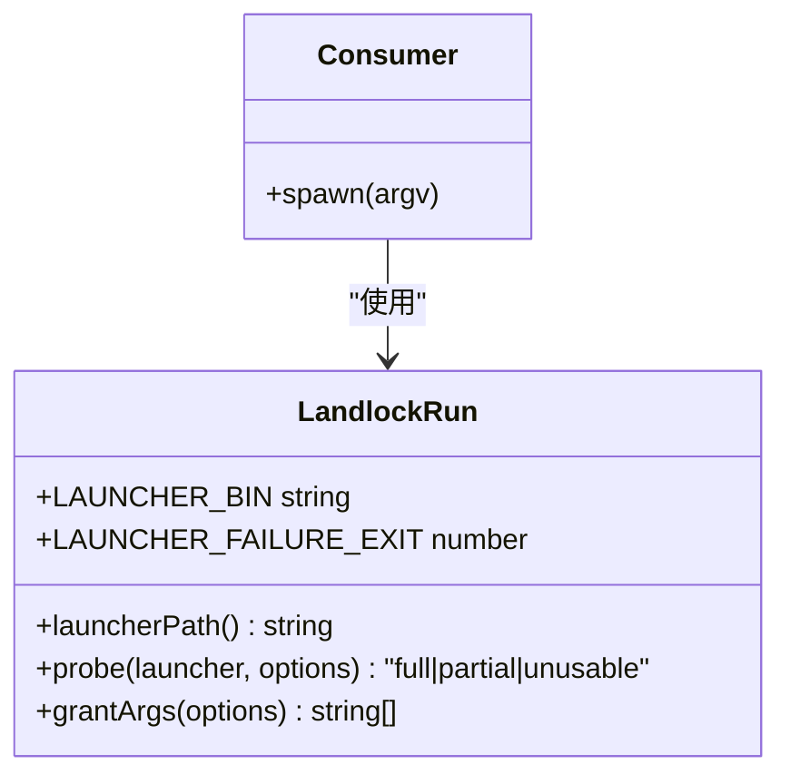
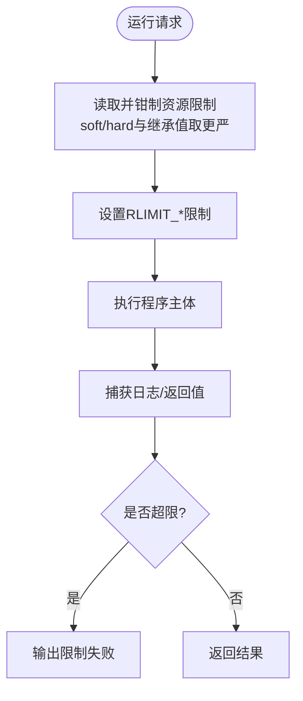
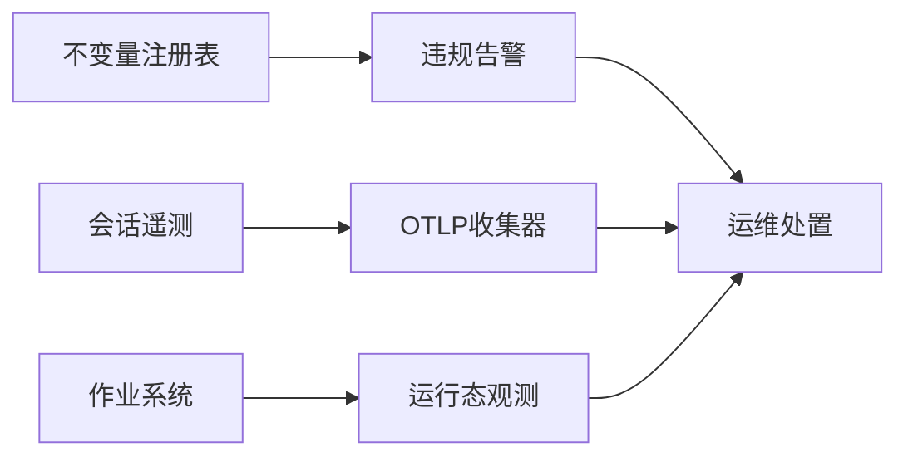
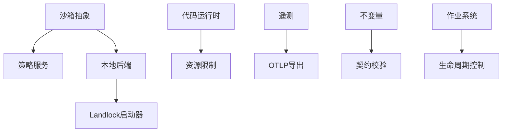

# 沙箱隔离与安全执行

<cite>
**本文引用的文件**
- [packages/sandbox/sandbox/src/index.ts](file://packages/sandbox/sandbox/src/index.ts)
- [docs/subsystems/sandbox.md](file://docs/subsystems/sandbox.md)
- [native/landlock-run/README.md](file://native/landlock-run/README.md)
- [native/landlock-run/docs/architecture.md](file://native/landlock-run/docs/architecture.md)
- [packages/shell/bash-sandbox/tests/landlock.e2e.ts](file://packages/shell/bash-sandbox/tests/landlock.e2e.ts)
- [packages/experimental/code-runtime-python/py/bootstrap.py](file://packages/experimental/code-runtime-python/py/bootstrap.py)
- [packages/experimental/code-runtime-python/tests/runtime.spec.ts](file://packages/experimental/code-runtime-python/tests/runtime.spec.ts)
- [docs/subsystems/code-runtime.md](file://docs/subsystems/code-runtime.md)
- [packages/session/session-telemetry-otel/src/index.ts](file://packages/session/session-telemetry-otel/src/index.ts)
- [packages/session/session-telemetry/src/index.ts](file://packages/session/session-telemetry/src/index.ts)
- [packages/runtime-diagnostics/invariants/src/index.ts](file://packages/runtime-diagnostics/invariants/src/index.ts)
- [docs/subsystems/jobs.md](file://docs/subsystems/jobs.md)
</cite>

## 目录
1. [简介](#简介)
2. [项目结构](#项目结构)
3. [核心组件](#核心组件)
4. [架构总览](#架构总览)
5. [详细组件分析](#详细组件分析)
6. [依赖关系分析](#依赖关系分析)
7. [性能与资源限制](#性能与资源限制)
8. [故障排查指南](#故障排查指南)
9. [结论](#结论)
10. [附录](#附录)

## 简介
本技术文档围绕“沙箱隔离与安全执行”展开，聚焦进程隔离、文件系统限制、网络访问控制、Landlock 安全模块配置与使用、容器化沙箱构建与管理策略、代码执行环境的安全配置与资源限制（内存、CPU、磁盘配额）、恶意代码检测与异常行为监控、以及沙箱逃逸防护与应急响应流程。内容基于仓库中的沙箱抽象、本地后端实现、Landlock 自限制启动器、代码运行时、遥测与不变量诊断、作业调度等子系统源码与文档进行系统化梳理。

## 项目结构
- 沙箱能力抽象：定义统一的进程级沙箱服务接口与策略模型，屏蔽平台差异，供上层工具调用。
- 本地沙箱后端：提供 Linux bwrap/Landlock、macOS Seatbelt、Windows ACL 受限令牌等后端选择与探测。
- Landlock 启动器：以 C 实现的自限制后执行的可执行体，配合 npm 包分发，负责在子进程中启用 Landlock 规则集并 exec 目标命令。
- 代码运行时：提供跨语言程序执行能力，支持 worker-thread/process/container 等多种隔离载体，并通过绑定机制暴露宿主函数。
- 遥测与诊断：会话遥测与不变量注册表用于运行期监控、告警与合规检查。
- 作业系统：统一后台任务生命周期管理，承载长时间运行的受控工作负载。

图表来源
- [packages/sandbox/sandbox/src/index.ts:158-176](file://packages/sandbox/sandbox/src/index.ts#L158-L176)
- [native/landlock-run/docs/architecture.md:16-24](file://native/landlock-run/docs/architecture.md#L16-L24)
- [docs/subsystems/code-runtime.md:163-195](file://docs/subsystems/code-runtime.md#L163-L195)
- [packages/session/session-telemetry-otel/src/index.ts:113-139](file://packages/session/session-telemetry-otel/src/index.ts#L113-L139)
- [packages/runtime-diagnostics/invariants/src/index.ts:94-126](file://packages/runtime-diagnostics/invariants/src/index.ts#L94-L126)
- [docs/subsystems/jobs.md:155-157](file://docs/subsystems/jobs.md#L155-L157)

章节来源
- [docs/subsystems/sandbox.md:1-221](file://docs/subsystems/sandbox.md#L1-L221)
- [native/landlock-run/README.md:1-61](file://native/landlock-run/README.md#L1-L61)

## 核心组件
- 沙箱抽象与服务
  - 提供 confine(argv, policy) 将原始 argv 包装为受约束的执行参数，返回执行完整性级别与拒绝特征，禁止静默放行。
  - 策略服务 resolve() 按会话与部署默认值解析每调用一次的文件影响策略与工作区根路径。
- 本地后端与 Landlock 启动器
  - 通过 probe() 功能探测内核是否可强制执行；失败时关闭（fail-closed），不降级为无约束执行。
  - grantArgs() 构造只读/读写白名单，未授予的访问一律拒绝。
- 代码运行时
  - run(request) 执行一段程序，捕获日志与返回值，失败以结果字段报告而非抛出异常；隔离载体仅作为标签，非安全声明。
- 遥测与不变量
  - 会话遥测后端披露共享策略（full/feedback-only/disabled），支持 OTLP 导出。
  - 不变量注册表允许各包注册运行时契约检查，违规即抛错。
- 作业系统
  - 统一管理后台任务的启动、观察、取消与完成，具备所有权与并发控制语义。

章节来源
- [packages/sandbox/sandbox/src/index.ts:23-176](file://packages/sandbox/sandbox/src/index.ts#L23-L176)
- [native/landlock-run/README.md:25-44](file://native/landlock-run/README.md#L25-L44)
- [docs/subsystems/code-runtime.md:9-195](file://docs/subsystems/code-runtime.md#L9-L195)
- [packages/session/session-telemetry-otel/src/index.ts:113-139](file://packages/session/session-telemetry-otel/src/index.ts#L113-L139)
- [packages/runtime-diagnostics/invariants/src/index.ts:94-197](file://packages/runtime-diagnostics/invariants/src/index.ts#L94-L197)
- [docs/subsystems/jobs.md:24-157](file://docs/subsystems/jobs.md#L24-L157)

## 架构总览
下图展示从调用方到具体执行后端的完整链路，包括策略解析、后端选择、Landlock 自限制与 exec、以及运行时的资源与监控。

图表来源
- [packages/sandbox/sandbox/src/index.ts:158-176](file://packages/sandbox/sandbox/src/index.ts#L158-L176)
- [native/landlock-run/docs/architecture.md:16-24](file://native/landlock-run/docs/architecture.md#L16-L24)

## 详细组件分析

### 沙箱抽象与策略
- 模式与强制粒度
  - read-only：仅允许必要写入点（如 /dev/null）；workspace-write：允许在工作区与后端临时区域写入；danger-full-access：绕过约束（不经过 ctx.sandbox）。
  - enforcement 报告 full/partial，partial 表示当前后端或内核 ABI 无法覆盖全部承诺，需由消费者决定是否接受。
- 策略解析
  - 每次能力调用独立解析策略，携带 sessionId 以便后端区分会话状态；workspaceRoot 经规范化后再参与权限判定。
- 失败分类
  - runnerFailureRules 用于识别“启动器失败”与“被沙箱拒绝”两类不同错误，避免误判。

图表来源
- [docs/subsystems/sandbox.md:9-94](file://docs/subsystems/sandbox.md#L9-L94)
- [packages/sandbox/sandbox/src/index.ts:23-116](file://packages/sandbox/sandbox/src/index.ts#L23-L116)

章节来源
- [docs/subsystems/sandbox.md:9-158](file://docs/subsystems/sandbox.md#L9-L158)
- [packages/sandbox/sandbox/src/index.ts:23-176](file://packages/sandbox/sandbox/src/index.ts#L23-L176)

### Landlock 安全模块：配置与使用
- 角色定位
  - 该组件仅提供“机制”，不提供“策略”。策略由上层决定哪些路径可读/写。
- 可用性探测
  - 通过 probe() 实际构建并强制执行一个最大规则集，判断内核是否支持；不可用时返回 unusable。
- 白名单授权
  - grantArgs({ readOnly, readWrite }) 生成 CLI 参数，未授予的访问一律拒绝。
- 失败关闭
  - 任何启动器层面的失败（用法错误、内核不支持、根目录不可打开、exec 失败）均以退出码 125 终止，不执行目标命令。
- 包与二进制
  - 入口包 + 平台可选包，npm 根据 os/cpu 选择对应预编译二进制；不存在交叉工具链，确保构建可审计。

图表来源
- [native/landlock-run/README.md:25-44](file://native/landlock-run/README.md#L25-L44)
- [native/landlock-run/docs/architecture.md:16-24](file://native/landlock-run/docs/architecture.md#L16-L24)

章节来源
- [native/landlock-run/README.md:1-61](file://native/landlock-run/README.md#L1-L61)
- [native/landlock-run/docs/architecture.md:1-35](file://native/landlock-run/docs/architecture.md#L1-L35)

### 代码执行环境：隔离与资源限制
- 隔离载体
  - 运行时支持 worker-thread、process、container 等载体；isolation 仅为诊断标签，不是安全保证。
- 资源限制
  - Python 后端对资源限制采用“取配置与继承两者中更严格者”的策略，分别对 soft/hard 两侧钳制，确保不会放宽限制。
  - 测试覆盖了继承软限制更严格的情况，验证最终生效的限制符合预期。
- 输出与失败
  - 日志与返回值有容量上限；失败以结果字段报告，包含 exception/timeout/abort/worker-exit/invalid-output/output-limit 等正交类别。

图表来源
- [packages/experimental/code-runtime-python/py/bootstrap.py:920-939](file://packages/experimental/code-runtime-python/py/bootstrap.py#L920-L939)
- [packages/experimental/code-runtime-python/tests/runtime.spec.ts:856-877](file://packages/experimental/code-runtime-python/tests/runtime.spec.ts#L856-L877)
- [docs/subsystems/code-runtime.md:136-195](file://docs/subsystems/code-runtime.md#L136-L195)

章节来源
- [docs/subsystems/code-runtime.md:9-195](file://docs/subsystems/code-runtime.md#L9-L195)
- [packages/experimental/code-runtime-python/py/bootstrap.py:920-939](file://packages/experimental/code-runtime-python/py/bootstrap.py#L920-L939)
- [packages/experimental/code-runtime-python/tests/runtime.spec.ts:856-877](file://packages/experimental/code-runtime-python/tests/runtime.spec.ts#L856-L877)

### 网络访问控制
- 沙箱模式仅描述“文件影响”，不包含网络与进程可见性控制；网络访问控制需由后端或外部编排（容器/微VM/远程执行）补充。
- 当需要更强隔离时，可在上层组合容器化方案，使网络栈与进程空间完全隔离。

章节来源
- [docs/subsystems/sandbox.md:9-23](file://docs/subsystems/sandbox.md#L9-L23)

### 容器化沙箱环境的构建与管理策略
- 容器/微VM/远程执行属于“整体能力缝”的兄弟实现，不在 ctx.sandbox 范围内，但可与沙箱策略协同：策略层决定文件访问边界，容器层提供进程/网络/内核调用等更深隔离。
- 建议策略
  - 默认最小权限：仅挂载工作区与必要只读资源。
  - 网络出口白名单：仅允许必要的域名/端口。
  - 镜像加固：精简基础镜像、禁用不必要工具、固定版本。
  - 运行时扫描：镜像与运行时漏洞扫描、SBOM 生成。
  - 资源配额：CPU/内存/磁盘限额与 cgroup 限制。
  - 审计与遥测：容器指标、事件与日志集中采集。

[本节为概念性指导，不直接分析具体文件]

### 恶意代码检测与异常行为监控
- 不变量注册表：各包可注册运行时契约检查，违规即抛错，便于早期发现异常行为。
- 会话遥测：支持全量/仅反馈/禁用三种模式，结合 OTLP 导出至收集器，便于集中分析与告警。
- 作业系统：对长任务进行生命周期管理与观测，便于追踪异常与资源占用。

图表来源
- [packages/runtime-diagnostics/invariants/src/index.ts:94-197](file://packages/runtime-diagnostics/invariants/src/index.ts#L94-L197)
- [packages/session/session-telemetry-otel/src/index.ts:113-139](file://packages/session/session-telemetry-otel/src/index.ts#L113-L139)
- [docs/subsystems/jobs.md:155-157](file://docs/subsystems/jobs.md#L155-L157)

章节来源
- [packages/runtime-diagnostics/invariants/src/index.ts:94-197](file://packages/runtime-diagnostics/invariants/src/index.ts#L94-L197)
- [packages/session/session-telemetry-otel/src/index.ts:113-139](file://packages/session/session-telemetry-otel/src/index.ts#L113-L139)
- [docs/subsystems/jobs.md:155-157](file://docs/subsystems/jobs.md#L155-L157)

### 沙箱逃逸防护与应急响应
- 防护要点
  - 始终 fail-closed：后端不可用时拒绝执行，绝不静默降级。
  - 严格白名单：仅授予必要路径与设备；未授予即拒绝。
  - 分离策略与机制：策略由上层决定，机制由底层执行，避免耦合。
  - 多后端冗余：Linux 优先 Landlock，回退 bwrap/Seatbelt/ACL，但均需满足最小权限。
  - 资源限制：CPU/内存/磁盘配额与超时，防止滥用。
  - 监控与审计：遥测与不变量检查，及时发现问题。
- 应急响应流程
  - 检测：遥测/不变量/作业状态触发告警。
  - 隔离：立即终止可疑任务，冻结相关会话与工作区。
  - 取证：收集日志、快照、遥测数据与容器镜像信息。
  - 修复：升级内核/补丁、收紧策略、更新镜像。
  - 复盘：更新策略与检测规则，完善回归测试。

[本节为通用实践指导，不直接分析具体文件]

## 依赖关系分析
- 沙箱抽象依赖策略服务与本地后端；本地后端依赖 Landlock 启动器或其他平台后端。
- 代码运行时与资源限制逻辑相互协作，确保执行环境稳定可控。
- 遥测与不变量为上层提供运行期可见性与契约保障。
- 作业系统为长任务提供统一生命周期管理。

图表来源
- [packages/sandbox/sandbox/src/index.ts:158-176](file://packages/sandbox/sandbox/src/index.ts#L158-L176)
- [native/landlock-run/docs/architecture.md:16-24](file://native/landlock-run/docs/architecture.md#L16-L24)
- [docs/subsystems/code-runtime.md:163-195](file://docs/subsystems/code-runtime.md#L163-L195)
- [packages/session/session-telemetry-otel/src/index.ts:113-139](file://packages/session/session-telemetry-otel/src/index.ts#L113-L139)
- [packages/runtime-diagnostics/invariants/src/index.ts:94-197](file://packages/runtime-diagnostics/invariants/src/index.ts#L94-L197)
- [docs/subsystems/jobs.md:155-157](file://docs/subsystems/jobs.md#L155-L157)

章节来源
- [packages/sandbox/sandbox/src/index.ts:158-176](file://packages/sandbox/sandbox/src/index.ts#L158-L176)
- [native/landlock-run/docs/architecture.md:16-24](file://native/landlock-run/docs/architecture.md#L16-L24)
- [docs/subsystems/code-runtime.md:163-195](file://docs/subsystems/code-runtime.md#L163-L195)
- [packages/session/session-telemetry-otel/src/index.ts:113-139](file://packages/session/session-telemetry-otel/src/index.ts#L113-L139)
- [packages/runtime-diagnostics/invariants/src/index.ts:94-197](file://packages/runtime-diagnostics/invariants/src/index.ts#L94-L197)
- [docs/subsystems/jobs.md:155-157](file://docs/subsystems/jobs.md#L155-L157)

## 性能与资源限制
- CPU 时间片
  - 通过资源限制钳制 CPU 使用，确保最严格的软/硬限制生效，避免放宽。
- 内存隔离
  - 使用进程/worker/容器隔离，结合地址空间限制，防止越界与溢出。
- 磁盘配额
  - 仅授予工作区与必要临时目录写入权限，配合后端临时区策略，限制磁盘增长。
- 超时与中断
  - 代码运行时支持 abort 信号与超时，作业系统支持 kill，确保任务可控终止。

章节来源
- [packages/experimental/code-runtime-python/py/bootstrap.py:920-939](file://packages/experimental/code-runtime-python/py/bootstrap.py#L920-L939)
- [docs/subsystems/code-runtime.md:136-195](file://docs/subsystems/code-runtime.md#L136-L195)
- [docs/subsystems/jobs.md:155-157](file://docs/subsystems/jobs.md#L155-L157)

## 故障排查指南
- 沙箱不可用
  - 现象：confine 抛出不可用错误，提示无可用后端。
  - 处理：安装 bubblewrap 或启用 Landlock 内核；确认平台包已正确安装；必要时调整消费端策略。
- 部分强制
  - 现象：enforcement 为 partial，表明旧 ABI 或后端仅能部分约束。
  - 处理：升级内核/后端；或在消费者侧拒绝该执行。
- 启动器失败
  - 现象：退出码 125 且存在致命诊断行。
  - 处理：检查用法、根目录权限、内核支持；查看 runnerFailureRules 匹配结果。
- 资源限制冲突
  - 现象：应用内限制与继承限制不一致导致意外行为。
  - 处理：确认软/硬限制钳制逻辑，确保继承限制不被放宽。
- 遥测与不变量
  - 现象：遥测未上报或不变量报错。
  - 处理：检查遥测模式与导出配置；查看不变量注册与过滤规则。

章节来源
- [packages/sandbox/sandbox/src/index.ts:118-144](file://packages/sandbox/sandbox/src/index.ts#L118-L144)
- [native/landlock-run/README.md:25-44](file://native/landlock-run/README.md#L25-L44)
- [packages/experimental/code-runtime-python/tests/runtime.spec.ts:3185-3204](file://packages/experimental/code-runtime-python/tests/runtime.spec.ts#L3185-L3204)
- [packages/session/session-telemetry-otel/src/index.ts:113-139](file://packages/session/session-telemetry-otel/src/index.ts#L113-L139)
- [packages/runtime-diagnostics/invariants/src/index.ts:94-197](file://packages/runtime-diagnostics/invariants/src/index.ts#L94-L197)

## 结论
本项目通过“策略与机制解耦”的设计，实现了跨平台的进程级沙箱隔离与安全的代码执行环境。Landlock 启动器提供强约束的文件系统访问控制，配合策略服务与本地后端选择，确保在不同主机上均可达到最小权限原则。代码运行时与资源限制共同保障执行稳定性，遥测与不变量为运行期监控与合规提供支撑。对于更高强度的隔离需求，可结合容器化方案形成纵深防御。建议在部署中持续强化策略、监控与审计，建立完善的逃逸防护与应急响应流程。

## 附录
- 关键术语
  - 策略模式：read-only、workspace-write、danger-full-access
  - 强制粒度：full、partial
  - 失败分类：runner failure vs sandbox denial
  - 隔离载体：worker-thread、process、container
  - 遥测模式：full、feedback-only、disabled

[本节为概念性说明，不直接分析具体文件]