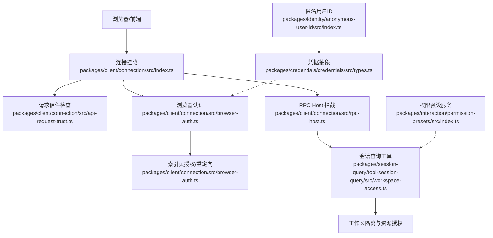
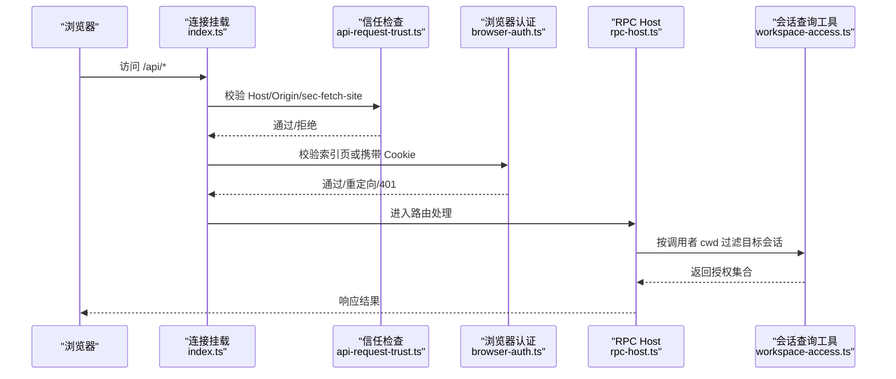
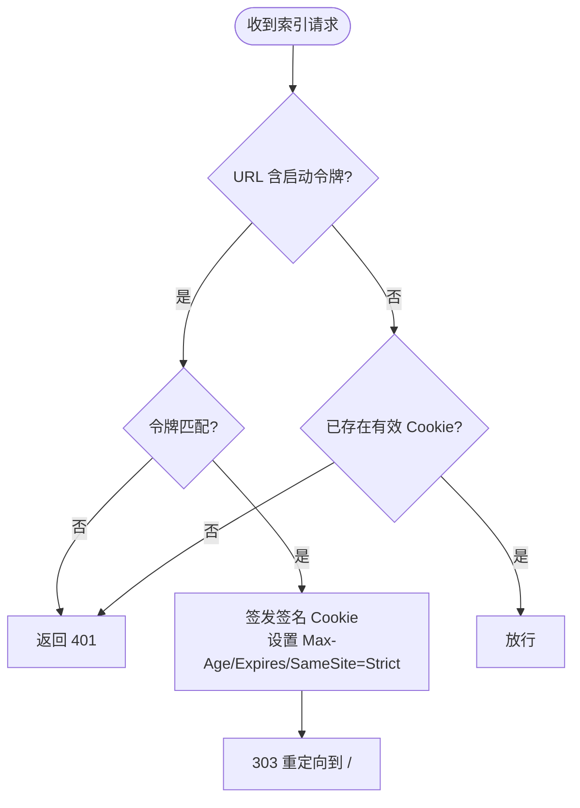
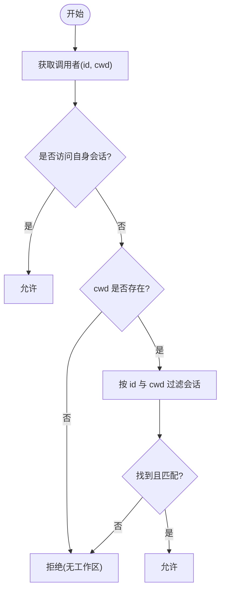
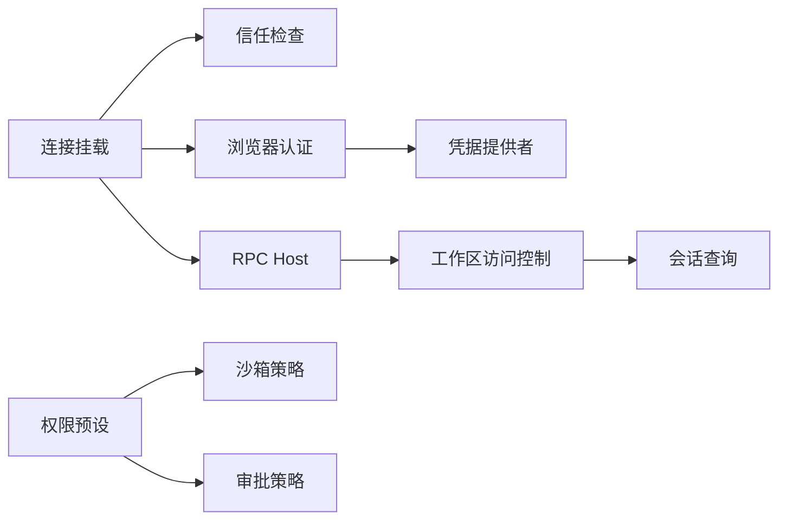

# 身份认证与授权

<cite>
**本文引用的文件**
- [browser-auth.ts](file://packages/client/connection/src/browser-auth.ts)
- [rpc-host.ts](file://packages/client/connection/src/rpc-host.ts)
- [index.ts（连接挂载）](file://packages/client/connection/src/index.ts)
- [api-request-trust.ts](file://packages/client/connection/src/api-request-trust.ts)
- [workspace-access.ts](file://packages/session-query/tool-session-query/src/workspace-access.ts)
- [types.ts（凭据类型）](file://packages/credentials/credentials/src/types.ts)
- [index.ts（匿名用户ID）](file://packages/identity/anonymous-user-id/src/index.ts)
- [index.ts（权限预设服务）](file://packages/interaction/permission-presets/src/index.ts)
</cite>

## 目录
1. [简介](#简介)
2. [项目结构](#项目结构)
3. [核心组件](#核心组件)
4. [架构总览](#架构总览)
5. [详细组件分析](#详细组件分析)
6. [依赖关系分析](#依赖关系分析)
7. [性能与安全考量](#性能与安全考量)
8. [故障排查指南](#故障排查指南)
9. [结论](#结论)
10. [附录：实现要点与最佳实践](#附录：实现要点与最佳实践)

## 简介
本文件围绕该代码库中的身份认证与授权机制，系统阐述浏览器会话认证、请求信任边界、工作区隔离的访问控制、以及权限预设（沙箱模式与审批策略）的组合式授权。文档同时给出多租户隔离思路、常见安全漏洞防护建议，并提供可追溯的代码片段路径以便深入阅读实现细节。

## 项目结构
与认证与授权直接相关的模块分布在以下位置：
- 客户端连接层：负责浏览器信任检查、令牌交换与会话 Cookie 管理
- 会话查询工具：基于工作区上下文进行细粒度资源访问校验
- 凭据抽象：统一的凭证记录模型与事件
- 匿名标识：用于遥测与反馈的匿名用户标识
- 权限预设：将“沙箱模式 + 审批策略”打包为用户可见的权限预设，并驱动执行侧策略

图表来源
- [index.ts（连接挂载）:93-121](file://packages/client/connection/src/index.ts#L93-L121)
- [api-request-trust.ts:105-118](file://packages/client/connection/src/api-request-trust.ts#L105-L118)
- [browser-auth.ts:180-314](file://packages/client/connection/src/browser-auth.ts#L180-L314)
- [rpc-host.ts:88-110](file://packages/client/connection/src/rpc-host.ts#L88-L110)
- [workspace-access.ts:1-258](file://packages/session-query/tool-session-query/src/workspace-access.ts#L1-L258)
- [types.ts（凭据类型）:31-105](file://packages/credentials/credentials/src/types.ts#L31-L105)
- [index.ts（匿名用户ID）:1-101](file://packages/identity/anonymous-user-id/src/index.ts#L1-L101)
- [index.ts（权限预设服务）:1-433](file://packages/interaction/permission-presets/src/index.ts#L1-L433)

章节来源
- [index.ts（连接挂载）:93-121](file://packages/client/connection/src/index.ts#L93-L121)
- [api-request-trust.ts:105-118](file://packages/client/connection/src/api-request-trust.ts#L105-L118)
- [browser-auth.ts:180-314](file://packages/client/connection/src/browser-auth.ts#L180-L314)
- [rpc-host.ts:88-110](file://packages/client/connection/src/rpc-host.ts#L88-L110)
- [workspace-access.ts:1-258](file://packages/session-query/tool-session-query/src/workspace-access.ts#L1-L258)
- [types.ts（凭据类型）:31-105](file://packages/credentials/credentials/src/types.ts#L31-L105)
- [index.ts（匿名用户ID）:1-101](file://packages/identity/anonymous-user-id/src/index.ts#L1-L101)
- [index.ts（权限预设服务）:1-433](file://packages/interaction/permission-presets/src/index.ts#L1-L433)

## 核心组件
- 浏览器会话认证（BrowserAuth）
  - 通过进程启动令牌与持久化签名 Cookie 完成浏览器到后端的无状态认证
  - 使用 HMAC-SHA256 对 Cookie 载荷签名，严格校验有效期与作用域（Authority）
  - 提供索引页授权流程：带 token 的重定向写入 Cookie，后续请求仅校验 Cookie
- 请求信任边界（API Trust）
  - 强制媒体类型栅栏与权威栅栏：Host/Origin/sec-fetch-site 校验，拒绝跨站简单请求与重绑定攻击
- RPC Host 拦截器
  - 在 API 前缀上统一执行信任检查与浏览器认证，未通过返回 401/403
- 工作区访问控制（Workspace Access）
  - 以调用者会话头部的 cwd（工作区）为隔离维度，限制对目标会话的读取与观察
  - 通过过滤查询与二次校验确保只能访问同工作区内的会话
- 凭据抽象（Credentials Types）
  - 定义 ApiKeyRecord 与 GrantRecord 两种记录，支持插件自有授权产物（Grant）的持久化
- 匿名用户标识（Anonymous User ID）
  - 生成并持久化每 harness-home 的随机 UUID，用于遥测与反馈，不关联主机或网络地址
- 权限预设（Permission Presets）
  - 将“沙箱模式 + 审批策略”组合为用户可见的预设，并在会话创建时固化默认值
  - 提供命令与投影，允许运行时切换并持久化选择意图

章节来源
- [browser-auth.ts:180-314](file://packages/client/connection/src/browser-auth.ts#L180-L314)
- [api-request-trust.ts:105-118](file://packages/client/connection/src/api-request-trust.ts#L105-L118)
- [rpc-host.ts:88-110](file://packages/client/connection/src/rpc-host.ts#L88-L110)
- [workspace-access.ts:1-258](file://packages/session-query/tool-session-query/src/workspace-access.ts#L1-L258)
- [types.ts（凭据类型）:31-105](file://packages/credentials/credentials/src/types.ts#L31-L105)
- [index.ts（匿名用户ID）:1-101](file://packages/identity/anonymous-user-id/src/index.ts#L1-L101)
- [index.ts（权限预设服务）:1-433](file://packages/interaction/permission-presets/src/index.ts#L1-L433)

## 架构总览
下图展示从浏览器发起请求到服务端鉴权、再到工作区访问控制的完整链路。

图表来源
- [index.ts（连接挂载）:93-121](file://packages/client/connection/src/index.ts#L93-L121)
- [api-request-trust.ts:105-118](file://packages/client/connection/src/api-request-trust.ts#L105-L118)
- [browser-auth.ts:240-302](file://packages/client/connection/src/browser-auth.ts#L240-L302)
- [rpc-host.ts:96-110](file://packages/client/connection/src/rpc-host.ts#L96-L110)
- [workspace-access.ts:75-135](file://packages/session-query/tool-session-query/src/workspace-access.ts#L75-L135)

## 详细组件分析

### 浏览器会话认证（BrowserAuth）
- 启动令牌与 Cookie 双阶段认证
  - 首次访问根路径时，若 URL 包含进程启动令牌，则签发带签名的 Cookie 并重定向至干净路径
  - 后续请求通过校验 Cookie 的 Authority、有效期与签名完成认证
- 安全特性
  - Cookie 名称基于 Authority 哈希，避免跨站点冲突
  - 载荷版本化，HMAC 签名防篡改；时间戳严格校验，防止过期与回绕
  - 最大存活期受配置约束，越界即失败

图表来源
- [browser-auth.ts:240-302](file://packages/client/connection/src/browser-auth.ts#L240-L302)

章节来源
- [browser-auth.ts:180-314](file://packages/client/connection/src/browser-auth.ts#L180-L314)

### 请求信任边界（API Trust）
- 媒体类型栅栏：POST 必须声明 application/json，否则 415
- 权威栅栏：Host 必须为回环或白名单；Origin 必须与 Host 一致；sec-fetch-site=cross-site 一律拒绝
- 防御重绑定与跨站简单请求

章节来源
- [api-request-trust.ts:105-118](file://packages/client/connection/src/api-request-trust.ts#L105-L118)

### RPC Host 拦截器
- 统一入口拦截：先执行信任检查，再执行浏览器认证
- 未通过返回 401/403，阻止后续路由处理

章节来源
- [rpc-host.ts:88-110](file://packages/client/connection/src/rpc-host.ts#L88-L110)

### 工作区访问控制（Workspace Access）
- 调用者身份与工作区隔离
  - 从 Agent Session 头部提取 id 与 cwd，作为调用者与隔离边界
- 目标授权
  - 非自身目标需满足：目标会话存在于相同 cwd，且通过过滤查询确认
- 批量授权
  - 去重后仅查询非自身目标，结合 cwd 过滤，得到授权集合
- 标题读取与血缘投影
  - 读取标题快照时对每个目标再次校验，未授权项返回不可用编码

图表来源
- [workspace-access.ts:56-135](file://packages/session-query/tool-session-query/src/workspace-access.ts#L56-L135)

章节来源
- [workspace-access.ts:1-258](file://packages/session-query/tool-session-query/src/workspace-access.ts#L1-L258)

### 凭据抽象（Credentials Types）
- 两类记录：
  - ApiKeyRecord：API Key 与环境变量
  - GrantRecord：插件自有授权产物（opaque payload），由拥有者解析
- 事件：记录更新与引用更新，便于监听与刷新

章节来源
- [types.ts（凭据类型）:31-105](file://packages/credentials/credentials/src/types.ts#L31-L105)

### 匿名用户标识（Anonymous User ID）
- 生成并持久化 per-harness-home 的随机 UUID
- 并发安全：独占创建，失败回退；进程内缓存，避免重复 IO

章节来源
- [index.ts（匿名用户ID）:1-101](file://packages/identity/anonymous-user-id/src/index.ts#L1-L101)

### 权限预设（Permission Presets）
- 预设 = 沙箱模式 + 审批策略，支持自定义与默认预设
- 会话创建时固化初始权限，运行时可通过命令切换并持久化选择
- 提供投影视图，供 UI 渲染当前选项与说明

章节来源
- [index.ts（权限预设服务）:1-433](file://packages/interaction/permission-presets/src/index.ts#L1-L433)

## 依赖关系分析
- 连接挂载依赖信任检查与浏览器认证，形成统一入口
- 浏览器认证依赖凭据提供者以存储/加载签名密钥
- 工作区访问控制依赖会话查询能力与服务边界封装
- 权限预设依赖沙箱与审批策略的实现，并通过事件驱动变更

图表来源
- [index.ts（连接挂载）:93-121](file://packages/client/connection/src/index.ts#L93-L121)
- [browser-auth.ts:161-178](file://packages/client/connection/src/browser-auth.ts#L161-L178)
- [workspace-access.ts:75-135](file://packages/session-query/tool-session-query/src/workspace-access.ts#L75-L135)
- [index.ts（权限预设服务）:183-244](file://packages/interaction/permission-presets/src/index.ts#L183-L244)

章节来源
- [index.ts（连接挂载）:93-121](file://packages/client/connection/src/index.ts#L93-L121)
- [browser-auth.ts:161-178](file://packages/client/connection/src/browser-auth.ts#L161-L178)
- [workspace-access.ts:75-135](file://packages/session-query/tool-session-query/src/workspace-access.ts#L75-L135)
- [index.ts（权限预设服务）:183-244](file://packages/interaction/permission-presets/src/index.ts#L183-L244)

## 性能与安全考量
- 性能
  - 浏览器认证采用无状态 Cookie 校验，避免每次请求查库
  - 工作区访问控制通过一次过滤查询聚合多个目标，减少往返
  - 匿名用户 ID 进程内缓存，降低磁盘 IO
- 安全
  - 请求级信任边界防御重绑定与跨站请求
  - Cookie 作用域绑定 Authority，HMAC 签名防篡改，严格有效期
  - 工作区隔离确保跨会话访问最小化
  - 凭据与授权产物分离，插件自治，降低耦合风险

[本节为通用指导，无需特定文件来源]

## 故障排查指南
- 401 未认证
  - 检查索引页是否携带启动令牌并完成重定向
  - 确认 Cookie 是否被浏览器策略拦截（SameSite/HttpOnly）
  - 核对 Authority 与 Host 是否一致
- 403 禁止访问
  - 检查 Host/Origin/sec-fetch-site 是否符合信任白名单
- 工作区访问失败
  - 确认调用者会话 header 中 cwd 是否正确设置
  - 验证目标会话是否属于同一 cwd
- 权限预设无效
  - 确认预设名称与沙箱/审批策略组合是否匹配
  - 检查会话创建时是否已固化默认预设

章节来源
- [browser-auth.ts:240-314](file://packages/client/connection/src/browser-auth.ts#L240-L314)
- [api-request-trust.ts:105-118](file://packages/client/connection/src/api-request-trust.ts#L105-L118)
- [workspace-access.ts:75-135](file://packages/session-query/tool-session-query/src/workspace-access.ts#L75-L135)
- [index.ts（权限预设服务）:379-429](file://packages/interaction/permission-presets/src/index.ts#L379-L429)

## 结论
该代码库通过“请求信任边界 + 浏览器会话认证 + 工作区访问控制 + 权限预设”的分层设计，实现了端到端的认证与授权闭环。其特点是无状态 Cookie 认证、严格的跨站防护、基于工作区的细粒度隔离，以及可配置的权限策略组合。对于多租户场景，可将工作区视为租户隔离单元；对于更复杂的 RBAC/ABAC 需求，可在权限预设之上叠加角色与属性规则，并以事件驱动的方式应用到执行侧。

[本节为总结性内容，无需特定文件来源]

## 附录：实现要点与最佳实践
- JWT 令牌验证
  - 当前实现未使用 JWT；采用进程启动令牌 + 签名 Cookie 的无状态方案。如需引入 JWT，建议在网关层校验签名与过期时间，并将用户上下文注入到会话头中，再由工作区访问控制消费
- OAuth2 集成
  - 可借助凭据抽象中的 GrantRecord 持久化授权码/令牌，由插件自行解析；对外暴露的 API 仍应经过信任边界与浏览器认证
- 会话管理
  - 使用 BrowserAuth 维护会话生命周期；配合权限预设在新会话创建时固化策略
- RBAC/ABAC
  - RBAC：在权限预设基础上增加角色映射，决定默认沙箱/审批策略
  - ABAC：在工作区访问控制中扩展属性判断（如资源标签、环境等），结合 cwd 实现多维隔离
- 中间件与策略
  - 信任检查与浏览器认证可作为前置中间件；工作区访问控制作为资源级策略；权限预设为策略配置中心
- 多租户隔离
  - 以 cwd 作为租户边界；必要时在会话头中附加租户标识，并在所有读路径强制校验
- 安全防护
  - CSRF：通过 SameSite=Strict 与 Origin/Host 校验抵御
  - XSS：服务端输出转义、禁用不必要的全局脚本；前端遵循 CSP
  - 会话劫持：使用 HttpOnly、Short-lived Cookie、定期轮换签名密钥

[本节为通用指导，无需特定文件来源]