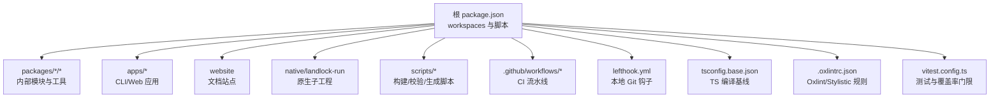
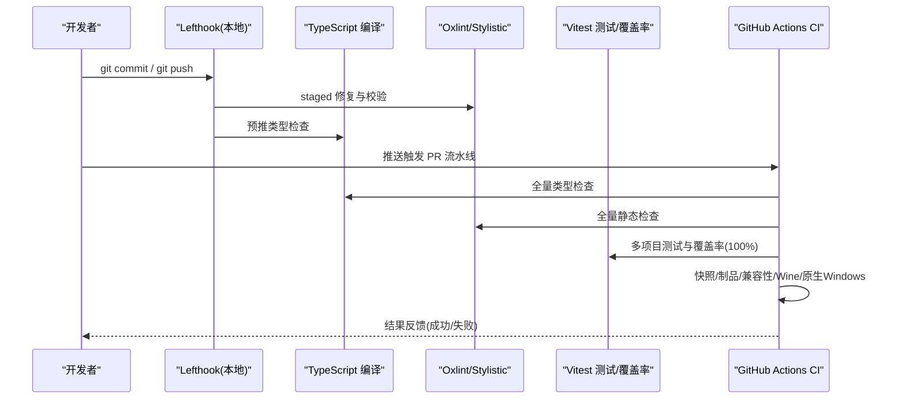
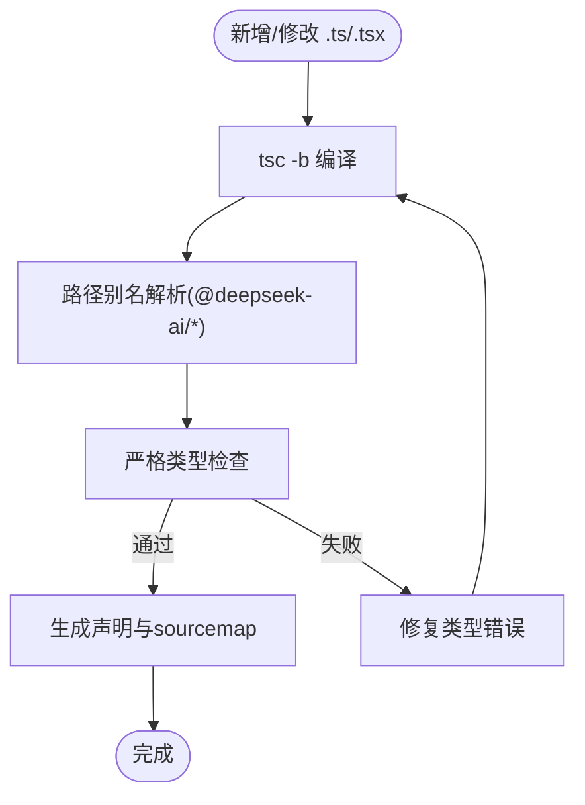
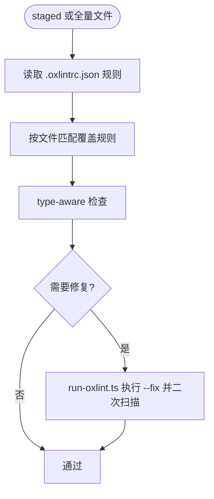
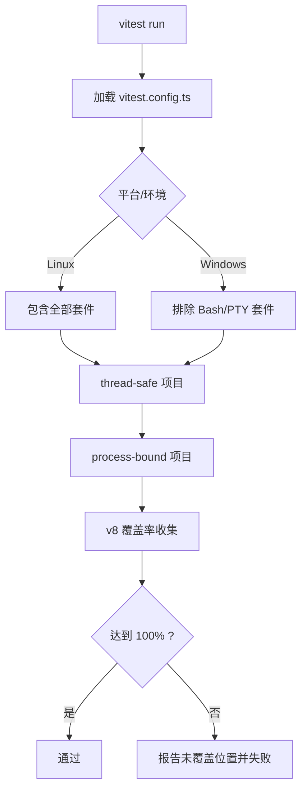
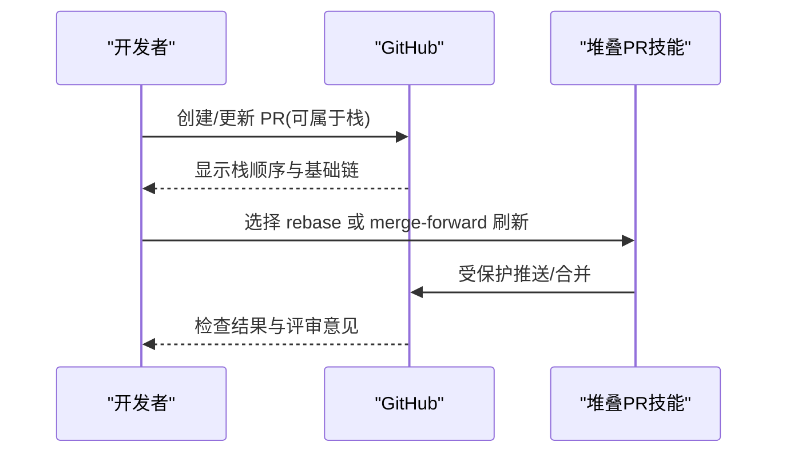
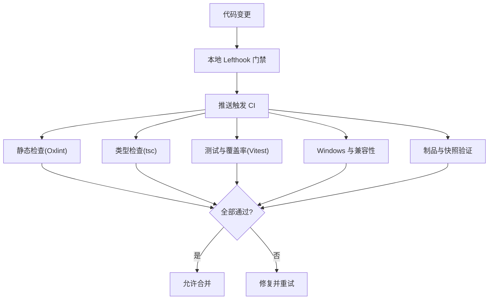
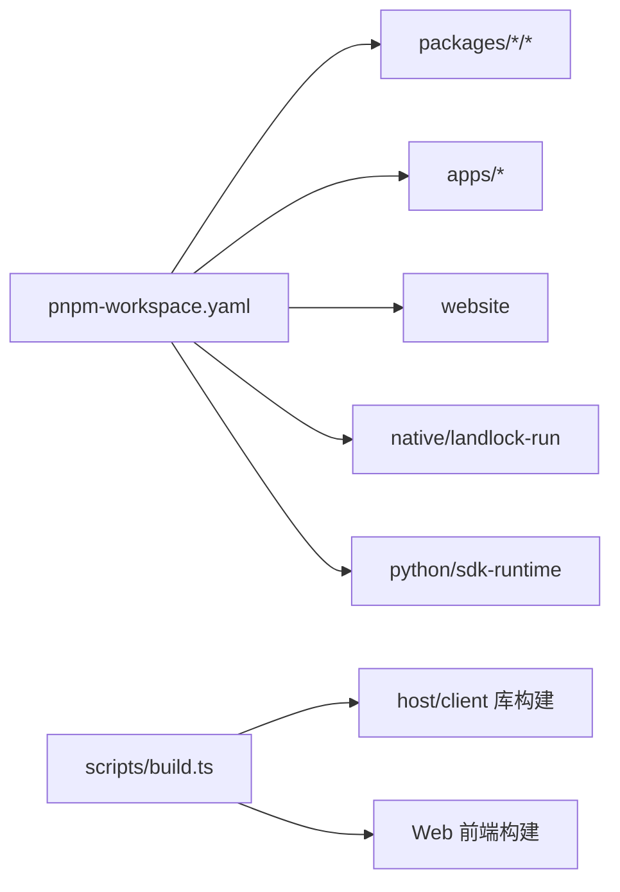

# 开发规范

<cite>
**本文引用的文件**
- [package.json](file://package.json)
- [tsconfig.base.json](file://tsconfig.base.json)
- [.oxlintrc.json](file://.oxlintrc.json)
- [lefthook.yml](file://lefthook.yml)
- [vitest.config.ts](file://vitest.config.ts)
- [pnpm-workspace.yaml](file://pnpm-workspace.yaml)
- [.editorconfig](file://.editorconfig)
- [CONTRIBUTING.md](file://CONTRIBUTING.md)
- [scripts/run-oxlint.ts](file://scripts/run-oxlint.ts)
- [scripts/build.ts](file://scripts/build.ts)
- [.github/workflows/ci.yml](file://.github/workflows/ci.yml)
- [.github/pull_request_template.md](file://.github/pull_request_template.md)
</cite>

## 目录
1. [简介](#简介)
2. [项目结构](#项目结构)
3. [核心组件](#核心组件)
4. [架构总览](#架构总览)
5. [详细组件分析](#详细组件分析)
6. [依赖分析](#依赖分析)
7. [性能考虑](#性能考虑)
8. [故障排查指南](#故障排查指南)
9. [结论](#结论)
10. [附录](#附录)

## 简介
本规范面向 DeepSeek Harness 团队，统一 TypeScript 编码风格、命名约定、文件组织方式，明确 Git 工作流与分支策略、代码审查流程与标准，并给出 ESLint/Oxlint、Prettier（通过 Stylistic 规则）、TypeScript 编译配置以及质量门禁与自动化流程。目标是让新成员快速上手、让团队协作一致、让质量门禁可预期且高效。

## 项目结构
仓库采用 pnpm monorepo：根 package.json 定义 workspaces，packages/*/* 为内部包，apps/* 为应用入口，website 为文档站点，native/landlock-run 为原生子工程。构建脚本集中在 scripts/，测试与覆盖率由 Vitest 统一管理，静态检查与格式化由 Oxlint + Stylistic 插件完成，Git 钩子由 Lefthook 管理。

图表来源
- [package.json:1-18](file://package.json#L1-L18)
- [pnpm-workspace.yaml:1-17](file://pnpm-workspace.yaml#L1-L17)
- [tsconfig.base.json:1-26](file://tsconfig.base.json#L1-L26)
- [.oxlintrc.json:1-31](file://.oxlintrc.json#L1-L31)
- [vitest.config.ts:150-191](file://vitest.config.ts#L150-L191)

章节来源
- [package.json:1-18](file://package.json#L1-L18)
- [pnpm-workspace.yaml:1-17](file://pnpm-workspace.yaml#L1-L17)

## 核心组件
- 类型系统与编译
  - 使用 tsconfig.base.json 作为所有包的解析门面，启用严格模式、声明与源码映射、增量编译、路径别名等；通过 paths 将 @deepseek-ai/* 指向源码，保证跨包引用一致性。
- 静态检查与格式化
  - 使用 Oxlint 配合 TypeScript 插件与 Stylistic 插件执行强约束规则；提供 staged 配置文件用于提交前快速修复；封装 run-oxlint.ts 统一线程数与输出格式。
- 测试与覆盖率
  - 基于 Vitest 的多项目运行（thread-safe/process-bound），强制每文件 100% 覆盖率（可通过分区模式在 CI 中调整）；按平台与进程边界排除特定用例。
- 本地与 CI 门禁
  - Lefthook 在 pre-commit/pre-push 阶段执行翻译配对、归档笔记、staged 修复、第三方通知再生成、空白字符检查、vendor 清单守卫与类型检查；CI 在 PR 上执行静态检查、覆盖率、消费者快照、兼容性矩阵、Windows Wine 与原生 Windows 测试。
- 构建与发布
  - scripts/build.ts 协调 client/host 库构建与 Web 前端构建，记录客户端产物与环境值；根脚本暴露 build/lint/test/typecheck 等常用命令。

章节来源
- [tsconfig.base.json:1-26](file://tsconfig.base.json#L1-L26)
- [.oxlintrc.json:1-31](file://.oxlintrc.json#L1-L31)
- [scripts/run-oxlint.ts:21-49](file://scripts/run-oxlint.ts#L21-L49)
- [vitest.config.ts:150-191](file://vitest.config.ts#L150-L191)
- [lefthook.yml:5-56](file://lefthook.yml#L5-L56)
- [scripts/build.ts:31-50](file://scripts/build.ts#L31-L50)

## 架构总览
下图展示从开发者提交到 CI 门禁的端到端流程，包括本地钩子、类型检查、静态检查、测试与覆盖率、快照与制品验证。

图表来源
- [lefthook.yml:5-56](file://lefthook.yml#L5-L56)
- [package.json:19-155](file://package.json#L19-L155)
- [.github/workflows/ci.yml:21-583](file://.github/workflows/ci.yml#L21-L583)

## 详细组件分析

### TypeScript 编译与路径解析
- 目标与模块：ES2024 目标，esnext 模块，bundler 解析，开启声明与 sourcemap，增量与复合项目。
- 严格性：strict、noUncheckedIndexedAccess、exactOptionalPropertyTypes、noImplicitOverride、noUnusedLocals/Parameters 等。
- 路径别名：集中维护 @deepseek-ai/* 到 packages/*/src 的映射，确保跨包引用走源码而非已构建产物。

图表来源
- [tsconfig.base.json:5-26](file://tsconfig.base.json#L5-L26)
- [tsconfig.base.json:27-584](file://tsconfig.base.json#L27-L584)

章节来源
- [tsconfig.base.json:5-26](file://tsconfig.base.json#L5-L26)
- [tsconfig.base.json:27-584](file://tsconfig.base.json#L27-L584)

### 静态检查与格式化（Oxlint + Stylistic）
- 规则集：关闭 correctness 类别，启用 type-aware；对未使用变量、any、浮空 Promise、unsafe 操作等进行 error 级别限制；Stylistic 规定缩进、引号、分号、尾逗号、行宽等。
- 作用域：针对 src/tests/examples/scripts/website 分别覆盖；tests 放宽部分断言类规则；vendor/native 跳过。
- 统一入口：run-oxlint.ts 封装线程数、CI 输出格式、修复二次扫描。

图表来源
- [.oxlintrc.json:1-31](file://.oxlintrc.json#L1-L31)
- [.oxlintrc.json:32-343](file://.oxlintrc.json#L32-L343)
- [scripts/run-oxlint.ts:21-49](file://scripts/run-oxlint.ts#L21-L49)
- [scripts/run-oxlint.ts:59-99](file://scripts/run-oxlint.ts#L59-L99)

章节来源
- [.oxlintrc.json:1-31](file://.oxlintrc.json#L1-L31)
- [.oxlintrc.json:32-343](file://.oxlintrc.json#L32-L343)
- [scripts/run-oxlint.ts:21-49](file://scripts/run-oxlint.ts#L21-L49)
- [scripts/run-oxlint.ts:59-99](file://scripts/run-oxlint.ts#L59-L99)

### 测试与覆盖率（Vitest）
- 多项目：thread-safe 与 process-bound 两类，隔离进程全局状态与时序敏感用例。
- 覆盖率：v8 提供者，仅统计 packages/*/src/**，排除纯类型/入口/浏览器 Worker 等；默认每文件 100% 门限（CI 分区模式可调）。
- 平台适配：Windows 下排除 Bash/PTY 相关套件；非 Linux 下排除 webworker 固定 Linux 行为对比套件。

图表来源
- [vitest.config.ts:150-191](file://vitest.config.ts#L150-L191)
- [vitest.config.ts:192-365](file://vitest.config.ts#L192-L365)

章节来源
- [vitest.config.ts:150-191](file://vitest.config.ts#L150-L191)
- [vitest.config.ts:192-365](file://vitest.config.ts#L192-L365)

### Git 工作流与分支策略
- 本地钩子：pre-commit 做翻译配对、归档笔记、staged 修复、第三方通知再生成、空白字符检查、vendor 清单守卫；pre-push 执行类型检查。
- PR 模板：要求关联 Issue，并在变更与验证段落填写“变更”和“验证”。
- 堆叠 PR：支持 GitHub 原生 stacked PR，允许 merge-forward 或受 lease 保护的 rebase 刷新历史；落地时优先使用官方 stack 对象。

图表来源
- [lefthook.yml:5-56](file://lefthook.yml#L5-L56)
- [.github/pull_request_template.md:1-14](file://.github/pull_request_template.md#L1-L14)

章节来源
- [lefthook.yml:5-56](file://lefthook.yml#L5-L56)
- [.github/pull_request_template.md:1-14](file://.github/pull_request_template.md#L1-L14)

### 代码审查流程与标准
- 审查前置：本地通过 Lefthook 与类型检查；PR 必须关联 Issue；变更与验证信息完整。
- 审查过程：遵循堆叠 PR 指南，修复应落在引入问题的层；保持每个修复为独立提交；避免无必要重写已评审历史。
- 审查后：根据分支保护策略，所有必需检查通过后才能合并。

章节来源
- [.github/pull_request_template.md:1-14](file://.github/pull_request_template.md#L1-L14)
- [lefthook.yml:5-56](file://lefthook.yml#L5-L56)

### 质量门禁与自动化流程
- 本地：Lefthook 保障提交前基本质量；run-oxlint.ts 统一线程与输出。
- CI：静态检查、覆盖率、消费者快照、Node 版本兼容、Python SDK、Windows Wine 与原生 Windows 测试、制品验证。
- 覆盖率门限：默认每文件 100%，CI 分区模式下可调整并行度与阈值。

图表来源
- [lefthook.yml:5-56](file://lefthook.yml#L5-L56)
- [.github/workflows/ci.yml:21-583](file://.github/workflows/ci.yml#L21-L583)
- [vitest.config.ts:192-365](file://vitest.config.ts#L192-L365)

章节来源
- [lefthook.yml:5-56](file://lefthook.yml#L5-L56)
- [.github/workflows/ci.yml:21-583](file://.github/workflows/ci.yml#L21-L583)
- [vitest.config.ts:192-365](file://vitest.config.ts#L192-L365)

## 依赖分析
- 包管理器：pnpm workspace 统一管理 vendor、packages、apps、website、native/landlock-run、python/sdk-runtime。
- 依赖治理：peerDependencyRules 限定 TypeScript 范围；allowBuilds 白名单控制带安装/构建脚本的包；patchedDependencies 对 node-pty 打补丁。
- 构建链路：scripts/build.ts 串联 host/client 库构建与 Web 前端构建，并记录客户端产物与环境值。

图表来源
- [pnpm-workspace.yaml:1-17](file://pnpm-workspace.yaml#L1-L17)
- [pnpm-workspace.yaml:19-79](file://pnpm-workspace.yaml#L19-L79)
- [scripts/build.ts:31-50](file://scripts/build.ts#L31-L50)

章节来源
- [pnpm-workspace.yaml:1-17](file://pnpm-workspace.yaml#L1-L17)
- [pnpm-workspace.yaml:19-79](file://pnpm-workspace.yaml#L19-L79)
- [scripts/build.ts:31-50](file://scripts/build.ts#L31-L50)

## 性能考虑
- 静态检查并行：通过 DSH_OXLINT_THREADS 控制 Oxlint 线程数，CI 中设置更高并发以缩短耗时。
- 测试分区：coverage partition 模式拆分重型套件，减少单进程内存与时间压力。
- 平台差异：Windows 下跳过 Bash/PTY 套件，避免不必要的失败与等待。
- 缓存：CI 缓存 pnpm store 与 Playwright 二进制，提升重复运行速度。

[本节为通用指导，不直接分析具体文件]

## 故障排查指南
- 本地 lint 失败
  - 使用 staged 修复：Lefthook 会在 pre-commit 自动尝试修复并提交；若仍有问题，查看 .oxlintrc.staged.json 与 run-oxlint.ts 的输出。
- 类型检查失败
  - 先确认 tsconfig.base.json 的路径别名是否生效；再运行类型检查脚本定位具体包。
- 覆盖率不达标
  - 检查 vitest.config.ts 的 include/exclude 列表；必要时补充测试或申请豁免（需说明原因）。
- CI 超时或资源不足
  - 调整 DSH_GATE_CONCURRENCY、DSH_COVERAGE_MAX_WORKERS、DSH_WEB_SNAPSHOT_WORKERS 等环境变量；关注 failover 自托管池切换。

章节来源
- [lefthook.yml:5-56](file://lefthook.yml#L5-L56)
- [scripts/run-oxlint.ts:21-49](file://scripts/run-oxlint.ts#L21-L49)
- [vitest.config.ts:192-365](file://vitest.config.ts#L192-L365)
- [.github/workflows/ci.yml:21-583](file://.github/workflows/ci.yml#L21-L583)

## 结论
本规范通过严格的 TypeScript 编译配置、统一的 Oxlint/Stylistic 规则、强制覆盖率门禁与完善的本地/CI 自动化，确保代码质量与一致性。结合 Lefthook 与 GitHub Actions，形成从提交到合并的全链路质量保障。建议团队在新增功能时同步完善测试与文档，遵循堆叠 PR 与审查流程，持续降低技术债。

## 附录
- 编辑器约定：统一 LF 换行与末尾换行，配合 .gitattributes 保持一致。
- 贡献方式：当前暂不接受外部 PR，欢迎社区生态贡献与问题反馈。

章节来源
- [.editorconfig:1-9](file://.editorconfig#L1-L9)
- [CONTRIBUTING.md:1-24](file://CONTRIBUTING.md#L1-L24)