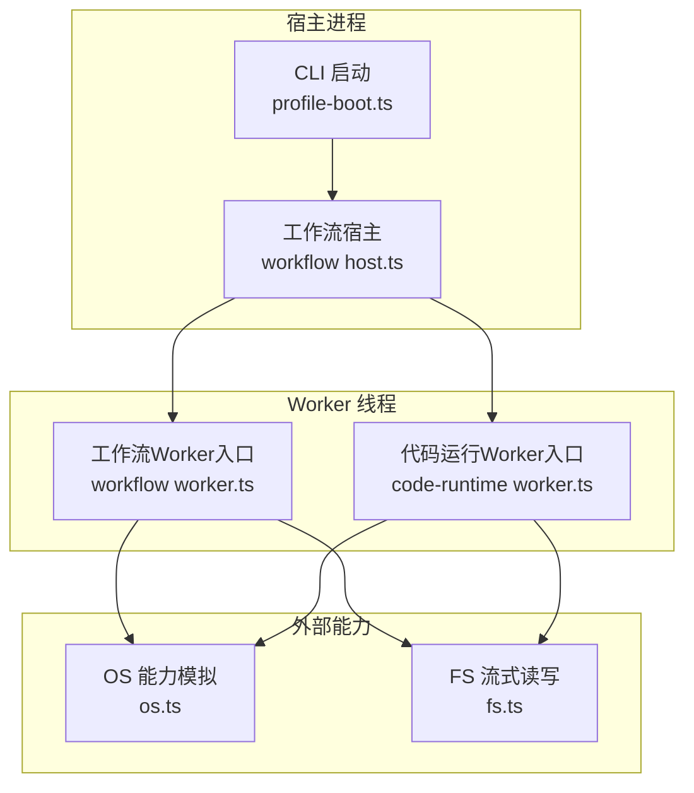
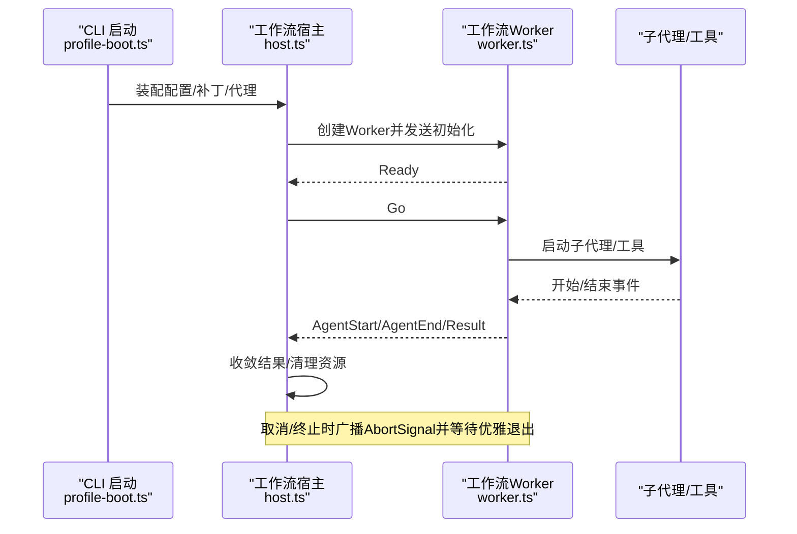
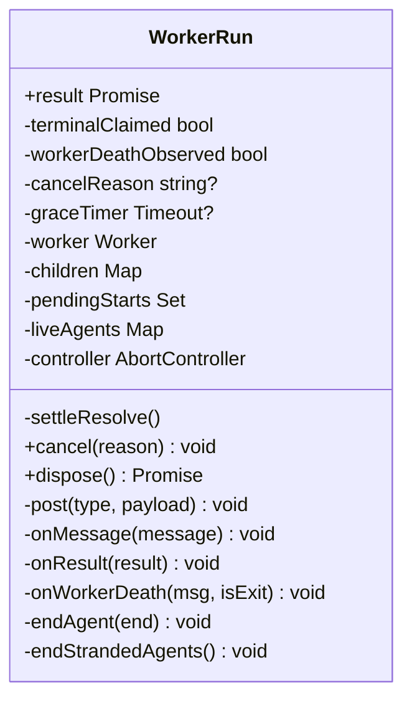
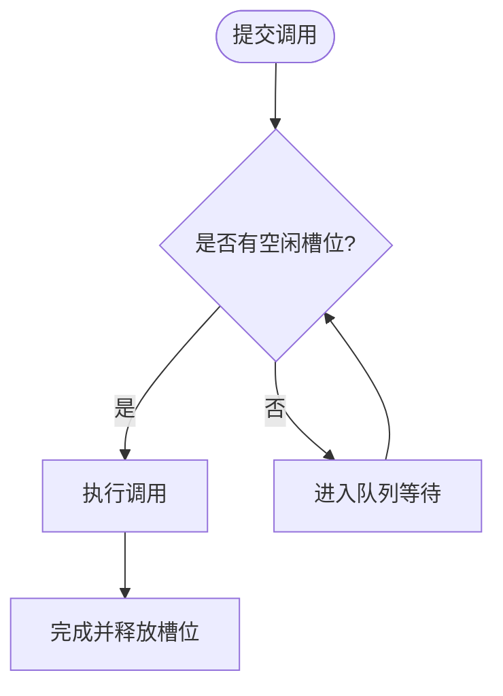
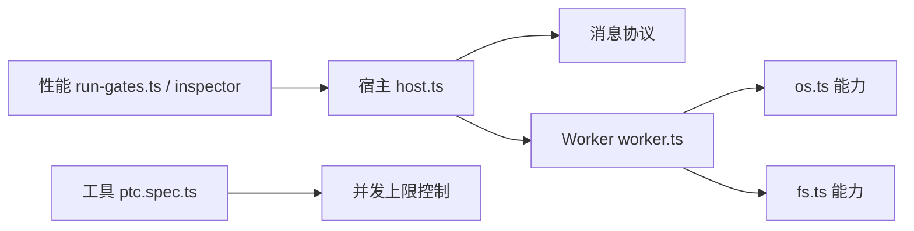

# CPU密集型任务优化

<cite>
**本文引用的文件**
- [packages/workflow/workflow-worker-thread/src/host.ts](file://packages/workflow/workflow-worker-thread/src/host.ts)
- [packages/workflow/workflow-worker-thread/src/worker.ts](file://packages/workflow/workflow-worker-thread/src/worker.ts)
- [packages/code-runtime/code-runtime-worker-thread/src/worker.ts](file://packages/code-runtime/code-runtime-worker-thread/src/worker.ts)
- [apps/cli/src/profile-boot.ts](file://apps/cli/src/profile-boot.ts)
- [packages/experimental/webworker-runtime/src/node/builtin_modules/implemented/os.ts](file://packages/experimental/webworker-runtime/src/node/builtin_modules/implemented/os.ts)
- [packages/experimental/webworker-runtime/src/node/builtin_modules/implemented/fs.ts](file://packages/experimental/webworker-runtime/src/node/builtin_modules/implemented/fs.ts)
- [packages/core/tools/tests/ptc.spec.ts](file://packages/core/tools/tests/ptc.spec.ts)
- [.agents/notes/implemented/feature/2026-07-26-ptc-live-parallel-dispatch.zh.md](file://.agents/notes/implemented/feature/2026-07-26-ptc-live-parallel-dispatch.zh.md)
- [packages/experimental/inspector/src/host/cdp/profiler.ts](file://packages/experimental/inspector/src/host/cdp/profiler.ts)
- [packages/experimental/inspector/src/client/cdp/profiler.ts](file://packages/experimental/inspector/src/client/cdp/profiler.ts)
- [scripts/run-gates.ts](file://scripts/run-gates.ts)
- [packages/fs/fs-local/tests/fsio.spec.ts](file://packages/fs/fs-local/tests/fsio.spec.ts)
- [packages/experimental/code-runtime-python/tests/runtime.spec.ts](file://packages/experimental/code-runtime-python/tests/runtime.spec.ts)
- [docs/subsystems/llm-streaming.md](file://docs/subsystems/llm-streaming.md)
</cite>

## 目录
1. [简介](#简介)
2. [项目结构](#项目结构)
3. [核心组件](#核心组件)
4. [架构总览](#架构总览)
5. [详细组件分析](#详细组件分析)
6. [依赖关系分析](#依赖关系分析)
7. [性能考量](#性能考量)
8. [故障排查指南](#故障排查指南)
9. [结论](#结论)
10. [附录](#附录)

## 简介
本指南面向CPU密集型任务的工程化优化，围绕Worker线程使用模式、负载均衡与并发控制、算法与数据结构选择、大文件处理（含内存映射）、以及LLM推理与数据处理在智能体框架中的优化实践展开。结合仓库中工作流Worker、代码运行时Worker、CLI启动与配置、Web Worker运行时、工具并行调度、以及性能剖析相关实现，提供可落地的最佳实践与重构建议。

## 项目结构
本项目采用多包（monorepo）组织，关键与CPU密集任务相关的模块包括：
- 工作流Worker宿主与子进程通信：packages/workflow/workflow-worker-thread
- 代码执行Worker入口：packages/code-runtime/code-runtime-worker-thread
- CLI启动与配置装配：apps/cli/src/profile-boot.ts
- Web Worker运行时能力模拟（可用并行度、文件系统）：packages/experimental/webworker-runtime
- 工具并行调用与并发上限控制：packages/core/tools/tests/ptc.spec.ts
- 性能剖析与指标采集：apps/cli/src/profile-boot.ts、packages/experimental/inspector、scripts/run-gates.ts
- 大文件读取与流式I/O行为验证：packages/fs/fs-local/tests/fsio.spec.ts、packages/experimental/webworker-runtime/src/node/builtin_modules/implemented/fs.ts
- LLM流式协议与组装：docs/subsystems/llm-streaming.md

图表来源
- [apps/cli/src/profile-boot.ts:210-321](file://apps/cli/src/profile-boot.ts#L210-L321)
- [packages/workflow/workflow-worker-thread/src/host.ts:1-172](file://packages/workflow/workflow-worker-thread/src/host.ts#L1-L172)
- [packages/workflow/workflow-worker-thread/src/worker.ts:1-15](file://packages/workflow/workflow-worker-thread/src/worker.ts#L1-L15)
- [packages/code-runtime/code-runtime-worker-thread/src/worker.ts:1-15](file://packages/code-runtime/code-runtime-worker-thread/src/worker.ts#L1-L15)
- [packages/experimental/webworker-runtime/src/node/builtin_modules/implemented/os.ts:61-105](file://packages/experimental/webworker-runtime/src/node/builtin_modules/implemented/os.ts#L61-L105)
- [packages/experimental/webworker-runtime/src/node/builtin_modules/implemented/fs.ts:322-357](file://packages/experimental/webworker-runtime/src/node/builtin_modules/implemented/fs.ts#L322-L357)

章节来源
- [apps/cli/src/profile-boot.ts:210-321](file://apps/cli/src/profile-boot.ts#L210-L321)
- [packages/workflow/workflow-worker-thread/src/host.ts:1-172](file://packages/workflow/workflow-worker-thread/src/host.ts#L1-L172)
- [packages/workflow/workflow-worker-thread/src/worker.ts:1-15](file://packages/workflow/workflow-worker-thread/src/worker.ts#L1-L15)
- [packages/code-runtime/code-runtime-worker-thread/src/worker.ts:1-15](file://packages/code-runtime/code-runtime-worker-thread/src/worker.ts#L1-L15)
- [packages/experimental/webworker-runtime/src/node/builtin_modules/implemented/os.ts:61-105](file://packages/experimental/webworker-runtime/src/node/builtin_modules/implemented/os.ts#L61-L105)
- [packages/experimental/webworker-runtime/src/node/builtin_modules/implemented/fs.ts:322-357](file://packages/experimental/webworker-runtime/src/node/builtin_modules/implemented/fs.ts#L322-L357)

## 核心组件
- 工作流Worker宿主（host.ts）：负责创建并管理Worker线程、消息协议、取消与终止、子代理生命周期、结果收敛与优雅退出。
- 工作流Worker入口（worker.ts）：最小化胶水层，将父端口与初始化数据交给会话逻辑。
- 代码运行Worker入口（code-runtime worker.ts）：将主函数委托给bootstrap，隔离执行环境。
- CLI启动（profile-boot.ts）：加载配置、装配补丁、安装代理、信号处理与进程关闭。
- Web Worker运行时能力（os.ts、fs.ts）：提供可用并行度、系统常量、流式文件读写的兼容实现。
- 工具并行调度（ptc.spec.ts）：通过并发上限控制避免写操作竞态，保证Promise.all的安全高效使用。
- 性能剖析（inspector、run-gates.ts）：提供CPU Profiler桥接能力与进程树枚举等诊断能力。
- LLM流式协议（llm-streaming.md）：定义StreamChunk、BlockAssembler、重试策略、模型能力等，指导流式推理的组装与资源控制。

章节来源
- [packages/workflow/workflow-worker-thread/src/host.ts:1-172](file://packages/workflow/workflow-worker-thread/src/host.ts#L1-L172)
- [packages/workflow/workflow-worker-thread/src/worker.ts:1-15](file://packages/workflow/workflow-worker-thread/src/worker.ts#L1-L15)
- [packages/code-runtime/code-runtime-worker-thread/src/worker.ts:1-15](file://packages/code-runtime/code-runtime-worker-thread/src/worker.ts#L1-L15)
- [apps/cli/src/profile-boot.ts:210-321](file://apps/cli/src/profile-boot.ts#L210-L321)
- [packages/experimental/webworker-runtime/src/node/builtin_modules/implemented/os.ts:61-105](file://packages/experimental/webworker-runtime/src/node/builtin_modules/implemented/os.ts#L61-L105)
- [packages/experimental/webworker-runtime/src/node/builtin_modules/implemented/fs.ts:322-357](file://packages/experimental/webworker-runtime/src/node/builtin_modules/implemented/fs.ts#L322-L357)
- [packages/core/tools/tests/ptc.spec.ts:581-604](file://packages/core/tools/tests/ptc.spec.ts#L581-L604)
- [packages/experimental/inspector/src/host/cdp/profiler.ts:1-11](file://packages/experimental/inspector/src/host/cdp/profiler.ts#L1-L11)
- [packages/experimental/inspector/src/client/cdp/profiler.ts:1-12](file://packages/experimental/inspector/src/client/cdp/profiler.ts#L1-L12)
- [scripts/run-gates.ts:1353-1385](file://scripts/run-gates.ts#L1353-L1385)
- [docs/subsystems/llm-streaming.md:167-228](file://docs/subsystems/llm-streaming.md#L167-L228)

## 架构总览
下图展示了从CLI启动到工作流Worker执行的端到端流程，包含消息传递、取消传播、子代理生命周期与资源回收。

图表来源
- [apps/cli/src/profile-boot.ts:210-321](file://apps/cli/src/profile-boot.ts#L210-L321)
- [packages/workflow/workflow-worker-thread/src/host.ts:105-172](file://packages/workflow/workflow-worker-thread/src/host.ts#L105-L172)
- [packages/workflow/workflow-worker-thread/src/worker.ts:1-15](file://packages/workflow/workflow-worker-thread/src/worker.ts#L1-L15)

## 详细组件分析

### 工作流Worker宿主（host.ts）
- 职责：创建Worker、维护消息协议、处理错误/退出、子代理注册与销毁、结果收敛、取消与超时保护。
- 关键点：
  - 使用AbortController为所有子任务共享取消信号，确保取消一致性。
  - 对postMessage失败进行容忍处理，避免在Teardown阶段抛出异常。
  - 通过“首次获胜”机制收敛Result/Death/Grace三种终态，保证幂等与确定性。
  - 子代理生命周期严格配对start/end，缺失end会由宿主合成cancelled以维持日志一致。

图表来源
- [packages/workflow/workflow-worker-thread/src/host.ts:105-172](file://packages/workflow/workflow-worker-thread/src/host.ts#L105-L172)
- [packages/workflow/workflow-worker-thread/src/host.ts:257-316](file://packages/workflow/workflow-worker-thread/src/host.ts#L257-L316)
- [packages/workflow/workflow-worker-thread/src/host.ts:489-554](file://packages/workflow/workflow-worker-thread/src/host.ts#L489-L554)

章节来源
- [packages/workflow/workflow-worker-thread/src/host.ts:105-172](file://packages/workflow/workflow-worker-thread/src/host.ts#L105-L172)
- [packages/workflow/workflow-worker-thread/src/host.ts:257-316](file://packages/workflow/workflow-worker-thread/src/host.ts#L257-L316)
- [packages/workflow/workflow-worker-thread/src/host.ts:489-554](file://packages/workflow/workflow-worker-thread/src/host.ts#L489-L554)

### 工作流Worker入口（worker.ts）
- 职责：最小化入口，校验parentPort存在，将执行委托给会话模块。
- 设计要点：
  - 明确边界：入口仅做参数校验与转发，复杂逻辑在session中实现，便于覆盖测试与复用。

章节来源
- [packages/workflow/workflow-worker-thread/src/worker.ts:1-15](file://packages/workflow/workflow-worker-thread/src/worker.ts#L1-L15)

### 代码运行Worker入口（code-runtime worker.ts）
- 职责：作为执行环境的隔离入口，将主逻辑委托给bootstrap。
- 设计要点：
  - 强制要求parentPort存在，防止脱离Worker上下文运行导致不可预期行为。

章节来源
- [packages/code-runtime/code-runtime-worker-thread/src/worker.ts:1-15](file://packages/code-runtime/code-runtime-worker-thread/src/worker.ts#L1-L15)

### CLI启动与配置装配（profile-boot.ts）
- 职责：加载profile、组合补丁层、安装代理、信号处理、进程关闭。
- 关键点：
  - 在插件挂载前安装代理与环境，确保网络请求走受控通道。
  - 支持HMR与用户补丁热重载，保证开发体验与稳定性。
  - 统一信号处理（SIGTERM/SIGINT），确保优雅退出。

章节来源
- [apps/cli/src/profile-boot.ts:210-321](file://apps/cli/src/profile-boot.ts#L210-L321)

### Web Worker运行时能力（os.ts、fs.ts）
- 可用并行度：通过navigator.hardwareConcurrency暴露，至少为1，用于决定并发池大小。
- 文件系统：readSync按位置读取，支持偏移与游标更新；与Node行为对齐，便于跨环境一致性。

章节来源
- [packages/experimental/webworker-runtime/src/node/builtin_modules/implemented/os.ts:61-105](file://packages/experimental/webworker-runtime/src/node/builtin_modules/implemented/os.ts#L61-L105)
- [packages/experimental/webworker-runtime/src/node/builtin_modules/implemented/fs.ts:322-357](file://packages/experimental/webworker-runtime/src/node/builtin_modules/implemented/fs.ts#L322-L357)

### 工具并行调度与并发上限（ptc.spec.ts）
- 目标：在不引入新API的前提下，让Promise.all更安全地并发独立读取，同时限制最大并发以避免写操作竞态。
- 机制：通过maxParallelSubCalls控制并发窗口，未释放的调用排队等待槽位，确保有序与稳定。

图表来源
- [packages/core/tools/tests/ptc.spec.ts:581-604](file://packages/core/tools/tests/ptc.spec.ts#L581-L604)

章节来源
- [packages/core/tools/tests/ptc.spec.ts:581-604](file://packages/core/tools/tests/ptc.spec.ts#L581-L604)
- [.agents/notes/implemented/feature/2026-07-26-ptc-live-parallel-dispatch.zh.md:22-33](file://.agents/notes/implemented/feature/2026-07-26-ptc-live-parallel-dispatch.zh.md#L22-L33)

### 性能剖析与指标采集（inspector、run-gates.ts）
- 宿主侧CPU Profiler桥接能力：当前不暴露客户端能力，需通过宿主侧适配器获取。
- 进程树枚举：在Linux下遍历/proc/<pid>/stat，其他平台解析ps或CIM表，用于定位子进程与资源占用。

章节来源
- [packages/experimental/inspector/src/host/cdp/profiler.ts:1-11](file://packages/experimental/inspector/src/host/cdp/profiler.ts#L1-L11)
- [packages/experimental/inspector/src/client/cdp/profiler.ts:1-12](file://packages/experimental/inspector/src/client/cdp/profiler.ts#L1-L12)
- [scripts/run-gates.ts:1353-1385](file://scripts/run-gates.ts#L1353-L1385)

### LLM流式协议与组装（llm-streaming.md）
- StreamChunk：文本、推理、工具调用等块级增量，配合index关联，block-end携带完整块。
- BlockAssembler：将流式片段组装为内容块、用量统计、结束原因与回放状态，支持中断安全的前缀组装。
- 重试策略与模型能力：统一的重试策略与模型上下文能力，保障稳定性与可预测性。

章节来源
- [docs/subsystems/llm-streaming.md:167-228](file://docs/subsystems/llm-streaming.md#L167-L228)
- [docs/subsystems/llm-streaming.md:358-415](file://docs/subsystems/llm-streaming.md#L358-L415)
- [docs/subsystems/llm-streaming.md:738-764](file://docs/subsystems/llm-streaming.md#L738-L764)

## 依赖关系分析
- 宿主与Worker解耦：通过消息协议通信，宿主负责生命周期与资源管理，Worker专注业务执行。
- 能力注入：Web Worker运行时提供OS与FS能力，使Worker内计算与I/O具备跨环境一致性。
- 并发控制：工具层通过并发上限协调Promise.all，避免写冲突；工作流层通过AbortController统一取消。
- 性能剖析：宿主侧Profiler桥接与进程树枚举为CPU热点定位提供基础。

图表来源
- [packages/workflow/workflow-worker-thread/src/host.ts:105-172](file://packages/workflow/workflow-worker-thread/src/host.ts#L105-L172)
- [packages/workflow/workflow-worker-thread/src/worker.ts:1-15](file://packages/workflow/workflow-worker-thread/src/worker.ts#L1-L15)
- [packages/experimental/webworker-runtime/src/node/builtin_modules/implemented/os.ts:61-105](file://packages/experimental/webworker-runtime/src/node/builtin_modules/implemented/os.ts#L61-L105)
- [packages/experimental/webworker-runtime/src/node/builtin_modules/implemented/fs.ts:322-357](file://packages/experimental/webworker-runtime/src/node/builtin_modules/implemented/fs.ts#L322-L357)
- [packages/core/tools/tests/ptc.spec.ts:581-604](file://packages/core/tools/tests/ptc.spec.ts#L581-L604)
- [scripts/run-gates.ts:1353-1385](file://scripts/run-gates.ts#L1353-L1385)
- [packages/experimental/inspector/src/host/cdp/profiler.ts:1-11](file://packages/experimental/inspector/src/host/cdp/profiler.ts#L1-L11)

章节来源
- [packages/workflow/workflow-worker-thread/src/host.ts:105-172](file://packages/workflow/workflow-worker-thread/src/host.ts#L105-L172)
- [packages/workflow/workflow-worker-thread/src/worker.ts:1-15](file://packages/workflow/workflow-worker-thread/src/worker.ts#L1-L15)
- [packages/experimental/webworker-runtime/src/node/builtin_modules/implemented/os.ts:61-105](file://packages/experimental/webworker-runtime/src/node/builtin_modules/implemented/os.ts#L61-L105)
- [packages/experimental/webworker-runtime/src/node/builtin_modules/implemented/fs.ts:322-357](file://packages/experimental/webworker-runtime/src/node/builtin_modules/implemented/fs.ts#L322-L357)
- [packages/core/tools/tests/ptc.spec.ts:581-604](file://packages/core/tools/tests/ptc.spec.ts#L581-L604)
- [scripts/run-gates.ts:1353-1385](file://scripts/run-gates.ts#L1353-L1385)
- [packages/experimental/inspector/src/host/cdp/profiler.ts:1-11](file://packages/experimental/inspector/src/host/cdp/profiler.ts#L1-L11)

## 性能考量
- Worker线程使用模式
  - 将CPU密集计算放入Worker，避免阻塞主线程；通过消息协议传递JSON数据，减少序列化成本。
  - 使用AbortController统一取消，确保资源及时释放。
- 负载均衡与并发控制
  - 基于availableParallelism设置并发池大小，匹配硬件能力。
  - 对写操作受限的并发场景，使用并发上限（如maxParallelSubCalls）避免竞态。
- 算法与数据结构
  - 优先选择时间复杂度更低的算法；对频繁查找使用哈希表；对顺序访问使用数组或缓冲区。
  - 避免在热点路径中进行深拷贝与大对象分配。
- 并行化与Promise.all
  - 对独立读操作使用Promise.all提升吞吐；对写操作加并发上限或串行化。
  - 结合超时与取消信号，防止长尾任务拖垮整体。
- 大文件与内存映射
  - 使用流式读取与分块处理，降低内存峰值；必要时考虑内存映射以提升随机访问性能。
  - 对齐Node行为，确保跨环境一致性。
- LLM推理优化
  - 利用BlockAssembler将流式响应组装为内容块，减少重复构建开销。
  - 合理设置maxTokens、stop序列与重试策略，平衡延迟与质量。
  - 使用imageRequestPricing评估图像请求成本，优化历史压缩与缓存策略。

[本节为通用指导，不直接分析具体文件]

## 故障排查指南
- Worker死亡与消息丢失
  - 检查onWorkerDeath路径，确认是否因error/messageerror/exit导致提前收敛。
  - 确认postMessage在Teardown阶段的容错处理，避免二次异常。
- 取消与超时
  - 确认AbortController是否正确广播至所有子任务。
  - 检查grace定时器与terminate时机，避免资源泄漏。
- 并发竞态
  - 对写操作启用并发上限，观察pending与peakLive指标。
  - 使用start/settle事件配对，确保日志一致性与时序正确。
- 性能瓶颈定位
  - 使用宿主侧Profiler桥接能力采集CPU热点。
  - 通过进程树枚举定位子进程占用，结合流式I/O行为验证。

章节来源
- [packages/workflow/workflow-worker-thread/src/host.ts:489-554](file://packages/workflow/workflow-worker-thread/src/host.ts#L489-L554)
- [packages/workflow/workflow-worker-thread/src/host.ts:257-316](file://packages/workflow/workflow-worker-thread/src/host.ts#L257-L316)
- [packages/core/tools/tests/ptc.spec.ts:581-604](file://packages/core/tools/tests/ptc.spec.ts#L581-L604)
- [packages/experimental/inspector/src/host/cdp/profiler.ts:1-11](file://packages/experimental/inspector/src/host/cdp/profiler.ts#L1-L11)
- [scripts/run-gates.ts:1353-1385](file://scripts/run-gates.ts#L1353-L1385)

## 结论
通过将CPU密集任务迁移至Worker线程、实施严格的并发控制与取消机制、选择合适的算法与数据结构、采用流式I/O与内存映射优化大文件处理、并利用LLM流式协议与工具链进行推理优化，可以显著提升系统吞吐与稳定性。结合宿主侧性能剖析与进程监控，能够精准定位瓶颈并持续迭代优化。

[本节为总结，不直接分析具体文件]

## 附录
- 实际重构示例（路径引用）
  - 将无界Promise.all改为带并发上限的调度：参考[packages/core/tools/tests/ptc.spec.ts:581-604](file://packages/core/tools/tests/ptc.spec.ts#L581-L604)
  - 在Worker中执行CPU密集任务并通过消息返回结果：参考[packages/workflow/workflow-worker-thread/src/host.ts:105-172](file://packages/workflow/workflow-worker-thread/src/host.ts#L105-L172)、[packages/workflow/workflow-worker-thread/src/worker.ts:1-15](file://packages/workflow/workflow-worker-thread/src/worker.ts#L1-L15)
  - 使用流式读取处理大文件：参考[packages/experimental/webworker-runtime/src/node/builtin_modules/implemented/fs.ts:322-357](file://packages/experimental/webworker-runtime/src/node/builtin_modules/implemented/fs.ts#L322-L357)
  - 通过LLM流式协议组装响应：参考[docs/subsystems/llm-streaming.md:358-415](file://docs/subsystems/llm-streaming.md#L358-L415)

[本节为附录，不直接分析具体文件]