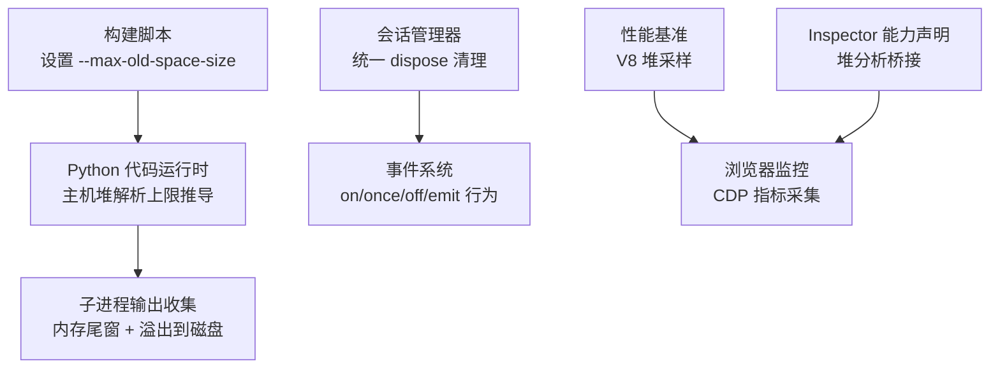
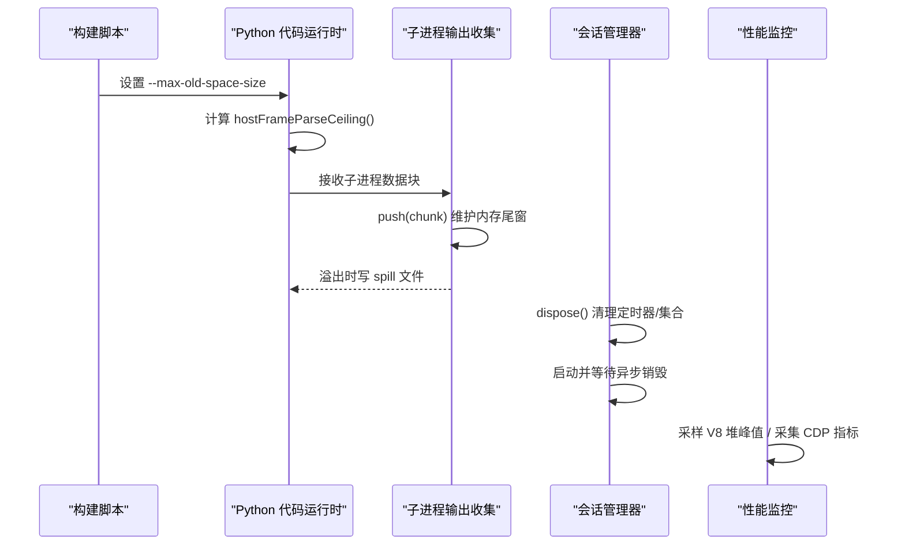
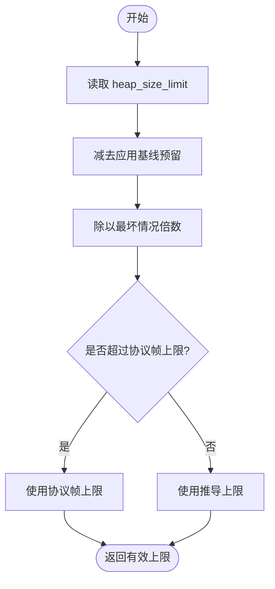
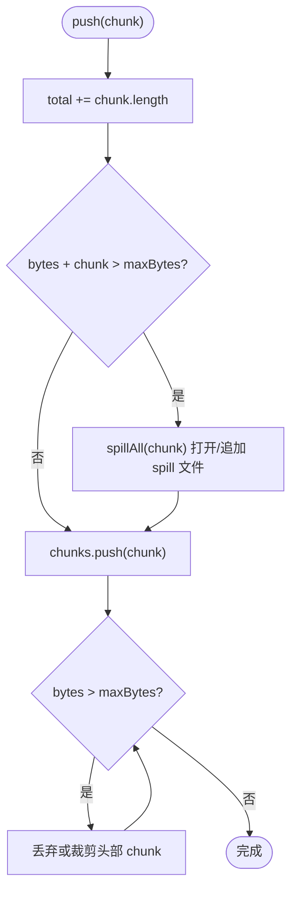
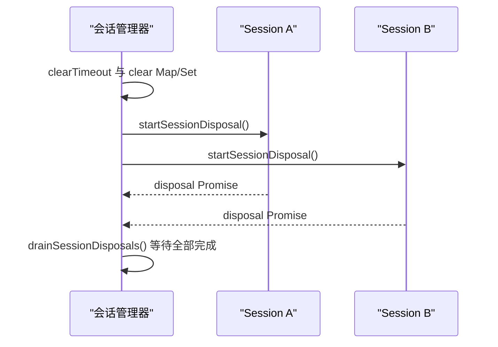
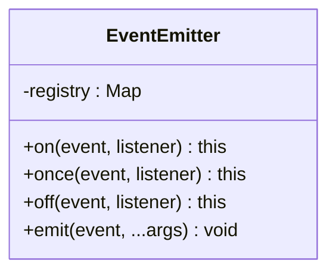
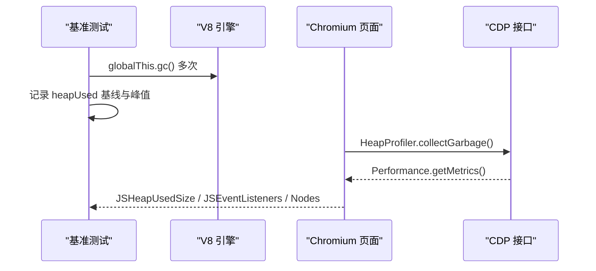
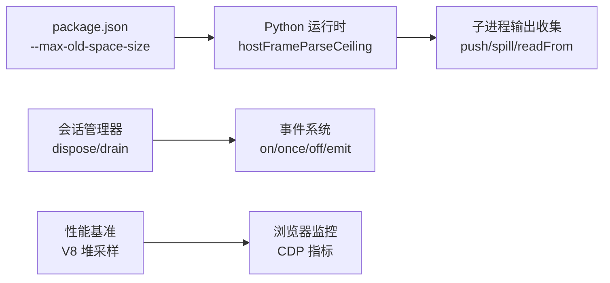

# 内存管理优化

<cite>
**本文引用的文件**
- [package.json](file://package.json)
- [index.ts（Python 代码运行时）](file://packages/experimental/code-runtime-python/src/index.ts)
- [spawn.ts（子进程输出收集与溢出）](file://packages/subprocess/subprocess-local/src/spawn.ts)
- [manager.ts（会话管理器清理）](file://packages/api/session-controller/src/client/sessions/manager.ts)
- [events.ts（最小 EventEmitter 实现）](file://packages/experimental/webworker-runtime/src/node/builtin_modules/implemented/events.ts)
- [history-transport.perf.client.ts（V8 堆采样基准）](file://packages/client/ui-conversation/tests/history-transport.perf.client.ts)
- [complex-history.perf.ts（浏览器性能指标采集）](file://apps/web/tests/complex-history.perf.ts)
- [heap-profiler.ts（客户端堆分析能力声明）](file://packages/experimental/inspector/src/client/cdp/heap-profiler.ts)
- [heap-profiler.ts（宿主堆分析能力声明）](file://packages/experimental/inspector/src/host/cdp/heap-profiler.ts)
- [residual-detach.spec.ts（大帧残留分离测试）](file://packages/experimental/code-runtime-python/tests/residual-detach.spec.ts)
- [runtime.spec.ts（流式写入与内存预算测试）](file://packages/experimental/code-runtime-python/tests/runtime.spec.ts)
</cite>

## 目录
1. [简介](#简介)
2. [项目结构](#项目结构)
3. [核心组件](#核心组件)
4. [架构总览](#架构总览)
5. [详细组件分析](#详细组件分析)
6. [依赖关系分析](#依赖关系分析)
7. [性能考量](#性能考量)
8. [故障排查指南](#故障排查指南)
9. [结论](#结论)
10. [附录](#附录)

## 简介
本指南围绕 JavaScript 垃圾回收机制、内存泄漏预防、对象池化与大对象处理，结合仓库中已有的内存预算、流式缓冲、进程隔离与监控实践，提供一套可落地的内存管理优化方案。内容覆盖：
- V8 垃圾回收与 Node.js 进程内存配置
- 连接池、缓存池与资源复用模式
- 大对象处理与溢出策略
- Chrome DevTools Memory 面板与堆快照分析方法
- Node.js 进程与 V8 引擎调优参数
- 常见内存泄漏场景与修复示例（事件监听器、闭包引用、循环引用）

## 项目结构
仓库采用多包工作区组织，内存相关能力分布在以下位置：
- 构建与运行期内存上限：根脚本通过 Node 参数控制编译阶段堆大小
- Python 代码运行时：对入站协议帧进行解析前做“主机堆安全上限”推导，避免 JSON.parse 放大导致 OOM
- 子进程输出收集：按字节窗口保留尾部，超限后转存 spill 文件，防止内存膨胀
- 会话生命周期：统一清理定时器、集合与异步销毁，避免悬挂引用
- 事件系统：最小 EventEmitter 实现，确保监听器注册/移除语义正确
- 性能基准与监控：V8 堆采样、浏览器 CDP 指标采集、堆分析能力声明

**图表来源**
- [package.json:23-23](file://package.json#L23-L23)
- [index.ts（Python 代码运行时）:340-367](file://packages/experimental/code-runtime-python/src/index.ts#L340-L367)
- [spawn.ts:145-175](file://packages/subprocess/subprocess-local/src/spawn.ts#L145-L175)
- [manager.ts:251-280](file://packages/api/session-controller/src/client/sessions/manager.ts#L251-L280)
- [events.ts:17-46](file://packages/experimental/webworker-runtime/src/node/builtin_modules/implemented/events.ts#L17-L46)
- [history-transport.perf.client.ts:188-211](file://packages/client/ui-conversation/tests/history-transport.perf.client.ts#L188-L211)
- [complex-history.perf.ts:524-547](file://apps/web/tests/complex-history.perf.ts#L524-L547)
- [heap-profiler.ts（客户端）:1-11](file://packages/experimental/inspector/src/client/cdp/heap-profiler.ts#L1-L11)
- [heap-profiler.ts（宿主）:1-11](file://packages/experimental/inspector/src/host/cdp/heap-profiler.ts#L1-L11)

**章节来源**
- [package.json:23-23](file://package.json#L23-L23)
- [index.ts（Python 代码运行时）:340-367](file://packages/experimental/code-runtime-python/src/index.ts#L340-L367)
- [spawn.ts:145-175](file://packages/subprocess/subprocess-local/src/spawn.ts#L145-L175)
- [manager.ts:251-280](file://packages/api/session-controller/src/client/sessions/manager.ts#L251-L280)
- [events.ts:17-46](file://packages/experimental/webworker-runtime/src/node/builtin_modules/implemented/events.ts#L17-L46)
- [history-transport.perf.client.ts:188-211](file://packages/client/ui-conversation/tests/history-transport.perf.client.ts#L188-L211)
- [complex-history.perf.ts:524-547](file://apps/web/tests/complex-history.perf.ts#L524-L547)
- [heap-profiler.ts（客户端）:1-11](file://packages/experimental/inspector/src/client/cdp/heap-profiler.ts#L1-L11)
- [heap-profiler.ts（宿主）:1-11](file://packages/experimental/inspector/src/host/cdp/heap-profiler.ts#L1-L11)

## 核心组件
- Python 代码运行时主机堆解析上限：根据当前堆限制与应用基线预留，计算最大可安全解析的入站帧大小，避免 JSON.parse 放大导致进程级 OOM
- 子进程输出收集器：维护内存中的尾部窗口，超过阈值时打开 spill 文件并追加；读取时支持增量偏移，必要时标记丢失段
- 会话管理器清理：集中释放定时器、清空集合、启动并等待所有 Session 的异步销毁，保证资源在有限时间内回收
- 最小 EventEmitter：实现 on/once/off/emit，确保监听器顺序与移除语义符合 Node 行为，便于测试与移植
- 性能基准与监控：V8 堆采样测量额外峰值；浏览器侧通过 CDP 获取 JSHeapUsedSize、JSEventListeners 等指标；Inspector 声明堆分析能力边界

**章节来源**
- [index.ts（Python 代码运行时）:340-367](file://packages/experimental/code-runtime-python/src/index.ts#L340-L367)
- [spawn.ts:145-175](file://packages/subprocess/subprocess-local/src/spawn.ts#L145-L175)
- [manager.ts:251-280](file://packages/api/session-controller/src/client/sessions/manager.ts#L251-L280)
- [events.ts:17-46](file://packages/experimental/webworker-runtime/src/node/builtin_modules/implemented/events.ts#L17-L46)
- [history-transport.perf.client.ts:188-211](file://packages/client/ui-conversation/tests/history-transport.perf.client.ts#L188-L211)
- [complex-history.perf.ts:524-547](file://apps/web/tests/complex-history.perf.ts#L524-L547)

## 架构总览
下图展示从构建期内存上限到运行期解析、子进程输出收集、会话清理与监控的整体流程。

**图表来源**
- [package.json:23-23](file://package.json#L23-L23)
- [index.ts（Python 代码运行时）:340-367](file://packages/experimental/code-runtime-python/src/index.ts#L340-L367)
- [spawn.ts:145-175](file://packages/subprocess/subprocess-local/src/spawn.ts#L145-L175)
- [manager.ts:251-280](file://packages/api/session-controller/src/client/sessions/manager.ts#L251-L280)
- [history-transport.perf.client.ts:188-211](file://packages/client/ui-conversation/tests/history-transport.perf.client.ts#L188-L211)
- [complex-history.perf.ts:524-547](file://apps/web/tests/complex-history.perf.ts#L524-L547)

## 详细组件分析

### Python 代码运行时：主机堆解析上限推导
- 目标：在 JSON.parse 之前限制入站帧大小，避免宽对象解析时的属性存储放大导致进程 OOM
- 方法：基于 heap_size_limit 减去应用基线预留，再除以最坏情况倍数，取协议帧上限的最小值
- 效果：在受限堆环境（如 --max-old-space-size=256）自动降低解析上限，负载门控拒绝无法安全解析的配置

**图表来源**
- [index.ts（Python 代码运行时）:340-367](file://packages/experimental/code-runtime-python/src/index.ts#L340-L367)

**章节来源**
- [index.ts（Python 代码运行时）:340-367](file://packages/experimental/code-runtime-python/src/index.ts#L340-L367)

### 子进程输出收集：内存尾窗与溢出策略
- 目标：控制内存占用，同时保留最近日志用于诊断
- 方法：push(chunk) 累计字节，超过 maxBytes 时打开 spill 文件并追加；内存中仅保留尾部窗口，必要时裁剪头部
- 读取：readFrom(fromByte) 支持增量读取，若 fromByte 已滑出窗口则标记 lossy；finalize() 合并最终输出并关闭 spill

**图表来源**
- [spawn.ts:145-175](file://packages/subprocess/subprocess-local/src/spawn.ts#L145-L175)
- [spawn.ts:177-219](file://packages/subprocess/subprocess-local/src/spawn.ts#L177-L219)
- [spawn.ts:221-272](file://packages/subprocess/subprocess-local/src/spawn.ts#L221-L272)

**章节来源**
- [spawn.ts:145-175](file://packages/subprocess/subprocess-local/src/spawn.ts#L145-L175)
- [spawn.ts:177-219](file://packages/subprocess/subprocess-local/src/spawn.ts#L177-L219)
- [spawn.ts:221-272](file://packages/subprocess/subprocess-local/src/spawn.ts#L221-L272)

### 会话管理器：统一清理与异步销毁
- 目标：确保所有资源（定时器、集合、Session）在有限时间内释放
- 方法：dispose() 清除定时器与集合，收集待销毁 Session 并并行触发其 dispose，等待全部 settle
- 效果：避免悬挂引用导致的内存泄漏，保证进程退出或模块卸载时的静默收尾

**图表来源**
- [manager.ts:251-280](file://packages/api/session-controller/src/client/sessions/manager.ts#L251-L280)

**章节来源**
- [manager.ts:251-280](file://packages/api/session-controller/src/client/sessions/manager.ts#L251-L280)

### 最小 EventEmitter：监听器注册与移除
- 目标：提供 with Node 一致的 on/once/off/emit 行为，便于测试与跨平台移植
- 关键点：once 包装函数携带原始 listener 引用以支持 removeListener；移除从尾部匹配，保持最早注册优先
- 价值：确保事件监听器不会因错误移除语义造成内存泄漏

**图表来源**
- [events.ts:17-46](file://packages/experimental/webworker-runtime/src/node/builtin_modules/implemented/events.ts#L17-L46)

**章节来源**
- [events.ts:17-46](file://packages/experimental/webworker-runtime/src/node/builtin_modules/implemented/events.ts#L17-L46)

### 性能基准与监控：V8 堆采样与浏览器指标
- V8 堆采样：通过暴露的 gc 强制 GC，记录 baseline 与峰值，统计额外堆增长
- 浏览器指标：通过 CDP 获取 JSHeapUsedSize、JSEventListeners、Nodes 等，评估 DOM 与事件监听器数量变化
- Inspector 能力：声明客户端与宿主堆分析桥接能力边界，明确不可用路径

**图表来源**
- [history-transport.perf.client.ts:188-211](file://packages/client/ui-conversation/tests/history-transport.perf.client.ts#L188-L211)
- [complex-history.perf.ts:524-547](file://apps/web/tests/complex-history.perf.ts#L524-L547)
- [heap-profiler.ts（客户端）:1-11](file://packages/experimental/inspector/src/client/cdp/heap-profiler.ts#L1-L11)
- [heap-profiler.ts（宿主）:1-11](file://packages/experimental/inspector/src/host/cdp/heap-profiler.ts#L1-L11)

**章节来源**
- [history-transport.perf.client.ts:188-211](file://packages/client/ui-conversation/tests/history-transport.perf.client.ts#L188-L211)
- [complex-history.perf.ts:524-547](file://apps/web/tests/complex-history.perf.ts#L524-L547)
- [heap-profiler.ts（客户端）:1-11](file://packages/experimental/inspector/src/client/cdp/heap-profiler.ts#L1-L11)
- [heap-profiler.ts（宿主）:1-11](file://packages/experimental/inspector/src/host/cdp/heap-profiler.ts#L1-L11)

## 依赖关系分析
- 构建脚本对 Node 堆大小的影响会传递到 Python 代码运行时的解析上限推导
- 子进程输出收集依赖 Buffer 与文件系统 API，spill 文件路径与权限由本地实现保障
- 会话管理器与事件系统共同保障生命周期与事件解耦，减少悬挂引用
- 性能基准与监控不直接修改业务逻辑，但为内存优化提供量化依据

**图表来源**
- [package.json:23-23](file://package.json#L23-L23)
- [index.ts（Python 代码运行时）:340-367](file://packages/experimental/code-runtime-python/src/index.ts#L340-L367)
- [spawn.ts:145-175](file://packages/subprocess/subprocess-local/src/spawn.ts#L145-L175)
- [manager.ts:251-280](file://packages/api/session-controller/src/client/sessions/manager.ts#L251-L280)
- [events.ts:17-46](file://packages/experimental/webworker-runtime/src/node/builtin_modules/implemented/events.ts#L17-L46)
- [history-transport.perf.client.ts:188-211](file://packages/client/ui-conversation/tests/history-transport.perf.client.ts#L188-L211)
- [complex-history.perf.ts:524-547](file://apps/web/tests/complex-history.perf.ts#L524-L547)

**章节来源**
- [package.json:23-23](file://package.json#L23-L23)
- [index.ts（Python 代码运行时）:340-367](file://packages/experimental/code-runtime-python/src/index.ts#L340-L367)
- [spawn.ts:145-175](file://packages/subprocess/subprocess-local/src/spawn.ts#L145-L175)
- [manager.ts:251-280](file://packages/api/session-controller/src/client/sessions/manager.ts#L251-L280)
- [events.ts:17-46](file://packages/experimental/webworker-runtime/src/node/builtin_modules/implemented/events.ts#L17-L46)
- [history-transport.perf.client.ts:188-211](file://packages/client/ui-conversation/tests/history-transport.perf.client.ts#L188-L211)
- [complex-history.perf.ts:524-547](file://apps/web/tests/complex-history.perf.ts#L524-L547)

## 性能考量
- 构建期堆上限：通过 --max-old-space-size 提升编译阶段可用堆，避免大型类型检查与打包过程中的 OOM
- 解析期保护：Python 运行时在 JSON.parse 前限制入站帧大小，避免宽对象解析放大
- 流式缓冲：子进程输出按字节窗口保留尾部，超限后转存 spill 文件，避免内存持续增长
- 监控与基准：V8 堆采样与 CDP 指标用于量化优化效果，定位热点与泄漏点

[本节为通用指导，不直接分析具体文件]

## 故障排查指南
- 大帧残留导致内存泄漏：当处理来自子进程的超大帧时，若仅保留 subarray 视图，可能反向持有整个底层分配；应显式复制残留部分以避免长尾持有
- 流式写入累积：大量小写入需确保缓冲与 flush 策略合理，避免 Buffer.concat 峰值过高
- 事件监听器未移除：确认 off/removeListener 调用时机，避免重复注册与遗漏清理
- 会话未清理：确保 dispose 被调用且所有异步销毁完成，避免悬挂 Promise 与定时器

**章节来源**
- [residual-detach.spec.ts:1-21](file://packages/experimental/code-runtime-python/tests/residual-detach.spec.ts#L1-L21)
- [runtime.spec.ts:4702-4734](file://packages/experimental/code-runtime-python/tests/runtime.spec.ts#L4702-L4734)
- [events.ts:17-46](file://packages/experimental/webworker-runtime/src/node/builtin_modules/implemented/events.ts#L17-L46)
- [manager.ts:251-280](file://packages/api/session-controller/src/client/sessions/manager.ts#L251-L280)

## 结论
通过构建期堆上限、解析期帧上限、流式缓冲与溢出、统一生命周期清理以及完善的监控基准，本仓库在内存管理方面形成了闭环。建议在实际部署中：
- 根据运行环境调整 --max-old-space-size 与解析上限
- 对所有外部输入与子进程输出实施预算与溢出策略
- 严格管理事件监听器与异步资源的生命周期
- 持续使用 V8 堆采样与 CDP 指标验证优化效果

[本节为总结性内容，不直接分析具体文件]

## 附录
- 常见内存泄漏场景与修复要点
  - 事件监听器未移除：在组件卸载或任务结束时调用 off/removeListener/removeAllListeners
  - 闭包引用：避免在长生命周期对象中捕获大对象或 DOM 引用；必要时显式置空
  - 循环引用：使用 WeakMap/WeakRef 或重构数据结构打破环
- Node.js 进程内存优化配置
  - 构建与运行期使用 --max-old-space-size 控制旧空间大小
  - 在生产环境启用适当的 GC 日志与监控
- Chrome DevTools Memory 面板使用
  - 使用“堆快照”对比差异，查找未被释放的对象
  - 使用“Allocation instrumentation on timeline”定位频繁分配热点
  - 结合 CDP 指标（JSHeapUsedSize、JSEventListeners）观察趋势

[本节为通用指导，不直接分析具体文件]