# 异步操作优化

<cite>
**本文引用的文件**
- [packages/experimental/webworker-runtime/src/node/builtin_modules/implemented/stream.ts](file://packages/experimental/webworker-runtime/src/node/builtin_modules/implemented/stream.ts)
- [packages/util/deque/src/index.ts](file://packages/util/deque/src/index.ts)
- [.agents/notes/implemented/bug-fix/2026-08-28-linear-stream-queue-drain.md](file://.agents/notes/implemented/bug-fix/2026-08-28-linear-stream-queue-drain.md)
- [packages/core/tools/src/ptc.ts](file://packages/core/tools/src/ptc.ts)
- [packages/core/tools/tests/ptc.spec.ts](file://packages/core/tools/tests/ptc.spec.ts)
- [packages/workflow/workflow-worker-thread/tests/session.spec.ts](file://packages/workflow/workflow-worker-thread/tests/session.spec.ts)
- [scripts/run-gates.ts](file://scripts/run-gates.ts)
- [packages/llm/llm/src/retry-policy.ts](file://packages/llm/llm/src/retry-policy.ts)
- [packages/subprocess/subprocess-local/src/spawn.ts](file://packages/subprocess/subprocess-local/src/spawn.ts)
- [packages/session-query/session-query-sqlite/src/query.ts](file://packages/session-query/session-query-sqlite/src/query.ts)
- [packages/session-query/session-query-sqlite/src/index.ts](file://packages/session-query/session-query-sqlite/src/index.ts)
- [apps/web/tests/complex-history.perf.ts](file://apps/web/tests/complex-history.perf.ts)
- [BENCHMARK.md](file://BENCHMARK.md)
</cite>

## 目录
1. [简介](#简介)
2. [项目结构](#项目结构)
3. [核心组件](#核心组件)
4. [架构总览](#架构总览)
5. [详细组件分析](#详细组件分析)
6. [依赖关系分析](#依赖关系分析)
7. [性能考量](#性能考量)
8. [故障排查指南](#故障排查指南)
9. [结论](#结论)
10. [附录](#附录)

## 简介
本指南聚焦于高并发与长时运行场景下的异步操作性能优化，围绕以下主题展开：Promise 池化与并发控制（限流、队列管理、背压）、流式数据处理（ReadableStream/TransformStream）的最佳实践、异步 I/O 的批处理与合并策略、性能测试方法与指标采集、异步错误处理与重试机制，以及在高并发下对数据库查询和网络请求的优化。内容基于仓库中的实际实现与测试用例，提供可操作的策略与对比依据。

## 项目结构
仓库在多个子包中实现了与异步性能相关的核心能力：
- 流式 I/O 适配层：通过 readable-stream 提供跨平台 Stream 实现，统一背压与事件顺序。
- 高性能队列：零依赖环形双端队列，避免数组 shift 带来的二次移动开销。
- 工具调用执行器：带并发上限、独占模式与驱动循环的工具执行管线。
- 工作线程/会话并发控制：通过配置限制最大并发代理数并保证 FIFO 调度。
- 重试策略：可配置的指数退避与抖动，支持“正常”和“始终”两种模式。
- 子进程输出缓冲：内存窗口 + 溢出落盘，控制峰值内存与尾部保留。
- 查询限制与中止：SQLite FTS5 预算限制与 AbortSignal 中止。
- 浏览器基准测试：使用 Playwright + CDP 采集任务时长、脚本、布局、堆等指标。

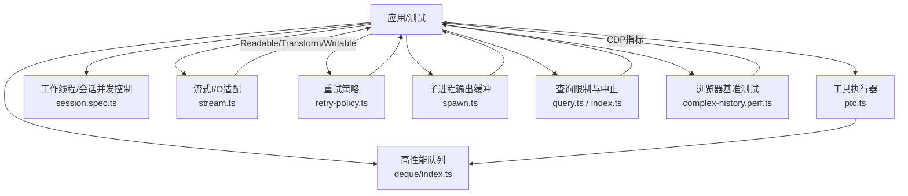

**图示来源**
- [packages/core/tools/src/ptc.ts:388-416](file://packages/core/tools/src/ptc.ts#L388-L416)
- [packages/experimental/webworker-runtime/src/node/builtin_modules/implemented/stream.ts:1-85](file://packages/experimental/webworker-runtime/src/node/builtin_modules/implemented/stream.ts#L1-L85)
- [packages/util/deque/src/index.ts:1-43](file://packages/util/deque/src/index.ts#L1-L43)
- [packages/llm/llm/src/retry-policy.ts:1-196](file://packages/llm/llm/src/retry-policy.ts#L1-L196)
- [packages/subprocess/subprocess-local/src/spawn.ts:145-175](file://packages/subprocess/subprocess-local/src/spawn.ts#L145-L175)
- [packages/session-query/session-query-sqlite/src/query.ts:29-64](file://packages/session-query/session-query-sqlite/src/query.ts#L29-L64)
- [packages/session-query/session-query-sqlite/src/index.ts:1093-1132](file://packages/session-query/session-query-sqlite/src/index.ts#L1093-L1132)
- [apps/web/tests/complex-history.perf.ts:1-800](file://apps/web/tests/complex-history.perf.ts#L1-L800)

**章节来源**
- [packages/experimental/webworker-runtime/src/node/builtin_modules/implemented/stream.ts:1-85](file://packages/experimental/webworker-runtime/src/node/builtin_modules/implemented/stream.ts#L1-L85)
- [packages/util/deque/src/index.ts:1-43](file://packages/util/deque/src/index.ts#L1-L43)
- [.agents/notes/implemented/bug-fix/2026-08-28-linear-stream-queue-drain.md:1-17](file://.agents/notes/implemented/bug-fix/2026-08-28-linear-stream-queue-drain.md#L1-L17)
- [packages/core/tools/src/ptc.ts:388-416](file://packages/core/tools/src/ptc.ts#L388-L416)
- [packages/workflow/workflow-worker-thread/tests/session.spec.ts:386-407](file://packages/workflow/workflow-worker-thread/tests/session.spec.ts#L386-L407)
- [scripts/run-gates.ts:159-195](file://scripts/run-gates.ts#L159-L195)
- [packages/llm/llm/src/retry-policy.ts:1-196](file://packages/llm/llm/src/retry-policy.ts#L1-L196)
- [packages/subprocess/subprocess-local/src/spawn.ts:145-175](file://packages/subprocess/subprocess-local/src/spawn.ts#L145-L175)
- [packages/session-query/session-query-sqlite/src/query.ts:29-64](file://packages/session-query/session-query-sqlite/src/query.ts#L29-L64)
- [packages/session-query/session-query-sqlite/src/index.ts:1093-1132](file://packages/session-query/session-query-sqlite/src/index.ts#L1093-L1132)
- [apps/web/tests/complex-history.perf.ts:1-800](file://apps/web/tests/complex-history.perf.ts#L1-L800)

## 核心组件
- 流式 I/O 适配层：封装 readable-stream，暴露 Readable/Transform/Writable/pipeline/promises 等 API，统一默认 highWaterMark，确保跨环境一致的背压与事件顺序。
- 高性能队列 Deque：环形数组实现，pushBack/pushFront/popFront 均摊常数时间，避免 Array.shift 导致的二次移动；容量翻倍/缩容策略保持内存稳定。
- 工具执行器驱动循环：维护提交队列与待执行队列，支持独占模式串行化，空队列/空闲池即静默，避免忙轮询。
- 并发控制与限流：通过配置限制最大并发代理数或工具并行调用数，保证 FIFO 顺序与资源保护。
- 重试策略：支持 normal（有限次数+可重试错误码）与 always（无限重试直到取消/销毁），内置指数退避与对称抖动，参数校验严格。
- 子进程输出缓冲：内存窗口 + 溢出落盘，按字节上限丢弃头部块或裁剪头块，保证尾部诊断信息完整。
- 查询限制与中止：限制 SQLite FTS5 外部谓词数量与绑定变量上限；通过 AbortSignal 中止查询并清理监听。
- 浏览器基准测试：基于 Playwright 与 CDP 采集 TaskDuration/ScriptDuration/LayoutDuration/RecalcStyleDuration/DevToolsCommandDuration/Nodes/JSEventListeners/JSHeapUsedSize 等指标，结合 MutationObserver 统计 DOM 变更批次与记录数。

**章节来源**
- [packages/experimental/webworker-runtime/src/node/builtin_modules/implemented/stream.ts:1-85](file://packages/experimental/webworker-runtime/src/node/builtin_modules/implemented/stream.ts#L1-L85)
- [packages/util/deque/src/index.ts:1-43](file://packages/util/deque/src/index.ts#L1-L43)
- [packages/core/tools/src/ptc.ts:388-416](file://packages/core/tools/src/ptc.ts#L388-L416)
- [packages/core/tools/tests/ptc.spec.ts:551-604](file://packages/core/tools/tests/ptc.spec.ts#L551-L604)
- [packages/workflow/workflow-worker-thread/tests/session.spec.ts:386-407](file://packages/workflow/workflow-worker-thread/tests/session.spec.ts#L386-L407)
- [packages/llm/llm/src/retry-policy.ts:1-196](file://packages/llm/llm/src/retry-policy.ts#L1-L196)
- [packages/subprocess/subprocess-local/src/spawn.ts:145-175](file://packages/subprocess/subprocess-local/src/spawn.ts#L145-L175)
- [packages/session-query/session-query-sqlite/src/query.ts:29-64](file://packages/session-query/session-query-sqlite/src/query.ts#L29-L64)
- [packages/session-query/session-query-sqlite/src/index.ts:1093-1132](file://packages/session-query/session-query-sqlite/src/index.ts#L1093-L1132)
- [apps/web/tests/complex-history.perf.ts:1-800](file://apps/web/tests/complex-history.perf.ts#L1-L800)

## 架构总览
下图展示了从上层应用到各底层能力的调用关系，包括流式 I/O、队列、执行器、并发控制、重试、子进程缓冲、查询限制与基准测试。

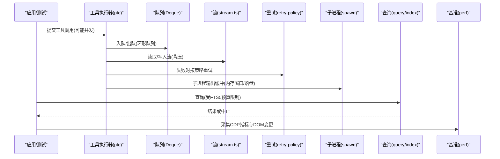

**图示来源**
- [packages/core/tools/src/ptc.ts:388-416](file://packages/core/tools/src/ptc.ts#L388-L416)
- [packages/util/deque/src/index.ts:1-43](file://packages/util/deque/src/index.ts#L1-L43)
- [packages/experimental/webworker-runtime/src/node/builtin_modules/implemented/stream.ts:1-85](file://packages/experimental/webworker-runtime/src/node/builtin_modules/implemented/stream.ts#L1-L85)
- [packages/llm/llm/src/retry-policy.ts:1-196](file://packages/llm/llm/src/retry-policy.ts#L1-L196)
- [packages/subprocess/subprocess-local/src/spawn.ts:145-175](file://packages/subprocess/subprocess-local/src/spawn.ts#L145-L175)
- [packages/session-query/session-query-sqlite/src/query.ts:29-64](file://packages/session-query/session-query-sqlite/src/query.ts#L29-L64)
- [packages/session-query/session-query-sqlite/src/index.ts:1093-1132](file://packages/session-query/session-query-sqlite/src/index.ts#L1093-L1132)
- [apps/web/tests/complex-history.perf.ts:1-800](file://apps/web/tests/complex-history.perf.ts#L1-L800)

## 详细组件分析

### 流式数据处理与背压优化
- 使用 readable-stream 作为跨平台 Stream 实现，统一背压、异步迭代与中止处理，设置默认 highWaterMark 为 64 KiB，匹配 Node 22+ 行为。
- 通过 pipeline/promises 组合可读/转换/可写流，减少手动状态管理，提高吞吐与稳定性。
- 在 Worker 环境中仅持有平台适配器（如 VFS 文件流），流状态与事件顺序由 readable-stream 维护，降低自定义实现的复杂度与风险。

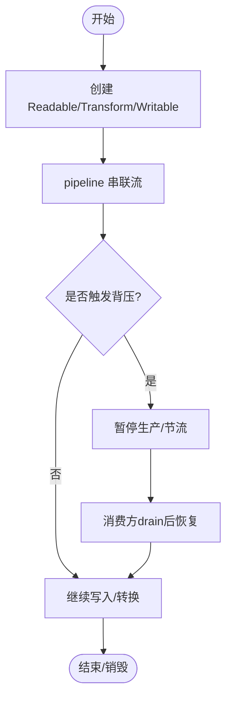

**图示来源**
- [packages/experimental/webworker-runtime/src/node/builtin_modules/implemented/stream.ts:1-85](file://packages/experimental/webworker-runtime/src/node/builtin_modules/implemented/stream.ts#L1-L85)

**章节来源**
- [packages/experimental/webworker-runtime/src/node/builtin_modules/implemented/stream.ts:1-85](file://packages/experimental/webworker-runtime/src/node/builtin_modules/implemented/stream.ts#L1-L85)

### 高性能队列与线性排空
- 使用环形双端队列 Deque，pushBack/pushFront/popFront 均为常数时间，移除时立即清空槽位，避免 Array.shift 造成的二次移动。
- 容量翻倍与缩容策略：满则翻倍，非空且降至四分之一容量时减半，保证增长与压缩的均摊常数时间与空闲存储有界。
- 解决长生命周期流队列积压导致的性能问题（V8 MoveRange/memmove 热点）。

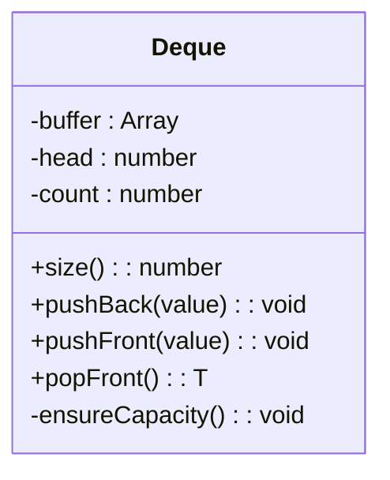

**图示来源**
- [packages/util/deque/src/index.ts:1-43](file://packages/util/deque/src/index.ts#L1-L43)

**章节来源**
- [packages/util/deque/src/index.ts:1-43](file://packages/util/deque/src/index.ts#L1-L43)
- [.agents/notes/implemented/bug-fix/2026-08-28-linear-stream-queue-drain.md:1-17](file://.agents/notes/implemented/bug-fix/2026-08-28-linear-stream-queue-drain.md#L1-L17)

### 工具调用并发控制与独占模式
- 工具执行器维护提交队列与待执行队列，驱动循环在空队列/空闲池时进入等待，避免忙轮询。
- 支持 exclusive 模式：独占调用会阻塞其他调用，确保关键路径的串行执行；普通调用可在池内并行。
- 测试覆盖：maxParallelSubCalls 限制重叠窗口；exclusive 调用前后安全调用的顺序与隔离。

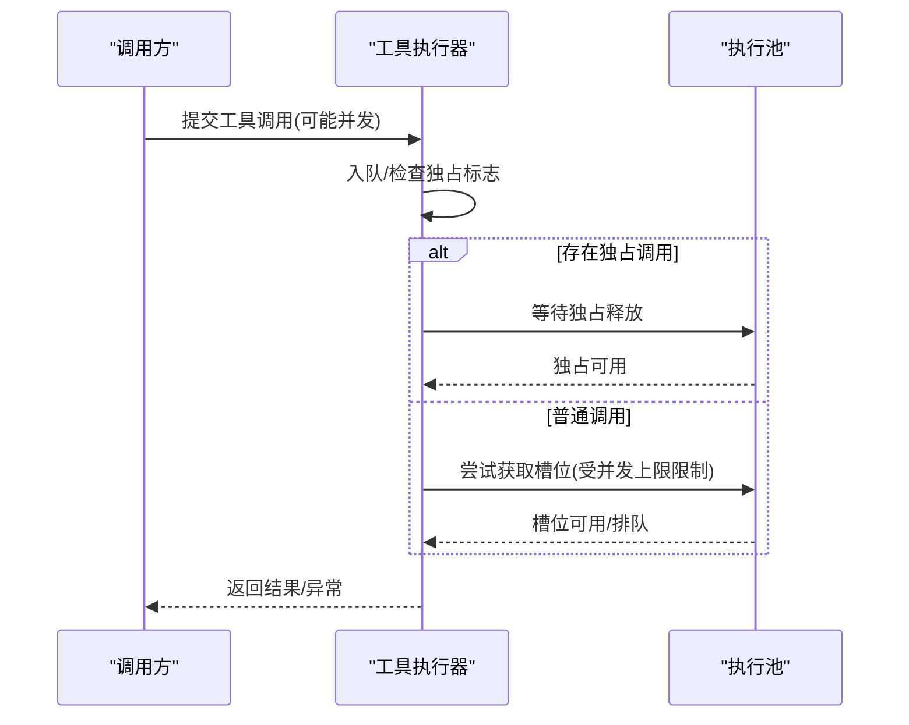

**图示来源**
- [packages/core/tools/src/ptc.ts:388-416](file://packages/core/tools/src/ptc.ts#L388-L416)
- [packages/core/tools/tests/ptc.spec.ts:551-604](file://packages/core/tools/tests/ptc.spec.ts#L551-L604)

**章节来源**
- [packages/core/tools/src/ptc.ts:388-416](file://packages/core/tools/src/ptc.ts#L388-L416)
- [packages/core/tools/tests/ptc.spec.ts:551-604](file://packages/core/tools/tests/ptc.spec.ts#L551-L604)

### 工作线程/会话并发控制（FIFO 队列）
- 通过 maxConcurrentAgents/maxTotalAgents 限制并发与总量，未达上限的任务进入队列按 FIFO 执行。
- 测试验证：超过总量时报错并报告已启动数量；并发上限为 1 时，并行任务按顺序完成。

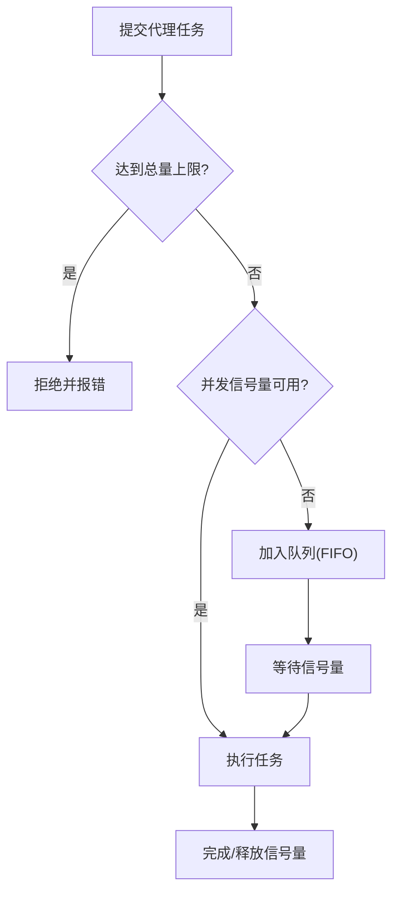

**图示来源**
- [packages/workflow/workflow-worker-thread/tests/session.spec.ts:386-407](file://packages/workflow/workflow-worker-thread/tests/session.spec.ts#L386-L407)

**章节来源**
- [packages/workflow/workflow-worker-thread/tests/session.spec.ts:386-407](file://packages/workflow/workflow-worker-thread/tests/session.spec.ts#L386-L407)

### 重试策略与指数退避
- 支持两种模式：normal（限定次数与可重试错误码）与 always（无限重试直至取消/销毁）。
- 指数退避参数：initialDelayMs、maxDelayMs、jitterRatio，严格校验范围与合法性。
- 默认重试码包含空响应、速率限制、服务端错误、超时、传输错误等。

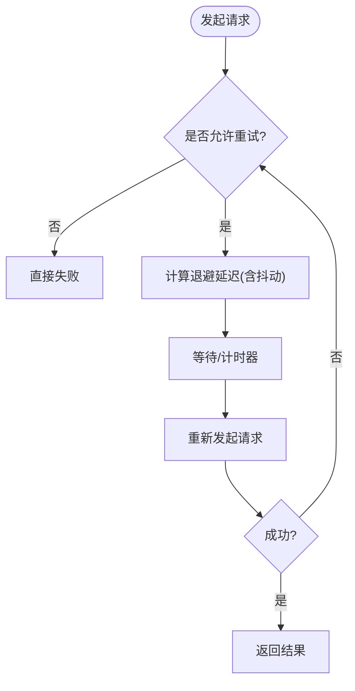

**图示来源**
- [packages/llm/llm/src/retry-policy.ts:1-196](file://packages/llm/llm/src/retry-policy.ts#L1-L196)

**章节来源**
- [packages/llm/llm/src/retry-policy.ts:1-196](file://packages/llm/llm/src/retry-policy.ts#L1-L196)

### 子进程输出缓冲与内存控制
- 维护内存窗口，超过阈值时打开溢出文件并将后续数据追加到磁盘；内存尾部按字节精确裁剪，保证最后 N 字节保留用于诊断。
- 通过 total/bytes/dropped 跟踪总体大小与丢弃情况，避免峰值内存爆炸。

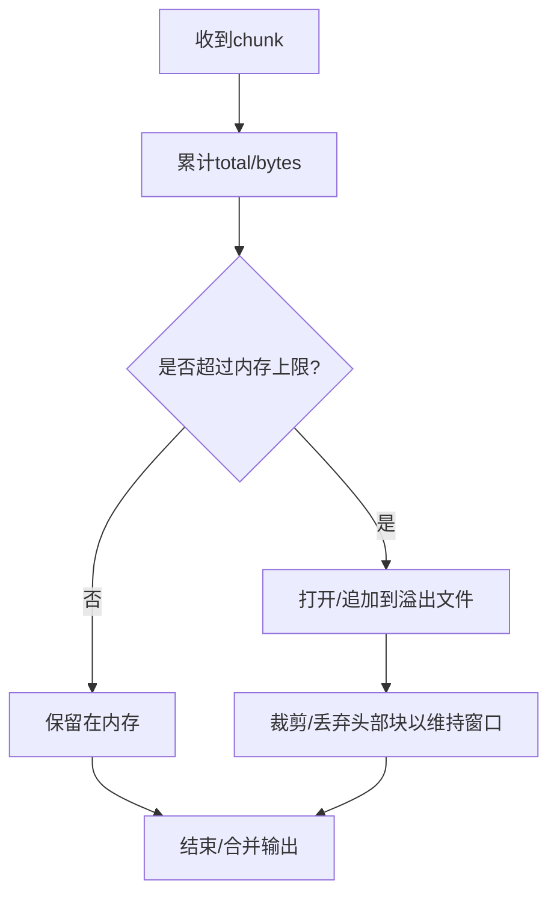

**图示来源**
- [packages/subprocess/subprocess-local/src/spawn.ts:145-175](file://packages/subprocess/subprocess-local/src/spawn.ts#L145-L175)

**章节来源**
- [packages/subprocess/subprocess-local/src/spawn.ts:145-175](file://packages/subprocess/subprocess-local/src/spawn.ts#L145-L175)

### 查询限制与中止
- 限制 SQLite FTS5 外部谓词数量与绑定变量上限，防止生成不可用或低效查询。
- 通过 AbortSignal 中止查询，并在 then/catch 中移除监听，避免泄漏。

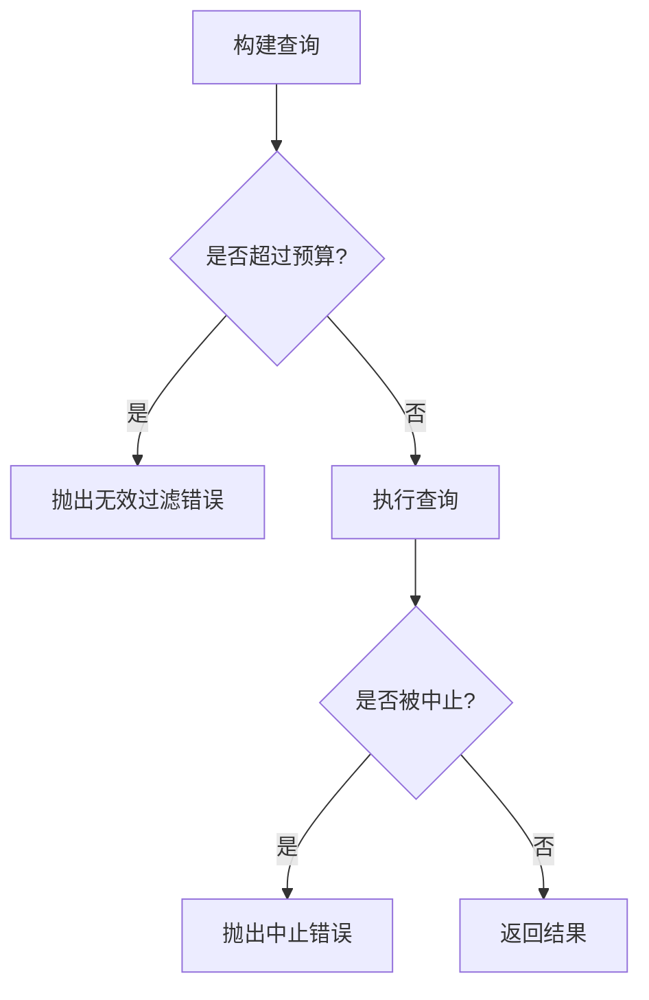

**图示来源**
- [packages/session-query/session-query-sqlite/src/query.ts:29-64](file://packages/session-query/session-query-sqlite/src/query.ts#L29-L64)
- [packages/session-query/session-query-sqlite/src/index.ts:1093-1132](file://packages/session-query/session-query-sqlite/src/index.ts#L1093-L1132)

**章节来源**
- [packages/session-query/session-query-sqlite/src/query.ts:29-64](file://packages/session-query/session-query-sqlite/src/query.ts#L29-L64)
- [packages/session-query/session-query-sqlite/src/index.ts:1093-1132](file://packages/session-query/session-query-sqlite/src/index.ts#L1093-L1132)

### 性能测试方法与指标采集
- 使用 Playwright 启动 Chromium，通过 CDP 采集 TaskDuration、ScriptDuration、LayoutDuration、RecalcStyleDuration、DevToolsCommandDuration、Nodes、JSEventListeners、JSHeapUsedSize 等指标。
- 使用 MutationObserver 统计 DOM 变更批次与记录数，评估流式渲染效率。
- 通过 before/after 差值计算增量耗时，结合 wallMs 与 heapDeltaMb 评估整体性能变化。

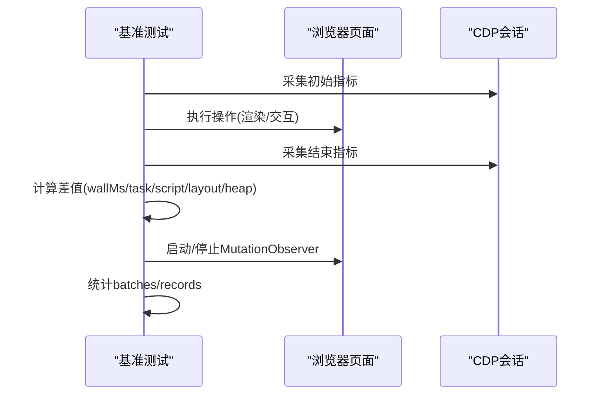

**图示来源**
- [apps/web/tests/complex-history.perf.ts:1-800](file://apps/web/tests/complex-history.perf.ts#L1-L800)

**章节来源**
- [apps/web/tests/complex-history.perf.ts:1-800](file://apps/web/tests/complex-history.perf.ts#L1-L800)

## 依赖关系分析
- 流式 I/O 依赖 readable-stream，确保跨平台一致性与维护性。
- 工具执行器依赖队列与执行池，配合独占模式与并发上限。
- 重试策略独立于具体网络栈，通过错误码与退避参数控制。
- 子进程输出缓冲与查询限制分别针对 I/O 与数据库场景进行资源保护。
- 基准测试依赖 Playwright 与 CDP，不侵入业务代码。

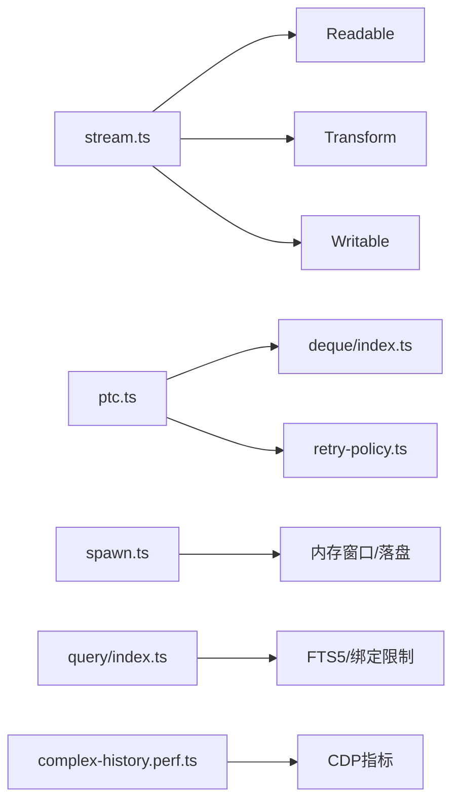

**图示来源**
- [packages/experimental/webworker-runtime/src/node/builtin_modules/implemented/stream.ts:1-85](file://packages/experimental/webworker-runtime/src/node/builtin_modules/implemented/stream.ts#L1-L85)
- [packages/core/tools/src/ptc.ts:388-416](file://packages/core/tools/src/ptc.ts#L388-L416)
- [packages/util/deque/src/index.ts:1-43](file://packages/util/deque/src/index.ts#L1-L43)
- [packages/llm/llm/src/retry-policy.ts:1-196](file://packages/llm/llm/src/retry-policy.ts#L1-L196)
- [packages/subprocess/subprocess-local/src/spawn.ts:145-175](file://packages/subprocess/subprocess-local/src/spawn.ts#L145-L175)
- [packages/session-query/session-query-sqlite/src/query.ts:29-64](file://packages/session-query/session-query-sqlite/src/query.ts#L29-L64)
- [apps/web/tests/complex-history.perf.ts:1-800](file://apps/web/tests/complex-history.perf.ts#L1-L800)

**章节来源**
- [packages/experimental/webworker-runtime/src/node/builtin_modules/implemented/stream.ts:1-85](file://packages/experimental/webworker-runtime/src/node/builtin_modules/implemented/stream.ts#L1-L85)
- [packages/core/tools/src/ptc.ts:388-416](file://packages/core/tools/src/ptc.ts#L388-L416)
- [packages/util/deque/src/index.ts:1-43](file://packages/util/deque/src/index.ts#L1-L43)
- [packages/llm/llm/src/retry-policy.ts:1-196](file://packages/llm/llm/src/retry-policy.ts#L1-L196)
- [packages/subprocess/subprocess-local/src/spawn.ts:145-175](file://packages/subprocess/subprocess-local/src/spawn.ts#L145-L175)
- [packages/session-query/session-query-sqlite/src/query.ts:29-64](file://packages/session-query/session-query-sqlite/src/query.ts#L29-L64)
- [apps/web/tests/complex-history.perf.ts:1-800](file://apps/web/tests/complex-history.perf.ts#L1-L800)

## 性能考量
- 队列选择：优先使用环形双端队列避免 Array.shift 的二次移动，降低事件循环阻塞。
- 背压管理：合理设置 highWaterMark，使用 pipeline 自动协调生产/消费速率。
- 并发控制：根据 CPU 与 I/O 特性调整并发上限，避免过度并行导致上下文切换与内存膨胀。
- 批处理与合并：将小 I/O 合并为较大块写入，减少系统调用与拷贝次数；对日志输出采用窗口合并与落盘策略。
- 重试策略：为易失性错误启用指数退避与抖动，避免雪崩；对稳定错误快速失败。
- 查询优化：限制谓词与绑定数量，避免生成低效 SQL；必要时分页与缓存。
- 基准测试：使用 CDP 指标与 MutationObserver 量化渲染与脚本开销，关注 wallMs、scriptMs、layoutMs、heapDeltaMb。

[本节为通用指导，无需特定文件引用]

## 故障排查指南
- 流式卡顿：检查 highWaterMark 与消费者 drain 逻辑，确认背压是否被正确传播。
- 队列积压：确认是否使用 Deque 而非 Array.shift；监控队列长度与消费速率。
- 并发超限：核对 maxConcurrentAgents/maxTotalAgents 与工具并行上限，观察 FIFO 顺序是否符合预期。
- 重试风暴：检查 retryableCodes 与 backoff 参数，避免过短延迟或过大抖动导致放大效应。
- 子进程内存飙升：确认溢出落盘开关与内存窗口大小，检查尾部裁剪是否正确。
- 查询失败：核对 FTS5 外部谓词与绑定变量限制，必要时拆分查询或增加索引。
- 基准不稳定：确保 CDP 指标可用，关闭无关 DevTools 命令，重复多次取中位数。

**章节来源**
- [packages/experimental/webworker-runtime/src/node/builtin_modules/implemented/stream.ts:1-85](file://packages/experimental/webworker-runtime/src/node/builtin_modules/implemented/stream.ts#L1-L85)
- [packages/util/deque/src/index.ts:1-43](file://packages/util/deque/src/index.ts#L1-L43)
- [packages/workflow/workflow-worker-thread/tests/session.spec.ts:386-407](file://packages/workflow/workflow-worker-thread/tests/session.spec.ts#L386-L407)
- [packages/llm/llm/src/retry-policy.ts:1-196](file://packages/llm/llm/src/retry-policy.ts#L1-L196)
- [packages/subprocess/subprocess-local/src/spawn.ts:145-175](file://packages/subprocess/subprocess-local/src/spawn.ts#L145-L175)
- [packages/session-query/session-query-sqlite/src/query.ts:29-64](file://packages/session-query/session-query-sqlite/src/query.ts#L29-L64)
- [apps/web/tests/complex-history.perf.ts:1-800](file://apps/web/tests/complex-history.perf.ts#L1-L800)

## 结论
通过环形队列、流式背压、并发限流、重试退避、查询限制与基准测试，本仓库在高并发与长时运行场景下实现了稳定的异步性能。建议在生产环境中：
- 使用 Deque 替代数组队列，避免二次移动。
- 以 pipeline 组织流式处理，合理设置 highWaterMark。
- 根据负载动态调整并发上限，确保 FIFO 与资源保护。
- 为易失性错误配置指数退避与抖动，避免雪崩。
- 对大 I/O 采用窗口合并与落盘，控制峰值内存。
- 使用 CDP 指标与 MutationObserver 持续监控性能回归。

[本节为总结，无需特定文件引用]

## 附录
- 运行基准：参考仓库说明文档，使用 Python SDK 的最小变体进行独立任务基准测试。

**章节来源**
- [BENCHMARK.md:1-4](file://BENCHMARK.md#L1-L4)