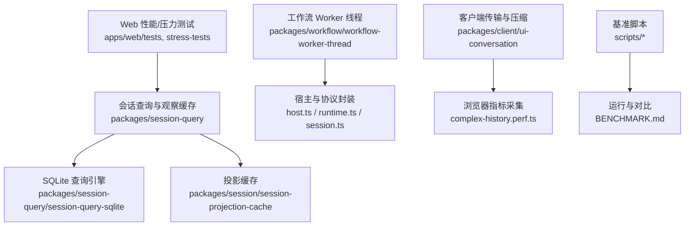
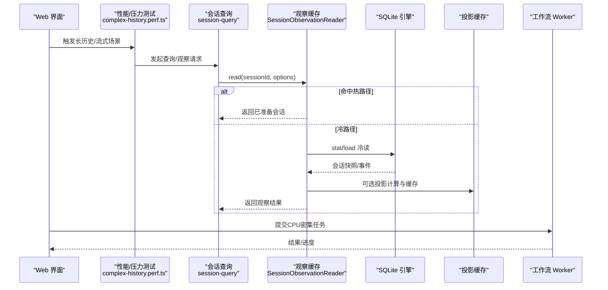
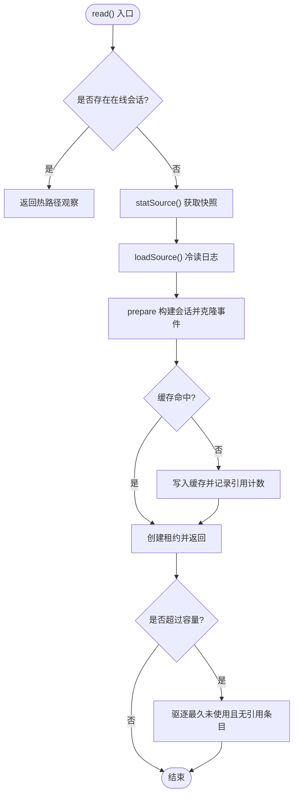
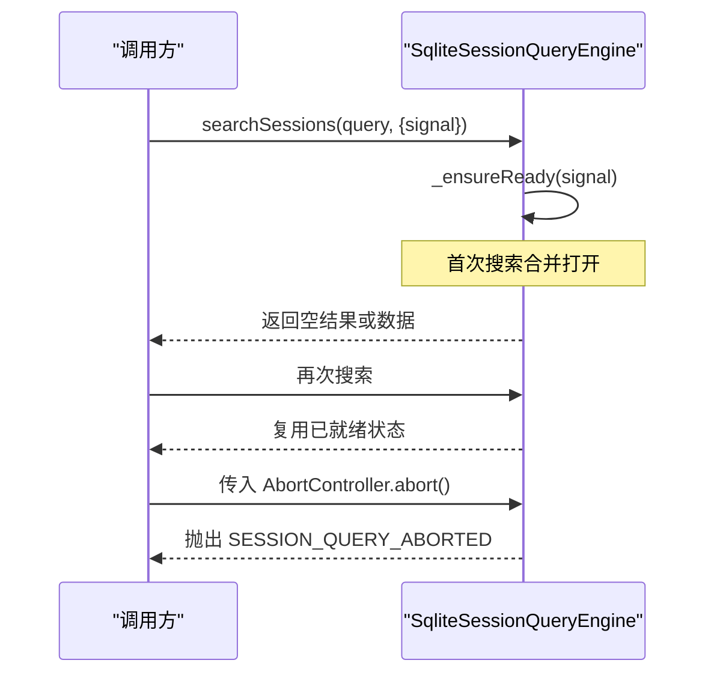
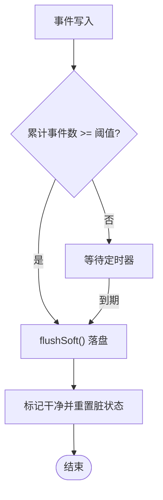
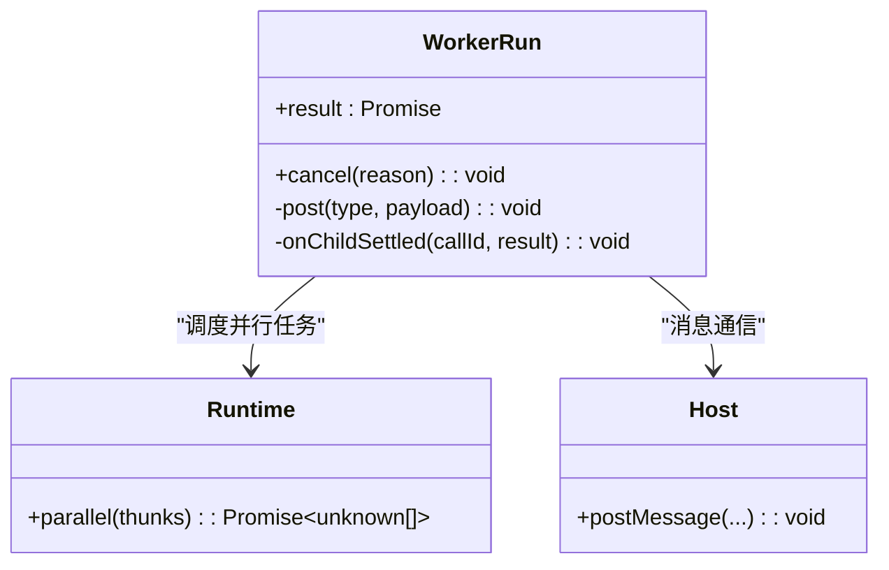
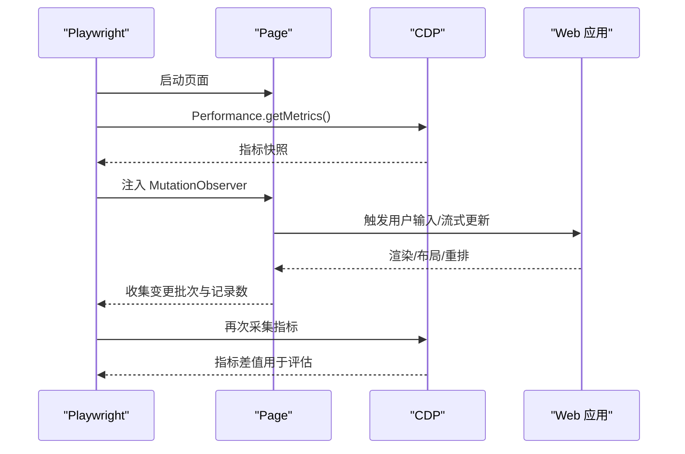
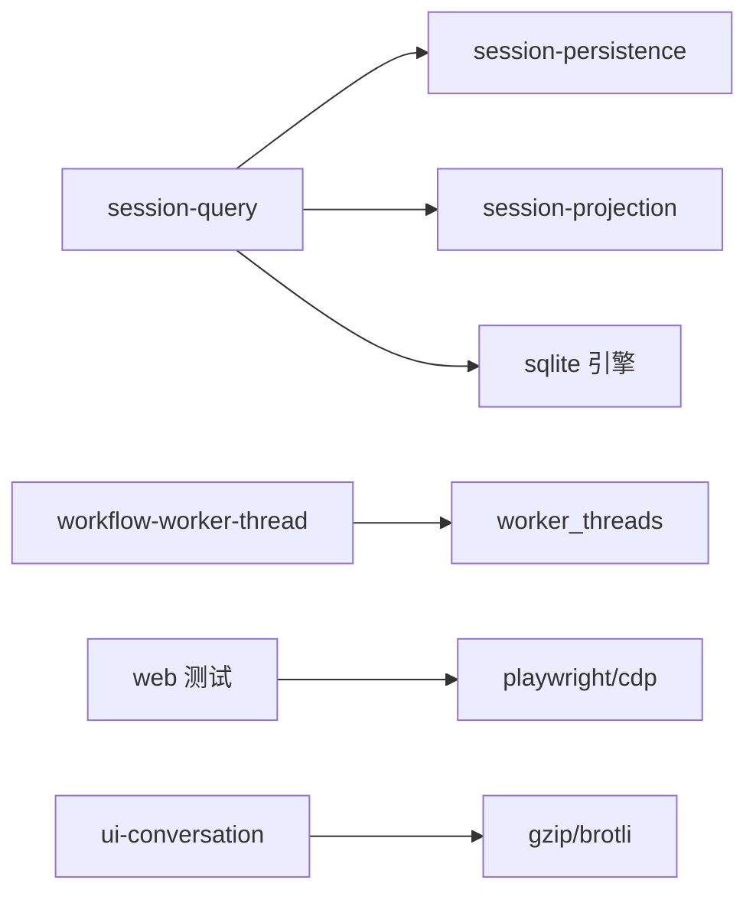

# 性能优化

<cite>
**本文引用的文件**
- [BENCHMARK.md](file://BENCHMARK.md)
- [vitest.web-stress.config.ts](file://vitest.web-stress.config.ts)
- [complex-history.perf.ts](file://apps/web/tests/complex-history.perf.ts)
- [reasoning-chunks.stress.ts](file://apps/web/stress-tests/reasoning-chunks.stress.ts)
- [observation.ts](file://packages/session-query/session-query/src/observation.ts)
- [index.ts（session-query）](file://packages/session-query/session-query/src/index.ts)
- [sqlite.spec.ts](file://packages/session-query/session-query-sqlite/tests/sqlite.spec.ts)
- [cache.spec.ts](file://packages/session/session-projection-cache/tests/cache.spec.ts)
- [index.ts（session-projection-cache）](file://packages/session/session-projection-cache/src/index.ts)
- [host.ts](file://packages/workflow/workflow-worker-thread/src/host.ts)
- [runtime.ts](file://packages/workflow/workflow-worker-thread/src/runtime.ts)
- [session.ts](file://packages/workflow/workflow-worker-thread/src/session.ts)
- [os.ts（webworker-runtime）](file://packages/experimental/webworker-runtime/src/node/builtin_modules/implemented/os.ts)
- [token-format.ts](file://packages/client/ui-chat/src/client/chat/token-format.ts)
- [history-transport.perf.client.ts](file://packages/client/ui-conversation/tests/history-transport.perf.client.ts)
- [benchmark-npm-resolution.ts](file://scripts/benchmark-npm-resolution.ts)
- [benchmark-next-package-dependency.ts](file://scripts/benchmark-next-package-dependency.ts)
</cite>

## 目录
1. [简介](#简介)
2. [项目结构](#项目结构)
3. [核心组件](#核心组件)
4. [架构总览](#架构总览)
5. [详细组件分析](#详细组件分析)
6. [依赖关系分析](#依赖关系分析)
7. [性能考量](#性能考量)
8. [故障排查指南](#故障排查指南)
9. [结论](#结论)
10. [附录](#附录)

## 简介
本指南面向在 deepseek-harness 中实现高性能、低内存占用与稳定吞吐的开发者。内容覆盖：
- 内存管理与垃圾回收优化策略
- 异步操作调优：Promise 池化、流式处理与背压控制
- 数据库查询优化与缓存策略
- CPU 密集型任务优化：Worker 线程与算法优化
- 性能监控工具与瓶颈定位技巧
- 性能测试与基准测试实践

## 项目结构
仓库采用多包多应用结构，性能相关能力分布在以下区域：
- Web 端压力与性能测试：apps/web/tests 与 apps/web/stress-tests
- 会话查询与观察缓存：packages/session-query
- 投影缓存与持久化：packages/session/session-projection-cache
- 工作流 Worker 线程：packages/workflow/workflow-worker-thread
- 客户端传输与压缩：packages/client/ui-conversation
- 基准脚本：scripts/*

**图表来源**
- [complex-history.perf.ts:1-120](file://apps/web/tests/complex-history.perf.ts#L1-L120)
- [observation.ts:1-120](file://packages/session-query/session-query/src/observation.ts#L1-L120)
- [sqlite.spec.ts:301-330](file://packages/session-query/session-query-sqlite/tests/sqlite.spec.ts#L301-L330)
- [cache.spec.ts:128-143](file://packages/session/session-projection-cache/tests/cache.spec.ts#L128-L143)
- [host.ts:105-172](file://packages/workflow/workflow-worker-thread/src/host.ts#L105-L172)
- [benchmark-npm-resolution.ts:105-143](file://scripts/benchmark-npm-resolution.ts#L105-L143)

**章节来源**
- [BENCHMARK.md:1-4](file://BENCHMARK.md#L1-L4)
- [vitest.web-stress.config.ts:1-15](file://vitest.web-stress.config.ts#L1-L15)

## 核心组件
- 会话观察与冷读缓存：SessionObservationReader 提供“优先热路径、回退冷路径”的观察读取，带容量上限与租约机制，避免无限增长并保证一致性。
- SQLite 查询引擎：支持延迟打开、并发合并、取消传播与失败隔离，保障高并发下的稳定性。
- 投影缓存：按事件阈值或时间间隔落盘，降低写放大；会话销毁时安全分离与清理。
- 工作流 Worker 线程：宿主侧管理 Worker 生命周期、消息投递、子任务并行与取消，隔离执行环境。
- Web 性能/压力测试：基于 Playwright + CDP 采集浏览器指标，构造大规模历史与流式数据，验证渲染与交互响应。
- 客户端传输与压缩：对比 gzip/brotli 等压缩方案对体积与内存峰值的影响，指导网络与存储优化。

**章节来源**
- [observation.ts:75-157](file://packages/session-query/session-query/src/observation.ts#L75-L157)
- [sqlite.spec.ts:301-330](file://packages/session-query/session-query-sqlite/tests/sqlite.spec.ts#L301-L330)
- [cache.spec.ts:236-262](file://packages/session/session-projection-cache/tests/cache.spec.ts#L236-L262)
- [host.ts:105-200](file://packages/workflow/workflow-worker-thread/src/host.ts#L105-L200)
- [complex-history.perf.ts:524-585](file://apps/web/tests/complex-history.perf.ts#L524-L585)
- [history-transport.perf.client.ts:496-523](file://packages/client/ui-conversation/tests/history-transport.perf.client.ts#L496-L523)

## 架构总览
下图展示从 Web 端到后端查询与缓存的关键路径，以及 Worker 线程如何承载 CPU 密集任务。

**图表来源**
- [complex-history.perf.ts:524-585](file://apps/web/tests/complex-history.perf.ts#L524-L585)
- [observation.ts:93-157](file://packages/session-query/session-query/src/observation.ts#L93-L157)
- [sqlite.spec.ts:301-330](file://packages/session-query/session-query-sqlite/tests/sqlite.spec.ts#L301-L330)
- [cache.spec.ts:236-262](file://packages/session/session-projection-cache/tests/cache.spec.ts#L236-L262)
- [host.ts:105-200](file://packages/workflow/workflow-worker-thread/src/host.ts#L105-L200)

## 详细组件分析

### 会话观察与冷读缓存（SessionObservationReader）
- 设计要点
  - 优先使用在线 Session，否则走冷路径加载持久化日志。
  - 冷读结果按 persistence 实例与 revision 缓存，避免重复 IO。
  - 通过租约（retain/dispose）控制条目驻留与淘汰，超出容量时驱逐最久未使用的非 pinned 条目。
  - 支持取消信号，避免阻塞与资源泄漏。
- 复杂度与性能
  - 查找 O(1)，淘汰线性扫描但仅在超限时触发。
  - 租约模式确保并发读取的一致性，减少锁竞争。
- 错误与边界
  - 持久化失败映射为统一错误码；源冲突、损坏会话有明确诊断。
- 优化建议
  - 合理设置 preparedSessionCacheSize 与 persistedReadConcurrency。
  - 对高频访问的会话可启用投影计算以加速后续读取。

**图表来源**
- [observation.ts:93-157](file://packages/session-query/session-query/src/observation.ts#L93-L157)
- [observation.ts:222-268](file://packages/session-query/session-query/src/observation.ts#L222-L268)

**章节来源**
- [observation.ts:75-157](file://packages/session-query/session-query/src/observation.ts#L75-L157)
- [observation.ts:222-268](file://packages/session-query/session-query/src/observation.ts#L222-L268)
- [index.ts（session-query）:100-131](file://packages/session-query/session-query/src/index.ts#L100-L131)

### SQLite 查询引擎（延迟打开与并发合并）
- 关键特性
  - first-search 模式延迟打开数据库，减少启动开销。
  - 并发搜索共享一次就绪 Promise，避免重复初始化。
  - 支持取消：就绪后若被中止，不再进入 SQLite 访问。
  - 失败隔离：索引损坏等错误不会污染外部数据库。
- 性能影响
  - 延迟打开与并发合并显著降低冷启动与高并发下的争用。
  - 取消传播避免无效 IO 与 CPU 浪费。

**图表来源**
- [sqlite.spec.ts:301-330](file://packages/session-query/session-query-sqlite/tests/sqlite.spec.ts#L301-L330)
- [sqlite.spec.ts:1710-1741](file://packages/session-query/session-query-sqlite/tests/sqlite.spec.ts#L1710-L1741)

**章节来源**
- [sqlite.spec.ts:301-330](file://packages/session-query/session-query-sqlite/tests/sqlite.spec.ts#L301-L330)
- [sqlite.spec.ts:1710-1741](file://packages/session-query/session-query-sqlite/tests/sqlite.spec.ts#L1710-L1741)

### 投影缓存（按事件/时间落盘）
- 行为
  - 达到 writeEveryEvents 阈值或到达 writeIntervalMs 时触发 flush。
  - 会话销毁时 detach 并清理定时器，避免悬挂任务。
- 性能收益
  - 将频繁写入聚合为批量落盘，降低写放大。
  - 独立 per-session 文件布局避免单点故障扩散。

**图表来源**
- [cache.spec.ts:236-262](file://packages/session/session-projection-cache/tests/cache.spec.ts#L236-L262)
- [index.ts（session-projection-cache）:331-352](file://packages/session/session-projection-cache/src/index.ts#L331-L352)

**章节来源**
- [cache.spec.ts:236-262](file://packages/session/session-projection-cache/tests/cache.spec.ts#L236-L262)
- [index.ts（session-projection-cache）:331-352](file://packages/session/session-projection-cache/src/index.ts#L331-L352)

### 工作流 Worker 线程（CPU 密集任务隔离）
- 宿主职责
  - 管理 Worker 生命周期、消息投递、子任务并行与取消。
  - 隔离执行环境，不继承敏感环境变量。
- 运行时能力
  - parallel(thunks) 并发执行回调，捕获非致命错误并返回 null。
  - 子进程通信通过 postMessage，异常容忍与幂等清理。
- 性能建议
  - 根据硬件并发度调整并行度，避免过度上下文切换。
  - 大对象尽量结构化克隆传递，减少序列化成本。

**图表来源**
- [host.ts:105-200](file://packages/workflow/workflow-worker-thread/src/host.ts#L105-L200)
- [runtime.ts:401-426](file://packages/workflow/workflow-worker-thread/src/runtime.ts#L401-L426)
- [session.ts:104-131](file://packages/workflow/workflow-worker-thread/src/session.ts#L104-L131)

**章节来源**
- [host.ts:105-200](file://packages/workflow/workflow-worker-thread/src/host.ts#L105-L200)
- [runtime.ts:401-426](file://packages/workflow/workflow-worker-thread/src/runtime.ts#L401-L426)
- [session.ts:104-131](file://packages/workflow/workflow-worker-thread/src/session.ts#L104-L131)

### Web 性能/压力测试（浏览器指标与流控）
- 指标采集
  - 通过 CDP 获取 TaskDuration、ScriptDuration、LayoutDuration、RecalcStyleDuration、DevToolsCommandDuration、Nodes、JSEventListeners、JSHeapUsedSize 等。
  - 自定义 MutationObserver 统计 DOM 变更批次与记录数。
- 场景构造
  - 长历史会话（500 turn）、大量工具调用、流式增量文本与工具调用。
  - 压力测试注入 100,000 个推理块，测量主线程最大延迟与交互响应。
- 性能目标
  - 保持交互响应预算（例如主线程延迟 < 250ms）。
  - 控制节点与监听器增长，避免内存泄漏。

**图表来源**
- [complex-history.perf.ts:524-585](file://apps/web/tests/complex-history.perf.ts#L524-L585)
- [reasoning-chunks.stress.ts:46-154](file://apps/web/stress-tests/reasoning-chunks.stress.ts#L46-L154)

**章节来源**
- [complex-history.perf.ts:1-120](file://apps/web/tests/complex-history.perf.ts#L1-L120)
- [reasoning-chunks.stress.ts:46-154](file://apps/web/stress-tests/reasoning-chunks.stress.ts#L46-L154)

### 客户端传输与压缩（gzip/brotli 与内存峰值）
- 对比维度
  - 原始与压缩后的体积、耗时、主机/客户端额外堆峰值。
  - 压缩比与性能折中，选择合适策略。
- 实践建议
  - 对大负载使用 Brotli 获得更高压缩比，同时评估 CPU 与内存开销。
  - 结合流式传输与分片，降低单次峰值内存。

**章节来源**
- [history-transport.perf.client.ts:496-523](file://packages/client/ui-conversation/tests/history-transport.perf.client.ts#L496-L523)

## 依赖关系分析
- 模块耦合
  - session-query 依赖 session-persistence 与 session-projection，形成“热路径优先、冷路径回退”的解耦结构。
  - sqlite 引擎作为后端实现，通过接口与上层解耦，便于替换与扩展。
  - workflow-worker-thread 通过 host/runtime/session 协作，屏蔽底层 Worker 细节。
- 外部依赖
  - Playwright/CDP 用于浏览器指标采集。
  - Node worker_threads 用于 CPU 密集任务隔离。
  - 压缩库（gzip/brotli）用于传输优化。

**图表来源**
- [observation.ts:1-120](file://packages/session-query/session-query/src/observation.ts#L1-L120)
- [sqlite.spec.ts:301-330](file://packages/session-query/session-query-sqlite/tests/sqlite.spec.ts#L301-L330)
- [host.ts:105-200](file://packages/workflow/workflow-worker-thread/src/host.ts#L105-L200)
- [complex-history.perf.ts:524-585](file://apps/web/tests/complex-history.perf.ts#L524-L585)
- [history-transport.perf.client.ts:496-523](file://packages/client/ui-conversation/tests/history-transport.perf.client.ts#L496-L523)

**章节来源**
- [observation.ts:1-120](file://packages/session-query/session-query/src/observation.ts#L1-L120)
- [sqlite.spec.ts:301-330](file://packages/session-query/session-query-sqlite/tests/sqlite.spec.ts#L301-L330)
- [host.ts:105-200](file://packages/workflow/workflow-worker-thread/src/host.ts#L105-L200)
- [complex-history.perf.ts:524-585](file://apps/web/tests/complex-history.perf.ts#L524-L585)
- [history-transport.perf.client.ts:496-523](file://packages/client/ui-conversation/tests/history-transport.perf.client.ts#L496-L523)

## 性能考量
- 内存管理与垃圾回收
  - 使用租约模式（retain/dispose）精确控制对象生命周期，避免长期驻留。
  - 缓存容量限制与 LRU 淘汰，防止内存膨胀。
  - 大对象结构化克隆传递，减少闭包与意外引用。
- 异步操作调优
  - Promise 池化：通过并发度配置（如 persistedReadConcurrency）控制 IO 并发。
  - 流式处理：前端流式增量渲染，配合速率控制（如 STREAM_PACE_MS）避免主线程阻塞。
  - 背压控制：当管道满时暂停写入，避免堆积导致 OOM。
- 数据库查询优化
  - 延迟打开与并发合并，减少冷启动与重复初始化。
  - 取消传播，及时释放资源。
  - 投影缓存与冷读缓存叠加，提升热点访问性能。
- CPU 密集型任务
  - 使用 Worker 线程隔离执行，避免阻塞主线程。
  - 合理设置并行度，依据 availableParallelism 动态调整。
  - 算法层面：避免 O(n^2) 操作，使用双端队列等高效数据结构。
- 监控与瓶颈定位
  - 浏览器指标：Task/Script/Layout/RecalcStyle/DevTools 时长，节点与监听器数量，堆大小。
  - 自定义探针：MutationObserver 统计 DOM 变更批次与记录数。
  - 传输压缩对比：gzip/brotli 体积与耗时、内存峰值。

[本节为通用指导，不直接分析具体文件]

## 故障排查指南
- 常见问题
  - 查询失败：检查 SESSION_QUERY_INDEX_FAILED、SESSION_QUERY_CORRUPT_SESSION 等错误码。
  - 取消未生效：确认 AbortSignal 正确传播至 _ensureReady 与底层 IO。
  - Worker 崩溃：检查 postMessage 失败与退出码，确保幂等清理。
  - 内存泄漏：关注 Nodes/JSEventListeners/JSHeapUsedSize 持续增长。
- 定位步骤
  - 使用 CDP 指标前后对比，定位渲染/脚本/布局瓶颈。
  - 通过压力测试复现，逐步缩小范围。
  - 在关键路径添加日志与探针，观察事件流与缓存命中率。

**章节来源**
- [sqlite.spec.ts:1710-1741](file://packages/session-query/session-query-sqlite/tests/sqlite.spec.ts#L1710-L1741)
- [complex-history.perf.ts:524-585](file://apps/web/tests/complex-history.perf.ts#L524-L585)
- [reasoning-chunks.stress.ts:46-154](file://apps/web/stress-tests/reasoning-chunks.stress.ts#L46-L154)

## 结论
通过会话观察缓存、SQLite 延迟打开与并发合并、投影缓存批写、Worker 线程隔离与浏览器指标采集，deepseek-harness 在多场景下实现了稳定的性能与较低的内存占用。建议在开发中持续引入压力测试与基准对比，结合监控指标进行迭代优化。

[本节为总结性内容，不直接分析具体文件]

## 附录
- 基准运行方式
  - 参考根目录说明文档，安装 SDK 并运行最小化变体，使用独立工作区与会话 ID 进行独立基准任务。
- 基准脚本参数
  - npm 解析基准：支持 runs、timeout-ms、max-ms、ref 等选项。
  - 下一包依赖基准：支持 candidates、runs、finalist-runs、finalists、jobs、timeout-ms 等选项。

**章节来源**
- [BENCHMARK.md:1-4](file://BENCHMARK.md#L1-L4)
- [benchmark-npm-resolution.ts:105-143](file://scripts/benchmark-npm-resolution.ts#L105-L143)
- [benchmark-next-package-dependency.ts:43-74](file://scripts/benchmark-next-package-dependency.ts#L43-L74)