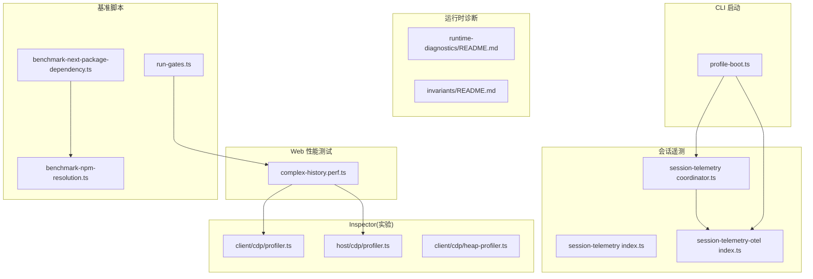
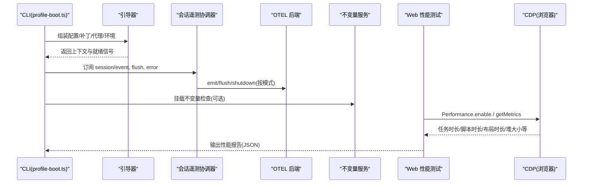
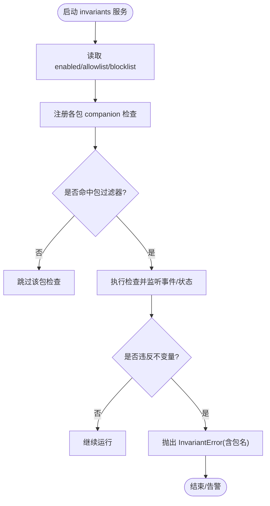
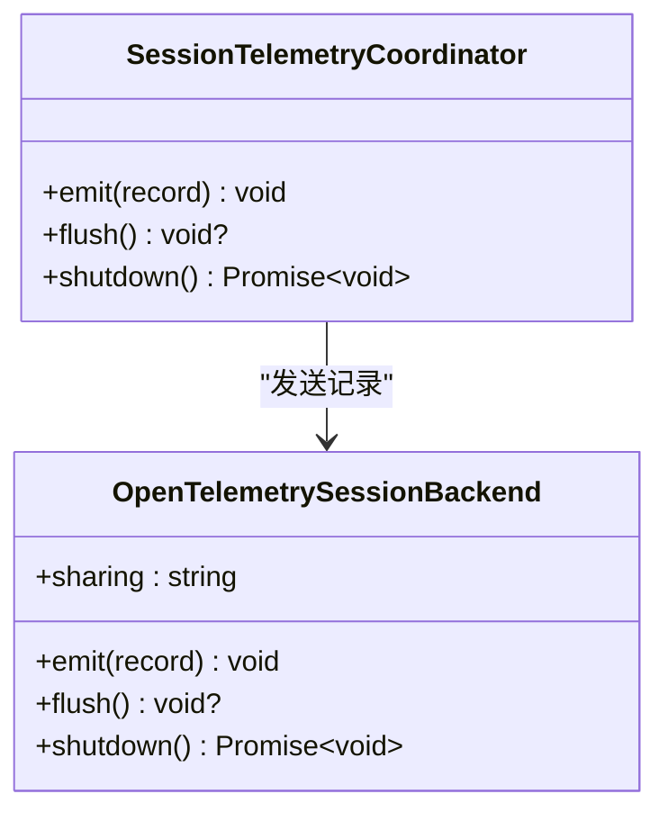
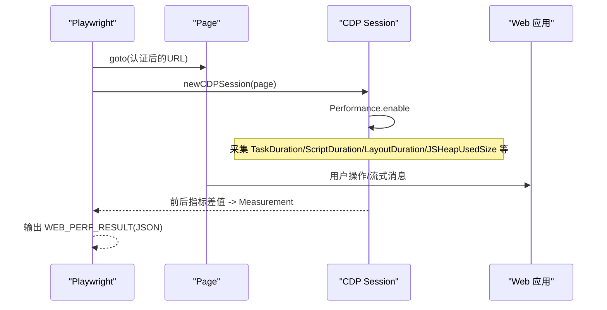
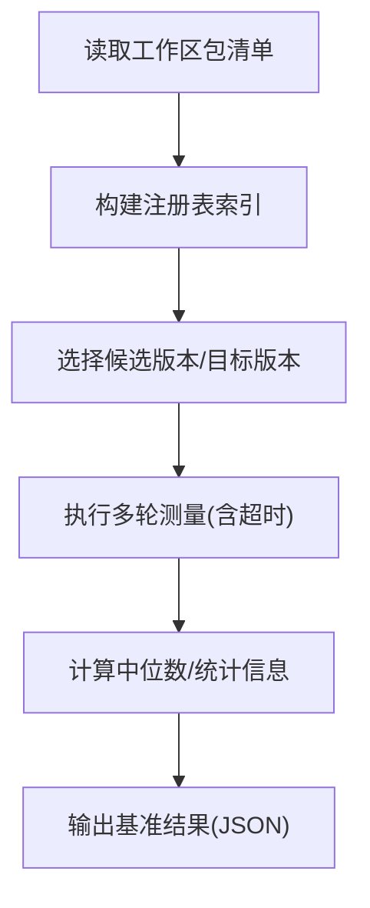
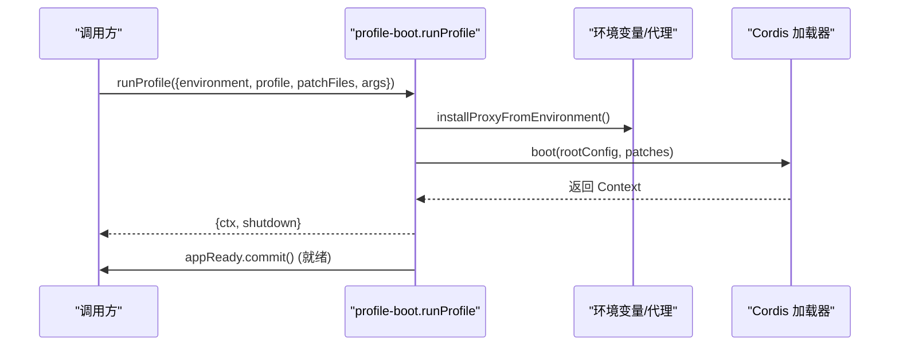
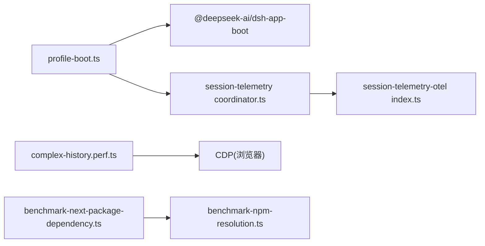

# 性能监控与分析

<cite>
**本文引用的文件**
- [BENCHMARK.md](file://BENCHMARK.md)
- [apps/cli/src/profile-boot.ts](file://apps/cli/src/profile-boot.ts)
- [packages/runtime-diagnostics/README.md](file://packages/runtime-diagnostics/README.md)
- [packages/runtime-diagnostics/invariants/README.md](file://packages/runtime-diagnostics/invariants/README.md)
- [packages/session/session-telemetry/src/coordinator.ts](file://packages/session/session-telemetry/src/coordinator.ts)
- [packages/session/session-telemetry/src/index.ts](file://packages/session/session-telemetry/src/index.ts)
- [packages/session/session-telemetry-otel/src/index.ts](file://packages/session/session-telemetry-otel/src/index.ts)
- [packages/experimental/inspector/src/client/cdp/profiler.ts](file://packages/experimental/inspector/src/client/cdp/profiler.ts)
- [packages/experimental/inspector/src/host/cdp/profiler.ts](file://packages/experimental/inspector/src/host/cdp/profiler.ts)
- [packages/experimental/inspector/src/client/cdp/heap-profiler.ts](file://packages/experimental/inspector/src/client/cdp/heap-profiler.ts)
- [apps/web/tests/complex-history.perf.ts](file://apps/web/tests/complex-history.perf.ts)
- [scripts/benchmark-next-package-dependency.ts](file://scripts/benchmark-next-package-dependency.ts)
- [scripts/benchmark-npm-resolution.ts](file://scripts/benchmark-npm-resolution.ts)
- [scripts/run-gates.ts](file://scripts/run-gates.ts)
</cite>

## 目录
1. [简介](#简介)
2. [项目结构](#项目结构)
3. [核心组件](#核心组件)
4. [架构总览](#架构总览)
5. [详细组件分析](#详细组件分析)
6. [依赖关系分析](#依赖关系分析)
7. [性能考量](#性能考量)
8. [故障排查指南](#故障排查指南)
9. [结论](#结论)
10. [附录](#附录)

## 简介
本指南面向需要在 DeepSeek Harness 中构建、运行与解读性能监控与分析能力的工程师。内容覆盖：
- 运行时诊断工具的集成与使用（会话遥测、不变量检查、浏览器指标采集）
- 关键性能指标的收集策略（响应时间、吞吐量、资源利用率）
- 基准测试的构建与执行流程（包依赖解析、Web UI 渲染压测）
- 性能回归检测与自动化监控搭建思路
- 瓶颈定位方法与调试技巧（Chrome DevTools、Node.js Profiler 等）
- 生产环境最佳实践与告警规则建议
- 性能分析报告解读与优化建议

## 项目结构
仓库围绕“应用入口 + 子系统 + 脚本工具”组织，性能相关能力分布在 CLI 启动链路、运行时诊断子系统、会话遥测、实验性 Inspector、Web 端性能测试以及脚本化基准工具中。

图表来源
- [apps/cli/src/profile-boot.ts:1-321](file://apps/cli/src/profile-boot.ts#L1-L321)
- [packages/session/session-telemetry/src/coordinator.ts:75-109](file://packages/session/session-telemetry/src/coordinator.ts#L75-L109)
- [packages/session/session-telemetry-otel/src/index.ts:141-168](file://packages/session/session-telemetry-otel/src/index.ts#L141-L168)
- [apps/web/tests/complex-history.perf.ts:520-573](file://apps/web/tests/complex-history.perf.ts#L520-L573)
- [scripts/benchmark-next-package-dependency.ts:201-227](file://scripts/benchmark-next-package-dependency.ts#L201-L227)
- [scripts/benchmark-npm-resolution.ts:105-143](file://scripts/benchmark-npm-resolution.ts#L105-L143)
- [scripts/run-gates.ts:1353-1385](file://scripts/run-gates.ts#L1353-L1385)

章节来源
- [BENCHMARK.md:1-4](file://BENCHMARK.md#L1-L4)
- [apps/cli/src/profile-boot.ts:1-321](file://apps/cli/src/profile-boot.ts#L1-L321)

## 核心组件
- 运行时诊断（invariants）：在运行期对持久事件与数据关系进行自校验，失败时以包级归属上报错误，支持全局开关与包名过滤。
- 会话遥测（session-telemetry）：统一协调会话事件采集，支持本地捕获与 OpenTelemetry 后端导出；默认关闭分享模式，可按需开启。
- Web 性能测试：基于 Playwright 与 Chrome DevTools Protocol 采集浏览器侧 CPU、布局、内存等指标，输出可比较的性能报告。
- 基准脚本：针对 npm 解析与包依赖变更提供可重复的基准测量，支持多轮统计与超时控制。
- CLI 启动装配：负责加载配置、补丁层、代理与环境快照，并在启动后暴露就绪信号，便于外部监控接入。

章节来源
- [packages/runtime-diagnostics/README.md:1-50](file://packages/runtime-diagnostics/README.md#L1-L50)
- [packages/runtime-diagnostics/invariants/README.md:25-71](file://packages/runtime-diagnostics/invariants/README.md#L25-L71)
- [packages/session/session-telemetry/src/coordinator.ts:75-109](file://packages/session/session-telemetry/src/coordinator.ts#L75-L109)
- [packages/session/session-telemetry-otel/src/index.ts:141-168](file://packages/session/session-telemetry-otel/src/index.ts#L141-L168)
- [apps/web/tests/complex-history.perf.ts:520-573](file://apps/web/tests/complex-history.perf.ts#L520-L573)
- [scripts/benchmark-next-package-dependency.ts:201-227](file://scripts/benchmark-next-package-dependency.ts#L201-L227)
- [scripts/benchmark-npm-resolution.ts:105-143](file://scripts/benchmark-npm-resolution.ts#L105-L143)

## 架构总览
下图展示从 CLI 启动到遥测与诊断的关键路径，以及 Web 性能测试如何借助 CDP 采集浏览器指标。

图表来源
- [apps/cli/src/profile-boot.ts:210-321](file://apps/cli/src/profile-boot.ts#L210-L321)
- [packages/session/session-telemetry/src/coordinator.ts:75-109](file://packages/session/session-telemetry/src/coordinator.ts#L75-L109)
- [packages/session/session-telemetry-otel/src/index.ts:141-168](file://packages/session/session-telemetry-otel/src/index.ts#L141-L168)
- [apps/web/tests/complex-history.perf.ts:520-573](file://apps/web/tests/complex-history.perf.ts#L520-L573)

## 详细组件分析

### 运行时不变量（Runtime Invariants）
- 作用：在运行期验证各包的持久事件与数据关系，失败时抛出带包名的不变量错误，便于快速定位责任方。
- 启用方式：通过配置项控制全局开关与包名白/黑名单；默认启用但无 companion 则不产生行为。
- 适用场景：需要“自检”的生产或预发环境，配合 CI 阻断异常。

图表来源
- [packages/runtime-diagnostics/invariants/README.md:25-71](file://packages/runtime-diagnostics/invariants/README.md#L25-L71)
- [packages/runtime-diagnostics/invariants/README.md:88-91](file://packages/runtime-diagnostics/invariants/README.md#L88-L91)

章节来源
- [packages/runtime-diagnostics/README.md:1-50](file://packages/runtime-diagnostics/README.md#L1-L50)
- [packages/runtime-diagnostics/invariants/README.md:25-71](file://packages/runtime-diagnostics/invariants/README.md#L25-L71)

### 会话遥测（Session Telemetry）
- 协调器：订阅会话生命周期事件（创建、销毁、事件、刷新、错误），将记录转交给后端。
- 后端（OTEL）：根据模式决定上传策略；默认禁用分享，避免无意泄露。
- 指标范围：会话事件、反馈记录、错误信息等，适合用于追踪端到端耗时与错误率。

图表来源
- [packages/session/session-telemetry/src/coordinator.ts:75-109](file://packages/session/session-telemetry/src/coordinator.ts#L75-L109)
- [packages/session/session-telemetry/src/index.ts:162-178](file://packages/session/session-telemetry/src/index.ts#L162-L178)
- [packages/session/session-telemetry-otel/src/index.ts:141-168](file://packages/session/session-telemetry-otel/src/index.ts#L141-L168)

章节来源
- [packages/session/session-telemetry/src/coordinator.ts:75-109](file://packages/session/session-telemetry/src/coordinator.ts#L75-L109)
- [packages/session/session-telemetry/src/index.ts:162-178](file://packages/session/session-telemetry/src/index.ts#L162-L178)
- [packages/session/session-telemetry-otel/src/index.ts:141-168](file://packages/session/session-telemetry-otel/src/index.ts#L141-L168)

### Web 性能测试与浏览器指标
- 通过 Playwright 打开页面，使用 CDP 启用性能采集，获取任务时长、脚本时长、布局时长、样式重算、节点数、事件监听器数量、堆内存等指标。
- 测试用例构造长历史会话与流式增量，评估渲染与交互性能，并以结构化 JSON 输出结果。

图表来源
- [apps/web/tests/complex-history.perf.ts:520-573](file://apps/web/tests/complex-history.perf.ts#L520-L573)
- [apps/web/tests/complex-history.perf.ts:1319-1350](file://apps/web/tests/complex-history.perf.ts#L1319-L1350)

章节来源
- [apps/web/tests/complex-history.perf.ts:520-573](file://apps/web/tests/complex-history.perf.ts#L520-L573)
- [apps/web/tests/complex-history.perf.ts:1319-1350](file://apps/web/tests/complex-history.perf.ts#L1319-L1350)

### 基准脚本：包依赖与 npm 解析
- 包依赖基准：扫描工作区包清单，选择候选版本，执行多轮测量并计算中位数，用于发现依赖升级带来的启动/解析开销变化。
- npm 解析基准：解析工作区 manifest，限制最大耗时，统计请求次数与未知包，保证基准稳定可复现。

图表来源
- [scripts/benchmark-next-package-dependency.ts:201-227](file://scripts/benchmark-next-package-dependency.ts#L201-L227)
- [scripts/benchmark-npm-resolution.ts:105-143](file://scripts/benchmark-npm-resolution.ts#L105-L143)

章节来源
- [scripts/benchmark-next-package-dependency.ts:201-227](file://scripts/benchmark-next-package-dependency.ts#L201-L227)
- [scripts/benchmark-npm-resolution.ts:105-143](file://scripts/benchmark-npm-resolution.ts#L105-L143)

### CLI 启动与就绪信号
- profile-boot 负责加载配置、补丁层、代理与环境快照，安装失败即停，并提供进程级优雅关闭。
- 启动完成后提交“就绪”信号，供外部系统探测服务可用性，便于健康检查与流量切换。

图表来源
- [apps/cli/src/profile-boot.ts:210-321](file://apps/cli/src/profile-boot.ts#L210-L321)

章节来源
- [apps/cli/src/profile-boot.ts:1-321](file://apps/cli/src/profile-boot.ts#L1-L321)

### 实验性 Inspector（CPU/Heap Profiling 桥接）
- 客户端与宿主侧的 CPU/Heap Profiler 桥接能力在当前实现中未暴露，说明浏览器侧 CPU/Heap 采样不通过 source bridge 提供。
- 如需浏览器侧采样，可直接通过 CDP 接口（如示例中的 Performance.getMetrics）获取指标。

章节来源
- [packages/experimental/inspector/src/client/cdp/profiler.ts:1-11](file://packages/experimental/inspector/src/client/cdp/profiler.ts#L1-L11)
- [packages/experimental/inspector/src/host/cdp/profiler.ts:1-11](file://packages/experimental/inspector/src/host/cdp/profiler.ts#L1-L11)
- [packages/experimental/inspector/src/client/cdp/heap-profiler.ts:1-11](file://packages/experimental/inspector/src/client/cdp/heap-profiler.ts#L1-L11)

## 依赖关系分析
- CLI 启动依赖 Cordis 插件系统与 dsh-app-boot，注入代理与环境快照，再装配应用树。
- 会话遥测依赖 sessions 服务，并通过 OTLP 后端导出（可配置为禁用）。
- Web 性能测试依赖 Playwright 与 CDP，直接访问浏览器性能 API。
- 基准脚本依赖工作区包清单与 Git 引用，确保跨分支可比性。

图表来源
- [apps/cli/src/profile-boot.ts:210-321](file://apps/cli/src/profile-boot.ts#L210-L321)
- [packages/session/session-telemetry/src/coordinator.ts:75-109](file://packages/session/session-telemetry/src/coordinator.ts#L75-L109)
- [packages/session/session-telemetry-otel/src/index.ts:141-168](file://packages/session/session-telemetry-otel/src/index.ts#L141-L168)
- [apps/web/tests/complex-history.perf.ts:520-573](file://apps/web/tests/complex-history.perf.ts#L520-L573)
- [scripts/benchmark-next-package-dependency.ts:201-227](file://scripts/benchmark-next-package-dependency.ts#L201-L227)
- [scripts/benchmark-npm-resolution.ts:105-143](file://scripts/benchmark-npm-resolution.ts#L105-L143)

章节来源
- [scripts/run-gates.ts:1353-1385](file://scripts/run-gates.ts#L1353-L1385)

## 性能考量
- 指标定义
  - 响应时间：优先关注首字节/首帧时间与端到端任务时长（TaskDuration）。
  - 吞吐量：单位时间内完成的对话轮次或工具调用次数。
  - 资源利用率：CPU（ScriptDuration）、布局（LayoutDuration/RecalcStyleDuration）、内存（JSHeapUsedSize）。
- 采集策略
  - 服务端：启用会话遥测（按需开启 OTEL 导出），结合不变量检查保障数据一致性。
  - 客户端：使用 CDP 采集浏览器指标，避免在热路径上频繁调用，采用前后差值计算。
- 基准设计
  - 多轮测量取中位数，设置超时与最大耗时上限，隔离网络波动与缓存影响。
  - 固定上下文窗口与回放数据，确保对比公平。
- 回归检测
  - 将基准脚本纳入 CI，阈值比较中位数与 P95/P99，超阈触发告警。
  - 结合不变量失败作为强约束，防止“指标正常但契约破坏”。

[本节为通用指导，不直接分析具体文件]

## 故障排查指南
- 不变量失败
  - 现象：抛出包含包名的 InvariantError。
  - 处理：根据包名定位责任模块，检查对应事件流与快照一致性；必要时缩小 allowlist/blocklist 聚焦问题包。
- 遥测未上报
  - 现象：后端无记录。
  - 处理：确认 mode 非 DISABLED；检查 exporter 配置；观察协调器是否收到 session/event 与 flush。
- 浏览器指标不可用
  - 现象：CDP 指标缺失。
  - 处理：确保已调用 Performance.enable；核对指标名称；在测试中先触发垃圾回收再采样。
- 启动失败或卡住
  - 现象：CLI 未就绪或进程退出码异常。
  - 处理：检查代理与环境变量注入；查看 fail-loud 日志；确认补丁层与 HMR 配置。

章节来源
- [packages/runtime-diagnostics/invariants/README.md:88-91](file://packages/runtime-diagnostics/invariants/README.md#L88-L91)
- [packages/session/session-telemetry-otel/src/index.ts:141-168](file://packages/session/session-telemetry-otel/src/index.ts#L141-L168)
- [apps/web/tests/complex-history.perf.ts:520-573](file://apps/web/tests/complex-history.perf.ts#L520-L573)
- [apps/cli/src/profile-boot.ts:210-321](file://apps/cli/src/profile-boot.ts#L210-L321)

## 结论
本项目提供了从服务端到客户端的完整性能观测能力：通过 CLI 启动装配、会话遥测与不变量检查保障后端稳定性，通过 CDP 采集浏览器指标支撑前端性能评估，并通过脚本化基准实现可重复的回归检测。建议在生产环境中默认关闭遥测分享，按需开启；在 CI 中固化基准与不变量检查，形成“契约+指标”的双重防线。

[本节为总结，不直接分析具体文件]

## 附录
- 快速开始
  - 参考根目录基准说明，安装 SDK 并运行最小变体，使用独立工作区与会话 ID 隔离基准任务。
- 常用命令与参数
  - 包依赖基准：支持候选包、轮次、并发与超时等参数。
  - npm 解析基准：支持 ref、runs、timeout-ms、max-ms 等参数。
- 报告解读
  - 关注 wallMs、taskMs、scriptMs、layoutMs、heapMb 等字段的变化趋势；结合不变量失败综合判断。
- 生产最佳实践
  - 遥测模式默认禁用分享；仅在生产开启 FULL/FEEDBACK_ONLY 并配置安全导出。
  - 不变量检查保持启用，配合包名过滤降低噪音。
  - 告警规则：以 P95/P99 与中位数双阈值触发，结合不变量失败作为强阻断。

章节来源
- [BENCHMARK.md:1-4](file://BENCHMARK.md#L1-L4)
- [scripts/benchmark-next-package-dependency.ts:43-73](file://scripts/benchmark-next-package-dependency.ts#L43-L73)
- [scripts/benchmark-npm-resolution.ts:58-64](file://scripts/benchmark-npm-resolution.ts#L58-L64)
- [packages/session/session-telemetry-otel/src/index.ts:141-168](file://packages/session/session-telemetry-otel/src/index.ts#L141-L168)
- [packages/runtime-diagnostics/invariants/README.md:34-52](file://packages/runtime-diagnostics/invariants/README.md#L34-L52)