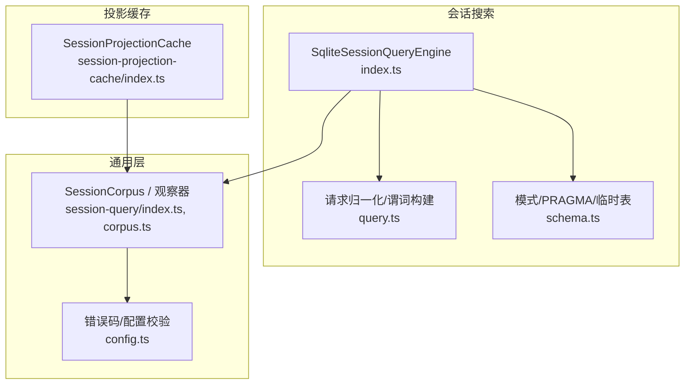
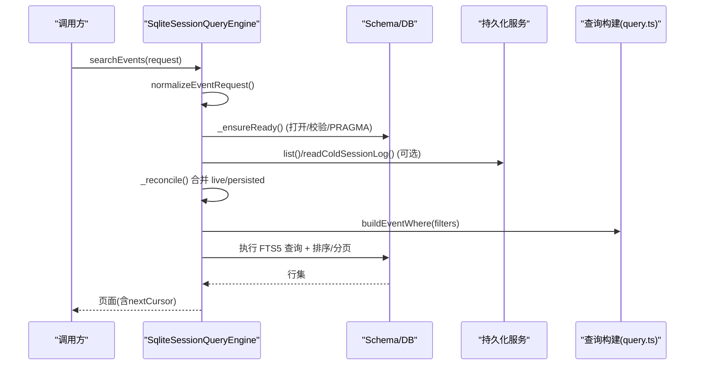
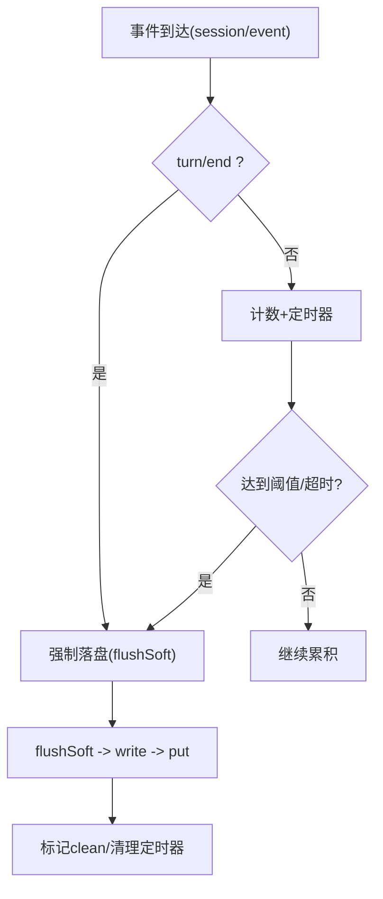
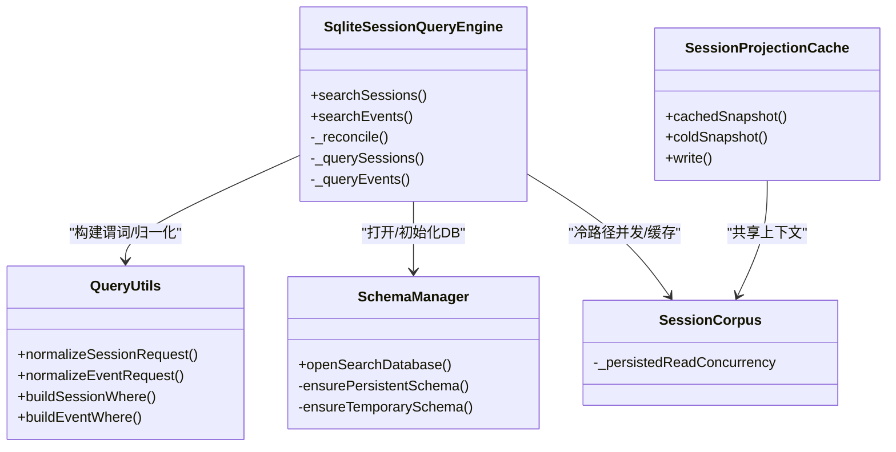

# 数据库查询优化

<cite>
**本文引用的文件**
- [packages/session-query/session-query-sqlite/src/index.ts](file://packages/session-query/session-query-sqlite/src/index.ts)
- [packages/session-query/session-query-sqlite/src/schema.ts](file://packages/session-query/session-query-sqlite/src/schema.ts)
- [packages/session-query/session-query-sqlite/src/query.ts](file://packages/session-query/session-query-sqlite/src/query.ts)
- [packages/session-query/session-query/src/index.ts](file://packages/session-query/session-query/src/index.ts)
- [packages/session-query/session-query/src/corpus.ts](file://packages/session-query/session-query/src/corpus.ts)
- [packages/session-query/session-query/src/config.ts](file://packages/session-query/session-query/src/config.ts)
- [packages/session/session-projection-cache/src/index.ts](file://packages/session/session-projection-cache/src/index.ts)
- [.agents/notes/implemented/architecture/2026-08-19-projection-cache-per-session-files.md](file://.agents/notes/implemented/architecture/2026-08-19-projection-cache-per-session-files.md)
</cite>

## 目录
1. [简介](#简介)
2. [项目结构](#项目结构)
3. [核心组件](#核心组件)
4. [架构总览](#架构总览)
5. [详细组件分析](#详细组件分析)
6. [依赖关系分析](#依赖关系分析)
7. [性能考量](#性能考量)
8. [故障排查指南](#故障排查指南)
9. [结论](#结论)
10. [附录](#附录)

## 简介
本指南面向使用 SQLite 的会话查询与投影缓存场景，系统性阐述查询优化实践：索引设计、查询计划分析与执行计划优化、连接复用策略、批量操作与事务优化、缓存策略（结果缓存、预加载、失效）、慢查询定位与监控、以及会话持久化与查询场景中的投影缓存与写后同步机制。内容基于仓库中 session-query-sqlite 与 session-projection-cache 的实现进行提炼与总结。

## 项目结构
围绕“会话搜索”和“投影缓存”两条主线组织：
- 会话搜索（SQLite FTS5）：负责将“实时会话 + 已持久化会话”合并为可检索的读模型，提供跨会话与会话内事件搜索能力。
- 投影缓存：对会话投影状态做持久化检查点，支持冷启动快速恢复与列表页零 I/O 读取。

图表来源
- [packages/session-query/session-query-sqlite/src/index.ts:203-325](file://packages/session-query/session-query-sqlite/src/index.ts#L203-L325)
- [packages/session-query/session-query-sqlite/src/query.ts:100-216](file://packages/session-query/session-query-sqlite/src/query.ts#L100-L216)
- [packages/session-query/session-query-sqlite/src/schema.ts:46-169](file://packages/session-query/session-query-sqlite/src/schema.ts#L46-L169)
- [packages/session-query/session-query/src/index.ts:100-131](file://packages/session-query/session-query/src/index.ts#L100-L131)
- [packages/session-query/session-query/src/corpus.ts:34-54](file://packages/session-query/session-query/src/corpus.ts#L34-L54)
- [packages/session-query/session-query/src/config.ts:28-57](file://packages/session-query/session-query/src/config.ts#L28-L57)

章节来源
- [packages/session-query/session-query-sqlite/src/index.ts:203-325](file://packages/session-query/session-query-sqlite/src/index.ts#L203-L325)
- [packages/session-query/session-query-sqlite/src/schema.ts:46-169](file://packages/session-query/session-query-sqlite/src/schema.ts#L46-L169)
- [packages/session-query/session-query-sqlite/src/query.ts:100-216](file://packages/session-query/session-query-sqlite/src/query.ts#L100-L216)
- [packages/session-query/session-query/src/index.ts:100-131](file://packages/session-query/session-query/src/index.ts#L100-L131)
- [packages/session-query/session-query/src/corpus.ts:34-54](file://packages/session-query/session-query/src/corpus.ts#L34-L54)
- [packages/session-query/session-query/src/config.ts:28-57](file://packages/session-query/session-query/src/config.ts#L28-L57)

## 核心组件
- SqliteSessionQueryEngine：实现跨会话与会话内搜索，维护持久化与临时（实时）两套文档表，按全局/本地代际号保证一致性。
- Schema 管理：创建/校验应用 ID、用户版本、受控表集合；设置 PRAGMA journal_mode；初始化持久化与临时 FTS5 虚拟表。
- 请求归一化与谓词：限制参数数量与外部谓词预算，生成安全参数化 SQL 片段，避免注入与过大绑定。
- SessionCorpus/观察器：控制持久化读取并发与准备态会话缓存大小，支撑冷路径高效读取。
- SessionProjectionCache：以“每会话单文件”布局持久化投影检查点，提供热路径快照、冷路径恢复与失败软降级。

章节来源
- [packages/session-query/session-query-sqlite/src/index.ts:203-325](file://packages/session-query/session-query-sqlite/src/index.ts#L203-L325)
- [packages/session-query/session-query-sqlite/src/schema.ts:46-169](file://packages/session-query/session-query-sqlite/src/schema.ts#L46-L169)
- [packages/session-query/session-query-sqlite/src/query.ts:100-216](file://packages/session-query/session-query-sqlite/src/query.ts#L100-L216)
- [packages/session-query/session-query/src/index.ts:100-131](file://packages/session-query/session-query/src/index.ts#L100-L131)
- [packages/session/session-projection-cache/src/index.ts:83-110](file://packages/session/session-projection-cache/src/index.ts#L83-L110)

## 架构总览
下图展示一次会话事件搜索的关键调用链与数据流：请求归一化 → 确保索引就绪 → 对齐持久化/实时视图 → 构造并执行 FTS5 查询 → 分页与游标编码。

图表来源
- [packages/session-query/session-query-sqlite/src/index.ts:296-325](file://packages/session-query/session-query-sqlite/src/index.ts#L296-L325)
- [packages/session-query/session-query-sqlite/src/schema.ts:46-78](file://packages/session-query/session-query-sqlite/src/schema.ts#L46-L78)
- [packages/session-query/session-query-sqlite/src/query.ts:193-216](file://packages/session-query/session-query-sqlite/src/query.ts#L193-L216)

## 详细组件分析

### SQLite 索引设计与 FTS5 建模
- 持久化文档表：使用 FTS5 虚拟表存储文本与元数据列（会话ID、序列号、类型、时间、表面、代码点长度），其中元数据列为 UNINDEXED 以加速匹配与过滤。
- 实时文档表：同构的临时 FTS5 表，用于覆盖最新会话，保证“实时优先”。
- 会话头表：记录会话元信息，便于列表与聚合排序。
- 版本与应用标识：通过 application_id 与 user_version 保护数据库不被误用或混用；不兼容时自动重置。

优化要点
- 利用 FTS5 的 MATCH 与 highlight 完成全文检索与片段高亮。
- 将高频过滤字段（如 type、surface、time、seq）作为普通列参与 WHERE 条件，配合 FTS5 结果集进一步筛选。
- 使用 ROW_NUMBER() OVER(PARTITION BY ...) 实现“每个会话取最佳匹配”的排名逻辑，减少重复扫描。

章节来源
- [packages/session-query/session-query-sqlite/src/schema.ts:103-169](file://packages/session-query/session-query-sqlite/src/schema.ts#L103-L169)
- [packages/session-query/session-query-sqlite/src/index.ts:647-710](file://packages/session-query/session-query-sqlite/src/index.ts#L647-L710)

### 查询计划分析与执行计划优化
- 外部谓词预算：对外部 WHERE 子句数量设限，避免 FTS5 规划器退化。
- 参数绑定上限：限制 IN/范围等产生的占位符数量，防止超出 SQLite 变量上限导致编译失败。
- 游标与指纹：请求指纹与实例/作用域/代际号共同编码到游标中，保证分页稳定性与失效语义。
- 排序键：match_count DESC、document_length ASC、time DESC、seq DESC，兼顾相关性、去重与时间顺序。

建议实践
- 在业务侧尽量缩小 filter 值集合，避免触发预算限制。
- 合理拆分大查询，结合游标分页，避免一次性返回过多结果。
- 对热点查询，固定 query/filters 组合以获得稳定的执行计划。

章节来源
- [packages/session-query/session-query-sqlite/src/query.ts:23-56](file://packages/session-query/session-query-sqlite/src/query.ts#L23-L56)
- [packages/session-query/session-query-sqlite/src/query.ts:369-383](file://packages/session-query/session-query-sqlite/src/query.ts#L369-L383)
- [packages/session-query/session-query-sqlite/src/index.ts:647-710](file://packages/session-query/session-query-sqlite/src/index.ts#L647-L710)

### 连接池配置与连接复用策略
- 单实例 DatabaseSync：当前实现采用进程内单例数据库句柄，通过串行化队列（_tail）保证写入有序与资源安全释放。
- 延迟/按需打开：支持 startup/first-search/never 三种打开策略，避免不必要的模块导入与 IO。
- 关闭与回收：统一 close 入口等待尾队列完成后关闭句柄，避免竞态。

注意
- 该实现未暴露传统意义上的“连接池”，而是以单连接+串行化保障一致性与资源可控。若需更高并发，应在上层做批处理与扇出控制。

章节来源
- [packages/session-query/session-query-sqlite/src/index.ts:226-266](file://packages/session-query/session-query-sqlite/src/index.ts#L226-L266)
- [packages/session-query/session-query-sqlite/src/index.ts:327-405](file://packages/session-query/session-query-sqlite/src/index.ts#L327-L405)
- [packages/session-query/session-query-sqlite/src/schema.ts:46-78](file://packages/session-query/session-query-sqlite/src/schema.ts#L46-L78)

### 批量操作与事务优化
- 合并变更：_reconcile 将持久化与实时的增删改合并为单次 BEGIN IMMEDIATE 事务，更新 global_generation 与本地 generation，最后 COMMIT。
- 失败回滚：捕获异常并在必要时 ROLLBACK，保持 DB 一致性。
- 批量插入：对文档表使用预编译语句循环插入，减少解析开销。

章节来源
- [packages/session-query/session-query-sqlite/src/index.ts:407-493](file://packages/session-query/session-query-sqlite/src/index.ts#L407-L493)
- [packages/session-query/session-query-sqlite/src/index.ts:582-645](file://packages/session-query/session-query-sqlite/src/index.ts#L582-L645)

### 缓存策略：查询结果缓存、预加载与失效
- 会话搜索层：
  - 持久化读取并发与准备态会话缓存：通过 persistedReadConcurrency 与 preparedSessionCacheSize 控制冷路径并行度与重用。
  - 观察稳定重试：对持久化拓扑变化进行有限次重试，避免抖动导致的频繁重建。
- 投影缓存层：
  - 每会话单文件布局：降低写放大与单点损坏影响面。
  - 写后同步：先 flush 日志再落盘检查点，保证“日志先行”，崩溃不会导致缓存超前于日志。
  - 失效策略：以 identity（formatVersion、createdAt、cwd、isSeeded、inheritedEventCount）匹配记录，版本不匹配即丢弃。

图表来源
- [packages/session/session-projection-cache/src/index.ts:301-352](file://packages/session/session-projection-cache/src/index.ts#L301-L352)
- [packages/session/session-projection-cache/src/index.ts:354-385](file://packages/session/session-projection-cache/src/index.ts#L354-L385)

章节来源
- [packages/session-query/session-query/src/index.ts:100-131](file://packages/session-query/session-query/src/index.ts#L100-L131)
- [packages/session/session-projection-cache/src/index.ts:83-110](file://packages/session/session-projection-cache/src/index.ts#L83-L110)
- [packages/session/session-projection-cache/src/index.ts:246-296](file://packages/session/session-projection-cache/src/index.ts#L246-L296)
- [.agents/notes/implemented/architecture/2026-08-19-projection-cache-per-session-files.md:1-13](file://.agents/notes/implemented/architecture/2026-08-19-projection-cache-per-session-files.md#L1-L13)

### EXPLAIN QUERY PLAN 的使用建议
- 目标：识别是否命中 FTS5 索引、是否存在全表扫描、排序代价是否过高。
- 关注点：
  - FTS5 MATCH 是否被使用。
  - 外部 WHERE 是否有效下推。
  - ROW_NUMBER 窗口函数是否必要且可接受。
- 实践：
  - 针对热点查询固定参数，多次运行对比不同 filter 组合的执行计划。
  - 当外部谓词过多或值集合过大时，考虑拆分为多次小查询。

说明：本节为通用方法论，不直接引用具体源码。

### 数据库分片与读写分离方案
- 现状：当前实现聚焦单库 FTS5 索引与内存临时表，未内置分片或读写分离。
- 可行扩展方向：
  - 分片：按会话 ID 哈希或时间范围路由到多个独立 SQLite 文件，由上层路由表决定读写目标。
  - 读写分离：只读副本用于历史浏览，主库承担写入与实时索引更新；通过异步复制保持一致性。
- 风险与权衡：引入复杂度与一致性挑战，建议在明确瓶颈后再演进。

说明：本节为概念性方案，不直接引用具体源码。

## 依赖关系分析

图表来源
- [packages/session-query/session-query-sqlite/src/index.ts:203-325](file://packages/session-query/session-query-sqlite/src/index.ts#L203-L325)
- [packages/session-query/session-query-sqlite/src/query.ts:100-216](file://packages/session-query/session-query-sqlite/src/query.ts#L100-L216)
- [packages/session-query/session-query-sqlite/src/schema.ts:46-169](file://packages/session-query/session-query-sqlite/src/schema.ts#L46-L169)
- [packages/session-query/session-query/src/index.ts:100-131](file://packages/session-query/session-query/src/index.ts#L100-L131)
- [packages/session/session-projection-cache/src/index.ts:83-110](file://packages/session/session-projection-cache/src/index.ts#L83-L110)

章节来源
- [packages/session-query/session-query-sqlite/src/index.ts:203-325](file://packages/session-query/session-query-sqlite/src/index.ts#L203-L325)
- [packages/session-query/session-query-sqlite/src/query.ts:100-216](file://packages/session-query/session-query-sqlite/src/query.ts#L100-L216)
- [packages/session-query/session-query-sqlite/src/schema.ts:46-169](file://packages/session-query/session-query-sqlite/src/schema.ts#L46-L169)
- [packages/session-query/session-query/src/index.ts:100-131](file://packages/session-query/session-query/src/index.ts#L100-L131)
- [packages/session/session-projection-cache/src/index.ts:83-110](file://packages/session/session-projection-cache/src/index.ts#L83-L110)

## 性能考量
- 索引与查询
  - 充分利用 FTS5 MATCH，避免将全文搜索退化为 LIKE。
  - 控制外部谓词数量与 IN 列表大小，保持在预算内。
  - 使用游标分页，避免 OFFSET 过大带来的成本。
- 事务与写入
  - 合并变更进入单一事务，减少锁竞争与磁盘同步次数。
  - 使用预编译语句批量插入，降低解析与验证开销。
- 缓存与预热
  - 调整 persistedReadConcurrency 与 preparedSessionCacheSize 平衡冷路径吞吐与内存占用。
  - 投影缓存以“日志先行”的策略保证一致性，失败软降级不影响主流程。
- 连接与生命周期
  - 按需打开 SQLite 模块，减少启动开销。
  - 统一关闭路径，确保尾队列完成后释放资源。

说明：本节为通用指导，不直接引用具体源码。

## 故障排查指南
- 常见错误码
  - SESSION_QUERY_INVALID_CONFIG：配置项非法（limit、并发数等）。
  - SESSION_QUERY_INDEX_FAILED：索引打开/重建失败。
  - SESSION_QUERY_PERSISTENCE_FAILED：持久化观察不稳定或失败。
  - SESSION_QUERY_SEARCH_DISABLED：搜索被禁用（openAt=never）。
  - SESSION_QUERY_SESSION_NOT_FOUND：会话不存在。
  - SESSION_QUERY_STALE_CURSOR：游标因拓扑变化失效。
- 定位步骤
  - 检查 openAt/journalMode/path 配置是否正确。
  - 确认持久化服务可用且拓扑稳定（list/read 无抖动）。
  - 审查过滤器与 limit，避免超过预算限制。
  - 查看日志中关于“观察未稳定”“索引打开失败”的警告/错误。

章节来源
- [packages/session-query/session-query/src/config.ts:28-57](file://packages/session-query/session-query/src/config.ts#L28-L57)
- [packages/session-query/session-query-sqlite/src/index.ts:333-344](file://packages/session-query/session-query-sqlite/src/index.ts#L333-L344)
- [packages/session-query/session-query-sqlite/src/index.ts:369-381](file://packages/session-query/session-query-sqlite/src/index.ts#L369-L381)
- [packages/session-query/session-query-sqlite/src/index.ts:495-562](file://packages/session-query/session-query-sqlite/src/index.ts#L495-L562)

## 结论
本仓库在会话搜索与投影缓存两个关键路径上实现了稳健的 SQLite 优化：以 FTS5 为核心的全文检索、严格的谓词与参数预算控制、事务化的增量索引更新、以及“日志先行”的投影检查点策略。通过这些机制，系统在冷/热路径均能获得良好的一致性与性能表现。对于更大规模场景，可在现有基础上引入分片与读写分离，但需评估一致性与运维复杂度。

## 附录
- 配置项速览（节选）
  - path：索引文件路径或内存数据库。
  - openAt：startup/first-search/never。
  - journalMode：wal/delete/truncate/persist。
  - defaultLimit/maxLimit：默认与最大分页大小。
  - snippetChars：片段最大字符数。
  - persistedReadConcurrency：持久化读取并发。
  - preparedSessionCacheSize：准备态会话缓存大小。
- 参考路径
  - 配置与错误码定义：[packages/session-query/session-query/src/config.ts:28-57](file://packages/session-query/session-query/src/config.ts#L28-L57)
  - SQLite 模式与 PRAGMA：[packages/session-query/session-query-sqlite/src/schema.ts:46-169](file://packages/session-query/session-query-sqlite/src/schema.ts#L46-L169)
  - 搜索引擎主流程：[packages/session-query/session-query-sqlite/src/index.ts:203-325](file://packages/session-query/session-query-sqlite/src/index.ts#L203-L325)
  - 请求归一化与谓词：[packages/session-query/session-query-sqlite/src/query.ts:100-216](file://packages/session-query/session-query-sqlite/src/query.ts#L100-L216)
  - 投影缓存写路径：[packages/session/session-projection-cache/src/index.ts:301-385](file://packages/session/session-projection-cache/src/index.ts#L301-L385)