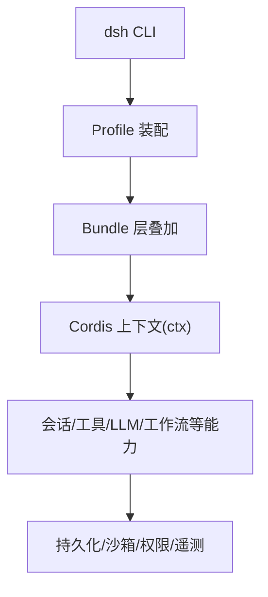
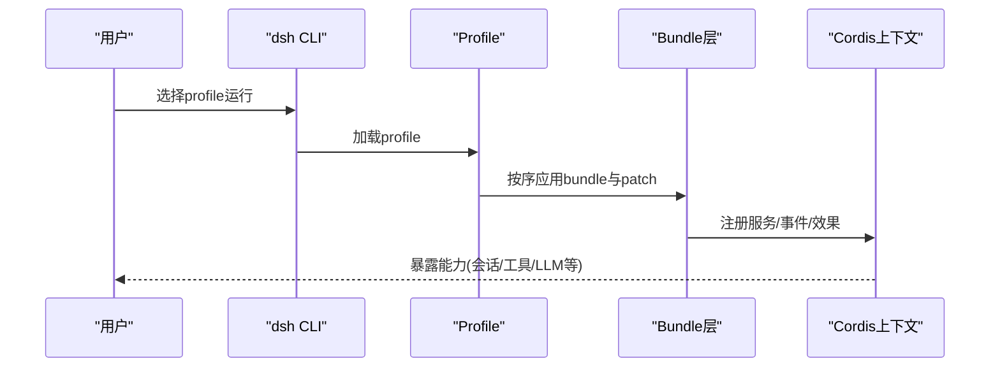
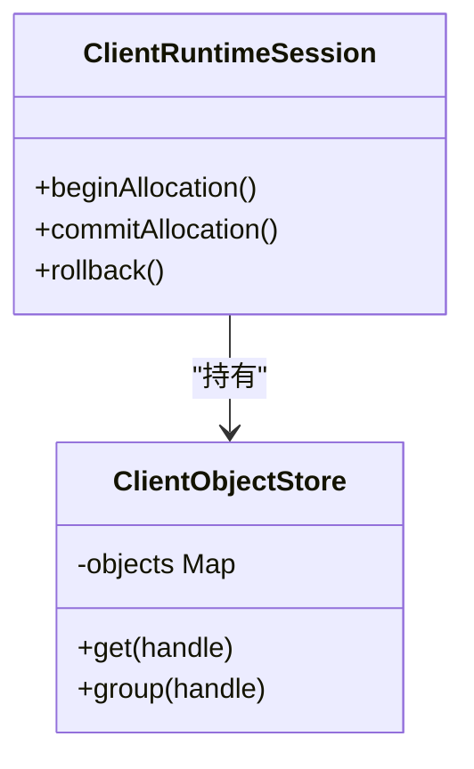
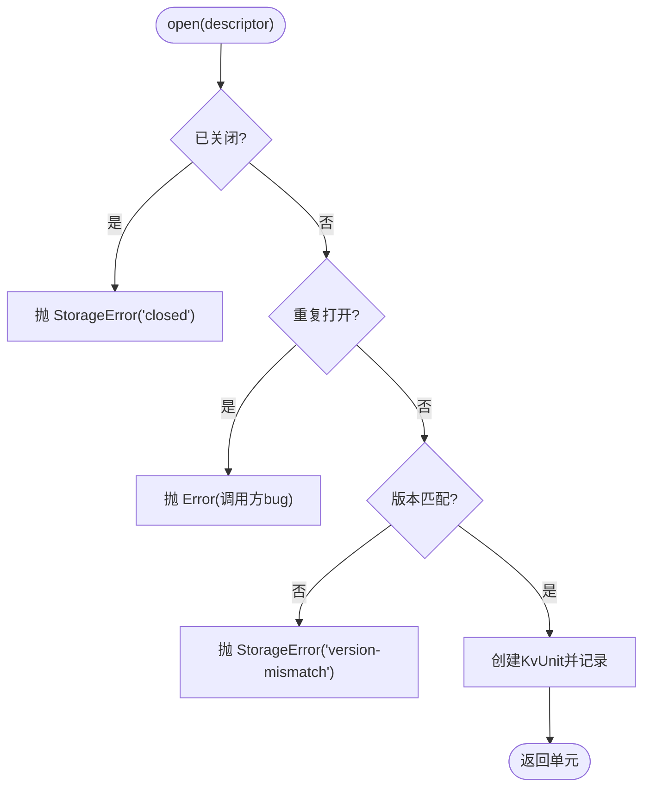
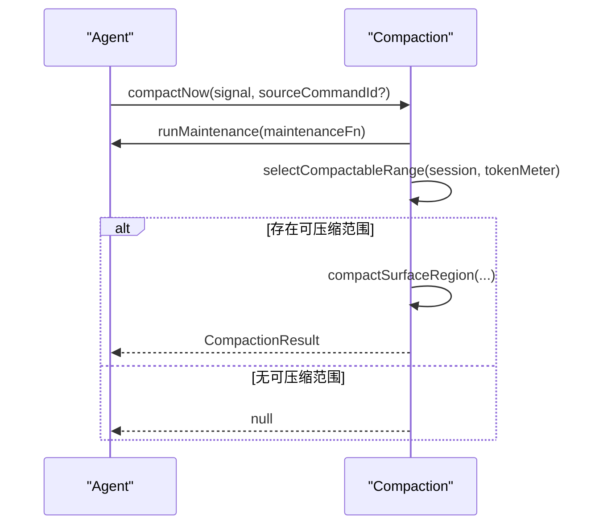
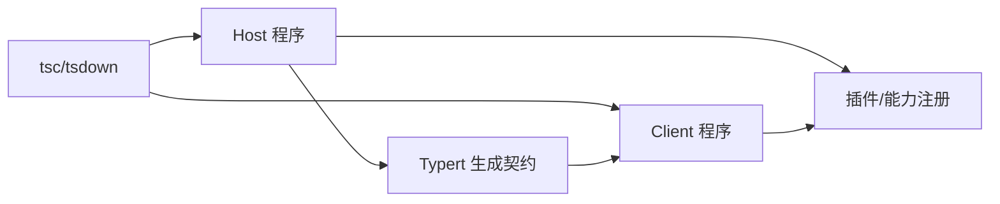

# 最佳实践

<cite>
**本文引用的文件**
- [README.md](file://README.md)
- [CONTRIBUTING.md](file://CONTRIBUTING.md)
- [SAFETY.md](file://SAFETY.md)
- [docs/development.md](file://docs/development.md)
- [docs/architecture.md](file://docs/architecture.md)
- [docs/testing.md](file://docs/testing.md)
- [docs/defensive-patterns.md](file://docs/defensive-patterns.md)
- [AGENTS.md](file://AGENTS.md)
- [.editorconfig](file://.editorconfig)
- [scripts/oxlint-contract.spec.ts](file://scripts/oxlint-contract.spec.ts)
- [packages/experimental/inspector/src/client/cdp/runtime.ts](file://packages/experimental/inspector/src/client/cdp/runtime.ts)
- [packages/storage/storage-domain/tests/helpers/memory-backend.ts](file://packages/storage/storage-domain/tests/helpers/memory-backend.ts)
- [packages/compaction/compaction-basic/src/index.ts](file://packages/compaction/compaction-basic/src/index.ts)
- [packages/spill/spill-local/src/cleanup.ts](file://packages/spill/spill-local/src/cleanup.ts)
</cite>

## 目录
1. [引言](#引言)
2. [项目结构](#项目结构)
3. [核心组件](#核心组件)
4. [架构总览](#架构总览)
5. [详细组件分析](#详细组件分析)
6. [依赖关系分析](#依赖关系分析)
7. [性能与资源管理](#性能与资源管理)
8. [防御性编程与错误处理](#防御性编程与错误处理)
9. [代码风格、命名约定与质量门禁](#代码风格命名约定与质量门禁)
10. [测试与质量保证流程](#测试与质量保证流程)
11. [安全编码规范与风险评估](#安全编码规范与风险评估)
12. [常见问题与排错指南](#常见问题与排错指南)
13. [结论](#结论)

## 引言
本指南面向DeepSeek Harness（dsh）团队与贡献者，目标是提供统一的开发标准与最佳实践，覆盖代码风格、命名约定、架构模式、防御性编程、错误处理、性能优化、资源管理、代码审查清单、质量保证流程、安全编码规范与风险评估方法。文档以仓库现有规范为依据，结合关键实现与脚本，形成可执行的团队准则。

## 项目结构
- dsh采用“一切皆插件”的Cordis架构：所有能力通过插件注册服务、事件与可逆效果，启动时按profile与bundle层叠装配。
- Host与Client两个TypeScript聚合体分别构建，避免类型合并冲突；共享叶子包在两侧均参与类型检查。
- 应用入口统一通过`dsh` CLI选择profile运行，禁止绕过CLI的直接进程入口。

**图表来源**
- [docs/architecture.md:15-47](file://docs/architecture.md#L15-L47)
- [docs/architecture.md:49-63](file://docs/architecture.md#L49-L63)

**章节来源**
- [docs/architecture.md:15-47](file://docs/architecture.md#L15-L47)
- [docs/architecture.md:49-63](file://docs/architecture.md#L49-L63)
- [docs/development.md:44-80](file://docs/development.md#L44-L80)

## 核心组件
- 会话与会话日志：追加式事件日志与内存存储，模型可见输入必须可重放。
- 系统提示与工具：组装提示段与工具Schema，受控执行管道。
- Agent与循环：Agent接口、运行时注册与默认驱动。
- LLM适配：消息与流词汇、适配器边界。
- Webhook：认证投递与工作区会话创建。
- 扩展点：通过事件与能力seam（Service Definition/Provider/Consumer）组合能力。

**章节来源**
- [docs/architecture.md:49-63](file://docs/architecture.md#L49-L63)
- [docs/architecture.md:64-115](file://docs/architecture.md#L64-L115)

## 架构总览
- Profile与Bundle：profile声明要堆叠的bundle与用户patch；bundle是配置与挂载代码的分发格式。
- 启动顺序：空列表开始，依次应用profile列出的bundle、profile级patch、home级patch、--patch叠加。
- 应用入口：仅允许通过`dsh` CLI选择profile运行；Python SDK遵循相同架构。
- 能力seam：一个完整能力包含定义、提供者与消费者，替换任意一方即可改变产品行为。

**图表来源**
- [docs/architecture.md:15-47](file://docs/architecture.md#L15-L47)
- [docs/architecture.md:41-47](file://docs/architecture.md#L41-L47)

**章节来源**
- [docs/architecture.md:15-47](file://docs/architecture.md#L15-L47)
- [docs/architecture.md:41-47](file://docs/architecture.md#L41-L47)

## 详细组件分析

### 客户端对象存储与生命周期（实验性Inspector）
- 使用对象池限制每会话对象数与结果属性数，防止无界增长。
- 通过begin/commit/rollback分配批次，确保异常路径也能释放句柄。
- 访问已释放对象抛出明确错误，避免跨会话泄漏。

**图表来源**
- [packages/experimental/inspector/src/client/cdp/runtime.ts:234-269](file://packages/experimental/inspector/src/client/cdp/runtime.ts#L234-L269)

**章节来源**
- [packages/experimental/inspector/src/client/cdp/runtime.ts:234-269](file://packages/experimental/inspector/src/client/cdp/runtime.ts#L234-L269)

### 存储后端与单元生命周期（Storage Domain）
- 打开单元需校验版本与重复打开，失败抛出自定义错误。
- 关闭后任何操作应拒绝并报错，保证状态一致性。
- 通过pool共享介质，支持多实例复用或隔离。

**图表来源**
- [packages/storage/storage-domain/tests/helpers/memory-backend.ts:67-160](file://packages/storage/storage-domain/tests/helpers/memory-backend.ts#L67-L160)

**章节来源**
- [packages/storage/storage-domain/tests/helpers/memory-backend.ts:67-160](file://packages/storage/storage-domain/tests/helpers/memory-backend.ts#L67-L160)

### 压缩（Compaction）维护任务
- 在空闲期触发压缩，尊重取消信号，选择可压缩范围并持久化标记。
- 将agent维护任务与AbortSignal组合，确保中断及时传播。

**图表来源**
- [packages/compaction/compaction-basic/src/index.ts:360-394](file://packages/compaction/compaction-basic/src/index.ts#L360-L394)

**章节来源**
- [packages/compaction/compaction-basic/src/index.ts:360-394](file://packages/compaction/compaction-basic/src/index.ts#L360-L394)

### 溢出清理（Spill Local Cleanup）
- 启动扫描根目录，幂等删除过期spill，忽略并发写入导致的ENOTEMPTY/ENOENT。
- 活跃根永不修剪，保留策略由本地后端负责。

**章节来源**
- [packages/spill/spill-local/src/cleanup.ts:345-362](file://packages/spill/spill-local/src/cleanup.ts#L345-L362)

## 依赖关系分析
- 类型系统与构建：Host与Client双聚合，tsconfig.base作为paths门面；Typert仅在Host阶段生成远程契约。
- 包内依赖：能力seam要求Service Definition/Provider/Consumer三者协同；新增行为优先通过扩展点而非修改循环。
- 外部依赖：Cordis为框架底座；第三方插件与供应商代码通过vendor与manifest管理。

**图表来源**
- [docs/development.md:44-80](file://docs/development.md#L44-L80)

**章节来源**
- [docs/development.md:44-80](file://docs/development.md#L44-L80)

## 性能与资源管理
- 对象上限与惰性读取：客户端运行时对RemoteObject数量与属性数量设限，按需解析描述符，避免一次性膨胀。
- 取消与超时：维护任务与压缩过程使用AbortSignal组合，确保快速响应中断。
- 资源清理：溢出清理在启动时扫描并幂等删除；存储单元关闭后拒绝操作，避免悬挂引用。
- 构建产物：构建嵌入版本与提交信息，发布制品绑定精确环境，减少不一致带来的回滚成本。

**章节来源**
- [packages/experimental/inspector/src/client/cdp/runtime.ts:234-269](file://packages/experimental/inspector/src/client/cdp/runtime.ts#L234-L269)
- [packages/compaction/compaction-basic/src/index.ts:360-394](file://packages/compaction/compaction-basic/src/index.ts#L360-L394)
- [packages/spill/spill-local/src/cleanup.ts:345-362](file://packages/spill/spill-local/src/cleanup.ts#L345-L362)
- [docs/development.md:74-79](file://docs/development.md#L74-L79)

## 防御性编程与错误处理
- 正交结果独立上报：进程超时、信号、退出码等独立字段分别上报，避免嵌套分支掩盖真实状态。
- 公共约定两侧遵守：内部多种失败表示在公共API侧规范化，消费方无需猜测异常来源。
- 显式失败：误配置尽早失败，不静默跳过缺失依赖；捕获块需说明吞掉的原因。
- 资源所有权：单元关闭后拒绝操作；对象释放后访问抛错；清理幂等且容忍并发竞争。

**章节来源**
- [docs/defensive-patterns.md:7-13](file://docs/defensive-patterns.md#L7-L13)
- [packages/storage/storage-domain/tests/helpers/memory-backend.ts:67-160](file://packages/storage/storage-domain/tests/helpers/memory-backend.ts#L67-L160)
- [packages/experimental/inspector/src/client/cdp/runtime.ts:234-269](file://packages/experimental/inspector/src/client/cdp/runtime.ts#L234-L269)

## 代码风格、命名约定与质量门禁
- 编辑器与行尾：统一LF结尾与末尾换行，配合.gitattributes保持一致。
- 单引号/分号/缩进/行长：Oxlint规则集中约束，pre-commit staged profile对暂存区进行修复与重试。
- 类型与JSDoc：严格模式+noImplicitAny；导出需JSDoc；SessionEventMap成员必填；事件使用声明合并与判别标签。
- 模块与入口：ESM优先；应用入口仅限dsh CLI；包间通过workspace paths解析源码，避免混用src与lib。
- 变更门槛：类型检查、lint、文档同步、构建产物校验、覆盖率门禁；CI矩阵覆盖多Node版本。

**章节来源**
- [.editorconfig:1-8](file://.editorconfig#L1-L8)
- [scripts/oxlint-contract.spec.ts:120-376](file://scripts/oxlint-contract.spec.ts#L120-L376)
- [AGENTS.md:102-135](file://AGENTS.md#L102-L135)
- [docs/development.md:109-119](file://docs/development.md#L109-L119)

## 测试与质量保证流程
- 分层测试：
  - 单元测试：vitest，关注边缘、错误路径、事件顺序、并发竞态与契约回归。
  - 覆盖率门禁：按文件100%覆盖packages/*/*/src，未覆盖行常为死代码。
  - 真实API e2e：有密钥时运行，自跳过保障无密钥CI绿色。
  - 预期输出：owner-local过程期望，CI运行构建产物。
  - 快照：录制session.jsonl回放，Web浏览器快照对比UI证据。
- 原则：
  - 优先真实实现，仅对昂贵/非确定性边界打桩。
  - 验证世界而非自报告；e2e断言外部文件字节一致。
  - 测试真实入口路径：bin走lib，source回归用声明启动器。
  - 非平凡变更需更新快照与文档。

**章节来源**
- [docs/testing.md:7-51](file://docs/testing.md#L7-L51)
- [AGENTS.md:62-84](file://AGENTS.md#L62-L84)

## 安全编码规范与风险评估
- 实验性质：未经安全审计，不得视为生产可用；可能执行模型生成代码、加载第三方插件、访问网络/进程/凭据/文件。
- 沙箱局限：沙箱、审批与权限控制可降低风险但不保证隔离；不要将其作为唯一安全控制。
- 负责任使用：最小权限、可丢弃环境、备份敏感数据、审阅插件与命令。
- 风险识别建议：
  - 输入面：模型输出、用户输入、插件配置、外部API响应。
  - 执行面：子进程、文件系统、网络请求、终端交互。
  - 数据面：凭据、会话日志、持久化存储。
  - 恢复面：超时、取消、并发竞争、I/O失败。
- 缓解措施：
  - 严格边界校验与白名单；失败快速失败。
  - 资源上限与超时；取消信号贯穿长任务。
  - 最小权限运行；隔离环境与备份。
  - 审计与监控：遥测、日志、告警。

**章节来源**
- [SAFETY.md:5-27](file://SAFETY.md#L5-L27)
- [docs/architecture.md:109-115](file://docs/architecture.md#L109-L115)

## 常见问题与排错指南
- 无法启动或端口占用：确认dsh web默认监听地址与--no-open参数；SSH场景仅打印URL。
- 环境变量缺失：DEEPSEEK_API_KEY与可选BASE_URL；勿提交真实凭据。
- 类型检查失败：先完成Host lib阶段再生成契约，再执行Client tsc；必要时先build。
- 快照不一致：使用test:snapshot:record刷新录制；review差异；CI只回放不写期望。
- 性能问题：检查对象上限、流式处理、取消信号传播；避免阻塞I/O；合理设置token计量与压缩阈值。
- 权限与沙箱：若被阻止，使用最小必要权限提升并收集证据；不要绕过测试或产品沙箱。

**章节来源**
- [README.md:17-41](file://README.md#L17-L41)
- [docs/development.md:92-101](file://docs/development.md#L92-L101)
- [docs/testing.md:18-51](file://docs/testing.md#L18-L51)
- [AGENTS.md:86-96](file://AGENTS.md#L86-L96)

## 结论
本指南基于仓库现有规范与实现，提炼出适用于DeepSeek Harness团队的统一标准与实践。建议在PR中遵循“机械门禁优于行文约定”，将关键约束固化为可执行检查；在设计与实现中坚持能力seam、事件驱动与防御性编程；在性能与安全上坚持上限、超时、取消与最小权限。持续完善测试与快照，确保模型可见输入可重放、行为可观测、问题可定位。