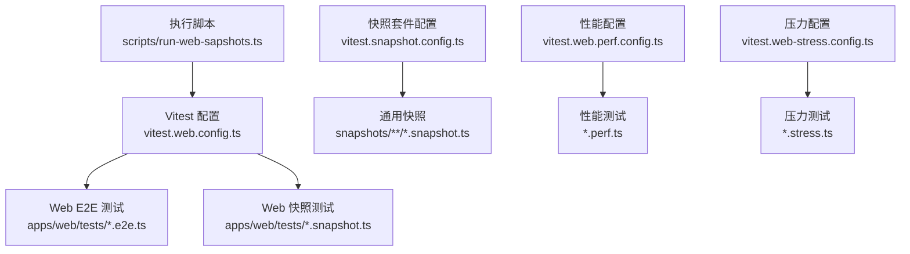
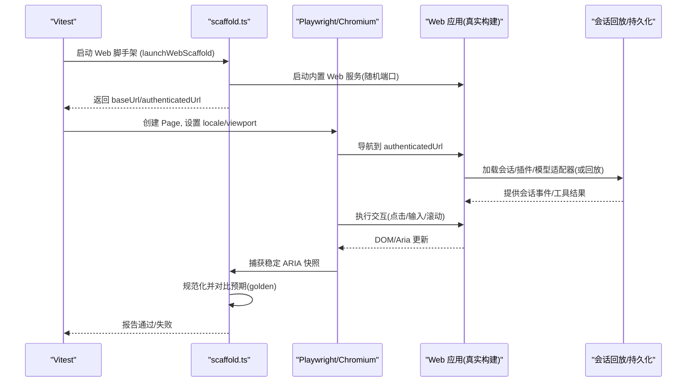
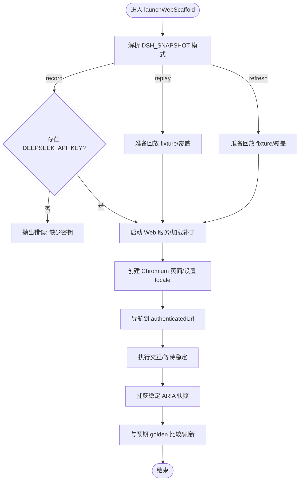
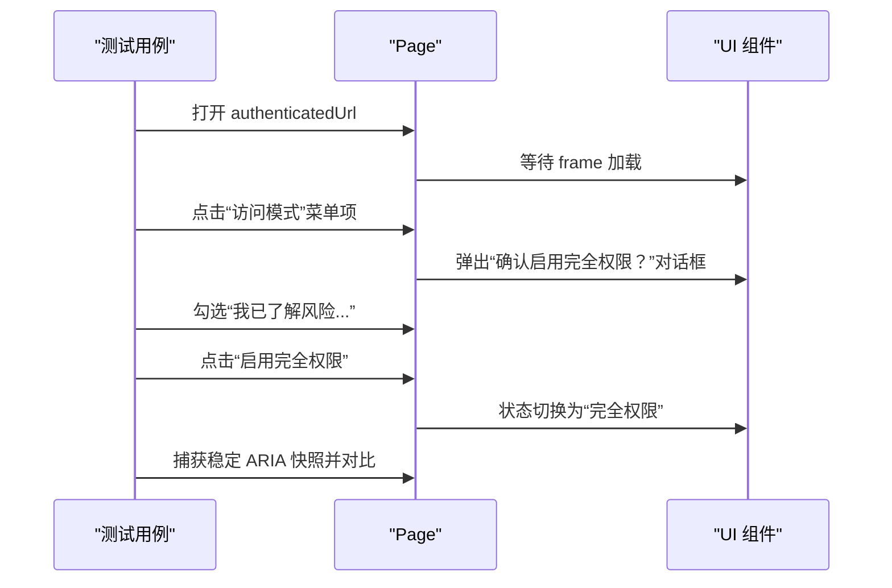
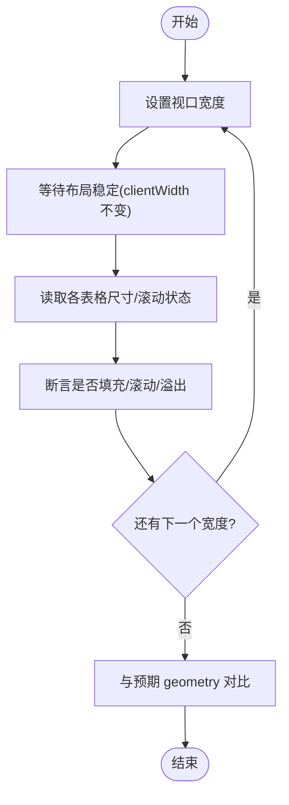
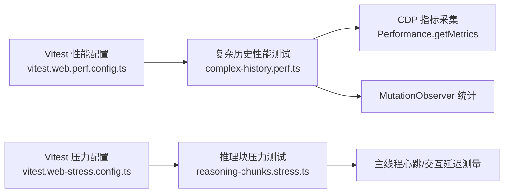
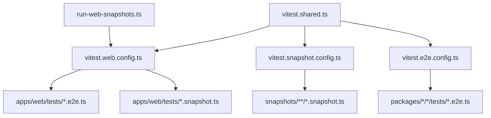

# Web界面测试

<cite>
**本文引用的文件**
- [apps/web/tests/README.md](file://apps/web/tests/README.md)
- [apps/web/tests/scaffold.ts](file://apps/web/tests/scaffold.ts)
- [apps/web/tests/support.ts](file://apps/web/tests/support.ts)
- [apps/web/tests/access-confirmation.e2e.ts](file://apps/web/tests/access-confirmation.e2e.ts)
- [apps/web/tests/markdown-wide-table.e2e.ts](file://apps/web/tests/markdown-wide-table.e2e.ts)
- [apps/web/tests/complex-history.perf.ts](file://apps/web/tests/complex-history.perf.ts)
- [apps/web/stress-tests/reasoning-chunks.stress.ts](file://apps/web/stress-tests/reasoning-chunks.stress.ts)
- [vitest.web.config.ts](file://vitest.web.config.ts)
- [vitest.snapshot.config.ts](file://vitest.snapshot.config.ts)
- [vitest.shared.ts](file://vitest.shared.ts)
- [scripts/run-web-snapshots.ts](file://scripts/run-web-snapshots.ts)
- [vitest.web-stress.config.ts](file://vitest.web-stress.config.ts)
- [vitest.web.perf.config.ts](file://vitest.web.perf.config.ts)
- [vitest.e2e.config.ts](file://vitest.e2e.config.ts)
- [.agents/notes/implemented/testing/2026-07-30-web-browser-snapshot-ci-gate.zh.md](file://.agents/notes/implemented/testing/2026-07-30-web-browser-snapshot-ci-gate.zh.md)
</cite>

## 目录
1. [简介](#简介)
2. [项目结构](#项目结构)
3. [核心组件](#核心组件)
4. [架构总览](#架构总览)
5. [详细组件分析](#详细组件分析)
6. [依赖关系分析](#依赖关系分析)
7. [性能考虑](#性能考虑)
8. [故障排查指南](#故障排查指南)
9. [结论](#结论)
10. [附录](#附录)

## 简介
本指南面向使用 Chromium 浏览器对 Web 应用进行端到端 UI 测试与快照验证的工程师。内容涵盖：
- 会话驱动的 UI 测试（基于真实装配的 Web 组合，通过 Playwright + Chromium 驱动）
- 纯 UI 组件与交互测试（以角色、可见文本、data-* 属性等稳定选择器定位）
- Web 快照测试的配置与执行流程（replay/record/refresh 模式），以及 Linux CI 的特殊要求
- 用户交互测试、响应式布局测试、无障碍功能测试的具体示例
- 浏览器特定行为与跨浏览器兼容性处理建议
- 性能测试与负载测试的实施方法（含压力测试与高基数场景）

## 项目结构
Web 端到端测试位于 apps/web/tests，采用“真实宿主入口 + 真实前端产物”的方式运行，配合 Playwright 控制 Chromium 完成 HTTP/WebSocket 全链路交互。测试配置由根级 Vitest 配置文件管理，按不同用途拆分：
- vitest.web.config.ts：Web 浏览器 lane，包含 e2e 与 snapshot 文件匹配
- vitest.snapshot.config.ts：通用快照套件（含 web 快照在 lib 模式下启用）
- vitest.e2e.config.ts：需要真实 API 的 e2e 套件（独立并行度与重试策略）
- vitest.web.perf.config.ts：手动高性能诊断（启用 --expose-gc）
- vitest.web-stress.config.ts：可选的压力测试套件
- scripts/run-web-snapshots.ts：串行关键用例后并发执行其余快照任务

**图表来源**
- [vitest.web.config.ts:1-38](file://vitest.web.config.ts#L1-L38)
- [vitest.snapshot.config.ts:39-67](file://vitest.snapshot.config.ts#L39-L67)
- [vitest.web.perf.config.ts:1-22](file://vitest.web.perf.config.ts#L1-L22)
- [vitest.web-stress.config.ts:1-15](file://vitest.web-stress.config.ts#L1-L15)
- [scripts/run-web-snapshots.ts:1-45](file://scripts/run-web-snapshots.ts#L1-L45)

**章节来源**
- [apps/web/tests/README.md:1-44](file://apps/web/tests/README.md#L1-L44)
- [vitest.web.config.ts:1-38](file://vitest.web.config.ts#L1-L38)
- [vitest.snapshot.config.ts:39-67](file://vitest.snapshot.config.ts#L39-L67)
- [vitest.e2e.config.ts:1-63](file://vitest.e2e.config.ts#L1-L63)
- [scripts/run-web-snapshots.ts:1-45](file://scripts/run-web-snapshots.ts#L1-L45)

## 核心组件
- 启动脚手架（scaffold.ts）
  - 负责启动真实 Web 组合，注入 replay/record/refresh 模式，管理临时工作区、端口、会话持久化、LLM 回放适配器等
  - 提供 launchWebScaffold、webSnapshotMode、captureStableAria 等能力
- 支持工具（support.ts）
  - 页面初始化、语言环境设置、失败截图保存、工作区连接辅助
- 具体测试用例
  - 访问确认（access-confirmation.e2e.ts）：演示权限弹窗、本地化、ARIA 快照对比
  - 宽表格响应式（markdown-wide-table.e2e.ts）：多视口宽度下的布局断言
  - 复杂历史性能（complex-history.perf.ts）：高基数量渲染、流式输出、内存与指标采集
  - 推理块压力（reasoning-chunks.stress.ts）：大量增量块渲染时的主线程阻塞与交互延迟测量

**章节来源**
- [apps/web/tests/scaffold.ts:111-123](file://apps/web/tests/scaffold.ts#L111-L123)
- [apps/web/tests/scaffold.ts:413-438](file://apps/web/tests/scaffold.ts#L413-L438)
- [apps/web/tests/access-confirmation.e2e.ts:1-82](file://apps/web/tests/access-confirmation.e2e.ts#L1-L82)
- [apps/web/tests/markdown-wide-table.e2e.ts:285-320](file://apps/web/tests/markdown-wide-table.e2e.ts#L285-L320)
- [apps/web/tests/complex-history.perf.ts:1-800](file://apps/web/tests/complex-history.perf.ts#L1-L800)
- [apps/web/stress-tests/reasoning-chunks.stress.ts:1-154](file://apps/web/stress-tests/reasoning-chunks.stress.ts#L1-L154)

## 架构总览
下图展示了从 Vitest 到 Chromium 的端到端调用链，包括脚手架启动、页面加载、会话回放与快照对比。

**图表来源**
- [apps/web/tests/scaffold.ts:413-438](file://apps/web/tests/scaffold.ts#L413-L438)
- [apps/web/tests/scaffold.ts:1392-1429](file://apps/web/tests/scaffold.ts#L1392-L1429)
- [apps/web/tests/access-confirmation.e2e.ts:26-41](file://apps/web/tests/access-confirmation.e2e.ts#L26-L41)

## 详细组件分析

### 会话驱动的 UI 测试（scaffold.ts）
- 模式解析：通过环境变量 DSH_SNAPSHOT 决定 replay/record/refresh；默认 replay 且无需密钥
- 启动流程：加载基础补丁与 Web 应用补丁，挂载临时工作区与持久化，禁用可能干扰的 LLM 标题生成，安装 LLM 回放适配器
- 会话回放：选择最高版本 fixture，校验版本，必要时覆盖子 fixture；记录/刷新时写入对应生成
- 收尾检查：确保所有回放脚本被消费，游标耗尽，避免静默少放/错绑

**图表来源**
- [apps/web/tests/scaffold.ts:111-123](file://apps/web/tests/scaffold.ts#L111-L123)
- [apps/web/tests/scaffold.ts:413-438](file://apps/web/tests/scaffold.ts#L413-L438)

**章节来源**
- [apps/web/tests/scaffold.ts:111-123](file://apps/web/tests/scaffold.ts#L111-L123)
- [apps/web/tests/scaffold.ts:413-438](file://apps/web/tests/scaffold.ts#L413-L438)
- [apps/web/tests/scaffold.ts:1392-1429](file://apps/web/tests/scaffold.ts#L1392-L1429)

### 用户交互测试示例（访问确认）
- 目标：验证“完全权限”需先阅读风险并勾选同意，再启用
- 要点：
  - 使用中文 locale 保证角色与文案一致
  - 通过 role 与可见文本定位按钮与对话框
  - 捕获稳定 ARIA 快照并与 expected/ui.expected.md 对比
  - 关闭后断言状态变更与无控制台警告

**图表来源**
- [apps/web/tests/access-confirmation.e2e.ts:26-82](file://apps/web/tests/access-confirmation.e2e.ts#L26-L82)
- [apps/web/tests/scaffold.ts:1392-1429](file://apps/web/tests/scaffold.ts#L1392-L1429)

**章节来源**
- [apps/web/tests/access-confirmation.e2e.ts:1-82](file://apps/web/tests/access-confirmation.e2e.ts#L1-L82)

### 响应式布局测试示例（宽表格）
- 目标：在不同视口宽度下验证表格填充、滚动与溢出行为
- 要点：
  - 逐步调整 viewport 宽度并等待布局稳定（clientWidth 不再变化）
  - 读取多个表格的几何信息，断言预期行为
  - 将结果与 geometry.expected.md 对比

**图表来源**
- [apps/web/tests/markdown-wide-table.e2e.ts:285-320](file://apps/web/tests/markdown-wide-table.e2e.ts#L285-L320)

**章节来源**
- [apps/web/tests/markdown-wide-table.e2e.ts:285-320](file://apps/web/tests/markdown-wide-table.e2e.ts#L285-L320)

### 无障碍功能测试（ARIA 快照）
- 使用 captureStableAria 捕获区域稳定 ARIA 快照，自动归一化时间戳与工作区路径
- 适用于对话框、列表、消息行等可访问性断言

**章节来源**
- [apps/web/tests/scaffold.ts:1392-1429](file://apps/web/tests/scaffold.ts#L1392-L1429)

### 性能测试与负载测试
- 性能测试（complex-history.perf.ts）
  - 构造高基数量侧边栏与会话历史，注入大量工具调用与流式响应
  - 通过 CDP 获取 Chromium 指标（TaskDuration/LayoutDuration/JSHeapUsedSize 等）
  - 使用 MutationObserver 统计 DOM 变更批次与记录数
  - 不做强时序断言，仅报告数据供回归参考
- 压力测试（reasoning-chunks.stress.ts）
  - 向渲染器推送 100,000 个推理块，保持主线程心跳与交互延迟预算
  - 通过自定义事件与窗口钩子收集最大主线程延迟与交互处理延迟
  - 作为显式性能证据，非默认 CI 范围

**图表来源**
- [vitest.web.perf.config.ts:1-22](file://vitest.web.perf.config.ts#L1-L22)
- [vitest.web-stress.config.ts:1-15](file://vitest.web-stress.config.ts#L1-L15)
- [apps/web/tests/complex-history.perf.ts:520-547](file://apps/web/tests/complex-history.perf.ts#L520-L547)
- [apps/web/stress-tests/reasoning-chunks.stress.ts:46-154](file://apps/web/stress-tests/reasoning-chunks.stress.ts#L46-L154)

**章节来源**
- [apps/web/tests/complex-history.perf.ts:1-800](file://apps/web/tests/complex-history.perf.ts#L1-L800)
- [apps/web/stress-tests/reasoning-chunks.stress.ts:1-154](file://apps/web/stress-tests/reasoning-chunks.stress.ts#L1-L154)

## 依赖关系分析
- 测试与配置
  - vitest.web.config.ts 定义 Web 浏览器 lane 的文件匹配与超时、并行策略
  - vitest.snapshot.config.ts 管理快照套件，区分 replay/record/refresh 的并行策略
  - vitest.e2e.config.ts 管理需要真实 API 的 e2e 套件，限制并行度并启用重试
  - vitest.shared.ts 提供装饰器预处理与 webstorage 标志处理
- 执行编排
  - scripts/run-web-snapshots.ts 串行执行关键用例（HMR 与 Cordis 工具轮次），随后以固定 worker 数并发执行其余快照
- CI 门禁
  - Linux PR CI 强制运行完整 Web 浏览器回放/对比套件，注入 DSH_SNAPSHOT=replay，禁止写回 golden

**图表来源**
- [scripts/run-web-snapshots.ts:1-45](file://scripts/run-web-snapshots.ts#L1-L45)
- [vitest.web.config.ts:1-38](file://vitest.web.config.ts#L1-L38)
- [vitest.snapshot.config.ts:39-67](file://vitest.snapshot.config.ts#L39-L67)
- [vitest.e2e.config.ts:1-63](file://vitest.e2e.config.ts#L1-L63)
- [vitest.shared.ts:1-43](file://vitest.shared.ts#L1-L43)

**章节来源**
- [vitest.web.config.ts:1-38](file://vitest.web.config.ts#L1-L38)
- [vitest.snapshot.config.ts:39-67](file://vitest.snapshot.config.ts#L39-L67)
- [vitest.e2e.config.ts:1-63](file://vitest.e2e.config.ts#L1-L63)
- [vitest.shared.ts:1-43](file://vitest.shared.ts#L1-L43)
- [scripts/run-web-snapshots.ts:1-45](file://scripts/run-web-snapshots.ts#L1-L45)

## 性能考虑
- 默认测试 lane 保持快速与确定性；性能与压力测试为可选、手动触发
- 性能测试通过 CDP 指标与 MutationObserver 采集渲染与内存开销，不做强时序断言
- 压力测试用于观察极端场景下的主线程阻塞与交互延迟，作为显式性能证据
- 建议在本地或专用机器上运行，避免硬件差异影响判断

[本节为通用指导，不直接分析具体文件]

## 故障排查指南
- 常见错误
  - record 模式缺少密钥：需在环境变量或 .env 中提供 DEEPSEEK_API_KEY
  - 快照未稳定：使用 captureStableAria 等待两次连续快照相等后再对比
  - 控制台警告/错误：watchConsole 会捕获 pageErrors 与 warnings，失败时保留截图
- 调试步骤
  - 使用 DSH_PLAYWRIGHT_EXECUTABLE_PATH 指向本地已安装的 Chromium
  - 在失败时保存截图（saveFailureShot）以便复现
  - 检查回放 fixture 版本与覆盖是否正确选择

**章节来源**
- [apps/web/tests/scaffold.ts:413-438](file://apps/web/tests/scaffold.ts#L413-L438)
- [apps/web/tests/access-confirmation.e2e.ts:26-82](file://apps/web/tests/access-confirmation.e2e.ts#L26-L82)

## 结论
本项目提供了完整的 Web 端到端测试基础设施：通过真实装配的 Web 组合与 Playwright/Chromium 驱动，结合会话回放与 ARIA 快照，实现稳健的 UI 验证。同时提供性能与压力测试入口，便于在高基数与极端场景下评估渲染与交互质量。CI 层面对 Linux PR 强制回放对比，保障发布质量。

[本节为总结，不直接分析具体文件]

## 附录
- Linux CI 特殊要求
  - 必须运行完整 Web 浏览器回放/对比套件，注入 DSH_SNAPSHOT=replay
  - 禁止在 CI 中写回 golden，避免掩盖差异
- 跨浏览器兼容性
  - 默认使用 Playwright 固定的 Chromium；可通过 DSH_PLAYWRIGHT_EXECUTABLE_PATH 指定本地浏览器
  - 如需其他浏览器，可在用例中替换 chromium.launch 参数并验证选择器稳定性
- 最佳实践
  - 使用 role、data-*、可见文本等稳定选择器
  - 对动态内容使用 expect.poll 等待稳定
  - 对国际化场景明确设置 locale，保证角色与文案一致

**章节来源**
- [.agents/notes/implemented/testing/2026-07-30-web-browser-snapshot-ci-gate.zh.md:1-13](file://.agents/notes/implemented/testing/2026-07-30-web-browser-snapshot-ci-gate.zh.md#L1-L13)
- [apps/web/tests/access-confirmation.e2e.ts:26-41](file://apps/web/tests/access-confirmation.e2e.ts#L26-L41)