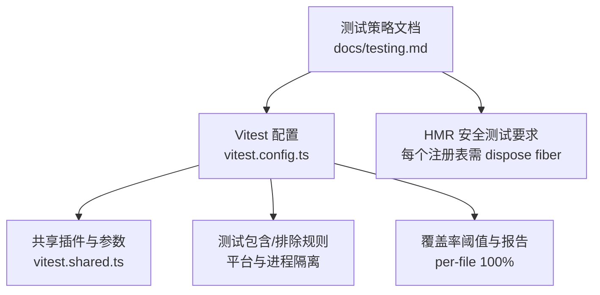
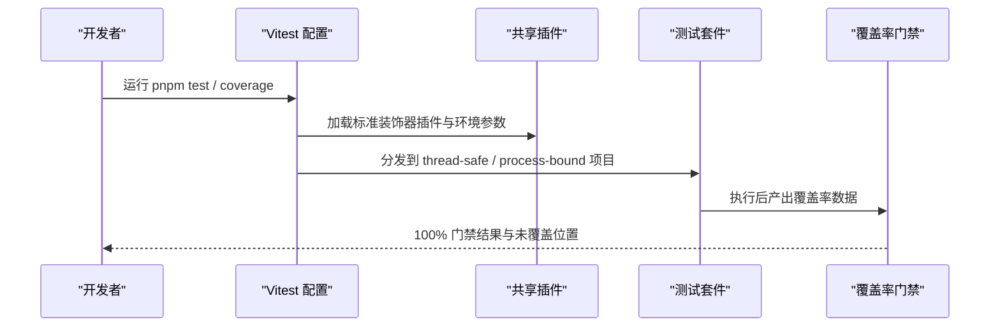
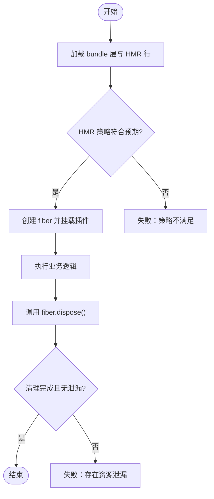
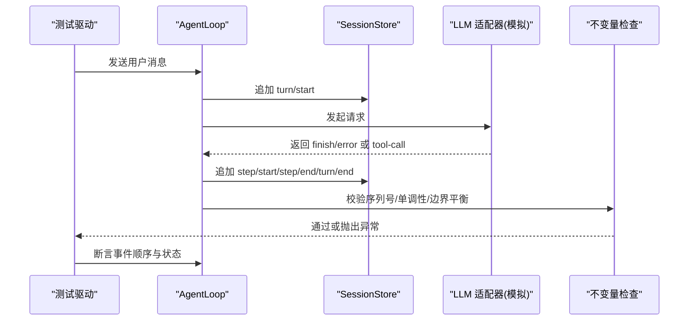
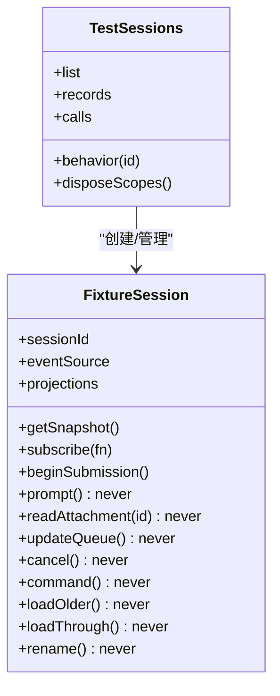
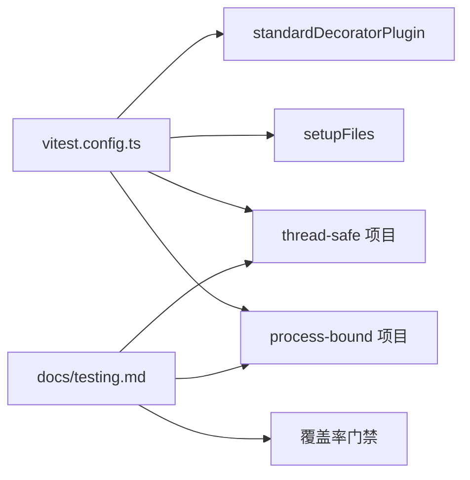

# 单元测试

<cite>
**本文引用的文件**
- [vitest.config.ts](file://vitest.config.ts)
- [vitest.shared.ts](file://vitest.shared.ts)
- [testing.md](file://docs/testing.md)
- [profile-hmr.spec.ts](file://apps/cli/tests/profile-hmr.spec.ts)
- [contract-regressions.spec.ts](file://packages/core/agent-loop/tests/contract-regressions.spec.ts)
- [sessions.ts](file://packages/test-support/client-runtime/src/sessions.ts)
- [fiber.zh.md](file://docs/cordis-api/fiber.zh.md)
- [SKILL.md](file://.agents/skills/dsh-ci-test-reliability/SKILL.md)
</cite>

## 目录
1. [简介](#简介)
2. [项目结构](#项目结构)
3. [核心组件](#核心组件)
4. [架构总览](#架构总览)
5. [详细组件分析](#详细组件分析)
6. [依赖分析](#依赖分析)
7. [性能考虑](#性能考虑)
8. [故障排查指南](#故障排查指南)
9. [结论](#结论)
10. [附录](#附录)

## 简介
本指南面向使用 Vitest 在本仓库编写高质量单元测试的工程师，覆盖测试组织、用例设计原则与最佳实践；重点说明 HMR（热模块替换）安全测试的实现方法，确保贡献的 fiber 能够正确清理；并提供边缘情况、错误路径、事件顺序与并发竞态条件的测试示例；最后给出如何编写“永久性契约回归测试”以锁定行为约定，避免后续变更破坏既有契约。

## 项目结构
仓库采用分层测试策略：
- 单元测试：基于 Vitest，位于各包 tests 目录与 scripts 下的 spec 文件，遵循“就近放置、与代码同域”的原则。
- 覆盖率门禁：对 packages/*/*/src 执行 per-file 100% 覆盖率门禁，未覆盖行通常意味着死代码或需要删除的代码。
- 真实 API e2e：带密钥的真实模型调用测试，具备自跳过能力，保证无密钥 CI 稳定。
- 预期输出与快照：通过记录会话与浏览器快照验证端到端行为。

图表来源
- [vitest.config.ts:158-200](file://vitest.config.ts#L158-L200)
- [vitest.shared.ts:1-43](file://vitest.shared.ts#L1-L43)
- [testing.md:7-15](file://docs/testing.md#L7-L15)

章节来源
- [vitest.config.ts:121-200](file://vitest.config.ts#L121-L200)
- [vitest.shared.ts:1-43](file://vitest.shared.ts#L1-L43)
- [testing.md:7-15](file://docs/testing.md#L7-L15)

## 核心组件
- Vitest 多项目与隔离：
  - thread-safe 项目：fork 模式运行，排除进程绑定与平台不支持的套件。
  - process-bound 项目：仅运行进程绑定类测试，避免全局状态污染。
- 装饰器预处理：统一在 Vite 解析前将 TypeScript 装饰器转译为 ESNext，并处理 v8 忽略注释，保证覆盖率统计准确。
- 环境初始化：setupFiles 注入代理环境与不变量检查，确保所有配置均加载相同前置条件。
- 覆盖率门禁：per-file 100%，附带精确位置报告，便于定位未覆盖分支。

章节来源
- [vitest.config.ts:158-200](file://vitest.config.ts#L158-L200)
- [vitest.config.ts:201-371](file://vitest.config.ts#L201-L371)
- [vitest.shared.ts:11-42](file://vitest.shared.ts#L11-L42)

## 架构总览
下图展示了 Vitest 配置、共享插件与测试策略之间的关系，以及 HMR 安全测试在其中的作用点。

图表来源
- [vitest.config.ts:158-200](file://vitest.config.ts#L158-L200)
- [vitest.shared.ts:1-43](file://vitest.shared.ts#L1-L43)

## 详细组件分析

### HMR 安全测试：确保贡献的 fiber 可正确清理
- 目标：每个注册表必须提供 HMR 安全测试，主动 dispose 贡献的 fiber，并断言清理完成。
- 实现要点：
  - 通过 composeEntries/loadOverlayPatches 组装 bundle 层，验证 HMR 行是否按策略启用/禁用。
  - 在测试中显式触发 fiber.dispose()，并等待清理完成，确保无残留副作用。
  - 结合 session/event 或 agent/status 等事件，确认生命周期边界（如 turn/end、status=idle）。

图表来源
- [profile-hmr.spec.ts:11-46](file://apps/cli/tests/profile-hmr.spec.ts#L11-L46)
- [fiber.zh.md:10-28](file://docs/cordis-api/fiber.zh.md#L10-L28)

章节来源
- [profile-hmr.spec.ts:1-47](file://apps/cli/tests/profile-hmr.spec.ts#L1-L47)
- [fiber.zh.md:1-30](file://docs/cordis-api/fiber.zh.md#L1-L30)

### 契约回归测试：锁定行为约定
- 目标：针对关键边界、身份、生命周期契约编写不可跳过的回归用例，防止后续重构破坏既有约定。
- 典型场景：
  - 工具执行期间中止导致 turn 结束，上下文最终化时机与消息顺序。
  - 处置 fiber 时终止活跃 turn，且不启动排队尾部任务。
  - finish-error 流块应映射为 turn 错误而非 completed。
  - step/start 事件在监听器回调中已存在于 snapshotEvents。
  - 注入消息的来源与目标（next-turn/next-step）顺序与内容一致性。

图表来源
- [contract-regressions.spec.ts:64-84](file://packages/core/agent-loop/tests/contract-regressions.spec.ts#L64-L84)
- [contract-regressions.spec.ts:375-427](file://packages/core/agent-loop/tests/contract-regressions.spec.ts#L375-L427)
- [contract-regressions.spec.ts:622-696](file://packages/core/agent-loop/tests/contract-regressions.spec.ts#L622-L696)
- [contract-regressions.spec.ts:698-723](file://packages/core/agent-loop/tests/contract-regressions.spec.ts#L698-L723)

章节来源
- [contract-regressions.spec.ts:1-800](file://packages/core/agent-loop/tests/contract-regressions.spec.ts#L1-L800)

### 客户端运行时 Fixture：Fail-loud 与可组合行为
- 目标：为 UI/客户端测试提供稳定的 Session 面，未 stub 的方法直接抛错，避免“半工作”假象。
- 关键点：
  - 通过 SnapshotStore 管理 fixture 快照，projections 支持订阅与更新。
  - 未声明的行为（prompt/readAttachment/updateQueue/cancel/command/loadOlder/loadThrough/rename）默认 fail-loud。
  - TestSessions 提供 add/updateSessionSnapshot/event-window/drivers/setCurrent/remove/calls/stubs 等测试辅助。

图表来源
- [sessions.ts:22-79](file://packages/test-support/client-runtime/src/sessions.ts#L22-L79)
- [sessions.ts:90-170](file://packages/test-support/client-runtime/src/sessions.ts#L90-L170)
- [sessions.ts:172-200](file://packages/test-support/client-runtime/src/sessions.ts#L172-L200)

章节来源
- [sessions.ts:1-200](file://packages/test-support/client-runtime/src/sessions.ts#L1-L200)

### 事件顺序与并发竞态测试
- 事件顺序：
  - 断言 step/start 在 session/event 监听器回调中已可见于 snapshotEvents。
  - 断言 step/end 先于 turn/end，保证边界平衡。
- 并发竞态：
  - 在工具执行中注入 cancel，验证 turn 结束原因与上下文最终化时机。
  - 在 fiber.dispose 期间取消活跃请求，确保不启动排队尾部任务。
- 断言模式：
  - 使用 waitForIdle 等待 agent/status=idle。
  - 收集 session.event 中的 turn/end 原因，断言具体 reason。
  - 通过 adapter.requests 数量与消息内容验证外部交互。

章节来源
- [contract-regressions.spec.ts:319-344](file://packages/core/agent-loop/tests/contract-regressions.spec.ts#L319-L344)
- [contract-regressions.spec.ts:375-427](file://packages/core/agent-loop/tests/contract-regressions.spec.ts#L375-L427)
- [contract-regressions.spec.ts:698-723](file://packages/core/agent-loop/tests/contract-regressions.spec.ts#L698-L723)

### 边缘情况与错误路径
- finish-error 流块：
  - 将 finish{kind:error} 转换为 turn 错误，不生成 assistant/message。
  - 处理缺少 code 的错误，保持 UNKNOWN 语义。
- 空 admitted batch：
  - 关闭为空 turn，不产生 step，直接 turn/start -> turn/end。
- 重复注册与路由：
  - 拒绝重复 adapter 注册。
  - 无 model 的 agent 步骤失败，提供清晰错误信息。
  - 通过 agent/request 水线补充 provider/model。

章节来源
- [contract-regressions.spec.ts:622-696](file://packages/core/agent-loop/tests/contract-regressions.spec.ts#L622-L696)
- [contract-regressions.spec.ts:429-563](file://packages/core/agent-loop/tests/contract-regressions.spec.ts#L429-L563)

## 依赖分析
- Vitest 配置依赖：
  - pathsPlugin：基于 tsconfig.base.json 的路径解析，避免构建产物 lib 造成单例复制问题。
  - standardDecoratorPlugin：装饰器预转换，v8 忽略合成访问器，移除 source map 尾注。
  - setupFiles：test-proxy-environment 与 test-invariants，确保环境一致性与不变量检查。
- 测试策略依赖：
  - docs/testing.md 明确每层测试职责与命令入口，指导何时写 unit、coverage、e2e、snapshot。
  - HMR 安全测试要求每个注册表提供 dispose 与清理断言。

图表来源
- [vitest.config.ts:158-200](file://vitest.config.ts#L158-L200)
- [vitest.shared.ts:11-42](file://vitest.shared.ts#L11-L42)
- [testing.md:7-15](file://docs/testing.md#L7-L15)

章节来源
- [vitest.config.ts:158-200](file://vitest.config.ts#L158-L200)
- [vitest.shared.ts:11-42](file://vitest.shared.ts#L11-L42)
- [testing.md:7-15](file://docs/testing.md#L7-L15)

## 性能考虑
- 使用 fork 池运行测试，避免 Node 线程级 CJS 解析崩溃风险。
- 覆盖率门禁 per-file 100%，但需关注长尾与 GUI 债务豁免区域，优先补齐算法核心与关键路径。
- 合理拆分 suite，避免跨进程全局状态竞争；对进程绑定测试单独项目隔离。
- 使用固定标识符与临时命名空间，减少端口/路径冲突导致的 flaky 现象。

[本节为通用指导，无需特定文件引用]

## 故障排查指南
- 常见失败原因：
  - 未 dispose fiber：导致资源泄漏、后续测试受污染。
  - 事件顺序不一致：step/start 未在监听器中可见，或 step/end 晚于 turn/end。
  - finish-error 被误判为 completed：需检查流块类型与原因映射。
  - 重复注册或路由缺失：adapter 重复注册或被覆盖，导致请求无法到达。
- 诊断建议：
  - 使用 waitForIdle 等待 agent/status=idle，再断言事件与状态。
  - 收集 session.event 中的 turn/end 原因，核对 reason 字段。
  - 检查 adapter.requests 数量与消息内容，确认外部交互次数与内容。
  - 利用不变量检查捕获非单调 seq、turn 编号错误等。

章节来源
- [contract-regressions.spec.ts:375-427](file://packages/core/agent-loop/tests/contract-regressions.spec.ts#L375-L427)
- [contract-regressions.spec.ts:622-696](file://packages/core/agent-loop/tests/contract-regressions.spec.ts#L622-L696)
- [SKILL.md:31-54](file://.agents/skills/dsh-ci-test-reliability/SKILL.md#L31-L54)

## 结论
本指南总结了基于 Vitest 的高质量单元测试实践：通过多项目隔离、装饰器预处理与严格覆盖率门禁保障稳定性；以 HMR 安全测试确保 fiber 清理；以契约回归测试锁定关键行为；并通过事件顺序与并发竞态用例覆盖复杂路径。遵循这些原则，可有效降低回归风险，提升代码质量与可维护性。

[本节为总结，无需特定文件引用]

## 附录
- 快速参考：
  - 运行单元测试：pnpm run test
  - 运行覆盖率门禁：pnpm run test:coverage
  - 运行真实 API e2e：pnpm run test:e2e
  - 运行预期输出：pnpm run test:expected
  - 运行快照：pnpm run test:snapshot
- 最佳实践清单：
  - 每个注册表提供 HMR 安全测试，显式 dispose fiber 并断言清理。
  - 优先使用真实实现，仅在昂贵或非确定性边界进行 mock。
  - 断言世界状态（文件、事件、外部交互），而非仅断言自报告。
  - 测试真实入口路径，包括构建产物与 worker 线程入口。
  - 使用固定标识符与临时命名空间，避免资源竞争。

章节来源
- [testing.md:7-15](file://docs/testing.md#L7-L15)
- [testing.md:22-55](file://docs/testing.md#L22-L55)