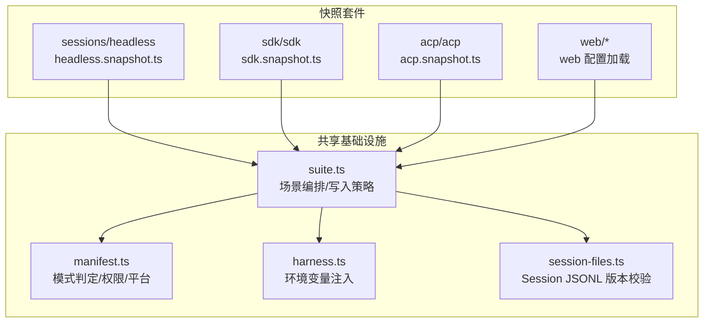
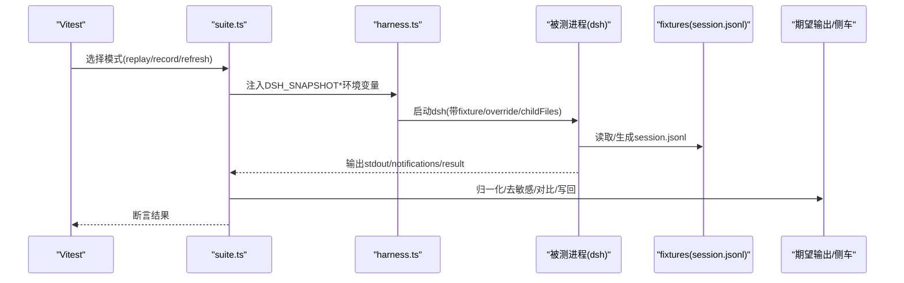
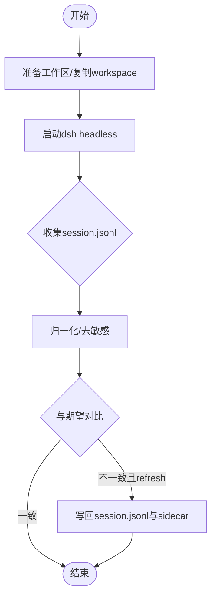
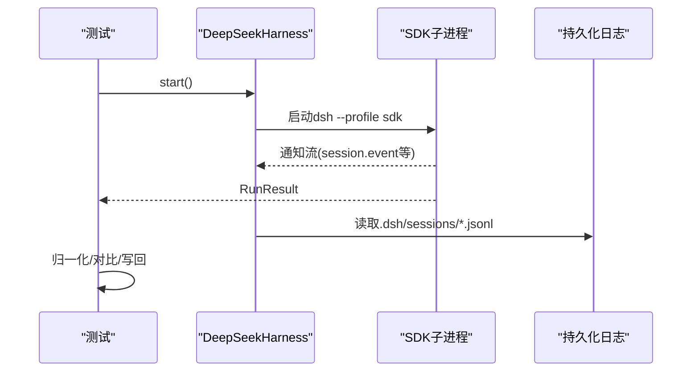
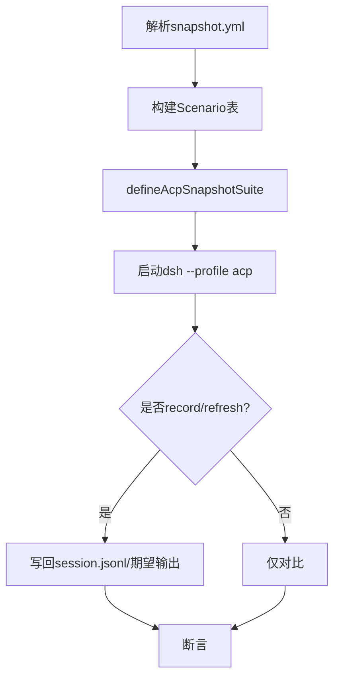
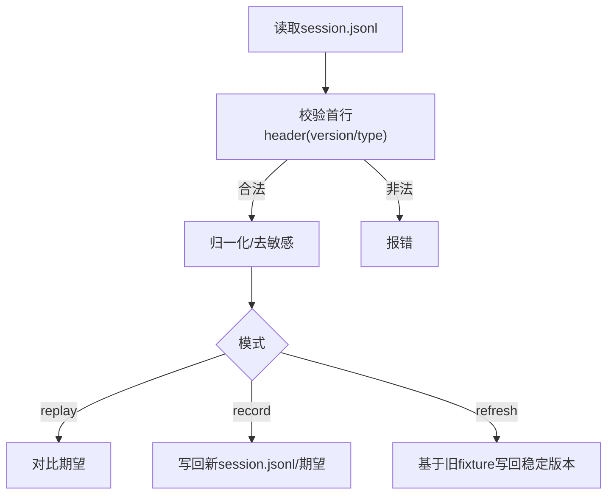
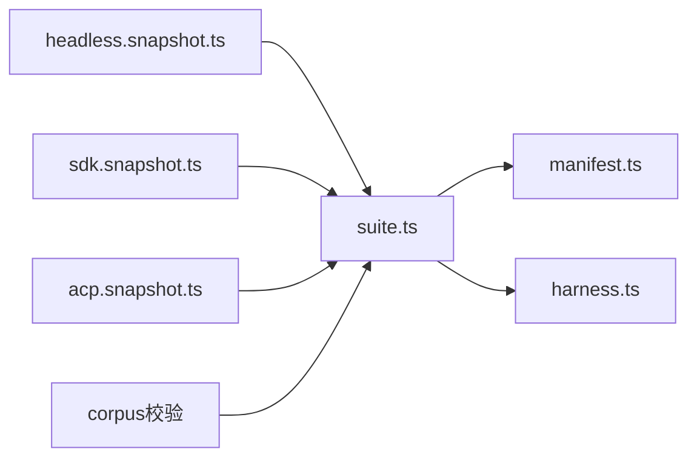

# 快照测试

<cite>
**本文引用的文件**
- [vitest.snapshot.config.ts](file://vitest.snapshot.config.ts)
- [package.json](file://package.json)
- [session-snapshot-corpus.corpus.ts](file://scripts/session-snapshot-corpus.corpus.ts)
- [suite.ts](file://packages/test-support/session-snapshot/src/suite.ts)
- [manifest.ts](file://packages/test-support/session-snapshot/src/manifest.ts)
- [harness.ts](file://packages/test-support/session-snapshot/src/harness.ts)
- [session-files.ts](file://packages/test-support/session-snapshot/src/session-files.ts)
- [acp.snapshot.ts](file://snapshots/acp/acp.snapshot.ts)
- [sdk.snapshot.ts](file://snapshots/sdk/sdk.snapshot.ts)
- [headless.snapshot.ts](file://snapshots/session/headless.snapshot.ts)
- [suite.spec.ts](file://packages/test-support/session-snapshot/tests/suite.spec.ts)
- [session-format-corpus.spec.ts](file://packages/test-support/llm-replay/tests/session-format-corpus.spec.ts)
- [2026-07-27-stable-snapshot-refresh-volatiles.md](file://.agents/notes/implemented/bug-fix/2026-07-27-stable-snapshot-refresh-volatiles.md)
</cite>

## 目录
1. [简介](#简介)
2. [项目结构](#项目结构)
3. [核心组件](#核心组件)
4. [架构总览](#架构总览)
5. [详细组件分析](#详细组件分析)
6. [依赖关系分析](#依赖关系分析)
7. [性能与并发](#性能与并发)
8. [故障排除指南](#故障排除指南)
9. [结论](#结论)
10. [附录：命令与最佳实践](#附录命令与最佳实践)

## 简介
本指南面向 deepseek-harness 的“记录式会话快照”体系，覆盖四类快照场景：会话（headless）、SDK、ACP 与 Web。文档说明 session.jsonl 文件格式与快照记录机制，解释如何通过 test:snapshot:record 与 test:snapshot:refresh 进行录制与更新，并给出设计原则、维护策略与常见问题排查方法。目标是让读者在不深入源码的情况下也能正确编写、运行与维护快照测试。

## 项目结构
仓库将快照用例按“profile”组织在 snapshots 目录下：
- snapshots/session：headless 模式下的会话回放
- snapshots/sdk：通过 dsh --profile sdk 驱动 SDK 运行时
- snapshots/acp：通过 dsh --profile acp 驱动 ACP 协议
- snapshots/web：Web UI 行为快照（由 web 配置加载）

每个场景目录包含：
- snapshot.yml：场景元数据（composition、recording、header 等）
- session.vN.jsonl：持久化的会话日志（JSONL），作为回放输入或产出
- stdout.expected.jsonl / result.expected.json / notifications.expected.jsonl：期望输出
- workspace.expected：最终工作区快照（可选）
- system-prompt.expected.md / tool-schemas.expected.json：侧车文件（系统提示与工具 schema）

图表来源
- [suite.ts:252-281](file://packages/test-support/session-snapshot/src/suite.ts#L252-L281)
- [manifest.ts:124-154](file://packages/test-support/session-snapshot/src/manifest.ts#L124-L154)
- [harness.ts:271-281](file://packages/test-support/session-snapshot/src/harness.ts#L271-L281)
- [session-files.ts:111-136](file://packages/test-support/session-snapshot/src/session-files.ts#L111-L136)

章节来源
- [vitest.snapshot.config.ts:24-67](file://vitest.snapshot.config.ts#L24-L67)
- [session-snapshot-corpus.corpus.ts:23-75](file://scripts/session-snapshot-corpus.corpus.ts#L23-L75)

## 核心组件
- 套件编排器 suite.ts：定义 SnapshotSuiteOptions，统一处理 replay/record/refresh 三种模式，决定何时写入当前 Session fixtures，以及如何处理 sidecar 与期望输出。
- 清单 manifest.ts：声明 profile、platform、permission、sessionFormatCoverage 等约束；提供 writesCurrentSessionFixtures 判断是否允许写回。
- 执行 harness.ts：向被测子进程注入 DSH_SNAPSHOT* 环境变量，控制 fixture 路径、会话根、溢出目录等。
- 会话文件 session-files.ts：解析并校验 session.jsonl 首行 header 的版本字段，确保格式兼容。
- 语料校验 session-snapshot-corpus.corpus.ts：扫描 snapshots 下所有 scenario，断言所有权、pin、sidecar、格式版本等一致性。

章节来源
- [suite.ts:252-281](file://packages/test-support/session-snapshot/src/suite.ts#L252-L281)
- [manifest.ts:124-154](file://packages/test-support/session-snapshot/src/manifest.ts#L124-L154)
- [harness.ts:271-281](file://packages/test-support/session-snapshot/src/harness.ts#L271-L281)
- [session-files.ts:111-136](file://packages/test-support/session-snapshot/src/session-files.ts#L111-L136)
- [session-snapshot-corpus.corpus.ts:100-209](file://scripts/session-snapshot-corpus.corpus.ts#L100-L209)

## 架构总览
三类快照入口分别对应不同 profile，但都复用同一套回放/录制/刷新基础设施：
- headless：通过 dsh CLI 启动 headless 流程，读取 session.jsonl 回放模型响应，比较输出与工作区。
- SDK：通过 dsh --profile sdk 驱动 JSON-RPC 运行时，收集通知流、RunResult 与持久化日志。
- ACP：通过 dsh --profile acp 驱动协议交互，支持 override 与权限/环境注入。
- Web：由 vitest.web.config.ts 与脚本加载，执行浏览器端行为快照（不在本节展开）。

图表来源
- [suite.ts:252-281](file://packages/test-support/session-snapshot/src/suite.ts#L252-L281)
- [harness.ts:271-281](file://packages/test-support/session-snapshot/src/harness.ts#L271-L281)
- [session-files.ts:111-136](file://packages/test-support/session-snapshot/src/session-files.ts#L111-L136)

## 详细组件分析

### Headless（会话）快照
- 入口：snapshots/session/headless.snapshot.ts
- 行为：
  - 收集 scenarios（基于 snapshot.yml 过滤 profile=headless）
  - 准备临时工作区，复制 workspace 种子
  - 通过 dsh CLI 运行，收集 .dsh/sessions 下的 session.jsonl
  - 对输出进行归一化、去敏感、对比，必要时写回 session.jsonl 与 sidecar
  - 验证 packed/unpacked 等价性、stderr 推理重建、端口绑定规则等

图表来源
- [headless.snapshot.ts:164-220](file://snapshots/session/headless.snapshot.ts#L164-L220)
- [headless.snapshot.ts:427-496](file://snapshots/session/headless.snapshot.ts#L427-L496)

章节来源
- [headless.snapshot.ts:583-800](file://snapshots/session/headless.snapshot.ts#L583-L800)

### SDK 快照
- 入口：snapshots/sdk/sdk.snapshot.ts
- 行为：
  - 通过 DeepSeekHarness 启动 dsh --profile sdk
  - 订阅 session.event 通知流，收集 RunResult
  - 从 .dsh/sessions 读取持久化日志，排序父/子会话
  - 归一化通知流、结果、日志，对比期望，必要时写回
  - 支持 dshSdkChild 子进程、动态路由、最小系统提示等断言

图表来源
- [sdk.snapshot.ts:490-626](file://snapshots/sdk/sdk.snapshot.ts#L490-L626)
- [sdk.snapshot.ts:628-737](file://snapshots/sdk/sdk.snapshot.ts#L628-L737)

章节来源
- [sdk.snapshot.ts:1-118](file://snapshots/sdk/sdk.snapshot.ts#L1-L118)
- [sdk.snapshot.ts:739-800](file://snapshots/sdk/sdk.snapshot.ts#L739-L800)

### ACP 快照
- 入口：snapshots/acp/acp.snapshot.ts
- 行为：
  - 使用 defineAcpSnapshotSuite 注册场景
  - 根据 snapshot.yml 解析 recording/header/platform/permission/environment
  - 通过 dsh --profile acp 驱动，支持 cordis 配置与 override
  - 写回 session.jsonl 与 stdout.expected.jsonl（当允许时）

图表来源
- [acp.snapshot.ts:15-91](file://snapshots/acp/acp.snapshot.ts#L15-L91)

章节来源
- [acp.snapshot.ts:1-92](file://snapshots/acp/acp.snapshot.ts#L1-L92)

### Web 快照
- 入口：由 vitest.web.config.ts 与 scripts/run-web-snapshots.ts 管理（本仓库中未直接展示实现细节）
- 行为：
  - 在 CI 中通过脚本批量执行 Web 快照
  - 支持 source/lib 两种模式（lib 需先构建）

章节来源
- [vitest.snapshot.config.ts:47-53](file://vitest.snapshot.config.ts#L47-L53)

### 会话 JSONL 文件格式与记录机制
- 首行必须是 session header，包含 type=session 与 version 字段
- 后续为事件记录（turn/start、request/header、assistant/message 等）
- 记录机制：
  - replay：读取已提交 session.jsonl 作为模型响应回放
  - record：调用真实 API，生成新的 session.jsonl 与期望输出
  - refresh：重放已提交脚本，基于已有 fixture 写回可比的 session.jsonl 与 sidecar，保持稳定性

图表来源
- [session-files.ts:111-136](file://packages/test-support/session-snapshot/src/session-files.ts#L111-L136)
- [suite.ts:1249-1271](file://packages/test-support/session-snapshot/src/suite.ts#L1249-L1271)

章节来源
- [session-format-corpus.spec.ts:34-57](file://packages/test-support/llm-replay/tests/session-format-corpus.spec.ts#L34-L57)

## 依赖关系分析
- 套件层 suite.ts 依赖 manifest.ts 的模式判定与权限/平台约束
- harness.ts 负责向被测进程注入 DSH_SNAPSHOT* 环境变量
- 各 profile 适配器（headless/sdk/acp）通过 suite.ts 统一编排
- 语料校验脚本 session-snapshot-corpus.corpus.ts 保证 corpus 的一致性（所有权、pin、sidecar、格式版本）

图表来源
- [suite.ts:252-281](file://packages/test-support/session-snapshot/src/suite.ts#L252-L281)
- [manifest.ts:124-154](file://packages/test-support/session-snapshot/src/manifest.ts#L124-L154)
- [harness.ts:271-281](file://packages/test-support/session-snapshot/src/harness.ts#L271-L281)

章节来源
- [session-snapshot-corpus.corpus.ts:100-209](file://scripts/session-snapshot-corpus.corpus.ts#L100-L209)

## 性能与并发
- Vitest 配置：
  - 默认最大并发数由 DSH_SNAPSHOT_MAX_CONCURRENCY 控制，上限受可用并行度限制
  - replay 模式可并行执行快照文件，内部并发通过 maxConcurrency 控制
  - record 与 refresh 串行执行，避免并发写回导致期望输出损坏
- 建议：
  - 在受限机器上将 DSH_SNAPSHOT_MAX_CONCURRENCY=1 以完全串行方式运行
  - 仅在 CI 或高性能环境中提高并发

章节来源
- [vitest.snapshot.config.ts:6-22](file://vitest.snapshot.config.ts#L6-L22)
- [vitest.snapshot.config.ts:54-67](file://vitest.snapshot.config.ts#L54-L67)

## 故障排除指南
- 常见错误
  - 未知 DSH_SNAPSHOT 模式：检查环境变量值是否为 replay/record/refresh
  - session.jsonl 首行非 session header：确认文件格式与版本
  - 缺少 pin 或 composition 所有者：确保每个 composition/header class 有唯一 pin，且存在 cordis.yml 拥有者
  - 端口绑定违规：监听必须使用 OS 分配端口（port: 0）
- 刷新不稳定问题
  - 使用 refresh 模式时，框架会尽量保留未变化的唯一 ID，减少不必要变更
  - 若仍出现抖动，检查 normalize 逻辑与 volatile 类别，必要时调整 fixture 或侧车

章节来源
- [suite.spec.ts:114-133](file://packages/test-support/session-snapshot/tests/suite.spec.ts#L114-L133)
- [2026-07-27-stable-snapshot-refresh-volatiles.md:23-33](file://.agents/notes/implemented/bug-fix/2026-07-27-stable-snapshot-refresh-volatiles.md#L23-L33)

## 结论
deepseek-harness 的快照测试体系通过统一的 suite 编排与多 profile 适配器，实现了跨 headless、SDK、ACP 与 Web 的一致化回放/录制/刷新能力。借助严格的语料校验与稳定的写回策略，可在模型输出变化时快速定位差异并安全更新期望。遵循本文的设计原则与命令用法，可有效维护快照一致性并降低维护成本。

## 附录：命令与最佳实践

### 命令速查
- 运行快照测试（默认 replay）：
  - npm run test:snapshot
- 录制快照（调用真实 API，更新 fixtures 与期望输出）：
  - npm run test:snapshot:record
- 刷新快照（重放已提交脚本，更新可比期望）：
  - npm run test:snapshot:refresh

章节来源
- [package.json:39-47](file://package.json#L39-L47)

### 设计原则
- 何时需要快照测试
  - 涉及外部模型响应、网络 I/O、时间戳/ID 等易变因素的场景
  - 需要端到端验证会话生命周期、工具调用、审批流程的工作流
  - 需要稳定回归 UI 行为（Web 快照）
- 维护快照一致性
  - 每个 composition/header class 必须有唯一 pin，并维护 system-prompt/tool-schemas 侧车
  - 使用 refresh 而非 record 更新期望，除非确实需要重新录制真实 API
  - 保持 session.jsonl 格式版本与文件名一致，避免混用 v0/v1/v2
- 处理模型输出变化
  - 优先使用 refresh 模式，利用稳定写回策略最小化变更
  - 若语义变化，审查 diff 并确认符合预期后再提交

章节来源
- [suite.ts:252-281](file://packages/test-support/session-snapshot/src/suite.ts#L252-L281)
- [manifest.ts:124-154](file://packages/test-support/session-snapshot/src/manifest.ts#L124-L154)
- [session-snapshot-corpus.corpus.ts:100-209](file://scripts/session-snapshot-corpus.corpus.ts#L100-L209)