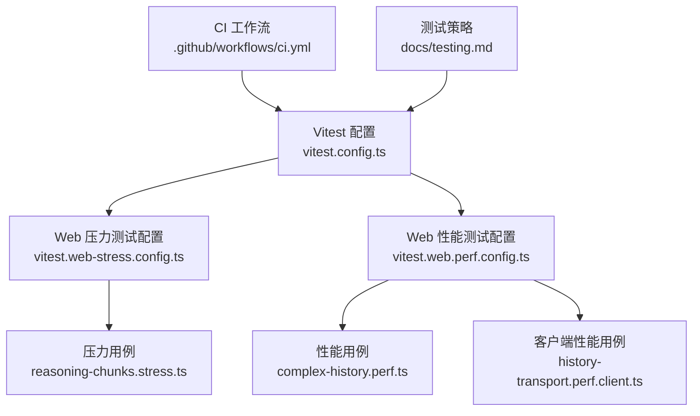
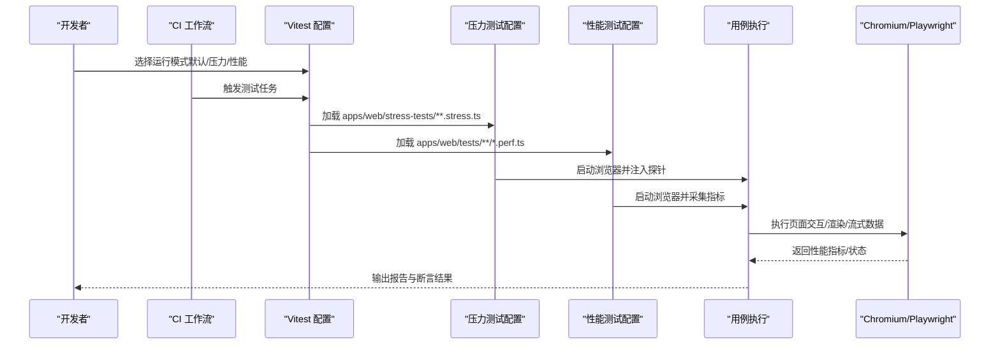
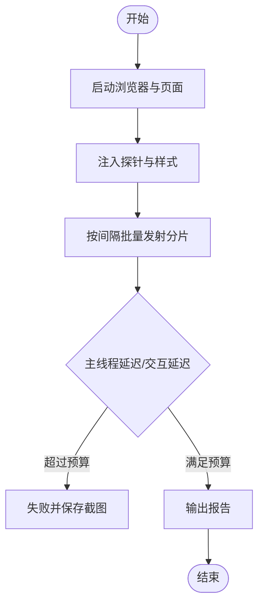
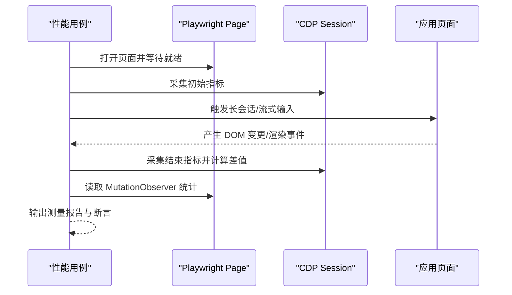
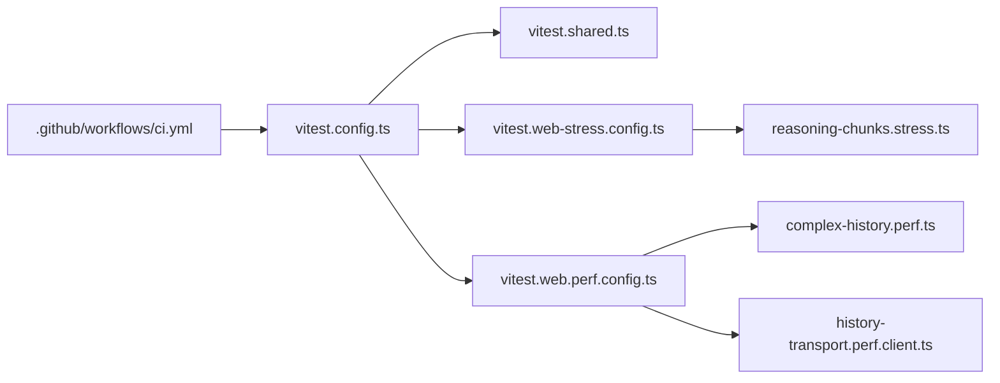

# 性能测试

<cite>
**本文引用的文件**
- [BENCHMARK.md](file://BENCHMARK.md)
- [vitest.config.ts](file://vitest.config.ts)
- [vitest.web-stress.config.ts](file://vitest.web-stress.config.ts)
- [vitest.web.perf.config.ts](file://vitest.web.perf.config.ts)
- [vitest.shared.ts](file://vitest.shared.ts)
- [reasoning-chunks.stress.ts](file://apps/web/stress-tests/reasoning-chunks.stress.ts)
- [complex-history.perf.ts](file://apps/web/tests/complex-history.perf.ts)
- [history-transport.perf.client.ts](file://packages/client/ui-conversation/tests/history-transport.perf.client.ts)
- [ci.yml](file://.github/workflows/ci.yml)
- [testing.md](file://docs/testing.md)
</cite>

## 目录
1. [简介](#简介)
2. [项目结构](#项目结构)
3. [核心组件](#核心组件)
4. [架构总览](#架构总览)
5. [详细组件分析](#详细组件分析)
6. [依赖关系分析](#依赖关系分析)
7. [性能注意事项](#性能注意事项)
8. [故障排查指南](#故障排查指南)
9. [结论](#结论)
10. [附录](#附录)

## 简介
本指南面向在 deepseek-harness 仓库中设计、执行与集成性能测试和基准测试的工程师。内容覆盖：
- 负载测试、压力测试、稳定性测试的设计与执行
- 基准测试的设置、指标采集与结果分析
- 内存泄漏检测、CPU 使用率监控、网络性能测试的具体示例
- 在 CI 环境中集成性能测试，以及性能回归的处理流程
- 性能优化建议与最佳实践

本仓库已提供浏览器端压力与性能测试配置及用例，以及 Python SDK 基准运行说明；同时具备完善的 Vitest 测试框架与 CI 流水线，可作为性能测试的基础设施。

## 项目结构
仓库采用多包与工作区组织，性能相关能力集中在以下位置：
- 浏览器端性能与压力测试配置与用例
  - 压力测试配置：apps/web/stress-tests/**.stress.ts
  - 性能测试配置：apps/web/tests/**/*.perf.ts
  - 共享测试工具：apps/web/tests/scaffold.ts、support.ts
- Python SDK 基准说明：BENCHMARK.md
- 通用 Vitest 配置与共享插件：vitest.config.ts、vitest.shared.ts
- CI 工作流：.github/workflows/ci.yml
- 测试策略文档：docs/testing.md

图表来源
- [vitest.config.ts:158-200](file://vitest.config.ts#L158-L200)
- [vitest.web-stress.config.ts:5-15](file://vitest.web-stress.config.ts#L5-L15)
- [vitest.web.perf.config.ts:5-21](file://vitest.web.perf.config.ts#L5-L21)
- [reasoning-chunks.stress.ts:1-154](file://apps/web/stress-tests/reasoning-chunks.stress.ts#L1-L154)
- [complex-history.perf.ts:1-120](file://apps/web/tests/complex-history.perf.ts#L1-L120)
- [history-transport.perf.client.ts:496-523](file://packages/client/ui-conversation/tests/history-transport.perf.client.ts#L496-L523)
- [ci.yml:1-120](file://.github/workflows/ci.yml#L1-L120)
- [testing.md:1-55](file://docs/testing.md#L1-L55)

章节来源
- [vitest.config.ts:158-200](file://vitest.config.ts#L158-L200)
- [vitest.web-stress.config.ts:5-15](file://vitest.web-stress.config.ts#L5-L15)
- [vitest.web.perf.config.ts:5-21](file://vitest.web.perf.config.ts#L5-L21)
- [reasoning-chunks.stress.ts:1-154](file://apps/web/stress-tests/reasoning-chunks.stress.ts#L1-L154)
- [complex-history.perf.ts:1-120](file://apps/web/tests/complex-history.perf.ts#L1-L120)
- [history-transport.perf.client.ts:496-523](file://packages/client/ui-conversation/tests/history-transport.perf.client.ts#L496-L523)
- [ci.yml:1-120](file://.github/workflows/ci.yml#L1-L120)
- [testing.md:1-55](file://docs/testing.md#L1-L55)

## 核心组件
- 浏览器压力测试（Opt-in）
  - 通过独立配置文件启用，仅包含 *.stress.ts，关闭文件并行，设置较长超时，适合高负载场景。
- 浏览器性能测试（Opt-in）
  - 继承 Web 测试配置，启用 --expose-gc 以支持强制 GC 基线测量，包含长历史渲染、传输压缩等用例。
- 共享测试工具
  - 统一装饰器预处理、Node 环境标志处理，确保测试可重复性与覆盖率一致性。
- Python SDK 基准
  - 提供最小化 agent 变体的基准运行指引，强调隔离工作区与会话 ID。

章节来源
- [vitest.web-stress.config.ts:5-15](file://vitest.web-stress.config.ts#L5-L15)
- [vitest.web.perf.config.ts:5-21](file://vitest.web.perf.config.ts#L5-L21)
- [vitest.shared.ts:5-43](file://vitest.shared.ts#L5-L43)
- [BENCHMARK.md:1-4](file://BENCHMARK.md#L1-L4)

## 架构总览
下图展示从配置到用例执行的端到端路径，以及 CI 如何触发这些测试。

图表来源
- [vitest.config.ts:158-200](file://vitest.config.ts#L158-L200)
- [vitest.web-stress.config.ts:5-15](file://vitest.web-stress.config.ts#L5-L15)
- [vitest.web.perf.config.ts:5-21](file://vitest.web.perf.config.ts#L5-L21)
- [reasoning-chunks.stress.ts:46-154](file://apps/web/stress-tests/reasoning-chunks.stress.ts#L46-L154)
- [complex-history.perf.ts:520-585](file://apps/web/tests/complex-history.perf.ts#L520-L585)
- [ci.yml:1-120](file://.github/workflows/ci.yml#L1-L120)

## 详细组件分析

### 浏览器压力测试：推理分片风暴
- 目标：验证在大量推理分片持续到达时，主线程响应与用户交互延迟是否保持在预算内。
- 关键实现要点
  - 通过 Playwright 启动 Chromium，注入脚本记录心跳间隔与交互延迟。
  - 使用固定间隔批量发射分片，维持 UI 处于“思考”行展开状态。
  - 断言最大主线程延迟与交互延迟不超过阈值，且无控制台错误/警告。
- 指标与断言
  - 最大主线程延迟、交互延迟、心跳采样数、分片发射计数。
  - 失败时自动保存截图以便定位。

图表来源
- [reasoning-chunks.stress.ts:46-154](file://apps/web/stress-tests/reasoning-chunks.stress.ts#L46-L154)

章节来源
- [reasoning-chunks.stress.ts:46-154](file://apps/web/stress-tests/reasoning-chunks.stress.ts#L46-L154)

### 浏览器性能测试：长会话渲染与内存保留
- 目标：评估长历史会话渲染、流式增量更新、压缩传输对 CPU、内存、DOM 的影响。
- 关键实现要点
  - 通过 CDP 获取 Chromium 性能指标（TaskDuration、ScriptDuration、LayoutDuration、RecalcStyleDuration、Nodes、JSEventListeners、JSHeapUsedSize）。
  - 在操作前后采集指标，计算差值作为测量结果。
  - 使用 MutationObserver 统计 DOM 变更批次与记录数，评估渲染效率。
  - 支持“浸泡”场景：长时间对话后检查内存与渲染是否稳定。
- 指标与断言
  - wallMs、taskMs、scriptMs、layoutMs、recalcStyleMs、devtoolsMs
  - nodesDelta、listenersDelta、heapDeltaMb、totalNodes、heapMb
  - 用户交互到首次绘制、首条消息到达、流完成时间等时序指标

图表来源
- [complex-history.perf.ts:520-585](file://apps/web/tests/complex-history.perf.ts#L520-L585)
- [complex-history.perf.ts:587-622](file://apps/web/tests/complex-history.perf.ts#L587-L622)
- [complex-history.perf.ts:624-784](file://apps/web/tests/complex-history.perf.ts#L624-L784)

章节来源
- [complex-history.perf.ts:520-585](file://apps/web/tests/complex-history.perf.ts#L520-L585)
- [complex-history.perf.ts:587-622](file://apps/web/tests/complex-history.perf.ts#L587-L622)
- [complex-history.perf.ts:624-784](file://apps/web/tests/complex-history.perf.ts#L624-L784)

### 客户端传输性能：压缩与内存峰值
- 目标：对比原始与紧凑格式在序列化、压缩（gzip/brotli）与内存峰值上的差异。
- 关键实现要点
  - 分别测量 entry wrap、stringify、gzip、brotli 耗时。
  - 采集 host/client 额外堆峰值样本，计算减少百分比。
- 指标与断言
  - 各阶段耗时、压缩比、内存峰值与减少比例。

章节来源
- [history-transport.perf.client.ts:496-523](file://packages/client/ui-conversation/tests/history-transport.perf.client.ts#L496-L523)

### Python SDK 基准运行
- 目标：为 Python SDK 提供最小化 agent 变体的基准运行方法。
- 关键要点
  - 遵循 Python SDK 入门指南安装与运行 jsonrpc-agent 最小变体。
  - 使用独立工作区与会话 ID 保证基准任务隔离。

章节来源
- [BENCHMARK.md:1-4](file://BENCHMARK.md#L1-L4)

## 依赖关系分析
- 配置层
  - vitest.config.ts 定义全局测试入口、覆盖率门控、平台排除与进程隔离策略。
  - vitest.web-stress.config.ts 与 vitest.web.perf.config.ts 分别扩展 Web 测试配置，启用特定用例集与运行时参数。
  - vitest.shared.ts 提供装饰器预处理与环境标志，确保跨平台一致行为。
- 用例层
  - reasoning-chunks.stress.ts 依赖 Playwright 与 Web 脚手架进行压力测试。
  - complex-history.perf.ts 依赖 Playwright 与 CDP 采集浏览器指标，结合 MutationObserver 评估渲染。
  - history-transport.perf.client.ts 聚焦传输与压缩性能。
- CI 层
  - ci.yml 定义了静态检查、覆盖率、兼容性、Windows 构建与原生测试等任务，可作为性能测试的集成参考。

图表来源
- [vitest.config.ts:158-200](file://vitest.config.ts#L158-L200)
- [vitest.shared.ts:5-43](file://vitest.shared.ts#L5-L43)
- [vitest.web-stress.config.ts:5-15](file://vitest.web-stress.config.ts#L5-L15)
- [vitest.web.perf.config.ts:5-21](file://vitest.web.perf.config.ts#L5-L21)
- [reasoning-chunks.stress.ts:1-154](file://apps/web/stress-tests/reasoning-chunks.stress.ts#L1-L154)
- [complex-history.perf.ts:1-120](file://apps/web/tests/complex-history.perf.ts#L1-L120)
- [history-transport.perf.client.ts:496-523](file://packages/client/ui-conversation/tests/history-transport.perf.client.ts#L496-L523)
- [ci.yml:1-120](file://.github/workflows/ci.yml#L1-L120)

章节来源
- [vitest.config.ts:158-200](file://vitest.config.ts#L158-L200)
- [vitest.shared.ts:5-43](file://vitest.shared.ts#L5-L43)
- [vitest.web-stress.config.ts:5-15](file://vitest.web-stress.config.ts#L5-L15)
- [vitest.web.perf.config.ts:5-21](file://vitest.web.perf.config.ts#L5-L21)
- [reasoning-chunks.stress.ts:1-154](file://apps/web/stress-tests/reasoning-chunks.stress.ts#L1-L154)
- [complex-history.perf.ts:1-120](file://apps/web/tests/complex-history.perf.ts#L1-L120)
- [history-transport.perf.client.ts:496-523](file://packages/client/ui-conversation/tests/history-transport.perf.client.ts#L496-L523)
- [ci.yml:1-120](file://.github/workflows/ci.yml#L1-L120)

## 性能注意事项
- 负载测试
  - 使用压力测试配置（*.stress.ts）模拟高并发或大数据量场景，关闭文件并行以避免资源竞争干扰。
  - 通过固定间隔批量发射数据，观察主线程阻塞与交互延迟。
- 压力测试
  - 延长测试与钩子超时，确保在高负载下仍有足够时间完成初始化与清理。
  - 失败时保留截图与日志，便于复现与定位。
- 稳定性测试
  - 采用“浸泡”场景：长时间运行后检查内存与渲染是否稳定，避免渐进式泄漏。
  - 定期采集指标并比较基线，识别缓慢退化。
- 基准测试
  - 使用性能测试配置（*.perf.ts），开启 --expose-gc 以支持强制 GC 基线测量。
  - 通过 CDP 指标与 MutationObserver 综合评估 CPU、内存与 DOM 变化。
- 内存泄漏检测
  - 在性能用例中调用 HeapProfiler.collectGarbage 后再采集 JSHeapUsedSize，比较前后差值。
  - 关注节点数、监听器数量与堆大小增长趋势。
- CPU 使用率监控
  - 通过 TaskDuration、ScriptDuration、LayoutDuration、RecalcStyleDuration 等指标评估 CPU 占用。
  - 将多次运行的结果取中位数或 P95，降低噪声影响。
- 网络性能测试
  - 对比不同压缩策略（gzip、brotli）的耗时与体积，评估传输效率。
  - 记录首字节到达、首帧绘制与流完成时间，衡量端到端体验。
- CI 集成
  - 将性能用例纳入可选的 CI 任务，避免阻塞常规 PR 流程。
  - 使用缓存与并行度控制，缩短执行时间。
- 性能回归处理
  - 建立基线与阈值，当指标超出预算时标记回归并生成报告。
  - 结合快照与预期输出，确保功能正确性不受性能优化影响。

[本节为通用指导，不直接分析具体文件]

## 故障排查指南
- 浏览器未就绪或选择器等待失败
  - 检查页面加载策略与等待条件，必要时增加超时。
  - 查看控制台错误与警告，确认无异常中断。
- 指标不可用
  - 确认 CDP 会话可用，所需指标名称存在。
  - 若指标缺失，回退到替代指标或跳过该断言。
- 内存泄漏怀疑
  - 在关键步骤前后采集堆大小与节点数，观察增长趋势。
  - 强制 GC 后再次采集，确认是否为真实泄漏。
- 主线程卡顿
  - 分析 TaskDuration 与 ScriptDuration 的变化，定位耗时操作。
  - 减少一次性渲染量，拆分任务或使用虚拟滚动。
- 网络传输瓶颈
  - 对比不同压缩策略的耗时与体积，选择合适的压缩方案。
  - 检查首字节到达与流完成时间，优化后端响应。

章节来源
- [reasoning-chunks.stress.ts:46-154](file://apps/web/stress-tests/reasoning-chunks.stress.ts#L46-L154)
- [complex-history.perf.ts:520-585](file://apps/web/tests/complex-history.perf.ts#L520-L585)
- [history-transport.perf.client.ts:496-523](file://packages/client/ui-conversation/tests/history-transport.perf.client.ts#L496-L523)

## 结论
本仓库提供了完整的浏览器端压力与性能测试基础设施，配合 Vitest 与 Playwright，能够高效地设计和执行负载、压力与稳定性测试。通过 CDP 指标与 MutationObserver，可以精确采集 CPU、内存与 DOM 变化，支撑基准测试与回归检测。Python SDK 基准说明为服务端侧的性能评估提供了补充。建议在 CI 中集成可选的性能任务，建立基线与阈值，及时识别并处理性能回归。

[本节为总结，不直接分析具体文件]

## 附录
- 快速开始
  - 浏览器压力测试：使用压力测试配置运行 *.stress.ts 用例。
  - 浏览器性能测试：使用性能测试配置运行 *.perf.ts 用例。
  - Python SDK 基准：遵循基准说明安装并运行最小化 agent 变体。
- 最佳实践
  - 明确测试目标与指标，避免过度断言。
  - 使用隔离环境与缓存，提升执行效率。
  - 定期回顾基线与阈值，适应产品演进。

[本节为补充信息，不直接分析具体文件]