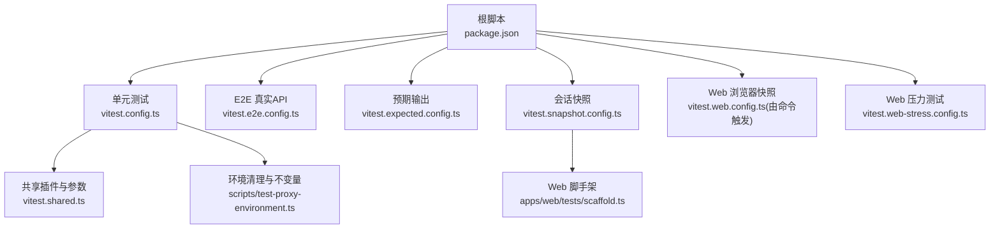
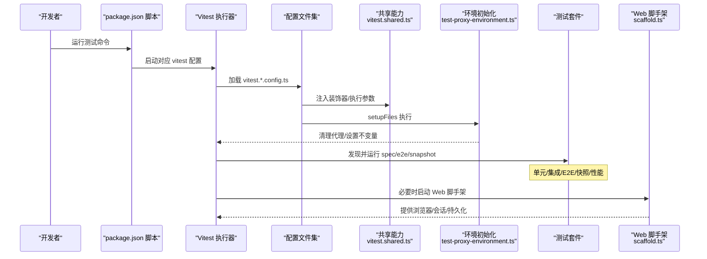
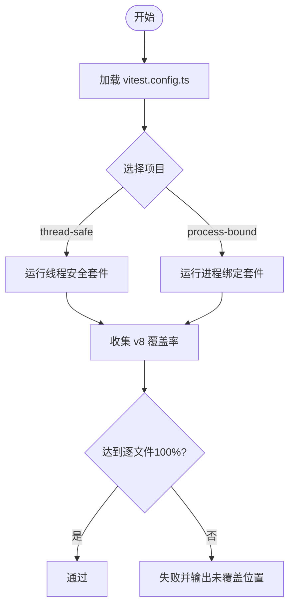
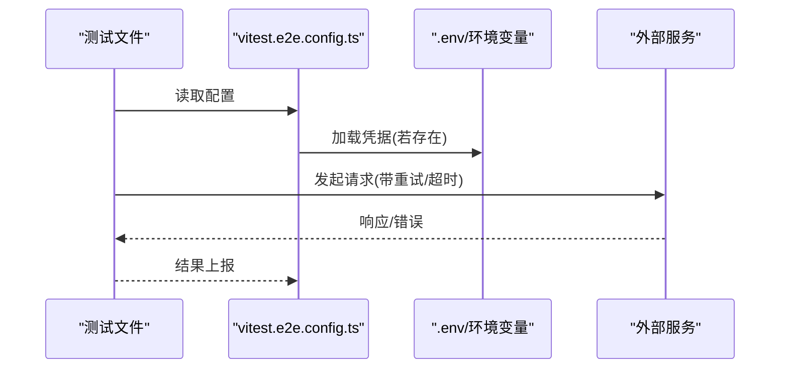
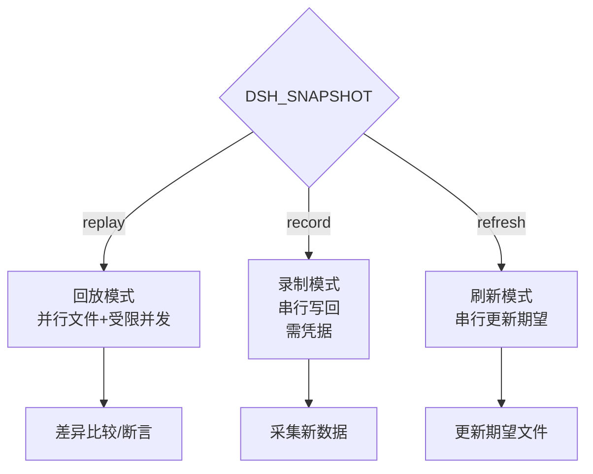
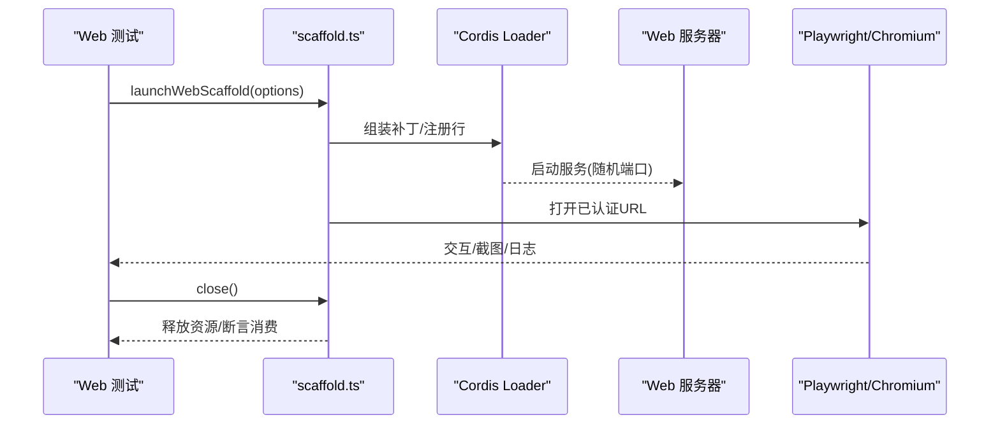
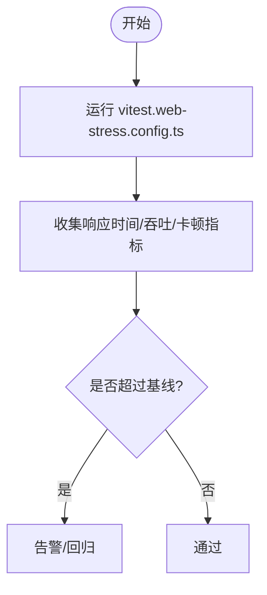
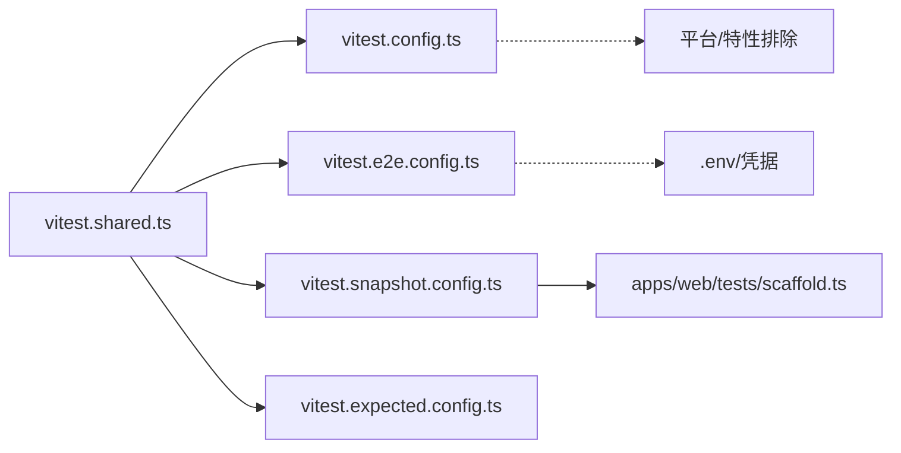

# 测试策略

<cite>
**本文引用的文件**
- [vitest.config.ts](file://vitest.config.ts)
- [vitest.e2e.config.ts](file://vitest.e2e.config.ts)
- [vitest.expected.config.ts](file://vitest.expected.config.ts)
- [vitest.snapshot.config.ts](file://vitest.snapshot.config.ts)
- [vitest.web-stress.config.ts](file://vitest.web-stress.config.ts)
- [vitest.shared.ts](file://vitest.shared.ts)
- [scripts/test-proxy-environment.ts](file://scripts/test-proxy-environment.ts)
- [package.json](file://package.json)
- [docs/testing.md](file://docs/testing.md)
- [apps/web/tests/scaffold.ts](file://apps/web/tests/scaffold.ts)
- [.agents/skills/dsh-ci-test-reliability/SKILL.md](file://.agents/skills/dsh-ci-test-reliability/SKILL.md)
</cite>

## 目录
1. [简介](#简介)
2. [项目结构](#项目结构)
3. [核心组件](#核心组件)
4. [架构总览](#架构总览)
5. [详细组件分析](#详细组件分析)
6. [依赖关系分析](#依赖关系分析)
7. [性能考虑](#性能考虑)
8. [故障排查指南](#故障排查指南)
9. [结论](#结论)
10. [附录](#附录)

## 简介
本指南面向 deepseek-harness 仓库的测试体系，覆盖单元测试、集成测试、端到端（E2E）测试、快照与预期输出测试、Web 浏览器测试、性能/压力测试，以及覆盖率门禁与质量门禁。文档基于仓库现有配置与实践，给出可操作的策略、最佳实践与环境搭建说明，并解释 Mock/Stub 的使用边界、外部依赖模拟与服务虚拟化方法。

## 项目结构
仓库采用多包 monorepo 组织，测试按“层”划分：
- 单元测试：基于 Vitest，运行在 fork 模式，逐文件 100% 覆盖率门禁。
- E2E 真实 API 测试：独立配置，支持重试、并发上限与凭据加载。
- 预期输出测试：无密钥的组装式 CLI/进程期望断言。
- 会话快照测试：回放/录制/刷新三种模式，驱动真实子进程与持久化。
- Web 浏览器快照：Chromium 对比 UI 输出，CI 只读回放。
- 性能/压力测试：可选的浏览器性能通道，默认不纳入常规套件。

**图示来源**
- [package.json:19-63](file://package.json#L19-L63)
- [vitest.config.ts:158-200](file://vitest.config.ts#L158-L200)
- [vitest.e2e.config.ts:31-61](file://vitest.e2e.config.ts#L31-L61)
- [vitest.expected.config.ts:7-19](file://vitest.expected.config.ts#L7-L19)
- [vitest.snapshot.config.ts:39-67](file://vitest.snapshot.config.ts#L39-L67)
- [vitest.web-stress.config.ts:5-15](file://vitest.web-stress.config.ts#L5-L15)
- [vitest.shared.ts:1-43](file://vitest.shared.ts#L1-L43)
- [scripts/test-proxy-environment.ts:26-63](file://scripts/test-proxy-environment.ts#L26-L63)
- [apps/web/tests/scaffold.ts:1-12](file://apps/web/tests/scaffold.ts#L1-L12)

**章节来源**
- [package.json:19-63](file://package.json#L19-L63)
- [docs/testing.md:7-17](file://docs/testing.md#L7-L17)

## 核心组件
- 统一测试入口与命令：通过根脚本暴露 test、test:coverage、test:e2e、test:expected、test:snapshot、test:web、test:web:perf、test:web:stress 等命令，便于分层执行与 CI 编排。
- 单元测试工程：双项目（线程安全/进程绑定），fork 隔离，严格排除平台不支持用例，v8 覆盖率逐文件 100% 门禁。
- E2E 真实 API：独立配置，自动加载 .env，超时与重试调优，并发上限可调，避免对配额敏感场景造成拥塞。
- 预期输出：仅包含 apps/cli 的预期 e2e 用例，适合无模型调用时的快速回归。
- 会话快照：支持 replay/record/refresh 三态；replay 并行但限制文件内并发；record 串行写回；refresh 串行更新期望。
- Web 浏览器快照：基于真实装配的应用，使用 Playwright 驱动 Chromium，CI 强制只读回放。
- 共享能力：装饰器预处理、Node Web Storage 标志禁用、代理环境变量清理、不变量检查。

**章节来源**
- [package.json:19-63](file://package.json#L19-L63)
- [vitest.config.ts:158-200](file://vitest.config.ts#L158-L200)
- [vitest.e2e.config.ts:31-61](file://vitest.e2e.config.ts#L31-L61)
- [vitest.expected.config.ts:7-19](file://vitest.expected.config.ts#L7-L19)
- [vitest.snapshot.config.ts:39-67](file://vitest.snapshot.config.ts#L39-L67)
- [vitest.web-stress.config.ts:5-15](file://vitest.web-stress.config.ts#L5-L15)
- [vitest.shared.ts:1-43](file://vitest.shared.ts#L1-L43)
- [scripts/test-proxy-environment.ts:26-63](file://scripts/test-proxy-environment.ts#L26-L63)

## 架构总览
下图展示从命令到具体测试执行的链路，以及关键环境与资源管理点。

**图示来源**
- [package.json:19-63](file://package.json#L19-L63)
- [vitest.config.ts:158-200](file://vitest.config.ts#L158-L200)
- [vitest.e2e.config.ts:31-61](file://vitest.e2e.config.ts#L31-L61)
- [vitest.snapshot.config.ts:39-67](file://vitest.snapshot.config.ts#L39-L67)
- [vitest.shared.ts:1-43](file://vitest.shared.ts#L1-L43)
- [scripts/test-proxy-environment.ts:26-63](file://scripts/test-proxy-environment.ts#L26-L63)
- [apps/web/tests/scaffold.ts:1-12](file://apps/web/tests/scaffold.ts#L1-L12)

## 详细组件分析

### 单元测试与覆盖率门禁
- 执行方式：分两个项目（thread-safe/process-bound），均使用 fork 池隔离进程级状态，避免共享线程路径导致的稳定性问题。
- 包含/排除：按平台与特性过滤，Windows 与 webworker 特定用例被排除或豁免。
- 覆盖率：v8 提供者，仅统计 packages/*/src 下的源码；类型/入口/实验性模块按策略豁免；阈值逐文件 100%（语句/分支/函数/行）。
- 报告：CI 输出文本与自定义未覆盖位置报告；本地额外生成 HTML。

**图示来源**
- [vitest.config.ts:158-200](file://vitest.config.ts#L158-L200)
- [vitest.config.ts:201-371](file://vitest.config.ts#L201-L371)

**章节来源**
- [vitest.config.ts:158-200](file://vitest.config.ts#L158-L200)
- [vitest.config.ts:201-371](file://vitest.config.ts#L201-L371)

### E2E 真实 API 测试
- 配置要点：独立配置文件，自动加载根 .env；超时与钩子超时放宽；重试 2 次；文件级并行受控（默认最多 4 工作进程）。
- 适用场景：需要真实模型/第三方服务的冒烟与集成验证；无凭据时自跳过，保证 keyless CI 稳定。

**图示来源**
- [vitest.e2e.config.ts:1-63](file://vitest.e2e.config.ts#L1-L63)

**章节来源**
- [vitest.e2e.config.ts:1-63](file://vitest.e2e.config.ts#L1-L63)

### 预期输出与快照测试
- 预期输出：针对 CLI/进程的无模型调用场景，断言最终产物一致性。
- 会话快照：支持 replay/record/refresh；replay 并行但限制文件内并发；record 串行写回；refresh 串行更新期望；CI 强制只读回放。
- Web 快照：基于真实装配应用，Chromium 比对 UI 输出，CI 只读回放。

**图示来源**
- [vitest.snapshot.config.ts:1-68](file://vitest.snapshot.config.ts#L1-L68)
- [apps/web/tests/scaffold.ts:1-12](file://apps/web/tests/scaffold.ts#L1-L12)

**章节来源**
- [vitest.expected.config.ts:1-20](file://vitest.expected.config.ts#L1-L20)
- [vitest.snapshot.config.ts:1-68](file://vitest.snapshot.config.ts#L1-L68)
- [apps/web/tests/scaffold.ts:1-12](file://apps/web/tests/scaffold.ts#L1-L12)

### Web 浏览器测试与脚手架
- 脚手架职责：启动真实装配的 Web 应用，注入 Replay 适配器或路由适配器，隔离工作区与持久化根，控制端口与认证 Cookie，提供 whenTurnSettled 等协作原语。
- 模式切换：通过 DSH_SNAPSHOT 控制 replay/record/refresh；record 需要凭据；replay/refresh 无需真实模型调用。
- 资源隔离：临时目录、独立 $DSH_HOME、固定 skill roots、关闭无关功能（如 agent-instructions、session-title-llm），确保金样稳定。

**图示来源**
- [apps/web/tests/scaffold.ts:1-12](file://apps/web/tests/scaffold.ts#L1-L12)
- [apps/web/tests/scaffold.ts:418-800](file://apps/web/tests/scaffold.ts#L418-L800)

**章节来源**
- [apps/web/tests/scaffold.ts:1-12](file://apps/web/tests/scaffold.ts#L1-L12)
- [apps/web/tests/scaffold.ts:418-800](file://apps/web/tests/scaffold.ts#L418-L800)

### 性能与压力测试
- 浏览器性能通道：单独配置文件，包含 stress-tests，默认不包含在常规套件中；超时较长，禁止文件并行，适合显式性能证据。
- 建议：将确定性聚焦测试用于发布前数量/内容/抢占顺序断言；压力测试作为补充信号，不作为唯一依据。

**图示来源**
- [vitest.web-stress.config.ts:1-15](file://vitest.web-stress.config.ts#L1-L15)

**章节来源**
- [vitest.web-stress.config.ts:1-15](file://vitest.web-stress.config.ts#L1-L15)

### 测试数据管理与环境搭建
- 环境变量：E2E/快照录制会尝试加载根 .env；其他模式默认不加载，避免意外写入或外发。
- 代理与网络：setupFiles 统一清理代理相关环境变量，防止测试污染全局网络行为。
- 工作空间隔离：Web 脚手架为每个场景创建临时工作区与持久化根，锁定 $DSH_HOME、skill roots，避免用户目录干扰。
- 进程/端口：随机端口绑定，认证 Cookie 传递；CLI/进程测试通过构建产物执行，避免 tsx 掩盖的问题。

**章节来源**
- [vitest.e2e.config.ts:1-63](file://vitest.e2e.config.ts#L1-L63)
- [vitest.snapshot.config.ts:1-68](file://vitest.snapshot.config.ts#L1-L68)
- [scripts/test-proxy-environment.ts:26-63](file://scripts/test-proxy-environment.ts#L26-L63)
- [apps/web/tests/scaffold.ts:418-800](file://apps/web/tests/scaffold.ts#L418-L800)

### Mock 与 Stub 策略
- 原则：优先使用真实实现；仅在昂贵或非确定边界（LLM 适配器、网络、时钟）进行模拟。
- 会话回放：通过 Replay 适配器注入记录脚本，保持下游管线真实，仅替换模型流；路由适配器在无模型调用场景下提供最小可用面。
- 外部依赖：通过环境变量与补丁行（如 llm-deepseek 禁用/替换、搜索端点重写）完成服务虚拟化。

**章节来源**
- [docs/testing.md:22-40](file://docs/testing.md#L22-L40)
- [apps/web/tests/scaffold.ts:216-247](file://apps/web/tests/scaffold.ts#L216-L247)

### 测试覆盖率要求与质量门禁
- 覆盖率：v8 提供者，仅统计产品源码；逐文件 100% 门禁（语句/分支/函数/行）；大量类型/入口/客户端 UI 代码按策略豁免。
- 报告：CI 输出未覆盖位置明细；本地生成 HTML 报告。
- 门禁：通过根脚本 check:* 系列命令接入 CI gates；覆盖率门禁与快照门禁分离。

**章节来源**
- [vitest.config.ts:201-371](file://vitest.config.ts#L201-L371)
- [package.json:56-63](file://package.json#L56-L63)

### 测试驱动开发（TDD）实践指导
- 以契约回归为核心：优先编写边缘情况、错误路径、事件顺序、并发竞态与永久回归用例。
- 先写失败用例：引入缺陷后观察失败，再修复并确保用例持续通过。
- 结合快照：非平凡模型/协议/人类可见变更应配套会话快照，确保端到端语义稳定。

**章节来源**
- [docs/testing.md:7-17](file://docs/testing.md#L7-L17)
- [docs/testing.md:22-40](file://docs/testing.md#L22-L40)

## 依赖关系分析
- 配置间依赖：所有 vitest 配置共享 vitest.shared.ts 提供的装饰器预处理与执行参数；E2E/快照/预期输出各自定义 include/exclude 与并发策略。
- 运行时依赖：Web 脚手架依赖 Cordis Loader、App Boot、Session 格式与回放库；E2E 依赖外部凭据与网络。
- 平台差异：Windows 与 webworker 相关套件通过排除/豁免策略处理，保证跨平台一致性。

**图示来源**
- [vitest.shared.ts:1-43](file://vitest.shared.ts#L1-L43)
- [vitest.config.ts:158-200](file://vitest.config.ts#L158-L200)
- [vitest.e2e.config.ts:31-61](file://vitest.e2e.config.ts#L31-L61)
- [vitest.snapshot.config.ts:39-67](file://vitest.snapshot.config.ts#L39-L67)
- [vitest.expected.config.ts:7-19](file://vitest.expected.config.ts#L7-L19)
- [apps/web/tests/scaffold.ts:1-12](file://apps/web/tests/scaffold.ts#L1-L12)

**章节来源**
- [vitest.shared.ts:1-43](file://vitest.shared.ts#L1-L43)
- [vitest.config.ts:158-200](file://vitest.config.ts#L158-L200)
- [vitest.e2e.config.ts:31-61](file://vitest.e2e.config.ts#L31-L61)
- [vitest.snapshot.config.ts:39-67](file://vitest.snapshot.config.ts#L39-L67)
- [vitest.expected.config.ts:7-19](file://vitest.expected.config.ts#L7-L19)
- [apps/web/tests/scaffold.ts:1-12](file://apps/web/tests/scaffold.ts#L1-L12)

## 性能考虑
- 并发控制：E2E 与快照分别提供 maxWorkers/fileParallelism/maxConcurrency 调节；压力测试禁用文件并行，避免资源争用。
- 超时预算：E2E/快照/压力测试均提高超时，适配慢速后端与复杂场景。
- 资源隔离：fork 模式与临时目录减少跨测试干扰；Web 脚手架锁定端口与持久化路径，避免竞争。
- 建议：将耗时任务拆分至专用通道（e2e/snapshot/stress），并通过环境变量精细控制并行度。

**章节来源**
- [vitest.e2e.config.ts:31-61](file://vitest.e2e.config.ts#L31-L61)
- [vitest.snapshot.config.ts:39-67](file://vitest.snapshot.config.ts#L39-L67)
- [vitest.web-stress.config.ts:5-15](file://vitest.web-stress.config.ts#L5-L15)
- [vitest.config.ts:158-200](file://vitest.config.ts#L158-L200)

## 故障排查指南
- 常见不稳定因素：进程全局状态、端口/路径/命名空间冲突、定时器/时区/语言环境、模块 mock、console hook、globalThis、全局 fetch 拦截。
- 资源分配：使用资源拥有者的分配器，原子获取；私有临时根；唯一命名空间；独占创建。
- 恢复策略：捕获原始状态、立即注册恢复、try/finally 包裹最小作用域、afterEach 兜底。
- 诊断流程：参考 CI 可靠性技能中的分类与定位方法，优先复现单测失败，再扩展至集成/E2E。

**章节来源**
- [.agents/skills/dsh-ci-test-reliability/SKILL.md:31-54](file://.agents/skills/dsh-ci-test-reliability/SKILL.md#L31-L54)

## 结论
本仓库建立了分层清晰、可组合且高可靠性的测试体系：以严格的单元测试与覆盖率门禁为基础，辅以 E2E、快照与 Web 浏览器测试保障端到端正确性，并通过性能/压力通道提供稳健性信号。配合环境隔离、Mock/Stub 策略与质量门禁，可在快速迭代的同时维持高质量交付。

## 附录
- 常用命令
  - 单元测试：pnpm run test
  - 覆盖率：pnpm run test:coverage
  - E2E 真实 API：pnpm run test:e2e
  - 预期输出：pnpm run test:expected
  - 会话快照：pnpm run test:snapshot / record / refresh
  - Web 浏览器：pnpm run test:web / test:web:perf / test:web:stress
- 关键环境变量
  - DSH_E2E_MAX_WORKERS：E2E 最大并发
  - DSH_SNAPSHOT：快照模式（replay/record/refresh）
  - DSH_SNAPSHOT_MAX_CONCURRENCY：快照文件内并发
  - DEEPSEEK_API_KEY：录制模式所需凭据

**章节来源**
- [package.json:19-63](file://package.json#L19-L63)
- [vitest.e2e.config.ts:1-63](file://vitest.e2e.config.ts#L1-L63)
- [vitest.snapshot.config.ts:1-68](file://vitest.snapshot.config.ts#L1-L68)