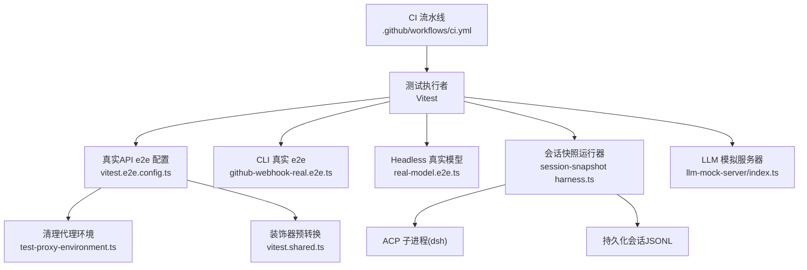
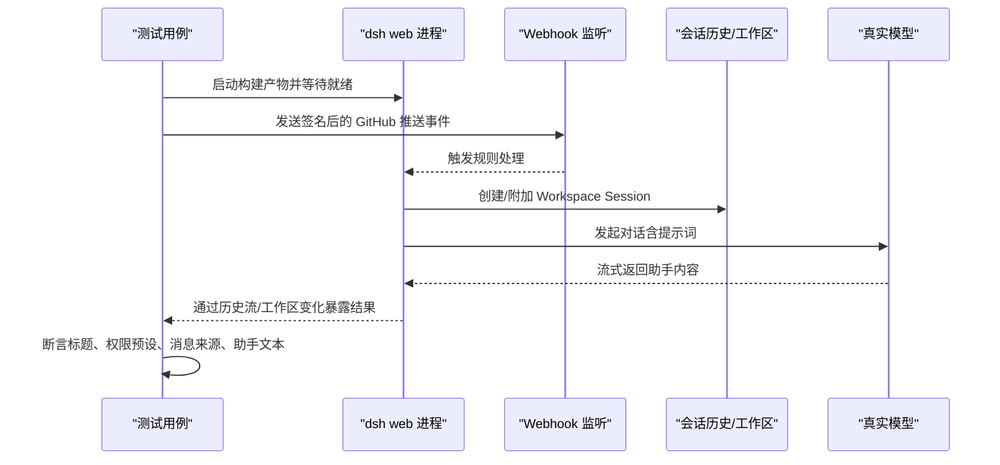
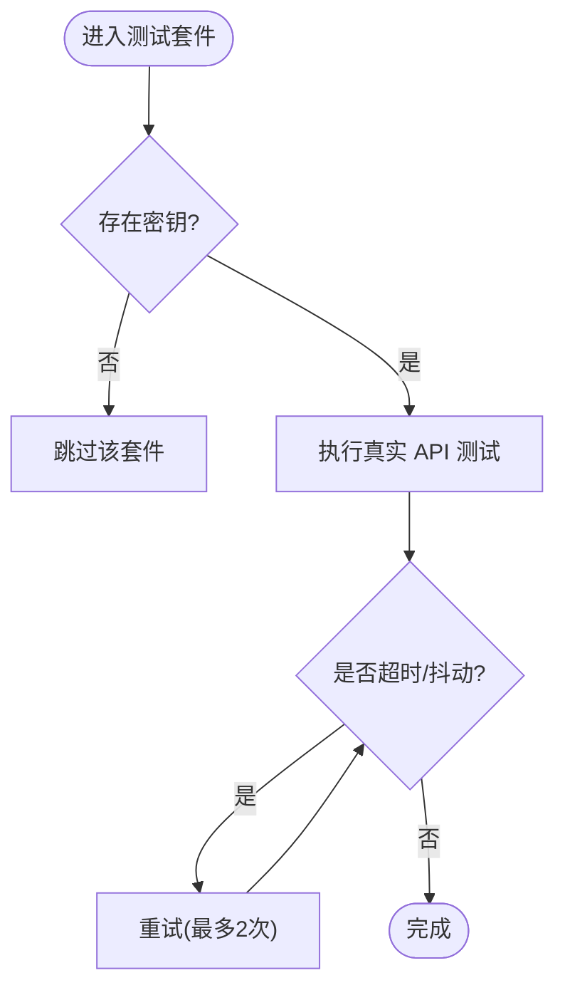
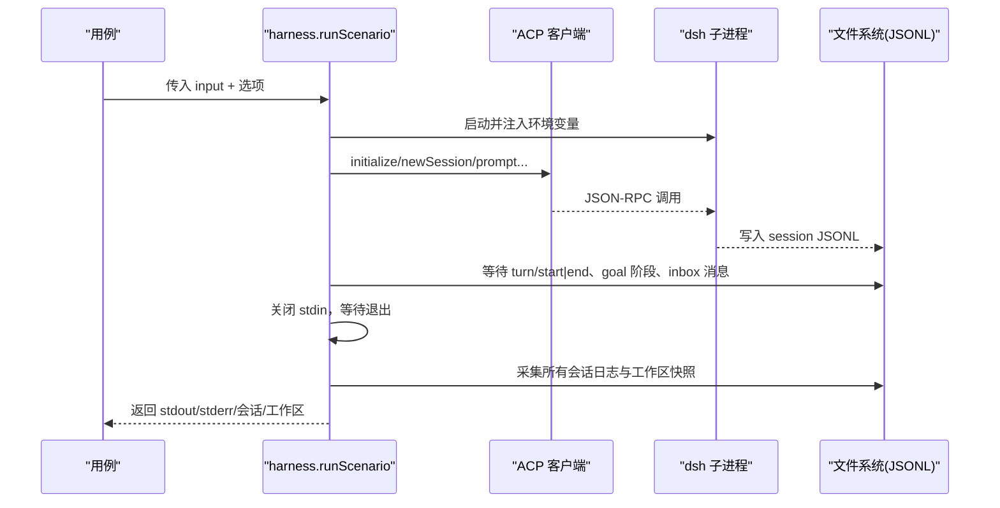
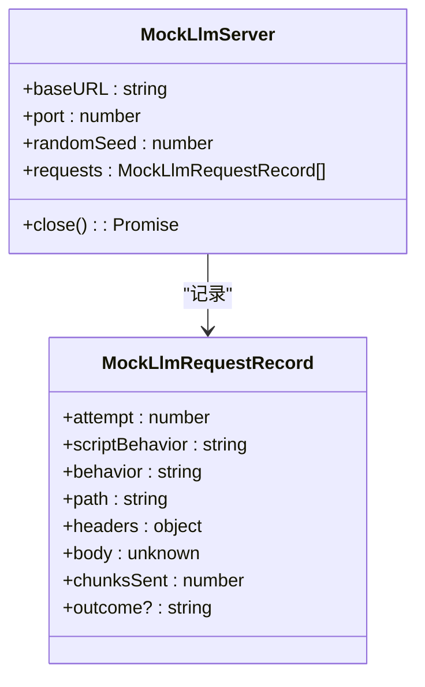
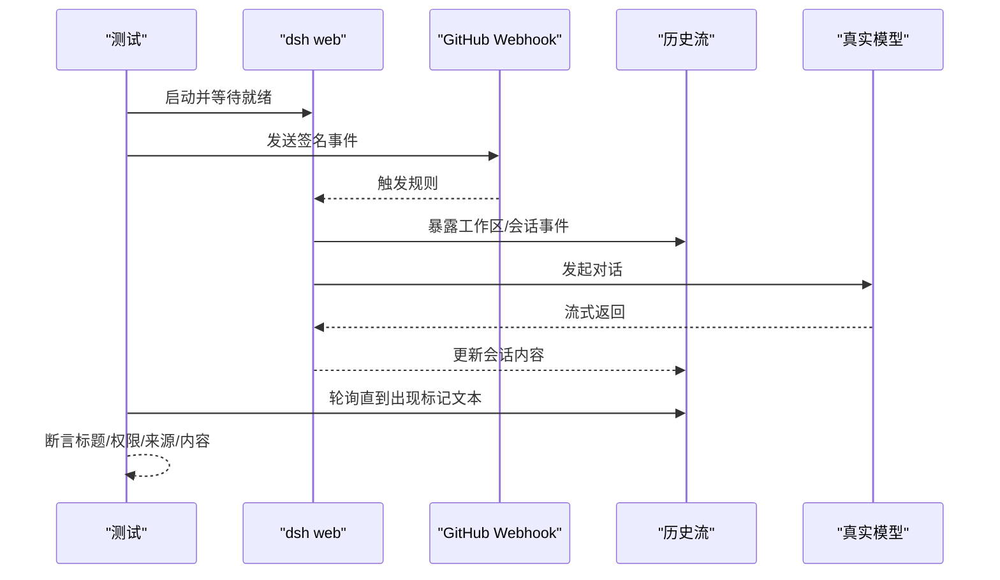
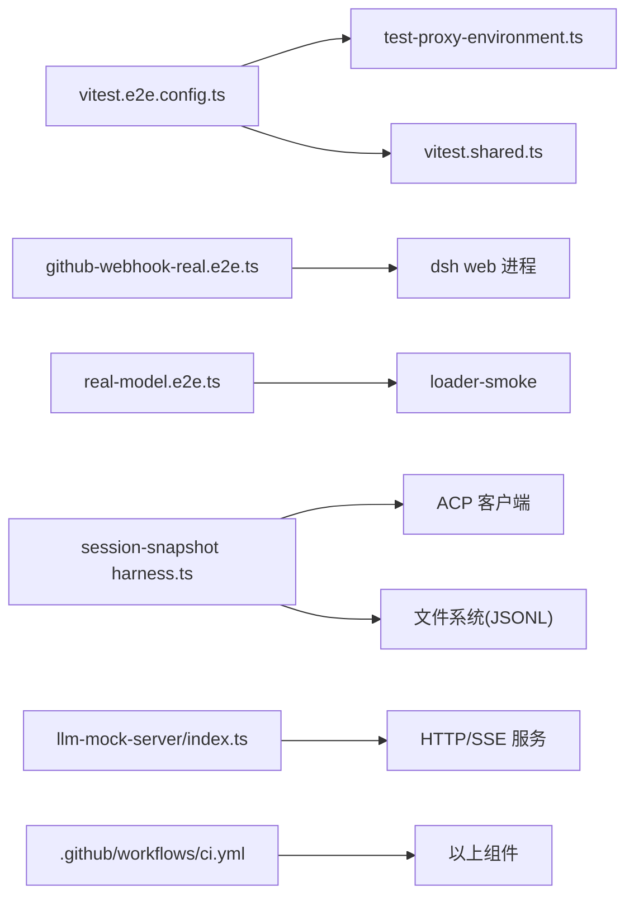

# 集成测试

<cite>
**本文引用的文件**
- [vitest.e2e.config.ts](file://vitest.e2e.config.ts)
- [testing.md](file://docs/testing.md)
- [test-proxy-environment.ts](file://scripts/test-proxy-environment.ts)
- [vitest.shared.ts](file://vitest.shared.ts)
- [github-webhook-real.e2e.ts](file://apps/cli/tests/github-webhook-real.e2e.ts)
- [real-model.e2e.ts](file://apps/cli/tests/profiles/headless/tests/real-model.e2e.ts)
- [harness.ts](file://packages/test-support/session-snapshot/src/harness.ts)
- [index.ts（LLM 模拟服务器）](file://packages/test-support/llm-mock-server/src/index.ts)
- [ci.yml](file://.github/workflows/ci.yml)
</cite>

## 目录
1. [简介](#简介)
2. [项目结构](#项目结构)
3. [核心组件](#核心组件)
4. [架构总览](#架构总览)
5. [详细组件分析](#详细组件分析)
6. [依赖关系分析](#依赖关系分析)
7. [性能与稳定性考虑](#性能与稳定性考虑)
8. [故障排查指南](#故障排查指南)
9. [结论](#结论)
10. [附录](#附录)

## 简介
本指南面向需要在真实 API 环境下编写端到端集成测试的工程师，覆盖密钥管理、自跳过机制、完整插件组合与应用启动流程验证、模型调用/工具使用/会话管理的集成模式、外部依赖模拟与服务虚拟化，以及在 CI 中稳定运行的实践。仓库采用分层测试策略：单元测试、覆盖率门禁、真实 API e2e、预期输出对比、快照回放与 Web 浏览器快照。其中“带密钥”的真实 API e2e 通过环境变量开关实现自跳过，确保无密钥 CI 保持绿色。

## 项目结构
- 真实 API e2e 配置位于根级 vitest 配置，启用长超时、重试与有限并行度，并通过 setupFiles 清理代理环境，保证可重复性。
- 测试策略与规则在文档中明确，强调优先真实实现、最小化 mock、以“构建产物”为入口进行冒烟测试。
- 测试支撑库提供：
  - 会话快照运行器：启动真实 dsh 子进程，驱动 ACP JSON-RPC stdio，录制/回放持久化会话日志，并收集工作区快照。
  - LLM 模拟服务器：本地 OpenAI 兼容 HTTP/SSE 服务，支持多种网络/协议/语义错误行为，用于恢复与边界场景测试。
- CI 流水线将静态检查、覆盖率、快照与制品消费等任务拆分到独立 job，并提供失败快速中止与并发控制。

**图示来源**
- [vitest.e2e.config.ts:1-63](file://vitest.e2e.config.ts#L1-L63)
- [test-proxy-environment.ts:1-64](file://scripts/test-proxy-environment.ts#L1-L64)
- [vitest.shared.ts:1-43](file://vitest.shared.ts#L1-L43)
- [github-webhook-real.e2e.ts:1-468](file://apps/cli/tests/github-webhook-real.e2e.ts#L1-L468)
- [real-model.e2e.ts:1-34](file://apps/cli/tests/profiles/headless/tests/real-model.e2e.ts#L1-L34)
- [harness.ts:1-812](file://packages/test-support/session-snapshot/src/harness.ts#L1-L812)
- [index.ts（LLM 模拟服务器）:1-739](file://packages/test-support/llm-mock-server/src/index.ts#L1-L739)
- [ci.yml:1-200](file://.github/workflows/ci.yml#L1-L200)

**章节来源**
- [vitest.e2e.config.ts:1-63](file://vitest.e2e.config.ts#L1-L63)
- [testing.md:1-55](file://docs/testing.md#L1-L55)

## 核心组件
- 真实 API e2e 配置
  - 加载 .env（可选），设置长超时、重试、文件并行度上限，限定包含/排除规则，仅对 apps/cli 与 packages 下的 e2e 生效。
  - 通过 setupFiles 注入代理清理与不变量校验，避免机器代理污染测试结果。
- 代理环境清理
  - 统一删除 Node 与仓库内解析器关心的代理相关环境变量，确保测试从已知干净环境开始；对 NODE_USE_ENV_PROXY 需由 shell 层 unset。
- 装饰器预处理
  - 在 Vite 默认解析前，用 TypeScript 编译标准装饰器语法，保障测试源码一致性。
- 会话快照运行器
  - 启动真实 dsh 子进程，通过 ACP JSON-RPC stdio 驱动输入脚本，录制或回放会话 JSONL，收集初始/最终工作区快照，并在失败时安全清理临时资源。
- LLM 模拟服务器
  - 提供 OpenAI 兼容 /chat/completions SSE 接口，按序列或权重随机选择行为（连接重置、流断开、限流、认证失败、工具调用成功等），记录每次请求与结果，便于断言与诊断。
- CLI 真实 e2e 示例
  - 启动构建后的 dsh web，监听端口，发送 GitHub webhook 事件，验证会话创建、权限预设、用户消息来源、助手回复等端到端行为。
- Headless 真实模型示例
  - 通过 loader-smoke 驱动 headless 模式，使用真实模型完成文件读写任务，并在进程外验证工作区变更。

**章节来源**
- [vitest.e2e.config.ts:1-63](file://vitest.e2e.config.ts#L1-L63)
- [test-proxy-environment.ts:1-64](file://scripts/test-proxy-environment.ts#L1-L64)
- [vitest.shared.ts:1-43](file://vitest.shared.ts#L1-L43)
- [harness.ts:1-812](file://packages/test-support/session-snapshot/src/harness.ts#L1-L812)
- [index.ts（LLM 模拟服务器）:1-739](file://packages/test-support/llm-mock-server/src/index.ts#L1-L739)
- [github-webhook-real.e2e.ts:1-468](file://apps/cli/tests/github-webhook-real.e2e.ts#L1-L468)
- [real-model.e2e.ts:1-34](file://apps/cli/tests/profiles/headless/tests/real-model.e2e.ts#L1-L34)

## 架构总览
下图展示一次“GitHub webhook → dsh web → 真实模型”的端到端流程，以及测试如何观察与断言关键状态。

**图示来源**
- [github-webhook-real.e2e.ts:1-468](file://apps/cli/tests/github-webhook-real.e2e.ts#L1-L468)

## 详细组件分析

### 真实 API e2e 配置与自跳过机制
- 自跳过策略
  - 使用 describe.skipIf 基于环境变量（如 DEEPSEEK_API_KEY）决定是否跳过，确保无密钥 CI 保持绿色。
- 超时与重试
  - 长 testTimeout 与 hookTimeout，配合 retry=2 缓解瞬时抖动。
- 并行度控制
  - 通过 DSH_E2E_MAX_WORKERS 限制文件并行度，避免共享配额被耗尽。
- 环境准备
  - setupFiles 清理代理环境变量，避免本地代理影响测试。

**图示来源**
- [vitest.e2e.config.ts:1-63](file://vitest.e2e.config.ts#L1-L63)
- [github-webhook-real.e2e.ts:1-468](file://apps/cli/tests/github-webhook-real.e2e.ts#L1-L468)
- [real-model.e2e.ts:1-34](file://apps/cli/tests/profiles/headless/tests/real-model.e2e.ts#L1-L34)

**章节来源**
- [vitest.e2e.config.ts:1-63](file://vitest.e2e.config.ts#L1-L63)
- [github-webhook-real.e2e.ts:1-468](file://apps/cli/tests/github-webhook-real.e2e.ts#L1-L468)
- [real-model.e2e.ts:1-34](file://apps/cli/tests/profiles/headless/tests/real-model.e2e.ts#L1-L34)

### 会话快照运行器（真实子进程 + 持久化会话）
- 启动与驱动
  - 通过 launchAcpTestAgent 启动真实 dsh 子进程，使用 ACP JSON-RPC stdio 执行 input.json 步骤（新建会话、发送提示、取消、等待 turn/end、目标阶段等）。
- 环境与隔离
  - 注入 DSH_SNAPSHOT_* 环境变量，固定 sessions/spill/home 路径，清理代理环境变量，确保跨平台稳定。
- 录制与回放
  - replay 模式读取已录制会话；record 模式在优雅关闭后采集最新生成 JSONL。
- 工作区快照
  - 捕获初始与最终工作区快照，忽略运行时目录，保证断言稳定。
- 健壮性
  - 失败安全清理：强制关闭子进程、删除临时目录与会话根、spill 根，聚合清理异常。

**图示来源**
- [harness.ts:1-812](file://packages/test-support/session-snapshot/src/harness.ts#L1-L812)

**章节来源**
- [harness.ts:1-812](file://packages/test-support/session-snapshot/src/harness.ts#L1-L812)

### LLM 模拟服务器（服务虚拟化）
- 能力
  - 提供 OpenAI 兼容 /chat/completions SSE 接口，支持多种行为：成功、慢响应、最大 token、流断开、连接重置、限流、认证失败、无效请求、上下文溢出、配额不足、工具调用成功等。
  - 支持顺序脚本与随机权重选择，记录每次请求与结果，便于断言与诊断。
- 用法
  - 在需要外部 LLM 的场景，启动本地模拟服务器，将 provider endpoint 指向其 baseURL，即可在不消耗真实配额的情况下验证恢复、重试、流处理与工具调用链路。

**图示来源**
- [index.ts（LLM 模拟服务器）:1-739](file://packages/test-support/llm-mock-server/src/index.ts#L1-L739)

**章节来源**
- [index.ts（LLM 模拟服务器）:1-739](file://packages/test-support/llm-mock-server/src/index.ts#L1-L739)

### CLI 真实 e2e：GitHub Webhook 端到端
- 启动与就绪
  - 启动构建产物 dsh web，解析 stdout 中的本地 URL，等待就绪。
- 外部交互
  - 使用 HMAC 签名构造 GitHub 推送事件，发送到 webhook 端口，验证路由与鉴权。
- 状态观测
  - 通过 workspace/follow 与 session/follow 流，轮询直到出现预期的工作区/会话事件（标题、权限预设、消息来源）。
- 模型交互
  - 等待真实模型返回包含特定标记的助手文本，作为完成信号。
- 清理
  - 正常 SIGTERM，必要时 SIGKILL，并删除临时目录。

**图示来源**
- [github-webhook-real.e2e.ts:1-468](file://apps/cli/tests/github-webhook-real.e2e.ts#L1-L468)

**章节来源**
- [github-webhook-real.e2e.ts:1-468](file://apps/cli/tests/github-webhook-real.e2e.ts#L1-L468)

### Headless 真实模型：文件操作与进程外验证
- 通过 loader-smoke 驱动 headless 模式，向 agent 下发指令修改工作区文件，并在进程外读取文件断言变更。
- 适合验证“真实模型 + 工具链 + 工作区”的最小闭环。

**章节来源**
- [real-model.e2e.ts:1-34](file://apps/cli/tests/profiles/headless/tests/real-model.e2e.ts#L1-L34)

## 依赖关系分析
- 配置层
  - vitest.e2e.config.ts 依赖 test-proxy-environment.ts 清理代理，依赖 vitest.shared.ts 提供装饰器预处理与 execArgv。
- 测试层
  - github-webhook-real.e2e.ts 依赖构建产物与 dsh web 公开 API（HTTP/WebSocket）。
  - real-model.e2e.ts 依赖 loader-smoke 与 headless 驱动。
  - session-snapshot harness.ts 依赖 ACP 客户端、文件系统与 dsh 子进程。
  - llm-mock-server 提供本地 HTTP/SSE 服务，供其他测试替换真实 LLM。
- CI 层
  - ci.yml 组织静态检查、覆盖率、快照与制品消费任务，提供并发与失败快速中止。

**图示来源**
- [vitest.e2e.config.ts:1-63](file://vitest.e2e.config.ts#L1-L63)
- [test-proxy-environment.ts:1-64](file://scripts/test-proxy-environment.ts#L1-L64)
- [vitest.shared.ts:1-43](file://vitest.shared.ts#L1-L43)
- [github-webhook-real.e2e.ts:1-468](file://apps/cli/tests/github-webhook-real.e2e.ts#L1-L468)
- [real-model.e2e.ts:1-34](file://apps/cli/tests/profiles/headless/tests/real-model.e2e.ts#L1-L34)
- [harness.ts:1-812](file://packages/test-support/session-snapshot/src/harness.ts#L1-L812)
- [index.ts（LLM 模拟服务器）:1-739](file://packages/test-support/llm-mock-server/src/index.ts#L1-L739)
- [ci.yml:1-200](file://.github/workflows/ci.yml#L1-L200)

**章节来源**
- [vitest.e2e.config.ts:1-63](file://vitest.e2e.config.ts#L1-L63)
- [ci.yml:1-200](file://.github/workflows/ci.yml#L1-L200)

## 性能与稳定性考虑
- 超时与重试
  - 真实 API e2e 使用较长超时与重试，降低网络抖动影响。
- 并行度
  - 通过 DSH_E2E_MAX_WORKERS 控制文件并行度，避免共享配额竞争。
- 资源隔离
  - 会话快照运行器为每个场景分配唯一 temp/sessions/spill 根，避免并发冲突。
- 清理策略
  - 子进程与临时目录在失败时强制清理，避免残留影响后续用例。
- 代理与环境
  - 统一清理代理环境变量，减少外部网络策略对测试的影响。

[本节为通用指导，不直接分析具体文件]

## 故障排查指南
- 常见症状与定位
  - 测试因代理导致请求失败：确认 setupFiles 已清理代理，且 shell 未导出 NODE_USE_ENV_PROXY。
  - 子进程未退出：使用 SIGTERM 后等待，必要时 SIGKILL，并检查 stderr 输出。
  - 会话未持久化：等待 turn/end 后再采集日志；若超时，检查 JSONL 是否写入。
  - 模型调用失败：切换至 LLM 模拟服务器，逐步缩小问题范围（网络/协议/语义）。
- 建议步骤
  - 开启更详细的 stderr 输出，结合会话 JSONL 与原始 stdout 帧进行分析。
  - 使用会话快照的 record 模式重新录制，对比差异定位回归点。
  - 在 CI 中复用相同环境变量与并发参数，复现问题。

**章节来源**
- [test-proxy-environment.ts:1-64](file://scripts/test-proxy-environment.ts#L1-L64)
- [github-webhook-real.e2e.ts:1-468](file://apps/cli/tests/github-webhook-real.e2e.ts#L1-L468)
- [harness.ts:1-812](file://packages/test-support/session-snapshot/src/harness.ts#L1-L812)

## 结论
本项目提供了完善的真实 API 集成测试基础设施：通过环境变量驱动的自跳过机制、严格的代理环境清理、会话快照运行器与 LLM 模拟服务器，既能验证端到端真实链路，也能在离线/受限环境中高效回归。配合 CI 的并发与失败快速中止策略，可在保证稳定性的同时提升反馈速度。建议新增功能时优先补充真实 API e2e 或快照场景，确保“世界可见”的断言覆盖关键路径。

[本节为总结性内容，不直接分析具体文件]

## 附录
- 密钥管理策略
  - 通过环境变量（如 DEEPSEEK_API_KEY、EXA_API_KEY、PERPLEXITY_API_KEY 等）注入密钥；测试套件根据是否存在密钥自跳过，避免泄露与误用。
  - 在 CI 中预先校验所需密钥存在，再执行带密钥的 e2e 任务。
- 应用启动流程验证
  - 使用构建产物启动 dsh web/headless，等待就绪标志（URL 或 marker），再通过公开 API 或 ACP 协议驱动。
- 模型调用/工具使用/会话管理示例
  - 模型调用：headless 真实模型示例，验证文件读写与工具链。
  - 工具使用：LLM 模拟服务器的 tool_call_success 行为，验证工具调用分片与结束。
  - 会话管理：会话快照运行器，验证 turn/start/end、goal 阶段、inbox 消息等。
- 外部依赖模拟与服务虚拟化
  - 使用 LLM 模拟服务器替代真实 LLM，覆盖连接重置、流断开、限流、认证失败等场景。
- CI 运行方式
  - 参考 ci.yml 的任务划分与并发控制，结合 DSH_GATE_FAIL_FAST、DSH_COVERAGE_*、DSH_SNAPSHOT_MAX_CONCURRENCY 等变量优化速度与稳定性。

[本节为补充说明，不直接分析具体文件]