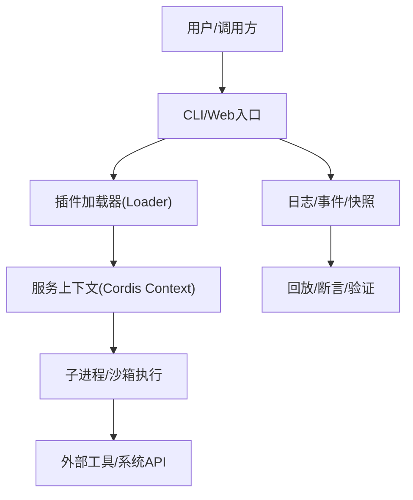
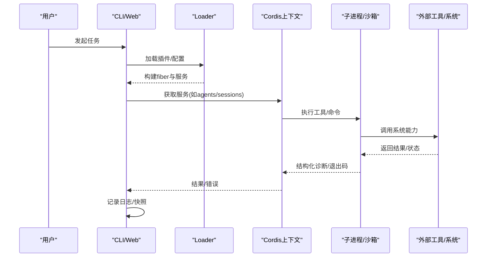
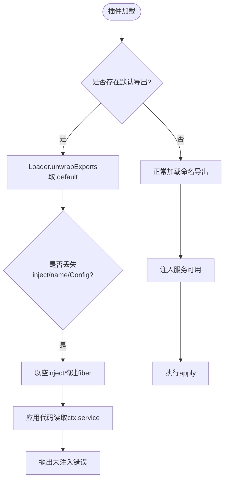
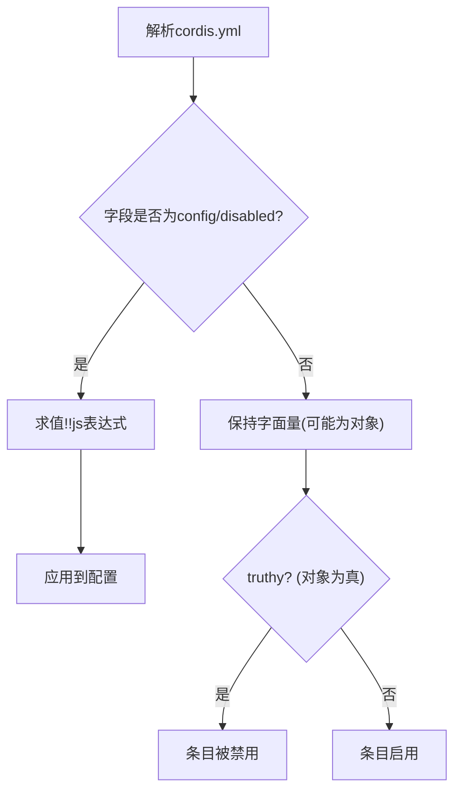
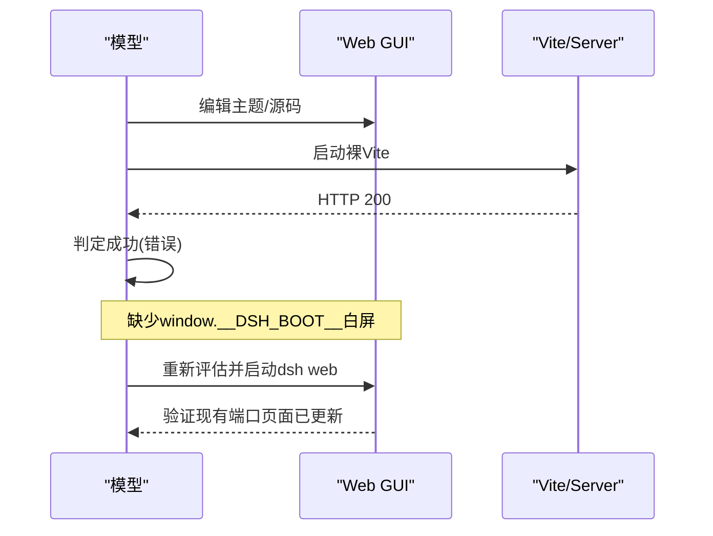
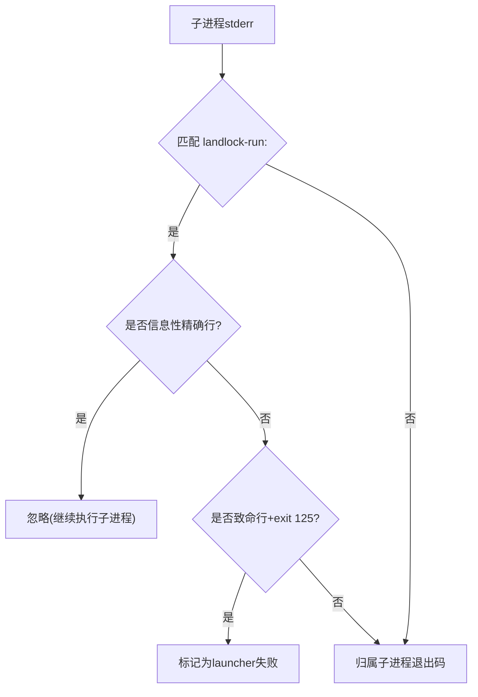
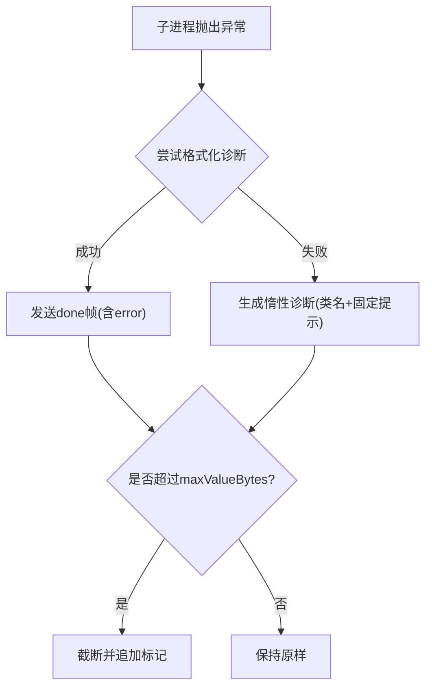

# 常见问题诊断

<cite>
**本文引用的文件**
- [postmortem/README.md](file://docs/postmortem/README.md)
- [0001-acp-default-export-drops-inject.md](file://docs/postmortem/0001-acp-default-export-drops-inject.md)
- [0002-js-expression-disabled-filesystem-tools.md](file://docs/postmortem/0002-js-expression-disabled-filesystem-tools.md)
- [0003-web-agent-gui-feedback-loop.md](file://docs/postmortem/0003-web-agent-gui-feedback-loop.md)
- [0004-landlock-partial-notice-misclassified-child-failures.md](file://docs/postmortem/0004-landlock-partial-notice-misclassified-child-failures.md)
- [bug.md](file://.github/ISSUE_TEMPLATE/bug.md)
- [policy.mjs](file://.github/issue-management/policy.mjs)
- [runtime.spec.ts](file://packages/experimental/code-runtime-python/tests/runtime.spec.ts)
</cite>

## 目录
1. [简介](#简介)
2. [项目结构](#项目结构)
3. [核心组件](#核心组件)
4. [架构总览](#架构总览)
5. [详细组件分析](#详细组件分析)
6. [依赖关系分析](#依赖关系分析)
7. [性能注意事项](#性能注意事项)
8. [故障排查指南](#故障排查指南)
9. [结论](#结论)
10. [附录](#附录)

## 简介
本手册基于仓库中的历史故障报告（Post-mortem）与测试用例，系统化整理常见问题的症状、原因与解决方案，提供可操作的问题诊断流程、检查清单、错误信息解读与调试技巧，并给出复现复杂问题、上报问题与社区反馈的最佳实践。目标是帮助开发者快速定位和修复问题，减少重复踩坑。

## 项目结构
本项目采用多包工作区组织，包含 CLI、Web、文档、子系统包、脚本与快照等。故障相关的关键资料集中在 docs/postmortem 目录；问题模板与 Issue 管理策略在 .github 下；运行时异常与诊断边界在 packages/experimental/code-runtime-python 的测试中体现。

[本节为概念性结构说明，不直接分析具体文件，故无“章节来源”]

## 核心组件
- 插件加载与注入：Loader 对模块导出进行规范化，解析 name/inject/Config/apply；不当的默认导出会丢弃命名空间元数据，导致注入缺失。
- 服务访问与影子上下文：通过 context 代理进行跨 fiber 的服务查找；影子上下文仅沿祖先链查找，跨分支读取可选服务需使用 get(name)。
- 配置表达式与覆盖：!!js 仅在 plugin config 或 entry.disabled 处求值；其他元数据保持字面量，条件启用应使用覆盖层。
- Web GUI 启动与验收：需要模型可见的当前 GUI 身份、URL 与运行模式；不能将裸 Vite 200 视为成功。
- 沙箱与子进程诊断：Landlock 部分强制通知与子进程退出码需严格区分；结构化规则避免误分类。
- 运行时诊断边界：Python 运行时对异常消息进行截断与渲染保护，确保跨进程传输安全。

**章节来源**
- [0001-acp-default-export-drops-inject.md:27-87](file://docs/postmortem/0001-acp-default-export-drops-inject.md#L27-L87)
- [0002-js-expression-disabled-filesystem-tools.md:11-41](file://docs/postmortem/0002-js-expression-disabled-filesystem-tools.md#L11-L41)
- [0003-web-agent-gui-feedback-loop.md:11-46](file://docs/postmortem/0003-web-agent-gui-feedback-loop.md#L11-L46)
- [0004-landlock-partial-notice-misclassified-child-failures.md:11-48](file://docs/postmortem/0004-landlock-partial-notice-misclassified-child-failures.md#L11-L48)
- [runtime.spec.ts:4801-4928](file://packages/experimental/code-runtime-python/tests/runtime.spec.ts#L4801-L4928)

## 架构总览
下图展示一次典型请求从 CLI/Web 进入，经 Loader 加载插件、建立服务上下文、调用子进程/沙箱执行，再到日志/快照回放的端到端路径。

[本节为概念性流程图，不直接映射到具体源文件，故无“图表来源”]

## 详细组件分析

### 组件A：ACP 插件加载失败（export default 丢弃 inject）
- 症状：首次 session/new 报错无法获取 agents；session/load 报无法获取 sessionPersistence。
- 原因：插件同时存在命名导出与默认导出，Loader 优先取 .default，丢失 name/inject/Config；随后在 fiber 根节点找不到注入服务而抛错。
- 解决：删除默认导出；对可选服务使用 ctx.get(name) 而非属性读取，避免影子上下文祖先链查找失败。
- 复现要点：通过真实 Loader 路径驱动 e2e；确保 tsx 能找到仓库 tsconfig paths，避免命中旧构建产物。

**图表来源**
- [0001-acp-default-export-drops-inject.md:27-55](file://docs/postmortem/0001-acp-default-export-drops-inject.md#L27-L55)

**章节来源**
- [0001-acp-default-export-drops-inject.md:27-113](file://docs/postmortem/0001-acp-default-export-drops-inject.md#L27-L113)

### 组件B：文件系统工具被永久禁用（!!js 位置误用）
- 症状：场景调用工具缺失，结构化日志出现 UNKNOWN_TOOL；stdout 显示通用失败卡片。
- 原因：!!js 表达式仅适用于 plugin config 与 entry.disabled；放在其他元数据时不会被求值，始终为真导致禁用。
- 解决：使用显式覆盖层启用文件系统；校验配置解析规则；快照框架拒绝 UNKNOWN_TOOL 作为新预期输出。
- 复现要点：对比默认 bash-only 组合与 fs.cordis.yml 覆盖；确认 Loader 消费的是 entry.options.config 而非 entry.disabled。

**图表来源**
- [0002-js-expression-disabled-filesystem-tools.md:11-35](file://docs/postmortem/0002-js-expression-disabled-filesystem-tools.md#L11-L35)

**章节来源**
- [0002-js-expression-disabled-filesystem-tools.md:11-47](file://docs/postmortem/0002-js-expression-disabled-filesystem-tools.md#L11-L47)

### 组件C：Web Agent 误验替代服务器
- 症状：Agent 修改 GUI 源码后，认为裸 Vite 200 即成功；实际页面白屏缺少 __DSH_BOOT__；后续又启用了另一个端口服务而未验证原页面。
- 原因：GUI 没有向模型暴露当前 URL、进程与运行模式；HTTP 就绪不等于应用就绪；后台进程语义被绕过。
- 解决：发布当前 GUI 的 loopback URL 与环境变量；生产/开发指引明确重建与刷新方式；拒绝裸 Vite 启动；分层测试覆盖真实路径。
- 复现要点：在同一 checkout 启动 dsh web，观察现有端口页面变化；验证 HMR 与静态替换行为。

**图表来源**
- [0003-web-agent-gui-feedback-loop.md:11-46](file://docs/postmortem/0003-web-agent-gui-feedback-loop.md#L11-L46)

**章节来源**
- [0003-web-agent-gui-feedback-loop.md:11-53](file://docs/postmortem/0003-web-agent-gui-feedback-loop.md#L11-L53)

### 组件D：Landlock 部分强制通知误分类子进程失败
- 症状：子进程正常退出码非零（如 ripgrep 无匹配 exit 1）被标记为 SANDBOX_UNAVAILABLE；搜索失败被包装为 SEARCH_FAILED。
- 原因：共享前缀 landlock-run: 被当作统一失败信号；未区分信息性通知与致命行；消费者将任意非零退出归因于沙箱。
- 解决：引入 RunnerFailureRule，携带允许退出码、致命签名与信息性排除；bash 沙箱直接 spawn provider argv；文件系统搜索使用打包 ripgrep 并通过 subprocess seam。
- 复现要点：构造打印部分强制通知并 exec 子进程的包装器；覆盖前台/后台分类与致命证据优先级。

**图表来源**
- [0004-landlock-partial-notice-misclassified-child-failures.md:11-48](file://docs/postmortem/0004-landlock-partial-notice-misclassified-child-failures.md#L11-L48)

**章节来源**
- [0004-landlock-partial-notice-misclassified-child-failures.md:11-55](file://docs/postmortem/0004-landlock-partial-notice-misclassified-child-failures.md#L11-L55)

### 组件E：Python 运行时诊断边界与截断
- 现象：当渲染路径本身抛出异常时，仍发送 done 帧并返回惰性诊断；超大异常消息在子侧截断，保证跨进程传输安全。
- 机制：子侧限制最大字节数，保留截断标记；宿主侧同样计量该字段长度。
- 调试建议：关注 error.kind 与 message 末尾截断标记；结合 maxValueBytes 调整阈值；避免依赖完整堆栈文本。

**图表来源**
- [runtime.spec.ts:4801-4928](file://packages/experimental/code-runtime-python/tests/runtime.spec.ts#L4801-L4928)

**章节来源**
- [runtime.spec.ts:1984-2009](file://packages/experimental/code-runtime-python/tests/runtime.spec.ts#L1984-L2009)
- [runtime.spec.ts:4801-4928](file://packages/experimental/code-runtime-python/tests/runtime.spec.ts#L4801-L4928)

## 依赖关系分析
- 插件与 Loader：Loader 对导出形式的强约定（命名导出 vs 默认导出）直接影响注入可用性。
- 上下文与影子：跨 fiber 访问服务需遵循拓扑约束，可选服务必须通过 get(name)。
- 配置与覆盖：!!js 的作用域有限，条件启用应通过覆盖层实现。
- 沙箱与子进程：诊断必须基于多重证据（退出码、致命行、信息性排除），避免单一前缀误判。
- 运行时与宿主：诊断大小与渲染鲁棒性由双方共同保障。

[本节为概念性依赖图，不直接映射到具体源文件，故无“图表来源”]

**章节来源**
- [0001-acp-default-export-drops-inject.md:27-87](file://docs/postmortem/0001-acp-default-export-drops-inject.md#L27-L87)
- [0002-js-expression-disabled-filesystem-tools.md:30-41](file://docs/postmortem/0002-js-expression-disabled-filesystem-tools.md#L30-L41)
- [0004-landlock-partial-notice-misclassified-child-failures.md:33-48](file://docs/postmortem/0004-landlock-partial-notice-misclassified-child-failures.md#L33-L48)

## 性能注意事项
- 避免在关键路径上进行昂贵的字符串拼接或大对象序列化；注意诊断消息大小上限。
- 快照与回放用于回归验证，但不应替代语义断言；必要时增加独立于期望输出的检查。
- 子进程/沙箱调用应尽量复用资源，减少频繁启动开销；前台/后台执行需统一分类与清理。

[本节提供通用指导，不直接分析具体文件，故无“章节来源”]

## 故障排查指南

### 系统化诊断流程
1. 明确症状：收集错误码、结构化 error 字段、stdout/stderr、退出码与信号。
2. 定位阶段：判断发生在加载期、配置解析期、服务访问期、子进程执行期还是运行时渲染期。
3. 验证假设：优先查看 Loader 日志、fiber 拓扑、影子上下文来源；核对 !!js 作用域。
4. 复现实例：使用真实入口路径驱动（避免手工组装插件）；确保 tsconfig paths 正确；使用覆盖层重现条件。
5. 隔离变更：最小化复现脚本；固定端口/进程标识；避免后台裸进程干扰。
6. 修复与回归：添加 no-key e2e 与快照；加入静态配置校验；完善断言。

### 检查清单
- 插件导出：是否仅使用命名导出？是否误加默认导出？
- 服务访问：可选服务是否使用 ctx.get(name)？
- 配置表达式：!!js 是否位于 config 或 disabled？
- Web GUI：是否验证了当前 URL 与 __DSH_BOOT__？
- 沙箱诊断：是否区分信息性通知与致命行？是否考虑允许退出码？
- 运行时诊断：是否设置合理的 maxValueBytes？是否处理渲染失败兜底？

### 错误信息解读与调试技巧
- 未注入错误：通常出现在插件加载期或跨 fiber 访问；检查 Loader 与影子上下文。
- UNKNOWN_TOOL：工具未注册；检查覆盖层与组合配置。
- SANDBOX_UNAVAILABLE/SEARCH_FAILED：检查 Landlock 通知与子进程退出码；避免误归类。
- 白屏/不可用 GUI：检查 boot manifest 与 HMR；不要以裸 Vite 200 作为成功标志。
- 诊断过大/渲染失败：关注截断标记与惰性诊断；调整阈值并验证两端一致。

### 复现与定位复杂问题
- 使用真实 Loader 路径与 no-key e2e；确保子进程 cwd 与 tsconfig 可解析。
- 对平台相关行为，使用确定性 fake 与产品装配路径双覆盖。
- 对 Web 场景，锁定当前进程与端口，避免启动冗余服务。

### 问题上报最佳实践与信息收集
- 标题：使用中文描述问题本质，不带类型/优先级前缀。
- 内容：包含环境版本、复现步骤、期望与实际行为、错误码与结构化 error、stdout/stderr、退出码/信号、相关配置文件片段。
- 标签与状态：遵循 Issue 管理策略，选择合法 Type/Priority/Status。
- 附件：会话快照、日志片段、截图（Web 场景）。

**章节来源**
- [bug.md](file://.github/ISSUE_TEMPLATE/bug.md)
- [policy.mjs:321-356](file://.github/issue-management/policy.mjs#L321-L356)

### 社区支持与问题反馈渠道
- 通过仓库 Issue 模板提交问题；遵循标题与正文规范。
- 参考 postmortem 文档了解历史问题与加固措施，避免重复提问。
- 参与讨论时引用相关 subsystem 文档与测试用例，提高沟通效率。

**章节来源**
- [postmortem/README.md:1-19](file://docs/postmortem/README.md#L1-L19)
- [bug.md](file://.github/ISSUE_TEMPLATE/bug.md)
- [policy.mjs:321-356](file://.github/issue-management/policy.mjs#L321-L356)

## 结论
通过对历史故障的系统梳理，可以形成一套可操作的诊断流程与检查清单。关键在于：遵循 Loader 导出约定、正确使用服务访问 API、限定 !!js 作用域、以真实路径驱动测试、严格区分沙箱诊断证据、保障运行时诊断边界。配合规范的 Issue 提交流程与社区支持，能显著降低问题定位成本与回归风险。

[本节为总结性内容，不直接分析具体文件，故无“章节来源”]

## 附录
- 术语速查：Loader、Cordis、fiber、影子上下文、覆盖层、RunnerFailureRule、maxValueBytes。
- 相关文档：子系统文档、配置目录、工具目录、持久化目录、测试与开发指南。

[本节为概念性附录，不直接分析具体文件，故无“章节来源”]