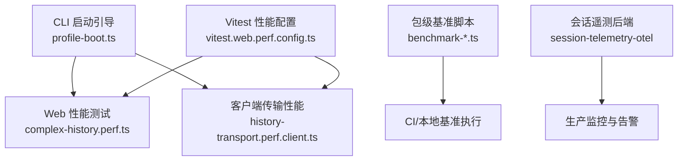
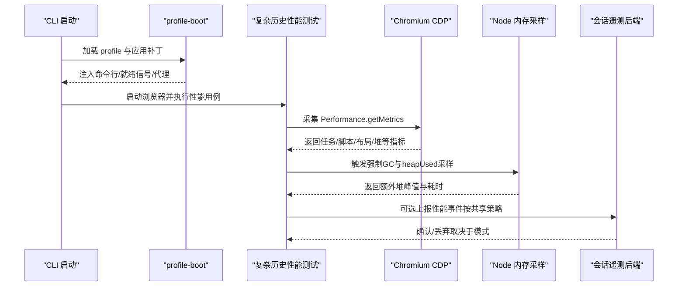
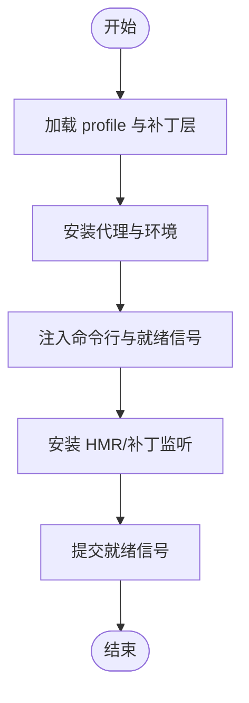
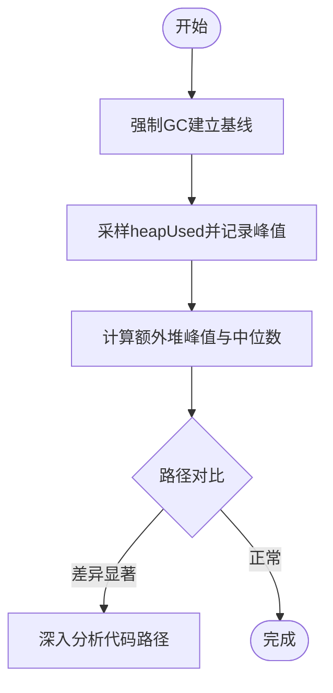
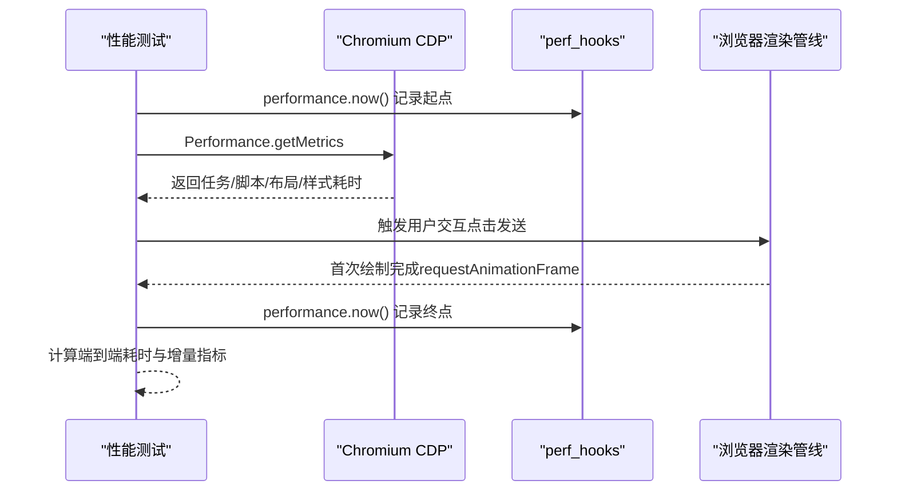
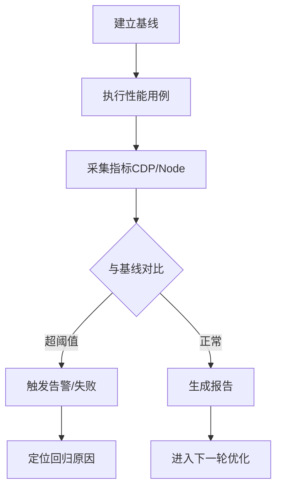
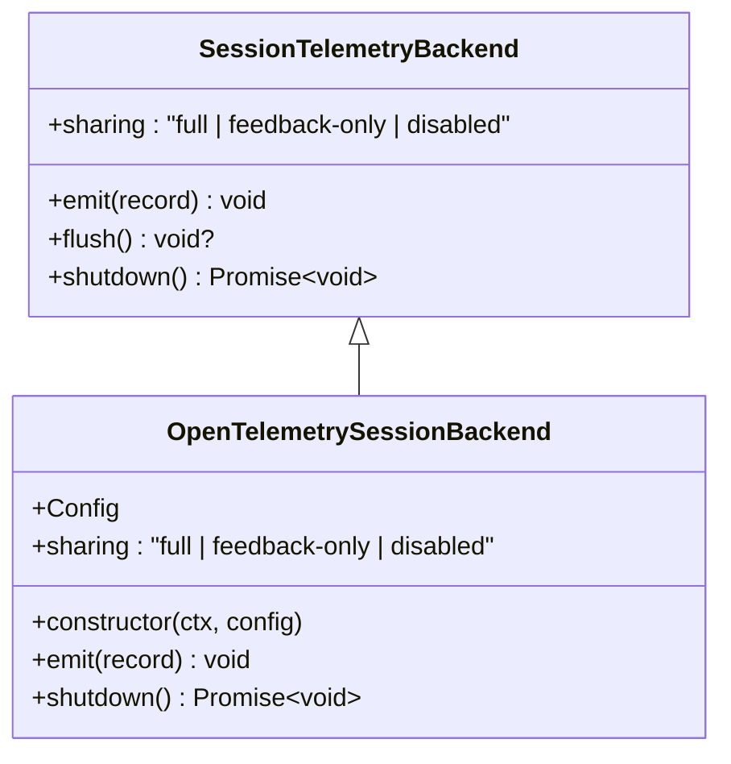
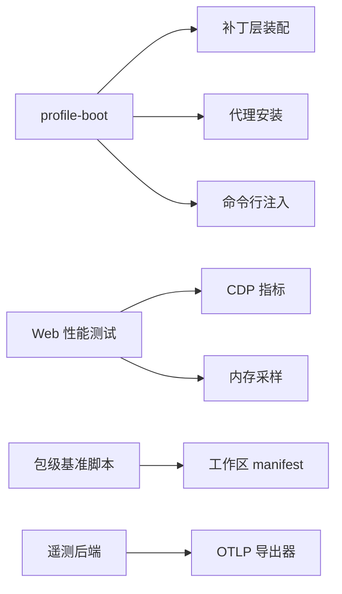

# 性能分析与优化

<cite>
**本文引用的文件**
- [BENCHMARK.md](file://BENCHMARK.md)
- [apps/cli/src/profile-boot.ts](file://apps/cli/src/profile-boot.ts)
- [vitest.web.perf.config.ts](file://vitest.web.perf.config.ts)
- [apps/web/tests/complex-history.perf.ts](file://apps/web/tests/complex-history.perf.ts)
- [packages/client/ui-conversation/tests/history-transport.perf.client.ts](file://packages/client/ui-conversation/tests/history-transport.perf.client.ts)
- [vitest.config.ts](file://vitest.config.ts)
- [scripts/benchmark-next-package-dependency.ts](file://scripts/benchmark-next-package-dependency.ts)
- [scripts/benchmark-npm-resolution.ts](file://scripts/benchmark-npm-resolution.ts)
- [packages/experimental/inspector/src/client/cdp/profiler.ts](file://packages/experimental/inspector/src/client/cdp/profiler.ts)
- [packages/experimental/inspector/src/host/cdp/profiler.ts](file://packages/experimental/inspector/src/host/cdp/profiler.ts)
- [packages/session/session-telemetry/src/index.ts](file://packages/session/session-telemetry/src/index.ts)
- [packages/session/session-telemetry-otel/src/index.ts](file://packages/session/session-telemetry-otel/src/index.ts)
- [docs/subsystems/session-telemetry.md](file://docs/subsystems/session-telemetry.md)
</cite>

## 目录
1. [简介](#简介)
2. [项目结构](#项目结构)
3. [核心组件](#核心组件)
4. [架构总览](#架构总览)
5. [详细组件分析](#详细组件分析)
6. [依赖关系分析](#依赖关系分析)
7. [性能注意事项](#性能注意事项)
8. [故障排查指南](#故障排查指南)
9. [结论](#结论)
10. [附录](#附录)

## 简介
本指南面向开发者与运维人员，系统化说明如何在 deepseek-harness 中进行启动时间分析、内存使用分析与泄漏检测、CPU 热点定位、基准测试与回归检测，以及生产环境性能监控与告警配置。文档基于仓库内已有的性能测试、启动引导与遥测实现，提供可操作的步骤、流程图与可视化图示，帮助快速定位瓶颈并持续优化。

## 项目结构
仓库中与性能相关的关键位置：
- CLI 启动引导：负责加载 profile、应用补丁层、安装代理、注入命令行与就绪信号，是启动时间分析的主要入口。
- Web 端性能测试：基于 Playwright + CDP 采集浏览器指标（任务时长、脚本时长、布局/重排样式、节点与监听器数量、堆大小等），用于长历史渲染与流式更新的性能评估。
- 客户端传输性能测试：在 Node 环境下通过强制 GC 采样额外堆峰值，对比压缩与序列化路径的内存占用与耗时。
- Vitest 配置：提供性能用例的独立运行配置（启用 --expose-gc、扩大超时、包含 perf 用例）。
- 包级基准脚本：用于比较 npm 解析或 next 包依赖的耗时，支持多轮统计与并行度控制。
- 遥测后端：会话遥测后端暴露共享策略，支持 OTLP 导出与关闭超时配置，可用于生产环境的性能与事件上报。

**图表来源**
- [apps/cli/src/profile-boot.ts:210-319](file://apps/cli/src/profile-boot.ts#L210-L319)
- [apps/web/tests/complex-history.perf.ts:524-585](file://apps/web/tests/complex-history.perf.ts#L524-L585)
- [packages/client/ui-conversation/tests/history-transport.perf.client.ts:188-211](file://packages/client/ui-conversation/tests/history-transport.perf.client.ts#L188-L211)
- [vitest.web.perf.config.ts:5-21](file://vitest.web.perf.config.ts#L5-L21)
- [scripts/benchmark-next-package-dependency.ts:43-74](file://scripts/benchmark-next-package-dependency.ts#L43-L74)
- [scripts/benchmark-npm-resolution.ts:105-143](file://scripts/benchmark-npm-resolution.ts#L105-L143)
- [packages/session/session-telemetry-otel/src/index.ts:147-168](file://packages/session/session-telemetry-otel/src/index.ts#L147-L168)

**章节来源**
- [apps/cli/src/profile-boot.ts:210-319](file://apps/cli/src/profile-boot.ts#L210-L319)
- [vitest.web.perf.config.ts:5-21](file://vitest.web.perf.config.ts#L5-L21)
- [apps/web/tests/complex-history.perf.ts:524-585](file://apps/web/tests/complex-history.perf.ts#L524-L585)
- [packages/client/ui-conversation/tests/history-transport.perf.client.ts:188-211](file://packages/client/ui-conversation/tests/history-transport.perf.client.ts#L188-L211)
- [scripts/benchmark-next-package-dependency.ts:43-74](file://scripts/benchmark-next-package-dependency.ts#L43-L74)
- [scripts/benchmark-npm-resolution.ts:105-143](file://scripts/benchmark-npm-resolution.ts#L105-L143)
- [packages/session/session-telemetry-otel/src/index.ts:147-168](file://packages/session/session-telemetry-otel/src/index.ts#L147-L168)

## 核心组件
- 启动引导（profile-boot）：负责 profile 装配、补丁层叠加、代理安装、命令参数注入与进程退出管理。适合插入启动计时点，识别各阶段耗时。
- Web 性能测试（complex-history）：通过 CDP 获取 Chromium 指标，测量任务/脚本/布局/样式重算/DevTools 命令耗时，以及 DOM 节点、事件监听器与堆大小变化；支持用户交互到首帧渲染的时间测量。
- 客户端传输性能（history-transport.perf.client）：在 Node 侧通过强制 GC 基线采样额外堆峰值，对比不同压缩/序列化路径的内存与耗时。
- Vitest 性能配置：为性能用例启用 --expose-gc、扩大超时、仅包含 perf 用例，避免干扰常规测试。
- 包级基准脚本：提供 npm 解析与 next 包依赖的基准能力，支持多轮运行、并行度与超时控制。
- 会话遥测后端：暴露共享策略（full/feedback-only/disabled），支持 OTLP 导出与关闭超时，便于生产环境收集性能与事件数据。

**章节来源**
- [apps/cli/src/profile-boot.ts:210-319](file://apps/cli/src/profile-boot.ts#L210-L319)
- [apps/web/tests/complex-history.perf.ts:524-585](file://apps/web/tests/complex-history.perf.ts#L524-L585)
- [packages/client/ui-conversation/tests/history-transport.perf.client.ts:188-211](file://packages/client/ui-conversation/tests/history-transport.perf.client.ts#L188-L211)
- [vitest.web.perf.config.ts:5-21](file://vitest.web.perf.config.ts#L5-L21)
- [scripts/benchmark-next-package-dependency.ts:43-74](file://scripts/benchmark-next-package-dependency.ts#L43-L74)
- [scripts/benchmark-npm-resolution.ts:105-143](file://scripts/benchmark-npm-resolution.ts#L105-L143)
- [packages/session/session-telemetry-otel/src/index.ts:147-168](file://packages/session/session-telemetry-otel/src/index.ts#L147-L168)

## 架构总览
下图展示了从 CLI 启动到 Web 性能测试与遥测上报的整体流程，包括启动引导、CDP 指标采集、Node 内存采样与 OTLP 上报。

**图表来源**
- [apps/cli/src/profile-boot.ts:210-319](file://apps/cli/src/profile-boot.ts#L210-L319)
- [apps/web/tests/complex-history.perf.ts:524-585](file://apps/web/tests/complex-history.perf.ts#L524-L585)
- [packages/client/ui-conversation/tests/history-transport.perf.client.ts:188-211](file://packages/client/ui-conversation/tests/history-transport.perf.client.ts#L188-L211)
- [packages/session/session-telemetry-otel/src/index.ts:147-168](file://packages/session/session-telemetry-otel/src/index.ts#L147-L168)

## 详细组件分析

### 启动时间分析与瓶颈识别
- 关键切入点：
  - 在 profile 装配与补丁层叠加前后记录时间，识别配置解析与合并耗时。
  - 在安装代理、注入命令行与就绪信号前后记录时间，识别网络与环境准备耗时。
  - 在 watchUserPatches 与 HMR 安装前后记录时间，识别热重载初始化耗时。
- 建议方法：
  - 在 runProfile 中插入高精度计时点，输出各阶段耗时与累计时间。
  - 结合 CI 日志与本地 profiling，对比不同 profile 与补丁组合的启动差异。
  - 将启动时间纳入回归检测，设置阈值告警。

**图表来源**
- [apps/cli/src/profile-boot.ts:210-319](file://apps/cli/src/profile-boot.ts#L210-L319)

**章节来源**
- [apps/cli/src/profile-boot.ts:210-319](file://apps/cli/src/profile-boot.ts#L210-L319)

### 内存使用分析与泄漏检测
- Node 侧内存采样：
  - 通过强制 GC 建立基线，再在执行路径中多次采样 heapUsed，计算额外堆峰值与中位数，用于对比不同压缩/序列化路径的内存占用。
  - 需要 Vitest worker 启用 --expose-gc，否则无法调用全局 gc。
- 浏览器侧内存与 DOM：
  - 通过 CDP 的 HeapProfiler.collectGarbage 触发垃圾回收，再读取 JSHeapUsedSize、Nodes、JSEventListeners 等指标，评估渲染与流式更新的内存增长。
  - 使用 MutationObserver 统计变更批次与记录数，辅助判断频繁 DOM 操作导致的内存压力。
- 泄漏检测建议：
  - 在长会话场景下，周期性采集节点数与监听器数，观察是否持续增长。
  - 对比压缩与未压缩路径的额外堆峰值，定位高内存消耗的代码路径。
  - 结合浏览器 DevTools 的快照与火焰图，验证是否存在闭包或事件监听未释放。

**图表来源**
- [packages/client/ui-conversation/tests/history-transport.perf.client.ts:188-211](file://packages/client/ui-conversation/tests/history-transport.perf.client.ts#L188-L211)
- [apps/web/tests/complex-history.perf.ts:524-585](file://apps/web/tests/complex-history.perf.ts#L524-L585)

**章节来源**
- [packages/client/ui-conversation/tests/history-transport.perf.client.ts:188-211](file://packages/client/ui-conversation/tests/history-transport.perf.client.ts#L188-L211)
- [apps/web/tests/complex-history.perf.ts:524-585](file://apps/web/tests/complex-history.perf.ts#L524-L585)

### CPU 性能分析与热点代码定位
- 浏览器侧：
  - 通过 CDP 的 Performance.getMetrics 获取 TaskDuration、ScriptDuration、LayoutDuration、RecalcStyleDuration、DevToolsCommandDuration 等指标，识别渲染与脚本执行的热点。
  - 使用 requestAnimationFrame 与用户交互探针，测量点击到 DOM 可见与首次绘制的时间，定位 UI 响应延迟。
- Node 侧：
  - 使用 Node 内置 perf_hooks.performance.now 进行高精度计时，配合强制 GC 与内存采样，评估算法路径的 CPU 与内存开销。
- 外部工具：
  - 可使用 Chrome DevTools Profiler 与 Node.js 自带的 --prof 生成 v8 快照，结合 flamegraph 工具定位热点函数。
  - 注意：当前 inspector 的客户端与主机 CPU 分析桥接能力未暴露，需通过 CDP 或 Node 原生方式进行分析。

**图表来源**
- [apps/web/tests/complex-history.perf.ts:524-585](file://apps/web/tests/complex-history.perf.ts#L524-L585)
- [packages/experimental/inspector/src/client/cdp/profiler.ts:1-12](file://packages/experimental/inspector/src/client/cdp/profiler.ts#L1-L12)
- [packages/experimental/inspector/src/host/cdp/profiler.ts:1-12](file://packages/experimental/inspector/src/host/cdp/profiler.ts#L1-L12)

**章节来源**
- [apps/web/tests/complex-history.perf.ts:524-585](file://apps/web/tests/complex-history.perf.ts#L524-L585)
- [packages/experimental/inspector/src/client/cdp/profiler.ts:1-12](file://packages/experimental/inspector/src/client/cdp/profiler.ts#L1-L12)
- [packages/experimental/inspector/src/host/cdp/profiler.ts:1-12](file://packages/experimental/inspector/src/host/cdp/profiler.ts#L1-L12)

### 性能基准测试与回归检测策略
- 基准类型：
  - 启动时间基准：在 profile 装配、代理安装、HMR 安装等阶段记录耗时，形成基线。
  - 渲染性能基准：通过 CDP 指标与用户交互探针，记录任务/脚本/布局/样式耗时与首帧时间。
  - 内存基准：通过强制 GC 基线与 heapUsed 采样，记录额外堆峰值与中位数。
  - 包级基准：使用脚本比较 npm 解析或 next 包依赖的耗时，支持多轮运行与并行度控制。
- 回归检测：
  - 在 CI 中运行性能用例，记录关键指标（如 TaskDuration、JSHeapUsedSize、额外堆峰值），并与基线对比。
  - 设置阈值告警，当指标超过基线一定比例时触发失败或警告。
  - 对长会话与高基数场景进行压测，确保性能退化可控。

**图表来源**
- [vitest.web.perf.config.ts:5-21](file://vitest.web.perf.config.ts#L5-L21)
- [scripts/benchmark-next-package-dependency.ts:43-74](file://scripts/benchmark-next-package-dependency.ts#L43-L74)
- [scripts/benchmark-npm-resolution.ts:105-143](file://scripts/benchmark-npm-resolution.ts#L105-L143)

**章节来源**
- [vitest.web.perf.config.ts:5-21](file://vitest.web.perf.config.ts#L5-L21)
- [scripts/benchmark-next-package-dependency.ts:43-74](file://scripts/benchmark-next-package-dependency.ts#L43-L74)
- [scripts/benchmark-npm-resolution.ts:105-143](file://scripts/benchmark-npm-resolution.ts#L105-L143)

### 生产环境性能监控与告警配置
- 遥测后端：
  - 会话遥测后端暴露共享策略（full/feedback-only/disabled），用于告知消费者是否会上报数据。
  - OTLP 后端支持导出器与处理器配置，以及关闭超时，确保优雅停机。
- 监控与告警：
  - 在生产环境中启用 full 或 feedback-only 模式，收集关键性能事件（如任务时长、堆大小、错误率）。
  - 配置告警规则，当指标异常（如堆持续增长、任务时长突增）时触发通知。
  - 结合日志与追踪系统，关联性能事件与业务上下文，便于问题定位。

**图表来源**
- [packages/session/session-telemetry/src/index.ts:134-178](file://packages/session/session-telemetry/src/index.ts#L134-L178)
- [packages/session/session-telemetry-otel/src/index.ts:147-168](file://packages/session/session-telemetry-otel/src/index.ts#L147-L168)
- [docs/subsystems/session-telemetry.md:60-72](file://docs/subsystems/session-telemetry.md#L60-L72)

**章节来源**
- [packages/session/session-telemetry/src/index.ts:134-178](file://packages/session/session-telemetry/src/index.ts#L134-L178)
- [packages/session/session-telemetry-otel/src/index.ts:147-168](file://packages/session/session-telemetry-otel/src/index.ts#L147-L168)
- [docs/subsystems/session-telemetry.md:60-72](file://docs/subsystems/session-telemetry.md#L60-L72)

## 依赖关系分析
- CLI 启动引导依赖 profile 装配与补丁层机制，影响启动时间与运行时行为。
- Web 性能测试依赖 Playwright 与 CDP，用于采集浏览器指标与触发渲染。
- 客户端传输性能测试依赖 Node 内存 API 与强制 GC，用于内存基准。
- Vitest 配置为性能用例提供运行环境与参数，确保隔离与稳定性。
- 包级基准脚本依赖工作区 manifest 与并行度控制，用于包级性能比较。
- 遥测后端依赖 OTLP 导出器与处理器，用于生产环境的数据上报。

**图表来源**
- [apps/cli/src/profile-boot.ts:210-319](file://apps/cli/src/profile-boot.ts#L210-L319)
- [apps/web/tests/complex-history.perf.ts:524-585](file://apps/web/tests/complex-history.perf.ts#L524-L585)
- [packages/client/ui-conversation/tests/history-transport.perf.client.ts:188-211](file://packages/client/ui-conversation/tests/history-transport.perf.client.ts#L188-L211)
- [scripts/benchmark-next-package-dependency.ts:43-74](file://scripts/benchmark-next-package-dependency.ts#L43-L74)
- [scripts/benchmark-npm-resolution.ts:105-143](file://scripts/benchmark-npm-resolution.ts#L105-L143)
- [packages/session/session-telemetry-otel/src/index.ts:147-168](file://packages/session/session-telemetry-otel/src/index.ts#L147-L168)

**章节来源**
- [apps/cli/src/profile-boot.ts:210-319](file://apps/cli/src/profile-boot.ts#L210-L319)
- [apps/web/tests/complex-history.perf.ts:524-585](file://apps/web/tests/complex-history.perf.ts#L524-L585)
- [packages/client/ui-conversation/tests/history-transport.perf.client.ts:188-211](file://packages/client/ui-conversation/tests/history-transport.perf.client.ts#L188-L211)
- [scripts/benchmark-next-package-dependency.ts:43-74](file://scripts/benchmark-next-package-dependency.ts#L43-L74)
- [scripts/benchmark-npm-resolution.ts:105-143](file://scripts/benchmark-npm-resolution.ts#L105-L143)
- [packages/session/session-telemetry-otel/src/index.ts:147-168](file://packages/session/session-telemetry-otel/src/index.ts#L147-L168)

## 性能注意事项
- 启动时间：
  - 减少不必要的补丁层与模块加载，避免重复解析与写入。
  - 合理配置 HMR 与补丁监听，仅在开发环境启用。
- 内存使用：
  - 避免长时间持有大对象引用，及时释放事件监听与定时器。
  - 在长会话场景中，定期触发垃圾回收并监控堆大小趋势。
- CPU 热点：
  - 优化渲染路径，减少不必要的重排与重绘。
  - 使用虚拟滚动与增量更新，降低大数据量下的渲染压力。
- 基准与回归：
  - 建立稳定的基线，避免环境波动影响结果。
  - 在 CI 中运行性能用例，设置合理的阈值与重试策略。
- 生产监控：
  - 选择合适的遥测模式，平衡数据价值与隐私合规。
  - 配置告警规则，及时发现性能退化与异常。

[本节为通用指导，不直接分析具体文件]

## 故障排查指南
- 启动失败或卡顿：
  - 检查 profile 装配与补丁层是否正确，查看代理安装与环境注入是否成功。
  - 在 CI 中启用更详细的日志，定位具体阶段耗时。
- 内存泄漏：
  - 使用 CDP 的 HeapProfiler 与浏览器 DevTools 快照，查找未释放的对象与监听器。
  - 在 Node 侧通过强制 GC 与 heapUsed 采样，定位高内存消耗的代码路径。
- CPU 热点：
  - 使用 CDP 指标与浏览器 Profiler，识别脚本执行与渲染瓶颈。
  - 在 Node 侧使用 perf_hooks 与 v8 快照，定位热点函数。
- 基准不稳定：
  - 确保 Vitest worker 启用 --expose-gc，避免内存采样失败。
  - 增加运行次数与并行度控制，减少噪声影响。
- 遥测上报失败：
  - 检查遥测后端配置与共享策略，确认导出器与处理器可用。
  - 在关闭时等待足够超时，确保管道静默。

**章节来源**
- [apps/cli/src/profile-boot.ts:210-319](file://apps/cli/src/profile-boot.ts#L210-L319)
- [apps/web/tests/complex-history.perf.ts:524-585](file://apps/web/tests/complex-history.perf.ts#L524-L585)
- [packages/client/ui-conversation/tests/history-transport.perf.client.ts:188-211](file://packages/client/ui-conversation/tests/history-transport.perf.client.ts#L188-L211)
- [vitest.web.perf.config.ts:5-21](file://vitest.web.perf.config.ts#L5-L21)
- [packages/session/session-telemetry-otel/src/index.ts:147-168](file://packages/session/session-telemetry-otel/src/index.ts#L147-L168)

## 结论
通过系统化的启动时间分析、内存使用分析、CPU 热点定位、基准测试与回归检测，以及生产环境性能监控与告警配置，可以有效识别与优化 deepseek-harness 的性能瓶颈。建议在日常开发与 CI 中持续运行性能用例，建立基线与阈值，确保性能稳定与可追溯。

[本节为总结性内容，不直接分析具体文件]

## 附录
- 快速开始：
  - 参考仓库中的基准说明，安装 SDK 并运行最小化变体，使用独立工作区与会话 ID 执行基准任务。
- 常用命令：
  - 运行 Web 性能用例：使用 vitest 性能配置，启用 --expose-gc 并包含 perf 用例。
  - 运行包级基准：使用脚本参数控制候选包、运行次数、并行度与超时。
- 参考文件：
  - 基准说明：[BENCHMARK.md](file://BENCHMARK.md)
  - Vitest 性能配置：[vitest.web.perf.config.ts](file://vitest.web.perf.config.ts)
  - 包级基准脚本：[scripts/benchmark-next-package-dependency.ts](file://scripts/benchmark-next-package-dependency.ts), [scripts/benchmark-npm-resolution.ts](file://scripts/benchmark-npm-resolution.ts)

**章节来源**
- [BENCHMARK.md:1-4](file://BENCHMARK.md#L1-L4)
- [vitest.web.perf.config.ts:5-21](file://vitest.web.perf.config.ts#L5-L21)
- [scripts/benchmark-next-package-dependency.ts:43-74](file://scripts/benchmark-next-package-dependency.ts#L43-L74)
- [scripts/benchmark-npm-resolution.ts:105-143](file://scripts/benchmark-npm-resolution.ts#L105-L143)