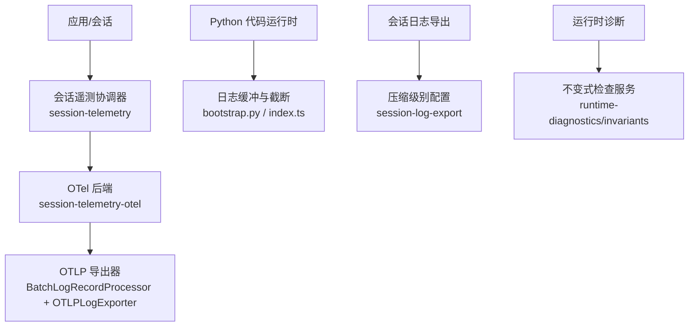
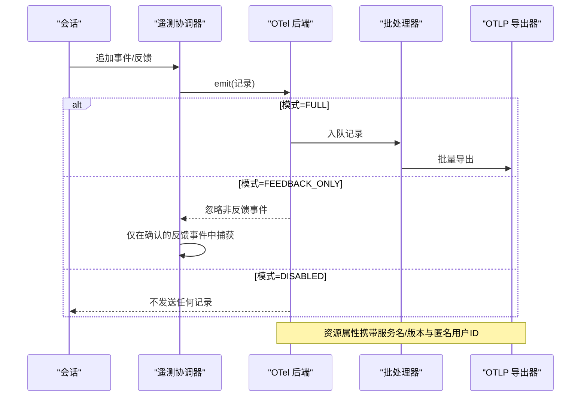
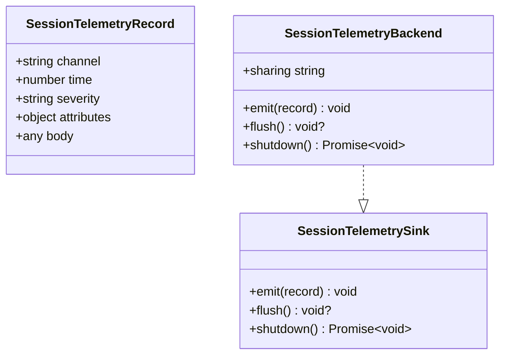
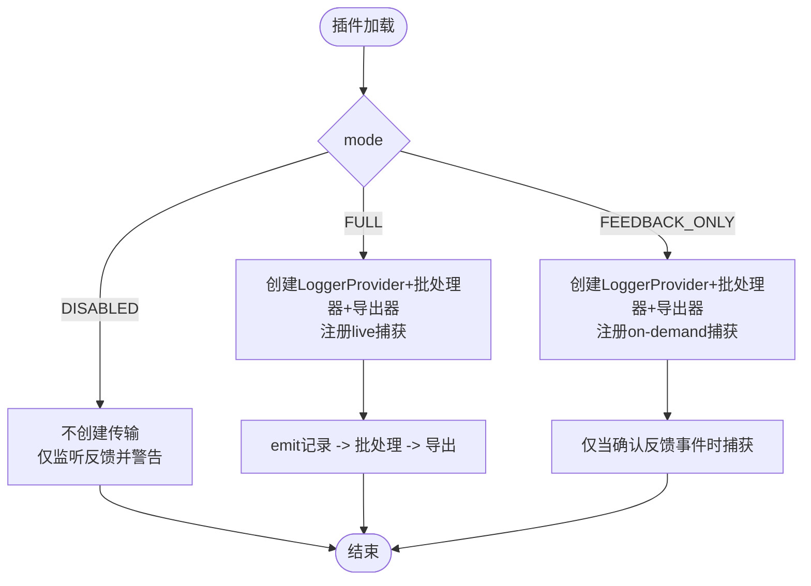
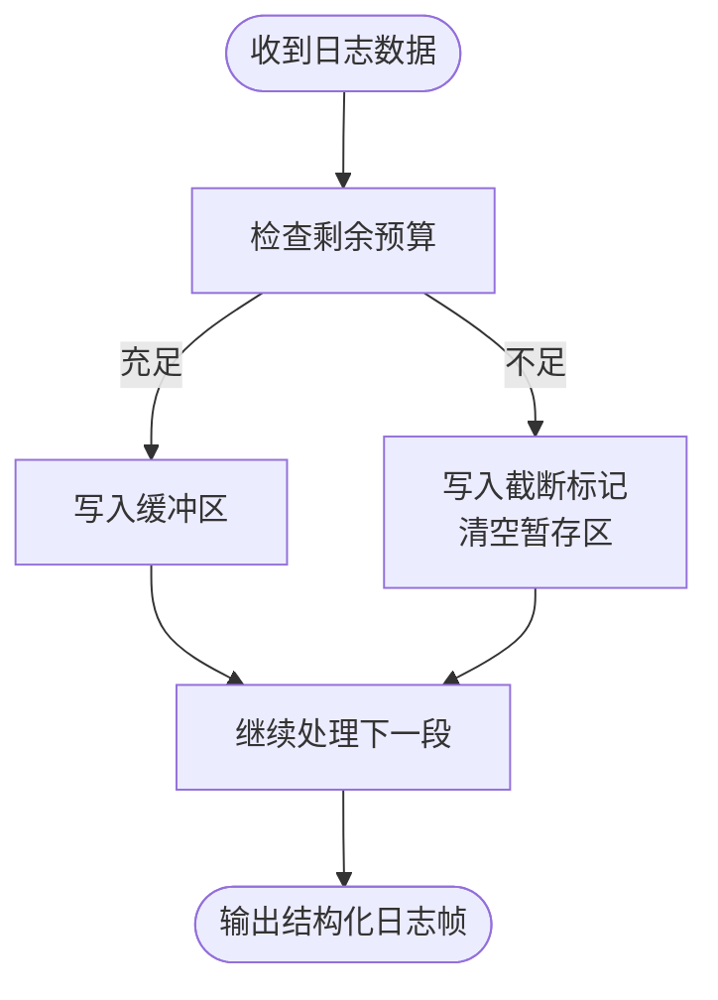
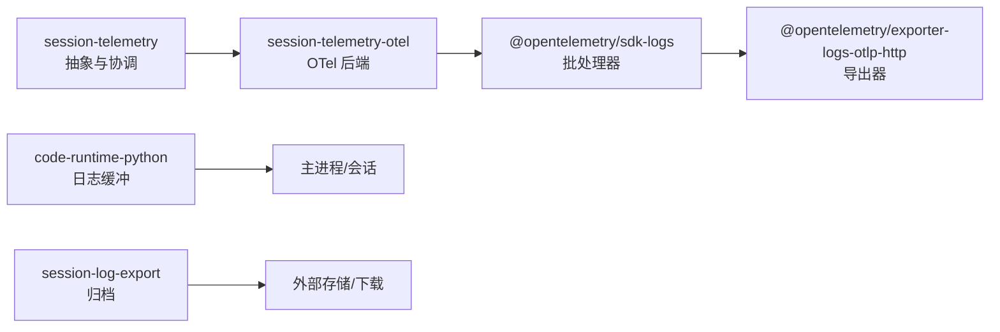

# 日志分析与监控

<cite>
**本文引用的文件**
- [packages/session/session-telemetry/src/index.ts](file://packages/session/session-telemetry/src/index.ts)
- [packages/session/session-telemetry-otel/src/index.ts](file://packages/session/session-telemetry-otel/src/index.ts)
- [packages/session/session-telemetry-otel/tests/otel.spec.ts](file://packages/session/session-telemetry-otel/tests/otel.spec.ts)
- [packages/session/session-telemetry/tests/telemetry.spec.ts](file://packages/session/session-telemetry/tests/telemetry.spec.ts)
- [packages/experimental/code-runtime-python/py/bootstrap.py](file://packages/experimental/code-runtime-python/py/bootstrap.py)
- [packages/experimental/code-runtime-python/src/index.ts](file://packages/experimental/code-runtime-python/src/index.ts)
- [packages/session-query/session-log-export/src/index.ts](file://packages/session-query/session-log-export/src/index.ts)
- [packages/test-support/session-snapshot/src/identity.ts](file://packages/test-support/session-snapshot/src/identity.ts)
- [packages/runtime-diagnostics/README.md](file://packages/runtime-diagnostics/README.md)
- [docs/subsystems/session-telemetry.md](file://docs/subsystems/session-telemetry.md)
</cite>

## 目录
1. [简介](#简介)
2. [项目结构](#项目结构)
3. [核心组件](#核心组件)
4. [架构总览](#架构总览)
5. [详细组件分析](#详细组件分析)
6. [依赖关系分析](#依赖关系分析)
7. [性能考量](#性能考量)
8. [故障排查指南](#故障排查指南)
9. [结论](#结论)
10. [附录](#附录)

## 简介
本文件面向生产与研发人员，系统化说明 DeepSeek Harness 的日志采集、遥测上报、运行时诊断与性能监控能力。重点覆盖：
- 会话遥测数据的采集策略（全量/仅反馈/关闭）与导出通道（OpenTelemetry OTLP）。
- 日志级别映射、告警严重度与关键事件标识。
- 运行时代码执行环境的日志限额与截断机制。
- 会话日志归档与下载配置。
- 运行时不变式检查与定位问题的方法。
- 生产环境日志聚合与查询最佳实践建议。

## 项目结构
围绕“日志与监控”的关键代码分布在以下模块：
- 会话遥测抽象与协调器：定义记录模型、后端契约、捕获模式与生命周期管理。
- OpenTelemetry 后端：将记录映射为 OTel 日志并经由 OTLP 导出，支持批处理与超时控制。
- Python 代码运行时：对子进程/沙箱内日志进行预算控制、截断标记与序列化输出。
- 会话日志导出：提供压缩级别等配置项，用于会话日志归档。
- 测试支撑：日志脱敏与令牌替换，便于快照与回放。
- 运行时诊断：提供运行时不变式检查服务，辅助定位异常。

图表来源
- [packages/session/session-telemetry/src/index.ts:1-179](file://packages/session/session-telemetry/src/index.ts#L1-L179)
- [packages/session/session-telemetry-otel/src/index.ts:1-302](file://packages/session/session-telemetry-otel/src/index.ts#L1-L302)
- [packages/experimental/code-runtime-python/py/bootstrap.py:333-1110](file://packages/experimental/code-runtime-python/py/bootstrap.py#L333-L1110)
- [packages/experimental/code-runtime-python/src/index.ts:1240-1296](file://packages/experimental/code-runtime-python/src/index.ts#L1240-L1296)
- [packages/session-query/session-log-export/src/index.ts:50-70](file://packages/session-query/session-log-export/src/index.ts#L50-L70)
- [packages/runtime-diagnostics/README.md:1-50](file://packages/runtime-diagnostics/README.md#L1-L50)

章节来源
- [packages/session/session-telemetry/src/index.ts:1-179](file://packages/session/session-telemetry/src/index.ts#L1-L179)
- [packages/session/session-telemetry-otel/src/index.ts:1-302](file://packages/session/session-telemetry-otel/src/index.ts#L1-L302)
- [packages/experimental/code-runtime-python/py/bootstrap.py:333-1110](file://packages/experimental/code-runtime-python/py/bootstrap.py#L333-L1110)
- [packages/experimental/code-runtime-python/src/index.ts:1240-1296](file://packages/experimental/code-runtime-python/src/index.ts#L1240-L1296)
- [packages/session-query/session-log-export/src/index.ts:50-70](file://packages/session-query/session-log-export/src/index.ts#L50-L70)
- [packages/runtime-diagnostics/README.md:1-50](file://packages/runtime-diagnostics/README.md#L1-L50)

## 核心组件
- 会话遥测抽象层
  - 定义统一的记录模型、严重度、共享策略与后端接口（emit/flush/shutdown），以及捕获模式（实时/按需）。
  - 暴露可插拔的事件转换钩子，用于在热路径上对记录做脱敏或改写。
- OpenTelemetry 后端
  - 基于 LoggerProvider + BatchLogRecordProcessor + OTLPLogExporter 构建导出管线。
  - 支持三种共享模式：FULL（全量）、FEEDBACK_ONLY（仅反馈）、DISABLED（关闭）。
  - 资源属性携带服务身份与匿名用户 ID；严重度映射到 OTel 标准值。
  - 提供加载期配置校验与关闭超时保护。
- Python 代码运行时日志
  - 使用 LogBuffer 限制日志体积，超限时写入截断标记，避免内存与 CPU 预算被耗尽。
  - 以结构化帧形式输出日志，包含文本、是否截断、是否打开状态等字段。
- 会话日志导出
  - 提供压缩级别配置，便于归档与下载。
- 运行时诊断
  - 通过 invariants 服务在运行期验证包级契约，失败时归因到具体包，便于快速定位问题。

章节来源
- [packages/session/session-telemetry/src/index.ts:47-179](file://packages/session/session-telemetry/src/index.ts#L47-L179)
- [packages/session/session-telemetry-otel/src/index.ts:43-139](file://packages/session/session-telemetry-otel/src/index.ts#L43-L139)
- [packages/experimental/code-runtime-python/py/bootstrap.py:1095-1110](file://packages/experimental/code-runtime-python/py/bootstrap.py#L1095-L1110)
- [packages/experimental/code-runtime-python/src/index.ts:1240-1296](file://packages/experimental/code-runtime-python/src/index.ts#L1240-L1296)
- [packages/session-query/session-log-export/src/index.ts:50-70](file://packages/session-query/session-log-export/src/index.ts#L50-L70)
- [packages/runtime-diagnostics/README.md:10-38](file://packages/runtime-diagnostics/README.md#L10-L38)

## 架构总览
下图展示从会话事件到遥测导出的端到端流程，以及 Python 侧日志的预算控制与截断。

图表来源
- [packages/session/session-telemetry/src/index.ts:90-179](file://packages/session/session-telemetry/src/index.ts#L90-L179)
- [packages/session/session-telemetry-otel/src/index.ts:141-253](file://packages/session/session-telemetry-otel/src/index.ts#L141-L253)

章节来源
- [packages/session/session-telemetry/src/index.ts:90-179](file://packages/session/session-telemetry/src/index.ts#L90-L179)
- [packages/session/session-telemetry-otel/src/index.ts:141-253](file://packages/session/session-telemetry-otel/src/index.ts#L141-L253)

## 详细组件分析

### 会话遥测抽象与协调器
- 记录模型
  - channel：ledger（会话日志镜像）或 ops（操作信号）。
  - time：时间戳；severity：info/warn/error；attributes：最小化标识；body：完整负载。
- 后端契约
  - emit：必须非阻塞入队；flush：可选提示；shutdown：等待管道静默。
- 捕获模式
  - live：实时捕获所有事件。
  - on-demand：按需捕获（如仅反馈）。
- 事件转换
  - 通过 session-telemetry/record 事件链实现记录重写/脱敏，不影响原始会话日志。

图表来源
- [packages/session/session-telemetry/src/index.ts:57-179](file://packages/session/session-telemetry/src/index.ts#L57-L179)

章节来源
- [packages/session/session-telemetry/src/index.ts:57-179](file://packages/session/session-telemetry/src/index.ts#L57-L179)

### OpenTelemetry 后端（导出与模式）
- 配置项
  - mode：FULL / FEEDBACK_ONLY / DISABLED（默认 DISABLED）。
  - exporter：透传给 OTLP 导出器的配置对象，要求 url 为 http(s)。
  - processor：透传给批处理器的选项（如 maxExportBatchSize）。
  - shutdownTimeoutMillis：关闭超时上限。
- 行为要点
  - 资源属性注入 service.name/version 与匿名 user.id。
  - 严重度映射至 OTel 标准值。
  - 关闭时通过 Provider.shutdown 并受超时保护。
  - DISABLED 模式不创建传输，仅对 feedback/record 发出本地警告。

图表来源
- [packages/session/session-telemetry-otel/src/index.ts:43-139](file://packages/session/session-telemetry-otel/src/index.ts#L43-L139)
- [packages/session/session-telemetry-otel/src/index.ts:141-253](file://packages/session/session-telemetry-otel/src/index.ts#L141-L253)

章节来源
- [packages/session/session-telemetry-otel/src/index.ts:43-139](file://packages/session/session-telemetry-otel/src/index.ts#L43-L139)
- [packages/session/session-telemetry-otel/src/index.ts:141-253](file://packages/session/session-telemetry-otel/src/index.ts#L141-L253)
- [packages/session/session-telemetry-otel/tests/otel.spec.ts:417-568](file://packages/session/session-telemetry-otel/tests/otel.spec.ts#L417-L568)

### Python 代码运行时日志（预算与截断）
- 日志缓冲
  - 使用 LogBuffer 限制最大字节数，超过阈值后写入截断标记，防止无限增长。
- 输出格式
  - 每条日志为结构化帧，包含 type、text、truncated、open 等字段。
- 预算计费
  - 按序列化后的成本计费，避免控制字符膨胀导致预算被绕过。
- 安全边界
  - 对超长行进行切片写入，避免一次性复制超大字符串。

图表来源
- [packages/experimental/code-runtime-python/py/bootstrap.py:333-354](file://packages/experimental/code-runtime-python/py/bootstrap.py#L333-L354)
- [packages/experimental/code-runtime-python/py/bootstrap.py:1095-1110](file://packages/experimental/code-runtime-python/py/bootstrap.py#L1095-L1110)
- [packages/experimental/code-runtime-python/src/index.ts:1240-1296](file://packages/experimental/code-runtime-python/src/index.ts#L1240-L1296)

章节来源
- [packages/experimental/code-runtime-python/py/bootstrap.py:333-354](file://packages/experimental/code-runtime-python/py/bootstrap.py#L333-L354)
- [packages/experimental/code-runtime-python/py/bootstrap.py:1095-1110](file://packages/experimental/code-runtime-python/py/bootstrap.py#L1095-L1110)
- [packages/experimental/code-runtime-python/src/index.ts:1240-1296](file://packages/experimental/code-runtime-python/src/index.ts#L1240-L1296)

### 会话日志导出与压缩
- 配置项
  - compressionLevel：压缩级别（0-9），默认值由常量提供。
- 用途
  - 用于会话日志归档与下载，便于离线分析与取证。

章节来源
- [packages/session-query/session-log-export/src/index.ts:50-70](file://packages/session-query/session-log-export/src/index.ts#L50-L70)

### 日志脱敏与快照一致性
- 功能
  - 将敏感值替换为固定令牌，确保日志快照稳定且不含隐私信息。
- 适用场景
  - 测试快照、回放与对比。

章节来源
- [packages/test-support/session-snapshot/src/identity.ts:107-128](file://packages/test-support/session-snapshot/src/identity.ts#L107-L128)

### 运行时诊断（不变式检查）
- 作用
  - 在运行期验证包级契约与事件/数据关系，失败时归因到具体包。
- 启用方式
  - 通过 invariants 服务注册与选择，支持全局开关与包名过滤。

章节来源
- [packages/runtime-diagnostics/README.md:10-38](file://packages/runtime-diagnostics/README.md#L10-L38)

## 依赖关系分析
- 会话遥测抽象层与 OTel 后端解耦：抽象层定义契约，OTel 后端实现导出。
- 批处理器与导出器：由 OTel SDK 管理，负责批量、重试与网络传输。
- Python 运行时与主进程：通过结构化日志帧通信，主进程可消费并转发到遥测系统。
- 会话日志导出：独立于遥测，专注于归档与下载。

图表来源
- [packages/session/session-telemetry/src/index.ts:90-179](file://packages/session/session-telemetry/src/index.ts#L90-L179)
- [packages/session/session-telemetry-otel/src/index.ts:197-218](file://packages/session/session-telemetry-otel/src/index.ts#L197-L218)
- [packages/experimental/code-runtime-python/py/bootstrap.py:1095-1110](file://packages/experimental/code-runtime-python/py/bootstrap.py#L1095-L1110)
- [packages/session-query/session-log-export/src/index.ts:50-70](file://packages/session-query/session-log-export/src/index.ts#L50-L70)

章节来源
- [packages/session/session-telemetry/src/index.ts:90-179](file://packages/session/session-telemetry/src/index.ts#L90-L179)
- [packages/session/session-telemetry-otel/src/index.ts:197-218](file://packages/session/session-telemetry-otel/src/index.ts#L197-L218)
- [packages/experimental/code-runtime-python/py/bootstrap.py:1095-1110](file://packages/experimental/code-runtime-python/py/bootstrap.py#L1095-L1110)
- [packages/session-query/session-log-export/src/index.ts:50-70](file://packages/session-query/session-log-export/src/index.ts#L50-L70)

## 性能考量
- 热路径非阻塞
  - 遥测 emit 必须为队列入队，避免阻塞会话循环。
- 批处理与导出
  - 使用批处理器降低网络开销；合理设置 maxExportBatchSize 与调度延迟。
- 关闭超时
  - 通过 shutdownTimeoutMillis 限制 Provider 关闭耗时，避免进程挂起。
- Python 日志预算
  - 严格限制日志体积，超限即截断，避免内存/CPU 被滥用。
- 资源属性
  - 在服务资源中携带服务名/版本与匿名用户 ID，便于聚合与去重。

章节来源
- [packages/session/session-telemetry/src/index.ts:95-132](file://packages/session/session-telemetry/src/index.ts#L95-L132)
- [packages/session/session-telemetry-otel/src/index.ts:184-195](file://packages/session/session-telemetry-otel/src/index.ts#L184-L195)
- [packages/session/session-telemetry-otel/src/index.ts:274-298](file://packages/session/session-telemetry-otel/src/index.ts#L274-L298)
- [packages/experimental/code-runtime-python/src/index.ts:1279-1296](file://packages/experimental/code-runtime-python/src/index.ts#L1279-L1296)

## 故障排查指南
- 遥测未上报
  - 检查 mode 是否为 DISABLED；若为 FEEDBACK_ONLY，仅确认的反馈事件会被捕获。
  - 检查 exporter.url 是否有效且为 http(s)。
  - 检查 processor.maxExportBatchSize 是否为正整数。
  - 关注关闭超时错误，必要时增大 shutdownTimeoutMillis。
- 日志被截断
  - Python 侧日志超出预算会写入截断标记；需结合上下文判断是否丢失关键信息。
- 反馈未被共享
  - 在 DISABLED 模式下，feedback/record 会触发本地警告；确认模式与期望一致。
- 运行时不变式失败
  - 查看 invariants 报告，定位到具体包与契约，修复数据/事件关系。

章节来源
- [packages/session/session-telemetry-otel/src/index.ts:170-195](file://packages/session/session-telemetry-otel/src/index.ts#L170-L195)
- [packages/session/session-telemetry-otel/src/index.ts:274-298](file://packages/session/session-telemetry-otel/src/index.ts#L274-L298)
- [packages/experimental/code-runtime-python/py/bootstrap.py:333-354](file://packages/experimental/code-runtime-python/py/bootstrap.py#L333-L354)
- [packages/runtime-diagnostics/README.md:10-38](file://packages/runtime-diagnostics/README.md#L10-L38)

## 结论
本系统通过抽象化的会话遥测与 OTel 后端实现了灵活的上报策略，配合 Python 运行时的日志预算控制与会话日志归档能力，形成完整的观测闭环。生产环境中建议：
- 明确共享模式与导出目标，开启必要的告警与审计。
- 合理配置批处理与关闭超时，平衡吞吐与可靠性。
- 利用日志截断标记与脱敏能力，保障稳定性与合规性。
- 借助运行时不变式检查，尽早发现契约违背与集成问题。

## 附录
- 配置速查
  - 遥测模式：FULL / FEEDBACK_ONLY / DISABLED（默认 DISABLED）。
  - 导出器：exporter.url（必填，http/s），其他字段透传 SDK。
  - 批处理器：processor.*（如 maxExportBatchSize），由 SDK 文档定义。
  - 关闭超时：shutdownTimeoutMillis（默认 3000ms）。
  - 日志压缩：compressionLevel（0-9）。
- 参考文档
  - 会话遥测子系统文档：[docs/subsystems/session-telemetry.md](file://docs/subsystems/session-telemetry.md)

章节来源
- [packages/session/session-telemetry-otel/src/index.ts:91-125](file://packages/session/session-telemetry-otel/src/index.ts#L91-L125)
- [packages/session-query/session-log-export/src/index.ts:50-70](file://packages/session-query/session-log-export/src/index.ts#L50-L70)
- [docs/subsystems/session-telemetry.md](file://docs/subsystems/session-telemetry.md)