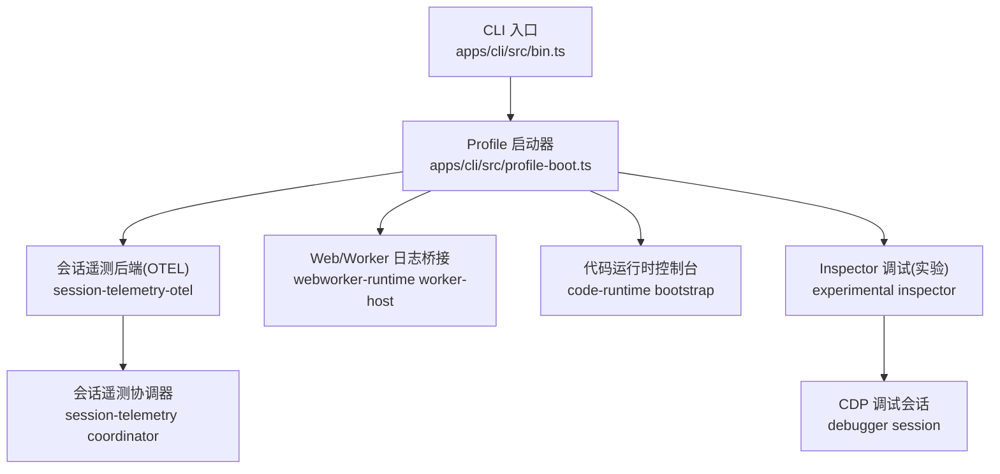
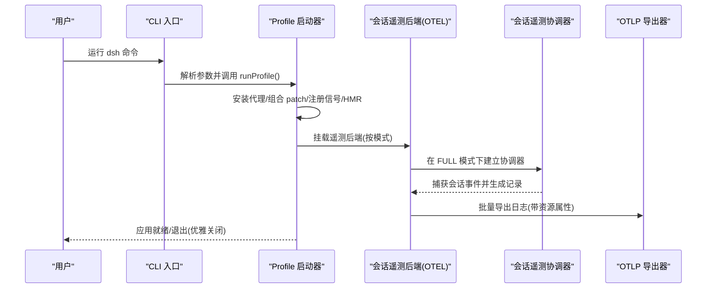
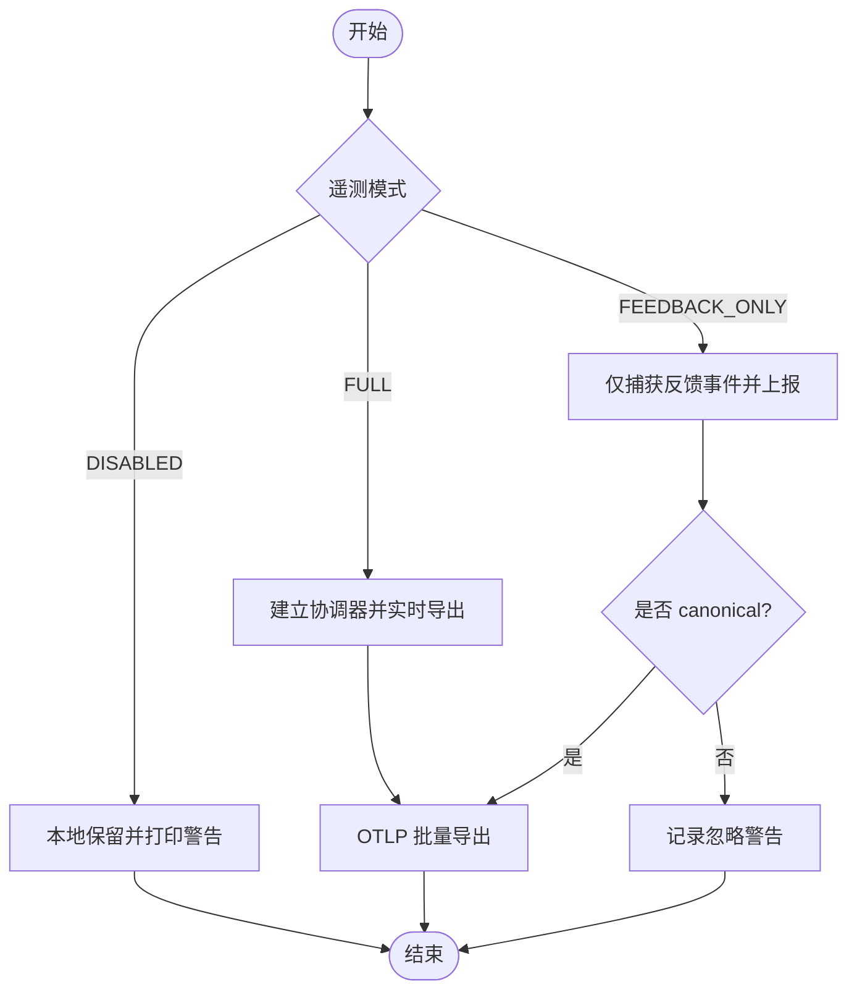
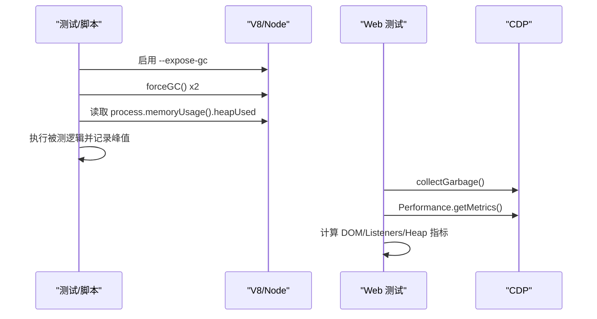
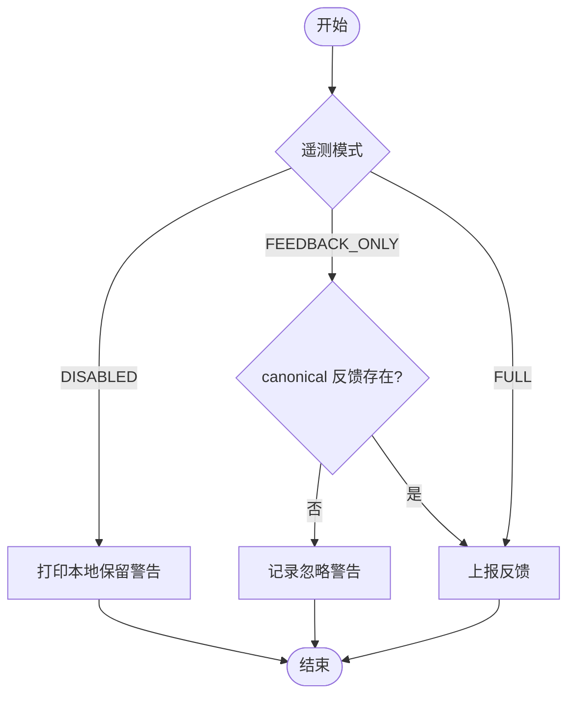
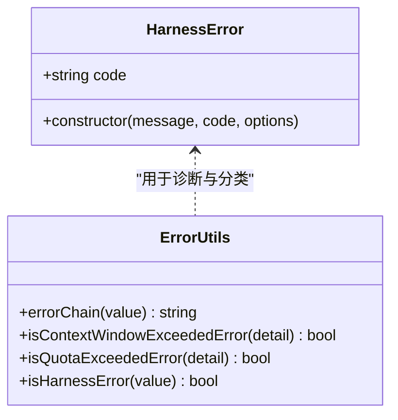
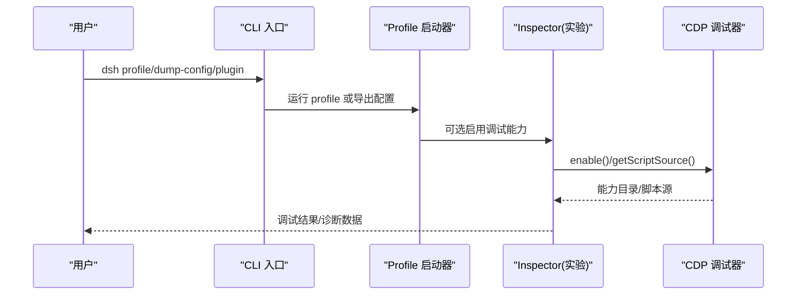
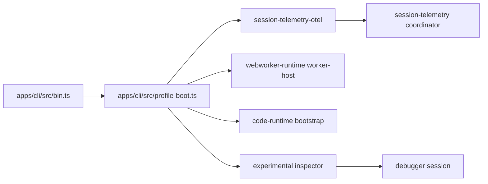

# 调试与故障排除

<cite>
**本文引用的文件**
- [apps/cli/src/bin.ts](file://apps/cli/src/bin.ts)
- [apps/cli/src/profile-boot.ts](file://apps/cli/src/profile-boot.ts)
- [packages/session/session-telemetry-otel/src/index.ts](file://packages/session/session-telemetry-otel/src/index.ts)
- [packages/session/session-telemetry/src/coordinator.ts](file://packages/session/session-telemetry/src/coordinator.ts)
- [packages/llm/llm/src/error.ts](file://packages/llm/llm/src/error.ts)
- [packages/code-runtime/code-runtime-worker-thread/src/bootstrap.ts](file://packages/code-runtime/code-runtime-worker-thread/src/bootstrap.ts)
- [packages/experimental/webworker-runtime/src/worker-host.ts](file://packages/experimental/webworker-runtime/src/worker-host.ts)
- [packages/experimental/inspector/src/host/cdp/heap-profiler.ts](file://packages/experimental/inspector/src/host/cdp/heap-profiler.ts)
- [packages/experimental/inspector/src/client/cdp/heap-profiler.ts](file://packages/experimental/inspector/src/client/cdp/heap-profiler.ts)
- [packages/experimental/inspector/src/host/bridge/controller.ts](file://packages/experimental/inspector/src/host/bridge/controller.ts)
- [packages/experimental/inspector/src/worker/cdp/domains/debugger/session.ts](file://packages/experimental/inspector/src/worker/cdp/domains/debugger/session.ts)
- [apps/web/tests/complex-history.perf.ts](file://apps/web/tests/complex-history.perf.ts)
- [packages/client/ui-conversation/tests/history-transport.perf.client.ts](file://packages/client/ui-conversation/tests/history-transport.perf.client.ts)
- [packages/extensions/cordis-client-runner/src/client/runtime.ts](file://packages/extensions/cordis-client-runner/src/client/runtime.ts)
- [packages/session-query/tool-session-query/tests/tool-session-query.spec.ts](file://packages/session-query/tool-session-query/tests/tool-session-query.spec.ts)
</cite>

## 目录
1. [简介](#简介)
2. [项目结构](#项目结构)
3. [核心组件](#核心组件)
4. [架构总览](#架构总览)
5. [详细组件分析](#详细组件分析)
6. [依赖关系分析](#依赖关系分析)
7. [性能注意事项](#性能注意事项)
8. [故障排除指南](#故障排除指南)
9. [结论](#结论)
10. [附录](#附录)

## 简介
本指南面向开发与运维人员，聚焦 deepseek-harness 的调试、日志记录策略、性能分析与内存泄漏检测、常见问题诊断、生产监控与告警配置、错误追踪与问题复现最佳实践，以及调试工具与诊断脚本的使用方法。内容基于仓库中的实际实现与测试用例，提供可操作的步骤与可视化流程图，帮助快速定位并解决问题。

## 项目结构
从调试与排障视角，关键入口与能力分布如下：
- CLI 启动与配置装配：命令行入口负责解析参数、加载环境、选择 profile 并执行；profile 启动器负责组合 patch 层、安装代理、信号处理、HMR 热重载、关闭流程等。
- 遥测与日志：OpenTelemetry 后端将会话事件与操作记录导出为 OTLP 日志；协调器捕获会话事件并生成结构化记录；Web/Worker 环境提供控制台桥接与日志落盘。
- 错误链与诊断：统一的错误基类与错误链渲染，便于跨层传递与展示；子进程/沙箱错误在工具调用中会被脱敏与标准化。
- 调试与性能：实验性 Inspector 提供 CDP 调试能力（含断点、脚本源、对象快照等）；浏览器端通过 CDP 指标采集进行性能测量；Node 侧支持强制 GC 与堆采样用于内存基准测试。

**图示来源**
- [apps/cli/src/bin.ts:24-49](file://apps/cli/src/bin.ts#L24-L49)
- [apps/cli/src/profile-boot.ts:210-319](file://apps/cli/src/profile-boot.ts#L210-L319)
- [packages/session/session-telemetry-otel/src/index.ts:141-253](file://packages/session/session-telemetry-otel/src/index.ts#L141-L253)
- [packages/session/session-telemetry/src/coordinator.ts:209-256](file://packages/session/session-telemetry/src/coordinator.ts#L209-L256)
- [packages/experimental/webworker-runtime/src/worker-host.ts:289-312](file://packages/experimental/webworker-runtime/src/worker-host.ts#L289-L312)
- [packages/code-runtime/code-runtime-worker-thread/src/bootstrap.ts:103-120](file://packages/code-runtime/code-runtime-worker-thread/src/bootstrap.ts#L103-L120)
- [packages/experimental/inspector/src/worker/cdp/domains/debugger/session.ts:96-135](file://packages/experimental/inspector/src/worker/cdp/domains/debugger/session.ts#L96-L135)

**章节来源**
- [apps/cli/src/bin.ts:24-49](file://apps/cli/src/bin.ts#L24-L49)
- [apps/cli/src/profile-boot.ts:210-319](file://apps/cli/src/profile-boot.ts#L210-L319)

## 核心组件
- CLI 启动器与 Profile 装配：统一入口解析命令模式，动态导入 profile 启动逻辑；profile 启动器负责代理安装、patch 组合、信号处理、就绪信号、HMR 热重载与优雅关闭。
- 会话遥测后端（OTEL）：以 LoggerProvider + BatchLogRecordProcessor + OTLP 导出器构建日志管线；支持 FULL、FEEDBACK_ONLY、DISABLED 三种模式；对外暴露 emit/shutdown 接口；对反馈事件进行本地化或上报控制。
- 会话遥测协调器：订阅会话事件，将 agent 错误等转换为结构化操作记录；确保捕获过程异常不会中断其他监听器；在会话结束时输出 shutdown 标记。
- 错误链与诊断：统一错误基类 HarnessError 携带稳定 code；errorChain 渲染 cause 链与 AggregateError；适配多种提供者错误文本，识别上下文窗口超限与配额耗尽。
- Web/Worker 日志桥接：在无导出器时避免警告被吞掉，将 warn/error 推送到 Worker 控制台；代码运行时的 console shim 将多级日志写入缓冲，支持字节预算与截断提示。
- Inspector 调试（实验）：提供 CDP 调试能力，包括 Debugger.enable/disable、脚本源获取、域能力发布；HeapProfiler 在 Host/Client 侧有明确的能力边界；控制器包含大量资源与超时限制。

**章节来源**
- [apps/cli/src/bin.ts:24-49](file://apps/cli/src/bin.ts#L24-L49)
- [apps/cli/src/profile-boot.ts:210-319](file://apps/cli/src/profile-boot.ts#L210-L319)
- [packages/session/session-telemetry-otel/src/index.ts:141-253](file://packages/session/session-telemetry-otel/src/index.ts#L141-L253)
- [packages/session/session-telemetry/src/coordinator.ts:209-256](file://packages/session/session-telemetry/src/coordinator.ts#L209-L256)
- [packages/llm/llm/src/error.ts:102-164](file://packages/llm/llm/src/error.ts#L102-L164)
- [packages/experimental/webworker-runtime/src/worker-host.ts:289-312](file://packages/experimental/webworker-runtime/src/worker-host.ts#L289-L312)
- [packages/code-runtime/code-runtime-worker-thread/src/bootstrap.ts:103-120](file://packages/code-runtime/code-runtime-worker-thread/src/bootstrap.ts#L103-L120)
- [packages/experimental/inspector/src/worker/cdp/domains/debugger/session.ts:96-135](file://packages/experimental/inspector/src/worker/cdp/domains/debugger/session.ts#L96-L135)

## 架构总览
下图展示了从 CLI 到遥测与调试的关键路径：

**图示来源**
- [apps/cli/src/bin.ts:24-49](file://apps/cli/src/bin.ts#L24-L49)
- [apps/cli/src/profile-boot.ts:210-319](file://apps/cli/src/profile-boot.ts#L210-L319)
- [packages/session/session-telemetry-otel/src/index.ts:141-253](file://packages/session/session-telemetry-otel/src/index.ts#L141-L253)
- [packages/session/session-telemetry/src/coordinator.ts:209-256](file://packages/session/session-telemetry/src/coordinator.ts#L209-L256)

## 详细组件分析

### 日志记录策略与日志分析技巧
- 多环境日志出口
  - Node CLI/Web 环境：通过 Cordis LoggerService 与自定义 exporter 将 warn/error 推送到 Worker 控制台，避免无导出器时警告丢失。
  - 代码运行时：使用 console shim 将 log/info/warn/error/debug 输出到 LogBuffer，支持字节预算与截断提示，便于模型识别自身输出。
- 会话级遥测日志
  - OTEL 后端根据 mode 决定行为：FULL 实时导出；FEEDBACK_ONLY 仅上报反馈；DISABLED 本地保留并打印稳定警告。
  - 协调器将 agent 错误转为 ops 记录，附带 session.id、agent.id、turn、step 等属性，便于聚合与检索。
- 日志分析建议
  - 通过 attributes 过滤：如 telemetry.op=agent-error、session.id、agent.id。
  - 关注 severity 级别：info/warn/error 对应不同排查优先级。
  - 结合反馈事件：在 FEEDBACK_ONLY 模式下，仅当 canonical 会话中存在 feedback/record 才会触发上报。

**图示来源**
- [packages/session/session-telemetry-otel/src/index.ts:141-253](file://packages/session/session-telemetry-otel/src/index.ts#L141-L253)
- [packages/session/session-telemetry/src/coordinator.ts:209-256](file://packages/session/session-telemetry/src/coordinator.ts#L209-L256)

**章节来源**
- [packages/experimental/webworker-runtime/src/worker-host.ts:289-312](file://packages/experimental/webworker-runtime/src/worker-host.ts#L289-L312)
- [packages/code-runtime/code-runtime-worker-thread/src/bootstrap.ts:103-120](file://packages/code-runtime/code-runtime-worker-thread/src/bootstrap.ts#L103-L120)
- [packages/session/session-telemetry-otel/src/index.ts:141-253](file://packages/session/session-telemetry-otel/src/index.ts#L141-L253)
- [packages/session/session-telemetry/src/coordinator.ts:209-256](file://packages/session/session-telemetry/src/coordinator.ts#L209-L256)

### 性能分析与内存泄漏检测
- Node 侧内存基准
  - 使用 --expose-gc 启用强制 GC，采样 baseline 与峰值 heapUsed，计算增量峰值，重复多次取中位数。
- 浏览器侧性能指标
  - 通过 CDP Performance.getMetrics 获取 DOM 节点数、JS 事件监听器数量、JSHeapUsedSize 等指标；配合 HeapProfiler.collectGarbage 清理后测量。
- 调试器与堆分析
  - Inspector 提供 Debugger 能力（enable/disable、脚本源获取），但当前未暴露 Client/Host 堆分析桥接能力；可通过 CDP 手动触发 GC 与收集指标。

**图示来源**
- [packages/client/ui-conversation/tests/history-transport.perf.client.ts:188-211](file://packages/client/ui-conversation/tests/history-transport.perf.client.ts#L188-L211)
- [apps/web/tests/complex-history.perf.ts:520-547](file://apps/web/tests/complex-history.perf.ts#L520-L547)
- [packages/experimental/inspector/src/host/cdp/heap-profiler.ts:1-11](file://packages/experimental/inspector/src/host/cdp/heap-profiler.ts#L1-L11)
- [packages/experimental/inspector/src/client/cdp/heap-profiler.ts:1-11](file://packages/experimental/inspector/src/client/cdp/heap-profiler.ts#L1-L11)

**章节来源**
- [packages/client/ui-conversation/tests/history-transport.perf.client.ts:188-211](file://packages/client/ui-conversation/tests/history-transport.perf.client.ts#L188-L211)
- [apps/web/tests/complex-history.perf.ts:520-547](file://apps/web/tests/complex-history.perf.ts#L520-L547)
- [packages/experimental/inspector/src/host/cdp/heap-profiler.ts:1-11](file://packages/experimental/inspector/src/host/cdp/heap-profiler.ts#L1-L11)
- [packages/experimental/inspector/src/client/cdp/heap-profiler.ts:1-11](file://packages/experimental/inspector/src/client/cdp/heap-profiler.ts#L1-L11)

### 常见问题的诊断步骤与解决方案
- 遥测未上报
  - 检查 mode 是否为 DISABLED；若为 DISABLED，会打印稳定警告且反馈保持本地。
  - 确认 exporter.url 已正确配置且为 http(s)；processor.maxExportBatchSize 必须为正整数。
  - 在 FEEDBACK_ONLY 模式下，仅当 canonical 会话存在 feedback/record 才会上报。
- 会话查询失败
  - 工具调用返回标准化错误码与消息；敏感信息会被脱敏，同时记录 warn 日志以便内部排查。
- 子进程/沙箱错误
  - 错误消息可能被截断为“… [truncated]”，需结合上下文与日志缓冲上限调整。

**图示来源**
- [packages/session/session-telemetry-otel/src/index.ts:141-253](file://packages/session/session-telemetry-otel/src/index.ts#L141-L253)
- [packages/session-query/tool-session-query/tests/tool-session-query.spec.ts:837-907](file://packages/session-query/tool-session-query/tests/tool-session-query.spec.ts#L837-L907)

**章节来源**
- [packages/session/session-telemetry-otel/src/index.ts:141-253](file://packages/session/session-telemetry-otel/src/index.ts#L141-L253)
- [packages/session-query/tool-session-query/tests/tool-session-query.spec.ts:837-907](file://packages/session-query/tool-session-query/tests/tool-session-query.spec.ts#L837-L907)

### 生产环境的监控与告警配置
- 遥测模式选择
  - 生产建议使用 FULL 或 FEEDBACK_ONLY；DISABLED 适合本地开发或隐私严格场景。
- 导出器配置
  - 设置 exporter.url 为有效的 OTLP 日志端点；可配置 timeoutMillis、compression、keepAlive 等 SDK 选项。
  - processor.maxExportBatchSize 必须为正整数，避免队列堆积导致关闭挂起。
- 关闭超时
  - shutdownTimeoutMillis 控制 provider.shutdown() 等待时间，防止长时间阻塞；默认 3000ms。
- 环境变量开关
  - 通过 DSH_TELEMETRY_DISABLED 硬禁用遥测；任何非空值均生效，优先于配置。

**章节来源**
- [packages/session/session-telemetry-otel/src/index.ts:86-125](file://packages/session/session-telemetry-otel/src/index.ts#L86-L125)
- [packages/session/session-telemetry-otel/src/index.ts:170-196](file://packages/session/session-telemetry-otel/src/index.ts#L170-L196)
- [packages/session/session-telemetry-otel/src/index.ts:274-298](file://packages/session/session-telemetry-otel/src/index.ts#L274-L298)
- [apps/cli/src/profile-boot.ts:77-104](file://apps/cli/src/profile-boot.ts#L77-L104)

### 错误追踪与问题复现的最佳实践
- 使用 HarnessError.code 进行机器路由，不要解析 message。
- 使用 errorChain 渲染完整 cause 链与 AggregateError 成员，便于跨层定位根因。
- 针对上下文窗口超限与配额耗尽，使用专用判断函数识别提供者错误文本。
- 在工具调用中，错误会被标准化与脱敏，注意查看 warn 日志中的原始信息。

**图示来源**
- [packages/llm/llm/src/error.ts:7-22](file://packages/llm/llm/src/error.ts#L7-L22)
- [packages/llm/llm/src/error.ts:102-164](file://packages/llm/llm/src/error.ts#L102-L164)

**章节来源**
- [packages/llm/llm/src/error.ts:102-164](file://packages/llm/llm/src/error.ts#L102-L164)
- [packages/extensions/cordis-client-runner/src/client/runtime.ts:469-494](file://packages/extensions/cordis-client-runner/src/client/runtime.ts#L469-L494)

### 调试工具与诊断脚本的使用方法
- CLI 命令
  - 使用 dsh 的 profile 模式运行指定配置；dump-config 可导出当前组合后的配置；plugin 模式运行插件。
- Profile 启动器
  - 自动安装代理、组合 patch 层、注册信号处理、HMR 热重载、优雅关闭；支持 live 模式编辑 cordis.patch.yml 即时生效。
- Inspector（实验）
  - 通过 CDP 启用调试器、获取脚本源、发布能力目录；控制器包含多项资源与超时限制，避免过度占用。
  - HeapProfiler 在当前实现中未暴露 Host/Client 堆分析桥接能力，需借助 CDP 指标与手动 GC。

**图示来源**
- [apps/cli/src/bin.ts:24-49](file://apps/cli/src/bin.ts#L24-L49)
- [apps/cli/src/profile-boot.ts:210-319](file://apps/cli/src/profile-boot.ts#L210-L319)
- [packages/experimental/inspector/src/worker/cdp/domains/debugger/session.ts:96-135](file://packages/experimental/inspector/src/worker/cdp/domains/debugger/session.ts#L96-L135)
- [packages/experimental/inspector/src/host/bridge/controller.ts:57-84](file://packages/experimental/inspector/src/host/bridge/controller.ts#L57-L84)

**章节来源**
- [apps/cli/src/bin.ts:24-49](file://apps/cli/src/bin.ts#L24-L49)
- [apps/cli/src/profile-boot.ts:210-319](file://apps/cli/src/profile-boot.ts#L210-L319)
- [packages/experimental/inspector/src/worker/cdp/domains/debugger/session.ts:96-135](file://packages/experimental/inspector/src/worker/cdp/domains/debugger/session.ts#L96-L135)
- [packages/experimental/inspector/src/host/bridge/controller.ts:57-84](file://packages/experimental/inspector/src/host/bridge/controller.ts#L57-L84)

## 依赖关系分析
- CLI 与 Profile 启动器：bin.ts 解析参数并调用 profile-boot.ts；后者负责组合 patch、安装代理、信号处理、HMR、关闭。
- 遥测后端与协调器：OTEL 后端在 FULL 模式下创建协调器；协调器捕获事件并生成记录；后端将记录映射到 OTel Logger 并导出。
- 错误链与诊断：错误工具函数被多处引用，用于渲染与分类错误；子进程/沙箱错误在工具调用中被标准化与脱敏。
- 调试与性能：Inspector 提供 CDP 调试能力；浏览器与 Node 测试通过 CDP 与 --expose-gc 进行性能与内存测量。

**图示来源**
- [apps/cli/src/bin.ts:24-49](file://apps/cli/src/bin.ts#L24-L49)
- [apps/cli/src/profile-boot.ts:210-319](file://apps/cli/src/profile-boot.ts#L210-L319)
- [packages/session/session-telemetry-otel/src/index.ts:141-253](file://packages/session/session-telemetry-otel/src/index.ts#L141-L253)
- [packages/session/session-telemetry/src/coordinator.ts:209-256](file://packages/session/session-telemetry/src/coordinator.ts#L209-L256)
- [packages/experimental/webworker-runtime/src/worker-host.ts:289-312](file://packages/experimental/webworker-runtime/src/worker-host.ts#L289-L312)
- [packages/code-runtime/code-runtime-worker-thread/src/bootstrap.ts:103-120](file://packages/code-runtime/code-runtime-worker-thread/src/bootstrap.ts#L103-L120)
- [packages/experimental/inspector/src/worker/cdp/domains/debugger/session.ts:96-135](file://packages/experimental/inspector/src/worker/cdp/domains/debugger/session.ts#L96-L135)

**章节来源**
- [apps/cli/src/bin.ts:24-49](file://apps/cli/src/bin.ts#L24-L49)
- [apps/cli/src/profile-boot.ts:210-319](file://apps/cli/src/profile-boot.ts#L210-L319)
- [packages/session/session-telemetry-otel/src/index.ts:141-253](file://packages/session/session-telemetry-otel/src/index.ts#L141-L253)
- [packages/session/session-telemetry/src/coordinator.ts:209-256](file://packages/session/session-telemetry/src/coordinator.ts#L209-L256)

## 性能注意事项
- 遥测导出批处理：合理设置 maxExportBatchSize 与 scheduledDelayMillis，避免频繁导出或队列堆积。
- 关闭超时：shutdownTimeoutMillis 应覆盖网络抖动与 collector 延迟，避免进程卡住。
- 内存基准：使用 --expose-gc 与多次采样降低噪声；浏览器端先 collectGarbage 再采集指标。
- 日志缓冲：代码运行时日志缓冲有字节预算，过大输出会被截断；必要时调整预算或分片输出。

[本节为通用指导，不直接分析具体文件]

## 故障排除指南
- 遥测未上报
  - 检查 mode 与 exporter.url；确认 batch size 为正整数；观察 DISABLED 模式的本地警告。
  - 在 FEEDBACK_ONLY 模式下，确认 canonical 会话存在 feedback/record。
- 会话查询失败
  - 查看标准化错误码与消息；注意敏感信息已被脱敏，参考 warn 日志定位原始原因。
- 子进程/沙箱错误
  - 错误消息可能显示“… [truncated]”；结合日志缓冲上限与上下文进行分析。
- 调试器不可用
  - 确认 Inspector 已启用；检查 CDP 能力与超时配置；客户端/宿主堆分析能力当前未暴露。

**章节来源**
- [packages/session/session-telemetry-otel/src/index.ts:141-253](file://packages/session/session-telemetry-otel/src/index.ts#L141-L253)
- [packages/session-query/tool-session-query/tests/tool-session-query.spec.ts:837-907](file://packages/session-query/tool-session-query/tests/tool-session-query.spec.ts#L837-L907)
- [packages/experimental/inspector/src/host/cdp/heap-profiler.ts:1-11](file://packages/experimental/inspector/src/host/cdp/heap-profiler.ts#L1-L11)
- [packages/experimental/inspector/src/client/cdp/heap-profiler.ts:1-11](file://packages/experimental/inspector/src/client/cdp/heap-profiler.ts#L1-L11)

## 结论
本指南基于 deepseek-harness 的实际实现，系统梳理了日志记录策略、性能分析与内存检测、常见问题诊断、生产监控与告警配置、错误追踪与调试工具使用方法。通过结构化记录、稳定的错误码与链路渲染、以及 CDP 与 OTLP 能力，开发者与运维人员可以快速定位问题、优化性能并确保生产稳定性。

## 附录
- 常用环境变量
  - DSH_TELEMETRY_DISABLED：硬禁用遥测（任何非空值生效）。
- 配置文件关键点
  - exporter.url：OTLP 日志端点（http/https）。
  - processor.maxExportBatchSize：正整数，避免队列堆积。
  - shutdownTimeoutMillis：provider 关闭超时（默认 3000ms）。
- 调试命令
  - dsh profile：运行指定 profile。
  - dsh dump-config：导出当前组合配置。
  - dsh plugin：运行插件。

[本节为补充信息，不直接分析具体文件]