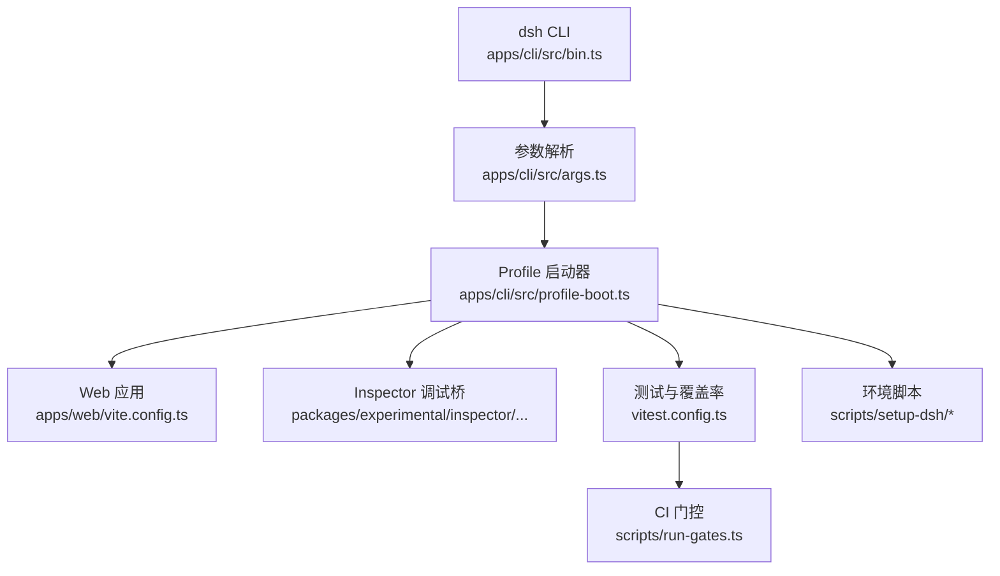
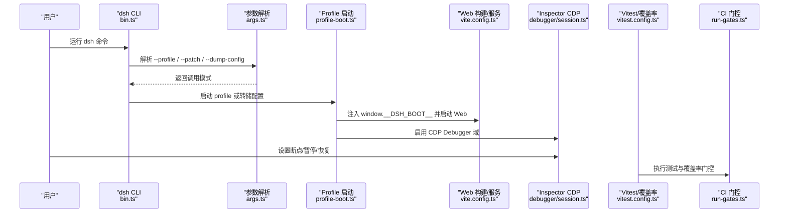
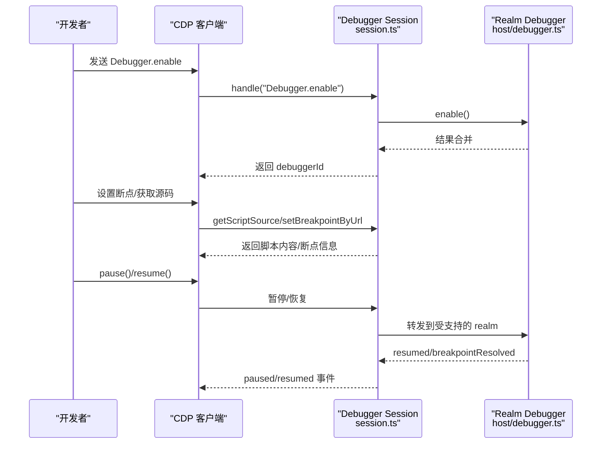
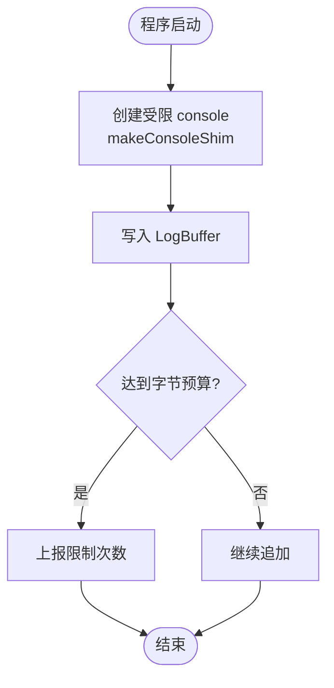
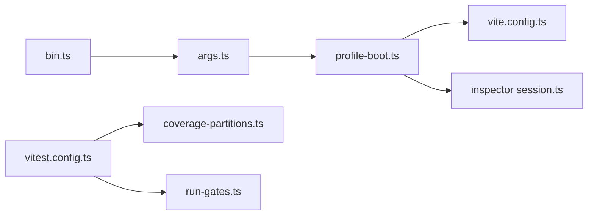

# 调试工具与脚本

<cite>
**本文引用的文件**
- [apps/cli/src/bin.ts](file://apps/cli/src/bin.ts)
- [apps/cli/src/args.ts](file://apps/cli/src/args.ts)
- [apps/cli/src/profile-boot.ts](file://apps/cli/src/profile-boot.ts)
- [apps/web/vite.config.ts](file://apps/web/vite.config.ts)
- [packages/experimental/inspector/src/worker/cdp/domains/debugger/session.ts](file://packages/experimental/inspector/src/worker/cdp/domains/debugger/session.ts)
- [packages/experimental/inspector/src/worker/realms/host/debugger.ts](file://packages/experimental/inspector/src/worker/realms/host/debugger.ts)
- [packages/experimental/inspector/tests/client-browser.e2e.ts](file://packages/experimental/inspector/tests/client-browser.e2e.ts)
- [scripts/setup-dsh/setup.env.example](file://scripts/setup-dsh/setup.env.example)
- [scripts/setup-dsh/export-env.sh](file://scripts/setup-dsh/export-env.sh)
- [scripts/setup-dsh/setup.sh](file://scripts/setup-dsh/setup.sh)
- [vitest.config.ts](file://vitest.config.ts)
- [scripts/test-proxy-environment.ts](file://scripts/test-proxy-environment.ts)
- [scripts/run-gates.ts](file://scripts/run-gates.ts)
- [scripts/coverage-partitions.ts](file://scripts/coverage-partitions.ts)
- [packages/code-runtime/code-runtime-worker-thread/src/bootstrap.ts](file://packages/code-runtime/code-runtime-worker-thread/src/bootstrap.ts)
- [packages/code-runtime/code-runtime-worker-thread/tests/bootstrap.spec.ts](file://packages/code-runtime/code-runtime-worker-thread/tests/bootstrap.spec.ts)
- [apps/web/tests/vite-entry.e2e.ts](file://apps/web/tests/vite-entry.e2e.ts)
</cite>

## 目录
1. [简介](#简介)
2. [项目结构](#项目结构)
3. [核心组件](#核心组件)
4. [架构总览](#架构总览)
5. [详细组件分析](#详细组件分析)
6. [依赖关系分析](#依赖关系分析)
7. [性能考虑](#性能考虑)
8. [故障排查指南](#故障排查指南)
9. [结论](#结论)
10. [附录](#附录)

## 简介
本指南聚焦 DeepSeek Harness 的调试能力与脚本体系，覆盖以下目标：
- 内置调试命令与调试模式的使用方法（CLI、Web、Inspector）。
- 开发环境与生产环境的调试差异。
- 自定义调试脚本编写指南（断点、日志注入、状态检查）。
- 使用浏览器开发者工具调试 Web 界面。
- 在自动化测试与持续集成中的调试策略。

## 项目结构
仓库围绕“命令行入口 + 配置装配 + Web 构建 + Inspector 调试 + 测试与 CI”组织：
- CLI 入口负责解析参数、加载并启动 profile，提供 dump-config、profile 运行、plugin 管理等能力。
- Web 构建通过 Vite 插件拒绝独立 serve，强制通过 dsh web 启动，确保注入运行时所需上下文。
- Inspector 提供 CDP 会话桥接，支持 enable/disable/pause/resume、源码获取、调用栈评估等。
- 测试与覆盖率由 Vitest 统一编排，包含进程隔离、平台排除、覆盖率阈值与分区执行。
- 部署与一键初始化脚本提供环境变量模板与导出能力，便于复现本地环境。

图表来源
- [apps/cli/src/bin.ts:1-51](file://apps/cli/src/bin.ts#L1-L51)
- [apps/cli/src/args.ts:1-192](file://apps/cli/src/args.ts#L1-L192)
- [apps/cli/src/profile-boot.ts:1-321](file://apps/cli/src/profile-boot.ts#L1-L321)
- [apps/web/vite.config.ts:1-230](file://apps/web/vite.config.ts#L1-L230)
- [packages/experimental/inspector/src/worker/cdp/domains/debugger/session.ts:48-213](file://packages/experimental/inspector/src/worker/cdp/domains/debugger/session.ts#L48-L213)
- [vitest.config.ts:1-374](file://vitest.config.ts#L1-L374)
- [scripts/run-gates.ts:115-262](file://scripts/run-gates.ts#L115-L262)
- [scripts/setup-dsh/setup.env.example:1-88](file://scripts/setup-dsh/setup.env.example#L1-L88)

章节来源
- [apps/cli/src/bin.ts:1-51](file://apps/cli/src/bin.ts#L1-L51)
- [apps/cli/src/args.ts:1-192](file://apps/cli/src/args.ts#L1-L192)
- [apps/cli/src/profile-boot.ts:1-321](file://apps/cli/src/profile-boot.ts#L1-L321)
- [apps/web/vite.config.ts:1-230](file://apps/web/vite.config.ts#L1-L230)
- [vitest.config.ts:1-374](file://vitest.config.ts#L1-L374)
- [scripts/run-gates.ts:115-262](file://scripts/run-gates.ts#L115-L262)
- [scripts/setup-dsh/setup.env.example:1-88](file://scripts/setup-dsh/setup.env.example#L1-L88)

## 核心组件
- CLI 启动链：bin.ts 根据 args.ts 解析出的模式分发到 profile 启动或配置转储；profile-boot.ts 负责组合 patch 层、安装代理、信号处理、HMR 监听与就绪信号。
- Web 构建：vite.config.ts 禁止独立 serve，注入文档标题，生成 preview 页面，拆分 vendor chunk，设置 sourcemap 与别名。
- Inspector 调试：CDP session 实现 Debugger 域请求路由，支持 enable/disable/getScriptSource/searchInContent/evaluateOnCallFrame/pause/resume；host debugger 封装事件通道与请求转发。
- 测试与覆盖率：vitest.config.ts 定义多项目、平台排除、覆盖率阈值、setupFiles；coverage-partitions.ts 生成分区配置；run-gates.ts 聚合 CI 门控。
- 环境脚本：setup.env.example 提供一键初始化变量模板；export-env.sh 导出当前运行配置为 DSH_* 变量；setup.sh 提供交互式/非交互初始化流程。

章节来源
- [apps/cli/src/bin.ts:1-51](file://apps/cli/src/bin.ts#L1-L51)
- [apps/cli/src/args.ts:1-192](file://apps/cli/src/args.ts#L1-L192)
- [apps/cli/src/profile-boot.ts:1-321](file://apps/cli/src/profile-boot.ts#L1-L321)
- [apps/web/vite.config.ts:1-230](file://apps/web/vite.config.ts#L1-L230)
- [packages/experimental/inspector/src/worker/cdp/domains/debugger/session.ts:48-213](file://packages/experimental/inspector/src/worker/cdp/domains/debugger/session.ts#L48-L213)
- [packages/experimental/inspector/src/worker/realms/host/debugger.ts:22-57](file://packages/experimental/inspector/src/worker/realms/host/debugger.ts#L22-L57)
- [vitest.config.ts:1-374](file://vitest.config.ts#L1-L374)
- [scripts/coverage-partitions.ts:378-547](file://scripts/coverage-partitions.ts#L378-L547)
- [scripts/run-gates.ts:115-262](file://scripts/run-gates.ts#L115-L262)
- [scripts/setup-dsh/setup.env.example:1-88](file://scripts/setup-dsh/setup.env.example#L1-L88)
- [scripts/setup-dsh/export-env.sh:1-41](file://scripts/setup-dsh/export-env.sh#L1-L41)
- [scripts/setup-dsh/setup.sh:96-135](file://scripts/setup-dsh/setup.sh#L96-L135)

## 架构总览
下图展示从 CLI 到 Web/Inspector 的调试链路，以及测试与 CI 的协作方式。

图表来源
- [apps/cli/src/bin.ts:1-51](file://apps/cli/src/bin.ts#L1-L51)
- [apps/cli/src/args.ts:1-192](file://apps/cli/src/args.ts#L1-L192)
- [apps/cli/src/profile-boot.ts:1-321](file://apps/cli/src/profile-boot.ts#L1-L321)
- [apps/web/vite.config.ts:1-230](file://apps/web/vite.config.ts#L1-L230)
- [packages/experimental/inspector/src/worker/cdp/domains/debugger/session.ts:48-213](file://packages/experimental/inspector/src/worker/cdp/domains/debugger/session.ts#L48-L213)
- [vitest.config.ts:1-374](file://vitest.config.ts#L1-L374)
- [scripts/run-gates.ts:115-262](file://scripts/run-gates.ts#L115-L262)

## 详细组件分析

### CLI 调试命令与模式
- 入口与分发：bin.ts 读取版本后调用 args.ts 解析，按 mode 分发至 profile 启动、插件管理或配置转储。
- 参数解析：args.ts 定义 --profile、--patch、--dump-config、--dump-default-config、web 子命令、plugin 子命令；将内部参数透传给被启动的应用。
- Profile 启动：profile-boot.ts 组装 bundle 层、profile 层、home 层、overlay 层与遥测开关；安装代理、信号处理、HMR 监听；提供 ready 信号与退出控制。

实用要点
- 使用 --dump-config 查看最终组合树，避免误改用户层导致不一致。
- 使用 --patch 叠加临时补丁进行问题定位。
- 使用 web 子命令等价于 --profile web，便于快速启动前端。

章节来源
- [apps/cli/src/bin.ts:1-51](file://apps/cli/src/bin.ts#L1-L51)
- [apps/cli/src/args.ts:1-192](file://apps/cli/src/args.ts#L1-L192)
- [apps/cli/src/profile-boot.ts:1-321](file://apps/cli/src/profile-boot.ts#L1-L321)

### Web 开发与调试
- 禁止独立 serve：vite.config.ts 在 serve 模式下抛出错误，要求通过 dsh web 启动，确保注入必要上下文。
- 构建产物：开启 sourcemap，生成 preview.html，拆分 vendor chunk，字体资源归类，别名替换 Node 模块。
- 开发约定：配合 dev:web watcher 与 HMR，修改初始 roster 后可观察 DOM 变化而不刷新页面身份。

调试技巧
- 使用浏览器开发者工具的 Sources 面板，结合生成的 sourcemap 直接定位源码。
- 通过 Network 面板验证静态资源与映射是否可访问。
- 使用 Preview 页面（preview.html）单独挂载 worker bootstrap 进行离线调试。

章节来源
- [apps/web/vite.config.ts:1-230](file://apps/web/vite.config.ts#L1-L230)
- [apps/web/tests/vite-entry.e2e.ts:1-63](file://apps/web/tests/vite-entry.e2e.ts#L1-L63)

### Inspector 调试（CDP）
- CDP 会话：session.ts 实现 Debugger 域请求路由，包括 enable/disable/getScriptSource/searchInContent/evaluateOnCallFrame/pause/resume；不支持的方法转发给原生后端。
- Host 桥接：debugger.ts 封装事件通道与请求转发，暴露 enable/disable/pause/resume 方法。
- 客户端限制：client-side 主动调试未暴露，仅支持只读源码操作。

断点调试流程

图表来源
- [packages/experimental/inspector/src/worker/cdp/domains/debugger/session.ts:48-213](file://packages/experimental/inspector/src/worker/cdp/domains/debugger/session.ts#L48-L213)
- [packages/experimental/inspector/src/worker/realms/host/debugger.ts:22-57](file://packages/experimental/inspector/src/worker/realms/host/debugger.ts#L22-L57)
- [packages/experimental/inspector/tests/client-browser.e2e.ts:203-215](file://packages/experimental/inspector/tests/client-browser.e2e.ts#L203-L215)

章节来源
- [packages/experimental/inspector/src/worker/cdp/domains/debugger/session.ts:48-213](file://packages/experimental/inspector/src/worker/cdp/domains/debugger/session.ts#L48-L213)
- [packages/experimental/inspector/src/worker/realms/host/debugger.ts:22-57](file://packages/experimental/inspector/src/worker/realms/host/debugger.ts#L22-L57)
- [packages/experimental/inspector/tests/client-browser.e2e.ts:203-215](file://packages/experimental/inspector/tests/client-browser.e2e.ts#L203-L215)

### 日志注入与状态检查
- 受限控制台：code-runtime 提供 makeConsoleShim，将 log/info/warn/error/debug 输出写入缓冲，便于采集与限流。
- 缓冲区行为：LogBuffer 在达到字节预算时截断并报告一次限制，保证日志可控。
- 状态检查：通过 profile 提供的 ready 信号与 ctx.cmdlineArgs 快照，可在插件中读取启动参数与就绪状态。

图表来源
- [packages/code-runtime/code-runtime-worker-thread/src/bootstrap.ts:103-120](file://packages/code-runtime/code-runtime-worker-thread/src/bootstrap.ts#L103-L120)
- [packages/code-runtime/code-runtime-worker-thread/tests/bootstrap.spec.ts:70-101](file://packages/code-runtime/code-runtime-worker-thread/tests/bootstrap.spec.ts#L70-L101)

章节来源
- [packages/code-runtime/code-runtime-worker-thread/src/bootstrap.ts:103-120](file://packages/code-runtime/code-runtime-worker-thread/src/bootstrap.ts#L103-L120)
- [packages/code-runtime/code-runtime-worker-thread/tests/bootstrap.spec.ts:70-101](file://packages/code-runtime/code-runtime-worker-thread/tests/bootstrap.spec.ts#L70-L101)
- [apps/cli/src/profile-boot.ts:210-321](file://apps/cli/src/profile-boot.ts#L210-L321)

### 自定义调试脚本编写指南
- 基于 CLI 参数：使用 args.ts 的解析结果，向被启动应用传递自定义标志位，并在应用侧消费。
- 基于 Profile 补丁：通过 --patch 叠加临时 cordis.patch.yml 片段，动态启用/禁用功能行。
- 基于环境变量：使用 setup.env.example 中的 DSH_* 变量模板，结合 export-env.sh 导出当前配置，复现问题环境。
- 基于测试框架：在 vitest.config.ts 的 setupFiles 中注入全局探针，或在单测中模拟网络/文件系统/子进程。

最佳实践
- 保持补丁幂等：避免重复插入相同 id 的行。
- 分离稳定标识与临时地址：fixture 标识与传输地址解耦，减少并发冲突。
- 精确恢复全局变更：在 teardown 中还原 process.env、定时器、监听器等。

章节来源
- [apps/cli/src/args.ts:1-192](file://apps/cli/src/args.ts#L1-L192)
- [apps/cli/src/profile-boot.ts:1-321](file://apps/cli/src/profile-boot.ts#L1-L321)
- [scripts/setup-dsh/setup.env.example:1-88](file://scripts/setup-dsh/setup.env.example#L1-L88)
- [scripts/setup-dsh/export-env.sh:1-41](file://scripts/setup-dsh/export-env.sh#L1-L41)
- [vitest.config.ts:1-374](file://vitest.config.ts#L1-L374)

### 浏览器开发者工具调试 Web 界面
- 启用 sourcemap：vite.config.ts 开启 sourcemap，使浏览器可直接映射到源码。
- 拒绝独立 serve：防止绕过 dsh web 导致的上下文缺失，确保 window.__DSH_BOOT__ 注入。
- 验证构建产物：通过 e2e 测试确认 index.html 与 preview.html 的模块入口与缓存头正确。

操作步骤
- 启动 dsh web 后打开浏览器开发者工具。
- 在 Sources 面板选择对应源码文件，设置断点并触发交互。
- 在 Network 面板检查脚本与映射文件的 HTTP 状态码与缓存头。

章节来源
- [apps/web/vite.config.ts:1-230](file://apps/web/vite.config.ts#L1-L230)
- [apps/web/tests/vite-entry.e2e.ts:1-63](file://apps/web/tests/vite-entry.e2e.ts#L1-L63)

### 自动化调试与持续集成策略
- 门控聚合：run-gates.ts 提供多种模式（ci-primary、ci-snapshot、ci-coverage 等），用于组合不同 gate 任务。
- 覆盖率分区：coverage-partitions.ts 为每个分区生成独立的 Vitest 配置，避免命令行过长与重复执行。
- 平台适配：vitest.config.ts 针对 Windows/macOS 排除不支持套件，确保跨平台稳定性。
- 代理与环境：test-proxy-environment.ts 清理代理相关环境变量，避免污染测试。

建议
- 在 CI 中使用 ci-coverage 模式收集覆盖率，结合 perFile 阈值保证质量。
- 对概率性失败进行分类：区分主机资源冲突、生命周期不完整、进程全局污染、外部提供者瞬态等。

章节来源
- [scripts/run-gates.ts:115-262](file://scripts/run-gates.ts#L115-L262)
- [scripts/coverage-partitions.ts:378-547](file://scripts/coverage-partitions.ts#L378-L547)
- [vitest.config.ts:1-374](file://vitest.config.ts#L1-L374)
- [scripts/test-proxy-environment.ts:26-63](file://scripts/test-proxy-environment.ts#L26-L63)

## 依赖关系分析
- CLI 依赖 args.ts 与 profile-boot.ts，后者再依赖 Cordis Loader、HMR、Timer 等插件。
- Web 构建依赖 Vite 插件链，注入标题、拒绝独立 serve、生成预览页。
- Inspector 依赖 CDP 协议与宿主调试后端，封装事件与请求。
- 测试依赖 Vitest 配置与覆盖率工具，CI 依赖 run-gates 聚合任务。

图表来源
- [apps/cli/src/bin.ts:1-51](file://apps/cli/src/bin.ts#L1-L51)
- [apps/cli/src/args.ts:1-192](file://apps/cli/src/args.ts#L1-L192)
- [apps/cli/src/profile-boot.ts:1-321](file://apps/cli/src/profile-boot.ts#L1-L321)
- [apps/web/vite.config.ts:1-230](file://apps/web/vite.config.ts#L1-L230)
- [packages/experimental/inspector/src/worker/cdp/domains/debugger/session.ts:48-213](file://packages/experimental/inspector/src/worker/cdp/domains/debugger/session.ts#L48-L213)
- [vitest.config.ts:1-374](file://vitest.config.ts#L1-L374)
- [scripts/coverage-partitions.ts:378-547](file://scripts/coverage-partitions.ts#L378-L547)
- [scripts/run-gates.ts:115-262](file://scripts/run-gates.ts#L115-L262)

章节来源
- [apps/cli/src/bin.ts:1-51](file://apps/cli/src/bin.ts#L1-L51)
- [apps/cli/src/args.ts:1-192](file://apps/cli/src/args.ts#L1-L192)
- [apps/cli/src/profile-boot.ts:1-321](file://apps/cli/src/profile-boot.ts#L1-L321)
- [apps/web/vite.config.ts:1-230](file://apps/web/vite.config.ts#L1-L230)
- [packages/experimental/inspector/src/worker/cdp/domains/debugger/session.ts:48-213](file://packages/experimental/inspector/src/worker/cdp/domains/debugger/session.ts#L48-L213)
- [vitest.config.ts:1-374](file://vitest.config.ts#L1-L374)
- [scripts/coverage-partitions.ts:378-547](file://scripts/coverage-partitions.ts#L378-L547)
- [scripts/run-gates.ts:115-262](file://scripts/run-gates.ts#L115-L262)

## 性能考虑
- 日志限流：LogBuffer 控制输出字节预算，避免大对象或高频日志影响性能。
- 构建优化：vendor chunk 拆分减少重哈希，字体资源归类提升缓存命中。
- 测试并行：Vitest 分项目与分区执行，降低单次运行时间。
- CI 门控：按需选择模式，避免全量运行带来的资源压力。

[本节提供通用指导，无需特定文件引用]

## 故障排查指南
- 无法独立启动 Web：若直接使用 Vite serve，会收到纠正提示并要求使用 dsh web。
- 断点无效：确认已启用 Debugger 域，且目标 realm 支持调试；客户端主动调试不可用。
- 日志丢失：检查 LogBuffer 是否达到预算，必要时调整预算或采样频率。
- 代理污染：确保测试前清理代理环境变量，避免网络请求走错路径。
- CI 不稳定：分类失败原因，优先检查主机资源冲突、生命周期不完整、进程全局污染。

章节来源
- [apps/web/vite.config.ts:30-38](file://apps/web/vite.config.ts#L30-L38)
- [packages/experimental/inspector/src/worker/cdp/domains/debugger/session.ts:48-213](file://packages/experimental/inspector/src/worker/cdp/domains/debugger/session.ts#L48-L213)
- [packages/code-runtime/code-runtime-worker-thread/src/bootstrap.ts:103-120](file://packages/code-runtime/code-runtime-worker-thread/src/bootstrap.ts#L103-L120)
- [scripts/test-proxy-environment.ts:26-63](file://scripts/test-proxy-environment.ts#L26-L63)

## 结论
DeepSeek Harness 提供了从 CLI 到 Web、从 Inspector 到测试与 CI 的完整调试体系。通过规范的启动流程、严格的构建约束、可扩展的补丁机制与完善的测试门控，开发者可以高效定位问题、验证修复并确保质量。建议在开发中优先使用 dsh web 与 Inspector CDP，在自动化中利用 Vitest 与 run-gates 保障稳定性。

[本节总结性内容，无需特定文件引用]

## 附录
- 一键初始化：参考 scripts/setup-dsh/setup.env.example 配置密钥与上游地址，使用 setup.sh 完成部署。
- 环境导出：使用 export-env.sh 导出当前运行配置为 DSH_* 变量，便于复现。
- 调试清单：
  - 使用 --dump-config 核对组合树。
  - 使用 --patch 叠加临时补丁。
  - 使用浏览器开发者工具校验 sourcemap 与静态资源。
  - 使用 Inspector CDP 设置断点与评估调用栈。
  - 在测试中清理代理环境变量，避免干扰。

章节来源
- [scripts/setup-dsh/setup.env.example:1-88](file://scripts/setup-dsh/setup.env.example#L1-L88)
- [scripts/setup-dsh/export-env.sh:1-41](file://scripts/setup-dsh/export-env.sh#L1-L41)
- [scripts/setup-dsh/setup.sh:96-135](file://scripts/setup-dsh/setup.sh#L96-L135)
- [apps/cli/src/args.ts:1-192](file://apps/cli/src/args.ts#L1-L192)
- [apps/web/vite.config.ts:1-230](file://apps/web/vite.config.ts#L1-L230)
- [packages/experimental/inspector/src/worker/cdp/domains/debugger/session.ts:48-213](file://packages/experimental/inspector/src/worker/cdp/domains/debugger/session.ts#L48-L213)
- [scripts/test-proxy-environment.ts:26-63](file://scripts/test-proxy-environment.ts#L26-L63)