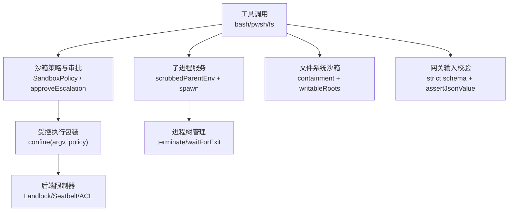
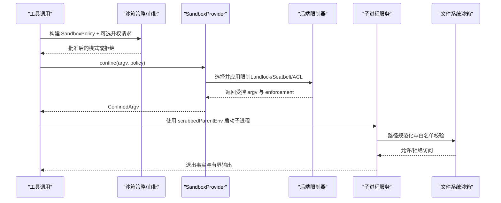
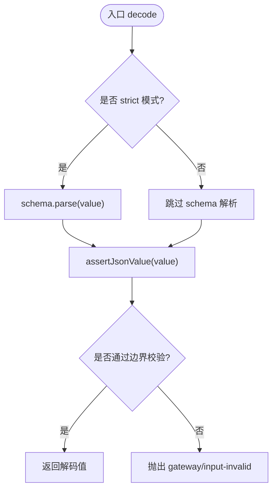
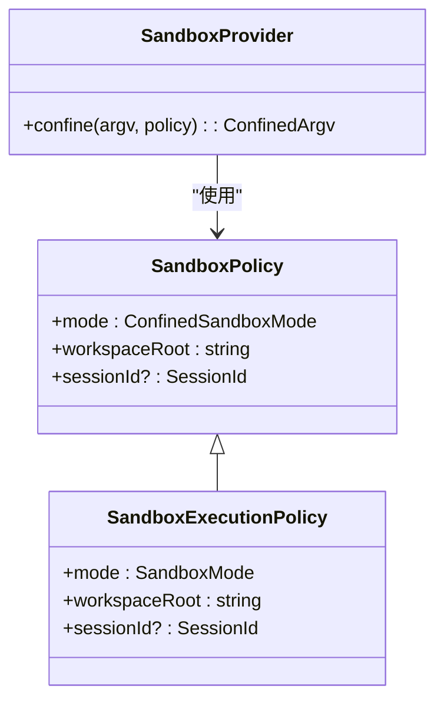
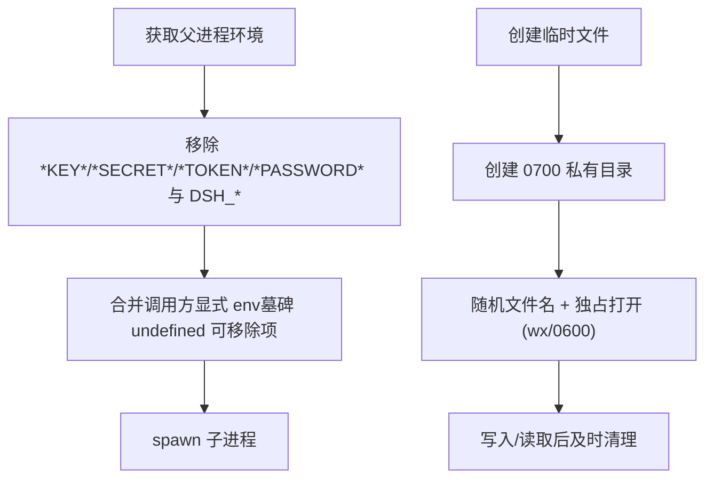
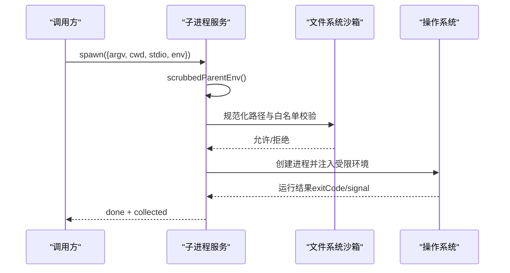
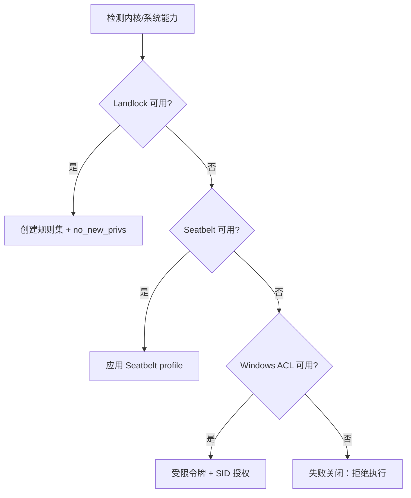
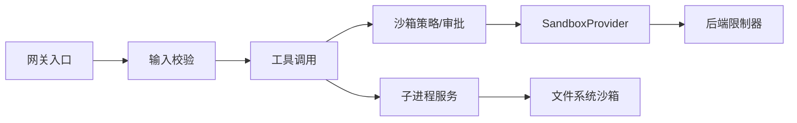

# 安全编码实践

<cite>
**本文引用的文件**
- [SAFETY.md](file://SAFETY.md)
- [SAFETY.zh.md](file://SAFETY.zh.md)
- [defensive-patterns.md](file://docs/defensive-patterns.md)
- [defensive-patterns.zh.md](file://docs/defensive-patterns.zh.md)
- [packages/sandbox/sandbox/src/index.ts](file://packages/sandbox/sandbox/src/index.ts)
- [packages/sandbox/sandbox/src/roots.ts](file://packages/sandbox/sandbox/src/roots.ts)
- [packages/fs/tool-fs/src/sandbox.ts](file://packages/fs/tool-fs/src/sandbox.ts)
- [packages/shell/pwsh-sandbox/tests/tools.spec.ts](file://packages/shell/pwsh-sandbox/tests/tools.spec.ts)
- [packages/sandbox/sandbox-policy/tests/invariant.spec.ts](file://packages/sandbox/sandbox-policy/tests/invariant.spec.ts)
- [packages/experimental/webworker-runtime/src/shell/process/landlock.ts](file://packages/experimental/webworker-runtime/src/shell/process/landlock.ts)
- [native/landlock-run/packages/entry/src/main.c](file://native/landlock-run/packages/entry/src/main.c)
- [packages/subprocess/subprocess/README.zh.md](file://packages/subprocess/subprocess/README.zh.md)
- [packages/subprocess/subprocess/tests/service.spec.ts](file://packages/subprocess/subprocess/tests/service.spec.ts)
- [packages/spill/spill-local/src/cleanup.ts](file://packages/spill/spill-local/src/cleanup.ts)
- [packages/fs/fs-sandbox/src/containment.ts](file://packages/fs/fs-sandbox/src/containment.ts)
- [packages/api/gateway/src/index.ts](file://packages/api/gateway/src/index.ts)
</cite>

## 目录
1. [简介](#简介)
2. [项目结构](#项目结构)
3. [核心组件](#核心组件)
4. [架构总览](#架构总览)
5. [详细组件分析](#详细组件分析)
6. [依赖关系分析](#依赖关系分析)
7. [性能与安全权衡](#性能与安全权衡)
8. [故障排查指南](#故障排查指南)
9. [结论](#结论)
10. [附录：漏洞示例与防护清单](#附录：漏洞示例与防护清单)

## 简介
本指南面向在 DeepSeek Harness 中编写安全代码的开发者，聚焦输入验证、权限检查、敏感信息保护、子进程执行隔离与文件系统访问控制等关键领域。仓库提供了沙箱策略、审批升权、Landlock/Seatbelt/ACL 等系统级限制、环境变量清洗、临时文件安全以及网关输入校验等多层防护。本文以“最小权限”和“失败关闭”为核心原则，结合仓库中的实现与测试用例，给出可操作的实践建议与可视化流程。

## 项目结构
围绕安全的关键位置包括：
- 沙箱抽象与策略：定义模式、执行策略、升权词汇与拒绝标记
- 文件系统沙箱：路径规范化、白名单根目录、符号链接与跨平台差异处理
- 子进程服务：环境清洗、进程树终止、输出有界捕获
- 运行时内核限制：Linux Landlock、macOS Seatbelt、Windows ACL 受限令牌
- 网关输入校验：严格模式解析与循环引用检测
- 防御性模式文档：环境变量清理、临时文件安全、符号链接删除规范

图表来源
- [packages/sandbox/sandbox/src/index.ts:158-176](file://packages/sandbox/sandbox/src/index.ts#L158-L176)
- [packages/fs/tool-fs/src/sandbox.ts:95-108](file://packages/fs/tool-fs/src/sandbox.ts#L95-L108)
- [packages/experimental/webworker-runtime/src/shell/process/landlock.ts:87-125](file://packages/experimental/webworker-runtime/src/shell/process/landlock.ts#L87-L125)
- [packages/subprocess/subprocess/README.zh.md:71-77](file://packages/subprocess/subprocess/README.zh.md#L71-L77)
- [packages/api/gateway/src/index.ts:1140-1162](file://packages/api/gateway/src/index.ts#L1140-L1162)

章节来源
- [packages/sandbox/sandbox/src/index.ts:1-179](file://packages/sandbox/sandbox/src/index.ts#L1-L179)
- [packages/fs/tool-fs/src/sandbox.ts:95-108](file://packages/fs/tool-fs/src/sandbox.ts#L95-L108)
- [packages/experimental/webworker-runtime/src/shell/process/landlock.ts:87-125](file://packages/experimental/webworker-runtime/src/shell/process/landlock.ts#L87-L125)
- [packages/subprocess/subprocess/README.zh.md:1-157](file://packages/subprocess/subprocess/README.zh.md#L1-L157)
- [packages/api/gateway/src/index.ts:1134-1162](file://packages/api/gateway/src/index.ts#L1134-L1162)

## 核心组件
- 沙箱抽象与策略
  - 提供统一的进程限制接口 confine(argv, policy)，返回受控 argv 与强制执行完整性
  - 支持 read-only、workspace-write、danger-full-access 三种模式；非危险模式为受限模式
  - 通过 approveEscalation 进行审批式升权，拒绝非加宽请求并绑定错误提示
- 文件系统白名单与根路径规范化
  - writableRoots 根据策略生成可写根集合；canonicalPath 使用原生 realpath 避免别名绕过
- 子进程服务与环境清洗
  - 启动前对父进程环境进行清洗，移除凭据形状与 DSH_* 命名空间变量
  - 提供进程树终止、有界输出收集与终端会话管理
- 内核/系统限制
  - Linux Landlock：按 ABI 协商能力集，设置 no_new_privs，失败即关闭
  - macOS Seatbelt：基于 profile 的文件与进程限制
  - Windows ACL：受限令牌与 SID 授权，spawn 时应用最小权限
- 网关输入校验
  - strict 模式解析 schema，随后进行边界校验与循环引用检测，防止畸形输入进入下游

章节来源
- [packages/sandbox/sandbox/src/index.ts:23-72](file://packages/sandbox/sandbox/src/index.ts#L23-L72)
- [packages/sandbox/sandbox/src/index.ts:158-176](file://packages/sandbox/sandbox/src/index.ts#L158-L176)
- [packages/sandbox/sandbox/src/roots.ts:16-55](file://packages/sandbox/sandbox/src/roots.ts#L16-L55)
- [packages/subprocess/subprocess/README.zh.md:71-77](file://packages/subprocess/subprocess/README.zh.md#L71-L77)
- [native/landlock-run/packages/entry/src/main.c:220-242](file://native/landlock-run/packages/entry/src/main.c#L220-L242)
- [packages/api/gateway/src/index.ts:1140-1162](file://packages/api/gateway/src/index.ts#L1140-L1162)

## 架构总览
下图展示了从工具调用到内核限制的完整链路，强调“策略随调用传递”和“失败关闭”的设计。

图表来源
- [packages/sandbox/sandbox/src/index.ts:158-176](file://packages/sandbox/sandbox/src/index.ts#L158-L176)
- [packages/experimental/webworker-runtime/src/shell/process/landlock.ts:87-125](file://packages/experimental/webworker-runtime/src/shell/process/landlock.ts#L87-L125)
- [packages/subprocess/subprocess/README.zh.md:71-77](file://packages/subprocess/subprocess/README.zh.md#L71-L77)
- [packages/fs/fs-sandbox/src/containment.ts:1-44](file://packages/fs/fs-sandbox/src/containment.ts#L1-L44)

## 详细组件分析

### 输入验证与边界检查
- 网关层采用 strict 模式解析参数，随后进行值断言与循环引用检测，确保不可信输入不会破坏内部状态
- 对缺失字段、多余字段与非法类型统一抛出结构化错误，便于上游区分并降级

图表来源
- [packages/api/gateway/src/index.ts:1140-1162](file://packages/api/gateway/src/index.ts#L1140-L1162)

章节来源
- [packages/api/gateway/src/index.ts:1134-1162](file://packages/api/gateway/src/index.ts#L1134-L1162)

### 权限检查与最小权限
- 沙箱策略按调用携带，消费方显式决定默认与解析；两个消费方可同时使用不同策略
- 审批式升权仅允许“更宽”的模式变更，非加宽请求直接拒绝且不触发人类审批
- 工具描述与 schema 暴露受限模式契约，确保调用方能感知约束

图表来源
- [packages/sandbox/sandbox/src/index.ts:23-72](file://packages/sandbox/sandbox/src/index.ts#L23-L72)
- [packages/sandbox/sandbox/src/index.ts:158-176](file://packages/sandbox/sandbox/src/index.ts#L158-L176)

章节来源
- [packages/sandbox/sandbox/src/index.ts:23-72](file://packages/sandbox/sandbox/src/index.ts#L23-L72)
- [packages/fs/tool-fs/src/sandbox.ts:95-108](file://packages/fs/tool-fs/src/sandbox.ts#L95-L108)
- [packages/shell/pwsh-sandbox/tests/tools.spec.ts:599-645](file://packages/shell/pwsh-sandbox/tests/tools.spec.ts#L599-L645)
- [packages/sandbox/sandbox-policy/tests/invariant.spec.ts:36-53](file://packages/sandbox/sandbox-policy/tests/invariant.spec.ts#L36-L53)

### 敏感信息保护
- 环境变量清洗：子进程启动前移除凭据形状与 DSH_* 命名空间变量，保留 PATH 等必要项
- 临时文件安全：私有目录（0700）、随机文件名、独占打开（'wx'、0o600），避免符号链接竞态与信息泄露
- 路径遍历防护：规范化路径、拒绝未知根、校验祖先权限与可信目录

图表来源
- [packages/subprocess/subprocess/README.zh.md:71-77](file://packages/subprocess/subprocess/README.zh.md#L71-L77)
- [docs/defensive-patterns.zh.md:29-33](file://docs/defensive-patterns.zh.md#L29-L33)
- [packages/spill/spill-local/src/cleanup.ts:98-156](file://packages/spill/spill-local/src/cleanup.ts#L98-L156)

章节来源
- [packages/subprocess/subprocess/tests/service.spec.ts:78-100](file://packages/subprocess/subprocess/tests/service.spec.ts#L78-L100)
- [docs/defensive-patterns.md:27-33](file://docs/defensive-patterns.md#L27-L33)
- [docs/defensive-patterns.zh.md:29-33](file://docs/defensive-patterns.zh.md#L29-L33)
- [packages/spill/spill-local/src/cleanup.ts:98-156](file://packages/spill/spill-local/src/cleanup.ts#L98-L156)

### 子进程执行的安全模式
- 环境隔离：scrubbedParentEnv 保证不泄漏凭据；显式 env 在清洗后合并
- 文件系统访问控制：通过 writableRoots 与 containment 限制读写范围；规范化路径避免别名绕过
- 网络限制：沙箱模式词汇不包含网络可见性，需由上层策略或后端限制器配合
- 进程树管理：terminate 升级 SIGTERM→SIGKILL，waitForExit 等待整棵进程树退出

图表来源
- [packages/subprocess/subprocess/README.zh.md:71-77](file://packages/subprocess/subprocess/README.zh.md#L71-L77)
- [packages/fs/fs-sandbox/src/containment.ts:1-44](file://packages/fs/fs-sandbox/src/containment.ts#L1-L44)

章节来源
- [packages/subprocess/subprocess/README.zh.md:1-157](file://packages/subprocess/subprocess/README.zh.md#L1-L157)
- [packages/fs/fs-sandbox/src/containment.ts:1-44](file://packages/fs/fs-sandbox/src/containment.ts#L1-L44)

### 内核/系统级限制
- Linux Landlock：按可用 ABI 创建规则集，设置 no_new_privs，失败即关闭，避免无限制执行
- macOS Seatbelt：基于 profile 限制文件与进程能力
- Windows ACL：受限令牌与 SID 授权，spawn 时应用最小权限，继承 stdio 时放入 kill-on-close job

图表来源
- [native/landlock-run/packages/entry/src/main.c:220-242](file://native/landlock-run/packages/entry/src/main.c#L220-L242)

章节来源
- [native/landlock-run/packages/entry/src/main.c:220-242](file://native/landlock-run/packages/entry/src/main.c#L220-L242)

## 依赖关系分析
- 工具层（bash/pwsh/fs）依赖沙箱策略与审批机制，确保每次调用都携带明确策略
- 沙箱提供者依赖后端限制器（Landlock/Seatbelt/ACL）完成实际限制
- 子进程服务与文件系统沙箱共同保障进程与文件的最小权限
- 网关输入校验位于入口层，过滤不可信输入，降低下游风险

图表来源
- [packages/sandbox/sandbox/src/index.ts:158-176](file://packages/sandbox/sandbox/src/index.ts#L158-L176)
- [packages/api/gateway/src/index.ts:1140-1162](file://packages/api/gateway/src/index.ts#L1140-L1162)
- [packages/subprocess/subprocess/README.zh.md:71-77](file://packages/subprocess/subprocess/README.zh.md#L71-L77)
- [packages/fs/fs-sandbox/src/containment.ts:1-44](file://packages/fs/fs-sandbox/src/containment.ts#L1-L44)

章节来源
- [packages/sandbox/sandbox/src/index.ts:158-176](file://packages/sandbox/sandbox/src/index.ts#L158-L176)
- [packages/api/gateway/src/index.ts:1140-1162](file://packages/api/gateway/src/index.ts#L1140-L1162)
- [packages/subprocess/subprocess/README.zh.md:71-77](file://packages/subprocess/subprocess/README.zh.md#L71-L77)
- [packages/fs/fs-sandbox/src/containment.ts:1-44](file://packages/fs/fs-sandbox/src/containment.ts#L1-L44)

## 性能与安全权衡
- 严格输入校验会增加序列化与解析开销，但能显著降低恶意输入导致的崩溃与越权风险
- 沙箱与内核限制带来额外启动与上下文切换成本，但换来更强的隔离与失败关闭保障
- 临时文件与 spill 文件的权限检查与路径规范化可能增加 I/O 次数，但能有效防止竞态与泄露
- 建议在高频路径上缓存必要的只读资源（如白名单根），避免重复解析

[本节为通用指导，无需具体文件来源]

## 故障排查指南
- 沙箱不可用：当后端不可用时，confine 会失败关闭并抛出特定错误码，应回退到更高权限策略或提示安装所需组件
- 审批被拒：非加宽升权请求会被拒绝且不触发人类审批；检查请求模式与当前有效模式的关系
- 路径访问被拒：确认路径已规范化且属于 writableRoots；检查祖先目录权限与可信目录判定
- 子进程输出异常：检查 stdio 配置与有界收集上限；必要时启用 spill 恢复
- 网关输入无效：查看结构化错误中的 field 与 cause，定位 schema 不匹配或循环引用

章节来源
- [packages/sandbox/sandbox/src/index.ts:118-144](file://packages/sandbox/sandbox/src/index.ts#L118-L144)
- [packages/shell/pwsh-sandbox/tests/tools.spec.ts:599-645](file://packages/shell/pwsh-sandbox/tests/tools.spec.ts#L599-L645)
- [packages/spill/spill-local/src/cleanup.ts:98-156](file://packages/spill/spill-local/src/cleanup.ts#L98-L156)
- [packages/api/gateway/src/index.ts:1140-1162](file://packages/api/gateway/src/index.ts#L1140-L1162)

## 结论
本项目通过“策略随调用传递”“失败关闭”“最小权限”三大原则，构建了从输入校验、权限审批、环境清洗到内核限制的纵深防御体系。开发时应始终将不可信输入视为威胁源，显式声明并校验所有边界；在执行任何外部操作前，先评估是否需要升权并走审批流程；对文件与进程资源采取最严格的访问控制，并在失败时立即停止而非静默放行。

[本节为总结，无需具体文件来源]

## 附录：漏洞示例与防护清单
- 漏洞示例
  - 凭据泄露：未清洗的环境变量导致密钥出现在命令输出或 spill 文件中
  - 路径遍历：未规范化路径导致写入目标目录外
  - 符号链接竞态：可预测路径与全局可读目录导致竞争条件
  - 非加宽升权：绕过审批直接提升权限
  - 畸形输入：循环引用或超深嵌套导致栈溢出或内存耗尽
- 防护措施
  - 对所有输入进行 schema 解析与边界校验，拒绝循环引用
  - 子进程启动前清洗环境变量，仅保留必要项
  - 使用 canonicalPath 与 writableRoots 限制文件系统访问
  - 审批式升权仅允许更宽模式，非加宽请求直接拒绝
  - 临时文件使用私有目录与随机文件名，并以独占方式打开
  - 内核限制失败时立即关闭，绝不静默放行

章节来源
- [docs/defensive-patterns.md:27-33](file://docs/defensive-patterns.md#L27-L33)
- [docs/defensive-patterns.zh.md:29-33](file://docs/defensive-patterns.zh.md#L29-L33)
- [packages/sandbox/sandbox/src/roots.ts:16-55](file://packages/sandbox/sandbox/src/roots.ts#L16-L55)
- [packages/shell/pwsh-sandbox/tests/tools.spec.ts:599-645](file://packages/shell/pwsh-sandbox/tests/tools.spec.ts#L599-L645)
- [packages/api/gateway/src/index.ts:1140-1162](file://packages/api/gateway/src/index.ts#L1140-L1162)
- [packages/subprocess/subprocess/README.zh.md:71-77](file://packages/subprocess/subprocess/README.zh.md#L71-L77)