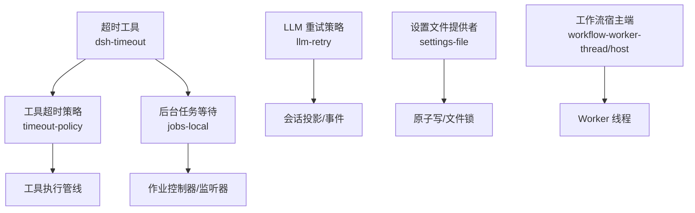
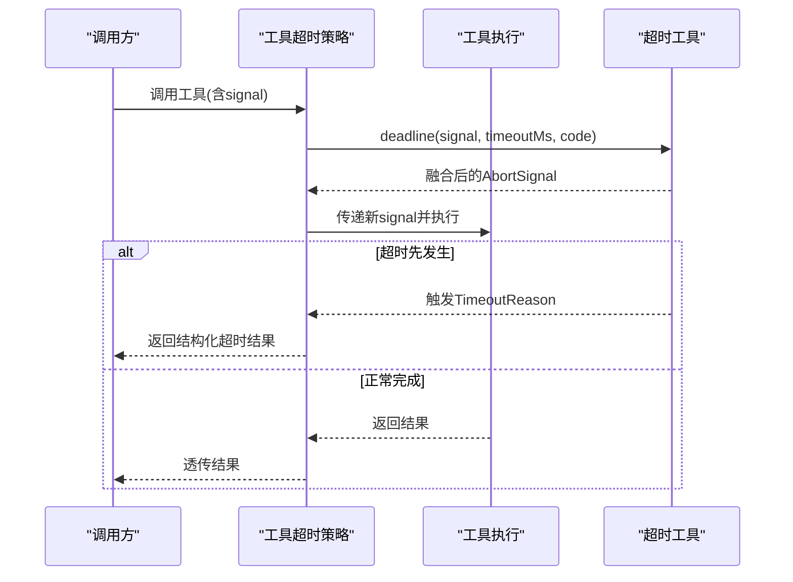
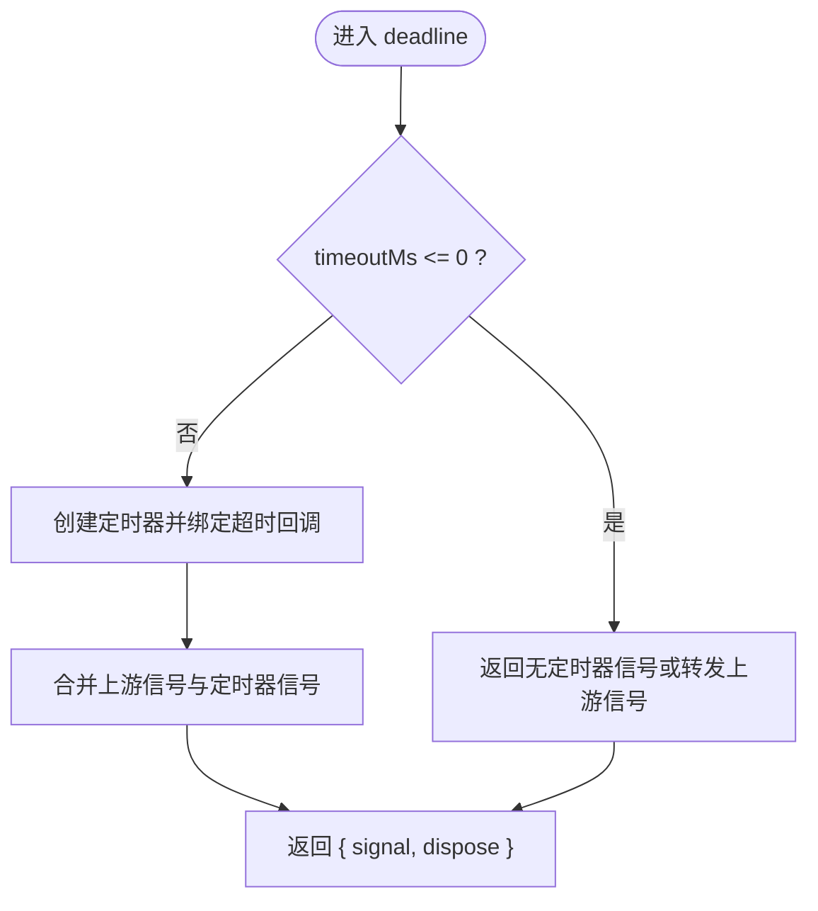
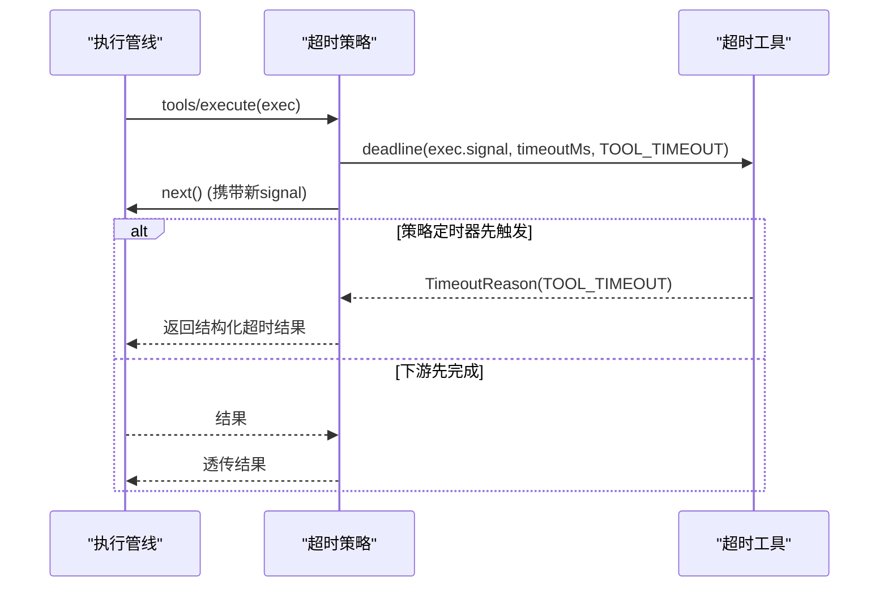
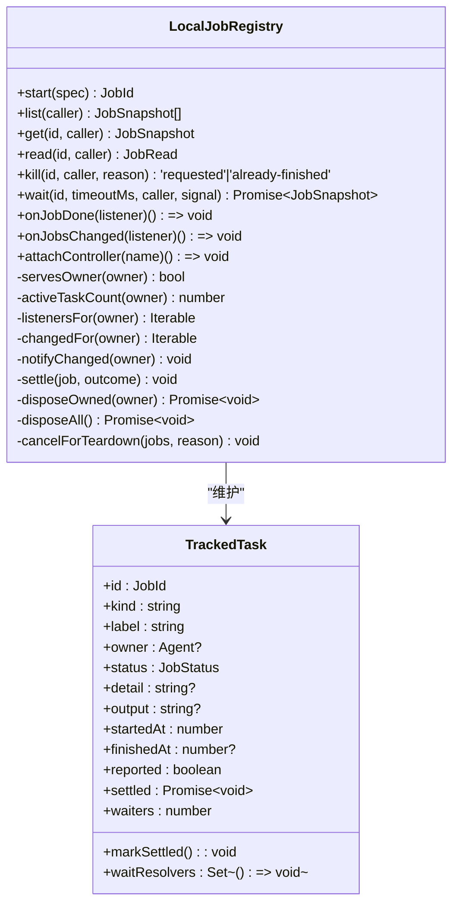
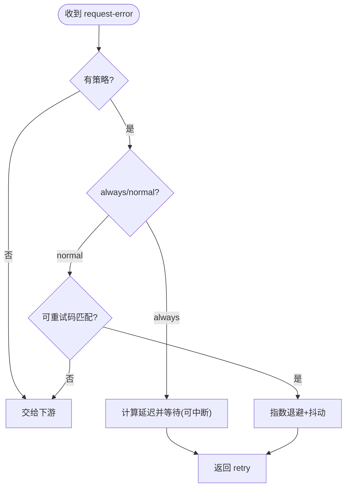
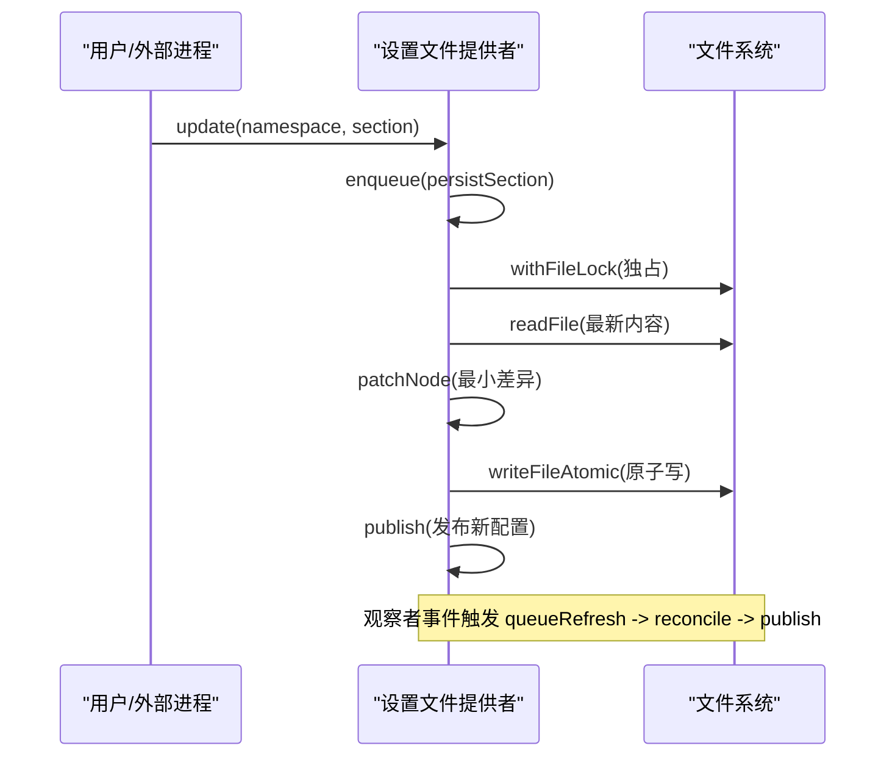
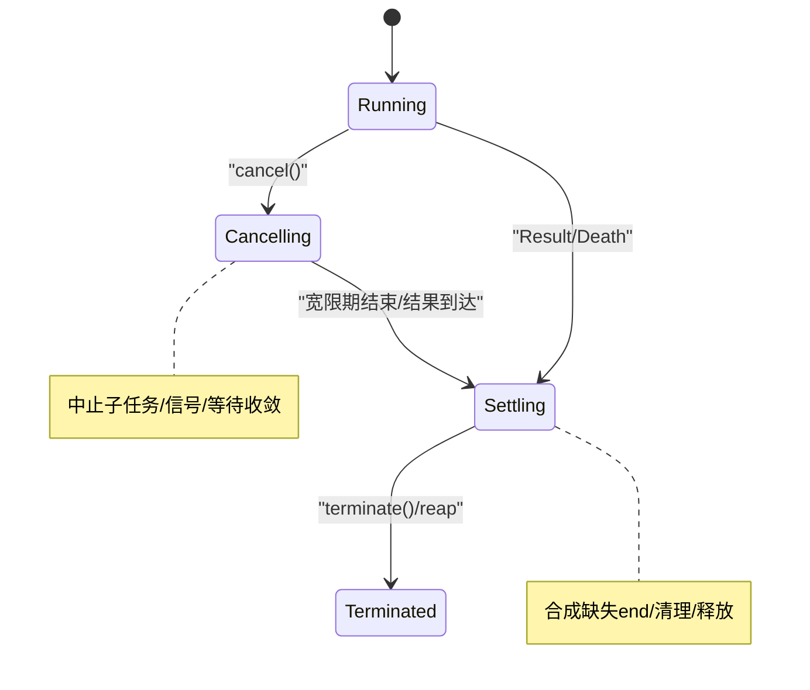
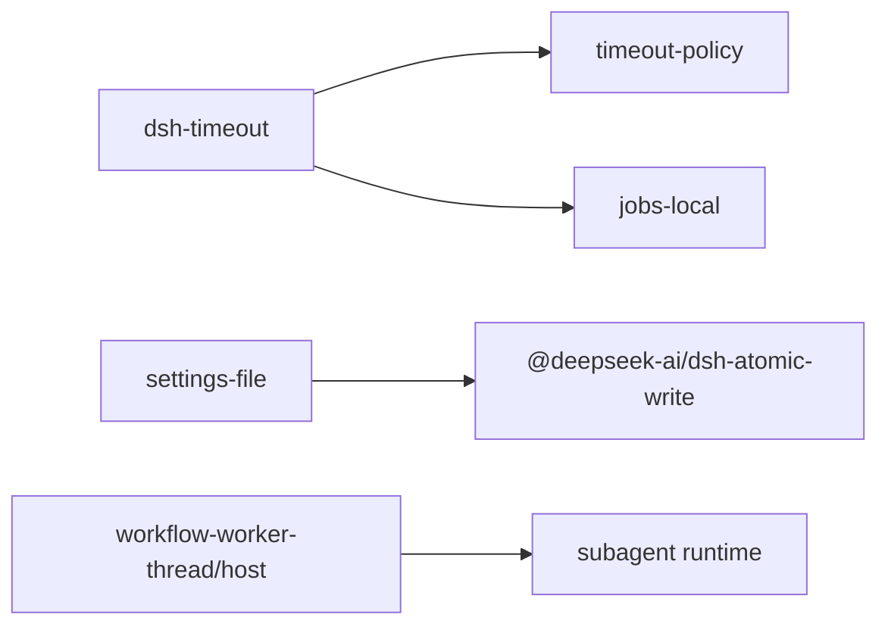

# 并发编程安全

<cite>
**本文引用的文件**
- [packages/util/timeout/src/index.ts](file://packages/util/timeout/src/index.ts)
- [packages/guard/timeout-policy/src/index.ts](file://packages/guard/timeout-policy/src/index.ts)
- [packages/jobs/jobs-local/src/index.ts](file://packages/jobs/jobs-local/src/index.ts)
- [packages/llm/llm-retry/src/index.ts](file://packages/llm/llm-retry/src/index.ts)
- [packages/settings/settings-file/src/index.ts](file://packages/settings/settings-file/src/index.ts)
- [packages/workflow/workflow-worker-thread/src/host.ts](file://packages/workflow/workflow-worker-thread/src/host.ts)
</cite>

## 目录
1. [简介](#简介)
2. [项目结构](#项目结构)
3. [核心组件](#核心组件)
4. [架构总览](#架构总览)
5. [详细组件分析](#详细组件分析)
6. [依赖关系分析](#依赖关系分析)
7. [性能考虑](#性能考虑)
8. [故障排查指南](#故障排查指南)
9. [结论](#结论)
10. [附录](#附录)

## 简介
本指南围绕并发编程安全，结合代码库中的超时与中止、后台任务管理、重试策略、跨进程资源管理与优雅降级等实践，系统阐述：
- 锁机制的正确使用模式（互斥、读写、条件变量）在本仓库中的体现与替代方案
- 超时处理与死锁/饥饿避免策略
- 在压力下的优雅降级与故障转移
- 并发资源的创建与销毁生命周期管理
- 常见陷阱与可复用的实现模式

## 项目结构
仓库中并发相关能力分布在多个包中，形成“通用超时工具 + 业务域策略 + 资源编排”的分层结构：
- 通用超时与中止信号：@deepseek-ai/dsh-timeout
- 工具调用超时策略：@deepseek-ai/dsh-tool-call-timeout-policy
- 后台任务注册表（本地内存实现）：@deepseek-ai/dsh-jobs-local
- LLM 请求重试策略：@deepseek-ai/dsh-llm-retry
- 设置文件的跨进程写入锁与热更新：@deepseek-ai/dsh-settings-file
- 工作流 Worker 线程的宿主端：@deepseek-ai/dsh-workflow-worker-thread/host

图表来源
- [packages/util/timeout/src/index.ts:1-191](file://packages/util/timeout/src/index.ts#L1-L191)
- [packages/guard/timeout-policy/src/index.ts:1-82](file://packages/guard/timeout-policy/src/index.ts#L1-L82)
- [packages/jobs/jobs-local/src/index.ts:1-535](file://packages/jobs/jobs-local/src/index.ts#L1-L535)
- [packages/llm/llm-retry/src/index.ts:1-260](file://packages/llm/llm-retry/src/index.ts#L1-L260)
- [packages/settings/settings-file/src/index.ts:1-372](file://packages/settings/settings-file/src/index.ts#L1-L372)
- [packages/workflow/workflow-worker-thread/src/host.ts:1-626](file://packages/workflow/workflow-worker-thread/src/host.ts#L1-L626)

章节来源
- [packages/util/timeout/src/index.ts:1-191](file://packages/util/timeout/src/index.ts#L1-L191)
- [packages/guard/timeout-policy/src/index.ts:1-82](file://packages/guard/timeout-policy/src/index.ts#L1-L82)
- [packages/jobs/jobs-local/src/index.ts:1-535](file://packages/jobs/jobs-local/src/index.ts#L1-L535)
- [packages/llm/llm-retry/src/index.ts:1-260](file://packages/llm/llm-retry/src/index.ts#L1-L260)
- [packages/settings/settings-file/src/index.ts:1-372](file://packages/settings/settings-file/src/index.ts#L1-L372)
- [packages/workflow/workflow-worker-thread/src/host.ts:1-626](file://packages/workflow/workflow-worker-thread/src/host.ts#L1-L626)

## 核心组件
- 超时与中止信号
  - 提供 deadline/idleWatchdog/TimeoutReason/timeoutOf/clampTimeout 等原语，统一通过 AbortSignal 表达取消与超时，支持嵌套范围区分。
- 工具调用超时策略
  - 包装工具执行，注入带范围的超时信号，并在超时发生时以结构化错误返回，避免误判上层取消。
- 后台任务注册表（本地）
  - 维护作业状态、按所有者限流、wait 支持超时与中止、首次结算优先、通知隔离与清理。
- LLM 重试策略
  - 基于退避与抖动，支持 always/normal 模式，持久化重试计数，受上游中止控制。
- 设置文件提供者
  - 跨进程写入原子性、文件锁、观察者去抖、只读缓存与最小差异渲染，保证并发安全与一致性。
- 工作流宿主端
  - 管理 Worker 生命周期、子任务启停、终止宽限期、消息投递容错与最终一致性。

章节来源
- [packages/util/timeout/src/index.ts:1-191](file://packages/util/timeout/src/index.ts#L1-L191)
- [packages/guard/timeout-policy/src/index.ts:1-82](file://packages/guard/timeout-policy/src/index.ts#L1-L82)
- [packages/jobs/jobs-local/src/index.ts:1-535](file://packages/jobs/jobs-local/src/index.ts#L1-L535)
- [packages/llm/llm-retry/src/index.ts:1-260](file://packages/llm/llm-retry/src/index.ts#L1-L260)
- [packages/settings/settings-file/src/index.ts:1-372](file://packages/settings/settings-file/src/index.ts#L1-L372)
- [packages/workflow/workflow-worker-thread/src/host.ts:1-626](file://packages/workflow/workflow-worker-thread/src/host.ts#L1-L626)

## 架构总览
下图展示从“调用方”到“具体实现”的并发安全路径：超时信号贯穿各层；后台任务与重试策略作为横切关注点；文件与线程级资源由各自模块负责。

图表来源
- [packages/guard/timeout-policy/src/index.ts:55-81](file://packages/guard/timeout-policy/src/index.ts#L55-L81)
- [packages/util/timeout/src/index.ts:91-113](file://packages/util/timeout/src/index.ts#L91-L113)

## 详细组件分析

### 组件A：超时与中止信号（deadline / idleWatchdog / timeoutOf）
- 设计要点
  - 所有超时通过 AbortSignal 传播，不直接停止外部工作，仅做通知。
  - deadline 将上游取消与一次性定时器融合，支持 Symbol.dispose 清理定时器。
  - idleWatchdog 为异步迭代器的“空闲超时”，仅在 next 挂起时计时，支持 pulse 重武装。
  - timeoutOf 可按 code 区分不同层的超时原因，避免外层取消被误判为内层超时。
- 复杂度与性能
  - 时间 O(1)，空间 O(1)；定时器与信号均为轻量对象。
- 错误处理
  - 参数校验失败抛出明确错误；非正数超时视为无定时器。
- 优化建议
  - 复用 AbortController 与信号合并，减少重复创建。

图表来源
- [packages/util/timeout/src/index.ts:91-113](file://packages/util/timeout/src/index.ts#L91-L113)

章节来源
- [packages/util/timeout/src/index.ts:1-191](file://packages/util/timeout/src/index.ts#L1-L191)

### 组件B：工具调用超时策略（TOOL_TIMEOUT）
- 行为
  - 读取工具声明的超时预算，构造 deadline 并替换 exec.signal。
  - 若该策略的定时器先触发，则用结构化错误替换结果，否则透传下游结果。
  - finally 恢复原始信号，避免后续监听器看到内部超时信号。
- 并发安全
  - 通过 scoped code 区分内外层超时，避免误判。
- 降级与故障转移
  - 对模型可见的错误进行结构化，便于上层重试/沙箱策略路由。

图表来源
- [packages/guard/timeout-policy/src/index.ts:55-81](file://packages/guard/timeout-policy/src/index.ts#L55-L81)
- [packages/util/timeout/src/index.ts:91-113](file://packages/util/timeout/src/index.ts#L91-L113)

章节来源
- [packages/guard/timeout-policy/src/index.ts:1-82](file://packages/guard/timeout-policy/src/index.ts#L1-L82)

### 组件C：后台任务注册表（LocalJobRegistry）
- 关键语义
  - start 前检查所有者是否可用，按 owner 维度限制并发数量。
  - wait 支持超时与中止，使用 deadline 区分“等待超时”和“调用者取消”。
  - settle 采用“首次结算优先”，释放等待者后通知变更，再广播完成。
  - 清理阶段强制失败以避免死锁，并保证观测者看到最终状态。
- 数据结构
  - TrackedTask：记录作业元数据、状态、输出、等待者与结算 Promise。
- 并发控制
  - 通过计数器与 Map 维护活跃任务；监听器按作用域分层隔离。

图表来源
- [packages/jobs/jobs-local/src/index.ts:91-535](file://packages/jobs/jobs-local/src/index.ts#L91-L535)

章节来源
- [packages/jobs/jobs-local/src/index.ts:1-535](file://packages/jobs/jobs-local/src/index.ts#L1-L535)

### 组件D：LLM 请求重试策略
- 策略模式
  - always：无条件重试直到下游决策允许；normal：按可重试码与最大次数限制。
  - 指数退避 + 抖动，支持 provider 提供的 Retry-After。
- 并发与生命周期
  - 使用 AbortSignal.any 融合插件生命周期与调用方中止；active 集合追踪进行中操作。
  - 会话投影持久化重试计数，避免重启丢失。
- 错误与降级
  - 下游异常被捕获并记录；always 模式下忽略下游恢复失败并继续重试。

图表来源
- [packages/llm/llm-retry/src/index.ts:149-241](file://packages/llm/llm-retry/src/index.ts#L149-L241)

章节来源
- [packages/llm/llm-retry/src/index.ts:1-260](file://packages/llm/llm-retry/src/index.ts#L1-L260)

### 组件E：设置文件提供者（跨进程写入锁与热更新）
- 并发安全
  - 使用 withFileLock 确保跨进程独占写；writeFileAtomic 原子落盘。
  - 单队列 operations 串行化 watcher 重载与写入，避免脏读/半提交。
- 一致性
  - 写入前 reconcileFromDisk 拉取最新磁盘内容，合并后再渲染，防止覆盖外部编辑。
- 可用性
  - 观察器去抖；解析失败保留上一份有效文档；关闭时静默收尾。

图表来源
- [packages/settings/settings-file/src/index.ts:185-231](file://packages/settings/settings-file/src/index.ts#L185-L231)
- [packages/settings/settings-file/src/index.ts:233-270](file://packages/settings/settings-file/src/index.ts#L233-L270)
- [packages/settings/settings-file/src/index.ts:305-339](file://packages/settings/settings-file/src/index.ts#L305-L339)

章节来源
- [packages/settings/settings-file/src/index.ts:1-372](file://packages/settings/settings-file/src/index.ts#L1-L372)

### 组件F：工作流宿主端（Worker 线程生命周期与优雅关停）
- 资源管理
  - 启动 Worker，订阅 message/error/exit；维护 children/pendingStarts/liveAgents。
  - cancel 发送取消并启动宽限期定时器；dispose 立即驱动子任务清理并等待收敛。
- 消息与一致性
  - postMessage 失败容忍（已关闭线程）；死亡事件作为逻辑屏障，拒绝后续创建。
  - 合成缺失的 agent-end，保证 start/end 成对。
- 优雅降级
  - 宽限期结束后强制终止 Worker，并回收子任务；结果幂等且永不拒绝。

图表来源
- [packages/workflow/workflow-worker-thread/src/host.ts:183-255](file://packages/workflow/workflow-worker-thread/src/host.ts#L183-L255)
- [packages/workflow/workflow-worker-thread/src/host.ts:489-554](file://packages/workflow/workflow-worker-thread/src/host.ts#L489-L554)

章节来源
- [packages/workflow/workflow-worker-thread/src/host.ts:1-626](file://packages/workflow/workflow-worker-thread/src/host.ts#L1-L626)

## 依赖关系分析
- 超时工具被多处消费：工具超时策略、后台任务等待、以及可能的其他能力。
- 后台任务注册表依赖超时工具用于 wait 超时与中止。
- 设置文件提供者依赖原子写与文件锁抽象，保证跨进程并发安全。
- 工作流宿主端依赖 Worker API 与子代理运行时，承担资源编排与一致性保障。

图表来源
- [packages/util/timeout/src/index.ts:1-191](file://packages/util/timeout/src/index.ts#L1-L191)
- [packages/guard/timeout-policy/src/index.ts:1-82](file://packages/guard/timeout-policy/src/index.ts#L1-L82)
- [packages/jobs/jobs-local/src/index.ts:1-535](file://packages/jobs/jobs-local/src/index.ts#L1-L535)
- [packages/settings/settings-file/src/index.ts:1-372](file://packages/settings/settings-file/src/index.ts#L1-L372)
- [packages/workflow/workflow-worker-thread/src/host.ts:1-626](file://packages/workflow/workflow-worker-thread/src/host.ts#L1-L626)

章节来源
- [packages/util/timeout/src/index.ts:1-191](file://packages/util/timeout/src/index.ts#L1-L191)
- [packages/guard/timeout-policy/src/index.ts:1-82](file://packages/guard/timeout-policy/src/index.ts#L1-L82)
- [packages/jobs/jobs-local/src/index.ts:1-535](file://packages/jobs/jobs-local/src/index.ts#L1-L535)
- [packages/settings/settings-file/src/index.ts:1-372](file://packages/settings/settings-file/src/index.ts#L1-L372)
- [packages/workflow/workflow-worker-thread/src/host.ts:1-626](file://packages/workflow/workflow-worker-thread/src/host.ts#L1-L626)

## 性能考虑
- 超时与信号
  - 使用 AbortSignal.any 合并信号，避免额外轮询；idleWatchdog 仅在 next 挂起时计时，降低开销。
- 后台任务
  - 按 owner 限流，避免热点键导致全局拥塞；wait 使用事件驱动而非忙等。
- 重试
  - 指数退避 + 抖动抑制雪崩；provider 的 Retry-After 优先，减少无效请求。
- 文件写入
  - 原子写与文件锁避免竞争；去抖合并高频事件；最小差异渲染减少 IO。
- 线程/进程
  - 宽限期 unref 定时器，避免阻塞进程退出；postMessage 失败容忍，避免阻塞主流程。

## 故障排查指南
- 超时与中止
  - 使用 timeoutOf 区分不同层的超时原因，定位是上层取消还是自身超时。
  - 检查 clampTimeout 输入是否为正有限值，避免非法参数导致未预期行为。
- 后台任务
  - wait 抛出的“等待中止”与“等待超时”需通过 timeoutOf 区分；确认 waiters 与 reported 状态。
  - 服务销毁时 cancelForTeardown 会强制失败，注意日志中的“可能孤儿”提示。
- 重试
  - 检查 session 投影中的 llmRetry 状态是否递增；确认 policy.mode 与 maxRetries。
  - 关注 always 模式下下游恢复失败的告警。
- 设置文件
  - 观察 queueRefresh 与 reconcileFromDisk 的日志；解析失败会保留上一份有效文档。
  - 跨进程冲突通过文件锁解决，关注 EBUSY/EACCES 等错误码。
- 工作流
  - 关注 worker death 与 exit 顺序；check terminalClaimed 与 workerDeathObserved 标志位。
  - 子任务未配对 end 会被合成 cancelled，检查 liveAgents 清理情况。

章节来源
- [packages/util/timeout/src/index.ts:175-191](file://packages/util/timeout/src/index.ts#L175-L191)
- [packages/jobs/jobs-local/src/index.ts:230-279](file://packages/jobs/jobs-local/src/index.ts#L230-L279)
- [packages/jobs/jobs-local/src/index.ts:507-531](file://packages/jobs/jobs-local/src/index.ts#L507-L531)
- [packages/llm/llm-retry/src/index.ts:194-241](file://packages/llm/llm-retry/src/index.ts#L194-L241)
- [packages/settings/settings-file/src/index.ts:305-339](file://packages/settings/settings-file/src/index.ts#L305-L339)
- [packages/workflow/workflow-worker-thread/src/host.ts:489-554](file://packages/workflow/workflow-worker-thread/src/host.ts#L489-L554)

## 结论
本仓库通过统一的超时与中止信号、细粒度的任务与重试策略、跨进程原子写与线程级资源编排，构建了高可靠、可观测、可回退的并发基础设施。遵循以下原则可获得最佳效果：
- 始终使用 AbortSignal 表达取消与超时，并通过 scoped code 区分层级
- 使用“首次结算优先”与“幂等清理”保证一致性与健壮性
- 通过限流、退避与去抖缓解压力，避免雪崩与饥饿
- 在资源销毁路径上强制收敛，避免死锁与泄漏

## 附录
- 常见陷阱与避免方法
  - 不要在 finally 之外持有锁或定时器；使用 Symbol.dispose 或显式清理
  - 避免在回调中再次发起同一路径的重入调用，必要时使用队列或令牌
  - 对第三方资源（文件/线程/网络）使用超时与中止，防止悬挂
  - 对共享状态采用快照/不可变视图，避免竞态
  - 对跨进程/跨线程通信增加幂等与去重，避免重复生效
- 参考实现路径
  - 超时与中止：[packages/util/timeout/src/index.ts:91-113](file://packages/util/timeout/src/index.ts#L91-L113)
  - 工具超时策略：[packages/guard/timeout-policy/src/index.ts:55-81](file://packages/guard/timeout-policy/src/index.ts#L55-L81)
  - 后台任务等待与结算：[packages/jobs/jobs-local/src/index.ts:230-279](file://packages/jobs/jobs-local/src/index.ts#L230-L279), [packages/jobs/jobs-local/src/index.ts:416-440](file://packages/jobs/jobs-local/src/index.ts#L416-L440)
  - LLM 重试：[packages/llm/llm-retry/src/index.ts:149-241](file://packages/llm/llm-retry/src/index.ts#L149-L241)
  - 设置文件原子写与热更：[packages/settings/settings-file/src/index.ts:185-231](file://packages/settings/settings-file/src/index.ts#L185-L231), [packages/settings/settings-file/src/index.ts:305-339](file://packages/settings/settings-file/src/index.ts#L305-L339)
  - 工作流宿主端关停：[packages/workflow/workflow-worker-thread/src/host.ts:183-255](file://packages/workflow/workflow-worker-thread/src/host.ts#L183-L255), [packages/workflow/workflow-worker-thread/src/host.ts:489-554](file://packages/workflow/workflow-worker-thread/src/host.ts#L489-L554)