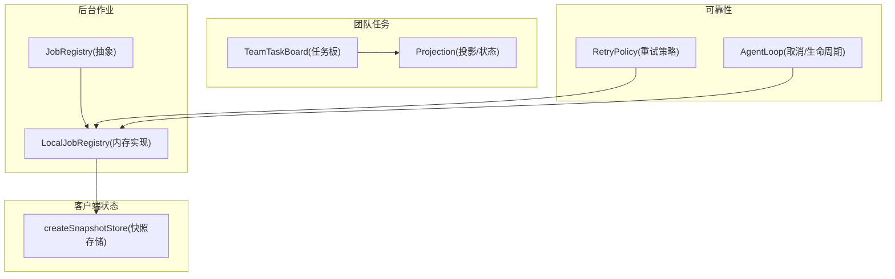
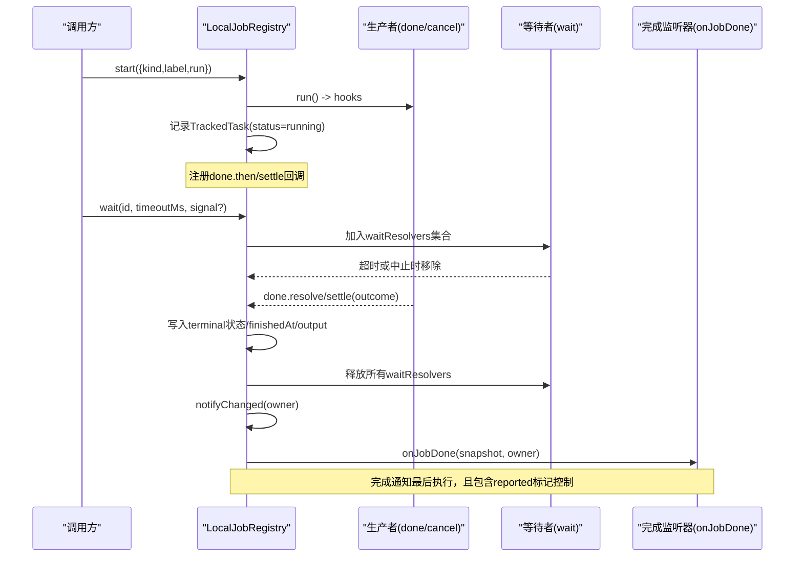
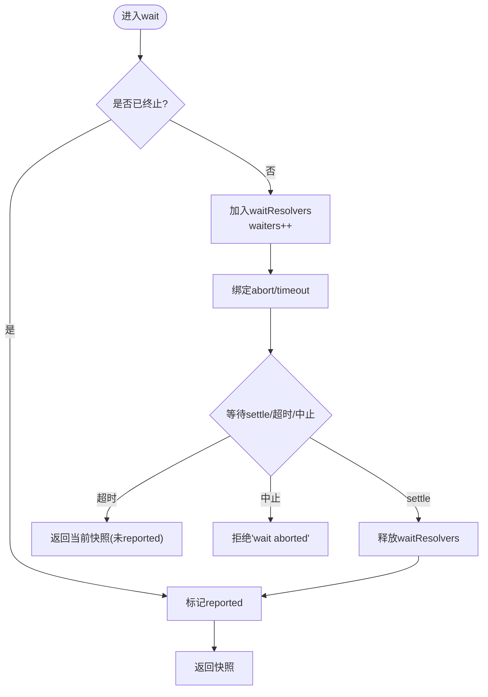
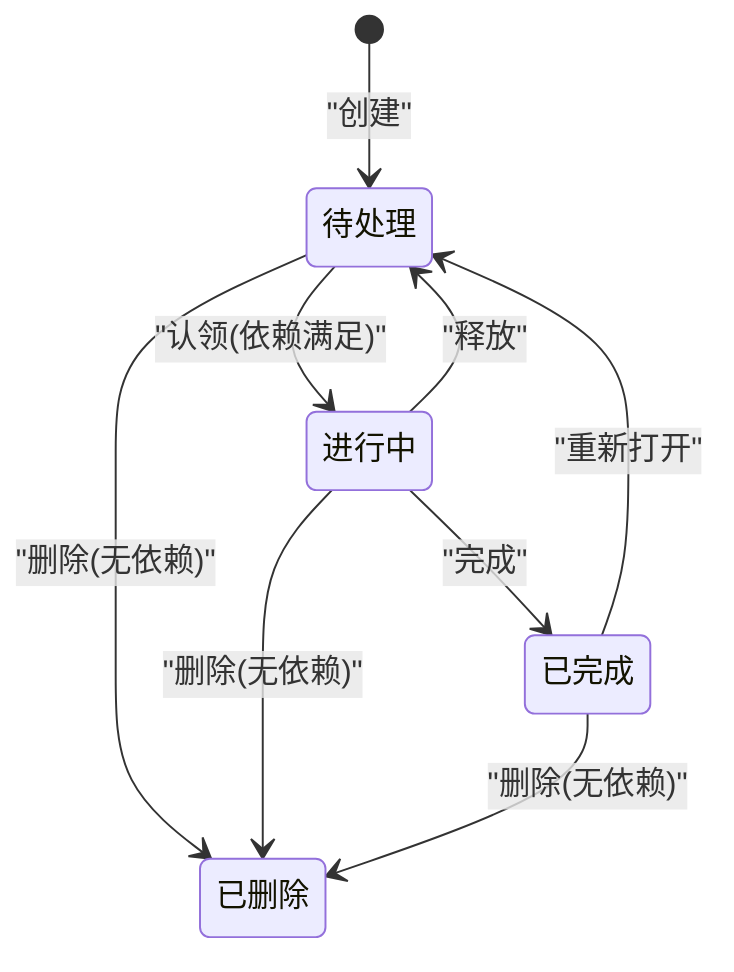
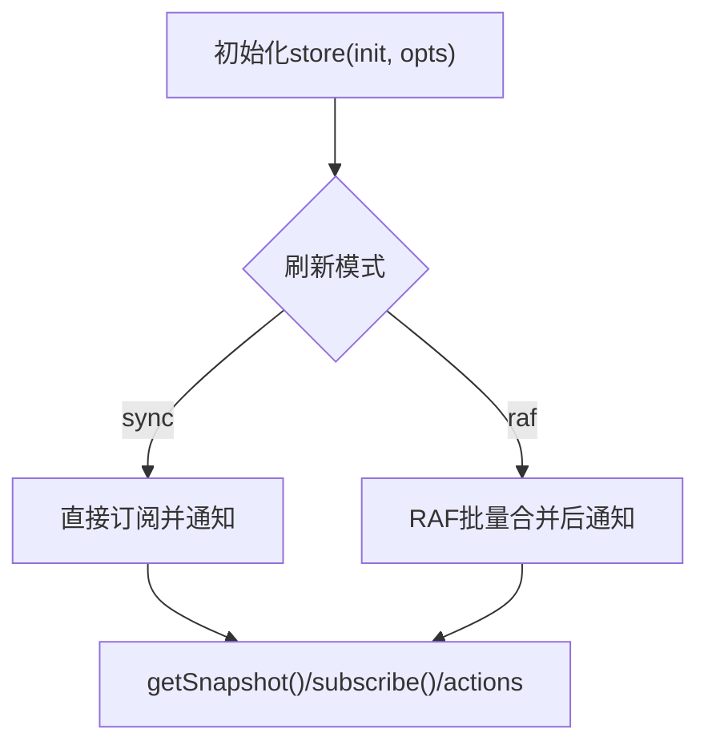
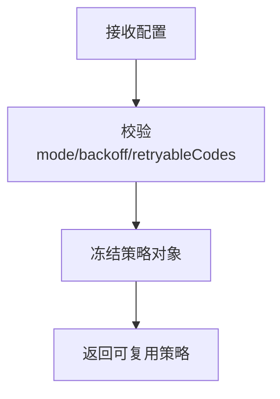
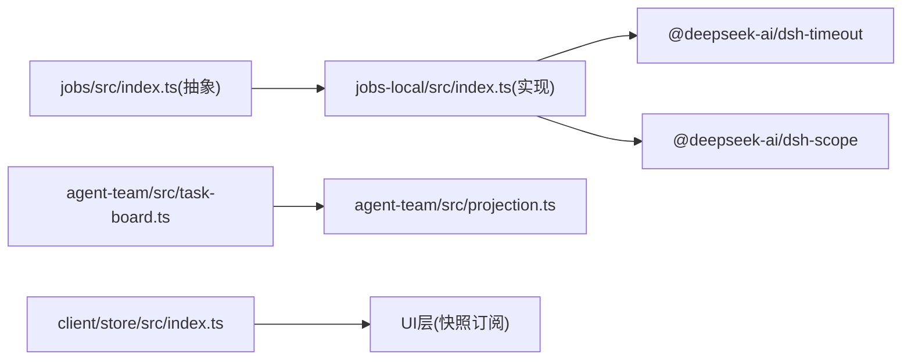

# 异步状态管理

<cite>
**本文引用的文件**
- [jobs-local/src/index.ts](file://packages/jobs/jobs-local/src/index.ts)
- [jobs/src/index.ts](file://packages/jobs/jobs/src/index.ts)
- [jobs-local/tests/jobs.spec.ts](file://packages/jobs/jobs-local/tests/jobs.spec.ts)
- [agent-team/src/task-board.ts](file://packages/experimental/agent-team/src/task-board.ts)
- [agent-team/src/projection.ts](file://packages/experimental/agent-team/src/projection.ts)
- [core/agent-loop/src/index.ts](file://packages/core/agent-loop/src/index.ts)
- [client/store/src/index.ts](file://packages/client/store/src/index.ts)
- [workflow/tests/workflow.spec.ts](file://packages/workflow/workflow/tests/workflow.spec.ts)
- [llm/retry-policy.ts](file://packages/llm/llm/src/retry-policy.ts)
</cite>

## 目录
1. [简介](#简介)
2. [项目结构](#项目结构)
3. [核心组件](#核心组件)
4. [架构总览](#架构总览)
5. [详细组件分析](#详细组件分析)
6. [依赖关系分析](#依赖关系分析)
7. [性能考量](#性能考量)
8. [故障排查指南](#故障排查指南)
9. [结论](#结论)
10. [附录](#附录)

## 简介
本指南聚焦于“异步状态管理”的正确实践：如何区分同步状态与异步结果、识别并避免竞态条件、管理任务队列与生命周期，以及安全地处理后台任务的完成时机。仓库中的后台作业系统（jobs）、团队任务板（team task board）、客户端快照存储（client store）和重试策略（retry policy）共同构成了一套可复用的异步状态管理模式。我们将以这些实现为依据，提炼出可落地的设计原则与最佳实践，并提供流程图与时序图帮助理解关键路径。

## 项目结构
围绕异步状态管理的代码主要分布在以下模块：
- 后台作业抽象与本地实现：定义作业契约、所有权隔离、结算顺序、等待与超时、变更通知等。
- 团队任务板：基于事务日志的任务图与状态转换，提供依赖校验与并发限制。
- 客户端快照存储：将状态更新合并为快照，支持同步或帧级刷新，降低抖动。
- 重试策略：对网络调用进行退避与错误分类，保证幂等与可恢复性。
- 代理循环与取消：在创建与销毁阶段统一接入取消信号，避免悬挂资源。



**图示来源**
- [jobs/src/index.ts:35-61](file://packages/jobs/jobs/src/index.ts#L35-L61)
- [jobs-local/src/index.ts:91-129](file://packages/jobs/jobs-local/src/index.ts#L91-L129)
- [agent-team/src/task-board.ts:31-73](file://packages/experimental/agent-team/src/task-board.ts#L31-L73)
- [client/store/src/index.ts:90-122](file://packages/client/store/src/index.ts#L90-L122)
- [llm/retry-policy.ts:143-160](file://packages/llm/llm/src/retry-policy.ts#L143-L160)
- [core/agent-loop/src/index.ts:552-565](file://packages/core/agent-loop/src/index.ts#L552-L565)

**章节来源**
- [jobs/src/index.ts:35-61](file://packages/jobs/jobs/src/index.ts#L35-L61)
- [jobs-local/src/index.ts:91-129](file://packages/jobs/jobs-local/src/index.ts#L91-L129)
- [agent-team/src/task-board.ts:31-73](file://packages/experimental/agent-team/src/task-board.ts#L31-L73)
- [client/store/src/index.ts:90-122](file://packages/client/store/src/index.ts#L90-L122)
- [llm/retry-policy.ts:143-160](file://packages/llm/llm/src/retry-policy.ts#L143-L160)
- [core/agent-loop/src/index.ts:552-565](file://packages/core/agent-loop/src/index.ts#L552-L565)

## 核心组件
- 后台作业抽象 JobRegistry：定义 start/list/get/read/kill/wait/onJobDone/onJobsChanged/attachController 的语义，强调注册生命周期长于生产者、首胜结算、按所有者隔离访问、控制器作用域可见性等。
- 本地作业实现 LocalJobRegistry：进程内内存实现，维护 TrackedTask 记录、每所有者并发上限、waiters 与 waitResolvers 集合、reported 位、settled Promise 与 markSettled 回调；提供快照化读取与变更通知。
- 团队任务板 TeamTaskBoard：在事务中执行任务创建、声明式依赖校验、状态机转换（pending/in_progress/completed/deleted），并输出只读视图。
- 客户端快照存储 createSnapshotStore：封装 Immer 驱动的状态更新，支持同步或 RAF 批量刷新，对外暴露 getSnapshot/subscribe/actions。
- 重试策略 resolveRetryPolicy：校验并冻结退避参数，确保配置不可变且可复用。
- 代理循环取消 AgentLoop：在创建阶段提前注册 AbortController，融合调用方取消、卸载与工厂拆除三类原因，避免悬挂。

**章节来源**
- [jobs/src/index.ts:35-61](file://packages/jobs/jobs/src/index.ts#L35-L61)
- [jobs-local/src/index.ts:39-63](file://packages/jobs/jobs-local/src/index.ts#L39-L63)
- [jobs-local/src/index.ts:91-129](file://packages/jobs/jobs-local/src/index.ts#L91-L129)
- [agent-team/src/task-board.ts:31-73](file://packages/experimental/agent-team/src/task-board.ts#L31-L73)
- [client/store/src/index.ts:90-122](file://packages/client/store/src/index.ts#L90-L122)
- [llm/retry-policy.ts:143-160](file://packages/llm/llm/src/retry-policy.ts#L143-L160)
- [core/agent-loop/src/index.ts:552-565](file://packages/core/agent-loop/src/index.ts#L552-L565)

## 架构总览
下图展示了从“启动作业”到“结算与通知”的关键路径，体现首胜结算、等待释放、变更通知与完成通知的顺序约束。



**图示来源**
- [jobs-local/src/index.ts:131-190](file://packages/jobs/jobs-local/src/index.ts#L131-L190)
- [jobs-local/src/index.ts:230-279](file://packages/jobs/jobs-local/src/index.ts#L230-L279)
- [jobs-local/src/index.ts:416-440](file://packages/jobs/jobs-local/src/index.ts#L416-L440)

**章节来源**
- [jobs-local/src/index.ts:131-190](file://packages/jobs/jobs-local/src/index.ts#L131-L190)
- [jobs-local/src/index.ts:230-279](file://packages/jobs/jobs-local/src/index.ts#L230-L279)
- [jobs-local/src/index.ts:416-440](file://packages/jobs/jobs-local/src/index.ts#L416-L440)

## 详细组件分析

### 后台作业：LocalJobRegistry 的异步状态模型
- 数据模型
  - TrackedTask：id、kind、label、owner、status、detail、output、startedAt、finishedAt、reported、settled、markSettled、waiters、waitResolvers。
  - 快照 JobSnapshot：每次调用返回新对象，不暴露内部可变状态。
- 关键流程
  - start：前置校验、所有者清理绑定、并发上限检查、分配 id、记录运行态、监听 done 并 settle。
  - kill：先 cancel，再置 stopping 与 reported，通知变更。
  - wait：支持超时与中止，使用 deadline 区分超时与取消；释放 waitResolvers 前标记 reported。
  - settle：首胜结算，写入 terminal 状态，释放等待者，通知变更，最后通知完成监听器。
  - disposeAll/disposeOwned：服务或所有者销毁时取消工作、等待结算、清理记录并通知变更。
- 竞态防护
  - reported 位用于抑制重复通知。
  - waiters/waitResolvers 保证同一 tick 内 settle 不会吞掉 wait 的通知。
  - 所有者隔离：通过 session id 做访问围栏。



**图示来源**
- [jobs-local/src/index.ts:230-279](file://packages/jobs/jobs-local/src/index.ts#L230-L279)
- [jobs-local/src/index.ts:416-440](file://packages/jobs/jobs-local/src/index.ts#L416-L440)

**章节来源**
- [jobs-local/src/index.ts:39-63](file://packages/jobs/jobs-local/src/index.ts#L39-L63)
- [jobs-local/src/index.ts:131-190](file://packages/jobs/jobs-local/src/index.ts#L131-L190)
- [jobs-local/src/index.ts:230-279](file://packages/jobs/jobs-local/src/index.ts#L230-L279)
- [jobs-local/src/index.ts:416-440](file://packages/jobs/jobs-local/src/index.ts#L416-L440)
- [jobs-local/src/index.ts:466-500](file://packages/jobs/jobs-local/src/index.ts#L466-L500)

### 团队任务：TeamTaskBoard 的状态机与依赖图
- 状态机
  - pending → in_progress（claim）→ completed（complete）
  - in_progress → pending（release）
  - completed → pending（reopen）
  - 任意状态 → deleted（delete，需无依赖）
- 依赖与并发
  - blockedBy 列表必须存在且非删除态；禁止自环与重复。
  - 创建时校验任务图候选，防止环与非法依赖。
  - 活跃任务数上限，超限抛出错误。
- 视图
  - taskView 计算 ownerName、ready 标志、writeScope 重叠警告，返回只读视图。



**图示来源**
- [agent-team/src/task-board.ts:48-73](file://packages/experimental/agent-team/src/task-board.ts#L48-L73)
- [agent-team/src/task-board.ts:109-215](file://packages/experimental/agent-team/src/task-board.ts#L109-L215)
- [agent-team/src/task-board.ts:217-241](file://packages/experimental/agent-team/src/task-board.ts#L217-L241)
- [agent-team/src/task-board.ts:265-296](file://packages/experimental/agent-team/src/task-board.ts#L265-L296)

**章节来源**
- [agent-team/src/task-board.ts:48-73](file://packages/experimental/agent-team/src/task-board.ts#L48-L73)
- [agent-team/src/task-board.ts:109-215](file://packages/experimental/agent-team/src/task-board.ts#L109-L215)
- [agent-team/src/task-board.ts:217-241](file://packages/experimental/agent-team/src/task-board.ts#L217-L241)
- [agent-team/src/task-board.ts:265-296](file://packages/experimental/agent-team/src/task-board.ts#L265-L296)

### 客户端快照存储：createSnapshotStore
- 模式选择
  - sync：立即通知，适合受控输入场景。
  - raf：帧级批量合并，减少重渲染抖动。
- 订阅与解绑
  - subscribe 返回解绑函数，严格清理以避免悬挂。
- 持久化
  - 可选 localStorage 持久化，键由 name 指定。



**图示来源**
- [client/store/src/index.ts:90-122](file://packages/client/store/src/index.ts#L90-L122)

**章节来源**
- [client/store/src/index.ts:90-122](file://packages/client/store/src/index.ts#L90-L122)

### 重试策略：resolveRetryPolicy
- 参数校验
  - mode 仅允许 normal/always。
  - backoff.initialDelayMs/maxDelayMs/jitterRatio 范围校验。
  - retryableCodes 非空、去重、字符串类型。
- 不可变策略
  - 返回 Object.freeze 的策略对象，可安全捕获并在多次调用中复用。



**图示来源**
- [llm/retry-policy.ts:143-160](file://packages/llm/llm/src/retry-policy.ts#L143-L160)

**章节来源**
- [llm/retry-policy.ts:143-160](file://packages/llm/llm/src/retry-policy.ts#L143-L160)

### 取消与生命周期：AgentLoop
- 提前注册取消
  - 在资源创建前注册 AbortController，融合 callerSignal、卸载与工厂拆除三类原因。
- 避免悬挂
  - 任何资源创建失败或卸载时，通过 abort 信号快速中断，避免泄漏。

```mermaid
sequenceDiagram
participant Factory as "工厂"
participant Loop as "AgentLoop"
participant Caller as "调用方"
Caller->>Factory : 创建请求
Factory->>Loop : 注册取消(融合caller/unload/teardown)
Loop-->>Caller : 若取消则立即中止
Note over Loop,Caller : 避免在资源尚未就绪时发生悬挂
```

**图示来源**
- [core/agent-loop/src/index.ts:552-565](file://packages/core/agent-loop/src/index.ts#L552-L565)

**章节来源**
- [core/agent-loop/src/index.ts:552-565](file://packages/core/agent-loop/src/index.ts#L552-L565)

## 依赖关系分析
- 耦合与内聚
  - JobRegistry 抽象与 LocalJobRegistry 实现高内聚，职责清晰：契约定义与内存实现分离。
  - TeamTaskBoard 依赖 Journal/State，但通过只读视图与事务边界降低耦合。
  - createSnapshotStore 与 UI 层通过 ObservableSnapshot 接口解耦。
- 外部依赖
  - dsh-timeout 提供 deadline/timeoutOf，用于 wait 的超时与中止区分。
  - dsh-scope 提供 ScopedLayers，实现作用域内的控制器与监听器隔离。
- 潜在循环
  - 通过事件与快照传递数据，避免直接引用可变状态，降低循环依赖风险。



**图示来源**
- [jobs/src/index.ts:35-61](file://packages/jobs/jobs/src/index.ts#L35-L61)
- [jobs-local/src/index.ts:12-22](file://packages/jobs/jobs-local/src/index.ts#L12-L22)
- [agent-team/src/task-board.ts:1-18](file://packages/experimental/agent-team/src/task-board.ts#L1-L18)
- [client/store/src/index.ts:90-122](file://packages/client/store/src/index.ts#L90-L122)

**章节来源**
- [jobs/src/index.ts:35-61](file://packages/jobs/jobs/src/index.ts#L35-L61)
- [jobs-local/src/index.ts:12-22](file://packages/jobs/jobs-local/src/index.ts#L12-L22)
- [agent-team/src/task-board.ts:1-18](file://packages/experimental/agent-team/src/task-board.ts#L1-L18)
- [client/store/src/index.ts:90-122](file://packages/client/store/src/index.ts#L90-L122)

## 性能考量
- 快照化读取：每次 list/get/read 返回新对象，避免共享可变状态导致的竞争与缓存失效问题。
- 批量刷新：客户端 store 支持 RAF 模式，合并同帧更新，降低渲染压力。
- 等待释放：waitResolvers 在 settle 时一次性释放，避免多次唤醒与重复通知。
- 并发上限：按 exact owner 桶限制 running/stopping 数量，防止资源耗尽。
- 重试退避：合理设置 initialDelayMs/maxDelayMs/jitterRatio，避免雪崩。

[本节为通用指导，无需特定文件来源]

## 故障排查指南
- 常见问题定位
  - 作业未收到完成通知：检查 reported 位与 wait 的超时/中止分支；确认 settle 顺序（先释放 waiters 再通知）。
  - 所有者隔离异常：确认 caller.sessionId 与 job.owner.id 匹配；list 仅返回 caller 所属与 unowned 作业。
  - 任务依赖冲突：blockedBy 不存在或重复会抛错；删除任务需无依赖。
  - 重试配置无效：校验 mode/backoff/retryableCodes 字段与取值范围。
  - 悬挂资源：确保在创建前注册取消信号，并在卸载时触发 abort。
- 测试用例参考
  - 作业 wait 的超时与中止行为、reported 标记、listener 容错与顺序。
  - 任务板的 claim/release/complete/reopen/delete 转换与权限校验。
  - 客户端 store 的订阅清理与 StrictMode 安全。
  - 重试策略的参数校验与冻结策略。

**章节来源**
- [jobs-local/tests/jobs.spec.ts:448-557](file://packages/jobs/jobs-local/tests/jobs.spec.ts#L448-L557)
- [agent-team/src/task-board.ts:109-215](file://packages/experimental/agent-team/src/task-board.ts#L109-L215)
- [workflow/tests/workflow.spec.ts:72-124](file://packages/workflow/workflow/tests/workflow.spec.ts#L72-L124)
- [llm/retry-policy.ts:143-160](file://packages/llm/llm/src/retry-policy.ts#L143-L160)

## 结论
- 异步状态的核心在于“快照化 + 首胜结算 + 明确的生命周期”。通过 JobRegistry 的抽象与 LocalJobRegistry 的实现，我们获得了可预测的异步结果模型与安全的等待/超时机制。
- 团队任务板提供了强一致的状态机与依赖图校验，避免竞态与死锁。
- 客户端快照存储与重试策略分别从 UI 与网络层面提升了稳定性与性能。
- 在创建阶段尽早接入取消信号，结合 reported 位与 waiters 管理，可有效避免资源泄漏与悬挂等待。

[本节为总结，无需特定文件来源]

## 附录
- 关键概念对照
  - 同步状态：可直接读取且无副作用的值（如 store 快照）。
  - 异步状态：需要等待完成或流式推进的结果（如作业 outcome、任务视图）。
  - 竞态条件：多个异步操作交错导致的不确定结果（通过 reported、settled、waiters 管理）。
  - 生命周期管理：注册、运行、停止、结算、清理的全链路控制（start/kill/wait/settle/dispose）。
- 实践清单
  - 始终使用快照而非内部可变状态。
  - 为每个异步操作设置超时与中止能力。
  - 在所有者/会话维度隔离访问与通知。
  - 使用首胜结算与 reported 位避免重复通知。
  - 在创建前注册取消信号，确保卸载时快速中断。
  - 对网络调用采用可配置的退避重试策略。

[本节为补充说明，无需特定文件来源]