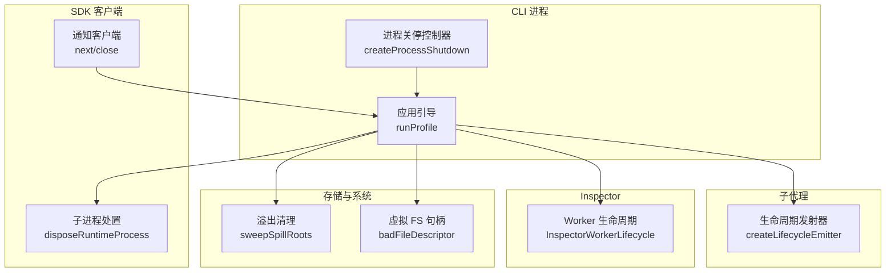
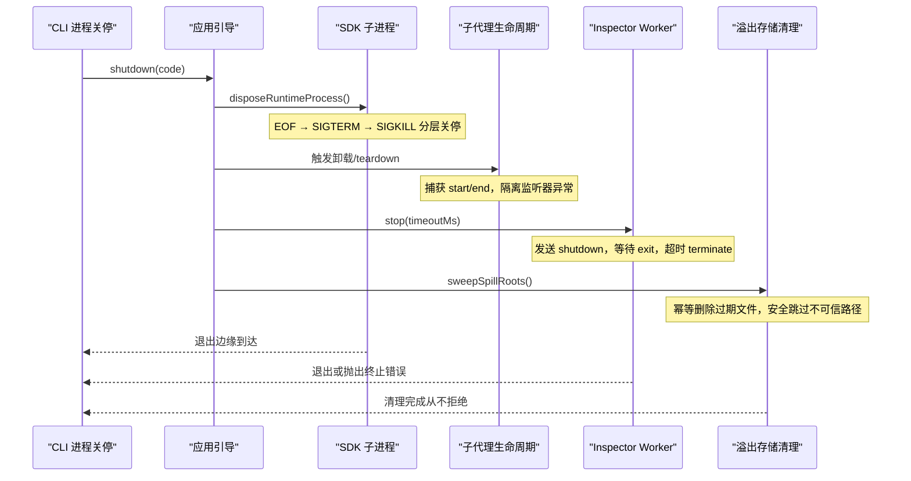
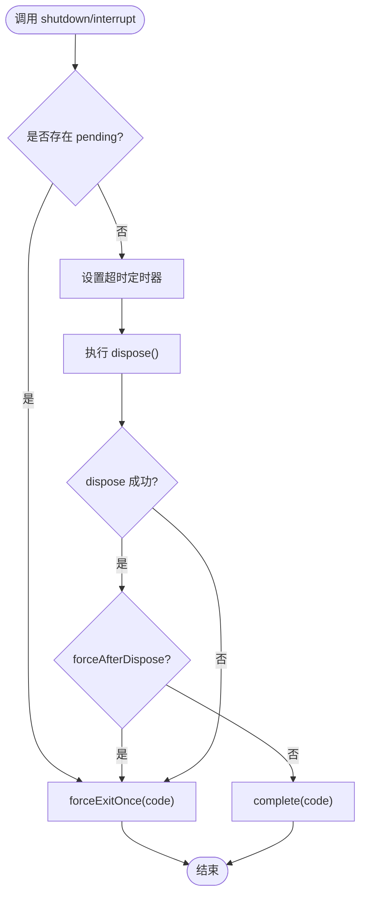
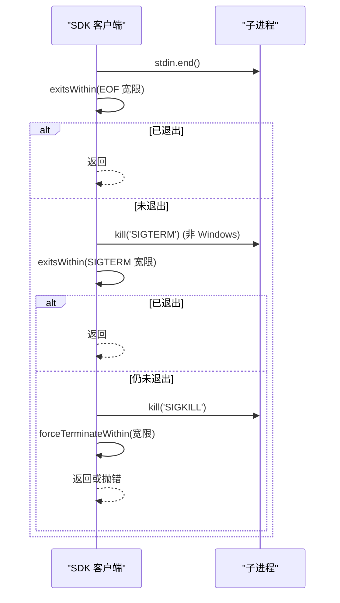
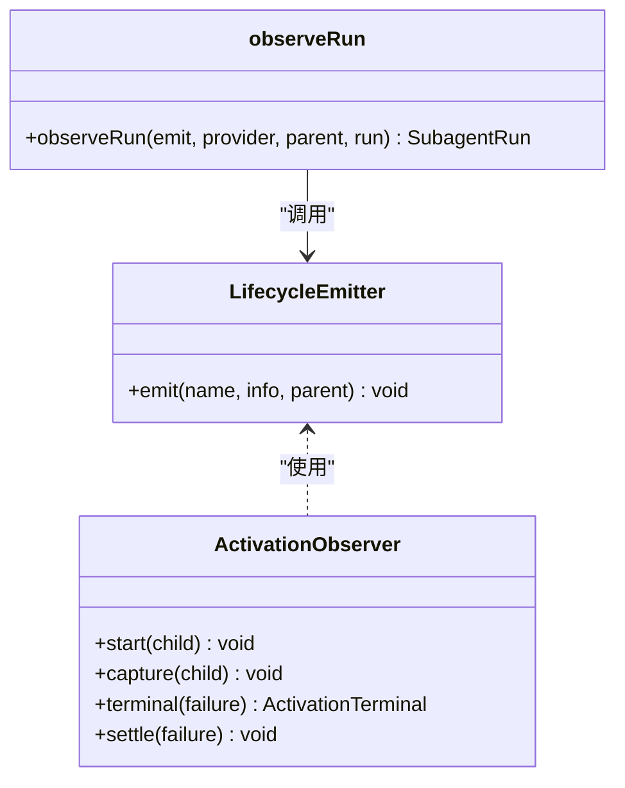
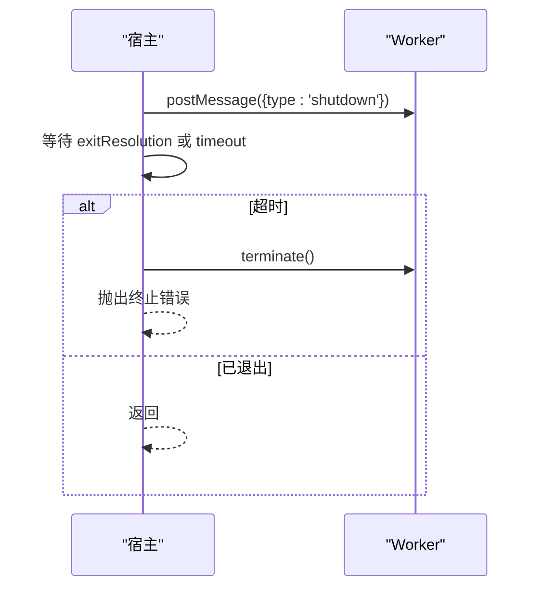
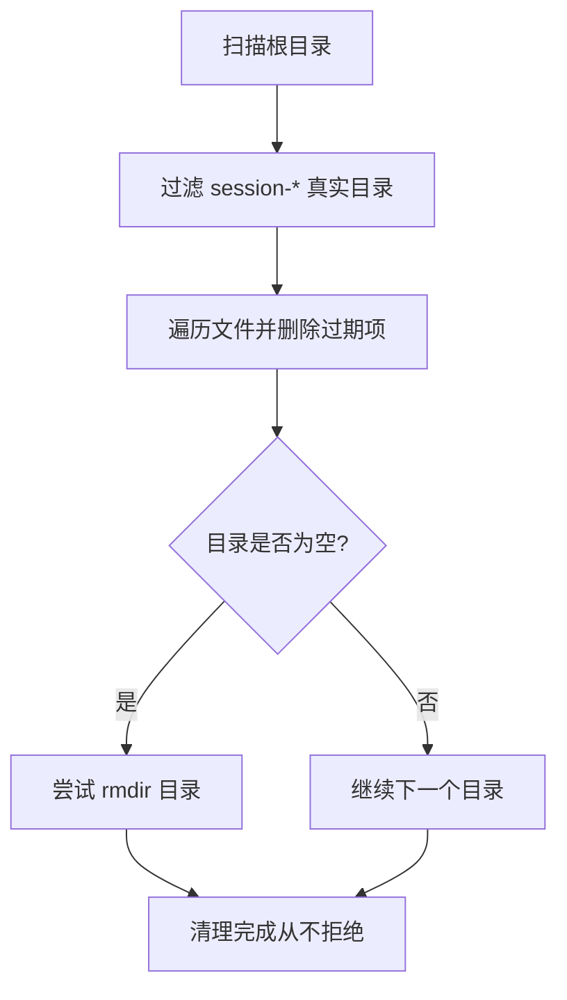
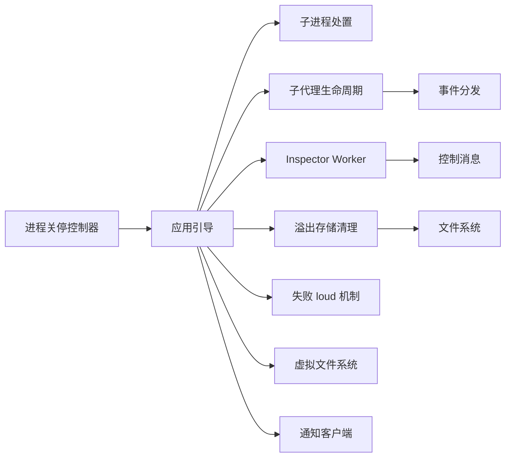

# 资源生命周期管理

<cite>
**本文引用的文件**
- [process-shutdown.ts](file://apps/cli/src/process-shutdown.ts)
- [profile-boot.ts](file://apps/cli/src/profile-boot.ts)
- [dispose.ts](file://packages/sdk/client/src/dispose.ts)
- [lifecycle.ts（子代理）](file://packages/subagent/subagent/src/lifecycle.ts)
- [lifecycle.ts（Inspector Worker）](file://packages/experimental/inspector/src/host/bridge/lifecycle.ts)
- [cleanup.ts（溢出存储清理）](file://packages/spill/spill-local/src/cleanup.ts)
- [index.ts（Agent 循环）](file://packages/core/agent-loop/src/index.ts)
- [index.ts（应用启动）](file://packages/boot/app-boot/src/index.ts)
- [fs.ts（虚拟文件系统）](file://packages/experimental/webworker-runtime/src/node/builtin_modules/implemented/fs.ts)
- [client.ts（通知客户端）](file://packages/sdk/client/src/client.ts)
- [gateway.client.spec.ts（事件隔离测试）](file://packages/api/gateway/tests/gateway.client.spec.ts)
- [process-shutdown.spec.ts（进程关停测试）](file://apps/cli/tests/process-shutdown.spec.ts)
- [never-dispose.mjs（永不释放的插件）](file://apps/cli/tests/fixtures/never-dispose.mjs)
</cite>

## 目录
1. [简介](#简介)
2. [项目结构](#项目结构)
3. [核心组件](#核心组件)
4. [架构总览](#架构总览)
5. [详细组件分析](#详细组件分析)
6. [依赖关系分析](#依赖关系分析)
7. [性能考量](#性能考量)
8. [故障排查指南](#故障排查指南)
9. [结论](#结论)
10. [附录：最佳实践与示例路径](#附录最佳实践与示例路径)

## 简介
本指南围绕“资源生命周期管理”展开，聚焦以下目标：
- 析构函数必须达到静默状态而非仅请求停止：确保清理完成、句柄关闭、连接释放，避免残留任务或监听器。
- 异步性与完整性：所有清理操作需可等待、可超时、可降级，保证在有限时间内完成或强制退出。
- 监听器与通知注册表的正确关闭顺序：先停止接收新事件，再安全地处理已排队事件，最后移除订阅。
- 进程终止、文件句柄关闭、网络连接的统一策略：优雅关停优先，必要时强制终止并确认退出。
- 资源泄漏检测与预防：内存、外部资源、子进程、Worker、临时文件的治理模式。
- 提供具体代码示例路径与最佳实践，便于落地实施。

## 项目结构
本项目采用分层与按功能域组织的方式，资源生命周期相关的关键位置包括：
- CLI 进程级关停控制器：负责整体应用的优雅关停与强制退出。
- SDK 客户端子进程处置：对运行时子进程执行 EOF → SIGTERM → SIGKILL 的分层关停。
- 子代理生命周期：发布 start/end 事件，隔离监听器异常，保证 teardown 失败不污染运行结果。
- Inspector Worker 生命周期：协调 Worker 就绪、意外退出、优雅停止与强制终止。
- 溢出存储清理：扫描并回收历史会话目录，安全删除过期文件，避免误删。
- Agent 循环取消：通过 AbortController 将工厂销毁信号传播到创建期资源。
- 应用启动与失败 loud：记录装配拒绝并在超时后仍允许退出，防止卡死。
- 虚拟文件系统：文件描述符校验与错误注入，保障句柄一致性。
- 通知客户端：close 时丢弃队列并标记失败，避免悬挂等待。

图表来源
- [process-shutdown.ts:1-78](file://apps/cli/src/process-shutdown.ts#L1-L78)
- [profile-boot.ts:210-319](file://apps/cli/src/profile-boot.ts#L210-L319)
- [dispose.ts:82-99](file://packages/sdk/client/src/dispose.ts#L82-L99)
- [lifecycle.ts（子代理）:101-124](file://packages/subagent/subagent/src/lifecycle.ts#L101-L124)
- [lifecycle.ts（Inspector）:8-126](file://packages/experimental/inspector/src/host/bridge/lifecycle.ts#L8-L126)
- [cleanup.ts:274-362](file://packages/spill/spill-local/src/cleanup.ts#L274-L362)
- [fs.ts:322-333](file://packages/experimental/webworker-runtime/src/node/builtin_modules/implemented/fs.ts#L322-L333)
- [client.ts:108-132](file://packages/sdk/client/src/client.ts#L108-L132)

章节来源
- [process-shutdown.ts:1-78](file://apps/cli/src/process-shutdown.ts#L1-L78)
- [profile-boot.ts:210-319](file://apps/cli/src/profile-boot.ts#L210-L319)

## 核心组件
- 进程关停控制器：提供 shutdown/interrupt 双入口，支持多次调用合并、超时强制退出、自然完成码记录。
- 子进程处置：EOF 优雅关闭 stdin，等待退出；POSIX 发送 SIGTERM；最终 SIGKILL 并等待退出边缘。
- 子代理生命周期：start/end 成对发布，监听器异常隔离，teardown 失败覆盖为 error 并抑制输出。
- Inspector Worker 生命周期：等待 ready 帧，监控 error/exit，支持 expectExit 与 stop 超时强制 terminate。
- 溢出存储清理：只清理受信任目录与精确匹配的子目录，幂等删除，失败被吞掉并记录警告。
- Agent 循环取消：AbortController 在创建阶段即注册卸载/工厂销毁回调，避免资源未初始化时的泄漏。
- 应用启动失败 loud：收集装配拒绝，设置释放超时，确保即使 disposer 卡住也能退出。
- 虚拟文件系统：无效 fd 检查，统一错误类型，避免 EBADF 扩散。
- 通知客户端：close 立即断开订阅、清空队列、标记失败，阻止后续 next 挂起。

章节来源
- [process-shutdown.ts:22-77](file://apps/cli/src/process-shutdown.ts#L22-L77)
- [dispose.ts:18-99](file://packages/sdk/client/src/dispose.ts#L18-L99)
- [lifecycle.ts（子代理）:101-218](file://packages/subagent/subagent/src/lifecycle.ts#L101-L218)
- [lifecycle.ts（Inspector）:8-126](file://packages/experimental/inspector/src/host/bridge/lifecycle.ts#L8-L126)
- [cleanup.ts:196-362](file://packages/spill/spill-local/src/cleanup.ts#L196-L362)
- [index.ts（Agent 循环）:552-565](file://packages/core/agent-loop/src/index.ts#L552-L565)
- [index.ts（应用启动）:598-611](file://packages/boot/app-boot/src/index.ts#L598-L611)
- [fs.ts:322-333](file://packages/experimental/webworker-runtime/src/node/builtin_modules/implemented/fs.ts#L322-L333)
- [client.ts:108-132](file://packages/sdk/client/src/client.ts#L108-L132)

## 架构总览
下图展示了从 CLI 进程关停到各子系统资源释放的协作流程，强调“优雅关停优先、强制退出兜底”的原则。

图表来源
- [process-shutdown.ts:52-77](file://apps/cli/src/process-shutdown.ts#L52-L77)
- [profile-boot.ts:223-240](file://apps/cli/src/profile-boot.ts#L223-L240)
- [dispose.ts:82-99](file://packages/sdk/client/src/dispose.ts#L82-L99)
- [lifecycle.ts（子代理）:134-218](file://packages/subagent/subagent/src/lifecycle.ts#L134-L218)
- [lifecycle.ts（Inspector）:100-116](file://packages/experimental/inspector/src/host/bridge/lifecycle.ts#L100-L116)
- [cleanup.ts:274-362](file://packages/spill/spill-local/src/cleanup.ts#L274-L362)

## 详细组件分析

### 进程关停控制器（CLI）
- 设计要点
  - shutdown 与 interrupt 合并：多次调用不会重复计时或退出。
  - 超时强制退出：超过宽限期后强制退出，避免长时间阻塞。
  - 自然完成码记录：正常完成时记录退出码，不触发强制退出。
  - 信号升级：当已有 pending 时，interrupt 直接强制退出。
- 关键行为
  - 启动时设置定时器，dispose 成功后根据是否 forceAfterDispose 决定 complete 或 forceExit。
  - 异常路径直接强制退出，保证无悬挂。

图表来源
- [process-shutdown.ts:52-77](file://apps/cli/src/process-shutdown.ts#L52-L77)

章节来源
- [process-shutdown.ts:22-77](file://apps/cli/src/process-shutdown.ts#L22-L77)
- [process-shutdown.spec.ts:135-179](file://apps/cli/tests/process-shutdown.spec.ts#L135-L179)

### SDK 子进程处置
- 分层关停策略
  - 第一步：关闭 stdin 并等待子进程自行退出（EOF 优雅关停）。
  - 第二步：POSIX 平台发送 SIGTERM，等待退出。
  - 第三步：SIGKILL 并等待退出边缘，若失败则抛错。
- 防泄漏措施
  - 监听器在超时或退出时被移除，避免累积。
  - unref 定时器，避免保持事件循环存活。

图表来源
- [dispose.ts:18-99](file://packages/sdk/client/src/dispose.ts#L18-L99)

章节来源
- [dispose.ts:18-99](file://packages/sdk/client/src/dispose.ts#L18-L99)

### 子代理生命周期（start/end 与异常隔离）
- 事件发布
  - 每个监听器独立包裹 try/catch 与 Promise.catch，避免单个失败影响其他监听器。
  - 对于 provider removal 等从 disposer 触发的场景，确保不会破坏 teardown。
- 终端事实采集
  - capture 在 child 注销前快照日志边界与最终输出。
  - terminal 在 teardown 失败时覆盖 stopReason 为 error 并抑制输出。
- 停止原因推导
  - 基于 foldConsumedWork 的事件后缀判断 completed/aborted/error/refusal。

图表来源
- [lifecycle.ts（子代理）:101-218](file://packages/subagent/subagent/src/lifecycle.ts#L101-L218)

章节来源
- [lifecycle.ts（子代理）:101-218](file://packages/subagent/subagent/src/lifecycle.ts#L101-L218)

### Inspector Worker 生命周期
- 就绪等待
  - 等待 ready 帧，同时监听 failure/exit，任一先到则拒绝或提前返回。
- 意外退出上报
  - markRunning 后，unexpected exit 会调用一次包含错误信息的回调。
- 优雅停止与强制终止
  - stop 发送 shutdown 消息，等待 exit；超时则 terminate 并抛错。
  - expectExit 用于区分 owner-requested 与非预期退出。

图表来源
- [lifecycle.ts（Inspector）:41-116](file://packages/experimental/inspector/src/host/bridge/lifecycle.ts#L41-L116)

章节来源
- [lifecycle.ts（Inspector）:8-126](file://packages/experimental/inspector/src/host/bridge/lifecycle.ts#L8-L126)

### 溢出存储清理（spill-local）
- 安全扫描
  - 仅清理受信任目录与精确匹配的 session-* 子目录。
  - 父目录权限检查，避免跨用户替换风险。
- 幂等删除
  - unlinkIdempotent 将 ENOENT 视为成功，其他错误记录警告但不抛错。
- 根目录回收
  - 发现的历史默认根在空时可被删除，活跃根不被删除。

图表来源
- [cleanup.ts:274-362](file://packages/spill/spill-local/src/cleanup.ts#L274-L362)

章节来源
- [cleanup.ts:196-362](file://packages/spill/spill-local/src/cleanup.ts#L196-L362)

### Agent 循环取消（创建期资源保护）
- 在资源尚未完全创建时即注册卸载/工厂销毁回调，通过 AbortController 中断创建过程，避免部分初始化导致的泄漏。
- 将 callerSignal 与 ownership.signal 的 abort 事件绑定到同一控制器，确保任意一方触发都能中止。

章节来源
- [index.ts（Agent 循环）:552-565](file://packages/core/agent-loop/src/index.ts#L552-L565)

### 应用启动失败 loud（防止卡死）
- 收集装配拒绝并保留，设置释放超时，确保即使 disposer 卡住也会退出。
- FAIL_LOUD_RELEASE_TIMEOUT_MS 控制最大等待时间。

章节来源
- [index.ts（应用启动）:598-611](file://packages/boot/app-boot/src/index.ts#L598-L611)

### 虚拟文件系统句柄校验
- 读取前校验 fd 有效性，无效 fd 抛出 EBADF 错误，统一错误语义。
- 通过 fileOf 获取 OpenFile，缺失则报错，避免悬空句柄访问。

章节来源
- [fs.ts:322-333](file://packages/experimental/webworker-runtime/src/node/builtin_modules/implemented/fs.ts#L322-L333)

### 通知客户端关闭顺序
- close 立即 unsubscribe、清空队列、fail 标记，阻止后续 next 挂起。
- 已投递的通知在 runtime death 时仍可 drain，但 close 后队列丢弃。

章节来源
- [client.ts:108-132](file://packages/sdk/client/src/client.ts#L108-L132)

## 依赖关系分析
- CLI 进程关停控制器依赖应用引导，引导负责调度子进程处置、子代理卸载、Worker 停止与存储清理。
- 子代理生命周期依赖上下文事件分发，监听器异常隔离不影响主流程。
- Inspector Worker 生命周期依赖宿主控制消息协议，具备超时强制终止能力。
- 溢出存储清理依赖文件系统 API，严格的安全策略避免误删。
- Agent 循环取消依赖 AbortController，确保创建期资源可被及时中断。
- 应用启动失败 loud 依赖全局拒绝收集与释放超时机制。
- 虚拟文件系统依赖句柄表，确保 fd 有效。
- 通知客户端依赖订阅管理与队列，close 时快速失效。

图表来源
- [process-shutdown.ts:22-77](file://apps/cli/src/process-shutdown.ts#L22-L77)
- [profile-boot.ts:223-240](file://apps/cli/src/profile-boot.ts#L223-L240)
- [lifecycle.ts（子代理）:101-124](file://packages/subagent/subagent/src/lifecycle.ts#L101-L124)
- [lifecycle.ts（Inspector）:100-116](file://packages/experimental/inspector/src/host/bridge/lifecycle.ts#L100-L116)
- [cleanup.ts:274-362](file://packages/spill/spill-local/src/cleanup.ts#L274-L362)
- [index.ts（应用启动）:598-611](file://packages/boot/app-boot/src/index.ts#L598-L611)
- [fs.ts:322-333](file://packages/experimental/webworker-runtime/src/node/builtin_modules/implemented/fs.ts#L322-L333)
- [client.ts:108-132](file://packages/sdk/client/src/client.ts#L108-L132)

章节来源
- [process-shutdown.ts:22-77](file://apps/cli/src/process-shutdown.ts#L22-L77)
- [profile-boot.ts:223-240](file://apps/cli/src/profile-boot.ts#L223-L240)

## 性能考量
- 关停超时与宽限：合理设置 EOF/SIGTERM/SIGKILL 宽限，避免过长等待影响用户体验。
- 并发清理：多个异步处置器并发执行，存在顺序依赖的步骤应放入单一 disposer 内串行等待。
- 监听器异常隔离：避免单个监听器失败导致整个事件流阻塞。
- 内存与缓冲区：避免持有大缓冲区的视图，及时复制残片以释放底层分配。
- 文件 I/O：幂等删除与安全检查减少重试与竞争条件。

[本节为通用指导，无需特定文件来源]

## 故障排查指南
- 进程关停卡住
  - 检查是否有永不 settle 的 disposer（如 never-dispose.mjs），必要时通过 interrupt 强制退出。
  - 查看进程关停测试用例，验证多次 shutdown 合并与信号升级行为。
- 子进程未退出
  - 确认 EOF 与 SIGTERM 宽限是否过短，检查 SIGKILL 是否被接受。
  - 关注子进程错误事件与退出码。
- Worker 意外退出
  - 使用 markRunning 观察 unexpected exit，stop 超时后强制 terminate。
- 事件监听器异常
  - 参考 gateway.client.spec.ts 中的隔离测试，确保同步/异步失败不会阻断其他监听器。
- 通知客户端悬挂
  - 确保 close 后立即丢弃队列并 fail，避免 next 长期挂起。
- 文件句柄错误
  - 检查 EBADF 错误注入点，确保 fd 有效后再操作。

章节来源
- [never-dispose.mjs:1-19](file://apps/cli/tests/fixtures/never-dispose.mjs#L1-L19)
- [process-shutdown.spec.ts:135-179](file://apps/cli/tests/process-shutdown.spec.ts#L135-L179)
- [gateway.client.spec.ts:1416-1444](file://packages/api/gateway/tests/gateway.client.spec.ts#L1416-L1444)
- [client.ts:108-132](file://packages/sdk/client/src/client.ts#L108-L132)
- [fs.ts:322-333](file://packages/experimental/webworker-runtime/src/node/builtin_modules/implemented/fs.ts#L322-L333)

## 结论
- 析构函数必须达到静默状态：清理完成后才能认为资源已释放，不能仅停留在“请求停止”。
- 异步性与完整性：所有清理需可等待、可超时、可降级，确保有限时间内完成或强制退出。
- 关闭顺序：先停止接收新事件，再处理已排队事件，最后移除订阅与句柄。
- 进程终止：EOF → SIGTERM → SIGKILL 分层关停，配合超时强制退出。
- 文件句柄与网络连接：严格校验有效性，幂等操作，避免悬挂引用。
- 泄漏检测：结合测试用例与日志警告，识别永不 settle 的 disposer、未移除的监听器、未关闭的连接。
- 最佳实践：将顺序依赖的清理放入单一 disposer 中串行等待；使用 AbortController 中断创建期资源；对 Worker 与子进程设置合理的宽限与强制终止。

[本节为总结性内容，无需特定文件来源]

## 附录：最佳实践与示例路径
- 进程关停控制器
  - 实现与测试：[process-shutdown.ts:22-77](file://apps/cli/src/process-shutdown.ts#L22-L77)、[process-shutdown.spec.ts:135-179](file://apps/cli/tests/process-shutdown.spec.ts#L135-L179)
- SDK 子进程处置
  - 分层关停与超时：[dispose.ts:18-99](file://packages/sdk/client/src/dispose.ts#L18-L99)
- 子代理生命周期
  - 事件隔离与终端事实：[lifecycle.ts（子代理）:101-218](file://packages/subagent/subagent/src/lifecycle.ts#L101-L218)
- Inspector Worker 生命周期
  - 就绪等待与强制终止：[lifecycle.ts（Inspector）:41-116](file://packages/experimental/inspector/src/host/bridge/lifecycle.ts#L41-L116)
- 溢出存储清理
  - 安全扫描与幂等删除：[cleanup.ts:274-362](file://packages/spill/spill-local/src/cleanup.ts#L274-L362)
- Agent 循环取消
  - 创建期资源保护：[index.ts（Agent 循环）:552-565](file://packages/core/agent-loop/src/index.ts#L552-L565)
- 应用启动失败 loud
  - 释放超时与退出保障：[index.ts（应用启动）:598-611](file://packages/boot/app-boot/src/index.ts#L598-L611)
- 虚拟文件系统句柄
  - 无效 fd 检查：[fs.ts:322-333](file://packages/experimental/webworker-runtime/src/node/builtin_modules/implemented/fs.ts#L322-L333)
- 通知客户端关闭
  - 队列丢弃与失败标记：[client.ts:108-132](file://packages/sdk/client/src/client.ts#L108-L132)
- 事件监听器异常隔离
  - 测试用例参考：[gateway.client.spec.ts:1416-1444](file://packages/api/gateway/tests/gateway.client.spec.ts#L1416-L1444)
- 永不释放的插件（调试用）
  - 模拟卡住的 disposer：[never-dispose.mjs:1-19](file://apps/cli/tests/fixtures/never-dispose.mjs#L1-L19)