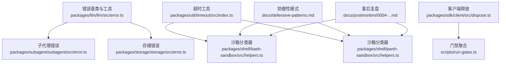
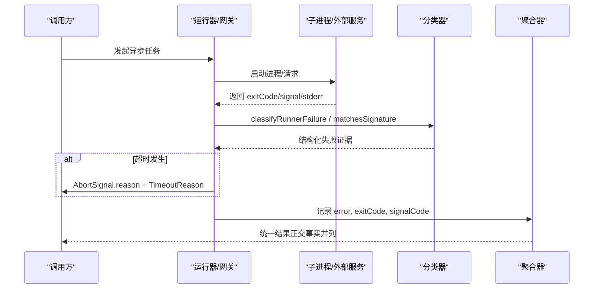
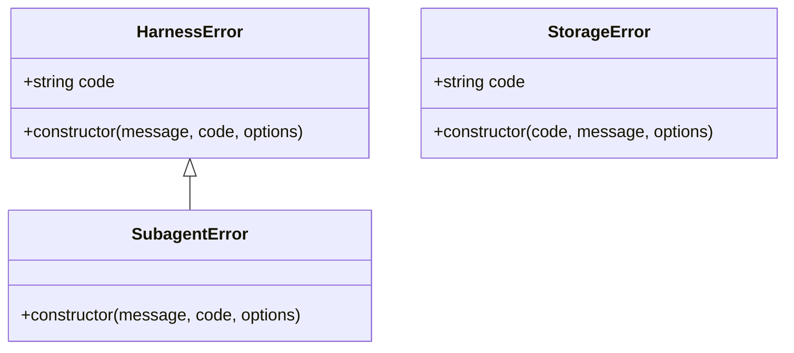
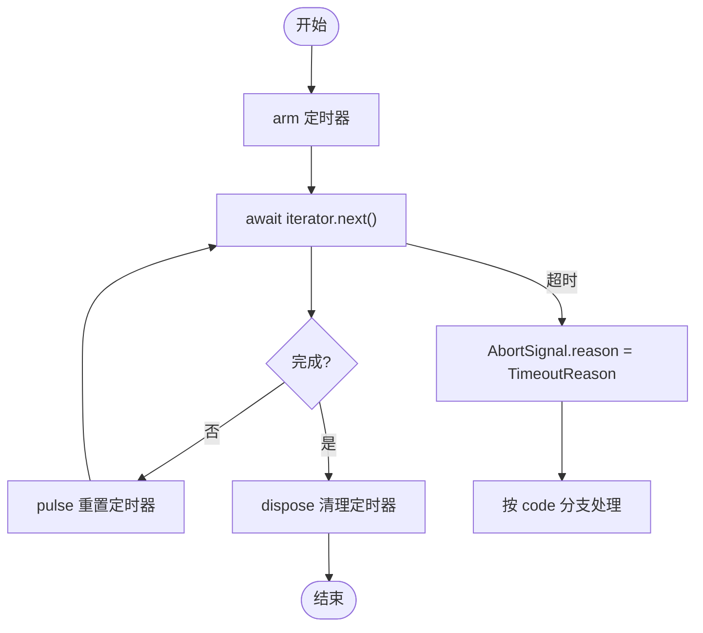
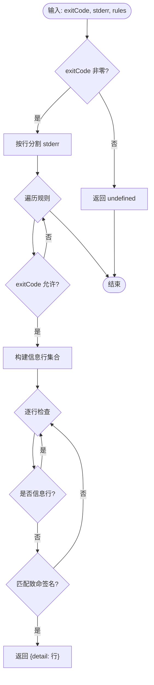
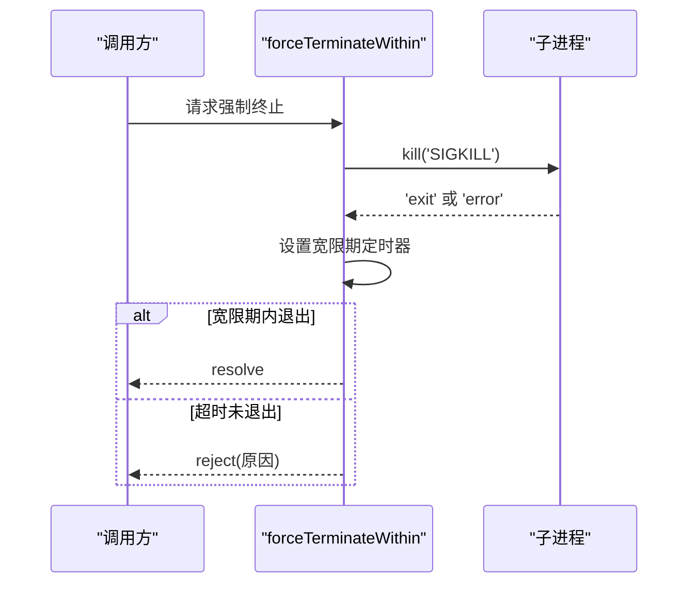
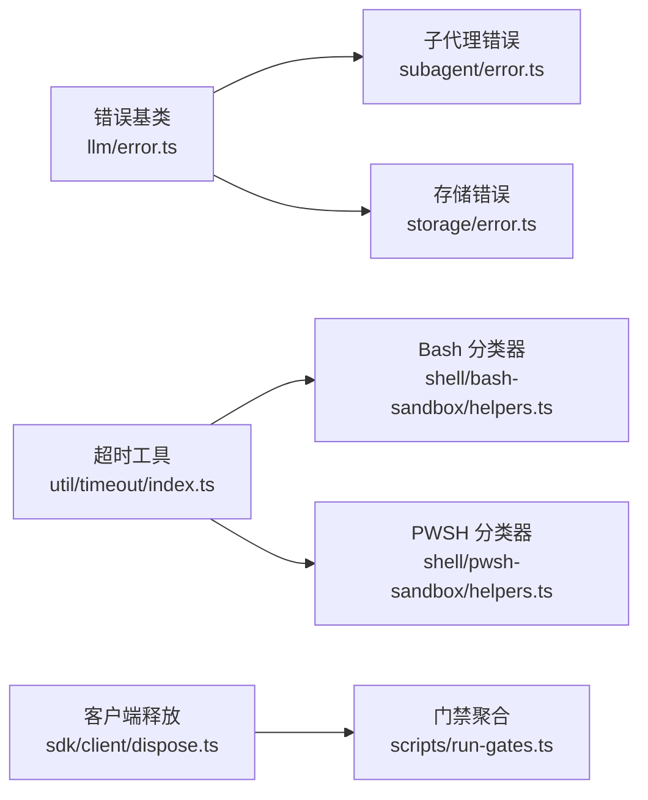

# 错误处理模式

<cite>
**本文引用的文件**
- [packages/llm/llm/src/error.ts](file://packages/llm/llm/src/error.ts)
- [packages/subagent/subagent/src/error.ts](file://packages/subagent/subagent/src/error.ts)
- [packages/storage/storage/src/error.ts](file://packages/storage/storage/src/error.ts)
- [packages/util/timeout/src/index.ts](file://packages/util/timeout/src/index.ts)
- [packages/shell/bash-sandbox/src/helpers.ts](file://packages/shell/bash-sandbox/src/helpers.ts)
- [packages/shell/pwsh-sandbox/src/helpers.ts](file://packages/shell/pwsh-sandbox/src/helpers.ts)
- [packages/sdk/client/src/dispose.ts](file://packages/sdk/client/src/dispose.ts)
- [scripts/run-gates.ts](file://scripts/run-gates.ts)
- [docs/defensive-patterns.md](file://docs/defensive-patterns.md)
- [docs/postmortem/0004-landlock-partial-notice-misclassified-child-failures.md](file://docs/postmortem/0004-landlock-partial-notice-misclassified-child-failures.md)
</cite>

## 目录
1. [简介](#简介)
2. [项目结构](#项目结构)
3. [核心组件](#核心组件)
4. [架构总览](#架构总览)
5. [详细组件分析](#详细组件分析)
6. [依赖关系分析](#依赖关系分析)
7. [性能考虑](#性能考虑)
8. [故障排查指南](#故障排查指南)
9. [结论](#结论)
10. [附录](#附录)

## 简介
本文件系统化梳理仓库中的错误处理模式，聚焦以下目标：
- 如何正确报告正交结果，避免嵌套标志导致的误判（例如超时与退出码、信号同时存在）。
- 异常捕获策略，包括异步操作中的错误传播与恢复。
- 统一处理不同类型的错误（超时、信号、退出码），并提供可追溯的代码片段路径。
- 常见错误场景的解决方案与最佳实践。

## 项目结构
围绕错误处理的关键位置分布在如下模块：
- 基础错误类型与工具：LLM 错误基类、子代理错误、存储错误、超时工具。
- 沙箱与进程分类：Bash/PWSH 沙箱的错误分类器，用于将进程退出码与 stderr 结构化地归因到基础设施失败或拒绝。
- 客户端资源释放：强制终止运行时并等待退出边缘，处理 SIGKILL 与超时。
- 门禁聚合：汇总 gate 结果的 error、exitCode、signalCode，避免信息丢失。
- 防御性模式文档：强调“正交结果独立上报”的原则。
- 事后复盘：Landlock 部分执行通知被误判为子进程失败的案例及修复思路。

**图示来源**
- [packages/llm/llm/src/error.ts:1-164](file://packages/llm/llm/src/error.ts#L1-L164)
- [packages/subagent/subagent/src/error.ts:1-16](file://packages/subagent/subagent/src/error.ts#L1-L16)
- [packages/storage/storage/src/error.ts:1-36](file://packages/storage/storage/src/error.ts#L1-L36)
- [packages/util/timeout/src/index.ts:1-191](file://packages/util/timeout/src/index.ts#L1-L191)
- [packages/shell/bash-sandbox/src/helpers.ts:55-116](file://packages/shell/bash-sandbox/src/helpers.ts#L55-L116)
- [packages/shell/pwsh-sandbox/src/helpers.ts:58-120](file://packages/shell/pwsh-sandbox/src/helpers.ts#L58-L120)
- [packages/sdk/client/src/dispose.ts:34-68](file://packages/sdk/client/src/dispose.ts#L34-L68)
- [scripts/run-gates.ts:998-1027](file://scripts/run-gates.ts#L998-L1027)
- [scripts/run-gates.ts:1516-1527](file://scripts/run-gates.ts#L1516-L1527)
- [docs/defensive-patterns.md:1-13](file://docs/defensive-patterns.md#L1-L13)
- [docs/postmortem/0004-landlock-partial-notice-misclassified-child-failures.md:1-56](file://docs/postmortem/0004-landlock-partial-notice-misclassified-child-failures.md#L1-L56)

**章节来源**
- [docs/defensive-patterns.md:7-13](file://docs/defensive-patterns.md#L7-L13)

## 核心组件
- 统一错误基类与诊断渲染
  - HarnessError：提供稳定机器可读 code 与 cause 链；errorChain 可安全渲染任意抛出值（含 AggregateError 成员）用于诊断输出。
  - isHarnessError：在边界处进行类型收窄，便于 instanceof 判断。
- 领域错误类型
  - SubagentError：继承自 HarnessError，用于子代理边界的结构化失败。
  - StorageError：存储域错误，code 为枚举型判别符，message 为人类可读细节。
- 超时与中止
  - TimeoutReason：携带能力级 timeout code 和超时时长。
  - deadline/idleWatchdog：基于 AbortSignal.any 融合上游取消与超时；timeoutOf 从 reason 中抽取 TimeoutReason 并按 code 精确匹配，避免嵌套超时误判。
- 沙箱进程错误分类
  - matchesSignature/classifyDeniation/classifyRunnerFailure：结合 exitCode、stderr 行级匹配与信息行排除，产出结构化 runner failure 证据，避免将共享前缀与子进程状态混为一谈。
- 强制终止与超时
  - forceTerminateWithin：对子进程发送 SIGKILL，监听 exit/error 事件并在宽限期内等待退出边缘；若未退出则拒绝并附带原因。
- 门禁结果聚合
  - formatGateResultReason：将 error、exitCode、signalCode 并列呈现，避免单一字段掩盖其他事实。

**章节来源**
- [packages/llm/llm/src/error.ts:13-22](file://packages/llm/llm/src/error.ts#L13-L22)
- [packages/llm/llm/src/error.ts:102-164](file://packages/llm/llm/src/error.ts#L102-L164)
- [packages/subagent/subagent/src/error.ts:9-15](file://packages/subagent/subagent/src/error.ts#L9-L15)
- [packages/storage/storage/src/error.ts:6-35](file://packages/storage/storage/src/error.ts#L6-L35)
- [packages/util/timeout/src/index.ts:12-22](file://packages/util/timeout/src/index.ts#L12-L22)
- [packages/util/timeout/src/index.ts:91-113](file://packages/util/timeout/src/index.ts#L91-L113)
- [packages/util/timeout/src/index.ts:126-191](file://packages/util/timeout/src/index.ts#L126-L191)
- [packages/shell/bash-sandbox/src/helpers.ts:55-116](file://packages/shell/bash-sandbox/src/helpers.ts#L55-L116)
- [packages/shell/pwsh-sandbox/src/helpers.ts:58-120](file://packages/shell/pwsh-sandbox/src/helpers.ts#L58-L120)
- [packages/sdk/client/src/dispose.ts:34-68](file://packages/sdk/client/src/dispose.ts#L34-L68)
- [scripts/run-gates.ts:1516-1527](file://scripts/run-gates.ts#L1516-L1527)

## 架构总览
错误处理贯穿“产生—分类—传播—聚合—展示”全链路：
- 产生：各子系统抛出领域错误或系统错误（如网络、I/O、进程）。
- 分类：通过结构化规则（退出码门控、stderr 行匹配、信息行排除）将原始现象归类为基础设施失败、拒绝、普通失败等。
- 传播：使用 HarnessError 及其子类承载 code 与 cause；超时通过 AbortSignal.reason 传递 TimeoutReason。
- 聚合：网关/门禁层将 error、exitCode、signalCode 并列记录，避免单字段覆盖。
- 展示：errorChain 渲染完整错误链，供日志与 UI 诊断。

**图示来源**
- [packages/shell/bash-sandbox/src/helpers.ts:81-103](file://packages/shell/bash-sandbox/src/helpers.ts#L81-L103)
- [packages/shell/pwsh-sandbox/src/helpers.ts:84-105](file://packages/shell/pwsh-sandbox/src/helpers.ts#L84-L105)
- [packages/util/timeout/src/index.ts:91-113](file://packages/util/timeout/src/index.ts#L91-L113)
- [scripts/run-gates.ts:1516-1527](file://scripts/run-gates.ts#L1516-L1527)

## 详细组件分析

### 组件A：统一错误基类与诊断渲染（packages/llm/llm/src/error.ts）
- 设计要点
  - HarnessError 以 code 作为稳定路由键，message 仅用于诊断；支持 ErrorOptions.cause 链式包装。
  - errorChain 安全渲染任意抛出值，包含 AggregateError 成员与 cause 链，避免重复与循环引用。
  - isContextWindowExceededError/isQuotaExceededError 提供领域语义识别（上下文溢出、配额耗尽）。
- 复杂度与性能
  - errorChain 递归遍历 cause 链，时间复杂度 O(n)，n 为链长度；使用 Set 检测循环引用，空间 O(n)。
- 错误处理建议
  - 在边界处用 isHarnessError 做类型收窄，按 code 路由而非解析 message。
  - 对外暴露时保留 cause，以便上层聚合与诊断。

**图示来源**
- [packages/llm/llm/src/error.ts:13-22](file://packages/llm/llm/src/error.ts#L13-L22)
- [packages/subagent/subagent/src/error.ts:9-15](file://packages/subagent/subagent/src/error.ts#L9-L15)
- [packages/storage/storage/src/error.ts:16-35](file://packages/storage/storage/src/error.ts#L16-L35)

**章节来源**
- [packages/llm/llm/src/error.ts:13-22](file://packages/llm/llm/src/error.ts#L13-L22)
- [packages/llm/llm/src/error.ts:102-164](file://packages/llm/llm/src/error.ts#L102-L164)

### 组件B：超时与中止（packages/util/timeout/src/index.ts）
- 设计要点
  - TimeoutReason 携带能力级 code 与超时时长，用于区分不同来源的超时。
  - deadline 将上游取消与超时通过 AbortSignal.any 融合，首个获胜者决定 reason。
  - idleWatchdog 为迭代器需求提供“空闲超时”，仅在 next 期间计时。
  - timeoutOf 可按 code 精确匹配 TimeoutReason，避免嵌套超时误判。
- 典型用法
  - 在异步流中，next 前后 arm/pulse，finally 清理定时器。
  - 捕获 abort 后，用 timeoutOf(signal) 判断是否由自身超时触发。

**图示来源**
- [packages/util/timeout/src/index.ts:91-113](file://packages/util/timeout/src/index.ts#L91-L113)
- [packages/util/timeout/src/index.ts:126-191](file://packages/util/timeout/src/index.ts#L126-L191)

**章节来源**
- [packages/util/timeout/src/index.ts:12-22](file://packages/util/timeout/src/index.ts#L12-L22)
- [packages/util/timeout/src/index.ts:91-113](file://packages/util/timeout/src/index.ts#L91-L113)
- [packages/util/timeout/src/index.ts:126-191](file://packages/util/timeout/src/index.ts#L126-L191)

### 组件C：沙箱进程错误分类（bash/pwsh helpers）
- 设计要点
  - matchesSignature：非零退出码 + stderr 包含签名即判定。
  - classifyRunnerFailure：结构化规则，要求非零退出码、可选 exitCode 门控、忽略信息行后匹配致命签名，返回首条匹配行作为 detail。
  - classifyDenial：复用 matchesSignature 对拒绝方言进行分类。
- 避免误判
  - 严格区分“共享前缀的信息行”与“致命行”，防止 Landlock 部分执行通知被误认为失败。
  - 将 exitCode 与 stderr 行级证据组合，避免跨进程拼接导致误判。

**图示来源**
- [packages/shell/bash-sandbox/src/helpers.ts:81-103](file://packages/shell/bash-sandbox/src/helpers.ts#L81-L103)
- [packages/shell/pwsh-sandbox/src/helpers.ts:84-105](file://packages/shell/pwsh-sandbox/src/helpers.ts#L84-L105)

**章节来源**
- [packages/shell/bash-sandbox/src/helpers.ts:55-116](file://packages/shell/bash-sandbox/src/helpers.ts#L55-L116)
- [packages/shell/pwsh-sandbox/src/helpers.ts:58-120](file://packages/shell/pwsh-sandbox/src/helpers.ts#L58-L120)
- [docs/postmortem/0004-landlock-partial-notice-misclassified-child-failures.md:25-39](file://docs/postmortem/0004-landlock-partial-notice-misclassified-child-failures.md#L25-L39)

### 组件D：强制终止与超时（packages/sdk/client/src/dispose.ts）
- 设计要点
  - 先尝试 kill('SIGKILL')，监听 exit/error 事件，设置宽限期定时器。
  - 若未在宽限期内收到退出边缘，拒绝并说明接受/拒绝状态。
  - 确保一次性 settle 与资源清理，避免悬挂定时器与事件监听。
- 异步错误传播
  - 将底层错误（kill 抛错、子进程 error 事件）原样上抛，保持 cause 链。

**图示来源**
- [packages/sdk/client/src/dispose.ts:34-68](file://packages/sdk/client/src/dispose.ts#L34-L68)

**章节来源**
- [packages/sdk/client/src/dispose.ts:34-68](file://packages/sdk/client/src/dispose.ts#L34-L68)

### 组件E：门禁结果聚合（scripts/run-gates.ts）
- 设计要点
  - skippedByFailFast：当 fail-fast 中止时，标记为 skipped，并记录中止原因。
  - formatGateResultReason：将 error、exitCode、signalCode 并列呈现，避免隐藏任一事实。
- 正交结果原则
  - 即使进程已超时，仍应报告其真实 exitCode/signal，不互相覆盖。

**章节来源**
- [scripts/run-gates.ts:998-1027](file://scripts/run-gates.ts#L998-L1027)
- [scripts/run-gates.ts:1516-1527](file://scripts/run-gates.ts#L1516-L1527)

## 依赖关系分析
- 低耦合高内聚
  - 错误基类位于 llm 包，被 subagent、storage 等领域扩展，形成稳定的错误契约。
  - 超时工具独立于业务，通过 AbortSignal 与业务解耦，便于组合与测试。
  - 沙箱分类器只依赖 exitCode/stderr/rules，不感知上层业务语义。
- 可能的环与风险
  - 错误链可能形成环（errorChain 已防护），但需避免在业务中构造循环 cause。
  - 超时 reason 需按 code 精确匹配，避免嵌套超时相互覆盖。

**图示来源**
- [packages/llm/llm/src/error.ts:1-164](file://packages/llm/llm/src/error.ts#L1-L164)
- [packages/subagent/subagent/src/error.ts:1-16](file://packages/subagent/subagent/src/error.ts#L1-L16)
- [packages/storage/storage/src/error.ts:1-36](file://packages/storage/storage/src/error.ts#L1-L36)
- [packages/util/timeout/src/index.ts:1-191](file://packages/util/timeout/src/index.ts#L1-L191)
- [packages/shell/bash-sandbox/src/helpers.ts:55-116](file://packages/shell/bash-sandbox/src/helpers.ts#L55-L116)
- [packages/shell/pwsh-sandbox/src/helpers.ts:58-120](file://packages/shell/pwsh-sandbox/src/helpers.ts#L58-L120)
- [packages/sdk/client/src/dispose.ts:34-68](file://packages/sdk/client/src/dispose.ts#L34-L68)
- [scripts/run-gates.ts:998-1027](file://scripts/run-gates.ts#L998-L1027)
- [scripts/run-gates.ts:1516-1527](file://scripts/run-gates.ts#L1516-L1527)

**章节来源**
- [docs/defensive-patterns.md:7-13](file://docs/defensive-patterns.md#L7-L13)

## 性能考虑
- 错误链渲染
  - errorChain 线性扫描 cause 链，注意控制链深度；对于超大消息（如 Python 异常）应在子侧截断后再上传。
- 超时与定时器
  - deadline/idleWatchdog 使用 setTimeout，注意 MAX_TIMER_DELAY_MS 上限；及时 dispose 避免内存泄漏。
- 沙箱分类
  - classifyRunnerFailure 按行扫描 stderr，建议在大量输出时限制行数或提前短路。

[本节为通用指导，不直接分析具体文件]

## 故障排查指南
- 常见问题与定位
  - 子进程失败误报为基础设施失败：检查 classifyRunnerFailure 的规则配置，确认 exitCode 门控与信息行排除是否正确。
  - 超时与退出码冲突：确保正交上报，不要将 timedOut 嵌套在其他分支中；参考 formatGateResultReason 的并列呈现方式。
  - 强制终止无响应：查看 forceTerminateWithin 的宽限期与 kill 返回值，必要时增加调试日志。
- 推荐步骤
  - 使用 errorChain 打印完整错误链，定位最内层 cause。
  - 对超时分支使用 timeoutOf(signal, code) 精确判断是否由自身超时触发。
  - 对沙箱失败，核对 stderr 行级匹配与信息行排除，避免共享前缀干扰。

**章节来源**
- [packages/llm/llm/src/error.ts:102-164](file://packages/llm/llm/src/error.ts#L102-L164)
- [packages/util/timeout/src/index.ts:175-191](file://packages/util/timeout/src/index.ts#L175-L191)
- [packages/shell/bash-sandbox/src/helpers.ts:81-103](file://packages/shell/bash-sandbox/src/helpers.ts#L81-L103)
- [packages/shell/pwsh-sandbox/src/helpers.ts:84-105](file://packages/shell/pwsh-sandbox/src/helpers.ts#L84-L105)
- [packages/sdk/client/src/dispose.ts:34-68](file://packages/sdk/client/src/dispose.ts#L34-L68)
- [scripts/run-gates.ts:1516-1527](file://scripts/run-gates.ts#L1516-L1527)
- [docs/postmortem/0004-landlock-partial-notice-misclassified-child-failures.md:25-39](file://docs/postmortem/0004-landlock-partial-notice-misclassified-child-failures.md#L25-L39)

## 结论
- 采用统一的错误基类与结构化 code，配合 cause 链，使错误在跨边界传播时保持可路由性与可诊断性。
- 通过超时工具与 AbortSignal 融合，实现可组合、可追踪的异步取消与超时。
- 沙箱分类器以结构化规则避免共享前缀导致的误判，确保基础设施失败与子进程失败清晰分离。
- 正交结果独立上报是核心原则：error、exitCode、signalCode 并列呈现，避免嵌套标志造成的误判。
- 借助事后复盘与防御性模式，持续完善错误分类与测试覆盖，提升系统的可观测性与健壮性。

[本节为总结性内容，不直接分析具体文件]

## 附录
- 代码片段路径（示例）
  - 统一错误基类与诊断渲染：[packages/llm/llm/src/error.ts:13-22](file://packages/llm/llm/src/error.ts#L13-L22)、[packages/llm/llm/src/error.ts:102-164](file://packages/llm/llm/src/error.ts#L102-L164)
  - 超时与中止：[packages/util/timeout/src/index.ts:91-113](file://packages/util/timeout/src/index.ts#L91-L113)、[packages/util/timeout/src/index.ts:126-191](file://packages/util/timeout/src/index.ts#L126-L191)
  - 沙箱分类器：[packages/shell/bash-sandbox/src/helpers.ts:81-103](file://packages/shell/bash-sandbox/src/helpers.ts#L81-L103)、[packages/shell/pwsh-sandbox/src/helpers.ts:84-105](file://packages/shell/pwsh-sandbox/src/helpers.ts#L84-L105)
  - 强制终止：[packages/sdk/client/src/dispose.ts:34-68](file://packages/sdk/client/src/dispose.ts#L34-L68)
  - 门禁聚合：[scripts/run-gates.ts:1516-1527](file://scripts/run-gates.ts#L1516-L1527)
  - 正交结果原则：[docs/defensive-patterns.md:7-13](file://docs/defensive-patterns.md#L7-L13)
  - Landlock 误判复盘：[docs/postmortem/0004-landlock-partial-notice-misclassified-child-failures.md:25-39](file://docs/postmortem/0004-landlock-partial-notice-misclassified-child-failures.md#L25-L39)