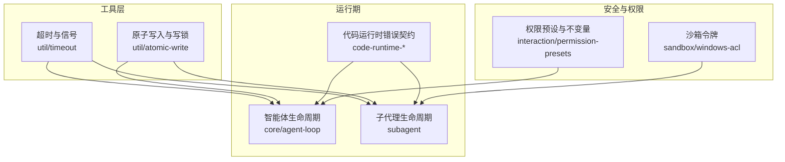
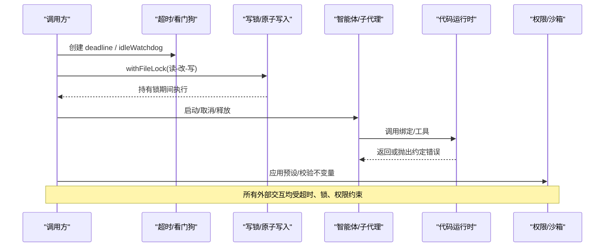
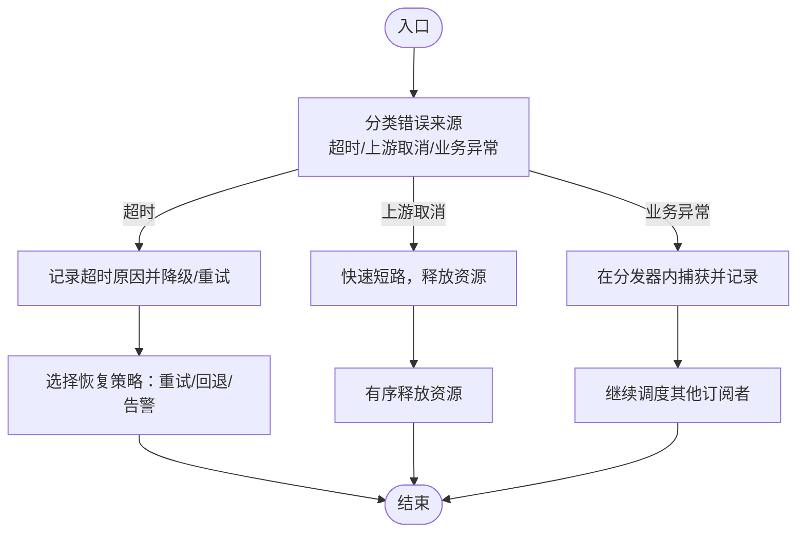
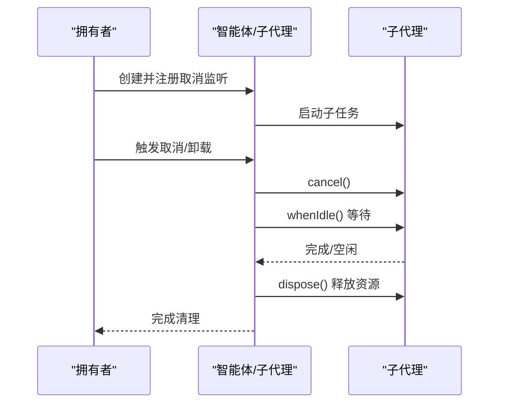
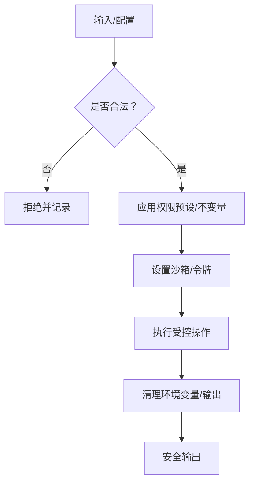
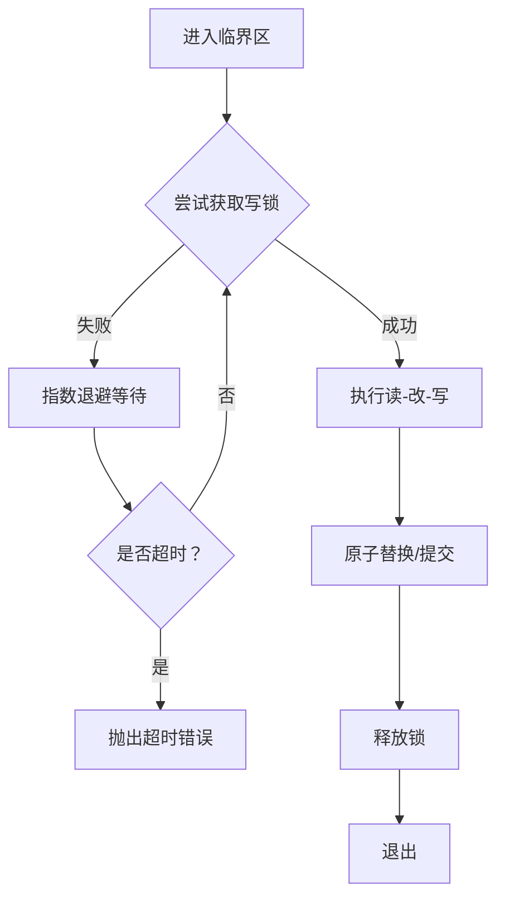
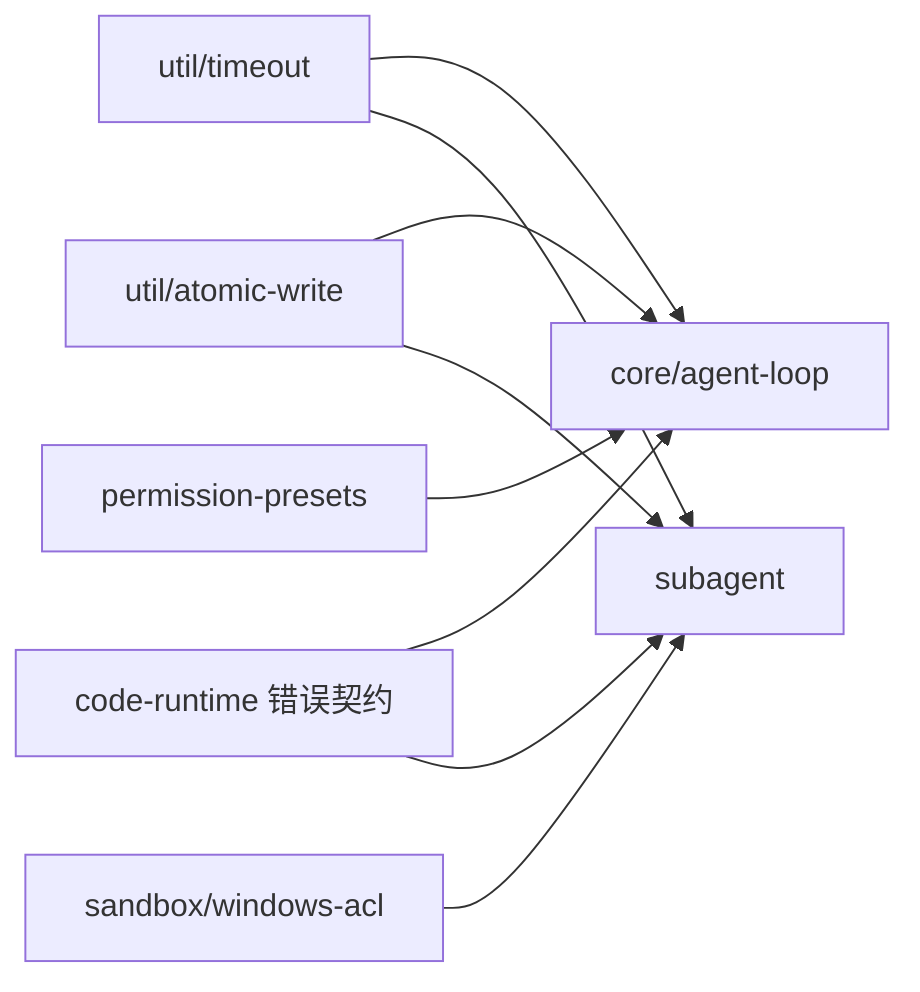

# 防御性编程

<cite>
**本文引用的文件**
- [docs/defensive-patterns.md](file://docs/defensive-patterns.md)
- [docs/defensive-patterns.zh.md](file://docs/defensive-patterns.zh.md)
- [packages/util/timeout/src/index.ts](file://packages/util/timeout/src/index.ts)
- [packages/util/atomic-write/src/index.ts](file://packages/util/atomic-write/src/index.ts)
- [packages/subagent/subagent/src/continuation.ts](file://packages/subagent/subagent/src/continuation.ts)
- [packages/core/agent-loop/src/index.ts](file://packages/core/agent-loop/src/index.ts)
- [packages/experimental/code-runtime-python/py/bootstrap.py](file://packages/experimental/code-runtime-python/py/bootstrap.py)
- [packages/code-runtime/code-runtime-worker-thread/src/bootstrap.ts](file://packages/code-runtime/code-runtime-worker-thread/src/bootstrap.ts)
- [packages/test-support/client-runtime/src/index.ts](file://packages/test-support/client-runtime/src/index.ts)
- [packages/interaction/permission-presets/src/index.ts](file://packages/interaction/permission-presets/src/index.ts)
- [packages/interaction/permission-presets/src/invariant.ts](file://packages/interaction/permission-presets/src/invariant.ts)
- [packages/sandbox/sandbox-windows-acl/src/token.ts](file://packages/sandbox/sandbox-windows-acl/src/token.ts)
- [packages/experimental/webworker-runtime/src/node/builtin_modules/implemented/abort-error.ts](file://packages/experimental/webworker-runtime/src/node/builtin_modules/implemented/abort-error.ts)
- [packages/api/gateway/tests/gateway.host.spec.ts](file://packages/api/gateway/tests/gateway.host.spec.ts)
</cite>

## 目录
1. [简介](#简介)
2. [项目结构](#项目结构)
3. [核心组件](#核心组件)
4. [架构总览](#架构总览)
5. [详细组件分析](#详细组件分析)
6. [依赖关系分析](#依赖关系分析)
7. [性能考量](#性能考量)
8. [故障排查指南](#故障排查指南)
9. [结论](#结论)
10. [附录](#附录)

## 简介
本指南聚焦于在复杂、异步、并发与跨进程环境中实现“防御性编程”的系统化方法。围绕错误处理策略（异常捕获、错误分类与恢复）、异步状态管理（避免竞态与资源泄漏）、安全编码规范（输入验证、权限检查、敏感信息保护）以及并发编程的安全模式（锁机制、超时处理、优雅降级），结合仓库中的实际实现，给出可操作的实践与常见陷阱规避方法。

## 项目结构
本项目采用多包（monorepo）组织，关键能力分布在 util、subagent、core、sandbox、interaction、code-runtime 等包中：
- 超时与信号：util/timeout 提供统一的超时、空闲看门狗与原因分类。
- 原子写入与写锁：util/atomic-write 提供跨进程写串行化与原子替换。
- 子代理生命周期：subagent 提供子任务序列化释放与停止传播。
- 智能体生命周期：core/agent-loop 提供创建期取消融合与资源清理。
- 代码运行时错误契约：experimental/code-runtime-python 与 code-runtime-worker-thread 定义并注入绑定错误类型，隔离宿主与程序边界。
- 测试运行时清理：test-support/client-runtime 提供幂等 dispose。
- 权限预设与不变量：interaction/permission-presets 负责会话级权限装配与校验。
- 沙箱令牌与最小权限：sandbox/sandbox-windows-acl 构建受限令牌集合。
- 中止错误标准化：experimental/webworker-runtime 提供 Node 风格 AbortError。
- 输入校验：api/gateway 测试覆盖循环引用等非法输入拒绝。

图表来源
- [packages/util/timeout/src/index.ts:33-113](file://packages/util/timeout/src/index.ts#L33-L113)
- [packages/util/atomic-write/src/index.ts:44-93](file://packages/util/atomic-write/src/index.ts#L44-L93)
- [packages/core/agent-loop/src/index.ts:552-565](file://packages/core/agent-loop/src/index.ts#L552-L565)
- [packages/subagent/subagent/src/continuation.ts:350-377](file://packages/subagent/subagent/src/continuation.ts#L350-L377)
- [packages/interaction/permission-presets/src/index.ts:383-432](file://packages/interaction/permission-presets/src/index.ts#L383-L432)
- [packages/sandbox/sandbox-windows-acl/src/token.ts:147-159](file://packages/sandbox/sandbox-windows-acl/src/token.ts#L147-L159)

章节来源
- [docs/defensive-patterns.md:1-34](file://docs/defensive-patterns.md#L1-L34)
- [docs/defensive-patterns.zh.md:1-36](file://docs/defensive-patterns.zh.md#L1-L36)

## 核心组件
- 统一超时与空闲看门狗：通过 deadline 将上游取消与可识别的超时原因融合；idleWatchdog 为异步迭代器提供“仅在等待时计时”的看门狗；clampTimeout 对调用方传入的超时进行严格校验与上限裁剪；timeoutOf 用于区分不同能力的超时原因。
- 原子写入与写锁：writeFileAtomic 以随机后缀临时文件 + 原子 rename 完成无锁读、有锁写的替换；withFileLock 基于 wx 独占创建实现跨进程写串行化，指数退避与超时控制。
- 子代理停止与释放：ChildLock 按子会话 ID 线性化操作，吸收失败防止级联拒绝；finishDisposal 先自上而下停止，再自下而上释放，确保停稳。
- 智能体创建期取消融合：在资源尚未完全建立前注册取消监听，将调用方取消与工厂卸载融合到单一 AbortController，避免悬挂与泄漏。
- 代码运行时错误契约：为每个绑定命名空间注入声明的错误类，使宿主拒绝以约定类型暴露给程序；Python 侧 dispatch 根据 errorClass 构造对应拒绝；Worker 侧 makeBindingErrorClasses 保证 instanceof 一致性。
- 测试运行时清理：dispose 顺序卸载视图、句柄、作用域与持久化状态，幂等执行。
- 权限预设与不变量：应用预设时补齐缺失权限事实；安装不变量校验，拦截非法事件。
- 沙箱令牌：构建受限 SID 集合，限制最小权限。
- 中止错误标准化：abortError 产出带稳定 code 的 AbortError，便于上层统一处理。
- 输入校验：网关测试覆盖循环引用等非法输入，拒绝不安全对象图。

章节来源
- [packages/util/timeout/src/index.ts:33-113](file://packages/util/timeout/src/index.ts#L33-L113)
- [packages/util/atomic-write/src/index.ts:44-93](file://packages/util/atomic-write/src/index.ts#L44-L93)
- [packages/subagent/subagent/src/continuation.ts:350-377](file://packages/subagent/subagent/src/continuation.ts#L350-L377)
- [packages/core/agent-loop/src/index.ts:552-565](file://packages/core/agent-loop/src/index.ts#L552-L565)
- [packages/experimental/code-runtime-python/py/bootstrap.py:1133-1145](file://packages/experimental/code-runtime-python/py/bootstrap.py#L1133-L1145)
- [packages/code-runtime/code-runtime-worker-thread/src/bootstrap.ts:240-275](file://packages/code-runtime/code-runtime-worker-thread/src/bootstrap.ts#L240-L275)
- [packages/test-support/client-runtime/src/index.ts:402-427](file://packages/test-support/client-runtime/src/index.ts#L402-L427)
- [packages/interaction/permission-presets/src/index.ts:383-432](file://packages/interaction/permission-presets/src/index.ts#L383-L432)
- [packages/interaction/permission-presets/src/invariant.ts:21-39](file://packages/interaction/permission-presets/src/invariant.ts#L21-L39)
- [packages/sandbox/sandbox-windows-acl/src/token.ts:147-159](file://packages/sandbox/sandbox-windows-acl/src/token.ts#L147-L159)
- [packages/experimental/webworker-runtime/src/node/builtin_modules/implemented/abort-error.ts:1-14](file://packages/experimental/webworker-runtime/src/node/builtin_modules/implemented/abort-error.ts#L1-L14)
- [packages/api/gateway/tests/gateway.host.spec.ts:822-847](file://packages/api/gateway/tests/gateway.host.spec.ts#L822-L847)

## 架构总览
下图展示了从调用方到各能力层的防御性路径：调用方通过统一超时与写锁进入子系统；子代理与智能体生命周期遵循“先停止、后释放”的顺序；代码运行时通过错误契约隔离宿主与程序；权限与沙箱在会话启动时固化最小权限。

图表来源
- [packages/util/timeout/src/index.ts:81-113](file://packages/util/timeout/src/index.ts#L81-L113)
- [packages/util/atomic-write/src/index.ts:141-183](file://packages/util/atomic-write/src/index.ts#L141-L183)
- [packages/subagent/subagent/src/continuation.ts:1523-1538](file://packages/subagent/subagent/src/continuation.ts#L1523-L1538)
- [packages/experimental/code-runtime-python/py/bootstrap.py:1133-1145](file://packages/experimental/code-runtime-python/py/bootstrap.py#L1133-L1145)
- [packages/interaction/permission-presets/src/index.ts:383-432](file://packages/interaction/permission-presets/src/index.ts#L383-L432)

## 详细组件分析

### 错误处理策略：异常捕获、错误分类与恢复
- 正交结果独立上报：进程可能同时具备“已超时”和“退出码0”两种事实，应分别上报，避免分支嵌套导致误判。
- 公共约定两侧遵守：适配器可抛错或发出 finish{kind:'error'|'aborted'}，但运行时对外仅暴露终止型分片；中间件与消费方缺陷仍抛错，保持调用方判断清晰。
- 回调异常隔离：分发循环需 try/catch 包裹，单个订阅者崩溃不应破坏核心生命周期。
- 错误分类与恢复：使用 timeoutOf 区分不同能力的超时原因；AbortError 标准化中止；绑定错误类确保宿主拒绝以约定类型暴露给程序。

图表来源
- [packages/util/timeout/src/index.ts:175-191](file://packages/util/timeout/src/index.ts#L175-L191)
- [packages/experimental/webworker-runtime/src/node/builtin_modules/implemented/abort-error.ts:1-14](file://packages/experimental/webworker-runtime/src/node/builtin_modules/implemented/abort-error.ts#L1-L14)
- [packages/experimental/code-runtime-python/py/bootstrap.py:1133-1145](file://packages/experimental/code-runtime-python/py/bootstrap.py#L1133-L1145)
- [packages/code-runtime/code-runtime-worker-thread/src/bootstrap.ts:240-275](file://packages/code-runtime/code-runtime-worker-thread/src/bootstrap.ts#L240-L275)

章节来源
- [docs/defensive-patterns.md:7-26](file://docs/defensive-patterns.md#L7-L26)
- [docs/defensive-patterns.zh.md:7-27](file://docs/defensive-patterns.zh.md#L7-L27)
- [packages/util/timeout/src/index.ts:175-191](file://packages/util/timeout/src/index.ts#L175-L191)
- [packages/experimental/webworker-runtime/src/node/builtin_modules/implemented/abort-error.ts:1-14](file://packages/experimental/webworker-runtime/src/node/builtin_modules/implemented/abort-error.ts#L1-L14)
- [packages/experimental/code-runtime-python/py/bootstrap.py:1133-1145](file://packages/experimental/code-runtime-python/py/bootstrap.py#L1133-L1145)
- [packages/code-runtime/code-runtime-worker-thread/src/bootstrap.ts:240-275](file://packages/code-runtime/code-runtime-worker-thread/src/bootstrap.ts#L240-L275)

### 异步状态管理：避免竞态条件与资源泄漏
- 异步状态不是同步状态：followup/whenIdle 等不能当作单次消息的结果；自动化调用方需显式定义区间，避免共享 running 区间导致的竞争。
- dispose 必须达到完全停稳：先关闭监听/通知注册表，再终止进程并等待退出，避免孤儿。
- 子代理停止与释放顺序：先自上而下 cancel，再自下而上 dispose，ChildLock 按子会话线性化，吸收失败不污染后续调用。
- 智能体创建期取消融合：在资源未就绪前注册取消监听，将调用方取消与工厂卸载融合，避免悬挂。
- 测试运行时清理：顺序卸载视图、句柄、作用域与持久化状态，幂等执行。

图表来源
- [packages/core/agent-loop/src/index.ts:552-565](file://packages/core/agent-loop/src/index.ts#L552-L565)
- [packages/subagent/subagent/src/continuation.ts:1523-1538](file://packages/subagent/subagent/src/continuation.ts#L1523-L1538)
- [packages/subagent/subagent/src/continuation.ts:350-377](file://packages/subagent/subagent/src/continuation.ts#L350-L377)
- [packages/test-support/client-runtime/src/index.ts:402-427](file://packages/test-support/client-runtime/src/index.ts#L402-L427)

章节来源
- [docs/defensive-patterns.md:15-23](file://docs/defensive-patterns.md#L15-L23)
- [docs/defensive-patterns.zh.md:15-23](file://docs/defensive-patterns.zh.md#L15-L23)
- [packages/core/agent-loop/src/index.ts:552-565](file://packages/core/agent-loop/src/index.ts#L552-L565)
- [packages/subagent/subagent/src/continuation.ts:350-377](file://packages/subagent/subagent/src/continuation.ts#L350-L377)
- [packages/subagent/subagent/src/continuation.ts:1523-1538](file://packages/subagent/subagent/src/continuation.ts#L1523-L1538)
- [packages/test-support/client-runtime/src/index.ts:402-427](file://packages/test-support/client-runtime/src/index.ts#L402-L427)

### 安全编码规范：输入验证、权限检查与敏感信息保护
- 输入验证：拒绝循环引用等危险对象图；对绑定名称视为敌对环境，避免原型链碰撞。
- 权限检查：会话启动时补齐默认权限事实；预设不可放松自身隔离；安装不变量校验非法事件。
- 敏感信息保护：命令环境清理移除密钥/令牌/密码相关变量；临时文件使用私有目录、随机名与独占打开；Windows 受限令牌最小化权限。
- 链接路径删除：优先 unlink 而非递归 rm，避免跟随符号链接进入目标。

图表来源
- [packages/api/gateway/tests/gateway.host.spec.ts:822-847](file://packages/api/gateway/tests/gateway.host.spec.ts#L822-L847)
- [packages/interaction/permission-presets/src/index.ts:383-432](file://packages/interaction/permission-presets/src/index.ts#L383-L432)
- [packages/interaction/permission-presets/src/invariant.ts:21-39](file://packages/interaction/permission-presets/src/invariant.ts#L21-L39)
- [packages/sandbox/sandbox-windows-acl/src/token.ts:147-159](file://packages/sandbox/sandbox-windows-acl/src/token.ts#L147-L159)
- [docs/defensive-patterns.md:27-33](file://docs/defensive-patterns.md#L27-L33)
- [docs/defensive-patterns.zh.md:29-35](file://docs/defensive-patterns.zh.md#L29-L35)

章节来源
- [docs/defensive-patterns.md:27-33](file://docs/defensive-patterns.md#L27-L33)
- [docs/defensive-patterns.zh.md:29-35](file://docs/defensive-patterns.zh.md#L29-L35)
- [packages/api/gateway/tests/gateway.host.spec.ts:822-847](file://packages/api/gateway/tests/gateway.host.spec.ts#L822-L847)
- [packages/interaction/permission-presets/src/index.ts:383-432](file://packages/interaction/permission-presets/src/index.ts#L383-L432)
- [packages/interaction/permission-presets/src/invariant.ts:21-39](file://packages/interaction/permission-presets/src/invariant.ts#L21-L39)
- [packages/sandbox/sandbox-windows-acl/src/token.ts:147-159](file://packages/sandbox/sandbox-windows-acl/src/token.ts#L147-L159)

### 并发编程的安全模式：锁机制、超时处理与优雅降级
- 写串行化：withFileLock 使用 wx 独占创建 .lock 文件，指数退避与超时；readers 无锁，仅 writers 竞争。
- 原子替换：writeFileAtomic 以随机后缀临时文件 + 原子 rename 完成替换，确保读者看到旧或新完整内容。
- 超时与空闲看门狗：deadline 融合上游取消与可识别超时；idleWatchdog 仅在 next 等待时计时，避免消费方思考时间被误判为空闲。
- 优雅降级：当超时或取消发生时，快速短路并释放资源；对于非关键路径，可选择回退到缓存或空结果。

图表来源
- [packages/util/atomic-write/src/index.ts:141-183](file://packages/util/atomic-write/src/index.ts#L141-L183)
- [packages/util/timeout/src/index.ts:81-113](file://packages/util/timeout/src/index.ts#L81-L113)
- [packages/util/timeout/src/index.ts:126-173](file://packages/util/timeout/src/index.ts#L126-L173)

章节来源
- [packages/util/atomic-write/src/index.ts:44-93](file://packages/util/atomic-write/src/index.ts#L44-L93)
- [packages/util/atomic-write/src/index.ts:141-183](file://packages/util/atomic-write/src/index.ts#L141-L183)
- [packages/util/timeout/src/index.ts:81-113](file://packages/util/timeout/src/index.ts#L81-L113)
- [packages/util/timeout/src/index.ts:126-173](file://packages/util/timeout/src/index.ts#L126-L173)

## 依赖关系分析
- util/timeout 被多处作为通用超时与原因分类基础，降低重复实现风险。
- util/atomic-write 为跨进程写串行化提供可靠原语，配合文件系统语义保障一致性。
- subagent 的 ChildLock 与 finishDisposal 依赖统一的取消与空闲语义，确保停止与释放顺序。
- core/agent-loop 在创建期即融合取消，避免资源未就绪时的悬挂。
- code-runtime 两端（Python/Worker）通过错误契约对齐宿主与程序的错误可见性。
- interaction/permission-presets 与 sandbox 共同构成会话级最小权限基线。

图表来源
- [packages/util/timeout/src/index.ts:81-113](file://packages/util/timeout/src/index.ts#L81-L113)
- [packages/util/atomic-write/src/index.ts:141-183](file://packages/util/atomic-write/src/index.ts#L141-L183)
- [packages/core/agent-loop/src/index.ts:552-565](file://packages/core/agent-loop/src/index.ts#L552-L565)
- [packages/subagent/subagent/src/continuation.ts:350-377](file://packages/subagent/subagent/src/continuation.ts#L350-L377)
- [packages/experimental/code-runtime-python/py/bootstrap.py:1133-1145](file://packages/experimental/code-runtime-python/py/bootstrap.py#L1133-L1145)
- [packages/code-runtime/code-runtime-worker-thread/src/bootstrap.ts:240-275](file://packages/code-runtime/code-runtime-worker-thread/src/bootstrap.ts#L240-L275)
- [packages/interaction/permission-presets/src/index.ts:383-432](file://packages/interaction/permission-presets/src/index.ts#L383-L432)
- [packages/sandbox/sandbox-windows-acl/src/token.ts:147-159](file://packages/sandbox/sandbox-windows-acl/src/token.ts#L147-L159)

## 性能考量
- 超时与空闲看门狗仅在必要时计时，避免无效定时器开销。
- 写锁采用指数退避与上限控制，减少忙等；原子替换避免额外 chmod 与锁竞争。
- 子代理释放顺序先停止后释放，缩短阻塞路径，提高整体吞吐。
- 权限与沙箱在会话启动时一次性计算，避免运行时频繁决策。

## 故障排查指南
- 超时误判：使用 timeoutOf 精确匹配能力代码，避免将上游取消误认为超时。
- 写锁争用：关注 withFileLock 的 waitMs 与退避策略，确认持有者是否包含网络 I/O。
- 资源泄漏：检查 dispose 是否 await 了子任务退出，并在终止前关闭监听/通知。
- 错误泄露：确认绑定错误类已正确注入，程序端捕获的是约定类型而非内部标记。
- 权限越界：通过不变量校验定位非法事件；检查预设是否意外放宽隔离。

章节来源
- [packages/util/timeout/src/index.ts:175-191](file://packages/util/timeout/src/index.ts#L175-L191)
- [packages/util/atomic-write/src/index.ts:141-183](file://packages/util/atomic-write/src/index.ts#L141-L183)
- [packages/subagent/subagent/src/continuation.ts:1523-1538](file://packages/subagent/subagent/src/continuation.ts#L1523-L1538)
- [packages/experimental/code-runtime-python/py/bootstrap.py:1133-1145](file://packages/experimental/code-runtime-python/py/bootstrap.py#L1133-L1145)
- [packages/interaction/permission-presets/src/invariant.ts:21-39](file://packages/interaction/permission-presets/src/invariant.ts#L21-L39)

## 结论
通过在超时、写锁、生命周期、错误契约与权限方面建立一致的防御性模式，可以显著降低竞态、泄漏与安全漏洞的风险。建议在新功能开发中复用这些原语，并以不变量与测试覆盖强化契约。

## 附录
- 参考文档：防御性模式（中英双语）
- 关键实现路径：
  - 超时与空闲看门狗：[packages/util/timeout/src/index.ts](file://packages/util/timeout/src/index.ts)
  - 原子写入与写锁：[packages/util/atomic-write/src/index.ts](file://packages/util/atomic-write/src/index.ts)
  - 子代理停止与释放：[packages/subagent/subagent/src/continuation.ts](file://packages/subagent/subagent/src/continuation.ts)
  - 智能体取消融合：[packages/core/agent-loop/src/index.ts](file://packages/core/agent-loop/src/index.ts)
  - 代码运行时错误契约：[packages/experimental/code-runtime-python/py/bootstrap.py](file://packages/experimental/code-runtime-python/py/bootstrap.py)、[packages/code-runtime/code-runtime-worker-thread/src/bootstrap.ts](file://packages/code-runtime/code-runtime-worker-thread/src/bootstrap.ts)
  - 权限与不变量：[packages/interaction/permission-presets/src/index.ts](file://packages/interaction/permission-presets/src/index.ts)、[packages/interaction/permission-presets/src/invariant.ts](file://packages/interaction/permission-presets/src/invariant.ts)
  - 沙箱令牌：[packages/sandbox/sandbox-windows-acl/src/token.ts](file://packages/sandbox/sandbox-windows-acl/src/token.ts)
  - 中止错误标准化：[packages/experimental/webworker-runtime/src/node/builtin_modules/implemented/abort-error.ts](file://packages/experimental/webworker-runtime/src/node/builtin_modules/implemented/abort-error.ts)
  - 输入校验示例：[packages/api/gateway/tests/gateway.host.spec.ts](file://packages/api/gateway/tests/gateway.host.spec.ts)