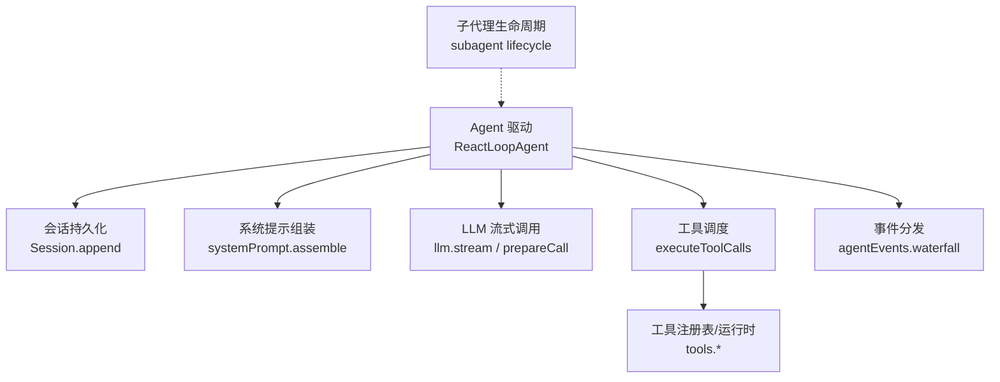
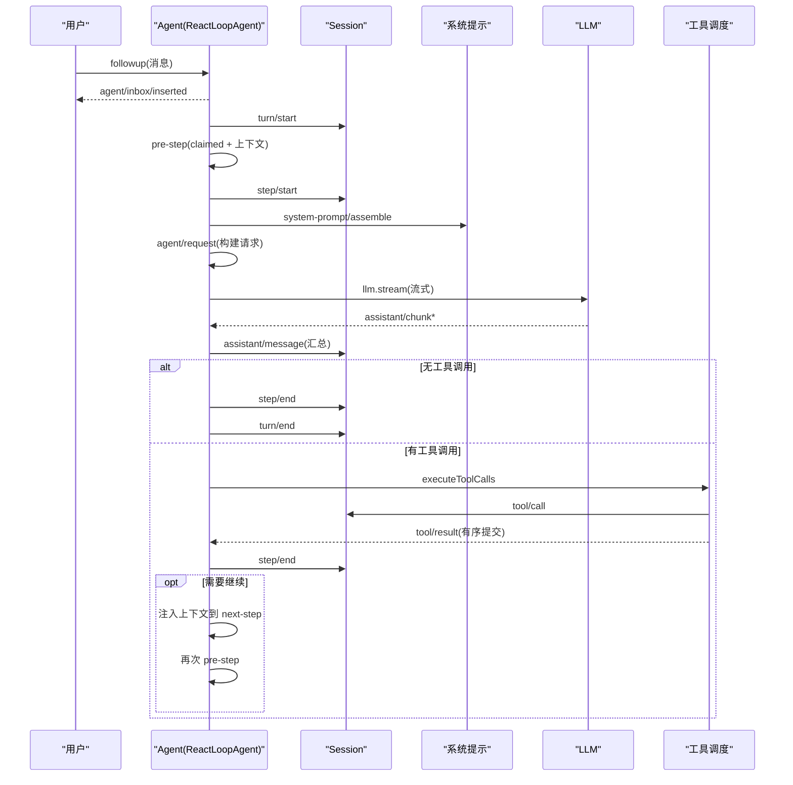
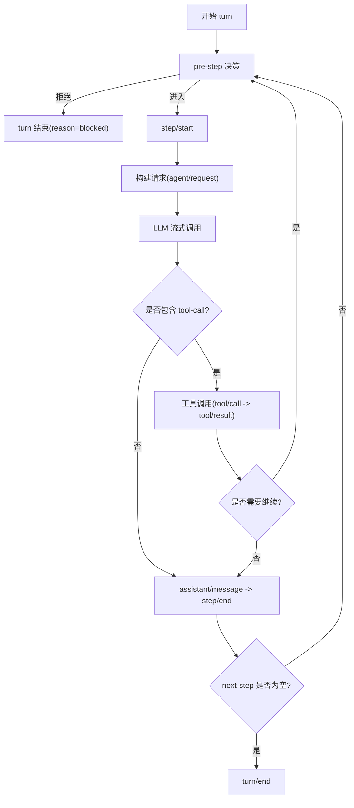
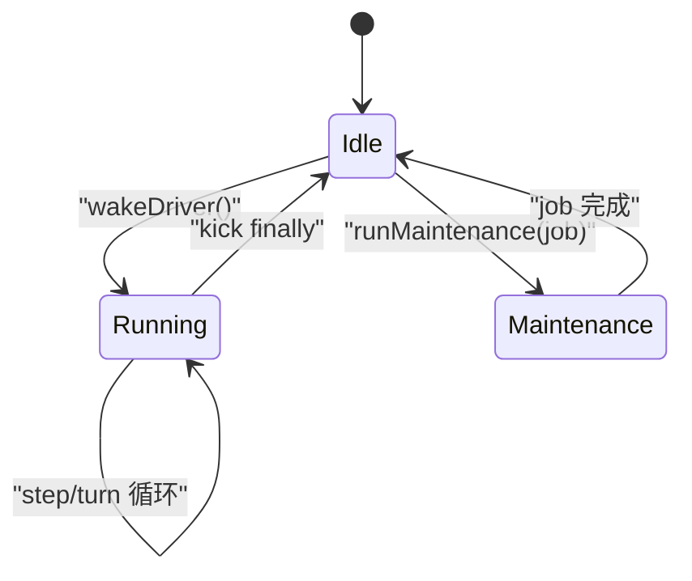
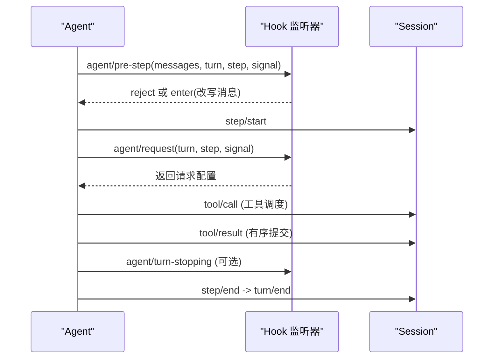
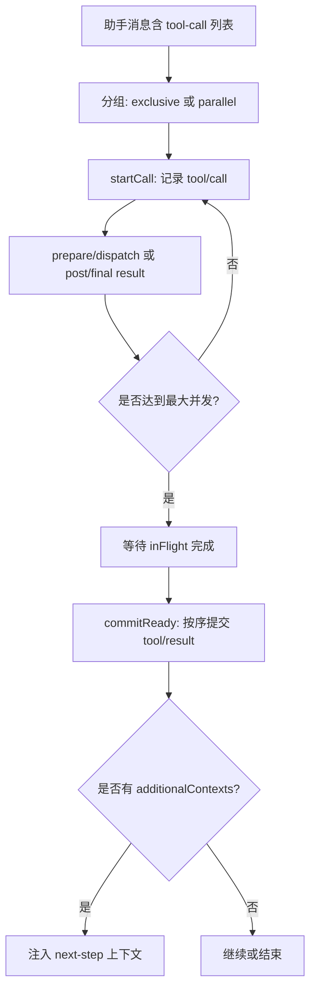
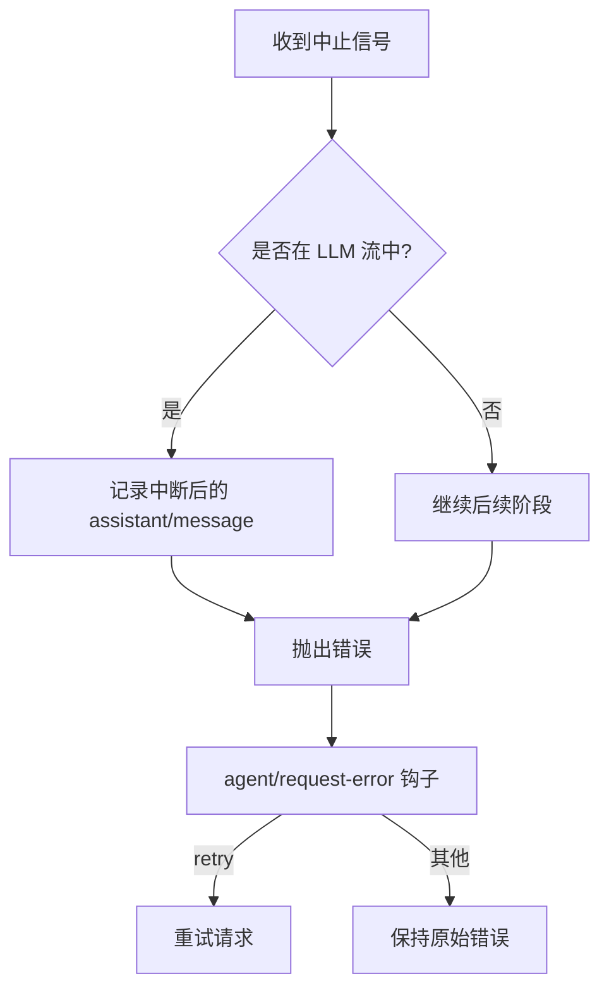
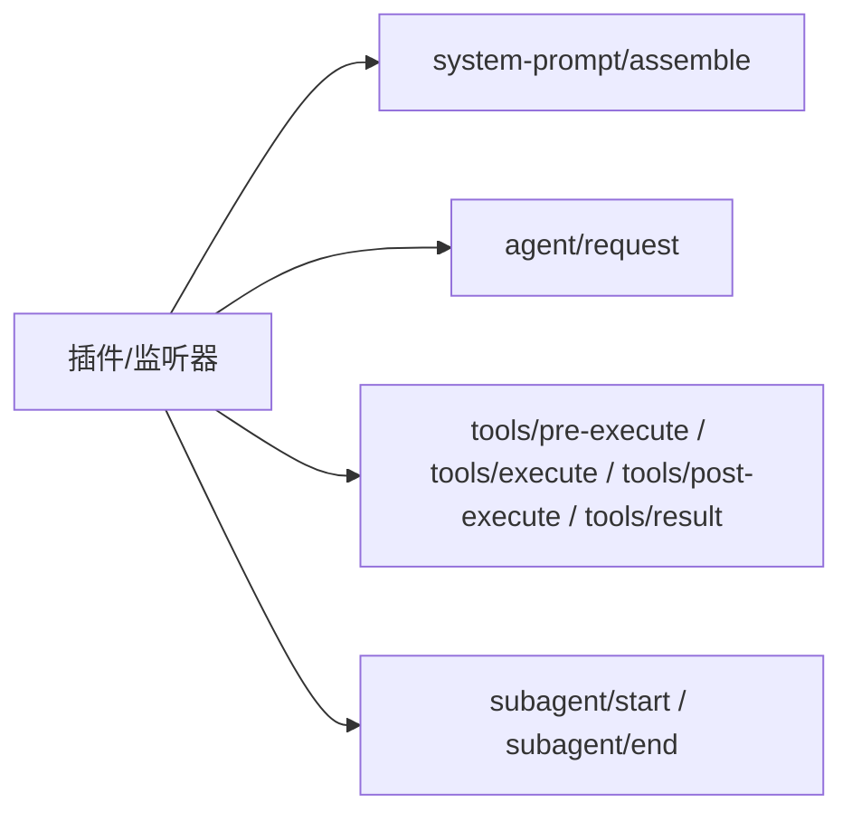
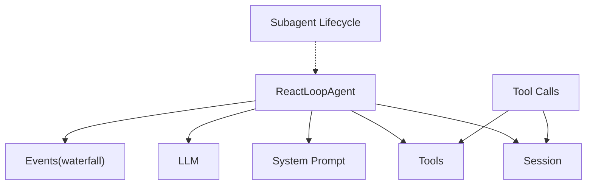

# Agent 生命周期

<cite>
**本文引用的文件**
- [packages/core/agent-loop/src/agent.ts](file://packages/core/agent-loop/src/agent.ts)
- [packages/core/agent-loop/src/tool-calls.ts](file://packages/core/agent-loop/src/tool-calls.ts)
- [packages/subagent/subagent/src/lifecycle.ts](file://packages/subagent/subagent/src/lifecycle.ts)
- [docs/agent-lifecycle.md](file://docs/agent-lifecycle.md)
- [docs/tool-execution-pipeline.md](file://docs/tool-execution-pipeline.md)
- [packages/core/agent/README.md](file://packages/core/agent/README.md)
</cite>

## 目录
1. [简介](#简介)
2. [项目结构](#项目结构)
3. [核心组件](#核心组件)
4. [架构总览](#架构总览)
5. [详细组件分析](#详细组件分析)
6. [依赖关系分析](#依赖关系分析)
7. [性能考量](#性能考量)
8. [故障排查指南](#故障排查指南)
9. [结论](#结论)
10. [附录](#附录)

## 简介
本文件系统性阐述 Agent 的完整生命周期，覆盖从创建、驱动运行到销毁的全过程；解释回合（turn）与步骤（step）的概念与执行流程；说明状态机转换、消息处理管道、工具调用机制；详述 agent/pre-step、agent/request、step/start、tool/call 等关键事件的触发时机与处理逻辑；并给出取消与错误恢复的实现细节以及扩展点与自定义行为的开发指南。

## 项目结构
围绕 Agent 生命周期的核心实现位于 agent-loop 包，负责回合/步骤驱动、事件派发、请求构建与 LLM 流式调用；工具执行由 tool-calls 模块调度；子代理的生命周期边缘在 subagent 包中发布；文档侧提供端到端序列图与工具执行流水线图。

图示来源
- [packages/core/agent-loop/src/agent.ts:64-516](file://packages/core/agent-loop/src/agent.ts#L64-L516)
- [packages/core/agent-loop/src/tool-calls.ts:59-290](file://packages/core/agent-loop/src/tool-calls.ts#L59-L290)
- [packages/subagent/subagent/src/lifecycle.ts:100-217](file://packages/subagent/subagent/src/lifecycle.ts#L100-L217)

章节来源
- [packages/core/agent-loop/src/agent.ts:64-516](file://packages/core/agent-loop/src/agent.ts#L64-L516)
- [packages/core/agent-loop/src/tool-calls.ts:59-290](file://packages/core/agent-loop/src/tool-calls.ts#L59-L290)
- [packages/subagent/subagent/src/lifecycle.ts:100-217](file://packages/subagent/subagent/src/lifecycle.ts#L100-L217)

## 核心组件
- ReactLoopAgent：驱动单个 Session 的 turn/step 边界，维护 idle/maintenance/running 三态，管理 Inbox 消息队列与唤醒，构造请求并驱动 LLM 流，协调工具调用与结果提交。
- 工具调度 executeToolCalls：按模型顺序组织工具调用，支持独占屏障与并行池，记录 tool/call 与 tool/result，处理中止与内部调度失败。
- 子代理生命周期：为一次性运行与可延续激活提供 start/end 边缘，聚合停止原因与最终输出。
- 事件与钩子：通过 waterfall 机制暴露 agent/pre-step、agent/request、agent/turn-stopping、agent/error 等扩展点。

章节来源
- [packages/core/agent-loop/src/agent.ts:64-516](file://packages/core/agent-loop/src/agent.ts#L64-L516)
- [packages/core/agent-loop/src/tool-calls.ts:59-290](file://packages/core/agent-loop/src/tool-calls.ts#L59-L290)
- [packages/subagent/subagent/src/lifecycle.ts:100-217](file://packages/subagent/subagent/src/lifecycle.ts#L100-L217)

## 架构总览
下图展示一次 followup 触发的完整流程：用户输入进入 Inbox，驱动开启 turn，pre-step 决策后打开 step，组装系统提示，发起 agent/request 并流式接收 assistant/chunk，完成后根据是否包含 tool-call 决定继续或结束；若存在工具调用，则进入工具执行管线，产出 tool/call 与 tool/result，必要时将上下文注入 next-step 以继续下一轮。

图示来源
- [docs/agent-lifecycle.md:8-72](file://docs/agent-lifecycle.md#L8-L72)
- [packages/core/agent-loop/src/agent.ts:245-420](file://packages/core/agent-loop/src/agent.ts#L245-L420)
- [packages/core/agent-loop/src/tool-calls.ts:59-290](file://packages/core/agent-loop/src/tool-calls.ts#L59-L290)

## 详细组件分析

### 回合与步骤的执行流程
- 回合（turn）：一次用户交互驱动的完整工作单元，包含一个或多个步骤。turn 开始于 turn/start，结束于 turn/end，结束时携带 reason（completed/max-tokens/blocked/error/aborted）。
- 步骤（step）：回合内的最小可观测执行单元，step/start 打开，step/end 关闭。每个 step 会尝试构建请求并驱动 LLM，可能产生多个 assistant/chunk，最终汇总为 assistant/message。
- 循环控制：当 step 完成且没有更多 next-step 待处理时，turn 结束；若有 pending 的 next-step，则进入下一个 step 直至自然停止或被拒绝。

图示来源
- [packages/core/agent-loop/src/agent.ts:245-420](file://packages/core/agent-loop/src/agent.ts#L245-L420)

章节来源
- [packages/core/agent-loop/src/agent.ts:245-420](file://packages/core/agent-loop/src/agent.ts#L245-L420)

### 状态机与消息处理
- 状态：idle、maintenance、running。running 下维护 turn、step、abort 信号与 wakeRequested。
- 消息入队：followup 进入 next-turn 并唤醒；steer 进入 next-step 并唤醒；inject 进入 next-step 但不唤醒。
- 唤醒与驱动：wakeDriver 在 idle 时启动 running 阶段并调用 kick；maintenance 或已中止的活动会 latch 唤醒直到收敛。
- 取消：cancel 清空 Inbox（可选）并 abort 当前活动；被中止的请求会在 step 中记录中断后的 assistant/message 并抛出错误。

图示来源
- [packages/core/agent-loop/src/agent.ts:64-223](file://packages/core/agent-loop/src/agent.ts#L64-L223)

章节来源
- [packages/core/agent-loop/src/agent.ts:64-223](file://packages/core/agent-loop/src/agent.ts#L64-L223)

### 关键事件与钩子
- agent/pre-step：在每个 proposed step 打开之前触发，携带 claimed 消息、turn/step、AbortSignal；可返回 reject 阻止该 step，或改写消息集合。
- agent/request：在构建请求前触发，允许修改 provider/model 等配置；必须最终提供 provider 与 model。
- step/start：打开一个步骤，随后写入 user/message 与系统提示。
- tool/call：工具调度在真正执行前记录调用事件；tool/result 按模型顺序提交结果，并可携带 additionalContexts 注入 next-step。
- agent/turn-stopping：当 turn 自然停止且 no more next-step 时触发，用于串行终检。
- agent/error：任何结构化错误都会在此边界上报，并保留给驱动层处理。

图示来源
- [packages/core/agent-loop/src/agent.ts:225-420](file://packages/core/agent-loop/src/agent.ts#L225-L420)
- [packages/core/agent-loop/src/tool-calls.ts:248-290](file://packages/core/agent-loop/src/tool-calls.ts#L248-L290)

章节来源
- [packages/core/agent-loop/src/agent.ts:225-420](file://packages/core/agent-loop/src/agent.ts#L225-L420)
- [packages/core/agent-loop/src/tool-calls.ts:248-290](file://packages/core/agent-loop/src/tool-calls.ts#L248-L290)

### 工具调用机制
- 执行模式：exclusive（独占屏障）与 parallel（并行池，受 maxParallelToolCalls 限制）。每次启动前重新分类以确保最新注册表生效。
- 有序提交：无论并发如何，tool/result 严格按模型顺序提交；additionalContexts 作为 next-step 上下文注入。
- 中止与失败：若信号中止，未开始的调用会被记录为合成错误结果；调度器内部失败会停止新调度并耗尽已启动调用，不伪造结果。

图示来源
- [packages/core/agent-loop/src/tool-calls.ts:59-246](file://packages/core/agent-loop/src/tool-calls.ts#L59-L246)

章节来源
- [packages/core/agent-loop/src/tool-calls.ts:59-246](file://packages/core/agent-loop/src/tool-calls.ts#L59-L246)

### 取消与错误恢复
- 取消传播：AbortController.signal 贯穿 pre-step、request、LLM 流与工具调度；收到中止后，step 内会记录中断后的 assistant/message（如有内容），并向上抛出错误。
- 恢复策略：agent/request-error 钩子可返回 retry 重试；dsh-compaction-basic 使用 agent/pre-step 进行压力检测，并在特定条件下进行工具结果裁剪与摘要选择，从而在失败 step 与失败 turn 之间恢复。
- 子代理终止：子代理 epoch 的 stopReason 基于其自身日志推导，确保“失败”不会因清理成功而被误报为“完成”。

图示来源
- [packages/core/agent-loop/src/agent.ts:332-420](file://packages/core/agent-loop/src/agent.ts#L332-L420)
- [docs/agent-lifecycle.md:74-79](file://docs/agent-lifecycle.md#L74-L79)
- [packages/subagent/subagent/src/lifecycle.ts:235-260](file://packages/subagent/subagent/src/lifecycle.ts#L235-L260)

章节来源
- [packages/core/agent-loop/src/agent.ts:332-420](file://packages/core/agent-loop/src/agent.ts#L332-L420)
- [docs/agent-lifecycle.md:74-79](file://docs/agent-lifecycle.md#L74-L79)
- [packages/subagent/subagent/src/lifecycle.ts:235-260](file://packages/subagent/subagent/src/lifecycle.ts#L235-L260)

### 扩展点与自定义行为
- 系统提示组装：system-prompt/assemble 可在 pre-step 前注入上下文，影响后续请求。
- 请求定制：agent/request 可调整 provider/model、maxTokens、reasoningEffort 等；首次请求会记录 request/header，变更时追加 request/header(change)。
- 工具管线：tools/pre-execute、tools/execute、tools/post-execute、tools/result 构成工具执行流水，支持权限、审批、超时、指标、结果重写与 UI 呈现。
- 子代理观察：subagent/start 与 subagent/end 提供统一的运行边缘，便于遥测与审计。

图示来源
- [packages/core/agent-loop/src/agent.ts:225-516](file://packages/core/agent-loop/src/agent.ts#L225-L516)
- [docs/tool-execution-pipeline.md:8-60](file://docs/tool-execution-pipeline.md#L8-L60)
- [packages/subagent/subagent/src/lifecycle.ts:100-217](file://packages/subagent/subagent/src/lifecycle.ts#L100-L217)

章节来源
- [packages/core/agent-loop/src/agent.ts:225-516](file://packages/core/agent-loop/src/agent.ts#L225-L516)
- [docs/tool-execution-pipeline.md:8-60](file://docs/tool-execution-pipeline.md#L8-L60)
- [packages/subagent/subagent/src/lifecycle.ts:100-217](file://packages/subagent/subagent/src/lifecycle.ts#L100-L217)

## 依赖关系分析
- ReactLoopAgent 依赖：
  - Session：持久化 turn/step、消息、工具调用与结果。
  - System Prompt：组装系统提示与上下文。
  - LLM：prepareCall/stream 驱动模型调用。
  - Tools：执行模式判定、调度与结果提交。
  - Events：waterfall 机制暴露扩展点。
- Tool Calls 依赖：
  - Tools 运行时：prepare/dispatch/finalize 与 executionMode。
  - Session：记录 tool/call 与 tool/result。
- Subagent Lifecycle：
  - 与 Agent 接口解耦，仅通过事件与类型契约协作。

图示来源
- [packages/core/agent-loop/src/agent.ts:64-516](file://packages/core/agent-loop/src/agent.ts#L64-L516)
- [packages/core/agent-loop/src/tool-calls.ts:59-290](file://packages/core/agent-loop/src/tool-calls.ts#L59-L290)
- [packages/subagent/subagent/src/lifecycle.ts:100-217](file://packages/subagent/subagent/src/lifecycle.ts#L100-L217)

章节来源
- [packages/core/agent-loop/src/agent.ts:64-516](file://packages/core/agent-loop/src/agent.ts#L64-L516)
- [packages/core/agent-loop/src/tool-calls.ts:59-290](file://packages/core/agent-loop/src/tool-calls.ts#L59-L290)
- [packages/subagent/subagent/src/lifecycle.ts:100-217](file://packages/subagent/subagent/src/lifecycle.ts#L100-L217)

## 性能考量
- 流式处理：LLM 响应以 chunk 形式追加，减少内存峰值并提升交互延迟。
- 工具并发：parallel 模式受 maxParallelToolCalls 限制，避免资源争用；exclusive 模式作为屏障保证顺序。
- 请求头缓存：首次请求记录 header，后续变更才追加，降低重复开销。
- 上下文窗口：根据 adapter 提供的 contextWindow 动态感知，避免溢出。

[本节为通用指导，无需具体文件引用]

## 故障排查指南
- 常见错误来源：
  - LLM 流中断：检查 AbortSignal 与 cancel 调用路径，确认 assistant/message 是否记录了中断内容。
  - 工具调用失败：查看 tool/call 与 tool/result 事件，定位 is/isError 与 error.info。
  - 请求构建失败：确认 agent/request 是否返回了有效的 provider/model。
- 恢复手段：
  - 使用 agent/request-error 钩子实现重试或降级。
  - 利用 agent/pre-step 进行压力检测与上下文裁剪，辅助恢复。
  - 子代理 stopReason 基于其自身日志推导，优先信任子代理事件。

章节来源
- [packages/core/agent-loop/src/agent.ts:332-420](file://packages/core/agent-loop/src/agent.ts#L332-L420)
- [packages/core/agent-loop/src/tool-calls.ts:248-290](file://packages/core/agent-loop/src/tool-calls.ts#L248-L290)
- [packages/subagent/subagent/src/lifecycle.ts:235-260](file://packages/subagent/subagent/src/lifecycle.ts#L235-L260)

## 结论
Agent 生命周期以 turn/step 为核心边界，结合 Inbox 消息队列、waterfall 扩展点与工具调度，形成高内聚、低耦合的可观测执行框架。通过明确的取消与错误恢复机制，以及丰富的扩展点，开发者可以安全地定制提示、请求、工具与子代理行为，满足多样化业务需求。

[本节为总结性内容，无需具体文件引用]

## 附录
- 术语
  - Turn：一次用户交互驱动的完整工作单元。
  - Step：turn 内的最小可观测执行单元。
  - Inbox：Agent 拥有的持久化消息投影，支持插入、丢弃、认领等操作。
- 参考
  - Agent 接口与 Inbox 行为见 README。
  - 工具执行流水线见工具执行文档。
  - 子代理生命周期事件见 subagent lifecycle。

章节来源
- [packages/core/agent/README.md:63-73](file://packages/core/agent/README.md#L63-L73)
- [docs/tool-execution-pipeline.md:8-60](file://docs/tool-execution-pipeline.md#L8-L60)
- [packages/subagent/subagent/src/lifecycle.ts:100-217](file://packages/subagent/subagent/src/lifecycle.ts#L100-L217)