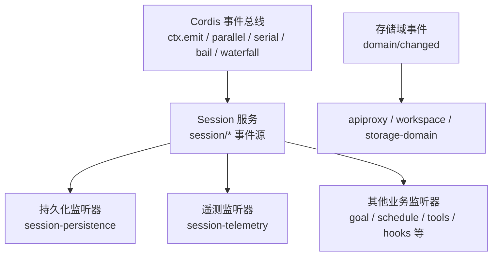
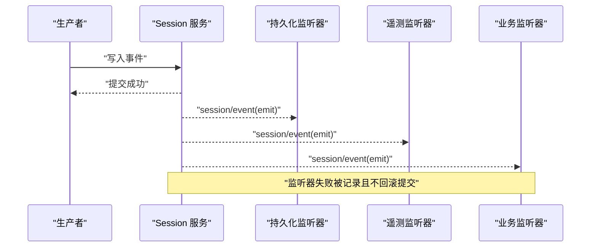
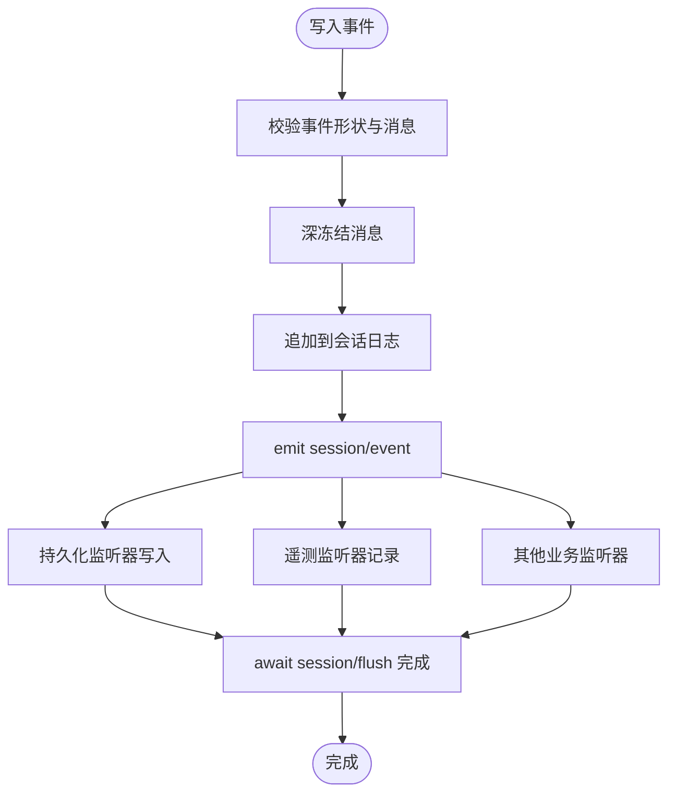
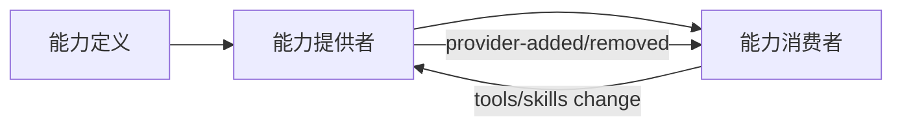
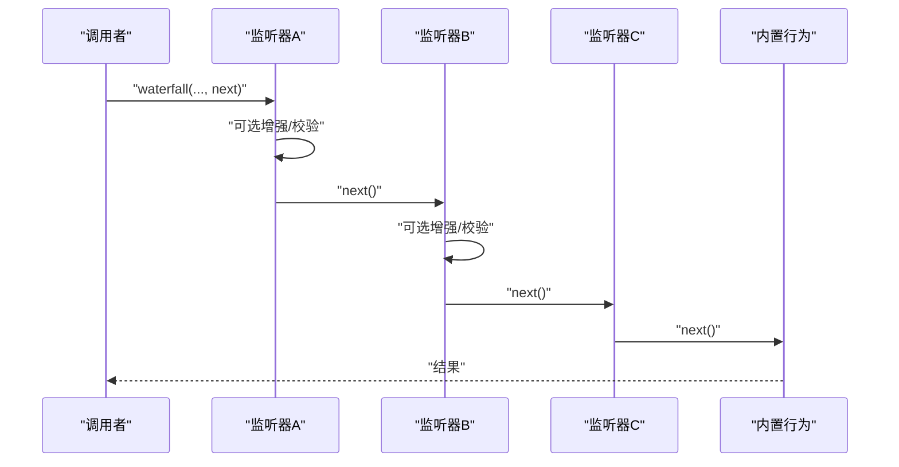
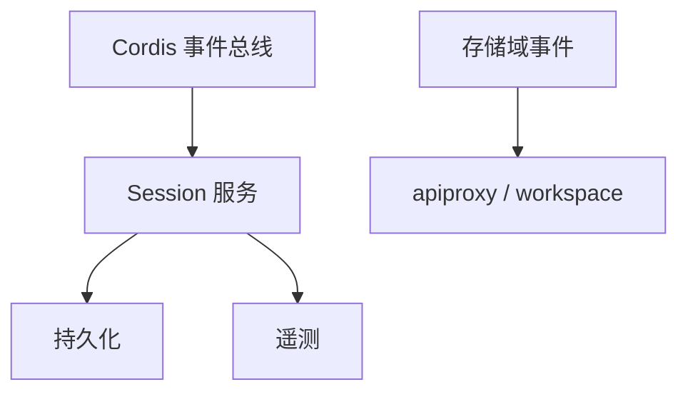

# 事件系统

<cite>
**本文引用的文件**
- [packages/core/session/src/index.ts](file://packages/core/session/src/index.ts)
- [packages/core/session/src/types.ts](file://packages/core/session/src/types.ts)
- [packages/core/agent-loop/src/index.ts](file://packages/core/agent-loop/src/index.ts)
- [packages/storage/storage-domain/src/events.ts](file://packages/storage/storage-domain/src/events.ts)
- [docs/cordis-api/events.md](file://docs/cordis-api/events.md)
- [docs/event-producer-consumer.md](file://docs/event-producer-consumer.md)
- [.agents/notes/implemented/architecture/2026-06-30-event-domain-semantics.md](file://.agents/notes/implemented/architecture/2026-06-30-event-domain-semantics.md)
- [.agents/notes/implemented/simplification/2026-06-20-remove-agent-boundary-mirror-events.md](file://.agents/notes/implemented/simplification/2026-06-20-remove-agent-boundary-mirror-events.md)
</cite>

## 目录
1. [简介](#简介)
2. [项目结构](#项目结构)
3. [核心组件](#核心组件)
4. [架构总览](#架构总览)
5. [详细组件分析](#详细组件分析)
6. [依赖关系分析](#依赖关系分析)
7. [性能考虑](#性能考虑)
8. [故障排查指南](#故障排查指南)
9. [结论](#结论)
10. [附录](#附录)

## 简介
本文件面向 DeepSeek Harness 的事件系统，聚焦类型安全的事件驱动通信机制，覆盖 Session 事件、Agent 事件、Capability（能力）相关事件的分类与使用场景；阐述事件的持久化存储、广播机制与监听器模式；解释水泻式事件（waterfall events）的处理流程与 next() 委托机制；给出事件定义规范、生产者-消费者最佳实践，以及调试工具与性能优化建议。

## 项目结构
事件系统由“事件总线 + 领域事件源 + 监听器”构成：
- 事件总线：基于 Cordis 的 ctx.emit / ctx.parallel / ctx.serial / ctx.bail / ctx.waterfall 等分发模式，提供同步、并行、串行、短路和水泻式调用语义。
- 领域事件源：Session 服务作为事件源，维护追加型会话日志，并通过 session/* 事件对外暴露变更；存储域通过 domain/changed 事件推送跨进程变更。
- 监听器：各子系统订阅事件完成副作用（如持久化、遥测、UI 更新、权限策略、压缩策略等）。



图表来源
- [docs/cordis-api/events.md:8-123](file://docs/cordis-api/events.md#L8-L123)
- [packages/core/session/src/index.ts:37-86](file://packages/core/session/src/index.ts#L37-L86)
- [packages/storage/storage-domain/src/events.ts:36-47](file://packages/storage/storage-domain/src/events.ts#L36-L47)

章节来源
- [docs/cordis-api/events.md:8-123](file://docs/cordis-api/events.md#L8-L123)
- [packages/core/session/src/index.ts:37-86](file://packages/core/session/src/index.ts#L37-L86)
- [packages/storage/storage-domain/src/events.ts:36-47](file://packages/storage/storage-domain/src/events.ts#L36-L47)

## 核心组件
- 事件分发模式（DispatchMode）
  - emit：同步触发，忽略返回值。
  - parallel：并发执行所有监听器，全部完成后返回。
  - serial：按序等待监听器，直到某个监听器返回“中止值”。
  - bail：按序同步调用，遇到第一个“中止值”即停止。
  - waterfall：最后一个参数为 next 延续函数，监听器可调用 next() 将控制传递给下一个监听器或内置行为，不调用则拦截。
- Session 事件
  - session/created：会话创建公告，支持作用域过滤。
  - session/disposed：会话销毁公告。
  - session/event：追加型事件流，监听器在提交后异步接收。
  - session/flush：并行等待持久化检查点。
- 存储域事件
  - domain/changed：每次写操作成功后发出，携带新快照与操作判别符，用于跨进程变更推送。
- Agent 事件
  - agent/*：运行时信号，向插件传递 Agent 句柄，与 session/* 的“事实日志”职责分离。

章节来源
- [docs/cordis-api/events.md:8-123](file://docs/cordis-api/events.md#L8-L123)
- [packages/core/session/src/index.ts:37-86](file://packages/core/session/src/index.ts#L37-L86)
- [packages/storage/storage-domain/src/events.ts:36-47](file://packages/storage/storage-domain/src/events.ts#L36-L47)
- [.agents/notes/implemented/architecture/2026-06-30-event-domain-semantics.md:1-17](file://.agents/notes/implemented/architecture/2026-06-30-event-domain-semantics.md#L1-L17)

## 架构总览
事件系统遵循“会话是事实日志，Agent 是实时通道”的领域语义。Session 事件承载可重放的持久化日志；Agent 事件承载运行期信号，便于插件持有 Agent 句柄进行交互。两者职责清晰，避免重复事实源。



图表来源
- [packages/core/session/src/index.ts:65-86](file://packages/core/session/src/index.ts#L65-L86)

章节来源
- [.agents/notes/implemented/architecture/2026-06-30-event-domain-semantics.md:1-17](file://.agents/notes/implemented/architecture/2026-06-30-event-domain-semantics.md#L1-L17)
- [packages/core/session/src/index.ts:65-86](file://packages/core/session/src/index.ts#L65-L86)

## 详细组件分析

### Session 事件与持久化
- 会话生命周期事件
  - session/created：会话进入 store 并公告，支持作用域过滤。
  - session/disposed：会话离开 store，包含发布回滚场景。
- 事件流与持久化
  - session/event：追加型事件流，监听器在提交后异步接收；监听器异常被隔离，不影响提交。
  - session/flush：并行等待所有监听器完成，用于持久化检查点。
- 数据模型
  - SessionId、SessionHeader、SessionEvent 等类型确保不可变与版本兼容。
  - 头信息校验与冻结保证跨边界传输的安全性。



图表来源
- [packages/core/session/src/index.ts:65-86](file://packages/core/session/src/index.ts#L65-L86)
- [packages/core/session/src/types.ts:21-99](file://packages/core/session/src/types.ts#L21-L99)

章节来源
- [packages/core/session/src/index.ts:65-86](file://packages/core/session/src/index.ts#L65-L86)
- [packages/core/session/src/types.ts:21-99](file://packages/core/session/src/types.ts#L21-L99)

### Agent 事件与运行时信号
- 职责分离
  - session/* 是事实日志；agent/* 是运行期信号，传递 Agent 句柄给插件。
- 典型事件
  - agent/created、agent/disposed：Agent 生命周期。
  - agent/status、agent/error：状态与错误上报。
  - agent/request、agent/pre-step、agent/request-error：请求处理链路与错误恢复。
- 去镜像化
  - 已移除部分“边界镜像”事件，统一以 session 日志为准，减少双真相源。

```mermaid
sequenceDiagram
participant Loop as "Agent 循环"
participant Agent as "Agent"
participant Sub as "子模块/监听器"
Loop->>Agent : "agent/created"
Loop->>Sub : "agent/status / agent/inbox/*"
Loop->>Loop : "agent/pre-step (waterfall)"
Loop->>Loop : "agent/request (waterfall)"
Loop->>Sub : "agent/error (emit)"
Loop->>Agent : "agent/disposed"
```

图表来源
- [packages/core/agent-loop/src/index.ts:160-184](file://packages/core/agent-loop/src/index.ts#L160-L184)
- [docs/event-producer-consumer.md:10-23](file://docs/event-producer-consumer.md#L10-L23)
- [.agents/notes/implemented/simplification/2026-06-20-remove-agent-boundary-mirror-events.md:17-23](file://.agents/notes/implemented/simplification/2026-06-20-remove-agent-boundary-mirror-events.md#L17-L23)

章节来源
- [packages/core/agent-loop/src/index.ts:160-184](file://packages/core/agent-loop/src/index.ts#L160-L184)
- [docs/event-producer-consumer.md:10-23](file://docs/event-producer-consumer.md#L10-L23)
- [.agents/notes/implemented/simplification/2026-06-20-remove-agent-boundary-mirror-events.md:17-23](file://.agents/notes/implemented/simplification/2026-06-20-remove-agent-boundary-mirror-events.md#L17-L23)

### Capability 事件与能力接缝
- 能力接缝采用“服务定义 / 服务提供者 / 消费者”三角色解耦，事件用于能力状态变化通知（如 provider-added / provider-removed）。
- 典型能力事件
  - subagent/provider-added、subagent/provider-removed：子代理提供者注册与注销。
  - skills/change：技能变更通知。
  - tools/change：工具注册表变更。
- 事件矩阵参考
  - 通过事件矩阵文档可快速定位某事件的声明方、分发方与监听方。



图表来源
- [docs/event-producer-consumer.md:50-62](file://docs/event-producer-consumer.md#L50-L62)

章节来源
- [docs/event-producer-consumer.md:50-62](file://docs/event-producer-consumer.md#L50-L62)

### 水泻式事件（Waterfall Events）与 next() 委托
- 适用场景
  - 需要按顺序组合多个监听器的处理逻辑，允许前置监听器对后续处理进行增强或拦截。
- 典型事件
  - agent/pre-step、agent/request、agent/request-error、fs/write-intent、fs/edit-intent、llm/stream、tools/pre-execute、tools/post-execute、system-prompt/assemble 等。
- next() 委托机制
  - 每个监听器可选择调用 next() 继续链式处理，不调用则视为拦截（veto）。
  - 最终会调用内置行为或最后一个监听器的默认实现。



图表来源
- [docs/cordis-api/events.md:97-123](file://docs/cordis-api/events.md#L97-L123)
- [docs/event-producer-consumer.md:18-23](file://docs/event-producer-consumer.md#L18-L23)

章节来源
- [docs/cordis-api/events.md:97-123](file://docs/cordis-api/events.md#L97-L123)
- [docs/event-producer-consumer.md:18-23](file://docs/event-producer-consumer.md#L18-L23)

### 事件定义规范
- 命名约定
  - 使用“领域/动作”形式，如 session/created、agent/status、domain/changed。
- 模式选择
  - emit：无副作用或轻量副作用的通知。
  - parallel：需要并行完成的副作用（如持久化检查点）。
  - serial/bail：需要顺序处理且可能短路。
  - waterfall：需要链式组合与拦截。
- 类型安全
  - 通过扩展 Events 接口声明事件签名，确保参数与返回值类型正确。
- 版本兼容
  - Session 事件通过 SESSION_FORMAT_VERSION 与 SessionHeader 管理版本；新增事件类型应使用 ignorable 守卫，结构性变更才需升级版本。

章节来源
- [docs/cordis-api/events.md:173-205](file://docs/cordis-api/events.md#L173-L205)
- [packages/core/session/src/types.ts:33-56](file://packages/core/session/src/types.ts#L33-L56)
- [packages/core/session/src/types.ts:61-99](file://packages/core/session/src/types.ts#L61-L99)

### 生产者-消费者最佳实践
- 明确职责
  - 生产者只负责可靠地发出事件；消费者专注副作用，避免相互耦合。
- 幂等与容错
  - 监听器应幂等；异常不应影响生产者的提交。
- 作用域与过滤
  - 使用作用域过滤限制事件传播范围，降低无关监听器的开销。
- 批量与节流
  - 对高频事件（如 session/event）做批处理或节流，避免 I/O 风暴。
- 可观测性
  - 通过遥测与日志记录关键路径，便于问题定位。

章节来源
- [packages/core/session/src/index.ts:65-86](file://packages/core/session/src/index.ts#L65-L86)
- [docs/event-producer-consumer.md:8-69](file://docs/event-producer-consumer.md#L8-L69)

## 依赖关系分析
- 松耦合
  - 事件总线与领域解耦，新增监听器无需修改生产者。
- 直接依赖
  - Session 服务依赖 Cordis 事件总线；存储域事件独立于 Session。
- 间接依赖
  - 各业务监听器通过事件订阅形成间接依赖，避免强引用。



图表来源
- [packages/core/session/src/index.ts:37-86](file://packages/core/session/src/index.ts#L37-L86)
- [packages/storage/storage-domain/src/events.ts:36-47](file://packages/storage/storage-domain/src/events.ts#L36-L47)

章节来源
- [packages/core/session/src/index.ts:37-86](file://packages/core/session/src/index.ts#L37-L86)
- [packages/storage/storage-domain/src/events.ts:36-47](file://packages/storage/storage-domain/src/events.ts#L36-L47)

## 性能考虑
- 选择合适的分发模式
  - 高吞吐通知使用 emit；需要并行完成的副作用使用 parallel；需要顺序控制的逻辑使用 serial/bail；需要链式组合使用 waterfall。
- 监听器优化
  - 避免在监听器中进行阻塞 I/O；必要时使用队列与批处理。
- 作用域过滤
  - 利用作用域过滤减少不必要的事件投递。
- 事件节流
  - 对高频事件（如 session/event）进行节流或合并，降低后端压力。
- 版本与兼容性
  - 谨慎升级 SESSION_FORMAT_VERSION，避免破坏旧运行时读取新日志的能力。

[本节为通用指导，不直接分析具体文件]

## 故障排查指南
- 常见问题
  - 事件未到达：检查监听器是否注册、作用域是否匹配、分发模式是否正确。
  - 监听器异常：确认异常未被吞掉，查看日志；监听器异常不应影响提交。
  - 持久化不一致：检查 session/flush 是否被调用，监听器是否完成。
- 调试建议
  - 启用遥测与日志，记录关键事件与错误。
  - 使用 once/on 临时订阅关键事件，验证链路。
  - 对于 waterfall 事件，逐步注释监听器，定位拦截点。

章节来源
- [packages/core/session/src/index.ts:65-86](file://packages/core/session/src/index.ts#L65-L86)
- [docs/cordis-api/events.md:8-123](file://docs/cordis-api/events.md#L8-L123)

## 结论
Harness 的事件系统以 Session 为事实日志、Agent 为实时通道，结合多种分发模式与水泻式链式处理，实现了类型安全、可扩展、可观测的事件驱动通信。通过明确的领域语义、严格的版本管理与监听器最佳实践，系统在复杂场景中保持了高内聚、低耦合与高性能。

[本节为总结，不直接分析具体文件]

## 附录
- 事件矩阵与示例
  - 参见事件生产者-消费者矩阵，了解各事件的声明方、分发方与监听方。
- 参考文档
  - Cordis 事件 API、Session 类型定义、存储域事件定义。

章节来源
- [docs/event-producer-consumer.md:8-69](file://docs/event-producer-consumer.md#L8-L69)
- [docs/cordis-api/events.md:8-123](file://docs/cordis-api/events.md#L8-L123)
- [packages/core/session/src/types.ts:21-99](file://packages/core/session/src/types.ts#L21-L99)
- [packages/storage/storage-domain/src/events.ts:36-47](file://packages/storage/storage-domain/src/events.ts#L36-L47)