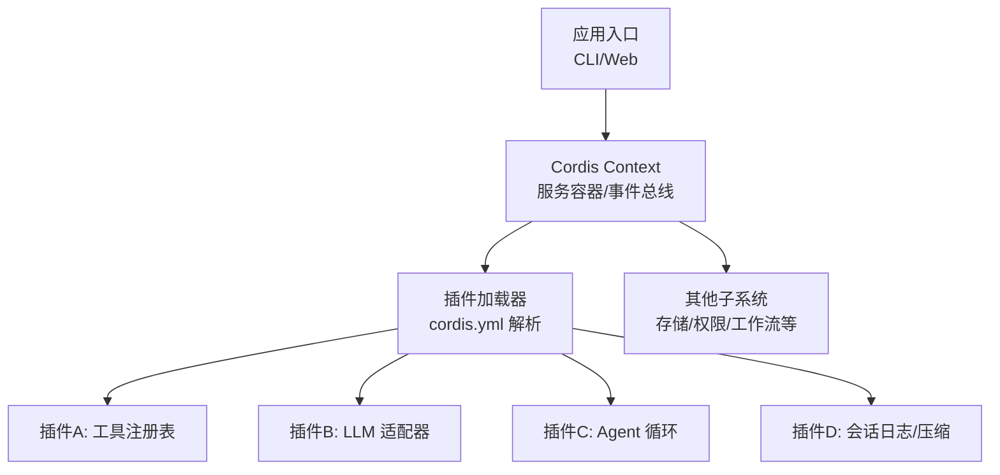
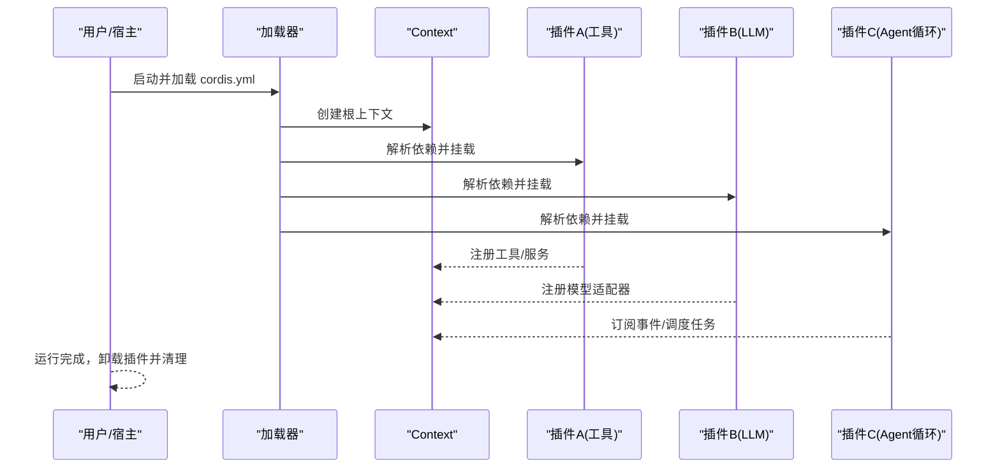
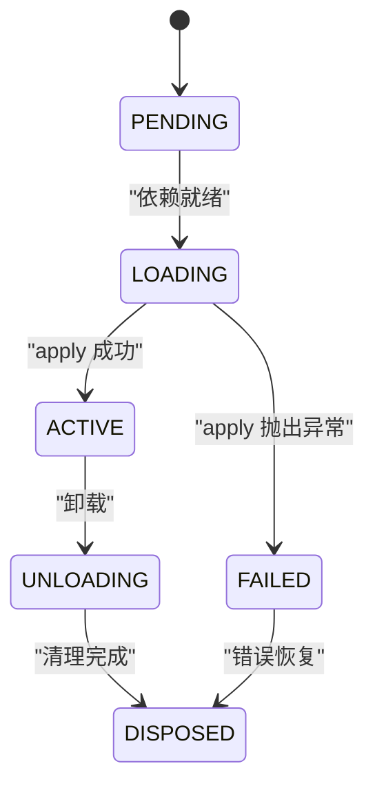
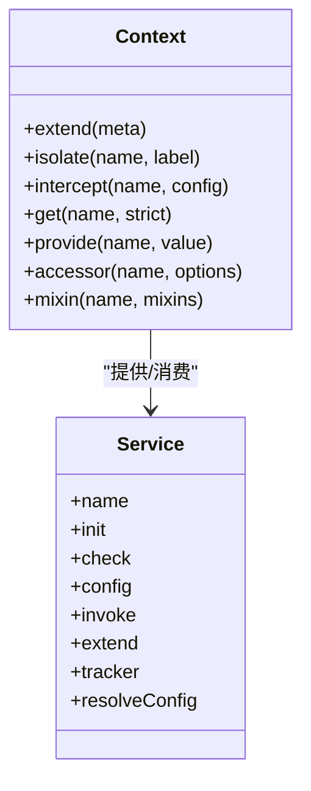
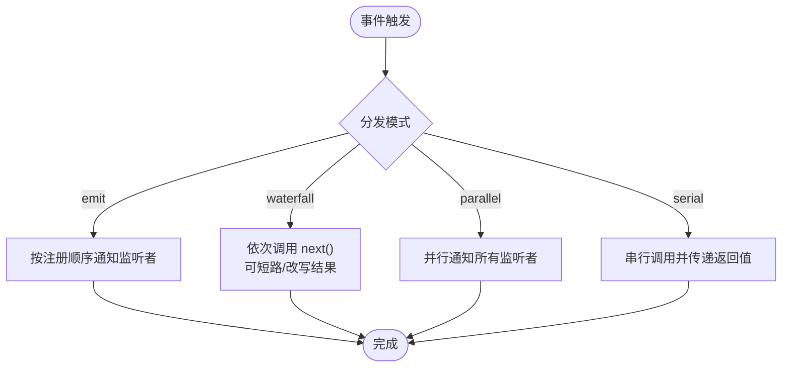
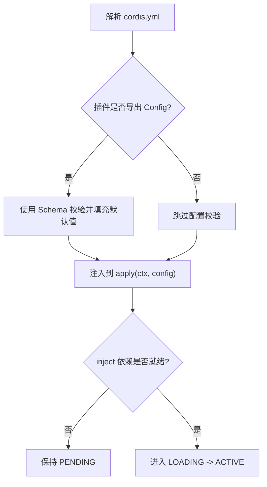
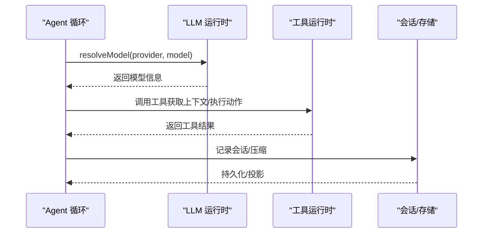
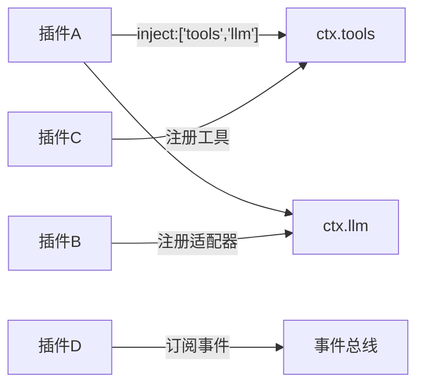

# 插件系统

<cite>
**本文引用的文件**
- [docs/cordis-primer.md](file://docs/cordis-primer.md)
- [docs/user/develop/framework/index.md](file://docs/user/develop/framework/index.md)
- [docs/cordis-api/context.md](file://docs/cordis-api/context.md)
- [docs/cordis-api/service.md](file://docs/cordis-api/service.md)
- [docs/cordis-tutorial/index.md](file://docs/cordis-tutorial/index.md)
- [docs/cordis-tutorial/05-config.md](file://docs/cordis-tutorial/05-config.md)
- [apps/cli/config/agent-presets/cordis/agent.cordis.yml](file://apps/cli/config/agent-presets/cordis/agent.cordis.yml)
- [scripts/gen-config-catalog.ts](file://scripts/gen-config-catalog.ts)
- [packages/core/agent-loop/tests/request-reconstruction.spec.ts](file://packages/core/agent-loop/tests/request-reconstruction.spec.ts)
</cite>

## 目录
1. [简介](#简介)
2. [项目结构](#项目结构)
3. [核心组件](#核心组件)
4. [架构总览](#架构总览)
5. [详细组件分析](#详细组件分析)
6. [依赖分析](#依赖分析)
7. [性能考虑](#性能考虑)
8. [故障排查指南](#故障排查指南)
9. [结论](#结论)
10. [附录](#附录)

## 简介
本文件系统性阐述 DeepSeek Harness 中 Cordis 插件框架的工作原理与最佳实践，覆盖插件生命周期、服务注册、事件驱动通信、配置格式与校验、依赖声明与版本兼容性处理，以及内置能力（模型适配器、工具注册表、会话日志、Agent 循环等）的实现方式。同时提供自定义插件开发指南、调试技巧与工程化建议，帮助读者从零构建可维护、可扩展的插件生态。

## 项目结构
Cordis 是 DeepSeek Harness 的插件框架，位于 vendored 源码中，并通过文档与脚本生成 API 参考与配置目录。仓库中与插件系统直接相关的组织方式如下：
- 概念与教程：docs/cordis-primer.md、docs/cordis-tutorial/*、docs/user/develop/framework/index.md
- 运行时 API：docs/cordis-api/context.md、docs/cordis-api/service.md
- 配置与加载：scripts/gen-config-catalog.ts、apps/cli/config/agent-presets/cordis/agent.cordis.yml
- 内置能力示例：packages/core/agent-loop/tests/request-reconstruction.spec.ts（展示 LLM 适配器注册与 Agent 循环集成）

图表来源
- [docs/cordis-api/context.md:120-160](file://docs/cordis-api/context.md#L120-L160)
- [apps/cli/config/agent-presets/cordis/agent.cordis.yml:1-264](file://apps/cli/config/agent-presets/cordis/agent.cordis.yml#L1-L264)

章节来源
- [docs/cordis-primer.md:7-13](file://docs/cordis-primer.md#L7-L13)
- [docs/cordis-tutorial/index.md:1-11](file://docs/cordis-tutorial/index.md#L1-L11)

## 核心组件
- 上下文（Context）：服务容器与事件总线，所有能力通过 ctx 暴露；支持扩展、隔离、拦截、反射与混合方法。
- 服务（Service）：以命名键注册到 ctx 的能力单元，支持构造后初始化、配置注入、可调用封装、追踪元数据等。
- 插件（Plugin）：实现 Service 的对象或函数，包含 inject 依赖声明与 apply(ctx, config) 生命周期钩子。
- 事件（Events）：typed events，支持 emit/waterfall/parallel/serial 多种分发模式，用于跨插件通信与策略拦截。
- 效果（Effects）：通过 ctx.effect() 注册的资源与清理逻辑，随插件卸载自动回滚。

章节来源
- [docs/cordis-api/context.md:14-160](file://docs/cordis-api/context.md#L14-L160)
- [docs/cordis-api/service.md:4-103](file://docs/cordis-api/service.md#L4-L103)
- [docs/cordis-primer.md:7-13](file://docs/cordis-primer.md#L7-L13)

## 架构总览
Cordis 将“能力即插件”的理念贯穿始终：每个功能模块都是一个插件，通过依赖声明和事件进行解耦协作。加载器从 cordis.yml 读取条目，按依赖关系激活插件，并在活跃期间维护其 Fiber 生命周期。

图表来源
- [docs/cordis-api/context.md:120-160](file://docs/cordis-api/context.md#L120-L160)
- [apps/cli/config/agent-presets/cordis/agent.cordis.yml:1-264](file://apps/cli/config/agent-presets/cordis/agent.cordis.yml#L1-L264)

## 详细组件分析

### 插件生命周期管理
- Fiber 状态机：PENDING → LOADING → ACTIVE，失败进入 FAILED，正常卸载路径为 ACTIVE → UNLOADING → DISPOSED。
- 依赖驱动加载：通过 inject 声明所需服务，等待就绪后再执行 apply；若依赖消失则自动卸载并重新加载。
- 自动清理：ctx.on、工具注册、LLM 适配器注册、effect 返回的清理函数在卸载时按逆序并发回收。
- 嵌套上下文：ctx.plugin(child) 创建子 Fiber，继承父上下文但拥有独立生命周期。
- 热替换（HMR）：编辑插件源文件触发卸载旧实例、加载新代码、执行新 apply，注册项不会残留。

图表来源
- [docs/user/develop/framework/index.md:7-24](file://docs/user/develop/framework/index.md#L7-L24)

章节来源
- [docs/user/develop/framework/index.md:26-107](file://docs/user/develop/framework/index.md#L26-L107)

### 服务注册机制
- 通过 ctx.provide(name, value) 注册当前 Fiber 拥有的服务，卸载时自动注销。
- 通过 ctx.accessor 定义计算属性，通过 ctx.mixin 将服务方法混入 ctx 快捷访问。
- 通过 ctx.isolate(name, label) 创建服务级隔离作用域，便于多实现共存或测试替换。
- 通过 ctx.intercept(name, config) 为下游插件合并服务配置，实现可插拔策略。

图表来源
- [docs/cordis-api/context.md:14-160](file://docs/cordis-api/context.md#L14-L160)
- [docs/cordis-api/service.md:14-103](file://docs/cordis-api/service.md#L14-L103)

章节来源
- [docs/cordis-api/context.md:237-365](file://docs/cordis-api/context.md#L237-L365)
- [docs/cordis-api/service.md:4-103](file://docs/cordis-api/service.md#L4-L103)

### 事件驱动通信
- 事件类型通过 TypeScript 声明合并扩展，确保类型安全。
- 分发模式：
  - emit：无返回值，按注册顺序观察。
  - waterfall：中间件式，允许短路或改写结果。
  - parallel：并行执行，等待全部完成。
  - serial：串行执行，按注册顺序传递返回值。
- 使用场景：工具管线拦截、模型请求包装、策略决策、审计与遥测。

图表来源
- [docs/cordis-primer.md:15-34](file://docs/cordis-primer.md#L15-L34)

章节来源
- [docs/cordis-primer.md:15-34](file://docs/cordis-primer.md#L15-L34)

### 配置格式、依赖声明与版本兼容
- 配置格式：
  - cordis.yml 中每个条目可携带 config 块，由插件导出的 Schema 验证并填充默认值。
  - 支持 !!js 表达式与 include 插值，disabled 字段可在挂载决策时求值。
- 依赖声明：
  - 通过 inject 数组声明强依赖，未就绪时插件处于 PENDING；依赖消失则自动卸载并重建。
- 版本兼容：
  - 通过 Service.resolveConfig 与 intercept 机制，上层可为不同版本的服务提供差异化配置。
  - 通过 isolate 作用域隔离不同实现，避免冲突。

图表来源
- [docs/cordis-tutorial/05-config.md:1-66](file://docs/cordis-tutorial/05-config.md#L1-L66)
- [scripts/gen-config-catalog.ts:616-654](file://scripts/gen-config-catalog.ts#L616-L654)
- [docs/cordis-primer.md:36-38](file://docs/cordis-primer.md#L36-L38)

章节来源
- [docs/cordis-tutorial/05-config.md:1-66](file://docs/cordis-tutorial/05-config.md#L1-L66)
- [scripts/gen-config-catalog.ts:616-654](file://scripts/gen-config-catalog.ts#L616-L654)
- [docs/cordis-primer.md:36-38](file://docs/cordis-primer.md#L36-L38)

### 内置插件与能力实现要点
- 模型适配器（LLM Adapter）：
  - 通过 ctx.llm.registerAdapter(names, adapter) 注册，供 Agent 循环选择与调用。
  - 支持推理努力（efforts）、请求日志与精确模型解析。
- 工具注册表（Tools Registry）：
  - 通过 ctx.tools.register(tool) 注册工具，被 Agent 循环与 UI 发现与调用。
- 会话日志与压缩：
  - 通过 compaction 相关插件对会话内容进行裁剪与折叠，减少上下文体积。
- Agent 循环：
  - 基于事件与工具调用驱动模型交互，结合计划、目标、工作流等子系统形成完整闭环。

图表来源
- [packages/core/agent-loop/tests/request-reconstruction.spec.ts:254-284](file://packages/core/agent-loop/tests/request-reconstruction.spec.ts#L254-L284)

章节来源
- [packages/core/agent-loop/tests/request-reconstruction.spec.ts:254-284](file://packages/core/agent-loop/tests/request-reconstruction.spec.ts#L254-L284)

### 插件开发指南
- 创建自定义插件：
  - 导出 name、可选 Config schema、apply(ctx, config)。
  - 使用 inject 声明强依赖，避免手动排序。
- 注册服务：
  - 使用 ctx.provide 注册能力，或使用 Service 子类自动注册。
  - 通过 ctx.accessor/mixin 暴露便捷接口。
- 处理事件：
  - 使用 ctx.on 订阅事件；必要时使用 ctx.waterfall 参与中间件链。
- 管理资源：
  - 使用 ctx.effect 注册资源与清理函数，确保卸载时正确释放。
- 组合与 HMR：
  - 通过 cordis.yml 组合多个插件；启用 HMR 提升开发效率。

章节来源
- [docs/cordis-tutorial/index.md:38-46](file://docs/cordis-tutorial/index.md#L38-L46)
- [docs/user/develop/framework/index.md:40-63](file://docs/user/develop/framework/index.md#L40-L63)

### 调试技巧与最佳实践
- 使用 ctx.get('service') 安全读取可选服务，避免未声明访问导致的错误。
- 在 apply 中尽量只做轻量初始化，重活放入 effect 或异步任务。
- 将相关清理逻辑集中在一个 effect 内，保证有序释放。
- 利用 isolate 隔离多实现或测试环境，避免全局污染。
- 借助 cordis.yml 的 disabled 与 !!js 表达式动态控制插件开关。
- 通过 HMR 快速迭代，确认卸载/重载行为符合预期。

章节来源
- [docs/user/develop/framework/index.md:40-107](file://docs/user/develop/framework/index.md#L40-L107)
- [apps/cli/config/agent-presets/cordis/agent.cordis.yml:45-51](file://apps/cli/config/agent-presets/cordis/agent.cordis.yml#L45-L51)

## 依赖分析
- 插件间耦合通过 ctx 服务键与事件名称解耦，降低直接引用。
- 加载器根据 inject 声明决定加载顺序，避免手工编排。
- 通过 isolate 与作用域合并（intercept）实现多实现共存与配置覆盖。
- 配置生成脚本会遍历包导出，分类插件类型并提取 inject 与配置类型，保障文档与类型一致性。

图表来源
- [scripts/gen-config-catalog.ts:616-654](file://scripts/gen-config-catalog.ts#L616-L654)
- [docs/cordis-api/context.md:120-160](file://docs/cordis-api/context.md#L120-L160)

章节来源
- [scripts/gen-config-catalog.ts:616-654](file://scripts/gen-config-catalog.ts#L616-L654)
- [docs/cordis-api/context.md:120-160](file://docs/cordis-api/context.md#L120-L160)

## 性能考虑
- 事件分发模式选择：高频短回调用 emit；需要改写流程用 waterfall；需并行处理用 parallel；需顺序累积用 serial。
- 资源释放：将相关清理放在同一 effect 内，避免分散导致竞态。
- 配置校验：尽早失败，避免无效配置进入运行期造成额外开销。
- 隔离作用域：合理使用 isolate 避免不必要的共享状态竞争。

[本节为通用指导，不直接分析具体文件]

## 故障排查指南
- 插件未加载：检查 inject 依赖是否满足；查看 cordis.yml 中 disabled 与 !!js 表达式。
- 服务不可用：确认 provide 的 Fiber 是否活跃；使用 ctx.get(strict=false) 临时放宽检查定位问题。
- 事件未触发：确认事件名与分发模式匹配；检查监听器注册时机是否在事件产生之前。
- 资源泄漏：确认 effect 返回的清理函数是否正确执行；在卸载阶段集中释放。
- 配置错误：依据 Schema 报错信息修正；确保 Config 导出为 Standard Schema 验证器。

章节来源
- [docs/user/develop/framework/index.md:40-107](file://docs/user/develop/framework/index.md#L40-L107)
- [docs/cordis-tutorial/05-config.md:53-66](file://docs/cordis-tutorial/05-config.md#L53-L66)

## 结论
Cordis 以“插件即能力”为核心，通过依赖驱动的加载、类型安全的事件通信、可逆的效果管理与灵活的配置机制，构建了高内聚、低耦合的扩展体系。掌握生命周期、服务注册、事件模式与配置校验，即可高效开发与集成模型适配器、工具注册表、会话日志与 Agent 循环等关键能力，并在此基础上构建稳定可靠的插件生态。

[本节为总结性内容，不直接分析具体文件]

## 附录
- 快速上手：参考 Cordis 教程逐步构建第一个插件，理解生命周期、服务、事件与配置。
- 实战参考：阅读 agent.cordis.yml 了解真实部署中的插件组合与隔离策略。
- 生成文档：通过脚本生成配置目录与 API 参考，确保文档与代码一致。

章节来源
- [docs/cordis-tutorial/index.md:1-11](file://docs/cordis-tutorial/index.md#L1-L11)
- [apps/cli/config/agent-presets/cordis/agent.cordis.yml:1-264](file://apps/cli/config/agent-presets/cordis/agent.cordis.yml#L1-L264)
- [scripts/gen-config-catalog.ts:616-654](file://scripts/gen-config-catalog.ts#L616-L654)