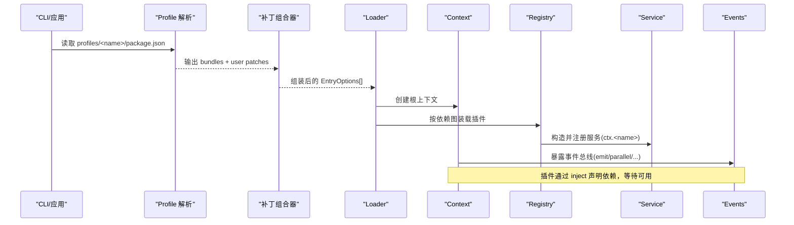
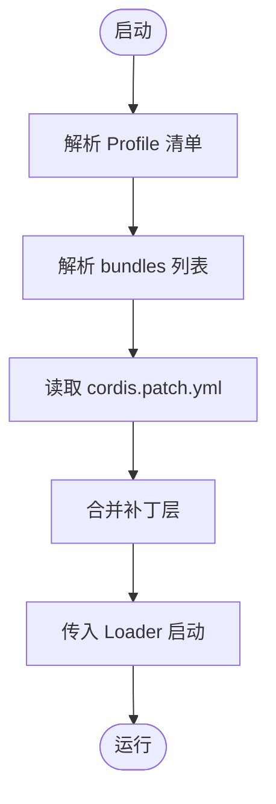
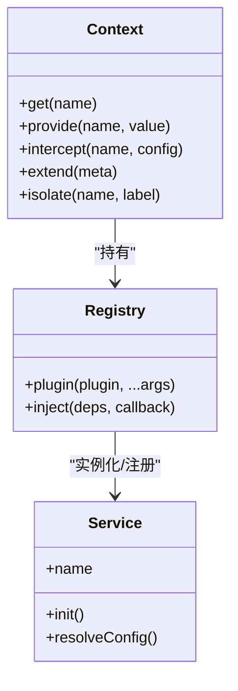
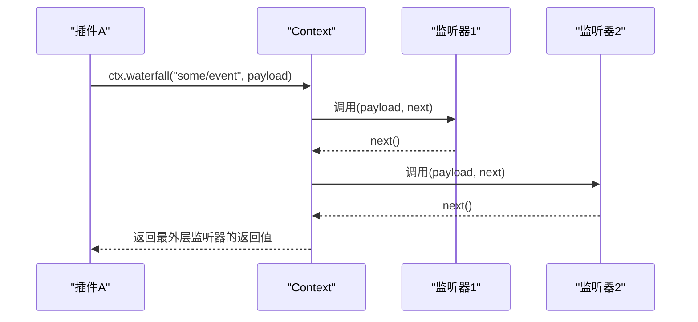
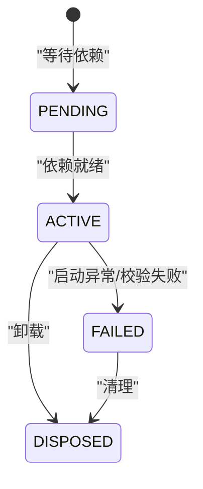
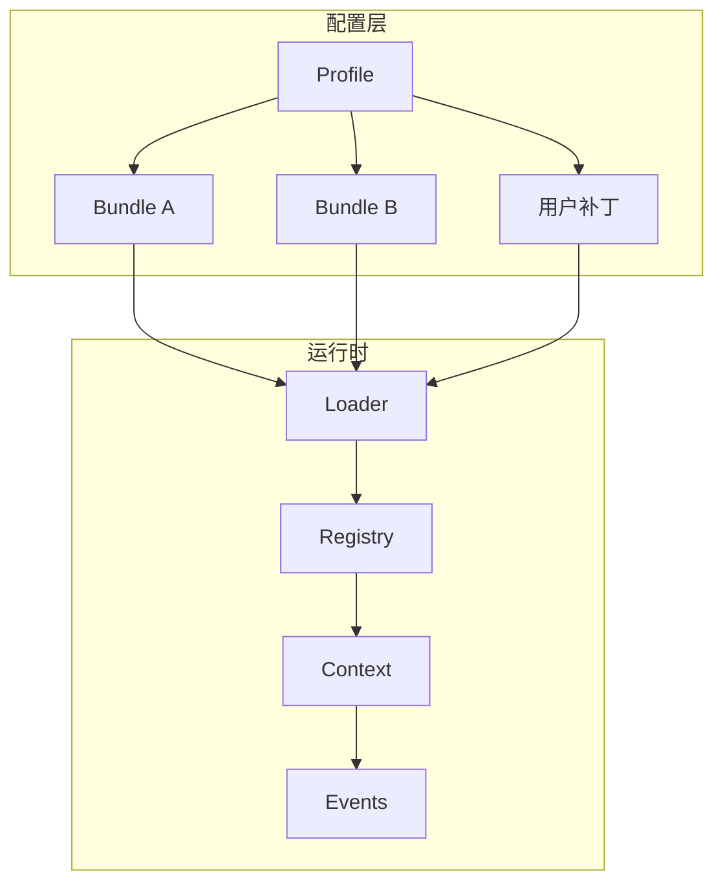

# 插件系统

<cite>
**本文引用的文件**
- [apps/cli/composition.md](file://apps/cli/composition.md)
- [apps/cli/src/profile-boot.ts](file://apps/cli/src/profile-boot.ts)
- [packages/boot/app-boot/src/profile.ts](file://packages/boot/app-boot/src/profile.ts)
- [docs/cordis-primer.md](file://docs/cordis-primer.md)
- [docs/cordis-tutorial/index.md](file://docs/cordis-tutorial/index.md)
- [docs/cordis-tutorial/05-config.md](file://docs/cordis-tutorial/05-config.md)
- [docs/cordis-tutorial/06-composition-and-hmr.md](file://docs/cordis-tutorial/06-composition-and-hmr.md)
- [docs/cordis-api/context.md](file://docs/cordis-api/context.md)
- [docs/cordis-api/events.md](file://docs/cordis-api/events.md)
- [docs/cordis-api/service.md](file://docs/cordis-api/service.md)
- [docs/cordis-api/registry.md](file://docs/cordis-api/registry.md)
- [scripts/test-invariants.ts](file://scripts/test-invariants.ts)
- [packages/extensions/tool-cordis/src/inspect.ts](file://packages/extensions/tool-cordis/src/inspect.ts)
</cite>

## 目录
1. [简介](#简介)
2. [项目结构](#项目结构)
3. [核心组件](#核心组件)
4. [架构总览](#架构总览)
5. [详细组件分析](#详细组件分析)
6. [依赖关系分析](#依赖关系分析)
7. [性能考量](#性能考量)
8. [故障排查指南](#故障排查指南)
9. [结论](#结论)
10. [附录：开发指南与最佳实践](#附录开发指南与最佳实践)

## 简介
本文件面向 DeepSeek Harness 的插件开发者，系统性阐述基于 Cordis 的插件框架如何工作。内容涵盖插件注册、服务注入、事件处理机制；配置层次（profile、bundle）与组合叠加、补丁系统与动态加载；插件生命周期管理（启动顺序、依赖解析、卸载清理）；以及插件开发的最佳实践（接口设计、错误处理、性能优化）。读者可据此完成从“第一个插件”到“接入真实 Harness 服务”的完整开发路径。

## 项目结构
DeepSeek Harness 将能力以插件形式组织，通过配置文件描述插件树，并由 Loader 在运行时装配。基础能力由 dsh-base bundle 提供，web/headless/sdk/acp 等 profile 在其之上叠加自身行为与用户层补丁。

图表来源
- [apps/cli/src/profile-boot.ts:105-251](file://apps/cli/src/profile-boot.ts#L105-L251)
- [packages/boot/app-boot/src/profile.ts:1-120](file://packages/boot/app-boot/src/profile.ts#L1-L120)

章节来源
- [apps/cli/composition.md:1-277](file://apps/cli/composition.md#L1-L277)
- [apps/cli/src/profile-boot.ts:105-251](file://apps/cli/src/profile-boot.ts#L105-L251)
- [packages/boot/app-boot/src/profile.ts:1-120](file://packages/boot/app-boot/src/profile.ts#L1-L120)

## 核心组件
- Context 上下文：服务存储、作用域隔离、拦截配置、事件总线、反射层、插件注册表。
- Service 服务：以命名方式挂载到 ctx，支持构造后初始化、调用体扩展、配置解析等。
- Registry 注册表：插件加载、依赖注入、Fiber 生命周期。
- Events 事件：emit/parallel/serial/bail/waterfall 多种分发模式，配合 on/once 注册监听。
- Profile/Bundle：Profile 是用户场景集合，包含有序 Bundle 层与用户补丁层；Bundle 是 npm 包，导出补丁清单。

章节来源
- [docs/cordis-api/context.md:1-365](file://docs/cordis-api/context.md#L1-L365)
- [docs/cordis-api/service.md:1-103](file://docs/cordis-api/service.md#L1-L103)
- [docs/cordis-api/registry.md:1-153](file://docs/cordis-api/registry.md#L1-L153)
- [docs/cordis-api/events.md:1-208](file://docs/cordis-api/events.md#L1-L208)
- [packages/boot/app-boot/src/profile.ts:1-120](file://packages/boot/app-boot/src/profile.ts#L1-L120)

## 架构总览
下图展示从 Profile 解析到 Loader 装载、再到 Context 中服务与事件的运行流程。

图表来源
- [apps/cli/src/profile-boot.ts:105-251](file://apps/cli/src/profile-boot.ts#L105-L251)
- [packages/boot/app-boot/src/profile.ts:1-120](file://packages/boot/app-boot/src/profile.ts#L1-L120)
- [docs/cordis-api/context.md:1-365](file://docs/cordis-api/context.md#L1-L365)
- [docs/cordis-api/registry.md:1-153](file://docs/cordis-api/registry.md#L1-L153)

## 详细组件分析

### 配置层次与组合：Profile 与 Bundle
- Profile：位于 $DSH_HOME/profiles/<name>，包含 package.json（声明 bundles 与 patchReload）与 cordis.patch.yml（用户补丁层）。
- Bundle：npm 包，通过 manifest 的 dsh.bundle.patch 导出补丁清单。
- 组合顺序：bundle 层 → profile 自身补丁 → home 级用户补丁 → overlays（命令行覆盖与遥测开关）。
- 热重载：当 patchReload 为 live 时，用户补丁文件变更会触发重新组合与增量重装载。

图表来源
- [packages/boot/app-boot/src/profile.ts:1-120](file://packages/boot/app-boot/src/profile.ts#L1-L120)
- [apps/cli/src/profile-boot.ts:105-251](file://apps/cli/src/profile-boot.ts#L105-L251)

章节来源
- [packages/boot/app-boot/src/profile.ts:1-120](file://packages/boot/app-boot/src/profile.ts#L1-L120)
- [apps/cli/src/profile-boot.ts:105-251](file://apps/cli/src/profile-boot.ts#L105-L251)
- [docs/cordis-tutorial/06-composition-and-hmr.md:1-114](file://docs/cordis-tutorial/06-composition-and-hmr.md#L1-L114)

### 插件注册与服务注入
- 插件可以是函数或类，声明 inject 表示依赖的服务名或带拦截配置的映射。
- Loader 根据依赖图决定启动顺序；未满足依赖的插件处于 PENDING。
- 服务通过 Service 基类或 ctx.provide 注册，名称唯一且受 Fiber 生命周期管理。
- 可通过 ctx.intercept 为特定服务注入拦截配置，影响其下游插件的配置解析。

图表来源
- [docs/cordis-api/context.md:1-365](file://docs/cordis-api/context.md#L1-L365)
- [docs/cordis-api/registry.md:1-153](file://docs/cordis-api/registry.md#L1-L153)
- [docs/cordis-api/service.md:1-103](file://docs/cordis-api/service.md#L1-L103)

章节来源
- [docs/cordis-api/registry.md:1-153](file://docs/cordis-api/registry.md#L1-L153)
- [docs/cordis-api/context.md:1-365](file://docs/cordis-api/context.md#L1-L365)
- [docs/cordis-api/service.md:1-103](file://docs/cordis-api/service.md#L1-L103)

### 事件处理机制
- 事件总线混入 Context，提供 emit/parallel/serial/bail/waterfall 五种分发模式。
- 监听器通过 ctx.on/ctx.once 注册，受 Fiber 生命周期管理，卸载时自动移除。
- Waterfall 模式支持 next 回调链式处理，适合中间件式拦截与决策。

图表来源
- [docs/cordis-api/events.md:1-208](file://docs/cordis-api/events.md#L1-L208)

章节来源
- [docs/cordis-api/events.md:1-208](file://docs/cordis-api/events.md#L1-L208)
- [docs/cordis-primer.md:1-46](file://docs/cordis-primer.md#L1-L46)

### 配置校验与计算值
- 每个 cordis.yml 条目可携带 config，插件需导出 Schema 进行运行时校验。
- 校验失败会立即终止该插件 Fiber 并上报错误，避免半配置状态。
- 支持 !!js 表达式在 config 与 disabled 字段中进行加载期计算。

章节来源
- [docs/cordis-tutorial/05-config.md:1-85](file://docs/cordis-tutorial/05-config.md#L1-L85)

### 动态加载与 HMR
- 通过 id 稳定的配置项，Loader 能识别编辑差异，仅对变更部分卸载/重装。
- HMR 插件监听文件变化，触发对应插件的卸载与新代码加载，效果随 Fiber 释放而回滚。
- 诊断工具可枚举 Fiber 状态，快速定位 PENDING 原因（缺失依赖）。

章节来源
- [docs/cordis-tutorial/06-composition-and-hmr.md:1-114](file://docs/cordis-tutorial/06-composition-and-hmr.md#L1-L114)
- [packages/extensions/tool-cordis/src/inspect.ts:82-121](file://packages/extensions/tool-cordis/src/inspect.ts#L82-L121)

### 生命周期管理：启动顺序、依赖解析、卸载清理
- 启动顺序由依赖图驱动：只有 inject 全部满足才会激活。
- Fiber 拥有明确状态机（ACTIVE/PENDING/FAILED/DISPOSED），便于诊断。
- 卸载时按反向顺序释放 effect，确保资源正确回收。
- 对于初始即失败的配置校验错误，可在准备阶段提前 dispose，避免悬挂。

图表来源
- [scripts/test-invariants.ts:249-274](file://scripts/test-invariants.ts#L249-L274)

章节来源
- [scripts/test-invariants.ts:249-274](file://scripts/test-invariants.ts#L249-L274)

## 依赖关系分析
- Profile 依赖 Bundle 提供的补丁清单；Bundle 之间通过 id 目标进行配置覆盖与插入。
- Loader 依赖 Context/Registry/Events 实现插件装载与生命周期管理。
- 插件间通过服务名解耦，避免直接导入耦合；通过事件进行横向协作。

图表来源
- [apps/cli/composition.md:1-277](file://apps/cli/composition.md#L1-L277)
- [apps/cli/src/profile-boot.ts:105-251](file://apps/cli/src/profile-boot.ts#L105-L251)

章节来源
- [apps/cli/composition.md:1-277](file://apps/cli/composition.md#L1-L277)
- [apps/cli/src/profile-boot.ts:105-251](file://apps/cli/src/profile-boot.ts#L105-L251)

## 性能考量
- 使用事件而非同步阻塞调用进行跨插件协作，优先选择 emit/parallel 提高吞吐。
- 谨慎使用 waterfall 长链，避免过多中间件导致延迟累积。
- 合理拆分插件职责，减少不必要的依赖，降低启动时的依赖解析开销。
- 利用 HMR 与增量重装，缩短开发迭代时间；生产环境关闭不必要监听。
- 在服务中缓存昂贵计算结果，注意缓存失效与并发安全。

## 故障排查指南
- 插件不加载：检查 Fiber 状态是否为 PENDING，使用 inspect 工具列出缺失依赖。
- 配置错误：查看 Schema 校验错误信息，修正类型或必填字段。
- 重复服务：同一作用域内重复 provide 会抛错，确认服务提供者唯一性。
- 卸载问题：确认 effect 返回 disposer 或使用框架辅助方法，确保资源释放。
- 热重载异常：确保配置项具备稳定 id，避免每次编辑都被视为新增/删除。

章节来源
- [packages/extensions/tool-cordis/src/inspect.ts:82-121](file://packages/extensions/tool-cordis/src/inspect.ts#L82-L121)
- [docs/cordis-tutorial/06-composition-and-hmr.md:1-114](file://docs/cordis-tutorial/06-composition-and-hmr.md#L1-L114)

## 结论
DeepSeek Harness 的插件系统以 Cordis 为核心，通过 Profile/Bundle 的组合与补丁机制，实现了高度可配置、可扩展的能力拼装。借助 Context/Registry/Events 的抽象，插件间松耦合协作，生命周期清晰可控。遵循本文档的实践建议，开发者可以高效构建稳定、可维护、高性能的插件生态。

## 附录：开发指南与最佳实践
- 接口设计
  - 以服务名暴露能力，避免硬编码导入；通过 inject 声明依赖，保持加载顺序由依赖图决定。
  - 事件用于横切关注点（策略、审计、日志），服务用于直接能力调用。
- 错误处理
  - 配置校验失败应尽早抛出，避免进入不稳定状态。
  - 对异步操作进行超时与取消处理，防止悬挂任务。
- 性能优化
  - 批量事件处理优先使用 parallel；串行决策使用 serial/bail。
  - 避免在高频路径中进行 I/O 或重型计算，必要时引入缓存或惰性加载。
- 调试与观测
  - 使用 HMR 加速开发；通过 Fiber 状态与 missingServices 快速定位问题。
  - 为关键路径添加结构化日志，便于追踪与排障。

章节来源
- [docs/cordis-primer.md:1-46](file://docs/cordis-primer.md#L1-L46)
- [docs/cordis-tutorial/index.md:1-61](file://docs/cordis-tutorial/index.md#L1-L61)
- [docs/cordis-tutorial/05-config.md:1-85](file://docs/cordis-tutorial/05-config.md#L1-L85)
- [docs/cordis-tutorial/06-composition-and-hmr.md:1-114](file://docs/cordis-tutorial/06-composition-and-hmr.md#L1-L114)