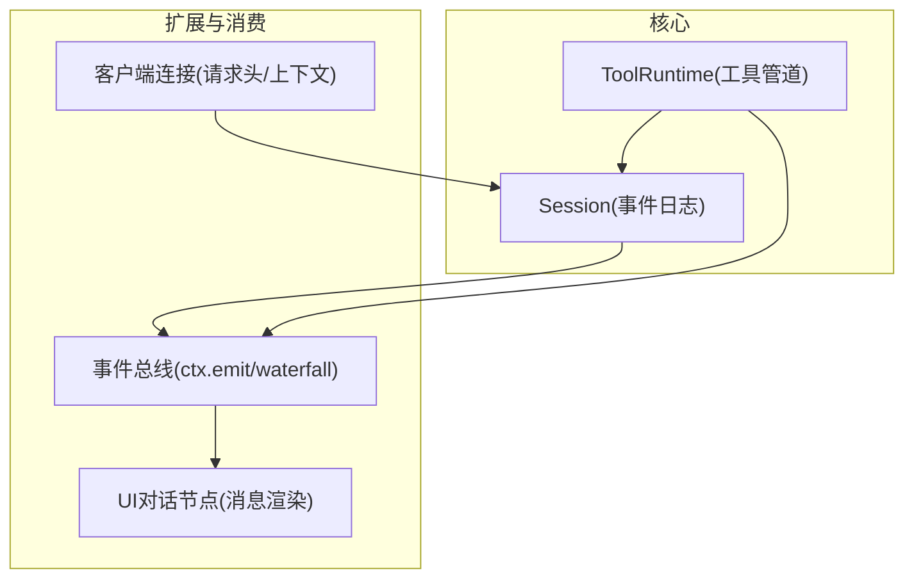
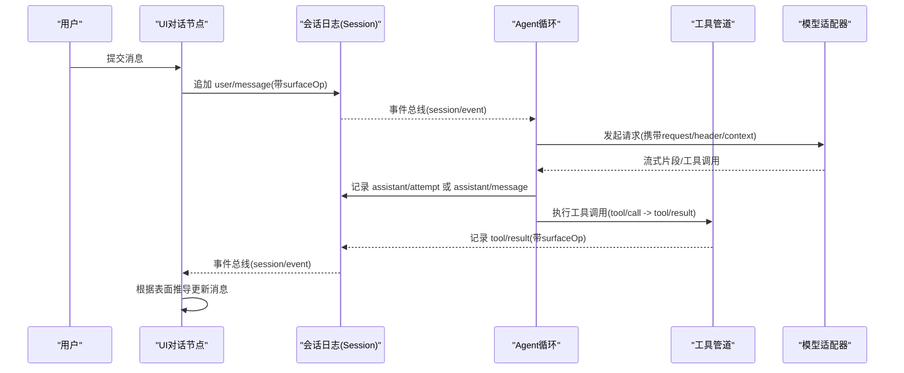
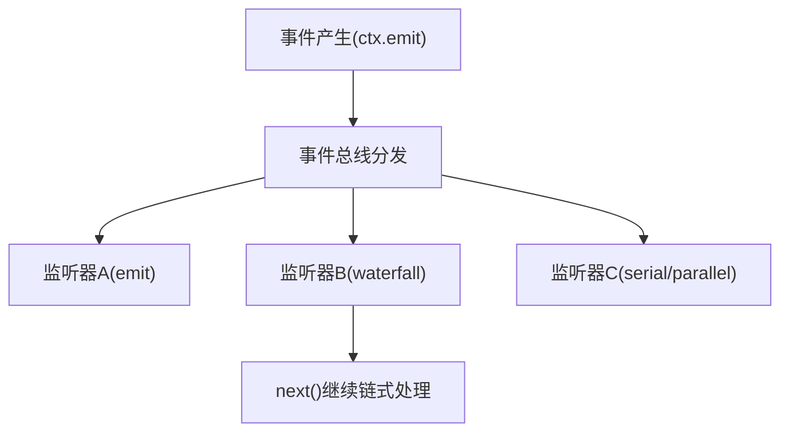
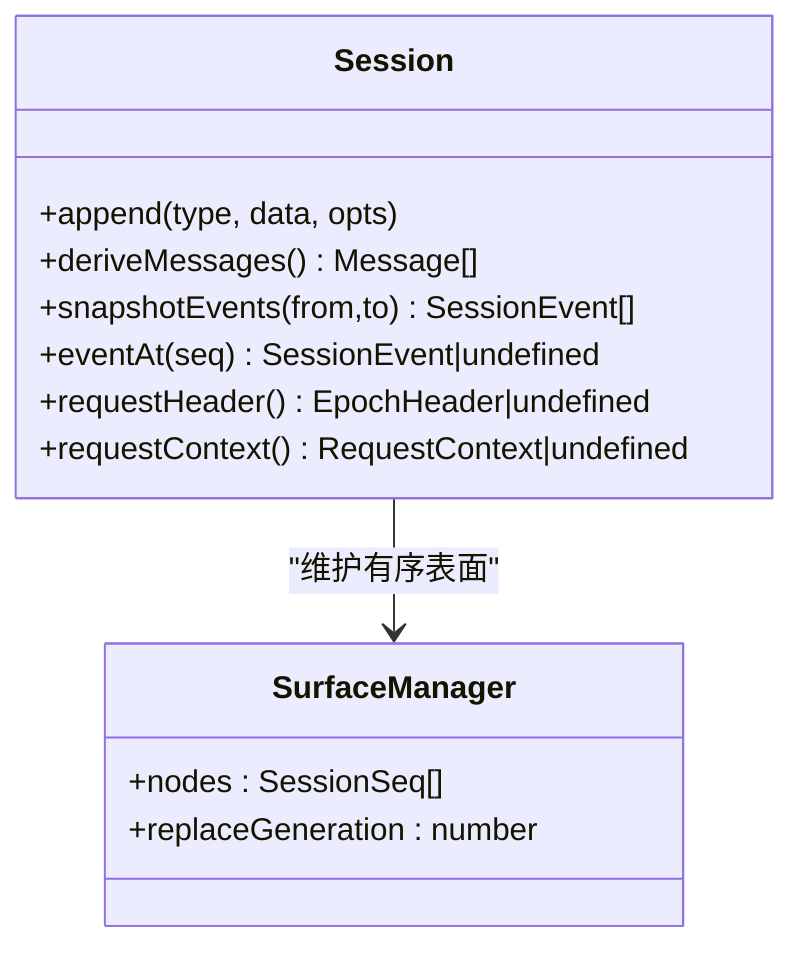
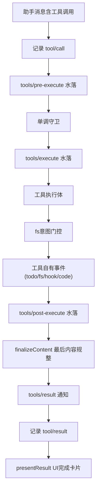
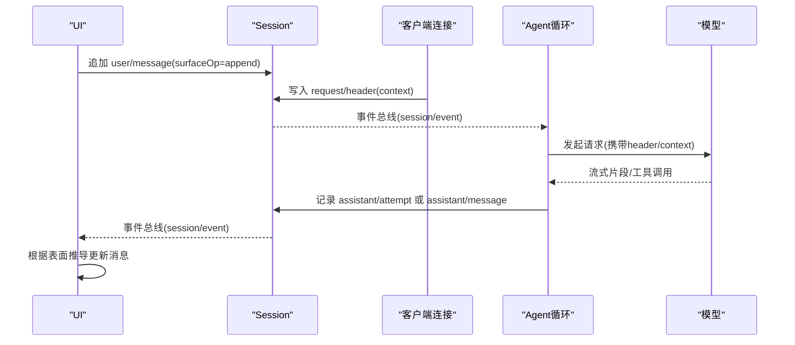
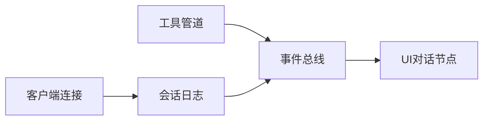

# 数据流设计

<cite>
**本文引用的文件**
- [packages/core/session/src/types.ts](file://packages/core/session/src/types.ts)
- [packages/core/session/src/index.ts](file://packages/core/session/src/index.ts)
- [docs/subsystems/session.md](file://docs/subsystems/session.md)
- [docs/tool-execution-pipeline.md](file://docs/tool-execution-pipeline.md)
- [docs/event-producer-consumer.md](file://docs/event-producer-consumer.md)
- [packages/core/tools/src/index.ts](file://packages/core/tools/src/index.ts)
- [packages/client/ui-chat/src/client/conversation-nodes/message.ts](file://packages/client/ui-chat/src/client/conversation-nodes/message.ts)
- [packages/client/connection/src/client/fixture.ts](file://packages/client/connection/src/client/fixture.ts)
</cite>

## 目录
1. [简介](#简介)
2. [项目结构](#项目结构)
3. [核心组件](#核心组件)
4. [架构总览](#架构总览)
5. [详细组件分析](#详细组件分析)
6. [依赖关系分析](#依赖关系分析)
7. [性能考量](#性能考量)
8. [故障排查指南](#故障排查指南)
9. [结论](#结论)
10. [附录](#附录)

## 简介
本文件面向DeepSeek Harness的数据流设计，围绕事件驱动架构、会话事件模型、工具执行管道与消息流转进行系统化说明。重点包括：
- 事件类型与事件总线机制（emit/waterfall/serial/parallel）
- 会话事件模型（SessionEvent、表面投影、持久化与回放）
- 工具执行管道（pre-execute、monotonic guards、execute、post-execute、result）
- 用户输入到UI更新的全链路消息流转
- 数据一致性与事务性保证（append-only日志、JSON可序列化、序列连续性、冷恢复）

## 项目结构
- 会话与事件核心位于 packages/core/session，定义 SessionEventMap、SurfaceEventType、SurfaceOp、Session.append 等关键类型与API。
- 工具执行管道位于 packages/core/tools，提供 tools/pre-execute、tools/execute、tools/post-execute、tools/result 等事件与调度器。
- UI消费端通过 conversation nodes 订阅 session/event 并渲染消息节点；客户端连接层在请求时写入 request/header 与 request/context 等日志事件。
- 文档 docs 提供了事件生产者-消费者矩阵与工具执行流程图，便于跨包理解数据流向。

图表来源
- [packages/core/session/src/index.ts:427-459](file://packages/core/session/src/index.ts#L427-L459)
- [packages/core/tools/src/index.ts:134-200](file://packages/core/tools/src/index.ts#L134-L200)
- [packages/client/ui-chat/src/client/conversation-nodes/message.ts:43-98](file://packages/client/ui-chat/src/client/conversation-nodes/message.ts#L43-L98)
- [packages/client/connection/src/client/fixture.ts:3129-3164](file://packages/client/connection/src/client/fixture.ts#L3129-L3164)

章节来源
- [docs/subsystems/session.md:1-12](file://docs/subsystems/session.md#L1-L12)
- [docs/event-producer-consumer.md:1-90](file://docs/event-producer-consumer.md#L1-L90)

## 核心组件
- 会话事件模型：以 append-only 的 SessionEvent 日志为唯一事实源，消息历史由有序“表面”推导而来，支持 replace 操作实现压缩与重写。
- 工具执行管道：三段式水落（pre-execute、execute、post-execute）加单调守卫，统一结果归一化与最终通知。
- 事件总线：基于 ctx 的事件分发模式（emit/waterfall/serial/parallel），解耦生产与消费。
- UI消费：conversation nodes 匹配特定事件（如 user/message）并构建视图节点。

章节来源
- [packages/core/session/src/types.ts:254-376](file://packages/core/session/src/types.ts#L254-L376)
- [packages/core/tools/src/index.ts:134-200](file://packages/core/tools/src/index.ts#L134-L200)
- [docs/event-producer-consumer.md:8-79](file://docs/event-producer-consumer.md#L8-L79)
- [packages/client/ui-chat/src/client/conversation-nodes/message.ts:43-98](file://packages/client/ui-chat/src/client/conversation-nodes/message.ts#L43-L98)

## 架构总览
下图展示从用户输入到模型响应、再到UI更新的端到端数据流，以及工具调用在管道中的位置。

图表来源
- [packages/client/ui-chat/src/client/conversation-nodes/message.ts:43-98](file://packages/client/ui-chat/src/client/conversation-nodes/message.ts#L43-L98)
- [packages/client/connection/src/client/fixture.ts:3129-3164](file://packages/client/connection/src/client/fixture.ts#L3129-L3164)
- [docs/tool-execution-pipeline.md:8-60](file://docs/tool-execution-pipeline.md#L8-L60)
- [docs/subsystems/session.md:254-376](file://docs/subsystems/session.md#L254-L376)

## 详细组件分析

### 事件驱动架构与事件总线
- 事件类型：涵盖 agent、session、tools、fs、llm、workflow 等域，按 mode 分为 emit、waterfall、serial、parallel。
- 生产者-消费者矩阵：明确每个事件的声明方、派发方与监听方，便于定位数据流与影响面。
- 水落模式（waterfall）：用于策略拦截与增强（如 tools/pre-execute、tools/execute、tools/post-execute），允许链式处理与决策。
- 并发模式：parallel 用于并行通知，serial 用于串行控制点。

图表来源
- [docs/event-producer-consumer.md:8-79](file://docs/event-producer-consumer.md#L8-L79)

章节来源
- [docs/event-producer-consumer.md:8-79](file://docs/event-producer-consumer.md#L8-L79)

### 会话事件模型（SessionEvent、表面投影、持久化与回放）
- 事件词汇表：turn/start/end、step/start/end、user/message、assistant/message、assistant/attempt、tool/call、tool/result、request/header、request/context、session/end-seed。
- 表面类型：SurfaceEventType 限定 user/message、assistant/message、tool/result；SurfaceOp 支持 append 与 replace，用于压缩与重写。
- 表面投影：deriveMessages 基于 surfaceOp 维护有序消息历史，replace 会删除被覆盖节点。
- 持久化契约：所有 event.data 必须可无损 JSON 序列化；seq 保持连续；assistant 尝试保留紧凑流以便恢复。
- 回放与恢复：fromRestore/create 支持从持久化事件重建会话；end-seed 标记种子边界，区分继承前缀与当前进程新增事件。

图表来源
- [packages/core/session/src/index.ts:427-459](file://packages/core/session/src/index.ts#L427-L459)
- [docs/subsystems/session.md:374-574](file://docs/subsystems/session.md#L374-L574)

章节来源
- [packages/core/session/src/types.ts:254-376](file://packages/core/session/src/types.ts#L254-L376)
- [docs/subsystems/session.md:254-376](file://docs/subsystems/session.md#L254-L376)
- [docs/subsystems/session.md:374-574](file://docs/subsystems/session.md#L374-L574)

### 工具执行管道（工具调用流程、参数验证、结果处理、错误传播）
- 阶段顺序：model 生成 tool/call → presentCall → tools/pre-execute（权限/沙箱/审批）→ 单调守卫 → tools/execute（超时/重试/指标）→ 工具体 → fs意图门控 → 工具自有事件 → tools/post-execute（接受/替换/阻塞/附加上下文）→ finalizeContent → tools/result 通知 → tool/result 事件 → presentResult。
- 参数与输出：工具参数经 JSON Schema 校验；输出需满足 ToolOutputDefinition，失败归一化为 ToolExecutionFailure。
- 错误传播：pre/around/post 抛出均被捕获并归一化；PTC模式下子调用通过 tool/code-dispatch 记录，异常作为绑定拒绝返回。

图表来源
- [docs/tool-execution-pipeline.md:8-60](file://docs/tool-execution-pipeline.md#L8-L60)
- [packages/core/tools/src/index.ts:134-200](file://packages/core/tools/src/index.ts#L134-L200)

章节来源
- [docs/tool-execution-pipeline.md:1-63](file://docs/tool-execution-pipeline.md#L1-L63)
- [packages/core/tools/src/index.ts:134-200](file://packages/core/tools/src/index.ts#L134-L200)

### 消息流转过程（用户输入、模型请求、响应生成、UI更新）
- 用户输入：UI将 user/message 以 append 方式进入表面，source 标注来源（用户/注入上下文/目标）。
- 模型请求：客户端在请求前写入 request/header（初始/变更/系列）与 request/context（提供者/模型/容量），供后续重建与路由使用。
- 响应生成：助手消息 assistant/message 嵌入流与用量；未产出可见消息的尝试记录 assistant/attempt。
- UI更新：UI对话节点匹配 user/message 等事件，构建 chatNode 并渲染；同时消费 session/event 刷新视图。

图表来源
- [packages/client/ui-chat/src/client/conversation-nodes/message.ts:43-98](file://packages/client/ui-chat/src/client/conversation-nodes/message.ts#L43-L98)
- [packages/client/connection/src/client/fixture.ts:3129-3164](file://packages/client/connection/src/client/fixture.ts#L3129-L3164)
- [docs/subsystems/session.md:254-376](file://docs/subsystems/session.md#L254-L376)

章节来源
- [packages/client/ui-chat/src/client/conversation-nodes/message.ts:43-98](file://packages/client/ui-chat/src/client/conversation-nodes/message.ts#L43-L98)
- [packages/client/connection/src/client/fixture.ts:3129-3164](file://packages/client/connection/src/client/fixture.ts#L3129-L3164)
- [docs/subsystems/session.md:254-376](file://docs/subsystems/session.md#L254-L376)

### 数据一致性保证与事务管理
- Append-only 日志：所有变更以不可变事件追加，避免状态竞争与回滚复杂度。
- 序列连续性：seq 严格递增且连续，确保回放与重放的一致性。
- JSON可序列化约束：Session.append 对 event.data 做运行时校验，非可序列化数据在源头拒绝，保障后端存储与回放一致。
- 表面投影一致性：surfaceOp 明确事件如何进入有序表面，replace 操作需完整覆盖被阴影节点，保证推导历史正确。
- 冷恢复与边界：session/end-seed 标记种子边界，fromRestore 校验格式、事件信封、序列连续性与表面转换后冻结对象，确保恢复安全。

章节来源
- [packages/core/session/src/types.ts:254-376](file://packages/core/session/src/types.ts#L254-L376)
- [docs/subsystems/session.md:656-660](file://docs/subsystems/session.md#L656-L660)

## 依赖关系分析
- 会话与工具强耦合：工具执行结果通过 tool/result 进入会话表面，成为模型可见历史的一部分。
- UI与事件总线：UI消费 session/event 并通过 conversation nodes 匹配事件类型，构建视图节点。
- 客户端与请求元数据：客户端在请求前写入 request/header 与 request/context，供会话与后续重建使用。

图表来源
- [packages/core/tools/src/index.ts:134-200](file://packages/core/tools/src/index.ts#L134-L200)
- [packages/core/session/src/index.ts:427-459](file://packages/core/session/src/index.ts#L427-L459)
- [packages/client/ui-chat/src/client/conversation-nodes/message.ts:43-98](file://packages/client/ui-chat/src/client/conversation-nodes/message.ts#L43-L98)
- [packages/client/connection/src/client/fixture.ts:3129-3164](file://packages/client/connection/src/client/fixture.ts#L3129-L3164)

章节来源
- [docs/event-producer-consumer.md:8-79](file://docs/event-producer-consumer.md#L8-L79)

## 性能考量
- 表面投影缓存：deriveMessages 对每个表面节点仅投影一次，replace 触发重建，降低重复计算成本。
- 异步持久化缓冲：hot path 不阻塞I/O，持久化插件异步缓冲，提升追加吞吐。
- 工具并发与限流：PTC模式下的子调用并发上限可配置，exclusive 调用形成顺序屏障，避免资源争用。
- 事件批量与页面读取：会话查询支持分页与向后游标，减少冷启动加载压力。

[本节为通用指导，无需具体文件引用]

## 故障排查指南
- 工具前置拦截失败：检查 tools/pre-execute 是否返回 deny/ask，确认审批服务可用与信号取消处理。
- 工具执行异常：查看 tools/execute 包装是否抛出，确认超时与重试策略；异常会被归一化为 ToolExecutionFailure。
- 表面投影不一致：确认 surfaceOp 与 sourceEventSeqs 是否正确，replace 范围是否覆盖全部被阴影节点。
- 持久化问题：确认 event.data 可无损 JSON 序列化；检查 seq 连续性；冷恢复时验证 fromRestore 的格式与表面转换。

章节来源
- [packages/core/tools/src/index.ts:134-200](file://packages/core/tools/src/index.ts#L134-L200)
- [packages/core/session/src/types.ts:254-376](file://packages/core/session/src/types.ts#L254-L376)

## 结论
DeepSeek Harness 通过 append-only 会话日志与有序表面投影，实现了可回放、可压缩、可重构的消息历史；工具执行管道以三段式水落与单调守卫提供灵活而安全的执行环境；事件总线解耦了生产与消费，支撑多包协作。结合严格的JSON序列化与序列连续性约束，系统在可扩展性与一致性之间取得平衡，为开发者提供了清晰的数据流模型与扩展点。

[本节为总结，无需具体文件引用]

## 附录
- 事件类型参考：参见 SessionEventMap 与 SurfaceEventType。
- 工具管道参考：参见工具执行流程图与 waterfalls。
- 事件矩阵参考：参见事件生产者-消费者矩阵。

章节来源
- [packages/core/session/src/types.ts:254-376](file://packages/core/session/src/types.ts#L254-L376)
- [docs/tool-execution-pipeline.md:1-63](file://docs/tool-execution-pipeline.md#L1-L63)
- [docs/event-producer-consumer.md:8-79](file://docs/event-producer-consumer.md#L8-L79)