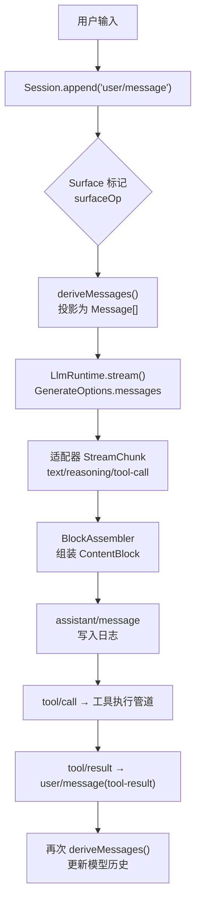
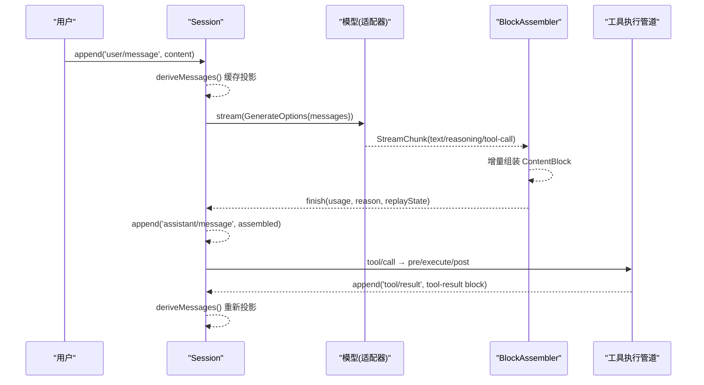
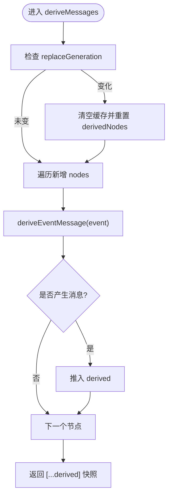
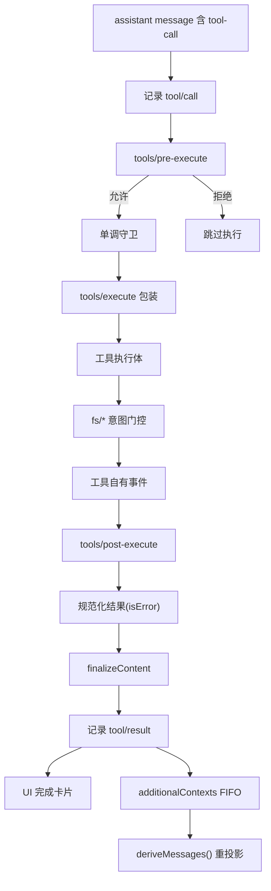
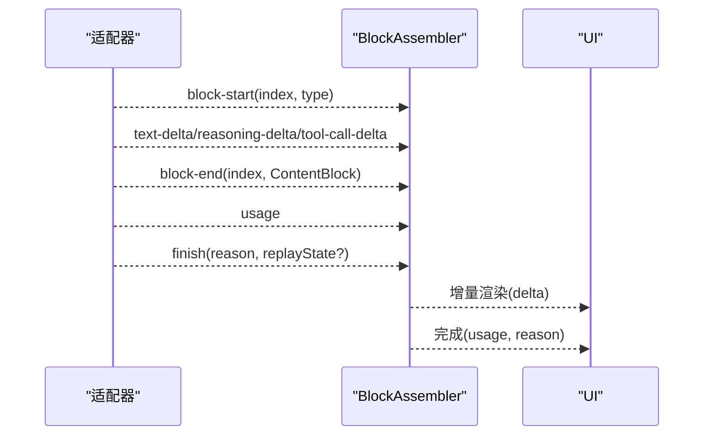
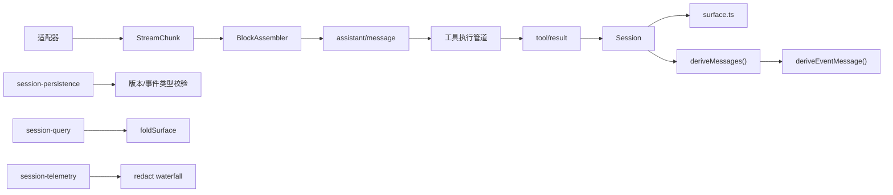

# 数据流设计

<cite>
**本文引用的文件**
- [packages/core/session/src/index.ts](file://packages/core/session/src/index.ts)
- [packages/core/session/src/surface.ts](file://packages/core/session/src/surface.ts)
- [packages/core/session/tests/derived-cache.spec.ts](file://packages/core/session/tests/derived-cache.spec.ts)
- [packages/core/session/tests/session.spec.ts](file://packages/core/session/tests/session.spec.ts)
- [docs/subsystems/llm-streaming.md](file://docs/subsystems/llm-streaming.md)
- [packages/llm/llm-deepseek/src/translate.ts](file://packages/llm/llm-deepseek/src/translate.ts)
- [docs/tool-execution-pipeline.md](file://docs/tool-execution-pipeline.md)
- [packages/core/tools/tests/invariant.spec.ts](file://packages/core/tools/tests/invariant.spec.ts)
- [packages/session-query/session-query/src/tracing.ts](file://packages/session-query/session-query/src/tracing.ts)
- [packages/session/session-telemetry/src/coordinator.ts](file://packages/session/session-telemetry/src/coordinator.ts)
- [docs/subsystems/session-telemetry.md](file://docs/subsystems/session-telemetry.md)
- [packages/session/session-persistence/src/coordinator.ts](file://packages/session/session-persistence/src/coordinator.ts)
- [packages/client/runtime/src/client/sessions/context-provenance.ts](file://packages/client/runtime/src/client/sessions/context-provenance.ts)
</cite>

## 目录
1. [引言](#引言)
2. [项目结构](#项目结构)
3. [核心组件](#核心组件)
4. [架构总览](#架构总览)
5. [详细组件分析](#详细组件分析)
6. [依赖关系分析](#依赖关系分析)
7. [性能考量](#性能考量)
8. [故障排查指南](#故障排查指南)
9. [结论](#结论)
10. [附录](#附录)

## 引言
本设计文档聚焦于系统的数据流：从用户输入到模型响应的完整处理链路，围绕“会话日志作为单一事实源”的理念展开。重点说明 deriveMessages() 如何从事件日志推导模型历史、工具执行管道中的数据转换与验证、LLM 流式响应处理与 UI 保真度保证机制，以及数据序列化、反序列化与版本兼容性策略，并给出数据流监控与调试方法。

## 项目结构
- 会话与事件溯源：Session 维护仅追加的 SessionEvent 日志，并通过 surface 管理消息面；deriveMessages() 将日志投影为 Message[]。
- LLM 流式协议：StreamChunk 描述原始流块（文本、推理、工具调用），BlockAssembler 将其组装为 ContentBlock 与最终 assistant 消息。
- 工具执行管道：以 waterfalls（pre-execute / execute / post-execute）串联权限、沙箱、超时重试、结果规范化与内容终态化。
- 持久化与查询：session-persistence 负责加载/写入与格式校验；session-query 提供日志折叠、追踪与分析。
- 遥测：session-telemetry 在 session/event 热路径捕获记录，经 redact waterfall 后投递至后端。

图表来源
- [packages/core/session/src/index.ts:708-747](file://packages/core/session/src/index.ts#L708-L747)
- [packages/core/session/src/surface.ts:70-92](file://packages/core/session/src/surface.ts#L70-L92)
- [docs/subsystems/llm-streaming.md:154-205](file://docs/subsystems/llm-streaming.md#L154-L205)
- [docs/tool-execution-pipeline.md:8-58](file://docs/tool-execution-pipeline.md#L8-L58)

章节来源
- [packages/core/session/src/index.ts:708-747](file://packages/core/session/src/index.ts#L708-L747)
- [packages/core/session/src/surface.ts:70-92](file://packages/core/session/src/surface.ts#L70-L92)
- [docs/subsystems/llm-streaming.md:154-205](file://docs/subsystems/llm-streaming.md#L154-L205)
- [docs/tool-execution-pipeline.md:8-58](file://docs/tool-execution-pipeline.md#L8-L58)

## 核心组件
- 会话与派生历史：Session 持有仅追加日志与 surface；deriveMessages() 缓存每节点投影，返回新数组但共享深冻结消息对象，确保不可变性与回放一致性。
- 逐事件投影：deriveEventMessage(event) 是纯函数，定义哪些事件进入模型历史（如 user/message、assistant/message、tool/result），跳过 chunk/boundary 等回放/UI 数据。
- 流式协议与装配：StreamChunk 由适配器产出，BlockAssembler 增量组装为 ContentBlock[] 与最终 assistant 消息，并在 finish 时携带 usage 与 replayState。
- 工具执行管道：通过 pre/execute/post 三个 waterfall 实现权限、沙箱、超时重试、结果规范化与 finalizeContent，最终产出 tool/result 事件。
- 持久化与版本兼容：session-persistence 在加载时校验 header.version 与事件类型支持性，拒绝未知或不受支持的格式。
- 遥测与可观测性：session-telemetry 在 session/event 热路径捕获记录，经 redact waterfall 后 emit；session-query 提供日志折叠与追踪分析。

章节来源
- [packages/core/session/src/index.ts:708-747](file://packages/core/session/src/index.ts#L708-L747)
- [packages/core/session/src/surface.ts:70-92](file://packages/core/session/src/surface.ts#L70-L92)
- [docs/subsystems/llm-streaming.md:289-346](file://docs/subsystems/llm-streaming.md#L289-L346)
- [docs/tool-execution-pipeline.md:8-58](file://docs/tool-execution-pipeline.md#L8-L58)
- [packages/session/session-persistence/src/coordinator.ts:1046-1075](file://packages/session/session-persistence/src/coordinator.ts#L1046-L1075)
- [docs/subsystems/session-telemetry.md:1-120](file://docs/subsystems/session-telemetry.md#L1-L120)

## 架构总览
下图展示从用户输入到模型响应、再到工具执行与结果回写的全链路数据流，强调“日志即状态”和“派生即视图”。

图表来源
- [packages/core/session/src/index.ts:708-747](file://packages/core/session/src/index.ts#L708-L747)
- [packages/llm/llm-deepseek/src/translate.ts:78-140](file://packages/llm/llm-deepseek/src/translate.ts#L78-L140)
- [docs/subsystems/llm-streaming.md:154-205](file://docs/subsystems/llm-streaming.md#L154-L205)
- [docs/tool-execution-pipeline.md:8-58](file://docs/tool-execution-pipeline.md#L8-L58)

## 详细组件分析

### 会话日志与 deriveMessages()
- 设计理念：Session 日志是唯一事实源；surface 维护消息面的有序序列；deriveMessages() 按 surface.nodes 顺序投影，跳过不产生消息的事件与空内容的 assistant/message。
- 缓存策略：按 replaceGeneration 失效重建；每个 surface 节点仅投影一次；返回新数组但共享深冻结消息，避免二次克隆且防止外部修改日志。
- 投影规则：user/message → user 消息；assistant/message → assistant 消息（含 provider/model 与可选 replayState）；tool/result → 带 tool-result 块的 user 消息；注入上下文（非 user source）→ 按时间位置插入 user-role 消息。

图表来源
- [packages/core/session/src/index.ts:708-747](file://packages/core/session/src/index.ts#L708-L747)
- [packages/core/session/src/surface.ts:70-92](file://packages/core/session/src/surface.ts#L70-L92)

章节来源
- [packages/core/session/src/index.ts:708-747](file://packages/core/session/src/index.ts#L708-L747)
- [packages/core/session/src/surface.ts:70-92](file://packages/core/session/src/surface.ts#L70-L92)
- [packages/core/session/tests/derived-cache.spec.ts:88-113](file://packages/core/session/tests/derived-cache.spec.ts#L88-L113)
- [packages/core/session/tests/session.spec.ts:437-469](file://packages/core/session/tests/session.spec.ts#L437-L469)

### 工具执行管道：数据转换与验证
- 阶段划分：
  - tools/pre-execute：钩子、权限、沙箱；可 deny 或 ask approval。
  - monotonic guards：注册的保护器，保护身份不被篡改。
  - tools/execute：超时、重试、指标等 around 包装。
  - tools/post-execute：accept/block/replace/add context。
  - finalizeContent：工具定义的最后一次内容不变量约束。
  - tools/result：同步通知，输出冻结的权威结果。
- 数据流：assistant message 中的 tool-call 触发 tool/call 事件；执行完成后产出 tool/result，随后注入 additionalContexts（FIFO），再回到 deriveMessages() 更新模型历史。

图表来源
- [docs/tool-execution-pipeline.md:8-58](file://docs/tool-execution-pipeline.md#L8-L58)
- [packages/core/tools/tests/invariant.spec.ts:40-70](file://packages/core/tools/tests/invariant.spec.ts#L40-L70)

章节来源
- [docs/tool-execution-pipeline.md:8-58](file://docs/tool-execution-pipeline.md#L8-L58)
- [packages/core/tools/tests/invariant.spec.ts:40-70](file://packages/core/tools/tests/invariant.spec.ts#L40-L70)

### LLM 流式响应处理与 UI 保真度
- 原始协议：StreamChunk 包含 block-start/text-delta/reasoning-delta/tool-call-delta/block-end/usage/finish；index 关联同一块的多段增量。
- 装配器：BlockAssembler 增量累积，block-end 提供已组装 ContentBlock；finish 携带 usage 与 replayState；若 stop 无内容则映射为空响应错误。
- UI 保真：adapter 只负责产出规范 chunk；UI 消费 block-start/delta/block-end 即可渲染；无需自行重组；中断时可安全 finalize 文本/推理块，工具调用被省略以避免不安全执行。

图表来源
- [docs/subsystems/llm-streaming.md:154-205](file://docs/subsystems/llm-streaming.md#L154-L205)
- [packages/llm/llm-deepseek/src/translate.ts:78-140](file://packages/llm/llm-deepseek/src/translate.ts#L78-L140)

章节来源
- [docs/subsystems/llm-streaming.md:154-205](file://docs/subsystems/llm-streaming.md#L154-L205)
- [packages/llm/llm-deepseek/src/translate.ts:78-140](file://packages/llm/llm-deepseek/src/translate.ts#L78-L140)

### 数据序列化、反序列化与版本兼容
- 序列化边界：append(data) 要求 lossless JSON 可序列化；一次性递归读取、校验并复制，避免状态获取器副作用；接受后 deep-freeze，events 返回冻结快照。
- 反序列化与恢复：fromRestore/prepare 对存储格式、事件信封、序列连续性、surface 转换与 header 字段进行校验；unknown event type 且非 ignorable 会拒绝加载。
- 版本兼容：header.version 必须匹配当前 SESSION_FORMAT_VERSION；否则抛出格式不支持错误；未知事件类型需显式标记 ignorable 才能被忽略。

章节来源
- [packages/core/session/src/index.ts:636-660](file://packages/core/session/src/index.ts#L636-L660)
- [packages/session/session-persistence/src/coordinator.ts:1046-1075](file://packages/session/session-persistence/src/coordinator.ts#L1046-L1075)

### 数据流监控与调试
- 日志折叠与追踪：session-query 使用 foldSurface 分析事件表面，标注 current/shadowed/log-only，并构建 replacedBy 与 replacedEventSeqs 映射，便于定位替换关系。
- 遥测捕获：session-telemetry 在 session/event 热路径捕获记录，经 redact waterfall 后 emit；支持 live 与 on-demand 捕获；ops 通道用于 agent-error、shutdown 等信号。
- 调试建议：
  - 使用 deriveEventMessage 对单条事件做独立投影，验证与 deriveMessages 的一致性。
  - 通过 session-query 的 analyzeEventLog 查看事件在 surface 上的可见性与替换关系。
  - 借助 telemetry 的 ledger/ops 通道核对关键步骤（tool/result、assistant/message）是否被正确记录。

章节来源
- [packages/session-query/session-query/src/tracing.ts:175-218](file://packages/session-query/session-query/src/tracing.ts#L175-L218)
- [docs/subsystems/session-telemetry.md:1-120](file://docs/subsystems/session-telemetry.md#L1-L120)
- [packages/session/session-telemetry/src/coordinator.ts:69-103](file://packages/session/session-telemetry/src/coordinator.ts#L69-L103)

## 依赖关系分析
- Session 依赖 surface 管理消息面与投影规则；deriveMessages 依赖 deriveEventMessage 的纯投影逻辑。
- LLM 适配器依赖 StreamChunk 协议；BlockAssembler 解耦 UI 与适配器的细节。
- 工具执行管道依赖 waterfalls 与注册的工具定义；结果规范化与 finalizeContent 保证内容不变量。
- 持久化层依赖 session-persistence 的版本与事件类型校验；session-query 依赖 foldSurface 进行可视化分析。
- 遥测层依赖 session/event 事件流，通过 watermark 与 redact 控制导出内容。

图表来源
- [packages/core/session/src/index.ts:708-747](file://packages/core/session/src/index.ts#L708-L747)
- [packages/core/session/src/surface.ts:70-92](file://packages/core/session/src/surface.ts#L70-L92)
- [docs/subsystems/llm-streaming.md:154-205](file://docs/subsystems/llm-streaming.md#L154-L205)
- [docs/tool-execution-pipeline.md:8-58](file://docs/tool-execution-pipeline.md#L8-L58)
- [packages/session/session-persistence/src/coordinator.ts:1046-1075](file://packages/session/session-persistence/src/coordinator.ts#L1046-L1075)
- [packages/session-query/session-query/src/tracing.ts:175-218](file://packages/session-query/session-query/src/tracing.ts#L175-L218)
- [docs/subsystems/session-telemetry.md:1-120](file://docs/subsystems/session-telemetry.md#L1-L120)

## 性能考量
- 派生历史缓存：deriveMessages() 按 replaceGeneration 失效，增量投影新增节点，O(new nodes) 成本；返回新数组但共享深冻结消息，避免重复克隆。
- 流式装配：BlockAssembler 增量累积，block-end 直接提供已组装块，减少 UI 侧重组开销；中断时安全 finalize 文本/推理块。
- 工具管道：waterfall 与 around 包装将超时、重试、指标等横切关注点与业务解耦；结果规范化与 finalizeContent 在热路径外完成。
- 持久化与查询：session-persistence 串行化 per-id 操作，避免并发交错；session-query 的 foldSurface 一次性计算表面，供多次分析复用。

[本节为通用指导，不直接分析具体文件]

## 故障排查指南
- 派生不一致：使用 deriveEventMessage 对单条事件投影，对比 deriveMessages 末尾消息，确认投影规则一致。
- 工具执行异常：检查 tools/pre-execute 是否 deny；monotonic guards 是否抛错；tools/post-execute 是否替换结果；finalized 内容是否符合不变量。
- 流式中断：确认 BlockAssembler 的 interruptedBlocks 是否仅保留文本/推理块；tool-call 被省略以避免不安全执行。
- 版本不兼容：加载失败时检查 header.version 与事件类型；未知事件需标记 ignorable 或由新版本适配。
- 遥测缺失：确认 session/created、session/event、session/disposed 监听是否安装；redact waterfall 是否过滤了必要字段。

章节来源
- [packages/core/session/tests/derived-cache.spec.ts:88-113](file://packages/core/session/tests/derived-cache.spec.ts#L88-L113)
- [packages/core/tools/tests/invariant.spec.ts:40-70](file://packages/core/tools/tests/invariant.spec.ts#L40-L70)
- [docs/subsystems/llm-streaming.md:289-346](file://docs/subsystems/llm-streaming.md#L289-L346)
- [packages/session/session-persistence/src/coordinator.ts:1046-1075](file://packages/session/session-persistence/src/coordinator.ts#L1046-L1075)
- [docs/subsystems/session-telemetry.md:1-120](file://docs/subsystems/session-telemetry.md#L1-L120)

## 结论
本系统以“会话日志即唯一事实源”为核心，通过 surface 与 deriveMessages() 将事件日志稳定投影为模型历史；工具执行管道以 waterfalls 组织权限、沙箱、结果规范化与内容终态化；LLM 流式协议与 BlockAssembler 解耦适配器与 UI，保障保真度与可中断性；持久化层严格校验版本与事件类型，确保跨版本兼容；遥测与查询提供端到端可观测性。该设计在保证一致性与可回放性的同时，兼顾性能与可扩展性。

[本节为总结，不直接分析具体文件]

## 附录
- 上下文来源标签：sessionRecallLabels(source) 可从 user/message 的 source 中提取引用会话标签，用于上下文召回与呈现。

章节来源
- [packages/client/runtime/src/client/sessions/context-provenance.ts:61-72](file://packages/client/runtime/src/client/sessions/context-provenance.ts#L61-L72)