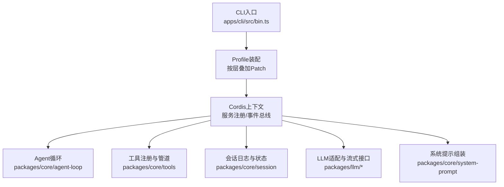
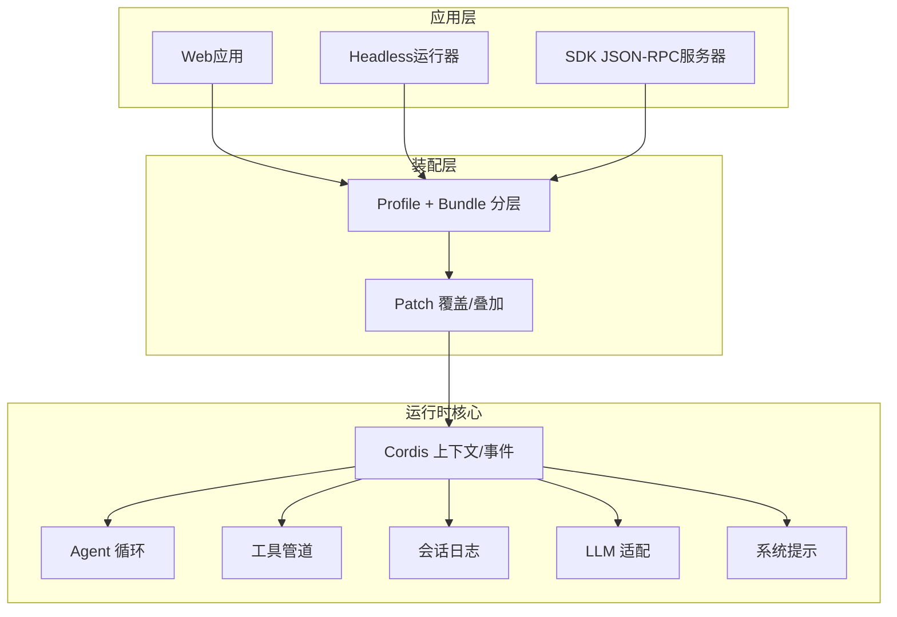
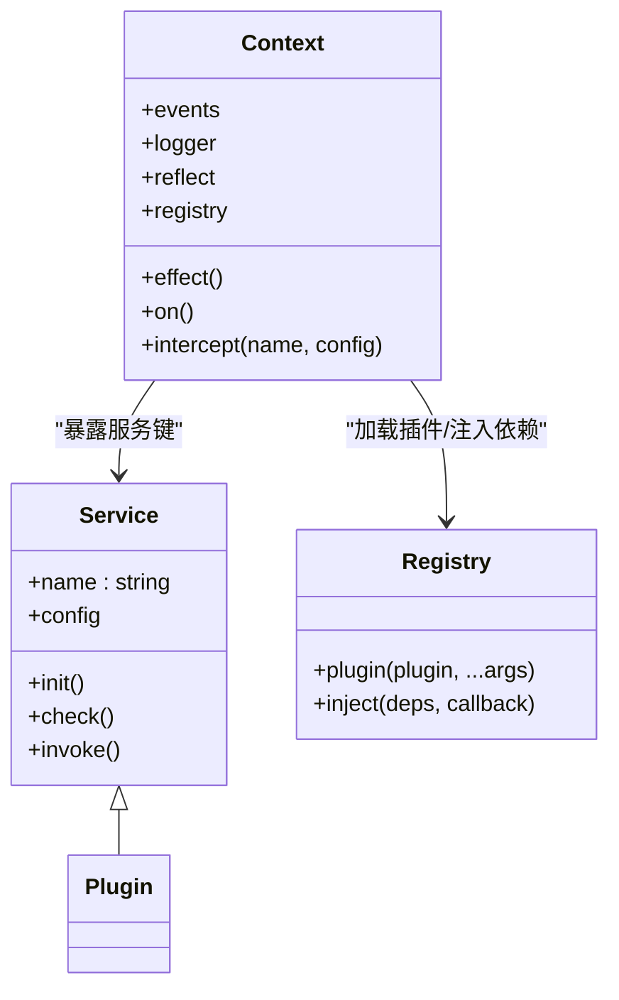
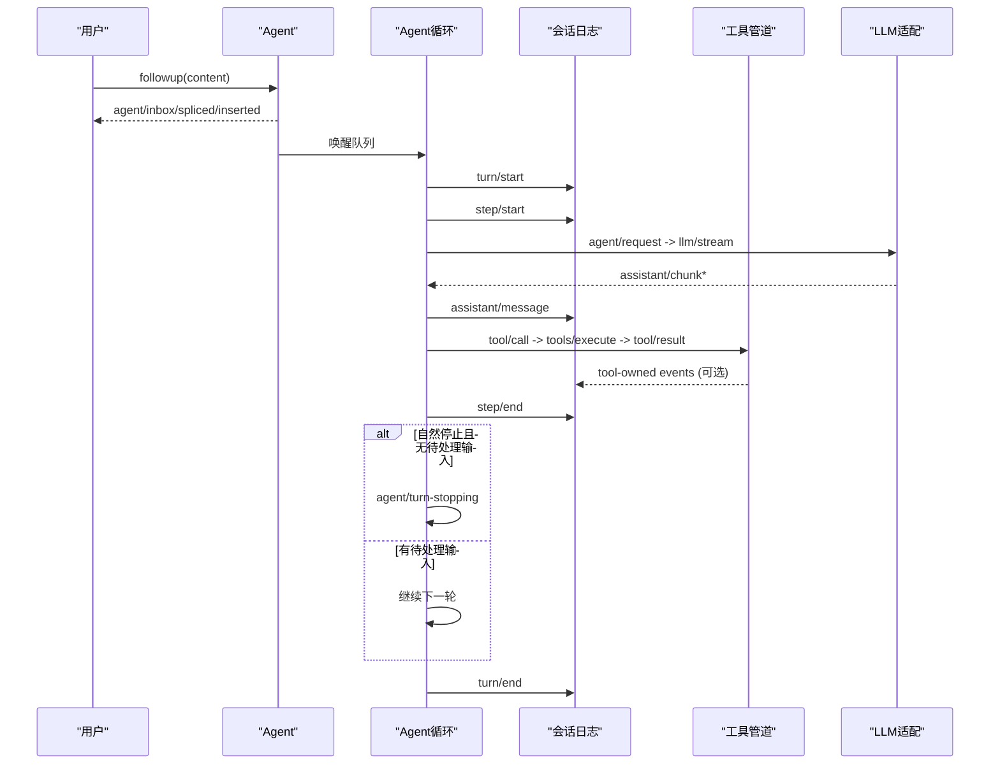
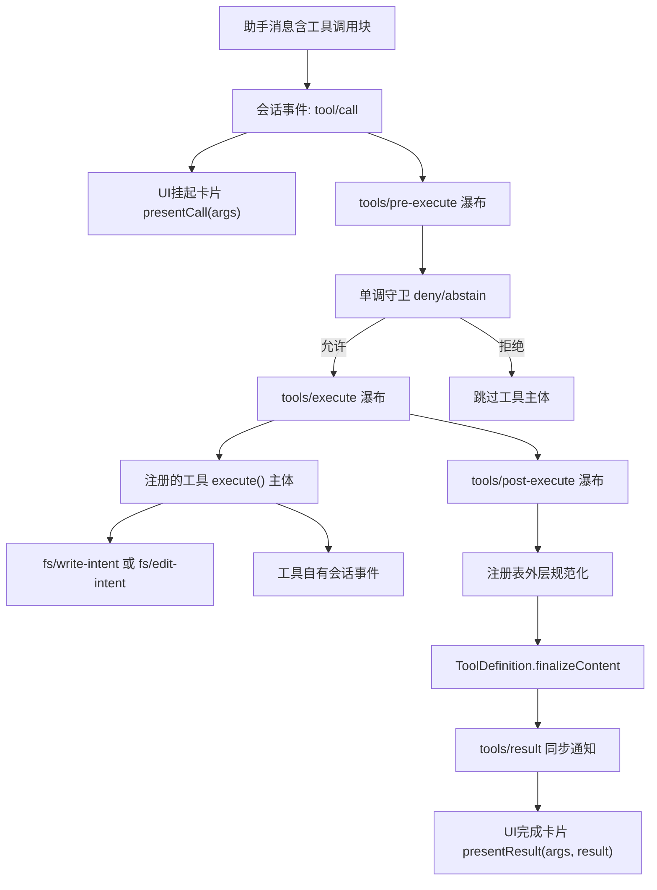
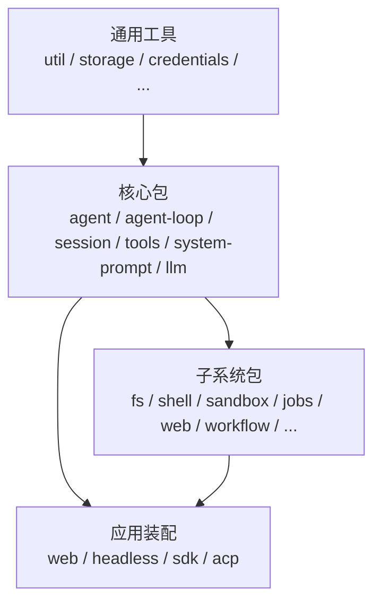
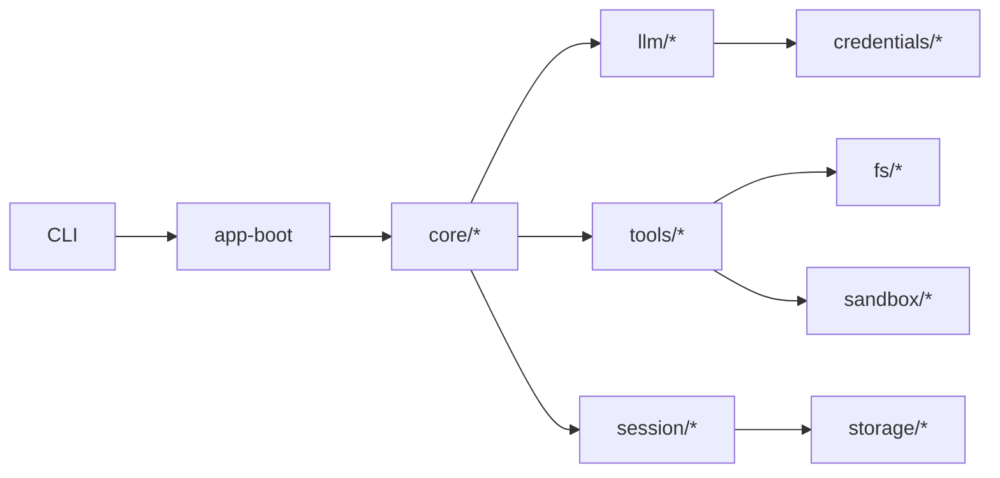
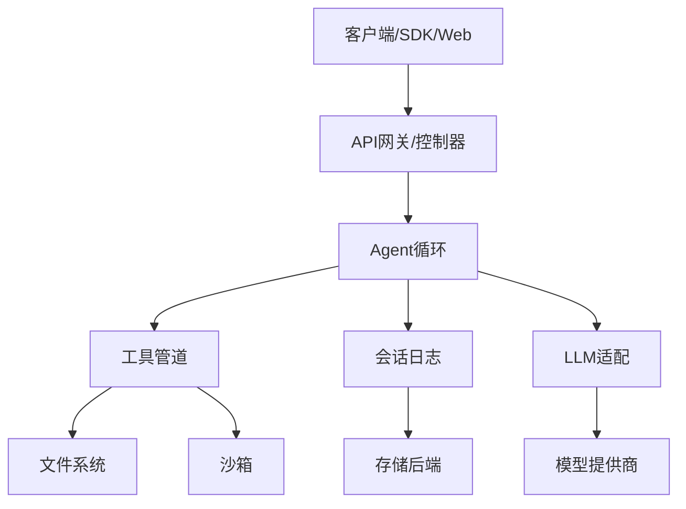

# 架构设计

<cite>
**本文引用的文件**
- [apps/cli/src/bin.ts](file://apps/cli/src/bin.ts)
- [docs/architecture.md](file://docs/architecture.md)
- [docs/cordis-primer.md](file://docs/cordis-primer.md)
- [docs/module-graph.md](file://docs/module-graph.md)
- [docs/tool-execution-pipeline.md](file://docs/tool-execution-pipeline.md)
- [docs/agent-lifecycle.md](file://docs/agent-lifecycle.md)
- [packages/core/agent-loop/src/index.ts](file://packages/core/agent-loop/src/index.ts)
- [packages/core/agent/src/index.ts](file://packages/core/agent/src/index.ts)
- [scripts/cordis-core-api.ts](file://scripts/cordis-core-api.ts)
- [docs/cordis-api/service.md](file://docs/cordis-api/service.md)
- [docs/cordis-api/context.md](file://docs/cordis-api/context.md)
- [docs/cordis-api/registry.md](file://docs/cordis-api/registry.md)
</cite>

## 目录
1. [简介](#简介)
2. [项目结构](#项目结构)
3. [核心组件](#核心组件)
4. [架构总览](#架构总览)
5. [详细组件分析](#详细组件分析)
6. [依赖关系分析](#依赖关系分析)
7. [性能考量](#性能考量)
8. [故障排查指南](#故障排查指南)
9. [结论](#结论)
10. [附录](#附录)

## 简介
本架构设计文档面向DeepSeek Harness（简称dsh）的插件化运行时与Agent系统，目标是帮助开发者快速理解整体架构、Cordis框架设计理念、时空可组合性范式、核心组件关系、数据流与事件驱动机制、模块图与组织方式，以及关键的技术决策、权衡与约束。文档同时提供系统边界定义与组件交互图，便于后续开发与维护。

## 项目结构
- 应用入口：CLI统一入口负责解析参数并分发到不同模式（profile、plugin、dump-config），其中profile模式通过加载分层环境并启动对应Profile进行插件树组装。
- 文档体系：architecture、cordis-primer、module-graph、tool-execution-pipeline、agent-lifecycle等文档定义了插件化、会话与工具执行、Agent生命周期等核心概念。
- 核心包：位于packages/core下的agent、agent-loop、session、system-prompt、tools等构成Agent运行时的基础能力；其他子系统以插件形式挂载到Cordis上下文。
- 构建与配置：Profile与Bundle分层装配，支持热重载与补丁覆盖；CLI命令支持导出当前装配结果以便调试。

图表来源
- [apps/cli/src/bin.ts:1-51](file://apps/cli/src/bin.ts#L1-L51)
- [docs/architecture.md:15-47](file://docs/architecture.md#L15-L47)
- [docs/cordis-primer.md:7-13](file://docs/cordis-primer.md#L7-L13)

章节来源
- [apps/cli/src/bin.ts:1-51](file://apps/cli/src/bin.ts#L1-L51)
- [docs/architecture.md:15-47](file://docs/architecture.md#L15-L47)

## 核心组件
- Cordis插件框架：以Service为基本单元，通过Context暴露稳定键名（如ctx.tools、ctx.llm、ctx.sessions），使用inject声明依赖，事件作为通信与扩展点，注册均为可逆Effect。
- Agent管理系统：提供Agent接口、实时注册表、agent/*事件域；默认驱动实现由agent-loop提供，封装turn/step机器、取消、入队与调度。
- 会话管理：append-only的SessionEvent日志与内存存储，用于推导模型可见历史、回放、持久化、遥测等。
- 工具执行管道：tools/pre-execute、tools/execute、tools/post-execute三段水落式管道，结合单调守卫、审批策略、沙箱、文件系统门控、结果规范化与UI呈现。
- 系统提示与工具Schema：system-prompt负责拼装提示段与工具Schema，使工具能力对模型可见。
- LLM适配与流：消息与流词汇及适配器接缝，支持重试、令牌计量、断点恢复等。

章节来源
- [docs/cordis-primer.md:7-13](file://docs/cordis-primer.md#L7-L13)
- [docs/architecture.md:49-73](file://docs/architecture.md#L49-L73)
- [docs/tool-execution-pipeline.md:1-63](file://docs/tool-execution-pipeline.md#L1-L63)
- [docs/agent-lifecycle.md:1-83](file://docs/agent-lifecycle.md#L1-L83)
- [packages/core/agent-loop/src/index.ts:1-200](file://packages/core/agent-loop/src/index.ts#L1-L200)

## 架构总览
DeepSeek Harness采用“一切皆插件”的微内核架构：无特权核心，所有功能以插件形式贡献服务、类型化事件与可逆效果；通过Profile与Bundle分层装配，支持热重载与补丁覆盖。Agent循环是唯一的运行时编排者，围绕turn/step驱动模型请求与工具调用；会话日志是唯一事实源，保证模型可见输入均可从日志重建。

图表来源
- [docs/architecture.md:15-47](file://docs/architecture.md#L15-L47)
- [docs/cordis-primer.md:7-13](file://docs/cordis-primer.md#L7-L13)

## 详细组件分析

### Cordis框架与时空可组合性
- 插件与服务：插件实现Service，通过Context暴露稳定键名；依赖通过inject声明，避免手动启动顺序。
- 事件与分发：emit、waterfall、parallel、serial、bail五种分发模式，明确契约；waterfall用于中间件式拦截与改写。
- 可逆Effect：注册（提示段、工具Schema、适配器、监听器）通过ctx.effect()/ctx.on()安装，卸载时自动回滚，支持HMR与动态重装载。
- 时空可组合性：通过上下文切片与拦截（intercept）实现作用域内配置覆盖；插件在时间维度可热插拔，空间维度可按Agent/Session隔离。

图表来源
- [docs/cordis-api/service.md:1-67](file://docs/cordis-api/service.md#L1-L67)
- [docs/cordis-api/context.md:68-186](file://docs/cordis-api/context.md#L68-L186)
- [docs/cordis-api/registry.md:1-153](file://docs/cordis-api/registry.md#L1-L153)
- [scripts/cordis-core-api.ts:45-79](file://scripts/cordis-core-api.ts#L45-L79)

章节来源
- [docs/cordis-primer.md:7-13](file://docs/cordis-primer.md#L7-L13)
- [docs/cordis-api/service.md:1-67](file://docs/cordis-api/service.md#L1-L67)
- [docs/cordis-api/context.md:68-186](file://docs/cordis-api/context.md#L68-L186)
- [docs/cordis-api/registry.md:1-153](file://docs/cordis-api/registry.md#L1-L153)

### Agent管理系统与会话管理
- Agent注册表：提供get/list/roots/isOwnedBy等方法，维护活体Agent集合与所有权关系；Agent与Session共享同一身份，简化路由与持久化。
- Agent循环：ReactLoopAgent驱动turn/step机器，处理入队、请求、工具调度、取消与状态更新；创建/销毁为事务化，确保一致性。
- 会话日志：append-only的SessionEvent流，作为模型可见历史的唯一事实源；支持投影、压缩、持久化、遥测与回放。

图表来源
- [docs/agent-lifecycle.md:1-83](file://docs/agent-lifecycle.md#L1-L83)
- [packages/core/agent-loop/src/index.ts:1-200](file://packages/core/agent-loop/src/index.ts#L1-L200)
- [packages/core/agent/src/index.ts:569-608](file://packages/core/agent/src/index.ts#L569-L608)

章节来源
- [packages/core/agent/src/index.ts:569-608](file://packages/core/agent/src/index.ts#L569-L608)
- [packages/core/agent-loop/src/index.ts:1-200](file://packages/core/agent-loop/src/index.ts#L1-L200)
- [docs/agent-lifecycle.md:1-83](file://docs/agent-lifecycle.md#L1-L83)

### 工具执行管道
- 三段水落式管道：pre-execute（钩子、权限、沙箱）、execute（超时、重试、指标）、post-execute（接受/阻止/替换/注入上下文）。
- 单调守卫与审批：拒绝或弃权；审批策略在守卫前解决一次性询问。
- 文件系统门控：fs/write-intent或fs/edit-intent仅允许tool-fs变更；工具自有事件（todo/write、fs/observed、hook/invoked等）在工具体内产生。
- 结果规范化与最终化：快照失败被归一化为isError；definition.finalizeContent强制内容不变量；tools/result同步通知不可变结果。

图表来源
- [docs/tool-execution-pipeline.md:1-63](file://docs/tool-execution-pipeline.md#L1-L63)

章节来源
- [docs/tool-execution-pipeline.md:1-63](file://docs/tool-execution-pipeline.md#L1-L63)

### 数据流设计与事件驱动架构
- 事件分类：会话事件（持久化事实）、Agent事件（live协调与控制）、能力事件（策略与适配器接入）。
- 分发模式：waterfall用于中间件式拦截与改写；serial用于有序检查点；parallel用于并行广播；emit用于通知；bail用于短路。
- 数据流：turn/step边界由会话事件记录；assistant/chunk保留回放与UI保真；工具调用结果经tools/result冻结后注入additionalContexts。

章节来源
- [docs/architecture.md:64-101](file://docs/architecture.md#L64-L101)
- [docs/cordis-primer.md:15-35](file://docs/cordis-primer.md#L15-L35)

### 模块图与组织结构
- 包分组：util、llm、core、goal、fs、skill、subagent、web、spill、todo、plan、hooks、session-query、acp、api、attachment、boot、bundle、client、code-runtime、compaction、context、credentials、e2b、examples、experimental、extensions、feedback、guard、host、identity、interaction、jobs、lsp、mcp、preset、runtime-diagnostics、sandbox、schedule、sdk、session、settings、shell、storage、subprocess、terminal、test-support、typert、webhook、workflow、workspace等。
- 依赖方向：以peerDependencies为运行时依赖信号；核心包（agent、agent-loop、session、tools、system-prompt、llm）被广泛依赖；Bundle与Profile组合具体应用形态。

图表来源
- [docs/module-graph.md:1-800](file://docs/module-graph.md#L1-L800)

章节来源
- [docs/module-graph.md:1-800](file://docs/module-graph.md#L1-L800)

## 依赖关系分析
- 耦合与内聚：核心包高内聚，子系统通过Cordis事件与服务接缝解耦；Bundle将多个子系统组合为可部署形态。
- 直接/间接依赖：CLI依赖app-boot与args解析；agent-loop依赖agent、session、system-prompt、tools、llm；工具包依赖fs、sandbox、user-approval等。
- 循环依赖：通过事件与服务键避免直接导入循环；跨包通过类型声明与事件契约协作。
- 外部集成：LLM适配器、沙箱后端、存储后端、Webhook提供者等通过Provider/Adapter模式接入。

图表来源
- [docs/module-graph.md:1-800](file://docs/module-graph.md#L1-L800)
- [docs/architecture.md:49-73](file://docs/architecture.md#L49-L73)

章节来源
- [docs/module-graph.md:1-800](file://docs/module-graph.md#L1-L800)
- [docs/architecture.md:49-73](file://docs/architecture.md#L49-L73)

## 性能考量
- 工具并发：默认最大并行工具调用数可配置，避免资源争用；bounded parallel pool限制并发度。
- 流式处理：llm/stream与assistant/chunk流式输出，降低首字延迟；工具结果规范化减少异常开销。
- 会话压缩：基于agent/pre-step压力检测与工具结果裁剪，控制上下文大小。
- 持久化与投影：session-projection与缓存提升查询性能；SQL/JSONL后端按需选择。

[本节为通用指导，不直接分析具体文件]

## 故障排查指南
- 启动失败：检查Profile与Bundle装配顺序、Patch覆盖是否正确；使用dump-config查看实际装配结果。
- Agent未就绪：确认agent-loop工厂是否处于活跃状态；检查create/resume事务是否成功发布。
- 工具执行异常：定位tools/pre-execute/execute/post-execute中的拒绝或抛出；检查审批策略与沙箱策略。
- 会话不一致：验证assistant/message与assistant/chunk的一致性；确保所有模型可见输入均通过会话事件记录。

章节来源
- [apps/cli/src/bin.ts:26-49](file://apps/cli/src/bin.ts#L26-L49)
- [packages/core/agent-loop/src/index.ts:32-90](file://packages/core/agent-loop/src/index.ts#L32-L90)
- [docs/tool-execution-pipeline.md:1-63](file://docs/tool-execution-pipeline.md#L1-L63)
- [docs/agent-lifecycle.md:74-83](file://docs/agent-lifecycle.md#L74-L83)

## 结论
DeepSeek Harness通过Cordis插件框架实现了高度可组合、可扩展的Agent运行时。以会话日志为单一事实源、以事件驱动为核心通信机制、以工具管道为扩展点，系统在保持灵活性的同时确保了稳定性与可观测性。Profile与Bundle分层装配使得不同应用场景（Web、Headless、SDK、ACP）可复用核心能力并定制行为。开发者应优先通过事件与服务接缝扩展能力，遵循“一切皆插件”的设计原则，以获得最佳的可维护性与演进能力。

[本节为总结，不直接分析具体文件]

## 附录
- 技术决策与权衡
  - 微内核+插件：避免核心膨胀，增强可替换性；代价是装配复杂度增加。
  - 会话日志为唯一事实源：保证可回放与一致性；需要严格的事件建模。
  - 事件驱动：松耦合与高扩展；需明确分发模式与契约。
  - 工具管道三段式：清晰职责分离；需警惕过度拦截导致性能下降。
- 系统边界
  - 内部：Cordis上下文、Agent循环、工具管道、会话日志。
  - 外部：LLM提供商、沙箱后端、存储后端、Webhook源、UI/SDK客户端。
- 组件交互图

图表来源
- [docs/architecture.md:49-101](file://docs/architecture.md#L49-L101)
- [docs/tool-execution-pipeline.md:1-63](file://docs/tool-execution-pipeline.md#L1-L63)